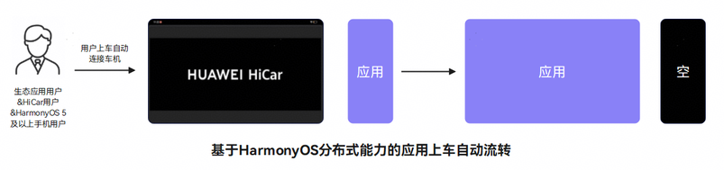
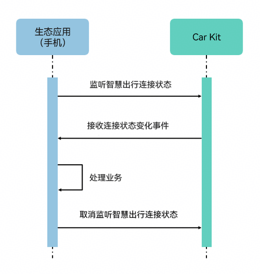

# 监听HiCar的连接状态

更新时间：2026-04-20 06:34:33

来源：https://developer.huawei.com/consumer/cn/doc/harmonyos-guides/car-listener-connect-status

##### 场景介绍

生态应用可以通过监听智慧出行连接状态接口获取连接信息，适配HiCar业务（如：应用流转）。





##### 接口说明

监听HiCar的连接状态使用接口如下：

| 接口名 | 描述 |
| --- | --- |
| on('smartMobilityStatus') | 注册智慧出行连接状态的监听。 |
| off('smartMobilityStatus') | 取消注册智慧出行连接状态的监听。 |


##### 开发流程





##### 开发步骤
1. 导入相关模块。

  
```text
import { smartMobilityCommon } from '@kit.CarKit';
import { hilog } from '@kit.PerformanceAnalysisKit';
```

2. 监听HiCar连接状态。

  应用在适配HiCar时，需要注册智慧出行连接状态的监听，用于对应的业务逻辑处理。

  
```json
try {
  // 获取SmartMobilityAwareness实例
  let awareness: smartMobilityCommon.SmartMobilityAwareness = smartMobilityCommon.getSmartMobilityAwareness();

  // 业务类型
  let types: smartMobilityCommon.SmartMobilityType[] = [smartMobilityCommon.SmartMobilityType.HICAR];

  // 智慧出行连接状态回调函数
  const callBack = (info: smartMobilityCommon.SmartMobilityInfo) => {
    hilog.info(0x0000, 'testTag', 'Received smart mobility info: ', JSON.stringify(info));
    if (info.status === smartMobilityCommon.SmartMobilityStatus.RUNNING) {
      // 连接成功通知
    } else if (info.status === smartMobilityCommon.SmartMobilityStatus.IDLE) {
      // 断开连接通知
    }
  };

  // 注册智慧出行连接状态的监听
  awareness.on('smartMobilityStatus', types, callBack);
} catch (e) {
  // 捕获接口调用异常时的错误码并做相应处理
  hilog.error(0x0000, 'testTag', `on smart mobility status listener error, error code: ${e?.code}`);
}
```

3. 取消监听。

  在应用退出时，需要取消之前注册的监听，减少系统不必要的资源消耗。

  
```text
try {
  // 获取SmartMobilityAwareness实例
  let awareness: smartMobilityCommon.SmartMobilityAwareness = smartMobilityCommon.getSmartMobilityAwareness();
  // 业务类型
  let types: smartMobilityCommon.SmartMobilityType[] = [smartMobilityCommon.SmartMobilityType.HICAR];
  // 取消注册智慧出行连接状态的监听
  awareness.off('smartMobilityStatus', types);
} catch (e) {
  // 捕获接口调用异常时的错误码并做相应处理
  hilog.error(0x0000, 'testTag', `off smart mobility status listener error, error code: ${e?.code}`);
}
```
