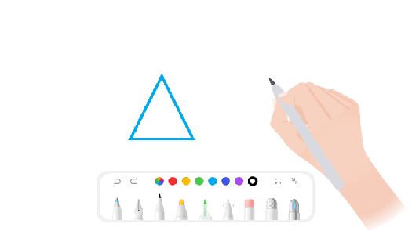

# 接入一笔成形

更新时间：2026-05-12 09:31:20

来源：https://developer.huawei.com/consumer/cn/doc/harmonyos-guides/pen-instant-shape

接入一笔成形功能，可以传入手写笔迹的点位信息、通过手写笔/手指在屏幕上停顿一定的时间后触发此功能，触发功能后将自动识别当前绘制的图形，并生成对应的图像信息。


## 场景介绍

在应用中实现一笔成形，效果如下：

支持获取识别的图像信息，图像信息支持存储。 支持从存储的图像信息中读取信息。

## 接口说明


| 类名 | 接口名 | 说明 |
| --- | --- | --- |
| [InstantShapeGenerator](https://developer.huawei.com/consumer/cn/doc/harmonyos-references/pen-instantsshapegenerator) | [processTouchEvent](https://developer.huawei.com/consumer/cn/doc/harmonyos-references/pen-instantsshapegenerator#processtouchevent) | 传递触摸事件。 |
| [InstantShapeGenerator](https://developer.huawei.com/consumer/cn/doc/harmonyos-references/pen-instantsshapegenerator) | [getPathFromString](https://developer.huawei.com/consumer/cn/doc/harmonyos-references/pen-instantsshapegenerator#getpathfromstring) | 从给定的形状字符串中提取形状信息。 |
| [InstantShapeGenerator](https://developer.huawei.com/consumer/cn/doc/harmonyos-references/pen-instantsshapegenerator) | [notifyAreaChange](https://developer.huawei.com/consumer/cn/doc/harmonyos-references/pen-instantsshapegenerator#notifyareachange) | 通知组件大小变化。 |
| [InstantShapeGenerator](https://developer.huawei.com/consumer/cn/doc/harmonyos-references/pen-instantsshapegenerator) | [setPauseTime](https://developer.huawei.com/consumer/cn/doc/harmonyos-references/pen-instantsshapegenerator#setpausetime) | 设置触发识别的暂停时间，单位：ms。 |
| [InstantShapeGenerator](https://developer.huawei.com/consumer/cn/doc/harmonyos-references/pen-instantsshapegenerator) | [release](https://developer.huawei.com/consumer/cn/doc/harmonyos-references/pen-instantsshapegenerator#release) | 销毁识别工具。 |
| [InstantShapeGenerator](https://developer.huawei.com/consumer/cn/doc/harmonyos-references/pen-instantsshapegenerator) | [onShapeRecognized](https://developer.huawei.com/consumer/cn/doc/harmonyos-references/pen-instantsshapegenerator#onshaperecognized) | 注册识别完成时的回调方法。 |


## 开发步骤

导入相关模块。
```text
import { InstantShapeGenerator, ShapeInfo } from '@kit.Penkit';
```

构造包含一笔成形能力，下面以控件为例：
```text
@Entry
@Component
struct InstantShapeDemo {
  private instantShapeGenerator: InstantShapeGenerator = new InstantShapeGenerator();
  private points: DrawPathPointModel[] = [];
  // 绘制路径
  private drawPath = new Path2D();
  private shapePath = new Path2D();
  private mShapeSuccess = false;
  private settings: RenderingContextSettings = new RenderingContextSettings(true);
  private context: CanvasRenderingContext2D = new CanvasRenderingContext2D(this.settings);
  // 通过回调方法获取识别结果
  private shapeInfoCallback = (shapeInfo: ShapeInfo) => {
    this.shapePath = shapeInfo.shapePath;
    this.mShapeSuccess = true;
    this.context.beginPath();
    this.context.reset();
    this.drawCurrentPathModel(this.shapePath);
  }

  aboutToAppear() {
    console.info('InstantShapeGenerator aboutToAppear');
    // 设置触发识别的暂停时间
    try {
        this.instantShapeGenerator?.setPauseTime(280);
    } catch (error) {
        console.error('setPauseTime failed: ', error);
    }
    // 注册完成时的回调方法
    this.instantShapeGenerator?.onShapeRecognized(this.shapeInfoCallback);
  }

  aboutToDisappear() {
    console.info('InstantShapeGenerator aboutToDisappear');
    this.instantShapeGenerator?.release();
  }

  build() {
    Stack({ alignContent: Alignment.TopEnd }) {
      Canvas(this.context)
        .width('100%')
        .height('100%')
        .onAreaChange((oldValue: Area, newValue: Area) => {
          // 通知组件大小变化。形状的大小（例如圆的半径）根据组件尺寸而变化
          this.instantShapeGenerator?.notifyAreaChange(Number(newValue.width), Number(newValue.height));
        }).onTouch((event: TouchEvent) => {
        // 传递触摸事件
        this.instantShapeGenerator?.processTouchEvent(event);
        switch (event.type) {
          case TouchType.Down:
            this.moveStart(event.touches[0]?.x, event.touches[0]?.y);
            break;
          case TouchType.Move:
            this.moveUpdate(event.touches[0]?.x, event.touches[0]?.y);
            break;
          case TouchType.Up:
            this.moveEnd();
            break;
        }
      })
    }.height('100%').width('100%')
  }

  moveStart(x: number, y: number) {
    this.points.push({ x: x, y: y });
    this.drawPath.moveTo(x, y);
    this.drawCurrentPathModel(this.drawPath);
    this.mShapeSuccess = false;
  }

  moveUpdate(x: number, y: number) {
    let lastPoint = this.points[this.points.length - 1];
    this.points.push({ x: x, y: y });
    this.drawPath.quadraticCurveTo((x + lastPoint?.x) / 2, (y + lastPoint?.y) / 2, x, y);
    if (!this.mShapeSuccess) {
      this.drawCurrentPathModel(this.drawPath);
    }
  }

  moveEnd() {
    this.points = [];
    this.drawPath = new Path2D();
    this.shapePath = new Path2D();
  }

  private drawCurrentPathModel(path: Path2D) {
    this.context.globalCompositeOperation = 'source-over';
    this.context.lineWidth = 8;
    this.context.strokeStyle = '#ED1B1B';
    this.context.lineJoin = 'round';
    this.context.stroke(path);
  }
}

export class DrawPathPointModel {
  x: number = 0;
  y: number = 0;
}
```
