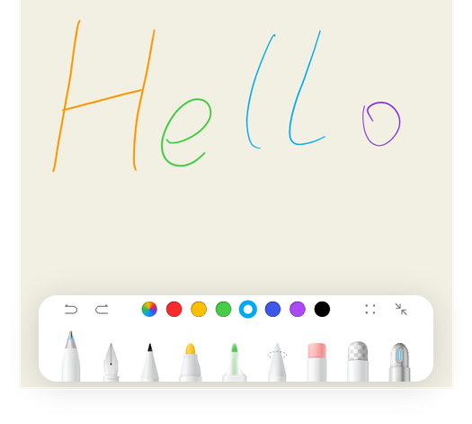

# 接入手写套件

更新时间：2026-05-19 09:13:51

来源：https://developer.huawei.com/consumer/cn/doc/harmonyos-guides/pen-suite

接入手写套件后，可以在应用中创建手写功能界面。界面包括画布和工具栏两部分，画布部分支持手写笔和手指的书写效果绘制，工具栏部分提供多种笔刷和编辑工具，并支持对手写功能进行设置。接入手写套件后将自动开启一笔成形和报点预测功能，无需再单独接入。
从5.1.0(18)开始，手写套件新增支持设置工具栏默认笔刷、各笔刷默认宽度。
从6.0.0(20)开始，手写套件新增支持自定义画布大小、缩略图能力。
从6.1.0(23)开始，手写套件新增禁用画布缩放、设置滚动位置ScrollTo及监听长画布滚动位置、自定义长画布最大高度能力，以及新增悬浮工具栏样式。

#### 场景介绍
在应用中创建手写功能界面，效果如下：

1. 可以加载和显示手写文件。
2. 可以编辑和保存手写文件。
3. Pen Kit手写套件仅支持上下滑动，不支持左右滑动。

#### 开发流程

#### 接口说明

| 接口 | 接口描述 |
| --- | --- |
| [HandwriteComponent](https://developer.huawei.com/consumer/cn/doc/harmonyos-references/pen-handwritecomponent) | 构建画布控件 |
| [HandwriteController](https://developer.huawei.com/consumer/cn/doc/harmonyos-references/pen-handwritecontroller) | 画布的主要功能入口类 |

#### 开发步骤
1. EntryAbility入口设置Context。 import { UIAbility } from '@kit.AbilityKit';
import { window } from '@kit.ArkUI';
import GlobalContext from '../utils/ContextConfig';

export default class EntryAbility extends UIAbility {

  onWindowStageCreate(windowStage: window.WindowStage): void {
 // 主窗口已创建，为此功能设置主页面
 windowStage.loadContent('pages/HandWritingDemo', (err) => {
 if (err.code) {
 return;
 }
 });
 GlobalContext.setContext(this.context);
  }
}
2. 新建GlobalContext类。 import { common } from '@kit.AbilityKit';

declare namespace globalThis {
  let _brushEngineContext: common.UIAbilityContext;
}

export default class GlobalContext {
  static getContext(): common.UIAbilityContext {
 return globalThis._brushEngineContext;
  }

  static setContext(context: common.UIAbilityContext): void {
 globalThis._brushEngineContext = context;
  }
}
3. 构造包含手写组件的控件/页面，下面以控件为例。 import { HandwriteController, HandwriteComponent, PenType, PenHspInfo } from '@kit.Penkit';

@Entry
@Component
struct HandWriteDemoComp {
  controller: HandwriteController = new HandwriteController();
  // 根据应用存储规则，获取到手写文件保存的路径，此处仅为实例参考
  initPath: string = this.getUIContext().getHostContext()?.filesDir + '/aa';
  penWidth: number = 5;
  ballpointPenWidth: number = 6;
  @State yOffset: number = 0;

  aboutToAppear() {
 // 加载时设置保存动作完成后的回调。
 this.controller.onLoad(this.callback);
  }

  // 手写文件内容加载完毕渲染上屏后的回调，通知接入用户，可在此处进行自定义行为
  callback = () => {
 // 自定义行为，例如文件加载完毕后展示用户操作指导
  }

  build() {
 Row() {
 Stack({ alignContent: Alignment.TopStart }) {
 HandwriteComponent({
 handwriteController: this.controller,
 defaultPenType: PenType.PEN, // 可选属性，默认笔刷
 defaultPenInfo: [{ penType: PenType.PEN, penWidth: this.penWidth },
 { penType: PenType.BALLPOINT_PEN, penWidth: this.ballpointPenWidth }] as PenHspInfo[], // 可选属性，各笔刷的默认宽度
 widthRatio: 1, // 可选属性，自定义画布大小，宽度占比（0-1）。
 heightRatio: 1, // 可选属性，自定义画布大小，高度占比（0-1）。
 maxCanvasHeight: 5000, // 可选属性，自定义画布最大高度
 scaleDisabled: false, // 可选属性，是否禁止缩放
 onInit: () => {
 // 画布初始化完成时的回调。此时可以调用接口加载和显示笔记内容
 this.controller?.load(this.initPath);
 },
 onScale: (scale: number) => {
 // 画布缩放时的回调方法，将返回当前手写控件的缩放比例，可在此处进行自定义行为。
 },
 onDidScroll: (yOffset: number) => {
 // 画布滚动时的回调方法，将返回当前滚动位置的纵坐标，可在此处进行自定义行为。
 this.yOffset = yOffset;
 }
 })
 // 保存及获取缩略图。非必要组件，用户可自行调整或删除。
 Button('save')
 .onClick(async () => {
 // 需根据应用存储规则，获取到手写文件保存的路径，此处仅为实例参考
 const path = this.getUIContext().getHostContext()?.filesDir + '/aa';
 await this.controller?.save(path).then().catch((error: Error) => {
 console.error('save err: ' + error.message);
 });
 // 获取缩略图
 this.controller.getThumbnail(this.controller?.getContentRange())?.then((pixelMap: PixelMap) => {
 if (pixelMap) {
 pixelMap.release();
 console.info('getThumbnail success');
 }
 });
 })
 // 设置长画布的滚动位置。当前可滚动最大距离为px2vp(1000000)减去list组件高度。
 Search()
 .searchButton('scrollTo').onSubmit((value: string) => {
 if (!Number.isNaN(Number(value))) {
 this.controller.scrollTo(Number(value));
 }
 }).margin({ top: 100 }).width(220)
 // 当前画布的偏移量。
 Text('onDidScroll:' + this.yOffset)
 .margin({ top: 150 }).width(220)
 }
 .width('100%')
 }
 .height('100%')
  }
}
完整示例代码可参考[手写笔服务（ArkTS）](https://developer.huawei.com/consumer/cn/codelabsPortal/carddetails/tutorials_PenKit-Next-Easy)。