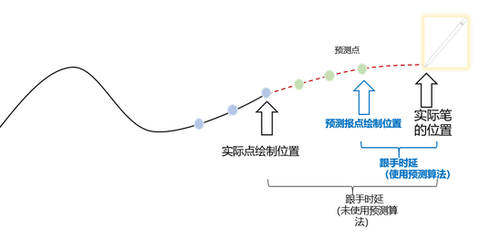

# 接入报点预测

更新时间：2026-04-20 06:34:33

来源：https://developer.huawei.com/consumer/cn/doc/harmonyos-guides/pen-point-prediction-c

从6.0.0(20)开始，报点预测新增C API接口。

接入报点预测功能，可以优化应用中手写效果的绘制跟手性，提升应用中手写笔书写场景的跟手体验。


##### 场景介绍

在应用的自定义界面中，获取到界面的触摸事件，通过调用报点预测的接口，可以得到预测的下一个报点的位置信息。





##### 接口说明

| 名称 | 描述 |
| --- | --- |
| int32_t HMS_HandWrite_GetPredictPoint(const HandWrite_HistoricalPoint *event, int32_t size, float *predictPointX, float *predictPointY) | 获取预测点。 |


##### 接入步骤

报点预测功能的历史点，通常需要在自定义渲染（XComponent）上注册触摸事件回调获得，请参考[自定义渲染开发指南](https://developer.huawei.com/consumer/cn/doc/harmonyos-guides/napi-xcomponent-guidelines)，获得历史触摸点。


##### 在CMake脚本中链接动态库

```text
target_include_directories(entry PUBLIC ${HMOS_SDK_NATIVE}/sysroot/usr/include) # 当编译过程中报点预测头文件缺失时尝试加入此命令
target_link_directories(entry PUBLIC ${HMOS_SDK_NATIVE}/sysroot/usr/lib/aarch64-linux-ohos) # 当编译过程中报点预测API链接异常时尝试加入此命令
target_link_libraries(entry PUBLIC libace_napi.z.so libhilog_ndk.z.so libhandwrite_ndk.z.so)
```


##### 导入模块

```text
#include <ace/xcomponent/native_interface_xcomponent.h>
#include <handwrite/native_handwrite_api.h>
#include <hilog/log.h>
```


##### 示例代码

[native_handwrite_api.h](https://developer.huawei.com/consumer/cn/doc/harmonyos-references/pen-handwrite-headerfile-declare)提供HMS_HandWrite_GetPredictPoint()接口获取预测点。

```text
#include <ace/xcomponent/native_interface_xcomponent.h>
#include <handwrite/native_handwrite_api.h>
#include <hilog/log.h>

void DispatchTouchEvent(OH_NativeXComponent *xcomponent, void *window)
{
    int32_t historicalPointSize = 0;
    OH_NativeXComponent_HistoricalPoint *historicalPoints = nullptr;
    if (OH_NativeXComponent_GetHistoricalPoints(xcomponent, window, &historicalPointSize, &historicalPoints) !=
        OH_NATIVEXCOMPONENT_RESULT_SUCCESS) {
        OH_LOG_Print(LOG_APP, LOG_ERROR, 0x0000, "PenKit", "failed to get historical points");
        return;
    }

    std::vector<HandWrite_HistoricalPoint> handWriteHisPoints(historicalPointSize);
    for (int32_t i = 0; i < historicalPointSize; ++i) {
        handWriteHisPoints[i].x = historicalPoints[i].x;
        handWriteHisPoints[i].y = historicalPoints[i].y;
        handWriteHisPoints[i].timeStamp = historicalPoints[i].timeStamp;
        handWriteHisPoints[i].force = historicalPoints[i].force;
    }

    float predictPointX = 0.0f;
    float predictPointY = 0.0f;
    int32_t errcode = HMS_HandWrite_GetPredictPoint(handWriteHisPoints.data(), historicalPointSize, &predictPointX, &predictPointY);

    OH_LOG_Print(LOG_APP, LOG_INFO, 0x0000, "PenKit", "error code is %{public}d", errcode);
    OH_LOG_Print(LOG_APP, LOG_INFO, 0x0000, "PenKit", "predict point is (%{public}f, %{public}f)", predictPointX, predictPointY);
}
```
