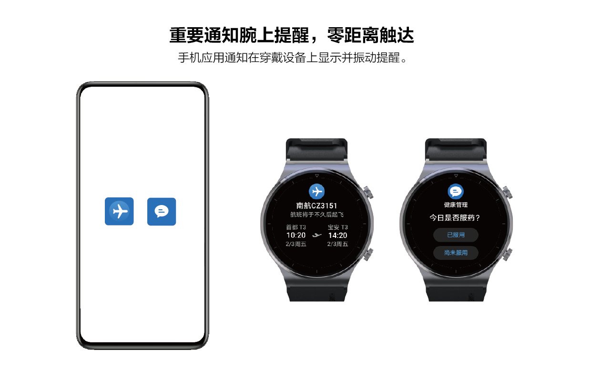
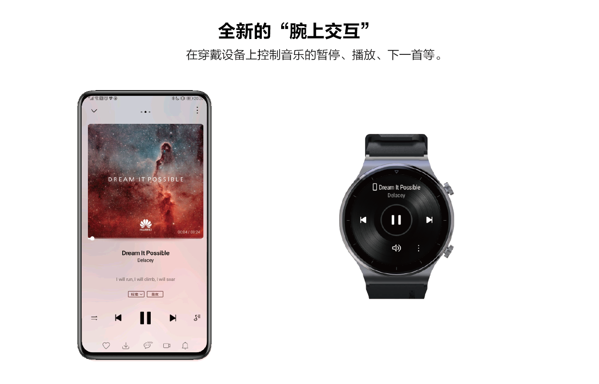
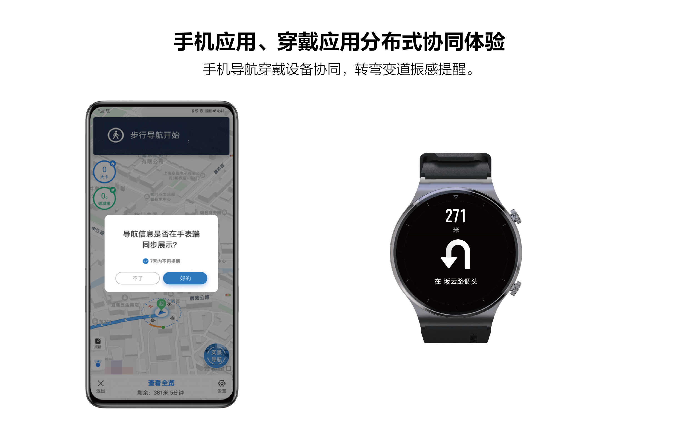
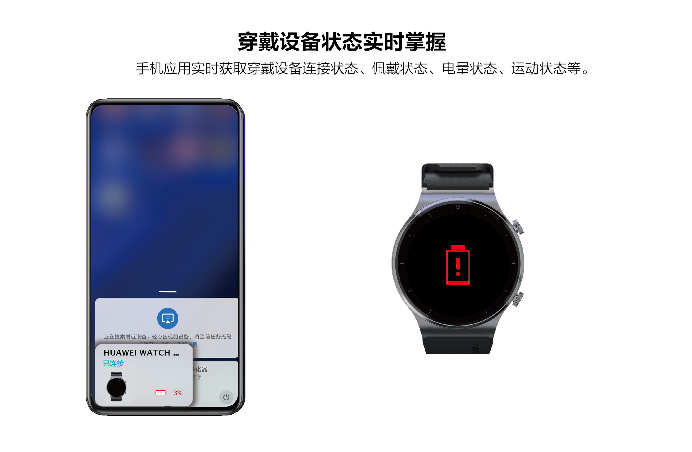

# 场景介绍

更新时间：2026-04-20 06:34:33

来源：https://developer.huawei.com/consumer/cn/doc/harmonyos-guides/scene_introduction

#### 手机与穿戴设备分布式协同

- 重要通知实现腕上提醒，实现即时通知推送，如：在手机侧App中设置日程提醒、用药提醒、任务提醒等数据，可以同步到穿戴设备侧App中，不用打开手机，也可以随时在穿戴设备上查看重要信息。

  

- 为手机应用带来全新的“腕上交互”，如：用手机侧App看视频、听音频时，可以通过穿戴设备侧App操控手机侧App，比如暂停，下一首，停止等。

  

- 手机侧和穿戴侧的实时协同体验。如：在手机侧App开启导航，可以通过穿戴设备侧App提示用户左转、直行、右转等。在走路或骑行时，不用每次拿出手机查看路线。

  

 
  

#### 手机与穿戴设备虚拟化

开发者在手机侧开发App，而不需要在穿戴设备侧开发App。
 
- 穿戴设备状态实时掌握，如：手机侧App实时获取穿戴设备侧连接状态、佩戴状态、电量状态等，给用户提供更多增值服务。

  

- 穿戴设备传感器：手机侧App读取穿戴设备的传感器数据（如ECG、PPG、ACC数据等）。

  
> [!NOTE]
> 传感器受限发布，仅限专业研究机构使用。
