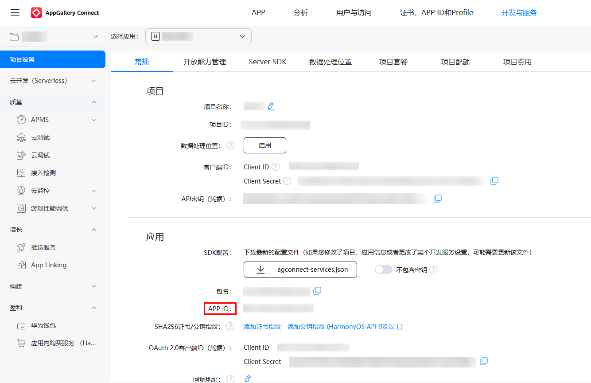

# 使用AppInfo时，如何获取应用身份标识

更新时间：2026-03-09 07:25:19

来源：https://developer.huawei.com/consumer/cn/doc/harmonyos-guides/wearengine_faq-9

应用开发中需要使用AppInfo时，其中fingerprint可采用AppGallery Connect平台提供的应用ID值来标识应用的唯一身份。

 可通过登录[AppGallery Connect](https://developer.huawei.com/consumer/cn/service/josp/agc/index.html)平台，在“开发与服务”中选择目标应用，获取“项目设置 > 常规 > 应用”的APP ID。

 
