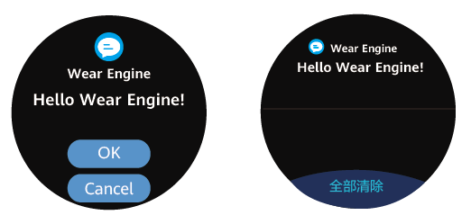

# 穿戴设备模板化通知

更新时间：2026-04-20 06:34:33

来源：https://developer.huawei.com/consumer/cn/doc/harmonyos-guides/device_notification

手机侧应用向穿戴设备发送通知，并在穿戴设备上按模板显示，支持穿戴设备收到通知后同步振动或响铃（跟随穿戴设备系统设置）。执行成功后，穿戴设备上会显示下图所示通知界面。

该接口无需用户授权，仅需要确保应用已申请消息通知权限（参见[申请接入Wear Engine服务](https://developer.huawei.com/consumer/cn/doc/harmonyos-guides/wearengine_apply)），否则接口将调用失败。




> [!NOTE]
> 穿戴设备侧无对应的应用也可以显示模板化通知。 请确保穿戴设备和华为运动健康App处于连接状态。用户可进入App“设备”界面查看设备是否在线。开发者可调用getConnectedDevices方法了解设备是否在线，如果返回列表中不包含目标设备，则提醒用户重新连接该设备。 穿戴设备振动或响铃的条件： 穿戴设备侧已开启振动或响铃； 穿戴设备处于佩戴状态； 穿戴设备未开启勿扰模式。 通知在穿戴设备上自动弹出通知的条件： 穿戴设备处于佩戴状态； 穿戴设备未开启勿扰模式。


## 向穿戴设备侧发送通知


> [!NOTE]
> 该接口的调用需要在开发者联盟申请消息通知权限（请参考申请接入Wear Engine服务）。

参见[已连接穿戴设备查询](https://developer.huawei.com/consumer/cn/doc/harmonyos-guides/query_connected_devices)章节，获取已连接设备列表。 参见[目标设备选择](https://developer.huawei.com/consumer/cn/doc/harmonyos-guides/we-device-selection)章节，从已连接设备列表中选定需要通信的设备。 调用[wearEngine](https://developer.huawei.com/consumer/cn/doc/harmonyos-references/wearengine_api)中的[getNotifyClient](https://developer.huawei.com/consumer/cn/doc/harmonyos-references/wearengine_api#wearenginegetnotifyclient)方法，获取[NotifyClient](https://developer.huawei.com/consumer/cn/doc/harmonyos-references/wearengine_api#notifyclient)对象。 定义[NotificationOptions](https://developer.huawei.com/consumer/cn/doc/harmonyos-references/wearengine_api#notificationoptions)配置参数类。 调用[notify](https://developer.huawei.com/consumer/cn/doc/harmonyos-references/wearengine_api#notify)方法，从手机上的应用发送通知到穿戴设备侧。
```text
// 步骤3 获取NotifyClient对象
let notifyClient: wearEngine.NotifyClient = wearEngine.getNotifyClient(this.getUIContext().getHostContext());

// 步骤4 构造NotificationOptions对象
let button1: wearEngine.NotificationButton = {
  buttonId: wearEngine.ButtonId.FIRST_BUTTON,
  // 按钮内容最大长度为12字节
  content: 'button_1'
}
let type1Notification: wearEngine.Notification = {
  type: wearEngine.NotificationType.NOTIFICATION_WITH_ONE_BUTTON,
  // 包名与标题的最大长度为28字节
  bundleName: 'bundleName',
  title: 'title',
  // 消息内容最大长度为400字节
  text: 'text',
  buttons: [button1]
}
let options: wearEngine.NotificationOptions = {
  notification: type1Notification,
  onAction: (feedback: wearEngine.NotificationFeedback) => {
    console.info(`one button notify get feedback is ${feedback.action ? feedback.action : feedback.errorCode}`);
  }
}

// 步骤5 发送模板化通知至设备侧
notifyClient.notify(targetDevice.randomId, options).then(result => {
  console.info(`Succeeded in sending notification.`);
}).catch((error: BusinessError) => {
  console.error(`Failed to send notification. Code is ${error.code}, message is ${error.message}`);
})
```
