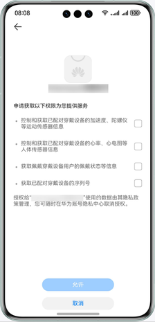

# 请求用户授权

更新时间：2026-04-20 06:34:33

来源：https://developer.huawei.com/consumer/cn/doc/harmonyos-guides/request_user_authorization

为保护用户隐私，Wear Engine的API需要用户授权才可以正常访问。建议开发者在用户首次调用Wear Engine开放能力的时候执行本章节操作。


##### 申请用户穿戴设备权限

应用拉起华为账号登录和授权界面，由用户授权相应的数据访问权限。用户可以自主选择授权的数据类型，可以只授权部分数据权限。




1. 应用调用[wearEngine](https://developer.huawei.com/consumer/cn/doc/harmonyos-references/wearengine_api)中的[getAuthClient](https://developer.huawei.com/consumer/cn/doc/harmonyos-references/wearengine_api#wearenginegetauthclient)方法，获取[AuthClient](https://developer.huawei.com/consumer/cn/doc/harmonyos-references/wearengine_api#authclient)对象。
2. 定义需要用户授权的权限请求类[AuthorizationRequest](https://developer.huawei.com/consumer/cn/doc/harmonyos-references/wearengine_api#authorizationrequest)。
3. 调用[requestAuthorization](https://developer.huawei.com/consumer/cn/doc/harmonyos-references/wearengine_api#requestauthorization)方法，向用户请求权限。执行成功后，会弹出授权界面，让用户选择授予权限（若未登录华为账号则会先弹出登录界面）。当用户允许后才能正常使用接口，否则会遇到错误码为201的提示。

  
> [!TIP]
> 请确保向用户请求的权限已在 申请接入Wear Engine服务 中审批通过，否则会遇到错误码为1008500004的提示。 该功能可以多次调用，如果申请的权限之前已经授予了，不会再弹出授权页面，接口会返回已经授权的权限。 通过入参的 AuthorizationRequest 对象，获取应用需要的权限。参见步骤3中 权限说明 了解应用所需请求的权限类型。 通过 AuthorizationResponse 对象，返回用户的授权结果。


  
```text
// 在使用Wear Engine服务前，请导入WearEngine与相关模块
import { wearEngine } from '@kit.WearEngine';
import { BusinessError } from '@kit.BasicServicesKit';

// 步骤1：获取AuthClient对象
let authClient: wearEngine.AuthClient = wearEngine.getAuthClient(this.getUIContext().getHostContext());

// 步骤2：基于需要用户授权的权限定义权限请求类
let request: wearEngine.AuthorizationRequest = {
  permissions: [wearEngine.Permission.USER_STATUS]
}

// 步骤3：请求用户授权
authClient.requestAuthorization(request).then(result => {
  console.info(`Succeeded in requesting authorize, authorized permissions is ${result.permissions}`);
}).catch((error: BusinessError) => {
  console.error(`Failed to request authorize. Code is ${error.code}, message is ${error.message}`);
})
```


##### 查询用户授权结果

用于查询已被用户授予的应用权限。如果所需权限用户未授权，请参见上一节[申请用户穿戴设备权限](#申请用户穿戴设备权限)向用户请求权限。建议在请求用户授权前，先使用该接口查询应用是否已有相关权限。

> [!NOTE]
> 请确保权限已在 申请接入Wear Engine服务 中审批通过，否则会遇到错误码为1008500004的提示。

1. 应用调用[wearEngine](https://developer.huawei.com/consumer/cn/doc/harmonyos-references/wearengine_api)中的[getAuthClient](https://developer.huawei.com/consumer/cn/doc/harmonyos-references/wearengine_api#wearenginegetauthclient)方法，获取[AuthClient](https://developer.huawei.com/consumer/cn/doc/harmonyos-references/wearengine_api#authclient)对象。
2. 调用[getAuthorization](https://developer.huawei.com/consumer/cn/doc/harmonyos-references/wearengine_api#getauthorization)方法，查询用户已授权的权限。

  
```text
// 在使用Wear Engine服务前，请导入WearEngine与相关模块
import { wearEngine } from '@kit.WearEngine';
import { BusinessError } from '@kit.BasicServicesKit';

// 步骤1：获取AuthClient对象
let authClient: wearEngine.AuthClient = wearEngine.getAuthClient(this.getUIContext().getHostContext());

// 步骤2：调用API查询已授权权限
authClient.getAuthorization().then(result => {
  console.info(`Succeeded in getting authorized permissions, authorized permissions is ${result.permissions}`);
}).catch((error: BusinessError) => {
  console.error(`Failed to get authorized permissions. Code is ${error.code}, message is ${error.message}`);
})
```
