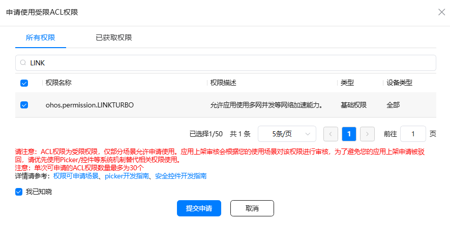
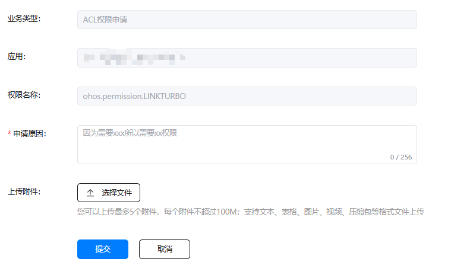
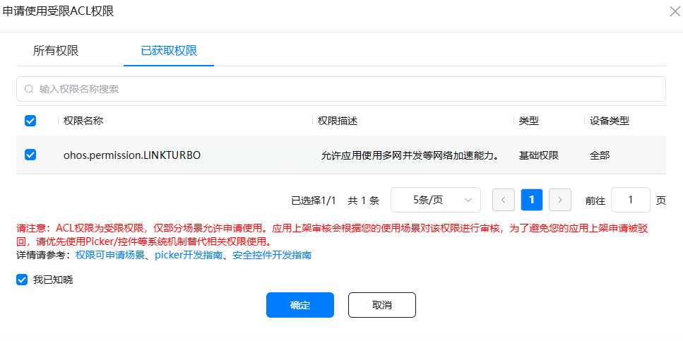

# 开发准备

更新时间：2026-04-20 06:34:33

来源：https://developer.huawei.com/consumer/cn/doc/harmonyos-guides/networkboost-preparations

#### 申请权限

  

#### 场景概述

应用在使用Network Boost Kit能力前需要检查是否已经获取对应权限。如未获得授权，需要声明对应权限。
 
Network Boost Kit所需权限有：
 
ohos.permission.GET_NETWORK_INFO：用户获取设备网络信息。
 
ohos.permission.INTERNET：允许使用因特网访问网络。
 
ohos.permission.LINKTURBO: 允许应用使用多网并发等网络加速能力，连接迁移能力部分接口需要该权限，如果不使用该能力，不需要申请该权限。
 
必须手动配置上述权限后才能使用，详细配置参见[申请权限步骤](#申请权限步骤)。
 
其中ohos.permission.LINKTURBO权限为受限ACL权限，需要特别配置和申请，具体操作步骤参考[配置签名](#配置签名)和[受限ACL权限申请](#受限acl权限申请)。
 
  

#### 申请权限步骤

需要在entry/src/main路径下的module.json5中配置所需申请的权限。示例代码如下所示：
 
```text
{
  "module": {
    "requestPermissions": [
      {
        "name": "ohos.permission.GET_NETWORK_INFO"
      },
      {
        "name": "ohos.permission.INTERNET"
      },
      {
        "name": "ohos.permission.LINKTURBO"
      }
    ]
  }
}
```
 
  

#### C API开发准备

除上述权限配置外，C API使用时还需要在CMakeLists.txt中设置动态库路径及头文件路径，并进行链接。
 
如编译target为entry，则添加如下命令：
 
```text
target_include_directories(entry PUBLIC ${HMOS_SDK_NATIVE}/sysroot/usr/include)
target_link_directories(entry PUBLIC ${HMOS_SDK_NATIVE}/sysroot/usr/lib/aarch64-linux-ohos)
target_link_libraries(entry PUBLIC libnetwork_boost.so) #链接libnetwork_boost.so及其他依赖的so
```
 
  

#### 配置签名

- 调试阶段需要在AGC中[申请调试证书](https://developer.huawei.com/consumer/cn/doc/app/agc-help-add-debugcert-0000001914263178)、[注册调试设备](https://developer.huawei.com/consumer/cn/doc/app/agc-help-add-device-0000001946142249)、[申请调试Profile](https://developer.huawei.com/consumer/cn/doc/app/agc-help-add-debugprofile-0000001914423102)后，再[手动签名](https://developer.huawei.com/consumer/cn/doc/harmonyos-guides/ide-signing#section297715173233)，或者通过DevEco Studio自动签名完成申请，在自动签名的过程中，将由DevEco Studio完成向AGC申请受限权限的步骤，开发者可直接使用，具体请参考[自动签名-操作步骤](https://developer.huawei.com/consumer/cn/doc/harmonyos-guides/ide-signing#section151231211105010)。
- 发布阶段**必须在AGC中重新**[申请发布证书](https://developer.huawei.com/consumer/cn/doc/app/agc-help-add-releasecert-0000001946273961)、[发布Profile文件](https://developer.huawei.com/consumer/cn/doc/app/agc-help-add-releaseprofile-0000001914714796)，并完成[配置签名信息](https://developer.huawei.com/consumer/cn/doc/harmonyos-guides/ide-publish-app#section280162182818)。

 
  

#### 受限ACL权限申请
1. [申请调试Profile](https://developer.huawei.com/consumer/cn/doc/app/agc-help-add-debugprofile-0000001914423102)和[发布Profile文件](https://developer.huawei.com/consumer/cn/doc/app/agc-help-add-releaseprofile-0000001914714796)中第4步“申请权限”是必须的，选中“受限ACL权限”后再点击“选择”。

  


2. 在权限搜索框中输入"ohos.permission.LINKTURBO"找到LINKTURBO的权限并勾选，再提交申请。

  


3. 根据实际业务需求填写申请原因并提交，提交后将在1个工作日回复，可以[互动中心](https://developer.huawei.com/consumer/cn/service/josp/agc/index.html#/interactive)查看申请情况。

  


4. 权限申请通过后在“已获取权限”中可以看到已申请的权限，勾选后点击确定。

  


5. 选择权限后点击“添加”生成新的Profile文件，下载后按[手动签名](https://developer.huawei.com/consumer/cn/doc/harmonyos-guides/ide-signing#section297715173233)替换profile文件。
6. 在工程中entry模块的module.json5文件中，在"requestPermissions"节点添加"ohos.permission.LINKTURBO"权限，如下所示：
 
```text
"requestPermissions": [{
  "name": "ohos.permission.LINKTURBO"
}]
```
