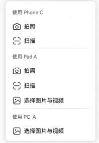

# 跨设备互通NDK特性概述

更新时间：2026-05-12 09:31:20

来源：https://developer.huawei.com/consumer/cn/doc/harmonyos-guides/servicecollaboration-servicendk-description

跨设备互通提供相机、扫描以及图库（图片和视频）的跨设备调用能力，TV、Tablet或PC/2in1设备可以调用Phone的相机、扫描、图库等功能。

> [!NOTE]
> 本章节以拍照为例展开介绍，扫描、图库功能的使用与拍照类似。

用户在TV、Tablet或PC/2in1设备上使用富文本类编辑应用（如：备忘录、邮件、笔记等）时，想要拍摄一些照片作为素材，但是当前设备拍摄不太方便。通过跨设备互通-拍照，用户可以在当前设备的应用中指定Tablet或Phone设备，并打开Tablet或Phone的相机来拍摄所需的素材。通过Phone或者Tablet设备拍摄，移动更便利、取景更灵巧、相机能力也更强大。拍摄的照片将实现快速回传到TV、Tablet或PC/2in1设备的应用中，帮助用户高效完成图文并茂的文档设计。

如果同一组网下有多台Phone或Tablet设备，用户可以选择不同的设备进行拍摄。

#### 运作机制

基于分布式协同框架面向跨设备拍照的业务场景，为您提供了 [HMS_ServiceCollaboration_GetCollaborationDeviceInfos](https://developer.huawei.com/consumer/cn/doc/harmonyos-references/servicecollaboration-capi-module#hms_servicecollaboration_getcollaborationdeviceinfos)（设备列表接口）、[HMS_ServiceCollaboration_StartCollaboration](https://developer.huawei.com/consumer/cn/doc/harmonyos-references/servicecollaboration-capi-module#hms_servicecollaboration_startcollaboration)（跨端拍照、扫描、拉起图库选择图片）或[HMS_ServiceCollaboration_StartCollaborationV2](https://developer.huawei.com/consumer/cn/doc/harmonyos-references/servicecollaboration-capi-module#hms_servicecollaboration_startcollaborationv2)（跨端拍照、扫描、拉起图库选择图片和视频）和 [HMS_ServiceCollaboration_StopCollaboration](https://developer.huawei.com/consumer/cn/doc/harmonyos-references/servicecollaboration-capi-module#hms_servicecollaboration_stopcollaboration)（终止跨设备互通）四个接口。只需要调用这四个接口，即可完成跨设备互通，无需关注分布式场景下数据传输、指令控制等具体细节。
1. **系统分布式协同框架跨设备自动建链**

  a. 通过系统的分布式协同框架，同账号下的本端设备（PC/2in1设备/Tablet）与远端设备（Phone/Tablet）自动建立连接。系统将自动完成设备的发现、连接、认证等流程，通过[HMS_ServiceCollaboration_GetCollaborationDeviceInfos](https://developer.huawei.com/consumer/cn/doc/harmonyos-references/servicecollaboration-capi-module#hms_servicecollaboration_getcollaborationdeviceinfos)接口提供可用的具有相机、扫描和图库能力的远端设备信息。

  

  b. 通过[HMS_ServiceCollaboration_StartCollaboration](https://developer.huawei.com/consumer/cn/doc/harmonyos-references/servicecollaboration-capi-module#hms_servicecollaboration_startcollaboration)或者[HMS_ServiceCollaboration_StartCollaborationV2](https://developer.huawei.com/consumer/cn/doc/harmonyos-references/servicecollaboration-capi-module#hms_servicecollaboration_startcollaborationv2)拉起对应跨设备互通能力，通过[HMS_ServiceCollaboration_StopCollaboration](https://developer.huawei.com/consumer/cn/doc/harmonyos-references/servicecollaboration-capi-module#hms_servicecollaboration_stopcollaboration)终止跨设备互通能力。分布式协同框架会将远端拍摄状态信息实时回传到应用侧，应用侧会根据错误码做相关提示。

  拍摄状态可能为：对端设备拍摄中、图片导入中、协同失败、本端WLAN未开启、双端WLAN或者蓝牙未开启。具体拍摄状态提示可由应用选择绘制，对应提示信息参考[ServiceCollaborationEventCode](https://developer.huawei.com/consumer/cn/doc/harmonyos-references/servicecollaboration-capi-module#servicecollaborationeventcode-1)。

| 对端设备拍摄中 | 图片导入中 | 协同失败 | 本端WLAN未开启 | 双端WLAN或者蓝牙未开启 |

| --- | --- | --- | --- | --- |

|  |  |  |  |  |
2. **用户使用远端设备拍照**

  
 - 用户使用远端设备完成拍照并确认，照片将回传到本端设备的应用，完成整个流程。

3. 远端设备将自动退出相机界面，回到初始状态。
