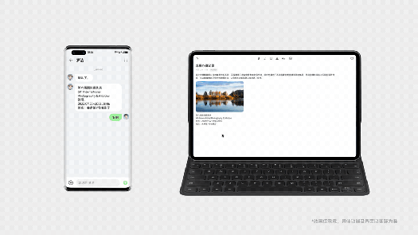
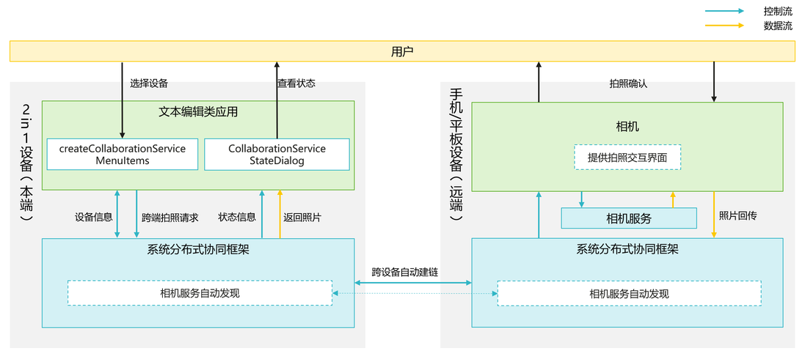

# 跨设备互通特性简介

更新时间：2026-05-12 09:31:20

来源：https://developer.huawei.com/consumer/cn/doc/harmonyos-guides/servicecollaboration-service-overview

对于API 6.0.0(20)之前版本，仅支持匹配跨端拍照、文档扫描、图库选择器；对于API 6.0.0(20)及之后版本，支持匹配跨端拍照、文档扫描、图库选择器、视频选择器、图片和视频选择器；从API 6.1.0(23)开始，TV、Phone、Tablet或PC/2in1设备可调用具备如下能力的远程设备：支持拍照、扫描及图库（图片与视频）能力的Phone和Tablet，支持图库（图片与视频）能力的PC/2in1设备。

跨设备互通提供相机、扫描以及图库（图片和视频）的跨设备调用能力，例如：Tablet或PC/2in1设备可以调用Phone的相机、扫描、图库等功能。

> [!NOTE]
> 本章节以拍照为例展开介绍，扫描、图库功能的使用与拍照类似。

用户在Tablet、PC/2in1设备或Phone上使用富文本类编辑应用（如：备忘录、邮件、笔记等）时，想要拍摄一些照片作为素材，但是当前设备拍摄不太方便。通过跨设备互通-拍照，用户可以在当前设备的应用中指定Tablet或Phone设备，并打开Tablet或Phone的相机来拍摄所需的素材。通过Phone或者Tablet设备拍摄，移动更便利、取景更灵巧、相机能力也更强大。拍摄的照片将实现快速回传到Tablet或PC/2in1设备的应用中，帮助用户高效完成图文并茂的文档设计。

如果同一组网下有多台Phone或Tablet设备，用户可以选择不同的设备进行拍摄。

## 运作机制

基于分布式协同框架面向跨设备拍照的业务场景，为您提供了[createCollaborationServiceMenuItems](https://developer.huawei.com/consumer/cn/doc/harmonyos-references/servicecollaboration-collaborationservice#createcollaborationservicemenuitems)（相机设备列表组件）和[CollaborationServiceStateDialog](https://developer.huawei.com/consumer/cn/doc/harmonyos-references/servicecollaboration-collaborationservice#collaborationservicestatedialog)（远端相机状态弹窗组件）两个组件。应用只需要调用这两个组件，即可完成跨端拍照，无需关注分布式场景下数据传输、指令控制等具体细节。

跨设备互通-拍照的具体流程如上图所示。 **系统分布式协同框架跨设备自动建链** 通过系统的分布式协同框架，同账号下的本端设备（PC/2in1设备/Tablet）与远端设备（Phone/Tablet）自动建立连接。系统将自动完成设备的发现、连接、认证等流程，将可用的具有相机能力的远端设备信息提供给应用，并通过[createCollaborationServiceMenuItems](https://developer.huawei.com/consumer/cn/doc/harmonyos-references/servicecollaboration-collaborationservice#createcollaborationservicemenuitems)（相机设备列表组件）展示。 [createCollaborationServiceMenuItems](https://developer.huawei.com/consumer/cn/doc/harmonyos-references/servicecollaboration-collaborationservice#createcollaborationservicemenuitems)（相机设备列表组件）将展示附近可用的设备信息。当附近一个或两个可用设备时，将直接显示该设备信息；当附近有两个以上可用设备时，将自动创建子菜单项，层叠显示多个设备信息。
| 附近仅有一个或两个可用设备 | 附近有两个以上可用设备 |
| --- | --- |
|  |  |

**用户在本端应用界面操作，唤醒相机** 用户在应用界面上，通过[createCollaborationServiceMenuItems](https://developer.huawei.com/consumer/cn/doc/harmonyos-references/servicecollaboration-collaborationservice#createcollaborationservicemenuitems)（相机设备列表组件）选择远端设备。应用将通过分布式协同框架发起跨端拍照请求，唤醒对应设备上的相机。 系统将自动唤醒对端设备上的相机，进入拍照预览界面。设备屏幕将自动点亮，用户拿起设备就可以拍照。 分布式协同框架会将远端拍摄状态信息实时回传到组件[CollaborationServiceStateDialog](https://developer.huawei.com/consumer/cn/doc/harmonyos-references/servicecollaboration-collaborationservice#collaborationservicestatedialog)（远端相机状态弹窗组件），[createCollaborationServiceMenuItems](https://developer.huawei.com/consumer/cn/doc/harmonyos-references/servicecollaboration-collaborationservice#createcollaborationservicemenuitems)（相机设备列表组件）显示在应用界面供用户查看。 拍摄状态可能为：对端设备拍摄中、图片导入中、协同失败、本端WLAN未开启、双端WLAN或者蓝牙未开启。
| 对端设备拍摄中 | 图片导入中 | 协同失败 | 本端WLAN未开启 | 双端WLAN或者蓝牙未开启 |
| --- | --- | --- | --- | --- |
|  |  |  |  |  |

当提示失败（包括协同失败、本端WLAN未开启、双端WLAN或者蓝牙未开启）时，需要用户根据提示打开对应设备的WLAN或蓝牙，然后重新点击[createCollaborationServiceMenuItems](https://developer.huawei.com/consumer/cn/doc/harmonyos-references/servicecollaboration-collaborationservice#createcollaborationservicemenuitems)（相机设备列表组件）触发流程。 **用户使用远端设备拍照** 用户使用远端设备完成拍照并确认，照片将回传到本端设备的应用，完成整个流程。 远端设备将自动退出相机界面，回到初始状态。
