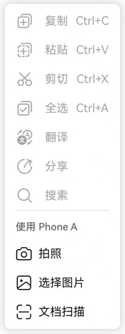
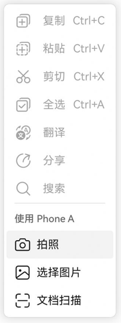
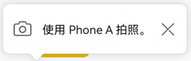
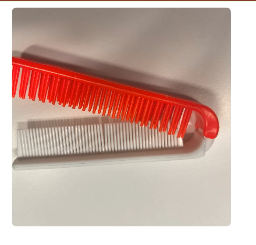

# 跨设备互通（RichEditor控件）

更新时间：2026-05-12 09:31:20

来源：https://developer.huawei.com/consumer/cn/doc/harmonyos-guides/servicecollaboration-richeditor-title

富文本控件[RichEditor](https://developer.huawei.com/consumer/cn/doc/harmonyos-references/ts-basic-components-richeditor)已集成跨设备互通能力。在Tablet或PC/2in1设备上，用户可通过其右键菜单调用Phone的相机、扫描及图库（访问图片）功能。
  

#### 场景介绍

您通过此能力实现跨设备交互，可以使用其他设备的相机、扫描和图库功能。
 
  

#### 约束与限制

需同时满足以下条件，才能使用该功能：
 
- **设备限制**

  
本端设备：HarmonyOS版本为HarmonyOS NEXT及以上的Tablet或PC/2in1设备。
- 远端设备：HarmonyOS版本为HarmonyOS NEXT及以上、具有相机能力的Phone或Tablet设备。

  - **使用限制**

  
双端设备需要登录同一华为账号。
- 跨设备互通API支持根据特定调用策略调用设备。调用策略：PC/2in1设备可以调用Tablet和Phone，Tablet可以调用Phone，同类型设备不可调用。
- 双端设备需要打开WLAN和蓝牙开关。条件允许时，建议双端设备接入同一个局域网，可提升唤醒相机的速度。

  
 
  

#### 开发步骤

添加[RichEditor](https://developer.huawei.com/consumer/cn/doc/harmonyos-references/ts-basic-components-richeditor)富文本组件，即可在富文本组件中右键中选择其他设备进行导入，通过onWillChange属性对回传的照片进行处理。
 
```text
@Entry
@Component
struct Index {
  controller: RichEditorController = new RichEditorController();
  options: RichEditorOptions = { controller: this.controller };

  build() {
    Column() {
      Column() {
        RichEditor(this.options)
          .onWillChange((value: RichEditorChangeValue) => {
            if (value?.replacedImageSpans[0]?.imageStyle?.objectFit != 0) {
              return true;
            }
            for (let item of value.replacedImageSpans) {
              this.controller.addImageSpan(item.valuePixelMap, {
                imageStyle: {
                  size: ['500px', '500px'],
                  layoutStyle: {
                    borderRadius: '10px'
                  }
                }
              });
            }
            return false;
          })
          .borderWidth(1)
          .borderColor(Color.Green)
          .width('100%')
          .height('100%')
      }
      .borderWidth(1)
      .borderColor(Color.Red)
      .width('100%')
      .height('70%')
    }
  }
}
```
 
富文本组件使用流程如下：
 
1.在富文本区域右键。
 



 
2.选择想要使用的能力。
 



 
3.等待对端设备拍照回传。
 



 
4.图片回传后，在光标后面已嵌入一张图片。
 



 
  

#### 关闭富文本跨设备互通能力

如果需要关闭富文本右键菜单跨设备互通能力，可通过editMenuOptions属性自定义菜单内容去除跨设备互通菜单项，示例如下：
 
```text
@Entry
@Component
struct Index {
  controller: RichEditorController = new RichEditorController();
  options: RichEditorOptions = { controller: this.controller };

  build() {
    Column() {
      Column() {
        RichEditor(this.options)
          .editMenuOptions({
            onCreateMenu: (menuItems: Array<TextMenuItem>) => {
              if (menuItems.length === 0) {
                return menuItems;
              }
              let newMenuItems: TextMenuItem[] = [];
              menuItems.forEach((item, index) => {
                if (!item.id.equals(TextMenuItemId.COLLABORATION_SERVICE)) {
                  newMenuItems.push(item);
                }
              });
              return newMenuItems;
            },
            onMenuItemClick: (menuItem: TextMenuItem, textRange: TextRange) => {
              return false;
            }
          })
          .borderWidth(1)
          .borderColor(Color.Green)
          .width('100%')
          .height('100%')
      }
      .borderWidth(1)
      .borderColor(Color.Red)
      .width('100%')
      .height('70%')
    }
  }
}
```
