# hiprofiler

更新时间：2026-05-12 09:31:20

来源：https://developer.huawei.com/consumer/cn/doc/harmonyos-guides/hiprofiler

## Hiprofiler简介

HiProfiler调优组件旨在为开发者提供一系列调优能力，可以用来帮助分析内存、性能等问题。 整体架构包括PC端和设备端。主体部分是PC端的数据展示页面和设备端的性能调优服务。PC端和设备端服务采用C/S模型，PC端的调优数据在[DevEco Studio](https://developer.huawei.com/consumer/cn/doc/harmonyos-guides/ide-software-install)和[Smartperf](https://gitcode.com/openharmony/developtools_smartperf_host/releases)网页中展示。设备端程序运行在系统环境中，包含多个部分，其中hiprofilerd进程负责与DevEco通信，作为调优服务。设备端还包括命令行工具hiprofiler_cmd和数据采集进程hiprofiler_plugins。调优服务控制数据采集进程获取调优数据，数据最终流向DevEco Studio，整个过程可抽象为生产者-消费者模型。目前已完成多个插件，包括nativehook、CPU、ftrace、GPU、hiperf、xpower和memory数据采集，实现了CPU、GPU、内存和能耗等多维度调优。 Hiprofiler工具对标业界调优工具，并提供更多能力，比如[跨语言回栈、能耗数据获取、长时间堆内存抓栈功能](#插件参数说明)等。

## 环境要求

根据hdc命令行工具指导，完成[环境准备](https://developer.huawei.com/consumer/cn/doc/harmonyos-guides/hdc#环境准备)。 确保设备已正常连接，并执行hdc shell。

## 架构简介

PC端通过DevEco或Smartperf调用hiprofiler_cmd命令行工具； hiprofiler_cmd进程启动hiprofilerd调优服务和hiprofiler_plugins插件进程； hiprofiler_plugins开启对应插件，将获取到的调优数据汇总至hiprofilerd进程； hiprofilerd进程将调优数据以proto格式存储到文件，或者实时返回给PC端； PC端解析数据，生成泳道，展示获取到的调优数据。
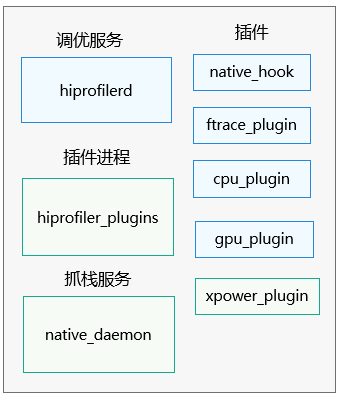

## 命令行说明

使用hiprofiler_cmd命令行工具可以调用不同插件并输入不同参数，以满足不同的调优需求。示范命令如下：
```text
$ hiprofiler_cmd \
  -c - \
  -o /data/local/tmp/hiprofiler_data.htrace \
  -t 30 \
  -s \
  -k \
  --nonblock \

| 命令 | 命令说明 |
| --- | --- |
| -c | 设置该选项后，需要将配置文件放入/data/local/tmp目录下，将路径作为参数输入。 |
| -o | 自定义文件保存路径（需要以/data/local/tmp开头）。若不设置路径，则调优数据自动保存至/data/local/tmp/hiprofiler_data.htrace。重复调优会覆盖原来路径的文件。 |
| -k | 杀掉已存在的调优服务进程。 |
| -s | 拉起调优服务进程。 |
| -t | 设置调优持续时间，单位：s。若需手动控制采集时长，请使用start/stop参数组合。 |
| --nonblock | 设置hiprofiler_cmd通过非阻塞的方式运行。          执行命令后，hiprofiler_cmd转入后台运行，继续执行其他命令。          如果不设置该参数，hiprofiler_cmd会阻塞执行，直到该命令结束。          说明：从API version 23开始支持该参数。 |
| start | 设置该选项后，直至输入hiprofiler_cmd stop命令才会停止调优。通过hiprofiler_cmd start params执行， 其中params为hiprofiler_cmd输入的其它参数。不支持同时设置-t参数设置调优时间。具体使用方法参考[常用命令](#常用命令)。          说明：从API version 24开始支持该参数。若开启调优后未执行hiprofiler_cmd stop命令，则调优默认3600秒后结束。 |
| stop | 设置该选项后停止通过start命令开启的调优。          说明：从API version 24开始支持该参数。start命令与stop命令必须成对调用， 避免重复开启或者重复关闭调优。 |

          输入完hiprofiler_cmd参数后，需要输入插件配置信息，以 js ->native的栈）：     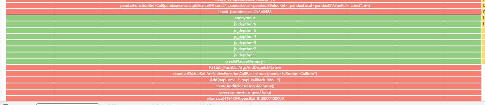     开启统计模式，在此模式下，栈数据会周期性展示：     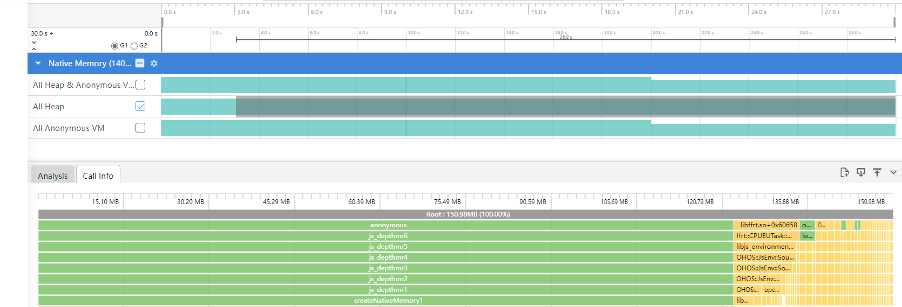     开启非统计模式，在此模式下，栈数据不会周期性展示：     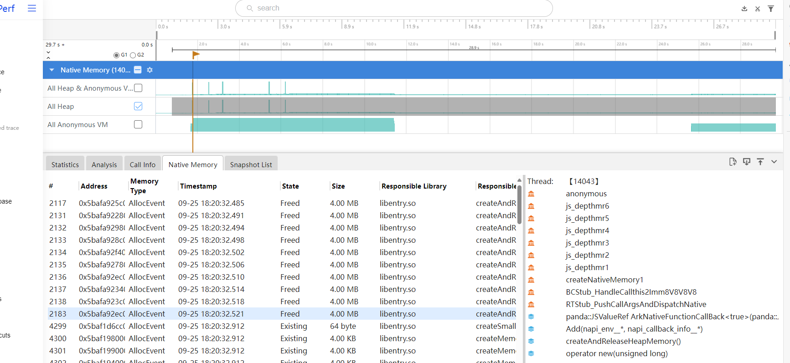

## ftrace plugin插件

     **参数介绍**
| 参数名字 | 类型 | 参数含义 | 详细介绍 |
| --- | --- | --- | --- |
| ftrace_events | string | 抓取的trace event。 | 记录内核打点的trace event。 |
| hitrace_categories | string | 抓取的hitrace打点信息。 | 调用hitrace能力，获取数据以proto格式写入文件。 |
| hitrace_apps | string | 抓取的hitrace信息的进程。 | 设置此参数时，只有对应进程的trace信息会被记录。添加此参数时， hitrace_categories不支持添加binder，否则会导致trace数据解析异常。 |
| buffer_size_kb | int | buffer缓存大小，单位：kB。 | hiprofiler_plugins进程读取内核事件所需要的缓存大小。推荐使用默认数值：204800。 |
| flush_interval_ms | int | 采集数据频率，单位：ms。 | 推荐使用默认数值：1000。 |
| flush_threshold_kb | int | 刷新数据大小。 | 超过threshold刷新一次数据至文件。用smartperf默认数值即可。 |
| parse_ksyms | bool | 是否获取内核数据。 | true：获取内核数据；false：不获取内核数据。 |
| trace_period_ms | int | 读取内核数据的频率。 | 用smartperf默认数值即可。 |

          **结果分析**     示例命令：
```text
\$ hiprofiler_cmd \
-c - \
-o /data/local/tmp/hiprofiler_data.htrace \
-t 10 \
-s \
-k \
此命令读取的内核binder_transaction和binder_transaction_received数据，这两个字段同时使用，才能完整展示binder两端数据。执行命令后，通过hdc file recv /data/local/tmp/hiprofiler_data.htrace命令将文件导出到当前目录，然后用smartperf将该文件打开并解析。结果示例如下图： 点击binder transaction右边的箭头，可以跳转到binder对端的进程或线程。
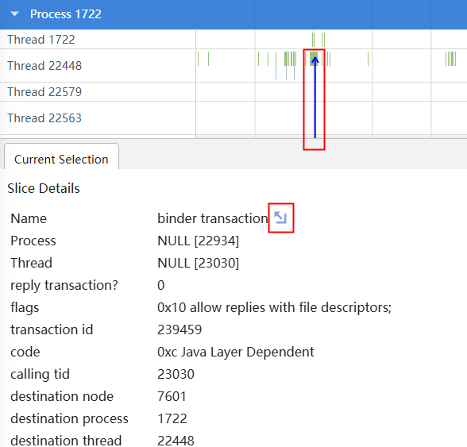

## memory plugin插件

**参数介绍**
| 参数名字 | 类型 | 参数含义 | 详细介绍 |
| --- | --- | --- | --- |
| report_sysmem_vmem_info | bool | 是否读取虚拟内存数据。 | 从/proc/vmstat节点读取内存数据。 |
| report_process_mem_info | bool | 是否获取进程详细内存数据，如rss_shmem，rss_file，vm_swap等。 | 从/proc/\${pid}/stat节点读取内存数据。 |
| report_smaps_mem_info | bool | 是否获取进程smaps内存信息。 | 从/proc/\${pid}/smaps节点获取进程smaps内存数据。 |
| report_gpu_mem_info | bool | 是否获取进程GPU使用情况。 | 读取/proc/gpu_memory节点数据。 |
| parse_smaps_rollup | bool | 是否从smaps_rollup节点读取smaps统计数据。 | 读取/proc/{pid}/smaps_rollup节点的smaps统计数据，相比使用report_smaps_mem_info参数调优服务性能会更好（如CPU，内存使用优化）。 |

内存信息包含如下： MemTotal：总内存大小。 MemFree：空闲内存大小。 Buffers：文件的缓冲大小。 Cached：缓存的大小。 Shmem：已被分配的共享内存大小。 Slab：内核数据缓存大小。 SUnreclaim：不可回收的Slab大小。 SwapTotal：交换空间的总大小。 SwapFree：未被使用交换空间的大小。 Mapped：设备和文件等映射的大小。 VmallocUsed：已被使用的虚拟内存大小。 PageTables：管理内存分页的索引表大小。 KernelStack：Kernel消耗的内存。 Active： 在经常使用中的缓冲或高速缓冲存储器页面文件的大小。 Inactive：在不经常使用中的缓冲或高速缓冲存储器页面文件的大小。 Unevictable：不能被释放的内存页。 VmallocTotal：vmalloc虚拟内存总大小。 CmaTotal：总的连续可用内存。 CmaFree：空闲的可用内存。 Zram：Zram的使用大小。 ZramTotal：Zram的总大小。

Active和Inactive的区别在于内存空间中是否包含最近被使用过的数据。当物理内存不足，需要释放正在使用的内存空间时，会优先释放Inactive的内存空间。 **结果分析** 通过hiprofiler_cmd 命令获取memory数据。 示例命令：
```text
$ hiprofiler_cmd \
  -c - \
  -o /data/local/tmp/hiprofiler_data.htrace \
  -t 30 \
  -s \
  -k \
此命令读取系统的内存的基本统计信息。执行命令后，通过hdc file recv /data/local/tmp/hiprofiler_data.htrace命令将文件导出到当前目录，然后通过smartperf打开并解析。结果示例如下图：     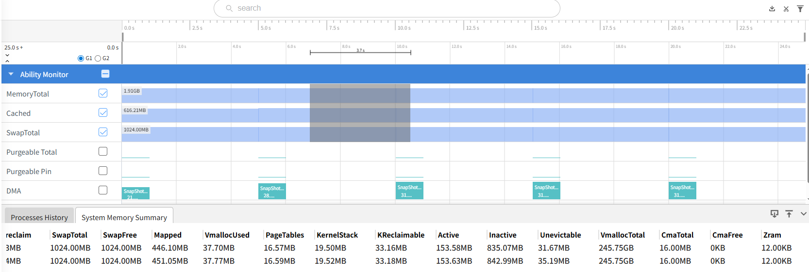     通过DevEco Studio 的工具获得内存的数据：     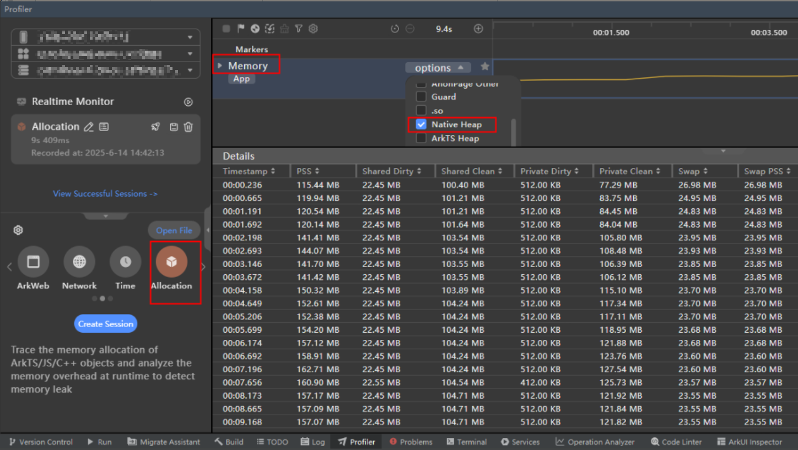     通过DevEco->profiler->Allocation工具，选择Memory泳道，可以使用profiler的memory plugin功能。上图展示了框选时间段的进程smaps内存信息。

## xpower plugin插件

     **参数介绍**
| 参数名字 | 类型 | 参数含义 | 详细介绍 |
| --- | --- | --- | --- |
| bundle_name | string | 需要进行能耗调优的进程名。 | 和/proc/节点下的进程名一致。 |
| message_type | XpowerMessageType | 需要获取能耗数据的类型。 | 数据类型包括：REAL_BATTERY、APP_STATISTIC、APP_DETAIL、COMPONENT_TOP、ABNORMAL_EVENTS和THERMAL_REPORT。 |

          **结果分析**     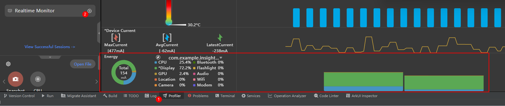     通过DevEco->profiler->real time monitor工具，可以获取相关进程能耗数据。

## GPU plugin插件

     获取GPU使用率相关信息的数据。     **参数介绍**
| 参数名字 | 类型 | 参数含义 | 详细介绍 |
| --- | --- | --- | --- |
| pid | int | 需要进行调优的进程ID，与/proc/节点下的进程ID一致。 | - |
| report_gpu_info | bool | 是否展示指定进程的GPU使用率信息。 | true: 展示指定进程的GPU数据，需要设置pid。false: 不展示指定进程的GPU数据。 |


## CPU plugin插件

     获取CPU使用率的相关信息。     **参数介绍**
| 参数名字 | 类型 | 参数含义 | 详细介绍 |
| --- | --- | --- | --- |
| pid | int | 需要进行调优的进程ID。 | 和/proc/节点下的进程ID一致。 |
| report_process_info | bool | 是否展示指定进程的CPU使用率信息。 | true：展示指定进程的数据，需要设置pid参数；          false：不展示指定进程的数据，仅展示系统级CPU使用率数据。 |
| skip_thread_cpu_info | bool | 是否跳过线程CPU使用率数据。 | true：不展示每个线程CPU使用率的信息，开启此参数时可以降低调优服务的开销；          false：展示每个线程CPU使用率的信息。 |

          CPU 基本信息包含如下：           Start Time：采集时间的时间戳。      Duration：前一次采集到本次采集的时间差。      TotalLoad%：总的CPU使用率。      UserLoad%：CPU在用户态空间运行的使用率。      SystemLoad%：CPU在内核空间运行的使用率。      Process：进程号。          **结果分析**     示例命令：
```text
\$ hiprofiler_cmd \
-c - \
-o /data/local/tmp/hiprofiler_data.htrace \
-t 30 \
-s \
-k \
此命令读取cpu的基本统计信息。执行命令后，通过hdc file recv /data/local/tmp/hiprofiler_data.htrace命令将文件导出到当前目录，然后通过smartperf打开并解析。结果示例如下图：
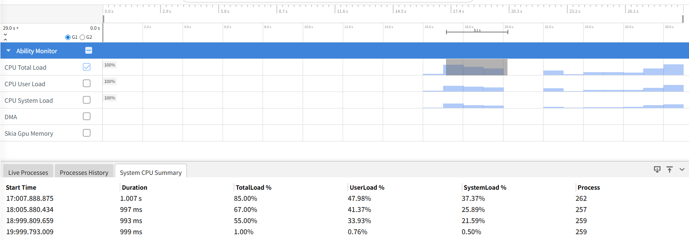

## diskio plugin插件

获取整机磁盘I/O使用率的相关信息。 **参数介绍**
| 参数名字 | 类型 | 参数含义 | 详细介绍 |
| --- | --- | --- | --- |
| report_io_stats | IoReportType | 磁盘I/O统计类型。 | 该类型为枚举类型，目前支持：IO_REPORT。 |

当设置成IO_REPORT时，会获得如下磁盘IO信息： Data Read：从磁盘读取到内存的总字节数。 Data Read/sec：每秒从磁盘读取到内存的字节数。 Data Write：从内存写入磁盘的总字节数。 Data Write/sec：每秒从内存写入磁盘的字节数。 Reads In：读入的字节数。 Reads In/sec：每秒读取的字节数。 Write Out：写入的字节数。 Write Out/sec：每秒写入的字节数。 **结果分析** 示例命令：
```text
$ hiprofiler_cmd \
  -c - \
  -o /data/local/tmp/hiprofiler_data.htrace \
  -t 30 \
  -s \
  -k \
此命令读取disk io的基本统计信息。执行命令后，通过hdc file recv /data/local/tmp/hiprofiler_data.htrace将文件导出到当前目录，然后通过smartperf打开并解析。结果示例如下图：     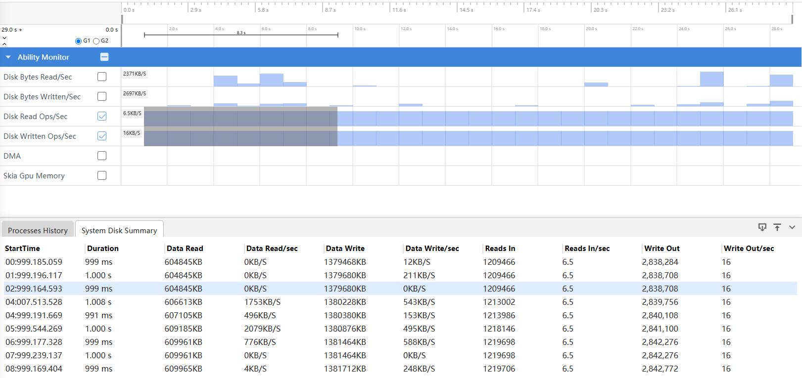

## hidump plugin插件

     获取应用进程的fps帧率的数据。     **参数介绍**
| 参数名字 | 类型 | 参数含义 | 详细介绍 |
| --- | --- | --- | --- |
| report_fps | bool | 是否报告帧率数据。 | true：报告应用进程的帧率数据；          false：不报告帧率数据。 |
| sections | uint32 | 每1秒上报多少次帧率数据。 | 默认值为10，即每隔100毫秒上报一次帧率数据。 |

          **结果分析**     该插件暂时不支持smartperf工具方式的trace数据解析，只支持DevEco Studio模式下的trace数据解析。如下图所示：     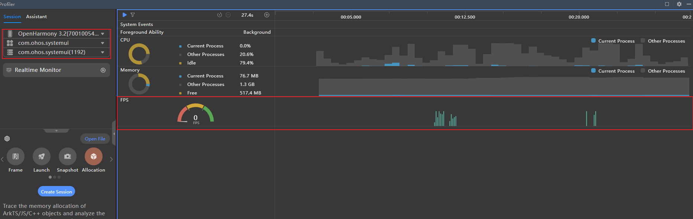

## hisysevent plugin插件

     获取系统事件记录的数据。     **参数介绍**
| 参数名字 | 类型 | 参数含义 | 详细介绍 |
| --- | --- | --- | --- |
| msg | string | 自定义的字符串。 | 该字符串作为保留字段，并未实际使用。使用时可传入空字符串 |
| subscribe_domain | string | 订阅的domain。 | 该字段用来订阅具体的domain下的所有事件。如果为空串，则订阅所有domain下的所有事件。 |
| subscribe_event | string | 订阅的event。 | 该字段用来订阅具体的event。如果为空串，则订阅所有event。 |

          **结果分析**     示例命令：
```text
\$ hiprofiler_cmd \
-c - \
-o /data/local/tmp/hiprofiler_data.htrace \
-t 30 \
-s \
-k \
此命令示例抓取所有hisystem event订阅事件信息。执行命令后，通过hdc file recv /data/local/tmp/hiprofiler_data.htrace将文件导出到当前目录，然后通过smartperf打开并解析。结果示例如下图：
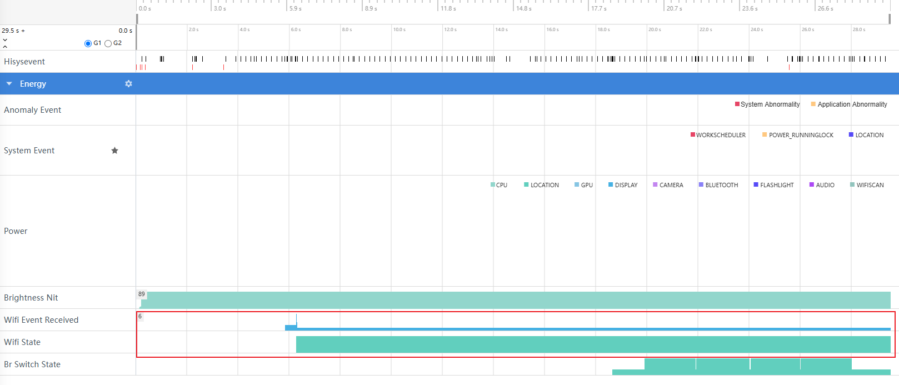

## network plugin插件

获取网络上行下载相关的数据。统计网络管理模块提供的网络流量、连接状态等。 **参数介绍**
| 参数名字 | 类型 | 参数含义 | 必选 | 详细介绍 |
| --- | --- | --- | --- | --- |
| pid | int32 | 进程ID。 | 否 | 获取指定进程的网络数据。可以传入多个参数。参数缺省时，则抓取整机的网络数据。 |
| startup_process_name | string | 启动的进程名。 | 否 | 如果需要抓取指定进程启动的网络数据，则需要指定此参数。 |
| restart_process_name | string | 重启的进程名。 | 否 | 如果需要抓取指定进程重启的网络数据，则需要指定此参数。 |


startup_process_name和restart_process_name不能同时为空。 网络信息数据包含如下： StartTime：采集时间的时间戳。 Duration：前一次采集到本次采集的时间差。 Data Received：接收的网络数据总字节数。 Data Received/sec：每秒接收的网络数据字节数。 Data Send：发送的网络数据总字节数。 Data Send/sec：每秒发送的网络数据字节数。 Packets In：接收的网络总数据包数。 Packets In/sec：每秒接收的网络数据包数。 Packets Out：发送的网络总数据包数。 Packets Out/sec：每秒发送的网络数据包数。 **结果分析** 示例命令：
```text
$ hiprofiler_cmd \
  -c - \
  -o /data/local/tmp/hiprofiler_data.htrace \
  -t 30 \
  -s \
  -k \
此命令示例抓取整机网络数据信息。执行命令后，通过hdc file recv /data/local/tmp/hiprofiler_data.htrace将文件导出到当前模板，然后通过smartperf打开并解析。结果示例如下图：     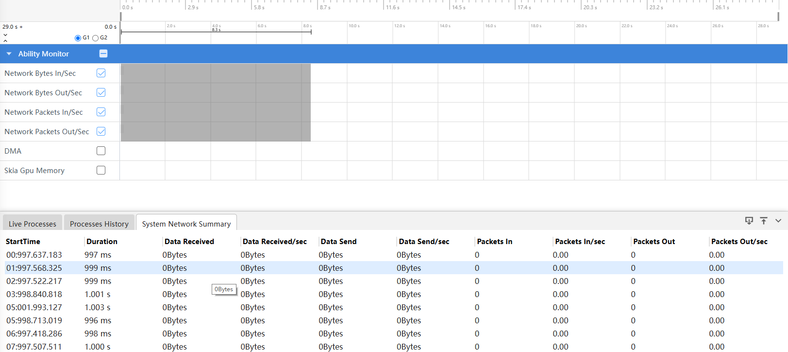

## network profiler插件

     获取进程的网络请求信息，会把每次HTTP请求当作一个数据点记录下来。     **参数介绍**
| 参数名字 | 类型 | 参数含义 | 必选 | 详细介绍 |
| --- | --- | --- | --- | --- |
| pid | int32 | 进程ID。 | 否 | 获取指定进程的网络数据。可以传入多个参数。参数缺省时，则抓取整机的网络数据。 |
| startup_process_name | string | 启动的进程名。 | 否 | 如果需要抓取指定进程启动的网络数据，则需要指定此参数。 |
| restart_process_name | string | 重启的进程名。 | 否 | 如果需要抓取指定进程重启的网络数据，则需要指定此参数。 |
| clock_id | int | 时间时钟类型 | 是 | 1：BOOTTIME，系统启动后单调递增时间（含NTP调整）。          2：REALTIME，可调整的系统实时时间。          3：REALTIME_COARSE，低精度实时时间。          4：MONOTONIC，无NTP调整的单调递增时间。          5：MONOTONIC_COARSE，低精度单调递增时间。          6：MONOTONIC_RAW，硬件原始单调递增时间。 |
| smb_pages | int | 共享内存页数 | 是 | hiprofiler_plugins进程和被调优进程建立的共享内存大小，建议值为16384个页大小，即：16384*4096=67108864字节（64M）。 |
| flush_interval | int | 磁盘写入间隔 | 否 | 每flush_interval次网络请求触发一次磁盘写入，优化IO效率。          默认值为1。 |
| block | bool | 阻塞模式开关 | 否 | true：共享内存满时阻塞采集，可能影响性能。          false：共享内存满时丢弃超出部分的数据。          默认值为false。 |

          **结果分析**     smartperf工具暂时不支持该插件的trace数据解析，若需分析network数据，请使用DevEco Studio的Profiler工具下的NetWork功能。可参考：     [网络诊断：NetWork分析](https://developer.huawei.com/consumer/cn/doc/harmonyos-guides/ide-profiler-network)

## 常用命令


## 堆内存分配调用栈数据采样记录

     对com.example.insight_test_stage进程的堆内存分配操作进行抓栈，并开启fp回栈、离线符号化和统计模式。
```text
\$ hiprofiler_cmd \
-c - \
-t 30 \
-s \
-k \
采集的数据会被保存至/data/local/tmp/hiprofiler_data.htrace文件中，该文件包含了内存泄漏分析所需的函数调用信息、线程和动态库维度内存分配情况，以及调用栈次数和分配大小聚类信息。开启离线符号化，fp回栈，统计模式均可以提升调优服务处理数据速率。

## 抓取指定进程CPU使用率。

对进程号为1234的进程采集CPU数据，采集时长为30s，采样周期为1000ms，调优数据传输的共享内存大小是16384个内存页，采集的数据会被保存至/data/local/tmp/hiprofiler_data.htrace文件中。
```text
$ hiprofiler_cmd \
  -c - \
  -o /data/local/tmp/hiprofiler_data.htrace \
  -t 30 \
  -s \
  -k \


## 抓取指定进程GPU图形内存调用栈

     抓取指定进程的GPU图形内存调用栈（需要使用最新smartperf release版本解析文件，下载链接：[smartperf](https://gitcode.com/openharmony/developtools_smartperf_host/releases))。
```text
\$ hiprofiler_cmd \
-c - \
-t 30 \
-s \
-k \
命令中使用了malloc_disable参数用于过滤nativeheap抓栈的数据；添加的restrace_tag参数中没有"RES_GPU_CL_IMAGE", 则不抓取OpenCL image类型的GPU内存分配栈。

## 抓取指定进程GlobalHandle对象的调用栈

从API version 23开始支持抓取指定进程创建[napi_ref](https://developer.huawei.com/consumer/cn/doc/harmonyos-guides/use-napi-life-cycle#napi_ref)的调用栈，不会抓取创建弱引用的调用栈。
```text
$ hiprofiler_cmd \
  -c - \
  -t 60 \
  -o /data/local/tmp/hiprofiler_data.txt \
  -s \
  -k \


## 抓取指定进程LocalHandle对象调用栈

     从API version 23开始支持LocalHandle对象内存录制功能。例如，可通过如下方式对com.example.insight_test_stage进程进行内存录制。
```text
\$ hiprofiler_cmd \
-c - \
-t 60 \
-o /data/local/tmp/hiprofiler_data.txt \
-s \
-k \
LocalHandle对象内存录制功能要求被测应用在启动时替换加载维测库，才能正常采集LocalHandle内存信息。 应用替换加载维测库方法： 1.应用处于退出状态：下发LocalHandle对象内存录制命令，设置startup_mode参数为true，然后启动应用，应用启动后即可进行数据采集。 2.应用处于运行状态：下发LocalHandle对象内存录制命令，设置startup_mode参数为true，然后重启应用，应用重启后即可进行数据采集。
> [!NOTE]
> 1.应用加载维测库后，只要应用不退出，维测库持续生效。此后，可以通过非启动模式录制LocalHandle内存，此时startup_mode参数必须设置为false。 2.使用此种方式后，此次应用打开的时长会变长，此次运行的性能上也会有损失。但不影响下次的使用。 3.此种方式抓取到的LocalHandle内存一定是泄漏的。 4.命令行方式获取的trace文件，可以通过DevEco Profiler离线导入文件功能进行解析。导入的单个文件大小不超过1.5G。


## 手动控制采集时长

使用手动控制采集时长调优启停方式对com.example.insight_test_stage进程的堆内存分配操作进行抓栈。 调优开始：
```text
$ hiprofiler_cmd start \
  -c - \
  -s \
  -k \
调优结束：
```text
\$ hiprofiler_cmd stop
```


## 常见问题


## 调优出现异常

     **现象描述**     使用hiprofiler_cmd命令时，显示Service not started。     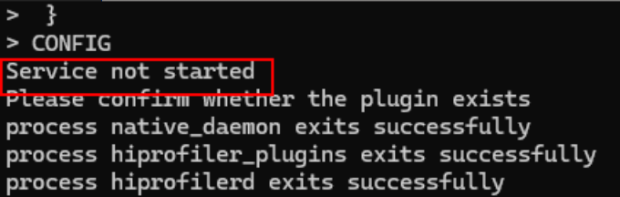     **可能原因&解决方法**     调优服务未能开启，说明正在使用DevEco Studio调优或者上次调优异常退出，需要执行hiprofiler_cmd -k之后再重新执行调优命令。

## 抓取到的trace文件为空

     **现象描述**     抓取到的trace文件是空的     **可能原因&解决方法**     需要检查生成文件的路径是否在/data/local/tmp/目录下。如果目标路径是/data/local/tmp下的一个文件夹，则尝试对文件夹执行chmod 777操作。如果是user版本使用nativehook或者network profiler插件抓取的应用不是[使用调试证书签名的应用](#使用调试证书签名的应用)，也抓不到数据。

## 调优数据疑似不准确

     **现象描述**     hiprofiler抓取到的native heap和hidumper查看的native heap有差异。     **可能原因&解决方法**     hidumper抓取的是进程维度内存使用情况，hiprofiler抓取到的是进程用户态通过基础库函数（malloc，mmap，realloc等，operator new也是调用的malloc）分配堆内存的数据。两者之间会有差异，差异存在于线程的内存缓存，堆内存延迟释放，加载器使用内存等。

## 调优时目标进程卡顿

     **现象描述**     使用hiprofiler_cmd命令抓取应用进程的内存trace，采用FP回栈或者dwarf回栈时，出现应用进程卡顿。     **可能原因&解决方法**     可以通过hiprofiler_cmd命令中config参数配置来进行调整。     hiprofiler_cmd命令中config参数的调整方法如下：           适当减小max_stack_depth和max_js_stack_depth参数的值，减少回栈深度，减少调用栈信息的采集。      适当增大smb_pages参数的值，增大调优数据传输的共享内存大小。默认值为16384个页大小，即：16384*4096=67108864字节（64M）。可以调整到128M。      适当增加sample_interval参数的值，增大采样线程栈的大小。默认值为256，可以调整到512。

## 调优时使用FP回栈异常

     **现象描述**     使用hiprofiler_cmd命令抓取应用进程的内存trace，对应的共享库（SO）无法进行基于FP的栈回溯。     **可能原因&解决方法**     检查对应的共享库编译时是否开启了-fomit-frame-pointer编译选项，需保证该选项保持关闭状态。
