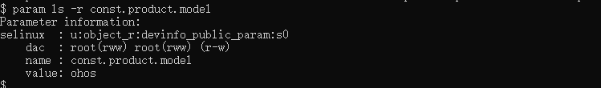
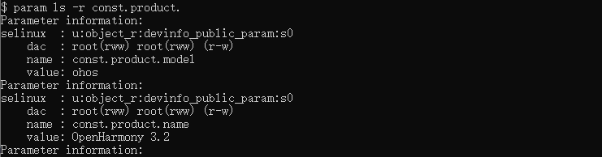
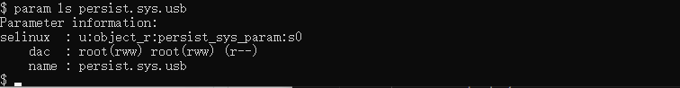

# param工具

更新时间：2026-03-09 02:50:43

来源：https://developer.huawei.com/consumer/cn/doc/harmonyos-guides/param-tool

param是为开发人员提供用于操作系统参数的工具，该工具只支持标准系统。


## 环境要求

获取hdc工具，执行hdc shell。正常连接设备。

## param工具命令列表


| 选项 | 说明 |
| --- | --- |
| -h | 获取param支持的命令。 |
| ls [-r] [name] | 显示匹配name的系统参数信息。带"-r"则根据参数权限获取信息，不带"-r"则直接获取参数信息。 |
| get [name] | 获取指定name系统参数的值；若不指定任何name，则返回所有系统参数。 |
| set name value | 设置指定name系统参数的值为value。 |
| wait name [value] [timeout] | 同步等待指定name系统参数与指定值value匹配。value支持模糊匹配，如"*"表示任何值，"val*"表示只匹配前三个val字符。timeout为等待时间（单位：s），不设置则默认为30s。 |
| save | 保存persist参数到工作空间。 |


## 获取param支持的命令

获取param支持的命令，命令格式如下：
```text
param -h
```


## 获取系统参数信息

显示匹配name的系统参数信息，命令格式如下：
```text
param ls [-r] [name]
```

**示例**




## 获取系统参数的值

获取指定name系统参数的值，命令格式如下：
```text
param get [name]
```

**示例**


## 设置系统参数的值

设置指定name系统参数的值为value，命令格式如下：
```text
param set name value
```

**示例**


## 等待系统参数值匹配

同步等待指定name系统参数与指定值value匹配，命令格式如下：
```text
param wait name [value] [timeout]
```

**示例**


## 保存persist(可持久化)参数

保存persist(可持久化)参数到工作空间，命令格式如下：
```text
param save
```

**示例**

