# 专项测试

更新时间：2026-04-28 12:59:30

来源：https://developer.huawei.com/consumer/cn/doc/harmonyos-guides/specialized-testing

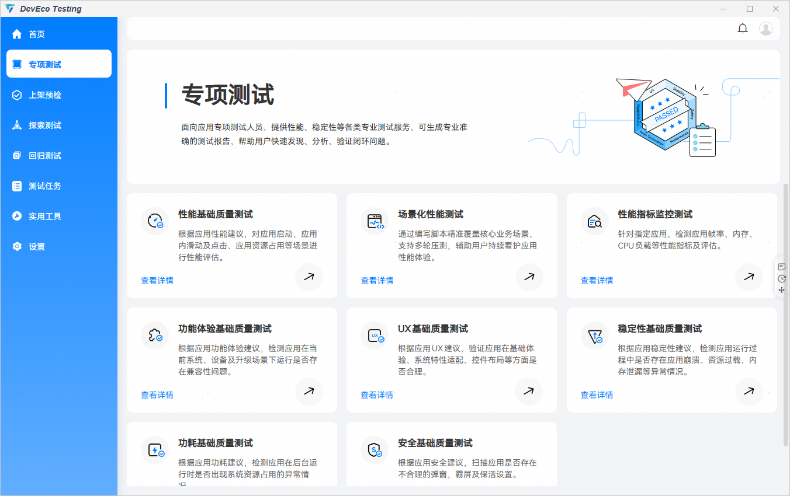

 

##### 性能基础质量测试

**性能基础质量测试：**基于应用性能测试标准，提供了一套包含智能遍历算法和性能指标分析的解决方案，用于评估应用性能。该测试服务通过模拟用户操作行为，对应用进行长时间、高频次的页面遍历，实时采集性能数据，并生成全面、专业的测试报告。
 
应用的设计、开发及测试过程中推荐参考[应用性能体验建议](https://developer.huawei.com/consumer/cn/doc/harmonyos-guides/performance-experience-suggestions)。
 
 
**服务使用场景：**
 
用户在进行整包性能评估测试时，可以使用本服务通过指定应用启动次数与遍历操作时长，对应用进行性能测试。
 
**检测能力**：
 
性能基础质量测试提供了响应时延、完成时延、卡顿、音视频和黑白块五大类性能指标的检测能力，具体如下：
  
| 指标类型 | 指标名称 | 单位 | 指标说明 |
| 响应时延 | 点击响应时延 | 毫秒 | 时间起点：点击离手； 时间终点：界面发生变化。 |
| 响应时延 | 滑动响应时延 | 毫秒 | 时间起点：手指滑动； 时间终点：界面发生变化。 |
| 完成时延 | 加载完成时延 | 毫秒 | 时间起点：应用首页铺满全屏； 时间终点：应用首页所有占位符加载完成。 |
| 完成时延 | 点击完成时延 | 毫秒 | 时间起点：点击离手； 时间终点：转场页面所有占位符加载完成。 |
| 卡顿 | 最大丢帧 | 次 | 动效时间内，连续丢失的最大帧数。 |
| 卡顿 | 卡顿率 | 毫秒/秒 | 动效时间内，累计丢帧时间/动效时长。 |
| 音视频 | 起播时延 | 毫秒 | 时间起点：点击或滑动离手； 时间终点：视频播放首帧。 |
| 音视频 | 视频卡顿 | 次 | 视频播放过程中的卡顿情况，卡顿时长大于100ms视为1次卡顿。 |
| 黑白块 | 启动白屏时长 | 毫秒 | 时间起点：启动动效开始； 时间终点：启动过程中白屏消失。 |
| 黑白块 | 滑动占位符加载指数 | 毫秒/秒 | 页面滑动过程中占位符存在的累计时间。 |
 
 
**创建任务**
 
打开DevEco Testing客户端-专项测试-性能基础质量测试卡片，在任务创建界面按需配置任务参数，点击创建任务后开始测试。
 

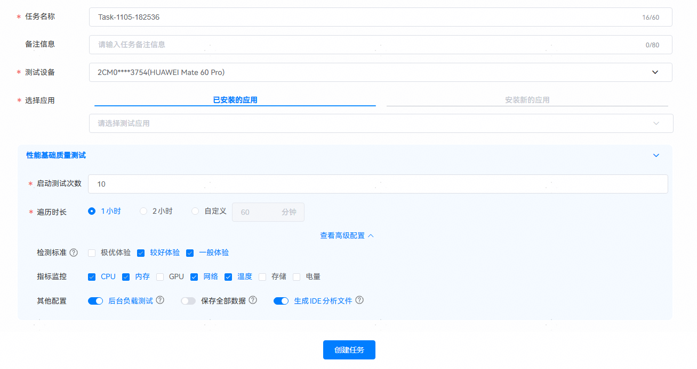

 
性能基础质量测试支持选择已安装的应用，或选择待测应用的安装包后进行测试。
 
> [!TIP]
> 应用支持情况说明： 冷启动测试：支持所有应用。 应用内操作测试：遍历目前主要支持以下应用类型： ArkUI原生控件（含ReactNative框架开发）应用。 使用Flutter3.7.12及之后版本开发的应用。 除以上支持的应用类型，其他三方自研框架的自定义控件暂不支持。

 
（1）已安装的应用
 

 
（2）安装新的应用
 
点击按钮，在弹窗中选择应用安装包，支持.hap、.zip格式安装包。
 

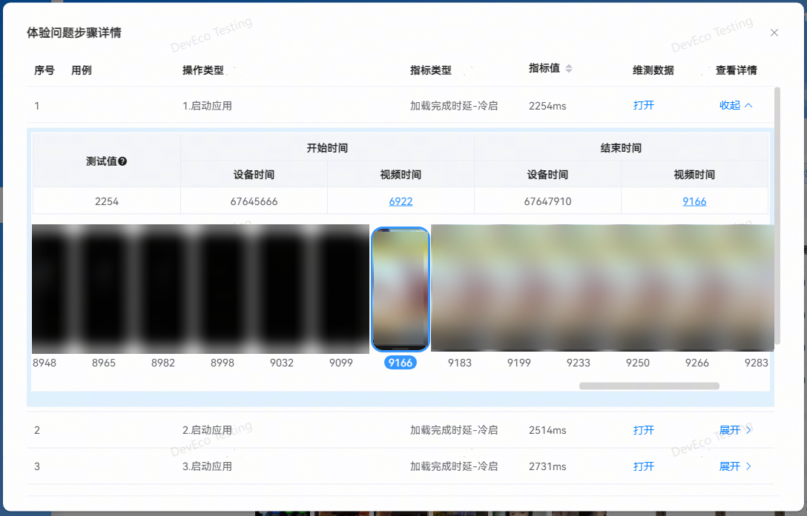

 

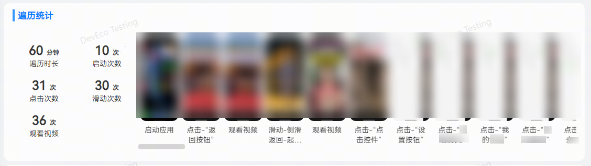

 
**启动测试次数**
 
执行冷启动操作的次数，自动化测试过程中会重复执行应用冷启动和退出操作，用来评估应用启动的性能。
 

 
**遍历时长**
 
应用内点击、滑动等操作的总执行时长，用户可根据需求自定义遍历时长，默认为1小时，最大支持120分钟。
 

 
**高级配置**
 

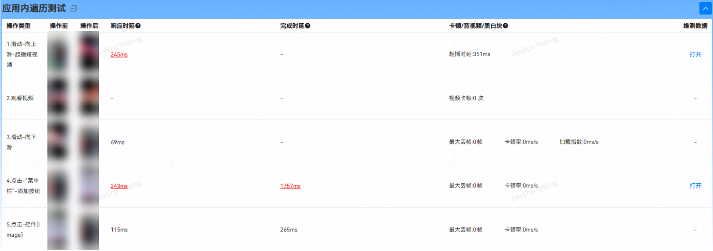

 
**检测标准**
 
检测基于用户体验分为三个标准，分别为：
 
- 极优体验：操作体验快速、流畅，发现更多的性能体验问题（磁盘空间占用会增加)，可选项。
- 较好体验：操作体验良好，发现可感知的性能体验问题，默认选项。
- 一般体验：操作体验较差，发现感知明显的性能体验问题，需重点关注，默认选项。

 

 
**指标监控**
 
自动化遍历执行过程中，被测设备的系统资源指标项采集，当前支持采集CPU、内存、温度、网络、GPU、存储和电量，固定采集CPU和内存，用户自行选择是否采集其他指标项。
 

 
**其他配置**
 
- 后台负载测试：开启后会在自动化遍历结束后，让应用进入后台，采集应用在后台状态下的CPU负载和内存占用，默认采集。
- 保存全部数据：开启后会保存自动化测试过程中产生的所有视频、trace、图片等数据，关闭后只保存影响体验操作的步骤数据。
- 生成IDE分析文件**：**开启后会将报告中的性能问题压缩打包，压缩包可导入 DevEco Studio 的体检工具，进行问题诊断并给出修改建议。

 

 
**测试执行**
 

 
**①：**实时显示任务的整体进度。
 
**②/③****：**实时显示每个用例的执行状态和分析状态。
 
**④：**实时打印任务执行时的日志。
 

 
**查看报告**
 

 
**基础信息**
 
- 任务数据：任务名称、开始时间、持续时间、执行人。
- 应用数据：应用包名、应用版本、API版本。
- 备注：备注信息支持自定义修改。
- 环境参数：支持查看任务下发的参数以及被测设备的详细信息。
- 执行日志：支持查看任务执行过程中的日志，支持日志级别的筛选。
- 打开目录：点击打开任务数据文件夹。

 

 
**整体评估**
 

 
整体评估报告部分会展示本次的测试结论，包括如下部分：
 
- 测试结论：描述本次测试的结论，包括遍历时长、执行操作次数、发现问题数。
- 报告对比：一键跳转到性能测试报告对比工具，从概览、指标达标率等多维度进行报告对比。
- 性能报告自动分析：一键跳转到性能报告自动分析服务，对该报告中发现的问题进行自动分析。
- 导出IDE体检文件：支持生成体检文件导入到DevEco Studio中进行问题分析定位。详细操作指导请查看[导入DevEco Testing的检测报告进行诊断](https://developer.huawei.com/consumer/cn/doc/harmonyos-guides/ide-app-analyzer-testing)。
- 问题分布环形图：呈现本次任务发现的总问题数以及各指标性能问题的分布情况。
- 操作类型和问题表单：统计遍历过程中，启动、点击、滑动、观看的操作次数，以及对应指标发现的问题数。
- 一般体验：为了帮助提前识别可能影响应用日常使用的性能体验问题，将所有体验问题进行过滤，聚焦于明显影响用户体验的严重问题，问题数会比所有体验问题少。
- 较好体验和极优体验：为了追求极致性能体验，这两种体验问题的标准比一般体验的标准更严格，上报的问题也会更多，用户可以根据实际情况解决问题。

 
整体评估表格中的红色数字表示当前体验标准下的问题次数，支持点击查看问题步骤列表。
 

 

 
- 维测数据：点击打开按钮，自动打开该操作的数据文件夹，汇总当前操作的trace、视频、图片等维测数据，协助用户进行问题定位。
- 查看详情：点击展开按钮，呈现该操作的帧图片集，点击视频时间数字，能直接定位到具体的图片。

 
**遍历统计**
 

 
**遍历统计会展示应用遍历过程中的操作步骤信息，包括如下信息：**
 
- 遍历时长：用户在任务创建时指定的遍历时间。
- 启动次数：用户在任务创建时指定的启动测试次数。
- 点击次数：应用遍历过程中，点击操作的总次数。
- 滑动次数：应用遍历过程中，滑动操作的总次数。
- 观看视频：应用遍历过程中，观看视频操作的总次数。
- 图片列表：展示遍历的操作过程。

 
**资源数据**
 

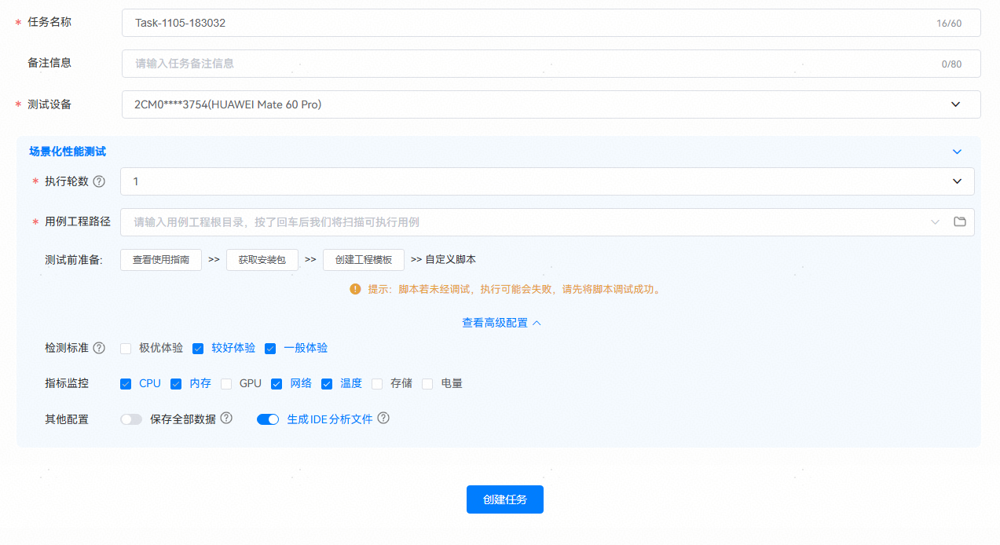

 
资源数据报告部分呈现的是应用在遍历过程中的资源占用情况。
 
- CPU和内存占用是默认采集，GPU、网络、电量和温度为可选项，可在任务创建页面“高级配置”中勾选。
- 后台CPU和内存的测试需要在任务创建页面打开“后台负载测试”开关，检测应用在后台时，CPU和内存资源的占用情况。
- 峰值步骤：展示当前系统资源指标的最大值，点击可跳转至对应的步骤详情。

 
**操作详情**
 
操作详情展示遍历测试过程中的操作步骤信息，整体呈现内容如下所示：
 
- 应用启动测试：

 

 
展示应用启动测试的步骤信息，包括操作前后截图、测试数据以及维测数据。
 
操作前&操作后：展示该步骤操作前后的设备截图。
 
指标项：展示应用启动过程的指标检测结果信息，如果测试值超标，字体标红显示，支持点击查看问题详情。若不涉及，则显示”-”。
 
维测数据：点击打开按钮，自动打开该操作的数据文件夹，汇总当前操作的trace、视频、图片等维测数据，协助用户进行问题定位。若该步骤所有测试数据都达到标准，则不展示打开按钮。
 
- 应用内遍历测试：

 

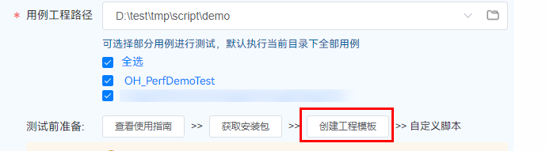

 
展示应用内进行遍历操作的步骤信息，包括操作前后截图、测试数据以及维测数据。
 
操作前&操作后：展示该步骤操作前后的设备截图。
 
指标项：展示应用启动过程的指标检测结果信息，如果测试值超标，字体标红显示，支持点击查看问题详情。若不涉及，则显示”-”。
 
维测数据：点击打开按钮，自动打开该操作的数据文件夹，汇总当前操作的trace、视频、图片等维测数据，协助用户进行问题定位。若该步骤所有测试数据都达到标准，则不展示打开按钮。
 
- **异常指标信息查看：**

 
对于超标的检测结果，可以通过点击超标项，查看该步骤的详细信息，展示内容如下图所示（以响应时延为例）。
 

 
测试值：表示该步骤的响应时延测试值。
 
开始时间：表示用户从122这一帧开始操作。
 
结束时间：表示应用UI在255这一帧开始响应。
 
图片组：逐帧展示该步骤的操作视频。
 

 
**问题定位定界**
 
**维测数据**
 
点击打开按钮跳转到问题步骤对应的资源文件目录。
 

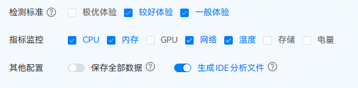

 
用户可查看步骤执行全过程的图片和视频，如下所示：
 

 
**perfdata数据**
 
可使用[DevEco Studio](https://developer.huawei.com/consumer/cn/download/deveco-studio) 5.0.3.300及以上版本中的场景化调优工具DevEco Profiler打开及查看该文件，内含步骤执行过程中的trace打点和调用栈信息，也可使用压缩软件解压为单个的trace文件和调用栈文件，解压后的文件可使用[SmartPerf](https://gitcode.com/openharmony/developtools_smartperf_host)工具打开。
 

 
> [!NOTE]
> 更多测试服务详情，请前往DevEco Testing客户端->专项测试->性能基础质量测试->任务创建页->测试指南中查询。 更多应用性能优化建议及问题定位，请查阅： 应用性能体验建议 及 最佳实践-性能-性能场景优化案例 。

 

 

##### 场景化性能测试

**服务说明**
 
场景化性能测试服务提供了一套包含自动化脚本执行和性能指标分析的解决方案，涵盖响应时延、完成时延、卡顿、音视频和黑白块五大类性能指标的检测。
 
应用的设计、开发及测试过程中推荐参考[应用性能体验建议](https://developer.huawei.com/consumer/cn/doc/harmonyos-guides/performance-overview)。
 

 
**服务使用场景**
 
支持一键式测试应用的关键场景和核心路径的性能体验。通过任务报告，用户可查看关键场景上的多维度性能指标表现，精准识别性能体验问题。
 

 

**场景化性能测试的性能指标检测能力****与性能基础质量测试一致；详情请查看[性能基础质量测试](#section12324184817324)。**
 

 
 
**脚本写作**
 
请参考[自定义性能脚本测试（基于Python)](https://developer.huawei.com/consumer/cn/doc/harmonyos-guides/hypium-perf-python-guidelines)。
 

 
**任务创建：**
 
打开DevEco Testing客户端-专项测试-场景化性能测试卡片，在任务创建界面按需配置任务参数，点击创建任务后开始测试。
 

 
**配置项说明**
 
**执行轮次**
 
用例可重复执行多轮提升测试结果的可靠性，最多测试10轮。
 

 
**用例工程路径**
 
存放自动化用例的工程路径。
 
如果已有用例脚本，可点击创建工程模板，将脚本文件存放到工程根目录的testcases目录下，用例工程路径请选择工程根目录。
 

 

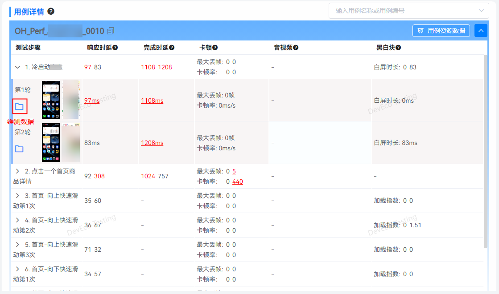

 
**高级配置**
 

 
**检测标准、****指标监控**
 
与性能基础质量测试一致，可点击[性能基础质量测试](#section12324184817324)查看。
 

 
**其他配置**
 
保存全部数据：开启后会保存自动化测试过程中产生的所有视频、trace、图片等数据，关闭后只保存影响体验操作的步骤数据。
 
生成IDE分析文件：开启后会将报告中的性能问题压缩打包，压缩包可导入 DevEco Studio 的体检工具，进行问题诊断并给出修改建议。
 

 
**任务执行**
 
所有用例按照顺序和轮次依次执行，并行分析；任务完成后，会自动生成报告页面。
 

 
①：实时显示任务的整体进度。
 
②/③：实时显示每个用例的执行状态和分析状态。
 
④：实时打印任务执行时的日志。
 

 
**查看报告**
 
测试完成后，自动生成测试报告。报告包含基础信息、整体评估、资源数据、用例详情等。
 

 
**基础信息**
 
任务信息：任务名称、工程路径、开始时间、持续时间、执行人。
 
备注：备注信息支持自定义修改。
 
环境参数：支持查看任务下发的参数以及被测设备的详细信息。
 
执行日志：支持查看任务执行过程中的日志，支持日志级别的筛选。
 
打开目录：点击打开任务数据文件夹。
 
**整体评估**
 

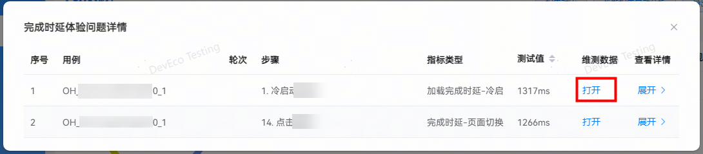

 
整体评估包括如下部分：
 
- 测试结论：描述本次测试的结论，包括执行用例个数、轮数、操作次数及发现问题数。
- 报告对比：一键跳转到报告对比工具，从概览、指标优劣化、用例对比详情等多维度进行报告对比。
- 性能报告自动分析：一键跳转到性能报告自动分析服务，对该报告中发现的问题进行自动分析。
- 导出IDE体检文件：支持生成体检文件导入到DevEco Studio中进行问题分析定位。详细操作指导请查看[导入DevEco Testing的检测报告进行诊断](https://developer.huawei.com/consumer/cn/doc/harmonyos-guides/ide-app-analyzer-testing)。
- 问题分布环形图：呈现本次任务发现的总问题数以及各指标性能问题的分布情况。
- 用户场景和问题分布表单：执行状态表示用例场景多轮执行的状态，用例场景展示的是脚本中定义的场景用例名称，后面几列为对应指标发现的问题数。
- 一般体验：为了帮助提前识别可能影响应用日常使用的性能体验问题，将所有体验问题进行过滤，聚焦于明显影响用户体验的严重问题，问题数会比所有体验问题少。
- 较好体验和极优体验：为了追求极致性能体验，这两种体验问题的标准比一般体验的标准更严格，上报的问题也会更多，用户可以根据实际情况对应用进行优化。

 
**执行状态共有如下几种：**
 
- 成功：用例所有轮次均执行成功。
- 部分成功：用例部分轮次执行成功，部分轮次失败或者未执行。
- 失败：用例无成功执行轮次。
- 未执行：用例未执行。

 
整体评估表格中的红色数字是当前体验标准下的问题次数，支持点击查看问题步骤列表：
 

 
展开后呈现问题的详细信息：
 

 
维测数据：点击打开按钮，自动打开该操作的数据文件夹，汇总当前操作的trace、视频、图片等维测数据，协助用户进行问题定位。
 
查看详情：点击展开按钮，呈现该操作的帧图片集，点击视频时间数字，能直接定位到具体的图片。
 

 
**资源数据**
 

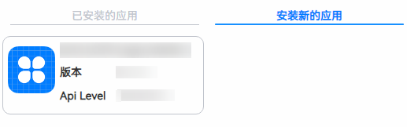

 
资源数据报告部分呈现的是应用在遍历过程中的资源占用情况。
 
- CPU和内存占用是默认采集，GPU、网络、电量和温度为可选项，可在任务创建页面“高级配置”中勾选。
- 峰值步骤：展示的是当前系统资源指标的最大值，点击可跳转至对应的步骤详情。

 

 
**用例详情**
 
用例详情会展示用例的执行轮次和执行步骤的信息，整体呈现内容如下图所示：
 

 
OH_XXXX：代表用例名称，由脚本进行指定。
 
用例资源数据： 统计该用例在执行过程中采集到的CPU，内存等资源数据，并针对改用例进行数据汇总计算。
 
测试步骤：展示用例的步骤信息，默认展示该步骤在多轮测试中的测试数据，对于超过标准的测试值，数据标红显示，支持点击查看问题详情。对于该操作不涉及的指标，显示“-”。
 
点击步骤左侧的箭头，展开该步骤的详细轮次信息，如下图所示：
 

 
操作前&操作后：展示该步骤操作前后的信息，用户可以通过前后截图了解操作的场景。
 
指标项：展示每轮的指标检测结果信息，如果测试值超标，字体标红显示，支持点击查看问题详情。若不涉及，则显示“-”。
 
维测数据：点击

 按钮，自动打开该操作的数据文件夹，汇总当前操作的trace、视频、图片等维测数据，协助用户进行问题定位。若该步骤所有测试数据都达到标准，则不会出现该按钮。
 

 
对于超标的检测结果，可以通过点击超标项，查看该步骤的详细信息，展示内容如下图所示（以滑动占位符加载指数详情为例）：
 

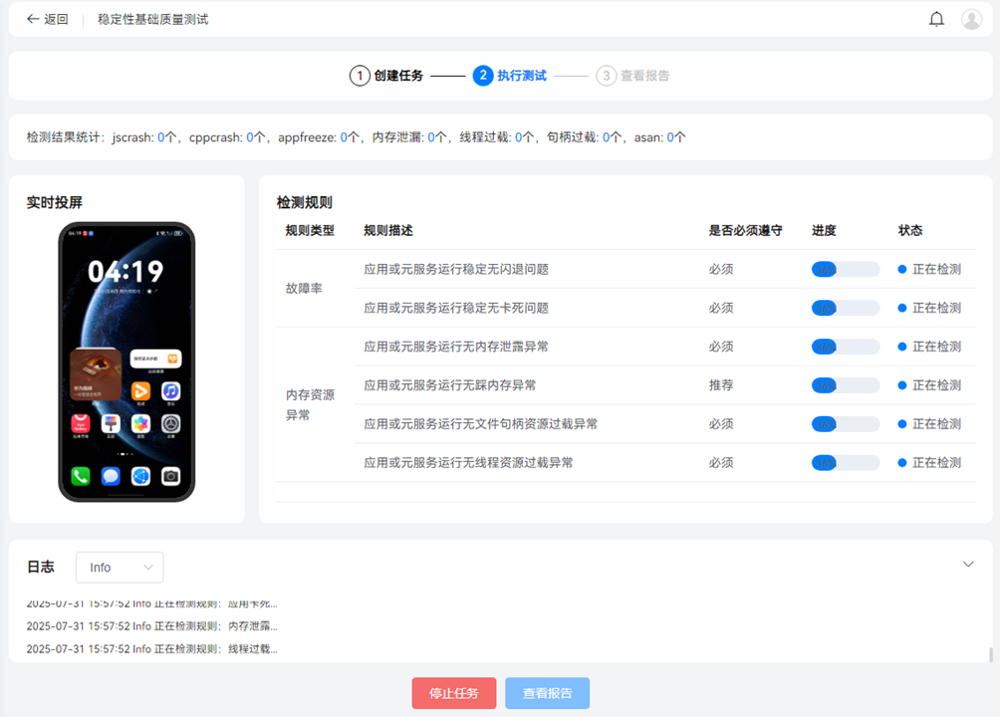

 
开始时间：从3299这一帧开始，页面中出现占位符。
 
结束时间：在3465这一帧，占位符全部都加载完成。
 
图片组：逐帧展示该步骤的操作视频。
 

 
**问题定位定界**
 
**维测数据**
 
点击打开按钮可以跳转到问题步骤对应的资源文件目录。
 

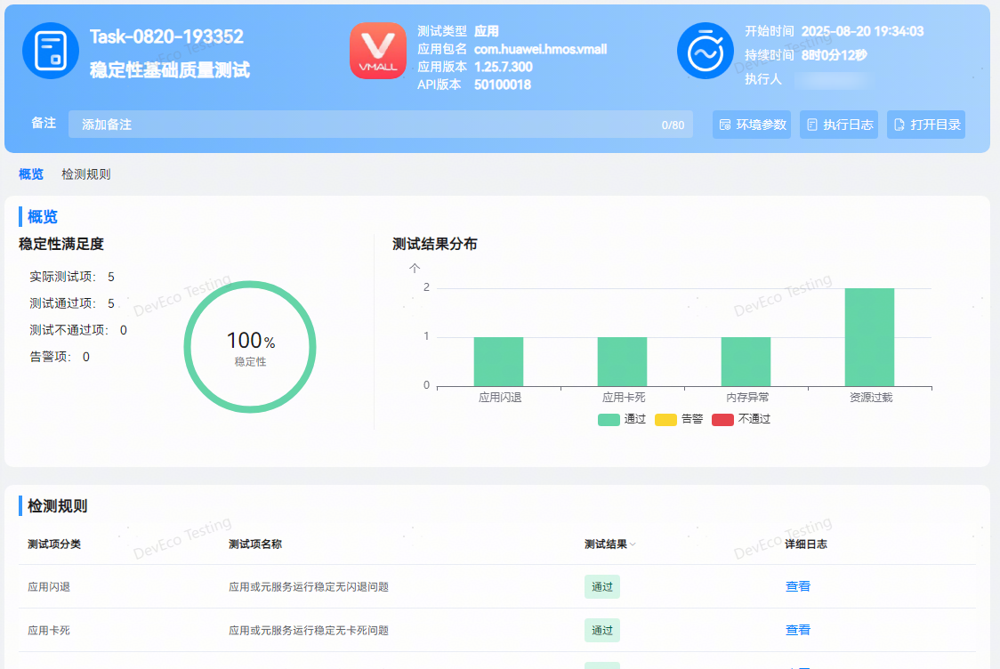

 
测试步骤执行全过程的图片和视频如下：
 

 

 
**perfdata****数据**
 
可使用[DevEco Studio](https://developer.huawei.com/consumer/cn/download/deveco-studio) 5.0.3.300及以上版本中的场景化调优工具DevEco Profiler打开及查看该文件，内含步骤执行过程中的trace打点和调用栈信息，也可使用压缩软件解压为单个的trace文件和调用栈文件，解压后的文件可使用[SmartPerf](https://gitcode.com/openharmony/developtools_smartperf_host)工具打开。
 

 
> [!NOTE]
> 更多场景化性能测试报告解读及常见问题，请前往DevEco Testing客户端->专项测试->场景化性能测试->任务创建页->测试指南中查询。 更多应用性能优化建议及问题定位，请查阅： 应用性能体验建议 及 最佳实践-性能-性能场景优化案例 。

 

 

##### 稳定性基础质量测试

 
**稳定性基础质量测试：**根据应用稳定性建议，检测应用运行过程中是否存在应用崩溃、资源过载、内存泄漏等异常情况。
 
**创建任务**
 
进入DevEco Testing客户端，在左侧菜单栏选择“专项测试”，点击“稳定性基础质量测试”服务卡片，即进入任务创建界面。用户按需配置任务参数，点击创建任务即开始测试。
 

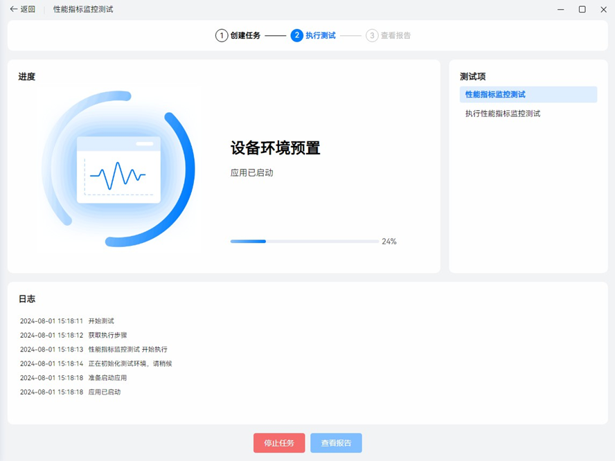

 
任务名称：用于标识任务，工具会根据时间生成默认任务名，支持自定义修改。
 
备注信息：按需填写任务备注信息，便于快速筛选报告。
 
测试设备：选择一个待测设备和待测应用。系统版本支持 HarmonyOS 5.0及以上版本。
 
选择应用：可选择测试设备上已安装的应用；或安装新的应用，即在测试设备上安装新的应用包。
 
是否卸载应用：选择卸载应用后，测试时会进行卸载无残留检测，测试任务结束后将自动卸载被测应用。
 
是否开启多线程检测：打开后，系统支持检测应用多线程安全问题（例如：多个线程并发写入操作）。
 
是否开启[MemDebug](https://developer.huawei.com/consumer/cn/doc/best-practices/bpta-stability-hwasan-detection#section10791454125320)模式：打开开关以后，会打开被测应用的内存越界检测开关，可以辅助发现和定位内存越界类问题。
 
> [!NOTE]
> 稳定性基础质量测试最佳测试时长建议设置为8 小时 。

 
**控件黑名单**
 

 
控件黑名单通过指定控件的关键字（控件感知语义或layout中控件text属性值）和控件Xpath进行正则匹配识别黑名单控件；黑名单控件在遍历中不会进行操作；屏蔽的黑名单控件在遍历过程中会在应用页面中置灰。
 
1、关键字：可以填写页面内可交互控件选框中的关键字，例如“购物车”、“我的订单”等。
 
2、XPath：可以通过Uiviewer工具或已有的遍历图谱文件获取控件的XPath。
 

 
> [!NOTE]
> 1、关于控件黑名单中“XPath”信息也可以通过探索测试报告中的遍历地图获取 ： 点击遍历地图中的关联线条；即可在右侧查看该跳转事件详情。

 

 
**测试执行**
 
创建任务后，将会跳转到执行页，进入测试环境初始化阶段。待测试环境初始化完成，待测应用被启动。
 

 
测试过程中，在测试页面可以看到测试进度、检测状态、实时投屏及执行日志。
 

 
**查看报告**
 
测试完成后，自动生成测试报告。报告包含任务信息、结果统计、检测规则。
 
任务信息中，可查看当前应用信息、任务执行时长及详细的环境参数（配置信息及环境信息），点击打开目录按钮支持导出 html 的报告文件。
 

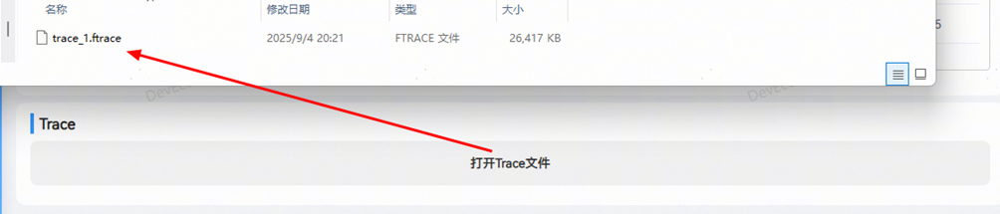

 
测试概览中，包含结果统计及检测规则，可直观查看本次任务中，测试项检测结果。
 

 
检测不通过或检测异常的规则项，点击查看详情即可查看异常问题详情，包含检测项概览、测试截图、问题列表。
 

 
点击查看按钮，支持查看测试过程中的日志，用户可结合问题描述及日志详情进一步分析。
 
> [!NOTE]
> 更多测试服务详情，请前往DevEco Testing客户端->专项测试->稳定性基础质量测试->任务创建页->测试指南中查询。 更多应用稳定性体验优化建议及问题定位，请查阅： 应用稳定性体验建议 及 CppCrash故障定位指导

 

 

##### 性能指标监控测试

**性能指标监控测试：**为用户提供指定业务场景性能测试能力，选择待测应用后手动操作应用，输出测试过程中应用和整机的性能指标数据。
 

 
**任务创建**
 
打开DevEco Testing客户端-专项测试-性能指标监控测试卡片，在任务创建界面按需配置任务参数，点击创建任务后开始测试。
 

 
任务名称：用于标识任务，根据时间生成默认任务名，支持自定义任务名称。
 
备注信息：按需填写任务备注信息，便于快速筛选报告。
 
测试设备：选择待测设备，待测设备的系统版本建议使用 HarmonyOS 5.0及以上版本。
 
选择应用：选择已安装在测试设备上的应用或安装新的应用。
 
指标监控：固定采集CPU和内存，用户自行选择是否采集其他指标项。
 
参数配置完成后，点击创建任务按钮开始测试。
 

 
**测试执行**
 
创建任务后，跳转到执行页，执行测试环境初始化操作。
 

 
等待测试环境初始化完成后，待测应用启动，自动跳转至监控页面，并启动监控，在手工测试场景准备好后，点击右上角的开始图标按钮，出现“开始采集”标识线，开始统计分析数据。
 

 
开始采集后，点击开始图标右侧的“记录”图标，可标识场景，并提示“场景开始”。待测场景结束后，再次点击，完成标识场景。概览中单独计算被标识的场景数据。
 

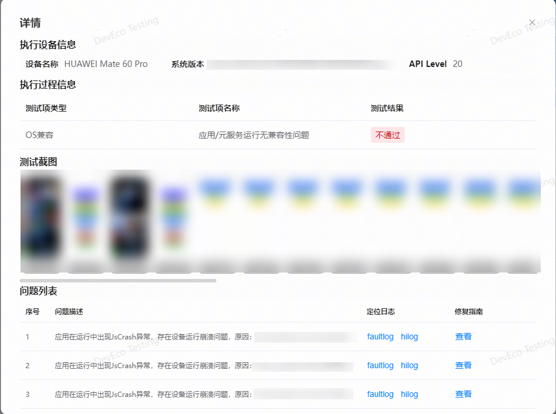

 
在测试过程中，可随时点击“采集 trace”按钮，采集连续30 秒的 trace 信息，单次任务只保留最近10 个 trace 文件。
 

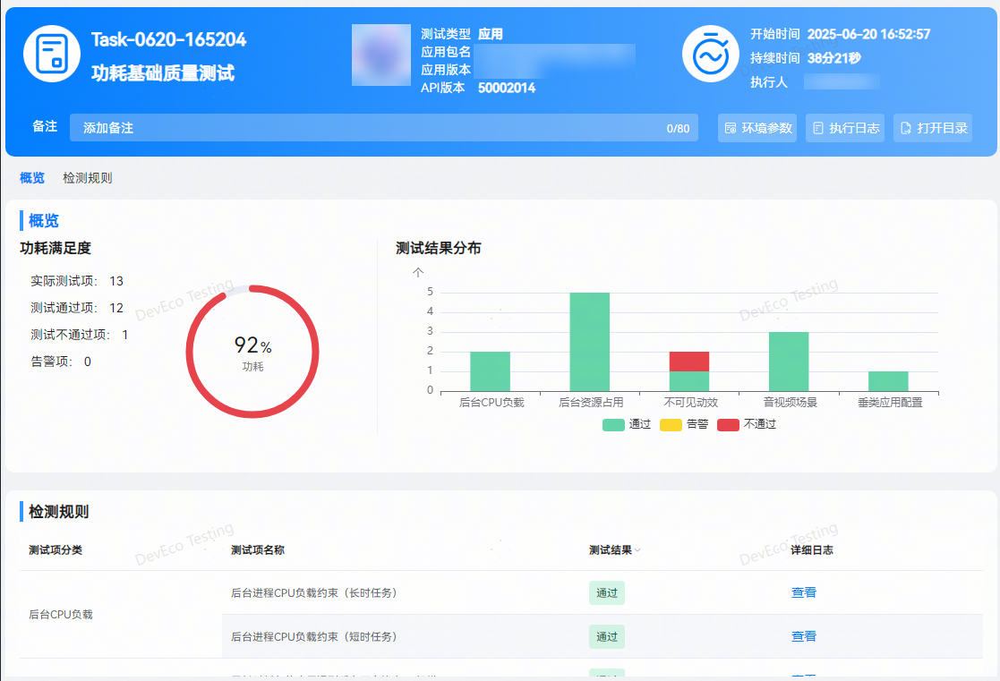

 
结束采集。
 

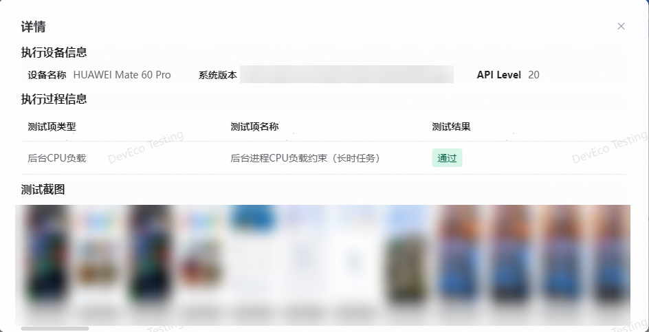

 

 
**查看报告**
 
测试报告包括：基本信息、环境参数、执行日志，打开目录及指标数据。
 
指标数据：包括 FPS、设备 CPU/GPU 的频率、负载监控等信息。
 

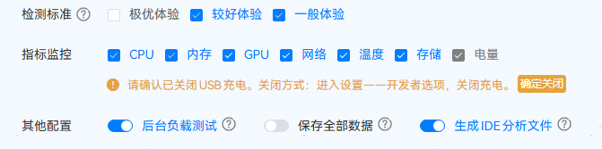

 

 
指标数据介绍：
 
FPS：应用界面每秒刷新次数。
 
帧间隔：两帧画面刷新时间的间隔。帧间隔应保持稳定，并与应用帧率负相关。当帧间隔过大时， 设备会出现卡顿现象。
 
CPU 频率：各个 CPU 核心的实时频率。在 ARM 架构下，相同规格的核心实时频率一致（即大、中、小核分别具有不同的实时频率，但相同的核心的实时频率一致）。
 
内存占用：应用及整机的各个内存指标测试数据。
 
GPU 频率：GPU 核心的实时频率。
 
GPU 负载：GPU 的当前负载。
 
温度：设备的壳温，前壳温，后壳温，soc 温度。
 
网络速率：应用测试过程中的网络上下行速率。
 
Trace：可以通过报告底部的"打开Trace文件"按钮跳转到trace文件目录。
 

 
 
> [!NOTE]
> 更多测试服务详情，请前往DevEco Testing客户端->专项测试->性能指标监控测试->任务创建页->测试指南中查询。

 

 

##### UX基础质量测试

 
**UX基础质量测试：**根据应用UX建议，验证应用在基础体验、系统特性适配、控件布局等方面是否合理。
 
测试完成后，自动生成测试报告。UX基础质量测试报告如下：
 
报告包含任务信息、执行结果、检测规则。支持查看当前应用信息、任务执行时长，及详细的环境参数（配置信息及环境信息），支持导出 html 的报告文件。
 

 
对于检测不通过及检测异常的规则项，点击查看详情即可查看异常问题详情，包含检测项概览、测试截图、问题列表。对于异常问题，可根据测试截图、问题描述，针对性优化异常问题。
 

 
> [!NOTE]
> 更多检测规则详情，请前往DevEco Testing客户端 ->专项测试 ->UX基础质量测试 ->任务创建页-测试指南中查询。

 

 

##### 安全基础质量测试

 
**安全基础质量测试：**根据应用安全测试建议，评估应用基础安全，如组件安全、存储安全、配置安全、签名安全等。
 
测试完成后，会自动生成测试报告。报告包含任务信息、执行结果、问题统计、检测规则。任务信息中，可查看当前应用信息、任务执行时长以及详细的环境参数（配置信息及环境信息），支持导出 html 的报告文件。
 
安全基础质量测试报告如下：
 

 
在测试报告中，包含执行结果、问题统计及检测规则。用户可直观查看本次任务中的测试项检测结果。
 
对于检测不通过的规则项，点击查看详情即可查看异常问题详情，包含执行设备信息、执行过程信息和问题列表；问题列表中有序号、问题描述和修复指南。
 

 
> [!NOTE]
> 更多测试服务详情，请前往DevEco Testing客户端->专项测试->安全基础质量测试->任务创建页->测试指南中查询。

 

 

##### 功能体验基础质量测试

 
**功能体验基础质量测试：**根据应用功能体验建议，检测应用在当前系统、设备及升级场景下运行是否存在兼容性问题。
 
测试完成后，自动生成测试报告。报告包含任务信息、执行结果、问题统计、检测规则。支持查看当前应用信息、任务执行时长及详细的环境参数，点击打开目录按钮可导出 html 格式报告。
 

 
检测不通过的规则项，点击查看按钮查看问题详情，包含执行设备信息、执行过程信息、测试截图、问题列表等。

 
> [!NOTE]
> 了解更多测试服务详情，请前往DevEco Testing客户端->专项测试->功能体验基础质量测试->任务创建页->测试指南中查询。

 

 

##### 功耗基础质量测试

 
**功耗基础质量测试：**根据应用功耗建议，检测应用在运行时是否出现系统资源异常占用的情况。
 
测试完成后，自动生成测试报告。报告包含任务信息、执行结果、问题统计、检测规则。支持查看当前应用信息、任务执行时长及详细的环境参数，支持导出 html 格式报告。
 

 
检测不通过的规则项，点击查看按钮查看问题详情，包含执行设备信息、执行过程信息、测试截图、问题列表等。
 

 
> [!NOTE]
> 了解更多测试服务详情，请前往DevEco Testing客户端->专项测试->功耗基础质量测试->任务创建页->测试指南中查询。
