# 实用工具

更新时间：2026-05-12 08:20:00

来源：https://developer.huawei.com/consumer/cn/doc/harmonyos-guides/tool

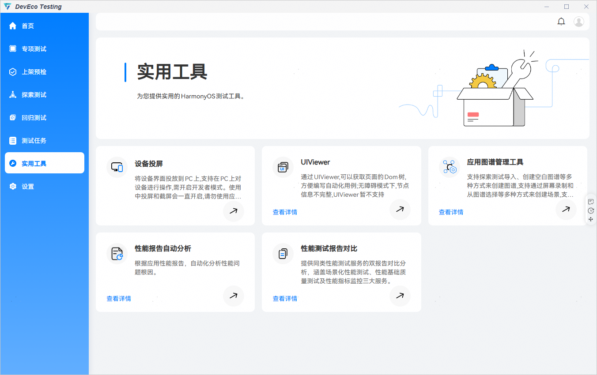

 

 

##### 应用图谱管理工具

**应用图谱管理工具：**支持从探索测试执行报告导入和创建空白图谱等多种方式创建图谱，支持通过屏幕录制和从图谱选择方式创建场景，支持对场景路径进行调试对比。
 
 

##### 应用图谱特性管理

 
打开DevEco Testing客户端，在左侧菜单栏选择“实用工具”，点击“应用图谱管理工具”卡片进入工具界面。
 

 
**创建图谱**
 
点击“创建图谱”，有以下选项：
 

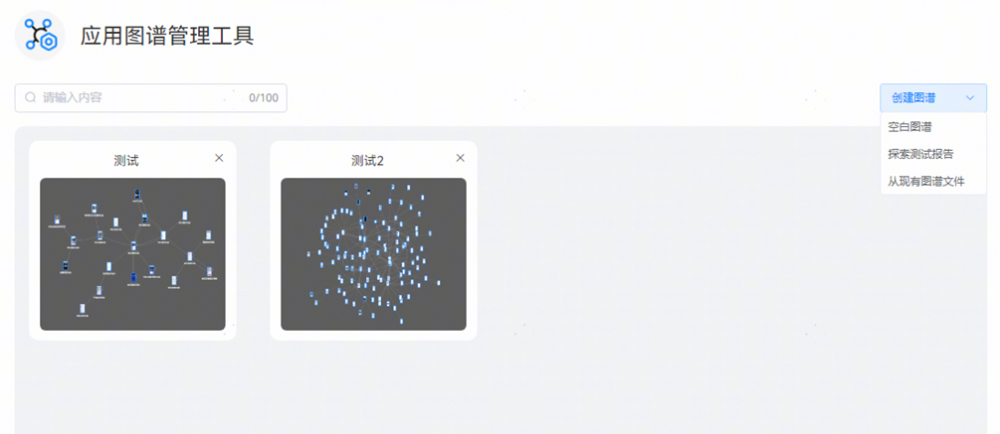

 

 
探索测试报告：选择相应的探索测试任务，输入待创建的图谱名称和说明。
 

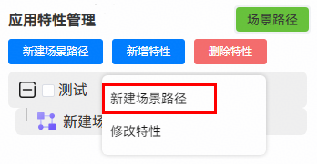

 

 
从现有图谱文件：复用已有的图谱文件。
 
在用户的DevEco Testing数据路径（DevEco Testing客户端->设置中可查看数据路径）中找到“graphTool”文件夹，找到相应图谱文件夹后；将其中所有打包成zip文件（注意：打包后文件需要直接是图谱文件，不能多加一层目录，如下图所示）。
 

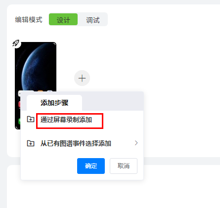

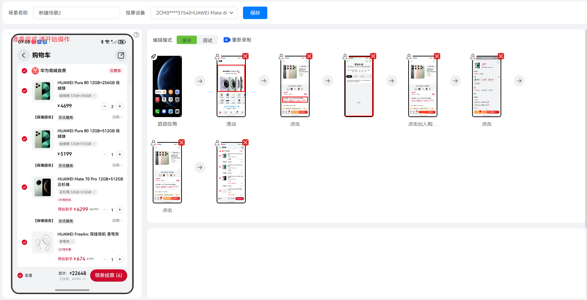

 
空白图谱：选择对应的应用创建空白图谱。
 
图谱名：图谱名称。
 
图谱说明：增加图谱说明。
 
设备列表：选择连接的设备。
 
应用包名：选择设备已安装的应用。
 
应用描述：对应用增加描述。
 

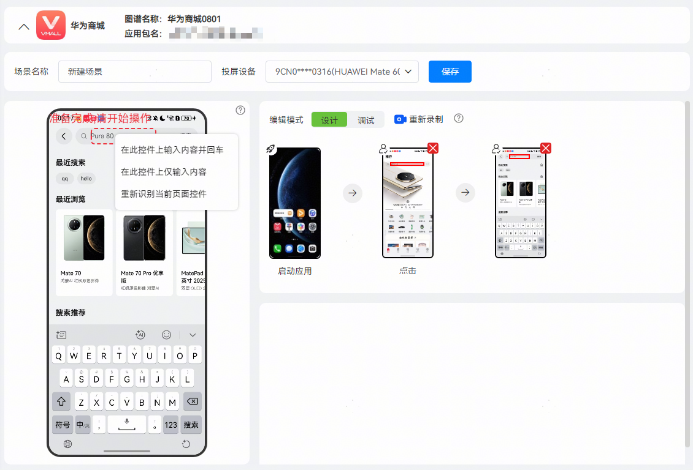

 
> [!NOTE]
> 在客户端设置->基本设置页面的数据路径下，“graphTool”文件夹存放所有图谱数据。

 
**特性管理**
 
新增特性：点击新增特性按钮，输入特性名称和特性描述（非必填），点击提交按钮新增特性。
 

 

 
删除特性：勾选特性后，点击删除特性按钮，勾选待删除特性，出现删除确认框，点击确定按钮完成删除。
 

 

 
编辑特性：鼠标右键点击特性名称，选择修改特性按钮，修改特性名称、特性描述信息。
 

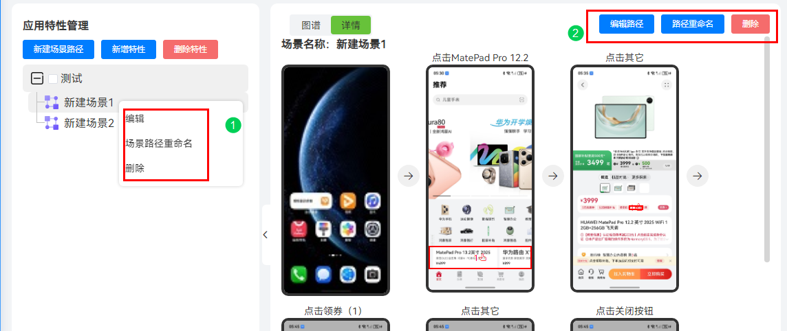

 

 

##### 应用图谱工具场景路径管理

 
**新建场景路径**
 
步骤1：选择已有特性，点击新建场景路径按钮或鼠标右键选择新建场景路径，进入场景路径编辑页面。
 

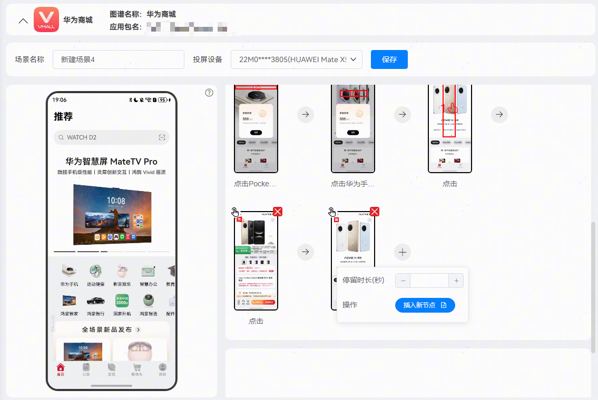
 
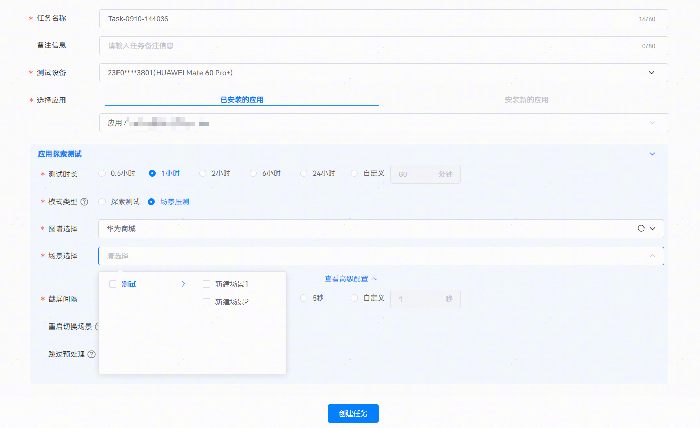

 

 
步骤2：“编辑模式”窗口中的首个页面为设备桌面截图。点击窗口中的“➕”号创建场景路径，支持“通过屏幕录制添加”和“从已有图谱事件选择添加”两种方式。
 

 
步骤3：添加场景路径。
 
（1）通过屏幕录制添加
 

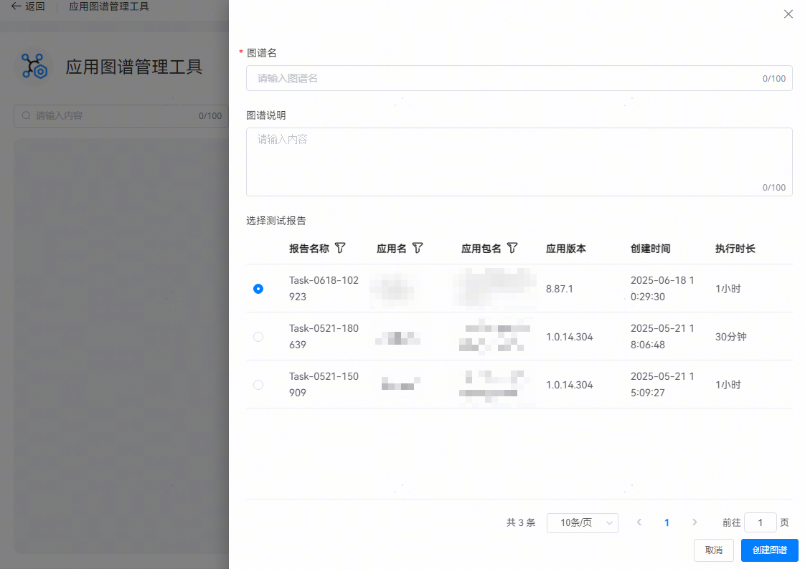

 

 
在点击“➕”号之后，选择“通过屏幕录制添加”。
 
通过在左侧投屏设备的区域内，执行点击、滑动或者右键弹窗输入文本动作，添加相应的场景步骤，点击保存按钮完成场景创建。
 

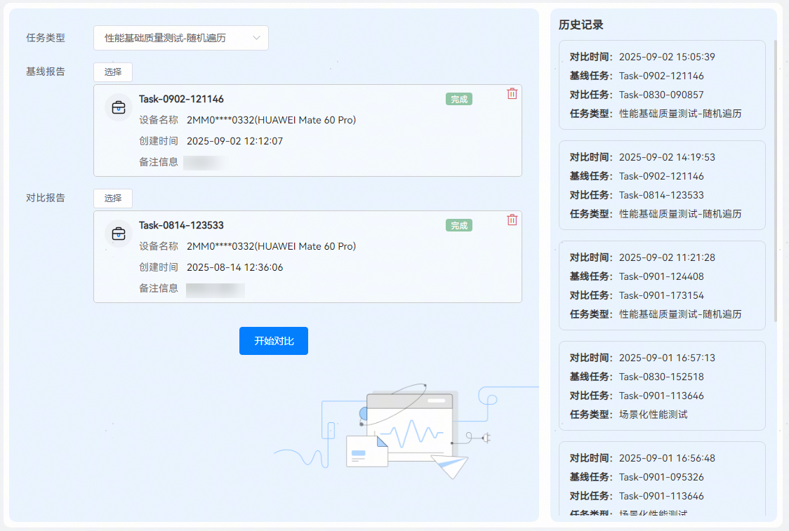

 

 
将鼠标移动到设备投屏上，右键单击后会出现以下功能选项：
 
在此控件上输入内容并回车：用于搜索场景，输入文本并搜索。
 
在此控件上仅输入内容：用于搜索和文本框场景，仅输入文本。
 
重新获取当前页面控件：当页面控件识别不准确，或未识别到预期控件时，重新获取当前界面的控件。
 

 
（2）从已有图谱事件选择添加
 

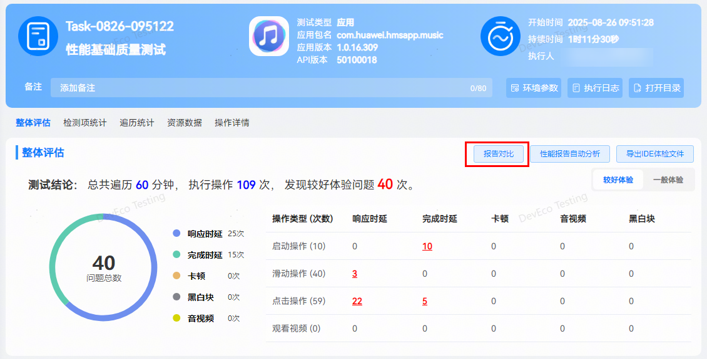

 

 
如下图所示：
 
①：展示当前页面。
 
②③：展示对应选框点击前后的页面。
 
点击“➕”号之后，选择“从已有图谱事件选择添加”，将出现图谱中记录的事件，选择图谱事件创建路径。
 

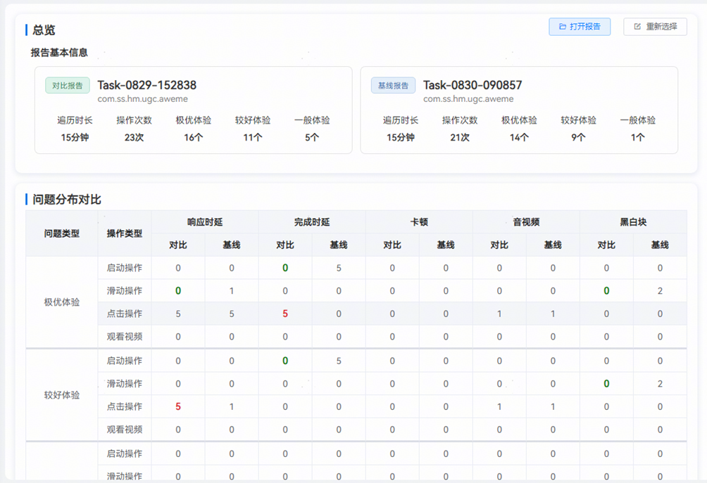

 

 
步骤4：调试场景路径。
 
场景路径创建完成后，支持对其进行调试，验证创建的场景路径能否在设备上运行正确。
 

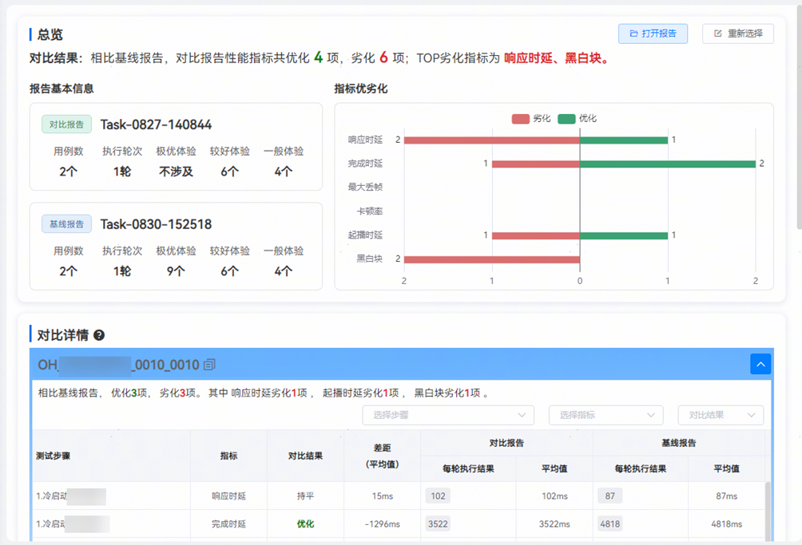

 

 
**编辑场景路径**
 
选择已有的场景路径，点击鼠标右键或点击窗口右上角的按钮进行编辑。
 

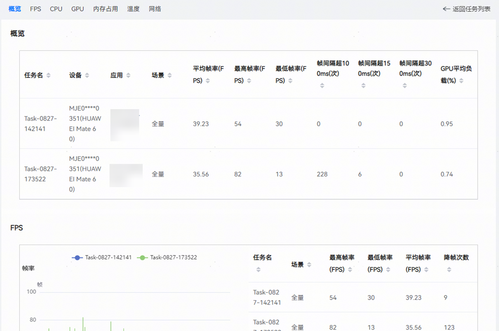

 

 
屏幕录制场景路径编辑：支持删除、刷新旧页面和“插入新节点”（注意：需手动将测试设备保持在所需页面）。
 

 

 
**场景路径压测**
 

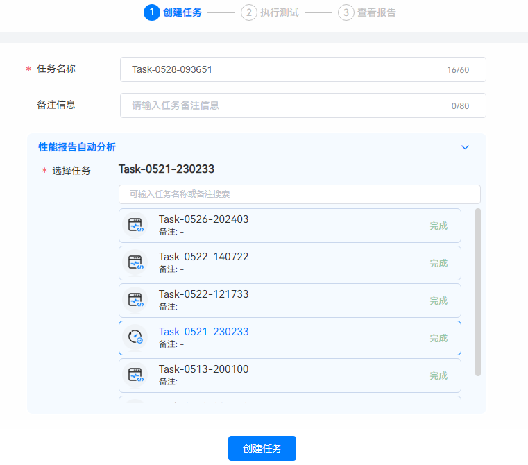

 

 
探索测试服务创建场景压测任务**：**
 
选择测试服务：打开DevEco Testing客户端，在左侧菜单栏选择“探索测试”，点击“探索测试”卡片，进入探索测试服务创建页面。
 
选择应用：选择应用图谱对应的应用。
 
选择图谱测试的路径：选择所需的测试时长、模式类型等配置信息。
 
模式类型：场景压测模式会出现场景选择选项。
 
图谱选择：选择编辑的图谱。
 
场景选择：选择已创建的场景路径。
 
创建任务：点击创建任务按钮，探索测试将在设定时间里循环对该路径进行压测。
 

 

##### 性能测试报告对比

 
**性能测试报告对比：**提供同类性能测试服务的报告对比分析，涵盖场景化性能测试、性能基础质量测试及性能指标监控测试三大服务。
 

 
**选择测试报告**
 
按需选择同类性能测试服务报告对比分析，支持按任务名、备注信息或任务状态筛选。点击开始对比，即可一键生成对比报告。
 
性能测试报告对比有两个任务创建通道。
 
（1）从实用工具创建任务
 
步骤1：进入工具任务创建页面。
 
点击导航栏的实用工具，点击“性能测试报告对比”进入任务创建页。
 

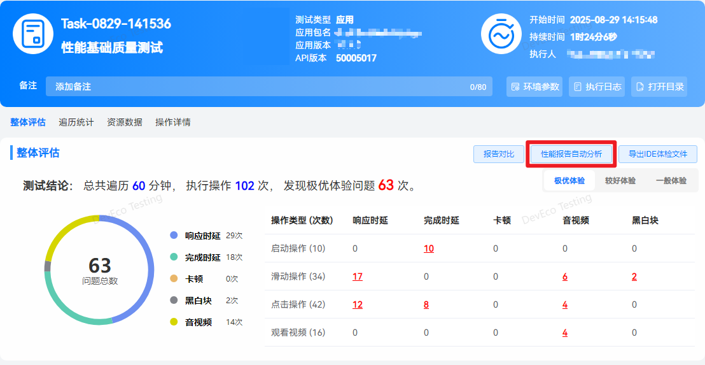

 
步骤2：点击选择需要分析的测试任务报告，再点击开始对比即可。
 

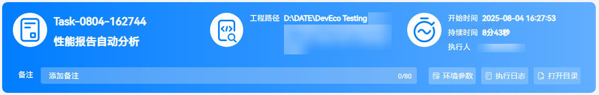
 

性能测试报告对比只支持场景化性能测试、性能基础质量测试和性能指标监控测试生成的报告。
 

 
（2）从性能报告页面创建任务
 
步骤1：在场景化性能测试和性能基础质量测试执行分析结束后，以性能基础质量测试为例，报告页面上会有“报告对比”按钮，点击后跳转至性能测试报告对比工具。
 

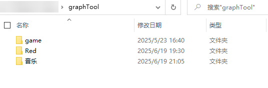

 
步骤2**：**跳转到性能测试报告对比创建任务界面后，会自动选中刚执行完的任务；选择基线报告后，点击开始对比。
 

 
**查看对比报告**
 
性能基础质量测试报告对比样例：
 

 
场景化性能测试报告对比样例：
 

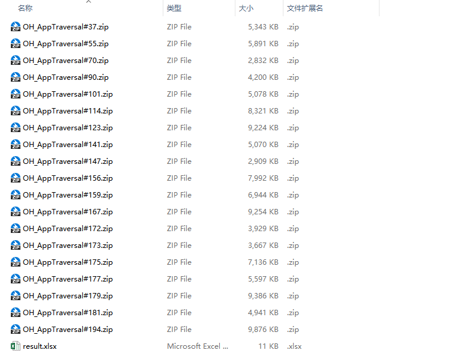

 
性能指标监控测试报告对比样例：
 

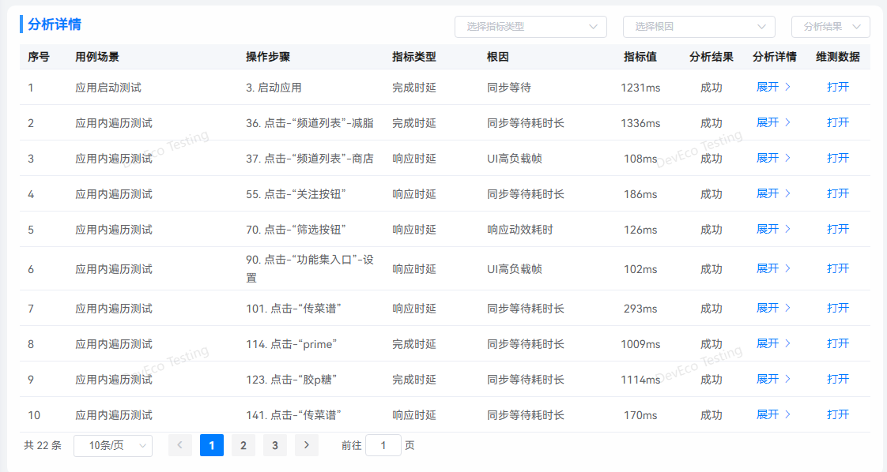

 

 

##### 性能报告自动分析

**性能报告自动分析：**工具通过自动化手段深入分析测试数据，运用高级算法和技术自动识别异常情况，并尝试定位问题的根本原因，帮助用户快速找到影响应用性能的关键因素。该工具支持分析场景化性能测试和性能基础质量测试两种服务生成的报告。
 

 
**工具使用场景：**用户在日常测试开发中遇到场景化性能测试或性能基础质量测试检测出的问题时，可使用本工具进一步分析问题原因。
 

 
性能报告自动分析会将检测指标分为以下几类，仅支持对部分指标进行诊断，具体如下：
  
| 指标大类 | 指标名称 |
| 时延 | 响应时延 |
| 时延 | 完成时延 |
| 卡顿 | 最大连续丢帧数 |
| 卡顿 | 卡顿率 |
 
 
**任务创建**
 
性能报告自动分析测试服务有两个创建通道。
 
 
（1）从实用工具创建任务
 
步骤1：进入工具任务创建页面，点击导航栏的实用工具，点击“性能报告自动分析卡片”进入任务创建页。
 
步骤2：点击选择需要分析的测试任务报告，再点击创建任务即可。
 

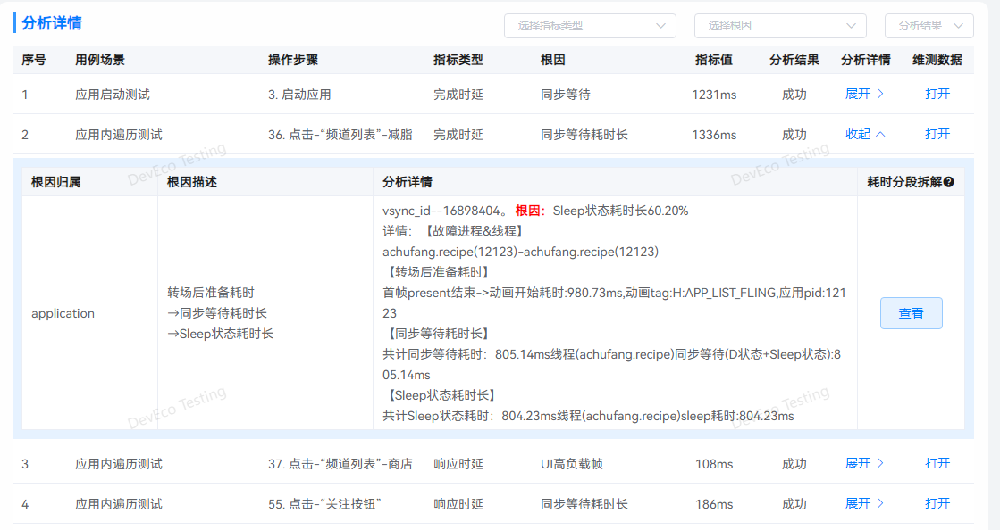
 

性能报告自动分析只支持场景化性能测试服务和性能基础质量测试服务生成的报告。
 

 

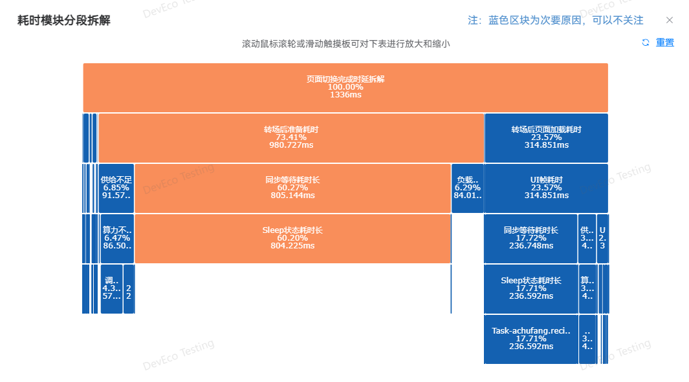

 
（2）从性能报告页页面创建任务
 
步骤1：在场景化性能测试和性能基础质量测试执行分析结束后，以性能基础质量测试为例，报告页面上会有“性能报告自动分析”按钮，点击后跳转至性能报告自动分析工具。
 

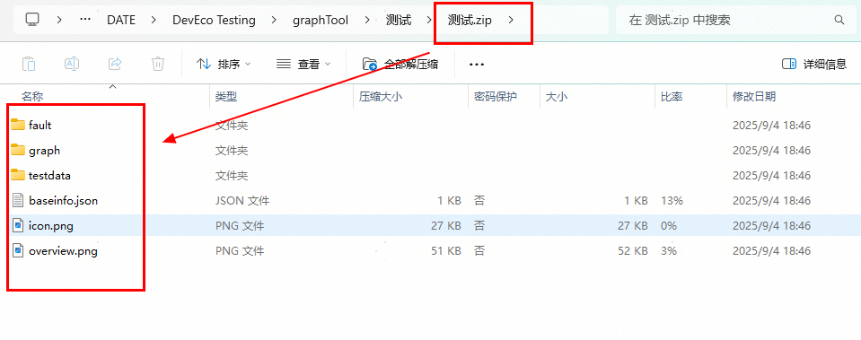

 
步骤2：跳转到性能报告自动分析创建任务界面后，会自动选中跳转前的任务；点击创建任务开始分析。
 

 
**报告解读**
 
**基础信息**
 

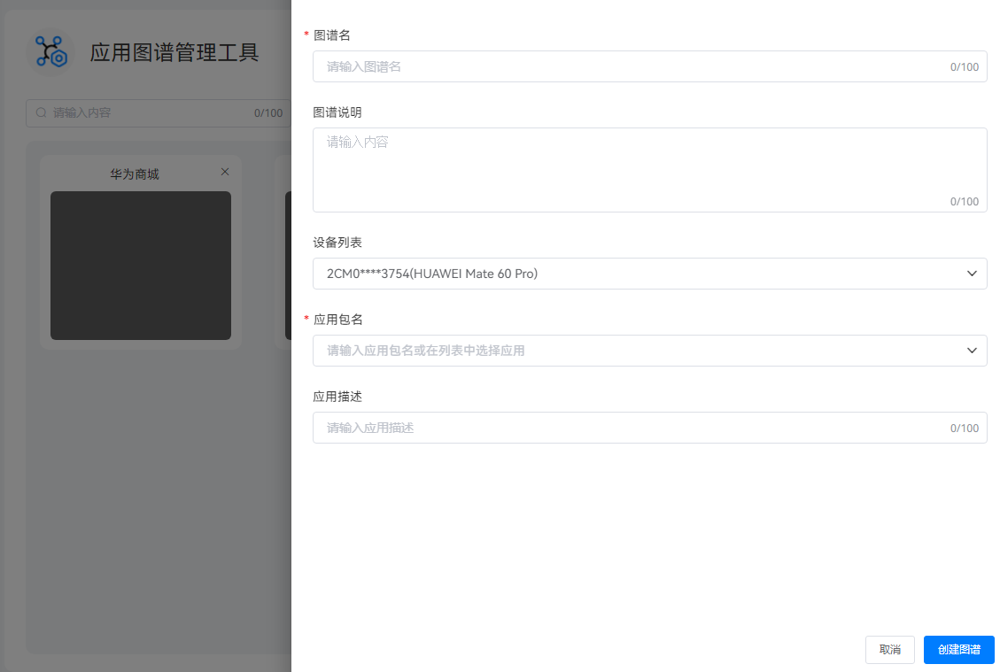

 
报告基础信息中主要包括如下部分**：**
 
- 任务信息：任务名称、开始时间、持续时间、执行人。
- 工程路径：分析的测试任务所在位置。
- 备注：备注信息支持自定义修改。
- 环境参数：支持查看任务下发的参数。
- 执行日志：支持查看任务执行过程中的日志，支持日志级别的筛选。
- 打开目录：点击打开任务数据文件夹。

 

 
**概览**
 

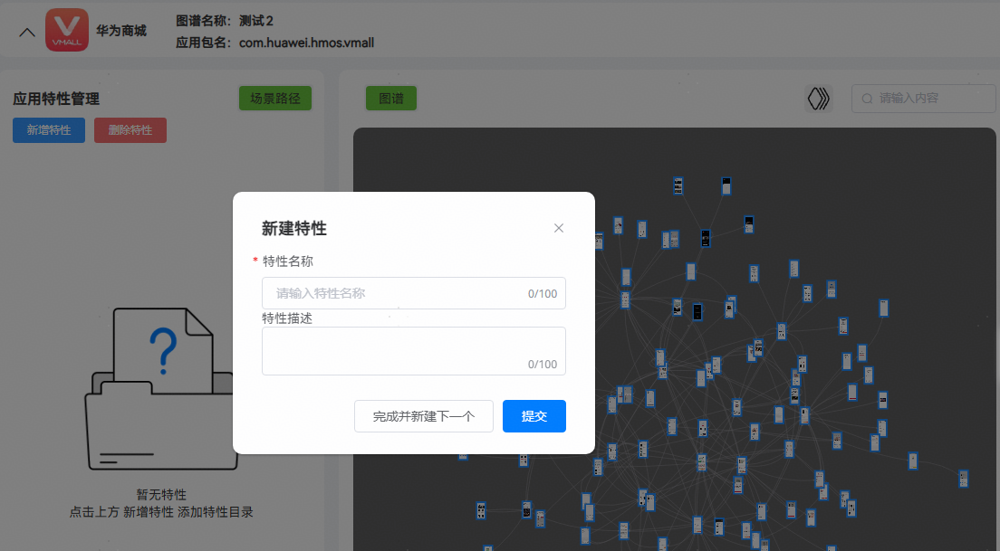

 
测试服务：分析的任务类型。
 
测试报告名称：分析的任务名称，点击可跳转至该报告。
 
支持问题分析数/问题总数：如上文介绍，部分问题不支持分析，因此分析数会存在小于总数的情况。
 
根因统计：所有分析问题的根因统计列表，由于一个问题可能存在多个根因，因此总数可能大于问题数。
 
分析结果导出：将所有支持分析的问题步骤打包归类在导出目录下，并生成excel文件存储每个文件对应的分析结论，每个问题步骤会打包成zip文件，每个 zip 文件包含 perfdata，视频和帧图片集。
 
导出的目录内容结构如下所示：
 

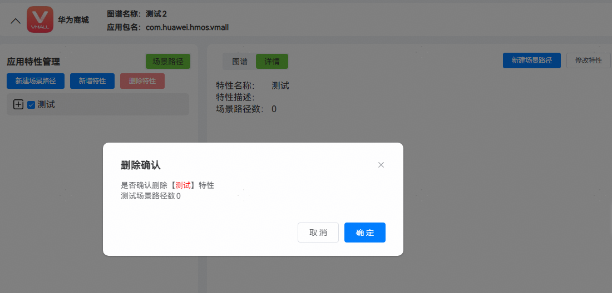

 
**分析详情**
 

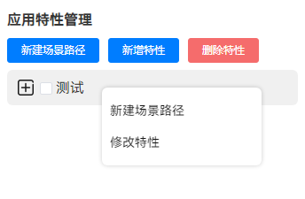

 
用例场景：测试用例名称。
 
操作步骤：测试步骤名称。
 
指标类型：不达标的问题类型。
 
根因：导致不达标的主要原因。
 
指标值：指标具体的测试值。
 
分析结果：成功表示存在分析结论详情，失败表示该任务未分析出具体结果。
 
维测数据：点击打开按钮可以跳转到问题步骤对应的资源文件目录。
 
分析详情：点击展开可以看到对应问题的详细分析结果。
 

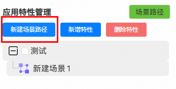

 
根因归属：导致此问题的主要原因在于应用还是系统。
 
根因描述：问题产生的原因描述，从上到下根因归类更细。
 
分析详情：详细的分析结果，如哪段函数耗时异常、节点创建过多等问题。
 
耗时分段拆解：自顶向下逐步分解性能问题，聚焦真正影响性能的问题。橙色区块代表影响性能的主要原因，需要重点关注；蓝色区块代表耗时拆解的次要原因，对性能问题影响较小。
 

