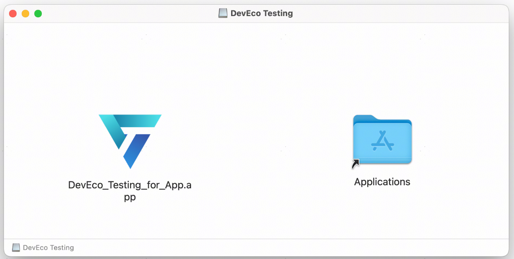
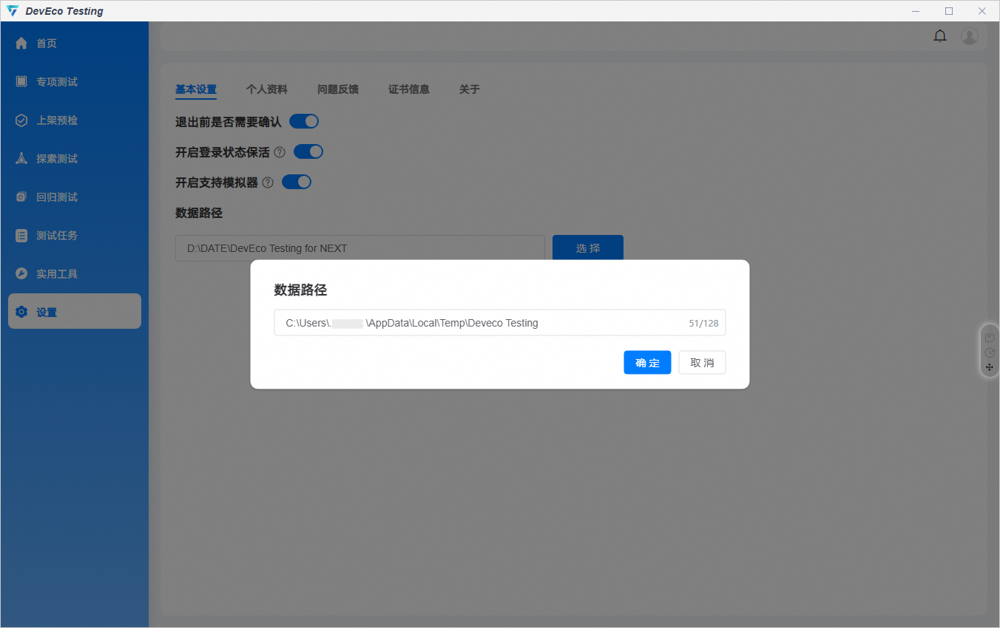

# 常见问题

更新时间：2026-05-19 05:53:00

来源：https://developer.huawei.com/consumer/cn/doc/harmonyos-guides/faq

**Q1：执行过程中，设备断连重连后，任务能否继续执行？**
A1：如果发生设备断连情况，测试会终止，并生成测试报告，由于测试执行不充分，会导致生成的报告数据不完整，请确保设备在测试的过程中正常连接。
**Q2：设备已连接，为什么设备列表中未显示该设备？**
A2：需满足以下条件，才能使用DevEco Testing识别设备并进行测试：
1. 设备系统版本为HarmonyOS 5.0及以上。
2. PC与本地设备通过USB连接，设备需要进入设置-系统-开发者模式，开启开发者模式和USB调试权限。
3. 将 DevEco Testing 安装目录下的 hdc 路径配置至系统环境变量中。
4. 在CMD窗口中执行hdc list targets命令，可以识别到设备。
**Q3：为什么在测试任务执行过程中，结束客户端进程后手机端还会继续执行至完成？**
A3：若DevEco Testing客户端非正常关闭，有可能会出现这种情况：被测设备的测试任务依然在执行。原因是测试任务已下发到测试设备中，客户端非正常关闭后无法操作设备停止任务。
**Q4：Mac版DevEco Testing客户端使用性能基础质量测试、上架预检等卡片出现“AI模型暂未启动，请稍后再试”。为什么排查后找不到原因？**
A4：请确认Mac版DevEco Testing客户端是否按照以下步骤安装：
步骤1：DevEco Testing 客户端下载完成后将出现下图弹框。将下载的 DevEco_Testing_for_App 文件拖拽至 Applications 文件夹。

步骤2：在启动台找到 DevEco Testing 图标则表示 DevEco Testing 已正常安装。
**Q5：Mac版本客户端使用覆盖安装后进入客户端后报错，如何解决？**
A5：点击取消报错弹框，进入客户端设置选项，关闭"开启登录状态保活"；最后点击“关于”退出登录。完成以上操作后重新登录即可恢复。
**Q6：Mac版本客户端如果覆盖安装后，报错****“‘DevEco_Testing_for_App’ 已损坏，无法打开。你应该将它移到废纸篓。”****，如何解决？**
A6：请先重启电脑，再重新覆盖安装。
注：退出 DevEco Testing 客户端时，建议点击客户端界面左上角的关闭按钮或者在dock栏 control 键+鼠标点击 DevEco Testing 图标进行退出。
**Q7：win版本客户端，在进行上架预检****测试时，性能基础质量测试执行异常，报告页性能无数据，如何解决？**
A7：如当前电脑仅有C盘，需要在客户端将数据目录设置为 C:\Users\...\AppData\Local\Temp\Deveco Testing 。

更多问题详见[FAQ](https://developer.huawei.com/consumer/cn/doc/harmonyos-faqs/faqs-deveco-testing)