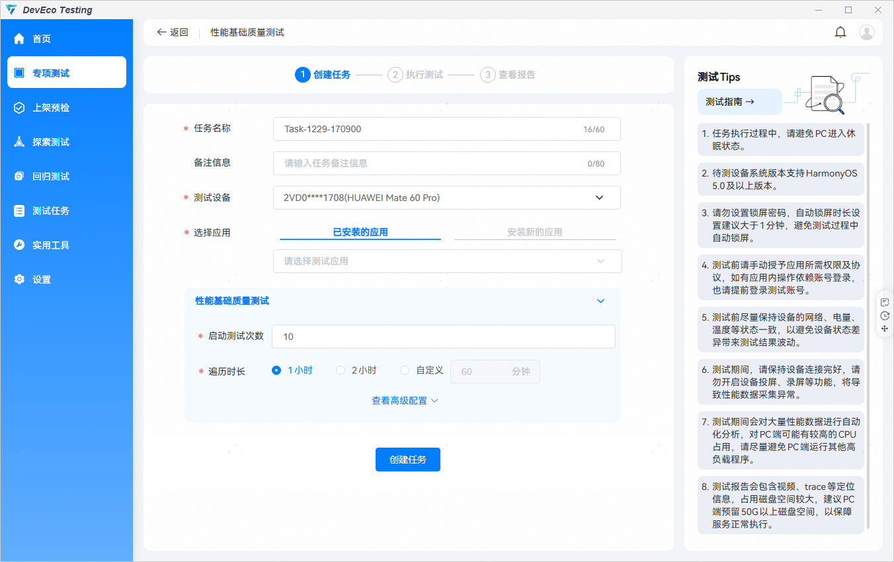
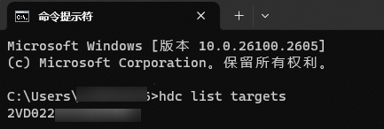
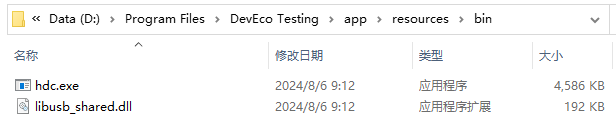
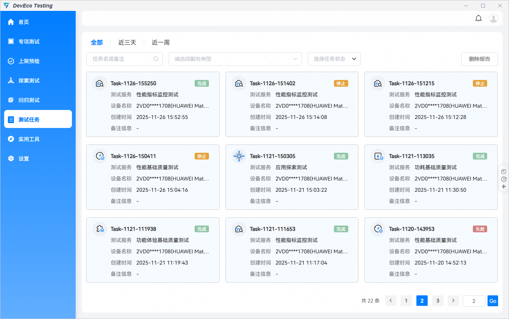
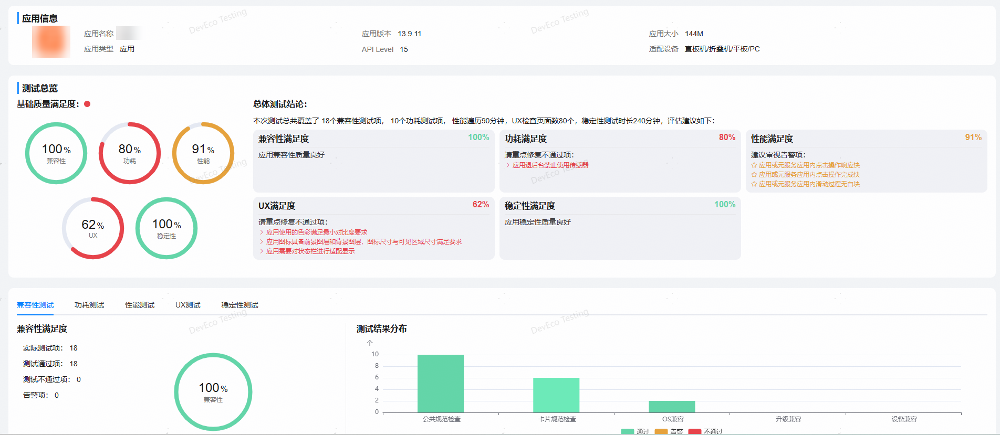
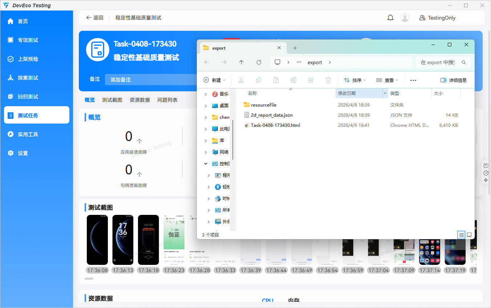

# 快速上手

更新时间：2026-04-20 07:02:00

来源：https://developer.huawei.com/consumer/cn/doc/harmonyos-guides/get-familiar

DevEco Testing是一款专项集成测试工具，提供了多项测试能力。DevEco Testing将测试能力以测试服务卡片的形式呈现给用户，无需复杂的配置，即可一键执行测试任务，同时提供了测试报告和分析，辅助开发者发现应用和产品问题，提升应用质量。
 
**环境要求**：
 
（1）PC （Windows、Mac），安装DevEco Testing客户端。[DevEco Testing工具下载地址](https://developer.huawei.com/consumer/cn/download/deveco-testing)
 
**Windows**
 
操作系统：Windows 10/11 64 位；
 
内存：推荐使用16GB及以上（可用内存大于8G）；
 
处理器：i7-10700@2.9GHz或者同等性能的型号；
 
硬盘：可用硬盘空间100GB以上。
 
**Mac**
 
操作系统：MacOS（arm）15&26，MacOS（x86）15；
 
内存：推荐使用16GB及以上（可用内存大于8G）；
 
处理器：i7-10700@2.9GHz及以上或Apple silicon M系列；
 
硬盘：可用硬盘空间100GB以上。
 

 

如果可用硬盘空间低于30GB，建议清理磁盘空间后再创建任务。
 

 
（2）被测设备要求：
 
- 设备版本HarmonyOS 5.0及以上版本。
- 确保手机性能状态正常，包括网络连接通畅、非高温、非低电量（推荐>80%），以及其他可能对性能表现产生影响的变量。
- 取消各类锁屏密码，确保自动化能完成上滑解锁。
- 应用图标在桌面可见（自动化会翻页查找不同桌面，但不会打开文件夹）。
- 对待测应用进行必要的预置操作，包括权限授予、用户协议确认、账号登录等，以保障自动化遍历可顺利进行。

 

 
**快速开始**
 
选择应用时，支持选择测试设备上已安装的应用或者安装新的应用，即在测试设备上安装新的应用包。
 

 

 

Q1：HarmonyOS 5.0及以上版本设备已连接，DevEco Testing为什么无法识别设备？
 
A1：请在cmd窗口中执行hdc list targets，确认设备正常连接。正常连接如下：
 

 
如返回为空，则表示USB连接没有建立，需排查PC机USB驱动、USB线缆连接、手机是否开启USB调试模式。
 
若hdc list targets能识别到设备，DevEco Testing未识别到设备，请将DevEco Testing安装路径中的hdc路径配置至PATH环境变量中，即可正常识别。
 

 

 

 
**测试任务**
 

 
1、用户在DevEco Testing工具导航栏 —【测试任务】中可以查看当前正在执行和历史执行的测试任务。用户可通过顶部操作栏，按任务名/备注、服务类型、任务状态筛选测试任务。
 
2、测试任务分为5种状态（执行、完成、失败、停止、取消），用户可以通过下拉选择任务状态筛选过滤界面上所展示的测试任务。
 
测试任务状态描述如下：
 
执行：测试任务执行中
 
完成：测试任务执行完成
 
失败：测试任务执行失败（通常为任务初始化发生异常）
 
停止：测试任务过程被手动中止
 
取消：测试任务未执行取消（通常出现在客户端异常退出时）
 
3、对于无效测试报告，用户可以定期清理相关报告。点击删除报告，选择要删除的报告，系统将删除本页面内的测试报告。
 

 

 
**测试报告**
 
DevEco Testing执行测试任务结束后会生成测试报告，测试报告整体分为两个部分，上半部分为测试报告概览，下半部分为测试报告详情。
 
1、测试报告概览包含应用信息、参数配置、执行日志等，可点击查询相关信息。
 

 
2、不同的测试服务报告详情不同，以下图的应用上架预检（本地）为例，测试报告详情由应用信息、测试总览、各项检测数据组成。
 

 
3、测试报告支持手动备注，方便测试人员标记任务，并提供报告导出功能，点击报告页面“打开目录”按钮，可导出html格式的报告文件。
 

