# 探索测试

更新时间：2026-04-20 07:02:00

来源：https://developer.huawei.com/consumer/cn/doc/harmonyos-guides/exploratory-testing

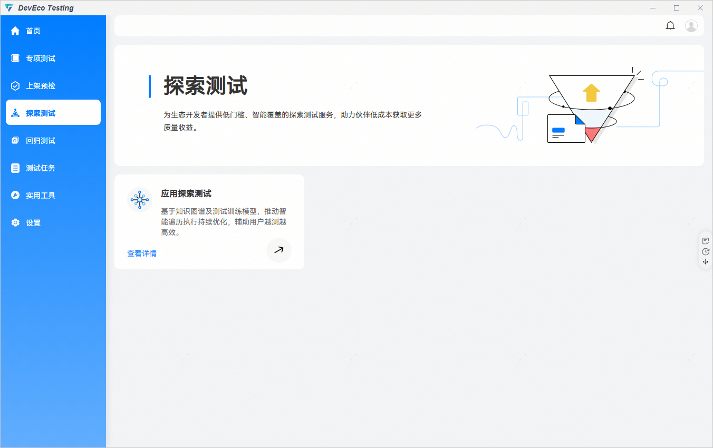

 

#### 应用探索测试

 
**应用探索测试：**通过在测试过程中结合专家经验与AI技术，对测试数据持续学习，实现场景智能感知和控件语义分析，以不断优化遍历策略，帮助用户高效识别和定位应用中潜在异常、崩溃、泄漏等稳定性问题。
 

 
**创建任务**
 
进入DevEco Testing客户端，在左侧菜单栏选择“探索测试”，点击“应用探索测试”卡片，进入任务创建界面。按需配置任务参数，点击创建任务开始测试。
 

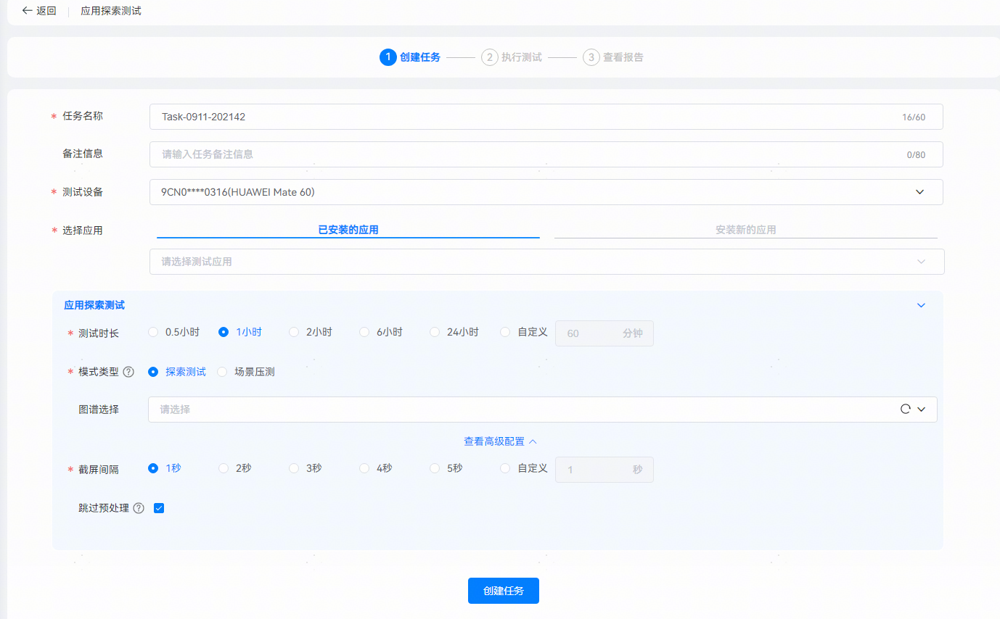

 
任务名称：用于标识任务，系统会根据时间生成默认任务名，支持用户自定义修改。
 
备注信息：填写任务备注信息，便于快速筛选报告。
 
测试设备：待测设备，支持 HarmonyOS 5.0及以上版本。
 
选择应用：选择测试设备上已安装的应用，或在测试设备上安装新的应用包。
 
测试时长：任务总时长，建议时长不低于1小时，时长过低的测试结果不具备代表性。
 
模式类型：可选探索测试模式或者场景压测模式。
 
- 探索测试 ：基于智能遍历算法，通过模拟用户的操作，对应用进行长时间、高频率操作。

 
- 场景压测 ：基于应用探索测试生成的应用图谱，在图谱管理工具中进行自定义场景，对指定页面进行压测。

 

#### **探索测试****模式**

 
图谱选择（非必选项）：选择应用后，将提供该应用在应用图谱管理工具中的图谱以供选择。
 

 
> [!NOTE]
> 不选择图谱文件：探索测试将进行随机遍历，在设置的时间内遍历应用页面，并生成图谱文件。 选择图谱文件：探索测试将优先遍历图谱文件中的各个节点。 关于图谱文件的介绍，可查看 应用图谱管理工具 -> 创建图谱 指导文档。

 

#### **场景压测****模式**

 
图谱选择：选择应用后，将提供该应用在应用图谱管理工具中的图谱以供选择。
 
场景选择：选择在应用图谱管理工具中创建的场景路径。
 

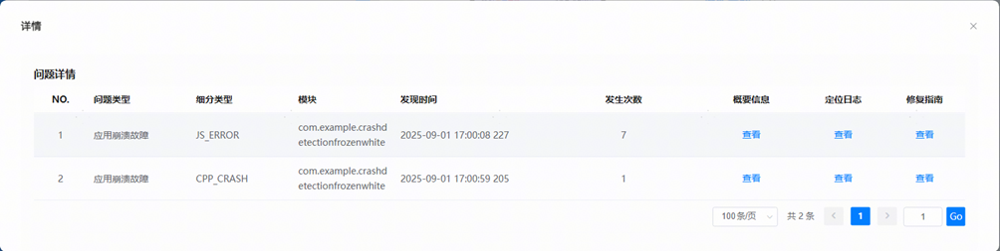

 
> [!NOTE]
> 创建场景压测任务前需要自定义创建场景路径，可查看 应用图谱工具场景路径管理 指导文档。

 
**高级配置**
 
重启切换场景：场景压测中场景切换是否通过重启应用完成。当不勾选时，正常执行需要场景的开始和结束都为首页。
 
截屏间隔：步骤执行完成操作后到页面截图的时间间隔。
 
跳过预处理：预处理流程会授予待测应用定位、通知、网络等权限，并自动跳过引导页、登录华为账号。如果前述操作未实施，建议取消勾选。
 
参数配置完成后，点击“创建任务”即开始测试。
 

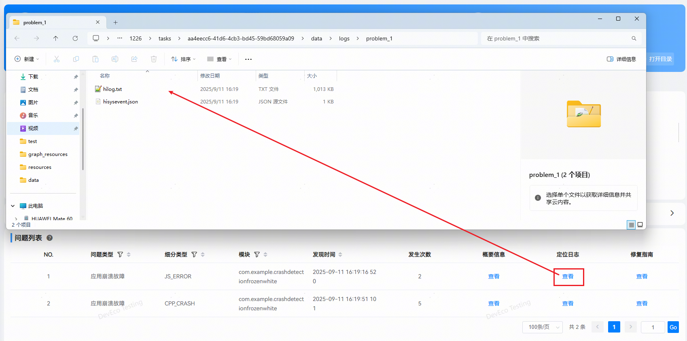

 
**测试执行**
 
任务创建后进入测试执行页面。创建任务时，如未选择跳过预处理，则会在遍历开始前，进行应用预处理，如同意隐私声明，自动授予待测应用定位、通知、网络等权限，并自动跳过引导页、登录华为账号。在测试过程中，页面显示测试进度、遍历路径地图、设备截图及语义分析过程。
 
探索测试执行页面：
 

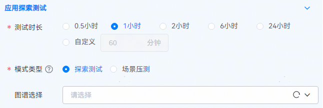

 
场景压测执行页面：
 

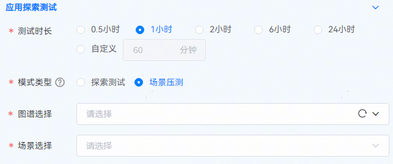

 
AI语义分析：智能AI结合用户操作习惯，为界面控件归类排序，测试过程参照排序执行。测试过程中支持用户暂停或启动语义分析，语义分析暂停时，任务会继续计时，直至任务时间结束。
 
控件色块颜色说明：
 
绿色：下一步即将操作的控件。
 
黄色：鼠标悬停在控件语义识别列表时关联的控件。
 
蓝色：已覆盖遍历的控件。
 
灰色：黑名单被屏蔽的控件。
 
测试过程中，会优先覆盖核心功能区域，如底部菜单栏、顶部频道栏、应用功能集入口等，探索出应用的主要功能页面；完成核心功能区域覆盖后执行常见的测试操作，如扫码、关注、点赞、收藏等，保障应用关键事件覆盖完全；最后补充遍历非核心功能页面和控件，补全应用图谱。
 
测试过程中可实时查看故障数据，点击页面上故障红色提示数字，查看问题列表与详细信息。
 

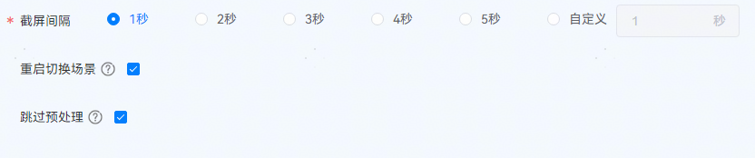

 
执行过程中如果发生设备断连、重启等情况，遍历暂停，但任务会继续计时；当设备重新连接（或重启完毕），遍历任务继续执行，断连（或重启）前的测试信息依然存在；若设备断连，且在测试任务完成前都未重新连接，则会导致生成的报告数据不完整。 
 

 
**测试报告**
 
探索测试报告页面:
 

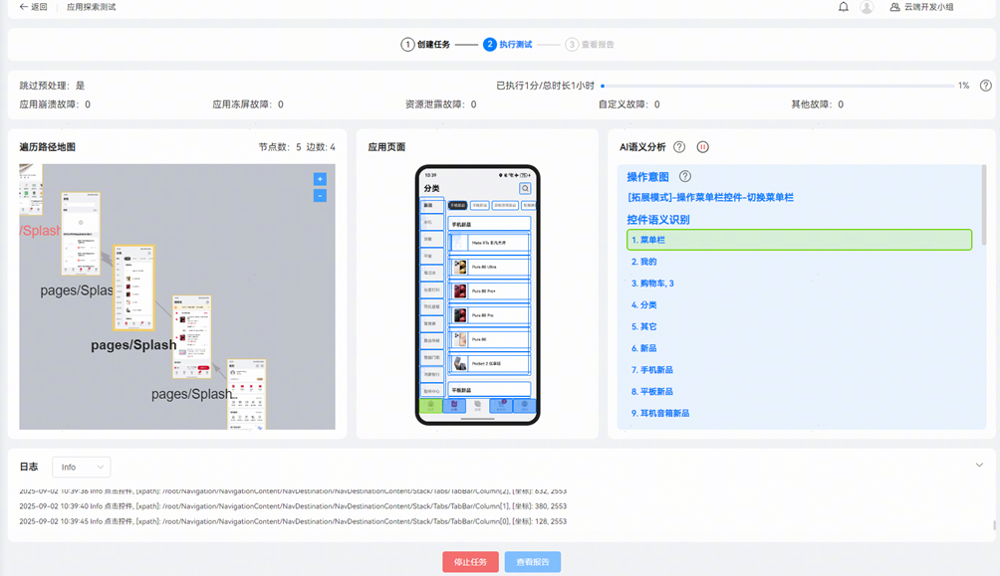

 
场景压测报告页面：
 

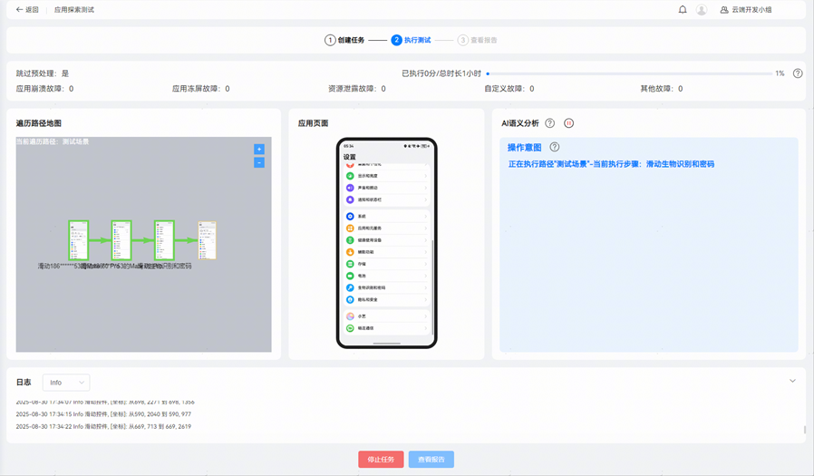

 
任务信息：在报告的最上方可查看本次任务的应用信息，运行时间，环境参数和执行日志，点击打开目录按钮可导出html格式报告。
 
应用信息：获取待测试应用的包名、版本、API版本。
 
环境参数：展示测试设备信息和参数配置。
 
概览：本次任务的主要数据概览及本次任务模型包存放路径。
 
遍历路径地图：本次任务遍历的页面地图。
 
压测详情：选择场景压测模式，压测的节点以及次数等信息可显示在报告页。点击失败次数显示失败的页面截图。
 
问题列表：对测试过程中产生问题信息的分类统计。点击列表中
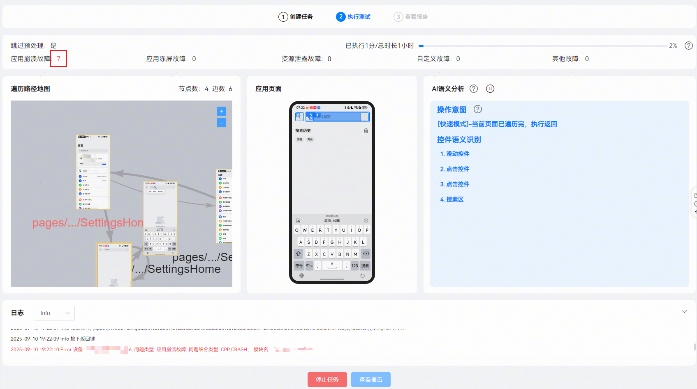
符号能够对指定列的数据进行筛选，点击列表中
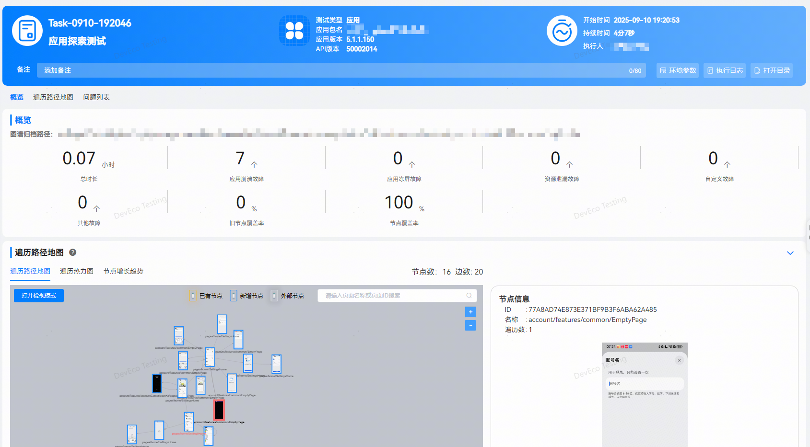
三角符号可以对指定列进行正序或倒序的排序，默认按照发生时间的正序排序。点击概要信息列查看按钮对应故障的概要信息，点击定位日志列查看按钮跳转到存放faultlog日志及故障发生时段hilog日志的文件夹。
 
问题详情：
 

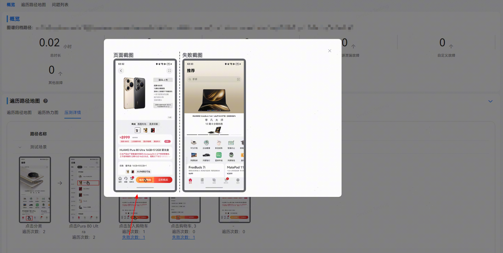

 
故障概要信息：
 

 
定位日志：
 

 
*更多应用稳定性体验优化建议及问题定位，请查阅：[应用稳定性体验建议](https://developer.huawei.com/consumer/cn/doc/harmonyos-guides/experience-suggestions-stability) 及 [稳定性概览](https://developer.huawei.com/consumer/cn/doc/best-practices/bpta-stability-overview)
 

 
**测试****故障说明**
 
DevEco Testing探索测试服务会发现并收集测试过程中发生的故障，故障类型包含以下几种：
 1. [JS_CRASH](https://developer.huawei.com/consumer/cn/doc/best-practices/bpta-stability-app-crash-js-way)：应用异常，应用程序在JS层发生了崩溃。
2. [APP_FREEZE](https://developer.huawei.com/consumer/cn/doc/best-practices/bpta-stability-runtime-freeze-detection)：应用无响应，前台应用无法及时响应用户操作。
3. [CPP_CRASH](https://developer.huawei.com/consumer/cn/doc/best-practices/bpta-stability-app-crash-cpp-way)：进程崩溃，C++编写的Native进程（包含c++应用进程和统服务进程）发生崩溃。
4. [FD_LEAK](https://developer.huawei.com/consumer/cn/doc/best-practices/bpta-stability-file-handle-detection)：句柄泄漏故障，是由于进程句柄数过高且持续增长，以此判定该进程可能存在句柄泄漏。
5. [THREAD_LEAK](https://developer.huawei.com/consumer/cn/doc/best-practices/bpta-stability-thread-leak-detection)：线程泄漏故障，是由于进程的线程数过高且持续增长，以此判定该进程可能存在线程泄漏。
6. [MEMORY_LEAK](https://developer.huawei.com/consumer/cn/doc/best-practices/bpta-stability-memleak-detection-overview)：内存泄漏故障，是由于进程的PSS内存大小过高且持续增长，以此判定该进程可能存在内存泄漏。
7. [HiAppEvent](https://developer.huawei.com/consumer/cn/doc/harmonyos-guides/hiappevent-intro)：HiAppEvent故障是来自应用开发者在应用内预埋的HiAppEvent故障类打点事件，每一个HiAppEvent故障类事件会生成一个对应的故障记录。
 

 
> [!NOTE]
> 更多测试服务详情，请前往DevEco Testing客户端 -> 探索测试 -> 应用探索测试 -> 任务创建页 -> 测试指南中查询。
