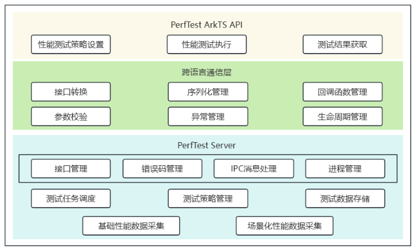
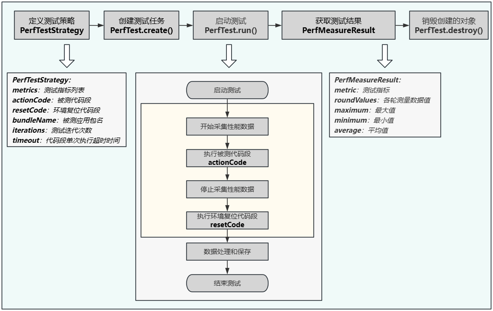

# 白盒性能测试框架使用指导

更新时间：2026-04-21 08:58:00

来源：https://developer.huawei.com/consumer/cn/doc/harmonyos-guides/perftest-guideline

## 简介

白盒性能测试框架（PerfTest），提供了针对指定代码段运行时的白盒性能测试能力，用于度量指定应用进程的性能表现。框架通过多轮迭代执行机制和环境复位机制实现自动化测试，支持耗时、CPU使用率等基础数据和启动时延、滑动帧率等场景化性能数据的采集和度量。使用PerfTest接口的性能测试脚本需基于单元测试框架进行开发。

## 实现原理

PerfTest功能设计图如下所示：

PerfTest对外提供ArkTS API，包括性能测试策略设置、性能测试执行、测试结果获取等能力。具体请参考[API文档](https://developer.huawei.com/consumer/cn/doc/harmonyos-references/js-apis-perftest)。 跨语言通信层负责上层ArkTS接口与底层C++接口的转换，包括参数校验、JSON序列化对象处理和异常处理等。作为PerfTest的客户端，它提供启动入口和功能调用接口。该层由测试应用加载运行，通过IPC与服务端通信实现功能调用和生命周期管理。此外，该层还负责管理C++层对ArkTS回调函数的调用。 PerfTest服务端负责白盒性能测试框架的主要功能处理，包含以下两部分： 框架运行通用能力：管理C++接口和错误码，包括接口调用、参数解析、异常处理等。PerfTest服务端以独立进程运行，通过IPC与客户端通信，监听客户端生命周期，实现进程保活和按需启停。  白盒性能测试能力：主要负责测试任务调度和性能数据采集工作。根据用户定义的测试策略，实现测试代码段运行、性能数据采集、数据处理和存储的自动化性能测试流程。当前支持采集的性能指标包括：耗时、CPU、内存、应用启动时延、页面切换时延、列表滑动帧率等。

## 开发步骤

使用PerfTest接口进行白盒性能测试流程如下图所示：

定义性能测试策略，明确测试指标列表、被测代码段、环境复位代码段、被测应用包名、测试迭代次数、代码段单次执行超时时间等，后续白盒性能测试中将依照此策略执行测试。  创建测试任务，配置测试策略并准备测试环境。  启动测试，将根据测试迭代次数执行多轮测试。每轮测试采集被测代码段执行期间的性能数据，并执行环境复位代码段恢复环境。完成后进行数据处理和保存。  获取测量数据值，结果存储在对象中，支持获取每轮测试详细数据和最大值、最小值、平均值等统计数据。  销毁创建的对象，释放内存占用。   下面以采集指定代码段执行期间的耗时、CPU使用率为例，介绍详细代码开发步骤。

## 定义测试策略

定义测试性能指标列表   定义所需测试的性能指标列表metrics，类型为Array，其中[PerfMetric](https://developer.huawei.com/consumer/cn/doc/harmonyos-references/js-apis-perftest#perfmetric)为框架支持采集的性能指标枚举。
```text
let metrics: Array = [PerfMetric.DURATION, PerfMetric.CPU_USAGE]; // 定义待测指标
```

定义被测代码段和环境复位代码段   被测代码段actionCode是一个类型为Callback>的回调函数，框架在测试期间会自动调用此回调函数，并采集性能数据。执行结束时需调用入参Callback函数通知框架执行完成，否则会导致代码段执行超时。例如测试Utils.CalculateTest方法性能时，通过调用finish(true)通知框架代码段执行完成。
```text
let actionCode: Callback> = async (finish: Callback) => { // 定义被测代码段
  Utils.CalculateTest();
  finish(true);
};
```

此外，框架支持定义环境复位代码段resetCode，用于在单次测试后进行环境复位，类型和使用方法与actionCode相同。resetCode会在actionCode执行完成后执行，但执行期间不会采集应用性能数据。
```text
let resetCode: Callback> = async (finish: Callback) => { // 定义环境复位代码段
  Utils.Reset();
  finish(true);
};
```

构造测试策略对象   除以上步骤定义的属性外，框架还支持定义其他测试策略，从而帮助开发者进行更加精确的自动化性能测试。所有测试策略通过[PerfTestStrategy](https://developer.huawei.com/consumer/cn/doc/harmonyos-references/js-apis-perftest#perfteststrategy)对象定义和保存，性能测试期间会依据此策略执行并采集数据。
```text
let perfTestStrategy: PerfTestStrategy = {
  // 定义测试策略
  metrics: metrics,
  actionCode: actionCode,
  resetCode: resetCode,
  bundleName: 'com.samples.test.perftest', // 定义被测应用包名，请开发者替换为实际包名
  iterations: 10, // 定义测试迭代次数
  timeout: 20000  // 定义代码段单次执行超时时间
};
```


## 创建测试任务和启动测试

 使用[PerfTest.create()](https://developer.huawei.com/consumer/cn/doc/harmonyos-references/js-apis-perftest#create)创建测试任务时，传入上文定义的PerfTestStrategy对象。然后调用[PerfTest.run()](https://developer.huawei.com/consumer/cn/doc/harmonyos-references/js-apis-perftest#run)异步接口启动测试。测试会自动迭代执行被测代码段并采集性能数据。使用await语法糖同步等待执行完成后再进行后续操作。
```text
let perfTest: PerfTest = PerfTest.create(perfTestStrategy); // 创建测试任务对象PerfTest
await perfTest.run(); // 执行测试，异步函数需使用await同步等待完成
```


## 获取测试结果

 性能测试运行完成后，调用[PerfTest.getMeasureResult()](https://developer.huawei.com/consumer/cn/doc/harmonyos-references/js-apis-perftest#getmeasureresult)获取各个指标的测试结果。结果存储在[PerfMeasureResult](https://developer.huawei.com/consumer/cn/doc/harmonyos-references/js-apis-perftest#perfmeasureresult)对象中。若测试未完成或指标未定义，则抛出错误码。
```text
let res1: PerfMeasureResult = perfTest.getMeasureResult(PerfMetric.DURATION); // 获取耗时指标的测试结果
let res2: PerfMeasureResult = perfTest.getMeasureResult(PerfMetric.CPU_USAGE); // 获取CPU使用率指标的测试结果
```


## 销毁创建的对象

 性能测试完成后，若无需继续使用PerfTest对象，可以调用[PerfTest.destroy()](https://developer.huawei.com/consumer/cn/doc/harmonyos-references/js-apis-perftest#destroy)销毁对象以释放内存。
```text
perfTest.destroy(); // 销毁PerfTest对象
```


## 完整示例


## 基础性能数据采集示例

下面以测试应用内指定逻辑执行时的基础性能数据为例，应用内定义了一个名为'Utils.CalculateTest()'的方法，性能测试时执行此方法，并采集执行期间的耗时和应用CPU占用率。 在 main > ets > utils 文件夹下新增 Utils.ets 文件，在文件中编写自定义的函数。
```text
export class Utils {
  static num: number = 0;
  static maxNum: number = 10000;

  public static CalculateTest() {
    for (let index = 0; index 在 ohosTest > ets > test 文件夹下 CPUMetric.test.ets 文件中编写具体测试代码。
```text
import { describe, expect, it, Level } from '@ohos/hypium';
import { abilityDelegatorRegistry, PerfMeasureResult, PerfMetric, PerfTest, PerfTestStrategy } from '@kit.TestKit';
import { Utils } from '../../../main/ets/utils/Utils';

export default function PerfTestTest() {
describe('PerfTestTest2', () => {
it('testExample1', 0, async (done: Function) => {
let metrics: Array = [PerfMetric.DURATION, PerfMetric.CPU_USAGE]; // 定义待测指标
let actionCode: Callback> = async (finish: Callback) => { // 定义被测代码段
Utils.CalculateTest();
finish(true);
};
let resetCode: Callback> = async (finish: Callback) => { // 定义环境复位代码段
Utils.Reset();
finish(true);
};
let perfTestStrategy: PerfTestStrategy = {
// 定义测试策略
metrics: metrics,
actionCode: actionCode,
resetCode: resetCode,
bundleName: 'com.samples.test.perftest', // 定义被测应用包名，请开发者替换为实际包名
iterations: 10, // 定义测试迭代次数
timeout: 20000  // 定义代码段单次执行超时时间
};
try {
let perfTest: PerfTest = PerfTest.create(perfTestStrategy); // 创建测试任务对象PerfTest
await perfTest.run(); // 执行测试，异步函数需使用await同步等待完成
let res1: PerfMeasureResult = perfTest.getMeasureResult(PerfMetric.DURATION); // 获取耗时指标的测试结果
let res2: PerfMeasureResult = perfTest.getMeasureResult(PerfMetric.CPU_USAGE); // 获取CPU使用率指标的测试结果
perfTest.destroy(); // 销毁PerfTest对象
expect(res1.average).assertLessOrEqual(1000); // 断言性能测试结果
expect(res2.average).assertLessOrEqual(30); // 断言性能测试结果
} catch (error) {
expect(false).assertTrue();
}
done();
})
})
}
```


## 场景化性能数据采集示例

下面以测试应用内列表滑动的帧率为例，实现如下功能：打开指定应用，使用UI测试框架接口查找类型为'Scroll'的可滚动组件，并进行滑动操作，采集期间的列表滑动帧率数据。 在 main > ets > pages 文件夹下编写 PageListPage.ets 页面代码，作为被测示例demo。
```text
@Entry
@Component
struct ListPage {
scroller: Scroller = new Scroller();
private arr: number[] = [1, 2, 3, 4, 5, 6, 7, 8, 9, 10];

build() {
Row() {
Column() {
Scroll(this.scroller) {
Column() {
ForEach(this.arr, (item: number) => {
Text(item.toString())
.width('90%')
.height('40%')
.fontSize(80)
.textAlign(TextAlign.Center)
.margin({ top: 10 })
}, (item: string) => item)
}
}
.width('100%')
.height('100%')
.scrollable(ScrollDirection.Vertical)
.scrollBar(BarState.On)
.scrollBarColor(Color.Gray)
}
.width('100%')
}
.height('100%')
}
}
```

  在ohosTest > ets > test文件夹下 slideFps.test.ets 文件中编写具体测试代码。
```text
import { describe, expect, it, Level } from '@ohos/hypium';
import {
abilityDelegatorRegistry,
Driver,
ON,
PerfMeasureResult,
PerfMetric,
PerfTest,
PerfTestStrategy
} from '@kit.TestKit';
import { Want } from '@kit.AbilityKit';

const delegator: abilityDelegatorRegistry.AbilityDelegator = abilityDelegatorRegistry.getAbilityDelegator();

export default function PerfTestTest() {
describe('PerfTestTest1', () => {
it('testExample2', Level.LEVEL3, async (done: Function) => {
let driver = Driver.create();
await driver.delayMs(1000);
const bundleName = abilityDelegatorRegistry.getArguments().bundleName;
// 被拉起应用的包名和Ability组件名，请开发者替换为实际的bundleName和abilityName
const want: Want = {
bundleName: bundleName,
abilityName: 'EntryAbility'
};
await delegator.startAbility(want); // 拉起测试应用
await driver.delayMs(1000);
let toPageListBtn = await driver.findComponent(ON.id('toPageList'));
await toPageListBtn.click();
await driver.delayMs(1000);
let scroll = await driver.findComponent(ON.type('Scroll'));
await driver.delayMs(1000);
let center = await scroll.getBoundsCenter(); // 获取Scroll可滚动组件坐标
await driver.delayMs(1000);
let metrics: Array = [PerfMetric.LIST_SWIPE_FPS]; // 指定被测指标为列表滑动帧率
let actionCode = async (finish: Callback) => { // 测试代码段中使用uitest进行列表滑动
await driver.fling({ x: center.x, y: Math.floor(center.y * 3 / 2) },
{ x: center.x, y: Math.floor(center.y / 2) }, 50, 20000);
await driver.delayMs(3000);
finish(true);
};
let resetCode = async (finish: Callback) => { // 复位环境，将列表划至顶部
await scroll.scrollToTop(40000);
await driver.delayMs(1000);
finish(true);
};
let perfTestStrategy: PerfTestStrategy = {
// 定义测试策略
metrics: metrics,
actionCode: actionCode,
resetCode: resetCode,
iterations: 5, // 指定测试迭代次数
timeout: 50000, // 指定actionCode和resetCode的超时时间
};
try {
let perfTest: PerfTest = PerfTest.create(perfTestStrategy); // 创建测试任务对象PerfTest
await perfTest.run(); // 执行测试，异步函数需使用await同步等待完成
let res: PerfMeasureResult = perfTest.getMeasureResult(PerfMetric.LIST_SWIPE_FPS); // 获取列表滑动帧率指标的测试结果
perfTest.destroy(); // 销毁PerfTest对象
expect(res.average).assertLargerOrEqual(30); // 断言性能测试结果
} catch (error) {
console.error(`Failed to execute perftest. Cause:${JSON.stringify(error)}`);
}
done();
})
})
}
```
