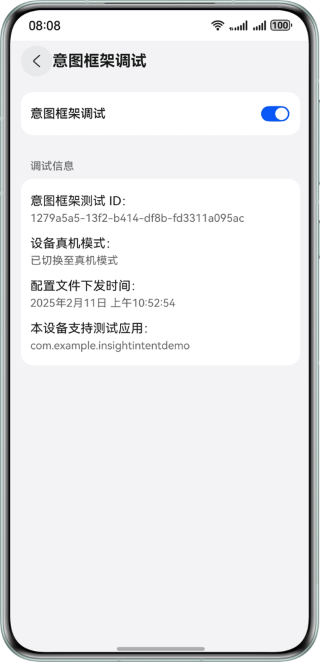
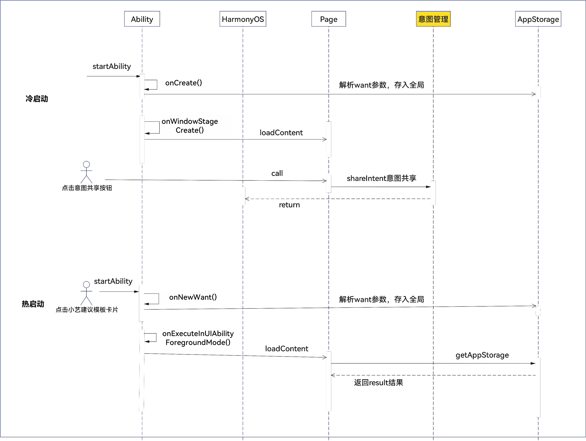

# 意图框架习惯推荐场景

更新时间：2026-05-18 00:55:31

来源：https://developer.huawei.com/consumer/cn/doc/best-practices/bpta-intent-recommend-practice

#### 概述
意图框架是HarmonyOS系统级的意图标准体系。将应用和元服务的业务功能智能分发给不同的系统入口，以“音乐播放”为例，HarmonyOS将业务分发给“小艺建议”，提供了桌面大流量曝光，同时为开发者实现业务增长。习惯推荐类别下典型场景主要分为常用接续、常用复访以及常用推新三大类。比如“音乐播放”就属于常用接续场景。具体可参考习惯推荐[场景体验](https://developer.huawei.com/consumer/cn/doc/harmonyos-guides/intents-habit-rec-scene-experience)。
- 常用接续：涵盖长视频、音乐、有声以及课程等领域，接续指在某个时间节点进行续播。
- 常用复访：涵盖导航、打车以及小游戏等领域，推荐用户经常使用的应用并展示卡片入口。
- 常用推新：涵盖资讯及短视频等领域，推荐用户新的资讯或者视频。
接入意图框架首先需要确定特性类别和具体意图，详细请参见[Intents Kit接入流程](https://developer.huawei.com/consumer/cn/doc/harmonyos-guides/intents-access-flow)。
本文以“音乐播放”意图为例，详细讲解意图接入与开发全过程。

#### 音乐播放开发
以“音乐播放”为例，从意图注册、意图共享以及意图调用三大块介绍意图运行的开发过程。如果应用支持播放功能并且需要实现推荐播放接续，例如音乐、长视频以及课程的播放接续，可以参考本文。首先需要在设置中开启意图框架调试，如下图所示。确保意图框架调试开启且在界面成功展示设备支持测试应用。

**开发步骤**

1. 在应用工程中新增PROJECT_HOME/entry/src/main/resources/base/profile/insight_intent.json文件注册意图，指定意图名称和所属垂域，并且指定一个意图调用逻辑入口。比如在本示例中将调用逻辑放在了EntryAbility下的InsightIntentExecutorImpl文件中。{
  "insightIntents": [
 {
 "intentName": "PlayMusic",
 "domain": "MusicDomain",
 "intentVersion": "1.0.1",
 "srcEntry": "./ets/entryability/InsightIntentExecutorImpl.ets",
 "uiAbility": {
 "ability": "EntryAbility",
 "executeMode": [
 "background",
 "foreground"
 ]
 }
 },
 {
 "intentName": "PlayMusicList",
 "domain": "MusicDomain",
 "intentVersion": "1.0.1",
 "srcEntry": "./ets/entryability/InsightIntentExecutorImpl.ets",
 "uiAbility": {
 "ability": "EntryAbility",
 "executeMode": [
 "background",
 "foreground"
 ]
 }
 }
  ]
}
2. 新增PROJECT_HOME/entry/src/main/resources/rawfile/config/shareIntent.json文件，定义共享数据。数据体除了意图名、版本和标识前三个公共字段外，必选字段还包括动作模式、当前播放百分比、实体名称和ID、音乐名、logo、歌手以及音乐时长等。以下是“音乐播放”的完整数据。具体意图共享字段含义可参考[各垂域意图Schema](https://developer.huawei.com/consumer/cn/doc/service/intents-schema-0000001901962713)中的音乐垂类。[
  {
 "intentName": "PlayMusic",
 "intentVersion": "1.0",
 "identifier": "52dac3b0-6520-4974-81e5-25f0879449b5",
 "intentActionInfo": {
 "actionMode": "EXECUTED",
 "executedTimeSlots": {
 "executedStartTime": 1637393112000,
 "executedEndTime": 1637393212000
 },
 "currentPercentage": 50
 },
 "intentEntityInfo": {
 "entityName": "Music",
 "entityId": "C10194368",
 "entityGroupId": "C10194321312",
 "displayName": "红颜如霜",
 "description": "NA",
 "logoURL": "https://www-file.huawei.com/-/media/corporate/images/home/logo/huawei_logo.png",
 "keywords": [
 "华为音乐",
 "化妆"
 ],
 "rankingHint": 99,
 "expirationTime": 1637393212000,
 "metadataModificationTime": 1637393212000,
 "activityType": [
 "1",
 "2",
 "3"
 ],
 "artist": [
 "测试歌手1",
 "测试歌手2"
 ],
 "lyricist": [
 "测试词作者1",
 "测试词作者2"
 ],
 "composer": [
 "测试曲作者1",
 "测试曲作者2"
 ],
 "albumName": "测试专辑",
 "duration": 244000,
 "playCount": 100000,
 "musicalGenre": [
 "流行",
 "话语",
 "抖音",
 "00后"
 ],
 "isPublicData": false
 }
  },
  {
 "intentName": "PlayMusicList",
 "intentVersion": "1.0",
 "identifier": "52dac3b0-6520-4974-81e5-25f0879449b5",
 "intentActionInfo": {
 "actionMode": "EXECUTED",
 "executedTimeSlots": {
 "executedStartTime": 1637393112000,
 "executedEndTime": 1637393212000
 },
 "currentPercentage": 50
 },
 "intentEntityInfo": {
 "entityName": "MusicList",
 "entityId": "C10194368",
 "entityGroupId": "C10194321312",
 "displayName": "测试歌单",
 "description": "这是xxx歌单",
 "logoURL": "https://www-file.huawei.com/-/media/corporate/images/home/logo/huawei_logo.png",
 "keyWords": [
 "抖音",
 "动感"
 ],
 "rankingHint": 99,
 "expirationTime": 1637393212000,
 "metadataModificationTime": 1637393212000,
 "activityType": [
 "1",
 "2",
 "3"
 ],
 "isPublicData": false,
 "briefDescription": "这是xxx歌单，来自xxx，是xxx风格",
 "artist": [
 "测试歌手1",
 "测试歌手2"
 ],
 "numberOfSongs": 20,
 "type": "1",
 "creator": "测试创建者",
 "createDate": "2023-10-08T08:00:00+08:00",
 "musicNameList": [
 "测试歌曲1",
 "测试歌曲2"
 ],
 "playCount": 30,
 "musicalGenre": [
 "流行",
 "华语",
 "抖音",
 "00后"
 ]
 }
  }
]
3. 调用[shareIntent()](https://developer.huawei.com/consumer/cn/doc/harmonyos-references/intents-arkts-api-insightintent#shareintent)接口将意图对象输入到HarmonyOS，用于学习用户的行为规律。成功共享后“小艺建议”会展示对应应用的音乐模板卡片。展示效果如图所示。 static async shareIntent(context: Context, input: string): Promise&lt;string&gt; {
  Logger.debug(TAG, 'shareIntent');
  try {
 let insightIntents: insightIntent.InsightIntent[] = JSON.parse(input);
 if (!insightIntents || insightIntents.length === 0) {
 Logger.error(TAG, 'shareIntent: json invalid.');
 return 'shareIntent: json invalid.';
 }
 return await insightIntent.shareIntent(context, insightIntents).then(() => {
 Logger.info(TAG, 'shareIntent success');
 return 'share intent success';
 }, (err: BusinessError) => {
 Logger.error(TAG, `shareIntent error message: ${JSON.stringify(err)}`);
 return `shareIntent error message: ${JSON.stringify(err)}`;
 });
  } catch (err) {
 Logger.error(TAG, 'shareIntent fail', err);
  }
  return Promise.reject('shareIntent fail');
}
4. 配置PROJECT_HOME/entry/src/main/ets/entryability/InsightIntentExecutorImpl.ets文件，定义onExecuteInUIAbilityForegroundMode()方法。点击卡片，会拉起对应的应用并触发onCreate()和onExecuteInUIAbilityForegroundMode()等方法。意图调用如果会拉起应用界面，采取前台模式，如果不需要拉起采取后台模式。应用在foreground模式和background模式下会触发不同的生命周期与方法： 前后台模式  启动模式  触发生命周期       foreground  冷启动  onCreate->onWindowStageCreate->onExecuteInUIAbilityForegroundMode         热启动  onNewWant->onExecuteInUIAbilityForegroundMode      background  冷启动  onCreate->onExecuteInUIAbilityBackgroundMode         热启动  onExecuteInUIAbilityBackgroundMode     本示例中采取foreground模式，可以在onCreate()或者onNewWant()解析want和launchParam。并将参数result存储在AppStorage中。如果是在真实开发中意图调用传参字段可以在开发前和接口方协商。 onCreate(want: Want, launchParam: AbilityConstant.LaunchParam): void {
  Logger.info(TAG, 'onCreate');
  if (want.parameters?.['result']) {
 this.result = want.parameters?.['result'] as string;
  }
} want解析完毕后，会触发onExecuteInUIAbilityForegroundMode()方法进行真正逻辑处理，根据意图名称去分发处理方法并且返回一个Promise，成功调用code返回0，失败时返回-1。 /**
 * Override the method to execute the intent in the foreground UIAbility.
 *
 * @param name Intent name.
 * @param param Intent parameters.
 * @param pageLoader Window.
 * @returns Intent call result.
 */
onExecuteInUIAbilityForegroundMode(name: string, param: Record<string, Object>, pageLoader: window.WindowStage):
  Promise&lt;insightIntent.ExecuteResult&gt; {
  Logger.info(TAG, `onExecuteInUIAbilityForegroundMode name: ${name}, param: ${JSON.stringify(param)}`);
  // Distribute the processing logic based on the intent name.
  switch (name) {
 case InsightIntentExecutorImpl.PLAY_MUSIC:
 return this.playMusic(param, pageLoader);
 case InsightIntentExecutorImpl.PLAY_MUSIC_LIST:
 return this.playMusicList(param, pageLoader);
 default:
 break;
  }

  return Promise.resolve({
 code: -1,
 result: {
 message: 'unknown intent'
 }
  } as insightIntent.ExecuteResult)
} 最后完成playMusic()的功能逻辑，小艺建议基于共享数据生成推荐卡片，点击卡片后将上述shareIntent.json定义的实体ID值传递到应用中。 /**
 * Implement the music playback function.
 *
 * @param param Intent parameters.
 * @param pageLoader Window.
 */
private playMusic(param: Record<string, Object>,
  pageLoader: window.WindowStage): Promise&lt;insightIntent.ExecuteResult&gt; {
  return new Promise((resolve, reject) => {
 let para: Record<string, string> = {
 'result': `intent execute success, entityId: ${param.entityId}`
 };
 let localStorage: LocalStorage = new LocalStorage(para);
 // TODO Implement an intent call.
 pageLoader.loadContent('pages/Index', localStorage)
 .then(() => {
 // TODO The intent is called successfully.
 Logger.info(TAG, "Intent execute success");
 resolve({
 code: 0,
 result: {
 message: 'Intent execute success'
 }
 });
 })
 .catch((err: BusinessError) => {
 // TODO Handle the failure if the intent fails to be called.
 Logger.error(TAG, `Intent execute failed: ${JSON.stringify(err)}`);
 resolve({
 code: -1,
 result: {
 message: 'Intent execute failed'
 }
 })
 });
  })
} 如果想删除掉意图，可以调用deleteIntent()，在注册文件只有一个意图的情况下卡片入口会消失。运行效果如下图所示。

> [!NOTE] 说明
> 在真机设备上，小艺建议卡片不会实时刷新。可以通过点击卡片中的服务，重新返回到桌面后，进行卡片刷新。

#### 示例代码
- [意图框架服务](https://gitcode.com/HarmonyOS_Samples/intents-kit-samplecode-clientdemo-arkts)