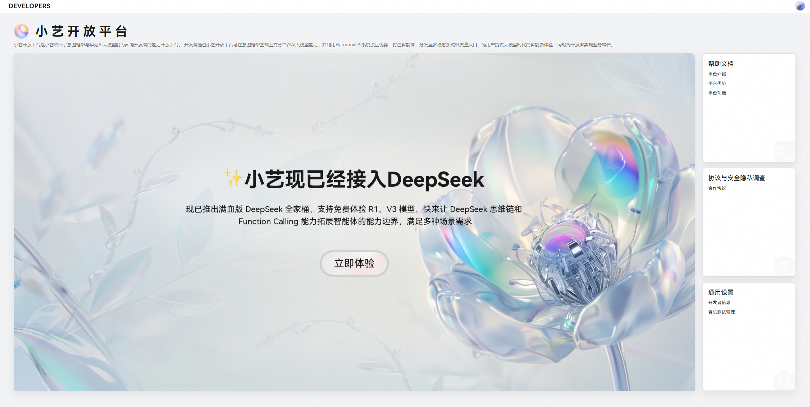
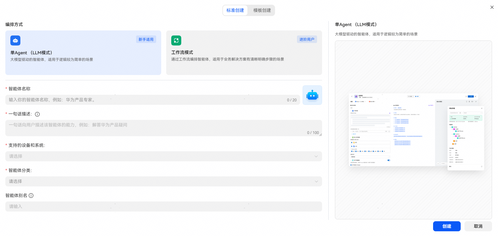
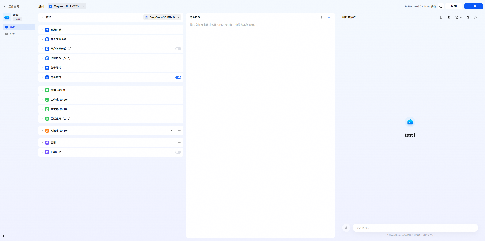
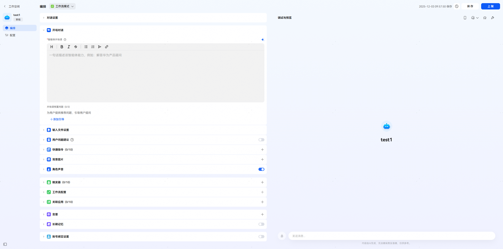
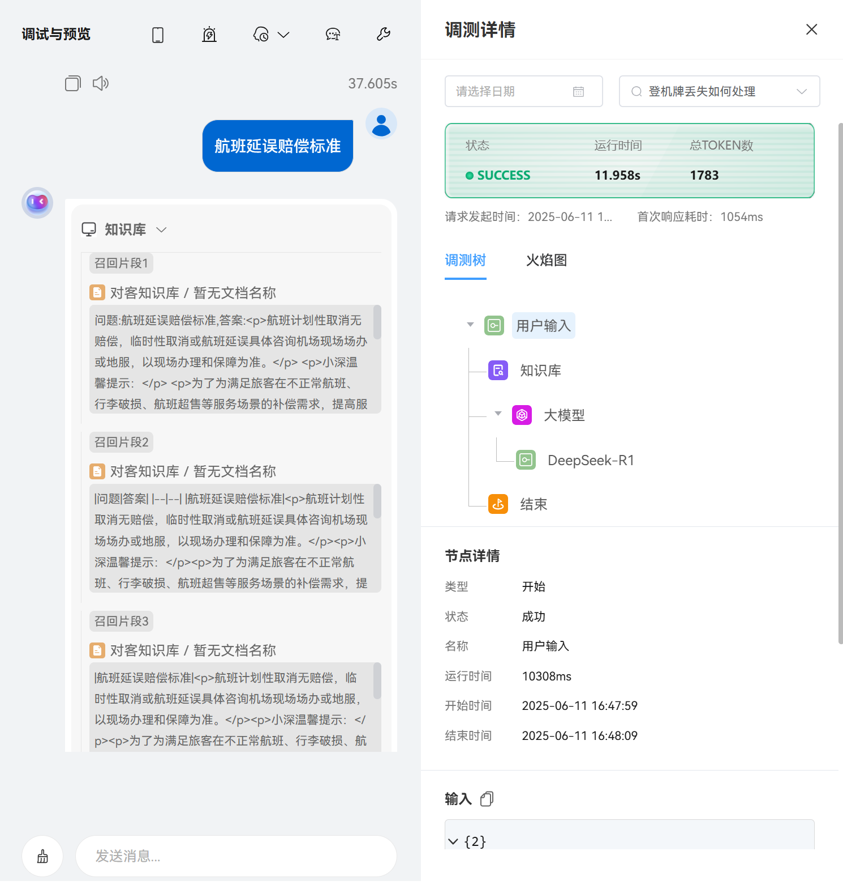

# 智能体场景开发案例

更新时间：2026-03-12 08:45:02

来源：https://developer.huawei.com/consumer/cn/doc/best-practices/bpta-agent

#### 简介

智能体作为一个由用户通过角色指令精心设计的具有明确身份和目标的虚拟实体，其核心价值在于能够像人一样使用自然语言对话，理解用户需求，运用预设的知识、能力和逻辑进行思考与推理，并主动生成恰当的响应或执行相应操作（任务完成、信息提供、服务实施），以满足用户需求或实现预设目标。通过用户友好的交互界面、简便的接入方式及广泛的应用场景，满足消费者在日常生活中对智能助手、信息检索、推荐等功能的需求。同时，智能体还可服务于多个垂直行业和业务场景，有效拓展市场覆盖面与增强用户粘性，用户亦可直接与智能体独立对话，以获得场景化的连贯知识与服务。
 
[小艺开放平台](https://developer.huawei.com/consumer/cn/hag/hagindex.html#/)是小艺结合了意图框架与华为AI大模型能力面向开发者的能力开放平台。基于该平台的[小艺智能体平台](https://developer.huawei.com/consumer/cn/hag/hagindex.html?isInFrame=true&lang=zh_CN#/agentHome/square)允许开发者构建智能体，为用户提供大模型时代的智能新体验，同时实现业务增长。开发者可以基于小艺智能体平台开发专属智能体。
 
本文主要介绍如何基于[智能问答场景](#section2907103562520)和[音频播放场景](#section15781420152616)，在小艺智能体平台上快速搭建智能体并适配相应需求场景。
 
智能体从创建到上架主要包含以下五个步骤：
 1. [智能体创建](#section524618504324)：开发者需在[小艺开放平台](https://developer.huawei.com/consumer/cn/hag/hagindex.html#/)完成企业/个人账号注册，获取HarmonyOS生态的开发权限，基于智能体平台快速初始化项目，自定义开发专属智能体。
2. [模式选择](#section59501510153311)：不同模式的智能体，适配的场景也有所不同，开发者可按照业务需求选择合适模式的智能体，开发构建智能场景的智能体。
3. [智能体编排](#section109683238339)：可视化流程的编排框架，自定义智能体能力点，优化完善智能体场景。
4. [功能验证](#section864165923316)：实时性、可视化、场景化的验证模式，可实时交互验证，或真实场景验证。
5. [上架/升级](#section74742275511)：通过[上架审核规范](https://developer.huawei.com/consumer/cn/doc/service/audit-specifications-0000002469548113)的审核上架，保障对外发布信息的安全与合规，进一步提升用户体验。
 
 

#### 开发步骤

 

#### 智能体创建

登录[小艺开放平台](https://developer.huawei.com/consumer/cn/hag/hagindex.html#/)，点击【立即体验】按钮，进入小艺智能体平台页面。点击左上角【+创建智能体】按钮，即可进入智能体创建流程。可自行设定智能体的相关信息，包括它的名称、头像、智能体描述、智能体分类和运行设备等信息。具体内容可参考开发者指导文档[快速创建智能体](https://developer.huawei.com/consumer/cn/doc/service/quick-start-0000002469548009)。
 
准备条件：真机调试及端插件开发需在HarmonyOS 5.1.0 Release及以上版本的设备上进行。
 



 
 

#### 模式选择

智能体分为LLM模式、工作流模式和A2A模式三种，对于不同的场景，适配的智能体模式也会有所不同。
 
LLM模式智能体主要依靠大语言模型的能力，如语言理解、生成、推理等，来处理任务和回答问题。它通常直接根据用户输入，利用大语言模型内部的知识和算法生成响应。
 
工作流模式智能体是通过预定义的代码路径，协调智能体与工具的交互。它将任务按照特定顺序或规则分解为多个步骤，每个步骤有明确的输入和输出，智能体按照预设流程依次执行，以实现任务目标。这种模式强调可预测性和一致性，适合任务明确、流程固定的场景。
 
A2A模式是一种三方智能体接入小艺开放平台的高效编排方式。开发者可通过该模式基于鸿蒙Agent通信协议快速、便捷地将成熟的第三方智能体对接至小艺开放平台，实现分发与调用，提升平台的场景覆盖能力。该模式适用于同时具备鸿蒙端应用与云侧智能体能力的企业开发者。
  
| 模式 | LLM模式（Agent） | 工作流模式（Workflow） | A2A模式 |
| --- | --- | --- | --- |
| 核心逻辑 | 基于内部知识直接生成回答，由大模型决策进行工具调用 | 按预设流程分步执行（如数据查询→格式转换→结果整合） | 通过标准化通信协议，实现鸿蒙生态中智能体跨设备协作与端云协同。 |
| 智能问答场景适用性 | 适合知识型、交互型问答（如常识咨询、客服答疑、教育辅导） | 适合多步骤流程化任务（如报销申请审批、物流跟踪） | 适合整合多源动态知识、融合多模态响应并跨服务生成连贯交互的场景（如医疗咨询） |
| 音频播放场景适用性 | 适合处理用户语音指令（如 “播放周杰伦的歌”），需调用外部工具处理音频解码、渲染等底层操作 | 适合音频播放的全链路处理（从资源获取到设备输出） | 通过协议扩展第三方播控能力、设备间播放状态同步及低时延优化策略，实现无缝跨端音频流转与场景化音质适配。 |
 
 
不同编排模式的智能体，能力拓展部分的功能点也会有所区别。各编排模式的区别可参考开发者指导文档[智能体分类](https://developer.huawei.com/consumer/cn/doc/service/differences-in-arrangement-modes-0000002471344117)，开发者可根据不同模式的区别，考虑使用场景应该适配何种编排模式的智能体，选择对应的编排模式，并设定智能体相关信息，便可创建对应模式的智能体。
 



 

 
 

#### 智能体编排

智能体创建后，进入智能体的编排页面，开始智能体的编排，给智能体添加各种能力，优化完善智能体。其中，开场对话可以让用户快速了解你的智能体功能或场景设定故事背景，预置问题可以让用户通过点击快速体验智能体的能力，角色指令（prompt）直接决定你所创造的智能体的效果。更多能力点，开发者可参考[编排-能力拓展](https://developer.huawei.com/consumer/cn/doc/service/ability-expansion-function-introduction-0000002437625858)，自定义智能体的背景、能力等。
 
以下为LLM模式和工作流模式的编排页面：
 



 



 

 
 

#### 功能验证

在搭建完成智能体后，开发者可以在调试与预览区域与智能体进行对话，测试该智能体功能是否与预期相同，并根据智能体执行过程及响应信息对智能体配置进行优化与调整，具体调试过程可参考开发者指导文档[调试与预览](https://developer.huawei.com/consumer/cn/doc/service/real-machine-testing-0000002471344145)，包括真机测试与调试两种功能验证方式。
 
 

#### 上架/升级

功能测试完成后，点击【保存】【上架】即可将智能体提交到上架审核阶段，具体流程可参考开发者指导文档[上/下架、升级流程介绍](https://developer.huawei.com/consumer/cn/doc/service/process-introduction-0000002509696971)。为了方便开发者的智能体能够顺利通过审核，可参考[上架审核规范](https://developer.huawei.com/consumer/cn/doc/service/audit-specifications-0000002469548113)排查检视自开发的智能体。待通过审核上架后，即可在小艺平台使用完整的智能体。
 
 

#### 智能问答场景

 

#### 场景描述

智能问答系统凭借其高效、便捷的交互特性，已广泛应用于多个领域。依托知识库，智能问答能够精准匹配用户需求，提供准确且专业的回答。例如，医疗场景中，用户描述 “咳嗽 + 发热”，系统结合症状库推荐科室并提示 “可能的流感风险”。智能问答的核心价值在于通过自然语言交互解决信息获取效率问题，它通常直接根据用户输入，利用开发者上架的知识库或大语言模型内部的知识和算法生成响应，实现更精准、个性化的服务。具有准确与规范的答案（所有回答基于企业预设的知识库或官方数据，避免人工客服因理解偏差或记忆错误导致答案不一致）和服务质量的可控性（企业可随时更新知识库，保证答案同步最新政策，如税法调整、产品更新等）。
 
 

#### 场景开发

**模式选择**
 
智能问答场景主要为简单的语言交互（如闲聊、知识查询），无需外部工具调用，因此优先选择LLM模式，可基于内部知识直接生成回答。LLM 模式主要有自然语言处理能力、知识整合效率、交互体验等方面的核心优势，凭借这些原生优势，成为智能问答的主流选择，尤其适合知识型、交互型、跨领域的问答场景。
  
| 模式 | LLM 模式 | 工作流模式 |
| --- | --- | --- |
| 核心逻辑 | 基于内部知识直接生成回答，由大模型决策进行工具调用 | 按预设流程分步执行（如数据查询→格式转换→结果整合） |
| 智能问答场景适用性 | 适合知识型、交互型问答（如常识咨询、客服答疑、教育辅导） | 适合多步骤流程化任务（如报销申请审批、物流跟踪） |
| 智能问答场景局限性 | 依赖训练数据时效性（需定期更新知识库）；复杂计算任务需结合工具 | 流程固定，难以应对灵活的问答需求；需人工配置大量流程节点 |
 
 
问答智能体主要基于开发者提供的知识库，智能整合内部知识，生成所需回答。因此，除了需要选择LLM模式的智能体外，还需要自定义所需场景的知识库。
 
**知识库创建上架**
 1. 创建知识库：在小艺开放平台工作空间的知识库界面点击【新建知识库】，进入新建知识库页面，填写知识库信息后点击【新建】按钮，新建知识库成功。
2. 配置知识库：从知识库列表点击新建的知识库名称进入知识列表页面，点击【新建知识】，导入相应知识类型的文件，并填写相关信息后，点击【确定】，知识添加成功。具体流程可参考开发者指导文档[创建知识库](https://developer.huawei.com/consumer/cn/doc/service/create-a-knowledge-base-0000002471344153)。
3. 上架知识库：点击相应知识的【上架】按钮，等待知识库审核上架即可。文档类型的知识要等待数据校验完成后才能上架。
 
**LLM模式智能体创建**
 1. 创建智能体：参考上述[开发步骤](#section369116225258)，创建一个LLM模式的智能体。
2. 编排智能体：进入智能体编排页面，编辑智能体的开场对话，并添加上架完成的知识库，开发者也可按照实际业务需求自行编排。
 
**功能验证**
 
可调试测试或真机测试，真机测试需添加白名单，设置白名单手机或账号，发布至手机智能体，方可真机测试。
 1. 调试测试：调试与预览界面可以进行交互测试，预览实际交互场景，也可点击右上角调试按钮，进入调试详情页，查看详细的调测信息。


2. 真机测试：点击调试与预览页面右上角的真机测试，可发布真机测试。真机测试前需配置白名单，开发者（团队账户需管理员权限）可通过新增组来管理真机调试用户，每个团队最多可创建100个用户组，每个用户组最多可添加100个用户。 开发者在服务发布至真机调试后，处于真机调试用户白名单中的用户可以访问到该开发测试服务，详见开发者指导文档[真机测试](https://developer.huawei.com/consumer/cn/doc/service/list-of-user-groups-for-real-machine-testing-0000002471264273)。
 
**上架升级**
 
功能测试完成后，点击【保存】【上架】即可将智能体提交到上架审核阶段，具体流程可参考开发者指导文档[上/下架、升级流程介绍](https://developer.huawei.com/consumer/cn/doc/service/process-introduction-0000002509696971)。
 
 

#### 音频播放场景

 

#### 场景描述

音频播放的应用场景广泛，可根据使用场景、设备类型及功能需求分为多种适用类型，不同场景下的音频播放均围绕：实时性、音质、设备适配、离线能力、隐私安全等方面展开。
 
 

#### 场景开发

**模式选择**
 
音频播放场景APP一般包括跳转播放页、播放音频、获取歌曲名称等功能，对于涉及到存在音频播放场景的项目，想要通过语音、文字等操作智能化实现上述功能，则需使用端插件和工作流模式的智能体架构。该架构不仅解决了音频播放场景智能化交互（语音 / 文字指令），还提供了高效的本地执行载体，形成本地化处理与流程协同的高效架构。结合工作流模式，设置节点控制（如音频播放、页面跳转、信息获取），端插件可本地协调多模块交互，运行在设备本地的功能模块。
  
| 模式 | 工作流模式（Workflow） | LLM 模式 |
| --- | --- | --- |
| 核心逻辑 | 按预设流程分步执行（如数据查询→格式转换→结果整合） | 基于内部知识直接生成回答，由大模型决策进行工具调用 |
| 音频播放场景适用性 | 适合音频播放的全链路处理（从资源获取到设备输出） | 适合处理用户语音指令（如 “播放周杰伦的歌”），但无法直接处理音频解码、渲染等底层操作 |
| 音频播放场景局限性 | 灵活性较低，需人工配置所有流程节点 | 不具备音频编解码、设备驱动等底层能力，需依赖外部工具支持 |
 
 
音频播放场景，主要基于音频编解码等功能，需要外部工具的支持，可在端插件实现音频播放功能。同时，音频播放场景一般涉及页面跳转、音频播放、获取信息等功能，通过设计流程节点，可搭建业务所需的整体流程。因此，除了需要选择工作流模式的智能体外，还需要实现适配流程节点的端插件。
 
**端插件创建上架**
 1. 创建端插件：在小艺开放平台工作空间的插件界面点击【新建插件】，选择端插件，填写对应的APP包名和名称。点击【保存】后，创建端插件成功，进入端插件的编辑页面。
2. 配置端插件：点击【新建工具】，在工具信息页填写工具名称后点击【创建】，可新增一条工具。点击【添加版本】，按页面提示填写参数后，点击【创建】，进入工具信息页，按需求可添加输入输出参数，点击【保存】，端插件的一个工具配置完成。按照上述操作方法，可添加多条工具，开发者可按需配置。具体配置方式也可参考开发者指导文档[创建端插件](https://developer.huawei.com/consumer/cn/doc/service/create-side-plug-in-0000002437625930)。本场景涉及三个功能，包括获取歌曲名称、跳转播放页、播放音频，因此配置了三个对应功能的工具。具体配置信息如下图所示：

| 获取信息 | 跳转页面 | 播放音频 |

| --- | --- | --- |

|  |  |  |
3. 上架：配置完端插件信息后，点击【上架】按钮，填写版本信息后，点击【确认】，端插件进入上架审核中，待审核上架成功后，即可在其他场景使用已上架的端插件。
 
**端插件开发**
 
端插件作为设备本地运行的功能模块，提供能力的服务在HarmonyOS设备侧，需要在端侧进行代码实现。对于音频播放场景的实现有以下几步：
 1. 在端侧应用工程根目录下新建entry/src/main/resources/base/profile/insight_intent.json文件，用来绑定上一步实现的端插件中对应的工具。intentName对应工具名称，intentVersion对应工具版本号，srcEntry为基于意图框架[InsightIntentExecutor](https://developer.huawei.com/consumer/cn/doc/harmonyos-references/js-apis-app-ability-insightintentexecutor#insightintentexecutor)类方法的业务逻辑处理文件。

  
```ArkTS
{
  "insightIntents": [
    {
      "domain": "",
      "intentName": "PlayHiddenAudio",
      "intentVersion": "1.0.0",
      "srcEntry": "./ets/entryability/InsightIntentExecutorImpl.ets",
      "uiAbility": {
        "ability": "EntryAbility",
        "executeMode": [
          "background"
        ]
      }
    },
    {
      "domain": "",
      "intentName": "GetAudioName",
      "intentVersion": "1.0.0",
      "srcEntry": "./ets/entryability/InsightIntentExecutorImpl.ets",
      "uiAbility": {
        "ability": "EntryAbility",
        "executeMode": [
          "background"
        ]
      }
    },
    {
      "domain": "",
      "intentName": "OpenSecondPage",
      "intentVersion": "1.0.0",
      "srcEntry": "./ets/entryability/InsightIntentExecutorImpl.ets",
      "uiAbility": {
        "ability": "EntryAbility",
        "executeMode": [
          "background",
          "foreground"
        ]
      }
    }
  ]
}
```

2. 绑定的端插件被调用时的业务逻辑处理。
```ArkTS
import { insightIntent, InsightIntentExecutor } from '@kit.AbilityKit';
import { BusinessError } from '@kit.BasicServicesKit';
import { window } from '@kit.ArkUI';
import AudioPlayHandler from './intentHandlers/AudioPlayHandler';
import TextGetHandler from './intentHandlers/TextGetHandler';
import PageNavigateHandler from './intentHandlers/PageNavigateHandler';
import { hilog } from '@kit.PerformanceAnalysisKit';

export default class InsightIntentExecutorImpl extends InsightIntentExecutor {
  // Instruction implementation class.
  private audioHandler = new AudioPlayHandler();
  private textHandler = new TextGetHandler();
  private pageHandler = new PageNavigateHandler();

  // Intention execution method for backend execution.
  async onExecuteInUIAbilityBackgroundMode(
    intentName: string,
    params: Record<string, object>
  ): Promise<insightIntent.ExecuteResult> {

    try {
      switch (intentName) {
        // Play audio intention.
        case 'PlayHiddenAudio':
          const stringParam: Record<string, string> = this.convertToRecord(params);
          return this.audioHandler.execute(stringParam);

        // Obtain audio name intent.
        case 'GetAudioName':
          return this.textHandler.execute();

        default:
          return {
            code: -1,
            result: {
              'status': 'failed',
              'message': `not valid intent name, ${intentName}`
            }
          };
      }
    } catch (error) {
      return {
        code: -2,
        result: {
          'status': 'failed',
          'message': `Intent execution failed: ${(error as BusinessError).message}`
        }
      };
    }
  }

  private convertToRecord(origin: Record<string, object>): Record<string, string> {
    const result: Record<string, string> = {};
    Object.keys(origin).forEach(key => {
      result[key] = String(origin[key]);
    });

    return result;
  }

  // Execution method of backend execution intention.
  async onExecuteInUIAbilityForegroundMode(name: string, param: Record<string, Object>, pageLoader: window.WindowStage):
    Promise<insightIntent.ExecuteResult> {
    switch (name) {
      // Open the second page intention.
      case 'OpenSecondPage':
        return this.pageHandler.execute();
      default:
        pageLoader.loadContent('pages/MainPage')
          .catch((error: BusinessError) => {
            hilog.error(0x000, 'testTag', `loadContent failed. code=${error.code}, message=${error.message}`);
          })
        break;
    }
    return Promise.resolve({
      code: -1,
      result: {
        message: 'unknown intent'
      }
    } as insightIntent.ExecuteResult)
  }
}
```

3. 功能开发。
- 实现获取歌曲名称的功能，并返回读取结果。
```ArkTS
import { insightIntent } from '@kit.AbilityKit';
import { BusinessError } from '@kit.BasicServicesKit';
import { MediaService } from '../../utils/audioplayer/MediaService';

export default class TextGetHandler {
  async execute(): Promise<insightIntent.ExecuteResult> {
    try {
      // Execute the method of obtaining the name of the played audio.
      const audioName: string = MediaService.getInstance().getAudioFileName();

      // Return result.
      return {
        code: 0,
        result: {
          status:'success',
          audioName: audioName,
          message: 'get audio name success'
        }
      };
    } catch (error) {
      throw new Error(`get audio name failed: ${(error as BusinessError).message}`);
    }
  }
}
```


4. 使用[Deep Linking](https://developer.huawei.com/consumer/cn/doc/harmonyos-guides/deep-linking-startup#拉起方应用实现应用跳转)实现跳转播放页的功能。配置module.json5文件中的[skills标签](https://developer.huawei.com/consumer/cn/doc/harmonyos-guides/module-configuration-file#skills标签)，标识跳转场景。

  
```json
"skills": [
  {
    "entities": [
      "entity.system.home",
      "entity.system.browsable"
    ],
    "actions": [
      "ohos.want.action.home",
      "ohos.want.action.viewData"
    ],
    "uris": [
      {
        "scheme": "demo",
        "host": "aiagentdemo.com",
        "path": "SecondPage"
      }
    ]
  }
]
```
 在EntryAbility.ets文件中的onNewWant()生命周期回调中，获取、解析拉起方传入的应用链接，开发者可自定义后续的业务处理。

  
```ArkTS
onNewWant(want: Want, launchParam: AbilityConstant.LaunchParam): void {
  hilog.info(DOMAIN, 'testTag', 'Received URI:', want.uri);
  const uri = want.uri;
  let pathname = '';
  if (uri) {
    try {
      const urlObj = url.URL.parseURL(uri);
      pathname = urlObj.pathname;
    } catch (error) {
      let err = error as BusinessError;
      hilog.error(0x000, 'testTag', `getUIContext failed. code=${err.code}, message=${err.message}`);
    }
    uiContext?.getRouter().pushUrl({ url: 'pages' + pathname })
      .catch((error: BusinessError) => {
        hilog.error(0x000, 'testTag', `pushUrl failed. code=${error.code}, message=${error.message}`);
      })
  }
}
```
 执行页面跳转并返回跳转结果。

  
```ArkTS
import { insightIntent } from '@kit.AbilityKit';
import { BusinessError } from '@kit.BasicServicesKit';
import { hilog } from '@kit.PerformanceAnalysisKit';

export default class PageNavigateHandler {
  async execute(): Promise<insightIntent.ExecuteResult> {
    try {
      // Execute page redirection.
      let uiContext: UIContext | null | undefined = null;
      uiContext = AppStorage.get('uiContext');
      uiContext?.getRouter().pushUrl({ url: 'pages/SecondPage' })
        .catch((err: BusinessError) => {
        hilog.error(0x0000, 'testTag',`pushUrl failed, Code:${err.code}, message:${err.message}`);
      })

      return {
        code: 0,
        result: {
          status: 'success',
          message: 'Navigation successful',
          targetPage: 'SecondPage'
        }
      };
    } catch (error) {
      throw new Error(`Page navigation failed: ${(error as BusinessError).message}`);
    }
  }
}
```


5. 音频播放功能的实现，开发者可根据实际业务需求自定义实现该功能。
```ArkTS
import { insightIntent } from '@kit.AbilityKit';
import { BusinessError } from '@kit.BasicServicesKit';
import { MediaService } from '../../utils/audioplayer/MediaService';

export default class AudioPlayHandler {

  async execute(param: Record<string, string>): Promise<insightIntent.ExecuteResult> {
    try {
      // Analyze the parameters passed in by the plugin on the parsing end.
      const rawAudioName = param.audioName;
      const audioName = rawAudioName.toString();

      // The method of playing audio can be customized by developers according to their actual business needs.
      MediaService.getInstance().initAudioPlayer(audioName);

      // Return the result to the end plugin.
      return {
        code: 0,
        result: {
          status: 'success',
          message: `play audio ${audioName} started`,
        }
      };
    } catch (error) {
      throw new Error(`Audio play failed: ${(error as BusinessError).message}`);
    }
  }
}
```


  **工作流创建上架**

1. [创建工作流](https://developer.huawei.com/consumer/cn/doc/service/create-workflow-0000002471344157)：在小艺开放平台工作空间的工作流界面点击【新建工作流】，填写工作流对应信息后，点击【确定】，创建工作流成功并进入工作流编辑页面。

2. 编排工作流：
创建工作流后，在画布中点击【添加节点】后，选择【插件】按钮，在工作空间中选择已上架的端插件点击【添加】，即可将所需插件添加至画布中。

3. 获取歌曲名称、跳转播放页、播放音频三个功能场景为并列关系，可在画布中点击【添加节点】，添加【选择器】，点击添加好的选择器，在右侧的选择器编辑页面设定不同分支对应的条件，条件成立则下一步运行对应的分支（点击条件分支右侧的+号，可添加一条分支）。

| 创建选择器 | 选择器条件分支 |

| --- | --- |

|  |  |

4. 按照任务执行顺序连接对应节点


- 测试上架：点击【试运行】后，进入调试页面，可自行测试整体流程（无法在小艺开放平台调试端插件适配情况，只能测试工作流整体流程）。测试无误后，点击【上架】，进入上架审核阶段，待审核通过，即可在智能体中添加插件。


 
**工作流模式智能体编排**
 
音频播放场景所需的端插件、工作流都已经开发完成，并成功上架成功后，接下来就是智能体的搭建过程了。
 1. 创建智能体：可参考上述[开发步骤](#section369116225258)，创建一个工作流模式的智能体；
2. 编排智能体：进入智能体编排页面，编排智能体的开场对话，添加上架完成的工作流，开发者可按照实际业务需求自行搭建；
 
**功能验证**
 1. 调试与测试：调试与预览界面可以进行交互测试，预览实际交互场景，也可点击右上角调试按钮，进入调试详情页，查看详细的调试信息。

| 调试与预览 | 调试详情 |

| --- | --- |

|  |  |
2. 真机测试：端插件涉及到端侧的应用，故平台调试无法与端侧应用联调，只能在端侧设备上进行智能体使用效果的真实体验。具体测试流程详见开发者指导文档[真机测试](https://developer.huawei.com/consumer/cn/doc/service/list-of-user-groups-for-real-machine-testing-0000002471264273)。
 
**上架升级**
 
功能测试完成后，点击【保存】【上架】即可将智能体提交到上架审核阶段，具体流程可参考开发者指导文档[上/下架、升级流程介绍](https://developer.huawei.com/consumer/cn/doc/service/process-introduction-0000002509696971)。上架完成后，可在端侧小艺的智能体页面搜索查询到创建的智能体并使用。效果如下：
 


 
 

#### 总结

智能体具有拟人化交互与智能决策、多场景需求覆盖的特点，通过 “交互智能化 + 场景定制化” 满足用户与行业需求。[小艺智能体平台](https://developer.huawei.com/consumer/cn/hag/hagindex.html?isInFrame=true&lang=zh_CN#/agentHome/square)依托华为技术生态，为开发者提供从创建到上架的全流程工具支持，助力专属智能体的快速落地与实现。
