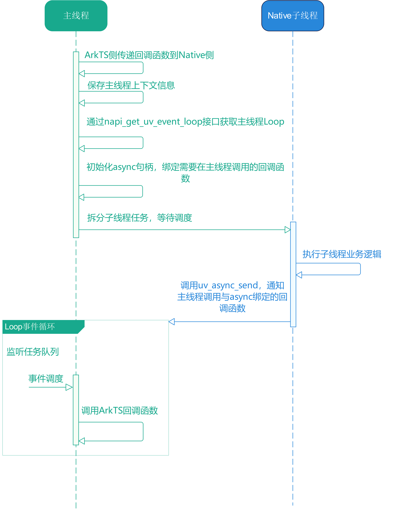
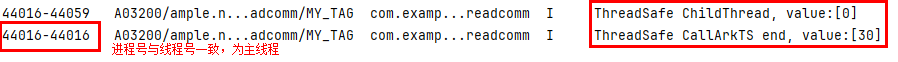

# Native侧子线程与UI主线程通信

更新时间：2026-03-12 08:45:02

来源：https://developer.huawei.com/consumer/cn/doc/best-practices/bpta-native-sub-main-comm

#### 概述

开发者在Native侧进行开发实践时，经常会遇到一些耗时的任务，例如I/O操作、域名解析以及复杂计算等。这些任务如果直接在主线程中执行，将会严重阻塞主线程，影响后续任务的正常流程，进而导致用户界面响应延迟甚至卡顿。
 
为了提升代码性能，通常会将这类耗时任务放在Native子线程中执行。通常情况下，Native子线程可以独立完成自己的任务，但是很多时候需要将数据从主线程传递到Native子线程，或者将Native子线程的执行结果返回给主线程。
 
在多线程环境中，有一个关键问题是如何安全地在后台线程（Native侧子线程）和UI主线程之间进行通信。ArkTS侧函数通常只能在主线程里调用，如果Native侧通过std::thread或pthread创建了子线程，那么主线程中的上下文环境和数据（napi_env、napi_value以及napi_ref）是不能直接在子线程上下文中使用的。
 
为确保正确性，当Native侧在子线程完成其计算或处理后，若需要回调ArkTS函数，必须先通过线程同步机制将结果传递回主线程，然后才能安全地在主线程环境中调用ArkTS函数。针对这个问题，可以采用以下方案来解决。
 
- [基于线程安全函数机制实现](#section867313171296)
- [基于libuv异步库的uv_async_send()方法实现](#section8322162418295)

 
> [!NOTE]
> 推荐开发者使用线程安全函数作为Native侧子线程与UI主线程的通信手段。 如果线程安全函数确实不能满足开发需要，开发者可以使用libuv库自定义Loop然后通过uv_async_send()方法进行线程间通信。 另外，libuv库中的uv_queue_work()接口也可以实现线程间通信，但存在以下弊端： 使用uv_queue_work()方法作为线程间通信的手段时，execute回调中一般实现为空任务，没有任何维测信息，一旦异步任务不回调，定位将很困难。这种方式不仅低效，而且还增加了发生故障时定位问题的难度。 它会破坏底层的数据可信性，uv_queue_work()函数仅用于抛异步任务，异步任务的execute回调被提交到线程池后会经过调度执行，因此并不保证多次提交的任务之间的时序关系。 更多libuv库的方案策略可以查看API参考： libuv 。

 
 

#### 实现原理

 

#### 基于线程安全函数机制

HarmonyOS Node-API提供了一系列[线程安全函数](https://developer.huawei.com/consumer/cn/doc/harmonyos-guides/napi-data-types-interfaces#异步安全线程相关)相关的接口，通过这些接口可以在Native侧创建一个可以在多线程间共享并安全使用的函数对象。在创建过程中，需要指定一些关键信息，如ArkTS回调函数、异步资源标识符、缓冲队列容量、初始线程数等。这些信息将用于确保函数在多线程环境下的正确性和安全性。通过这个机制，子线程可以将数据传递给主线程，主线程接收到数据后会调用ArkTS回调函数进行处理。
 
**调用流程图**
 



 
首先ArkTS侧会传递一个回调函数到Native侧，然后在Native侧创建一个线程安全函数，此线程安全函数会绑定一个回调函数（通过napi_call_threadsafe_function()调用线程安全函数时，会触发该回调函数），接着需要保存后续需要用到的上下文信息及参数，然后拆分子线程（子线程绑定了要用到的上下文信息及参数）。
 
Native侧子线程分配到系统资源之后会执行对应的业务逻辑，通过Node-API提供的线程安全函数相关的接口调用前面声明的线程安全函数，该线程安全函数会被push到主线程的事件循环中等待事件调度执行。
 
线程安全函数在事件循环中得到调度后会通过napi_call_back()接口调用ArkTS回调函数。
 
**开发步骤**
 1. ArkTS侧传递函数到Native侧
2. Native侧主线程中构建线程安全函数、保存上下文信息并拆分子线程
3. 在Native侧子线程中请求线程安全函数并调用
4. 在线程安全函数中回调ArkTS侧传递的回调函数
 
 

#### 基于libuv异步库的uv_async_send方法

libuv库提供了一个函数uv_async_send()，用于在非阻塞事件循环中异步发送信号。uv_async_send()函数允许用户在不同的线程或者事件循环的不同部分之间发送信号，从而触发某些操作而不需要直接调用阻塞函数。uv_async_send()的核心原理是利用事件循环（event-loop）和内部消息队列来实现线程间的通信。具体来说，它允许一个线程（通常是工作线程）发送信号给主线程上的事件循环，从而触发主线程上的某个回调函数。因此利用该原理可以在主线程中定义用于回调ArkTS侧函数的回调函数，待子线程中业务逻辑执行完成后通过uv_async_send()接口实现在子线程中通知主线程执行回调，进而实现对ArkTS侧函数的调用。
 
**调用流程图**
 

 



 

 
首先ArkTS侧会传递一个回调函数到Native侧，Native侧接收到后会保存后续需要用到的上下文信息及参数，接着通过napi_get_uv_event_loop()接口获取主线程Loop，该Loop会在主线程中执行，然后初始化async句柄并绑定后续需要在主线程调用的回调函数，运行Loop。接着拆分子线程（子线程绑定了要用到的上下文信息及参数）。
 
Native侧子线程分配到系统资源之后在子线程中调用uv_async_send()方法通知主线程调用与async绑定的函数。
 
运行在主线程的Loop接收到信号后，会调用之前async句柄绑定的回调函数，然后就可以在该函数中调用ArkTS回调函数。
 
**开发步骤**
 1. ArkTS侧传递函数到Native侧
2. Native侧保存上下文信息
3. 通过napi_get_uv_event_loop()接口获取主线程loop并初始化async句柄绑定回调函数
4. 在子线程中调用uv_async_send()方法通知主线程调用与async绑定的函数
5. 在主线程中运行Loop执行async绑定的函数，调用ArkTS侧传递的回调函数
 
 

#### 场景案例

本节将以分别使用线程安全函数和libuv异步库实现以下操作，在Native侧拆分子线程执行业务逻辑，子线程业务逻辑完成之后回到主线程执行ArkTS侧传入的ArkTS回调函数，从而完成了对ArkTS端变量值的加30操作。
 
> [!NOTE]
> 从ArkTS侧传递给Native侧的函数引用，其生命周期仅限于它所在的作用域内。若要确保在超出该作用域后仍能继续使用这个函数引用，需要采取适当的方法来延长其生命周期。可以通过调用napi_create_reference()接口为ArkTS对象创建一个引用(reference)。这样可以避免对象因垃圾回收机制而被提前释放，从而有效地延长它的生命周期。然而，在创建引用之后，务必牢记要在不再需要该引用时，调用napi_delete_reference()来释放引用，以防止内存泄漏问题的发生。

 
 

#### 基于线程安全函数机制实现
1. ArkTS侧传递函数到Native侧

  在ArkTS侧实现一个回调函数，参数为param，函数体中对参数param加30后刷新变量value，并返回最新的param值。将回调函数作为参数调用Native侧的threadSafeCase()接口。
```ArkTS
//Call Native side function and pass ArkTS side function to Native side.
testNapi.threadSafeCase(this.work);
```

2. Native侧主线程中构建线程安全函数、保存上下文信息并拆分子线程threadSafeCase()接口接收到ArkTS传入的回调函数后通过napi_create_threadsafe_function()创建一个线程安全函数tsFn，tsFn会回调主线程中的ThreadSafeCallJs()方法，然后在ThreadSafeCallJs()方法中调用ArkTS侧传入的回调函数。

  在拆分子线程时，需要保存上下文信息及ArkTS函数引用，保存完之后拆分子线程。

  
```cpp
napi_threadsafe_function tsFn;
static int g_value = 0;

struct CallbackContext {
    napi_env env = nullptr;
    napi_ref callbackRef = nullptr;
    uv_async_t *async = nullptr;
};
```
 
```cpp
static napi_value ThreadSafeCase(napi_env env, napi_callback_info info) {
    size_t argc = 1;
    napi_value js_callback;
    napi_value workName;
    napi_get_cb_info(env, info, &argc, &js_callback, nullptr, nullptr);

    napi_valuetype valueType = napi_undefined;
    napi_typeof(env, js_callback, &valueType);
    if (valueType != napi_valuetype::napi_function) {
        return nullptr;
    }

    napi_create_string_utf8(env, "ThreadSafeCase", NAPI_AUTO_LENGTH, &workName);
    napi_create_threadsafe_function(env, nullptr, nullptr, workName, 0, 1, nullptr, nullptr, nullptr, ThreadSafeCallJs, &tsFn);
    auto asyncContext = new CallbackContext();
    asyncContext->env = env;
    napi_create_reference(env, js_callback, 1, &asyncContext->callbackRef);
    std::thread t(SubThread, asyncContext);
    t.detach();
    return nullptr;
}
```

3. 在Native侧子线程中请求线程安全函数并调用在子线程中通过napi_call_threadsafe_function()调用线程安全函数tsFn，把CallbackContext结构体数据作为参数传入线程安全函数。开发者可以根据自身实际需求在子线程中添加相应的业务操作。

  
```cpp
void SubThread(CallbackContext *asyncContext) {
    if (asyncContext == nullptr) {
        return;
    }
    napi_acquire_threadsafe_function(tsFn);
    OH_LOG_INFO(LOG_APP, "ThreadSafe ChildThread, value:[%{public}d]", g_value);
    napi_call_threadsafe_function(tsFn, asyncContext, napi_tsfn_nonblocking);
    napi_release_threadsafe_function(tsFn, napi_tsfn_release);
}
```

4. 在线程安全函数中回调ArkTS侧传递的回调函数通过上面保存的上下文信息及ArkTS函数引用回调ArkTS回调函数实现加30操作。

  
```cpp
static void ThreadSafeCallJs(napi_env env, napi_value js_callBack, void *context, void *data) {
    CallbackContext *argContext = reinterpret_cast<CallbackContext *>(data);
    if (argContext != nullptr) {
        napi_get_reference_value(env, argContext->callbackRef, &js_callBack);
    } else {
        return;
    }

    napi_valuetype valueType = napi_undefined;
    napi_typeof(env, js_callBack, &valueType);
    if (valueType != napi_valuetype::napi_function) {
        napi_delete_reference(env, argContext->callbackRef);
        delete argContext;
        argContext = nullptr;
        return;
    }

    napi_value argv;
    napi_create_int32(env, g_value, &argv);
    napi_value result = nullptr;
    napi_call_function(env, nullptr, js_callBack, 1, &argv, &result);
    napi_get_value_int32(env, result, &g_value);
    OH_LOG_INFO(LOG_APP, "ThreadSafe CallArkTS end, value:[%{public}d]", g_value);
    napi_delete_reference(env, argContext->callbackRef);
    delete argContext;
    argContext = nullptr;
}
```

 
**结果展示**
 


 
 

#### 基于libuv异步库的uv_async_send方法实现

> [!NOTE]
> 使用libuv异步库需要在CMakeLists.txt文件中添加libuv.so依赖，并在使用libuv接口的代码文件中引用其头文件uv.h，例如这里我们在napi_init文件中引用。 CODE5

1. ArkTS侧传递函数到Native侧在ArkTS侧实现一个回调函数，参数为param，函数体中对参数param加30后刷新变量value，并返回最新的param值。将回调函数作为参数调用Native侧的libUvCase()接口。

  
```ArkTS
@State value: number = 0;
work: Function = (param: number) => {
  param += 30;
  this.value = param;
  return param;
}
```
 
```ArkTS
//Call Native side function and pass ArkTS side function to Native side.
testNapi.libUvCase(this.work);
```

2. Native侧保存上下文信息。

  libUvCase()接口接收到ArkTS传入的回调函数后保存上下文信息及ArkTS函数引用。
```cpp
size_t argc = 1;
napi_value callback_function;
napi_get_cb_info(env, info, &argc, &callback_function, nullptr, nullptr);

napi_valuetype valueType = napi_undefined;
napi_typeof(env, callback_function, &valueType);
if (valueType != napi_valuetype::napi_function) {
    return nullptr;
}

auto asyncContext = new CallbackContext();
if (asyncContext == nullptr) {
    return nullptr;
}
asyncContext->env = env;
napi_create_reference(env, callback_function, 1, &asyncContext->callbackRef);
```

3. 通过napi_get_uv_event_loop()接口获取主线程Loop并初始化async句柄绑定回调函数

  在libUvCase()接口中保存完数据之后，通过napi_get_uv_event_loop()接口获取主线程Loop，该Loop会在主线程中运行。然后初始化一个async句柄，该句柄会绑定一个后续在主线程Loop上运行的回调函数（后续可以在该函数中调用ArkTS侧函数）。接着拆分子线程。
```cpp
uv_loop_t *loop = nullptr;
if (napi_get_uv_event_loop(env, &loop) != napi_ok) {
    delete asyncContext;
    return nullptr;
}
    
uv_async_t *async = new uv_async_t();
uv_async_init(loop, async, async_handler);
async->data = asyncContext;
asyncContext->async = async;

std::thread caseThread(CallbackUvWorkTest, asyncContext);
caseThread.detach();
return nullptr;
```

4. 在子线程中调用uv_async_send()方法通知主线程调用与async绑定的函数

  子线程获取到系统调度之后，调用uv_async_send()方法通知主线程调用与async绑定的回调函数。
```cpp
void CallbackUvWorkTest(CallbackContext *context) {
    if (context == nullptr) {
        return;
    }
    OH_LOG_INFO(LOG_APP, "LibUV ChildThread, value:[%{public}d]", g_value);
    uv_async_send(context->async);
}
```

5. 在主线程中运行Loop执行async句柄绑定的函数，调用ArkTS侧传递的回调函数

  主线程收到子线程uv_async_send()传递的信号后会在对应Loop中调用之前async句柄绑定的的回调函数，该函数会运行在主线程里（也就是我们之前获取的Loop中），通过上面保存的上下文信息及ArkTS函数引用回调ArkTS回调函数实现加30操作。
```cpp
void async_handler(uv_async_t *handle) {
    CallbackContext *context = static_cast<CallbackContext *>(handle->data);
    napi_handle_scope scope = nullptr;
    napi_open_handle_scope(context->env, &scope);
    if (scope == nullptr) {
        napi_delete_reference(context->env, context->callbackRef);
        delete context;
        context = nullptr;
        uv_close(reinterpret_cast<uv_handle_t*>(handle), [](uv_handle_t *handle) { delete reinterpret_cast<uv_async_t*>(handle); });
        return;
    }
    napi_value callback = nullptr;
    napi_get_reference_value(context->env, context->callbackRef, &callback);
    napi_value retArg;
    napi_create_int32(context->env, g_value, &retArg);
    napi_value result;
    napi_call_function(context->env, nullptr, callback, 1, &retArg, &result);
    napi_get_value_int32(context->env, result, &g_value);
    OH_LOG_INFO(LOG_APP, "LibUV CallArkTS end, value:[%{public}d]", g_value);
    napi_close_handle_scope(context->env, scope);
    napi_delete_reference(context->env, context->callbackRef);
    delete context;
    context = nullptr;
    uv_close(reinterpret_cast<uv_handle_t*>(handle), [](uv_handle_t *handle) { delete reinterpret_cast<uv_async_t*>(handle); });
}
```

 
**结果展示**
 


 
 

#### 常见问题

 

#### 如何在Native侧调用ArkTS侧异步方法，并获取异步计算结果到Native侧

可以参考如下链接：[在Native侧调用ArkTS侧异步方法](https://developer.huawei.com/consumer/cn/doc/harmonyos-faqs/faqs-ndk-32)。
 
 

#### 示例代码

- [实现Native侧子线程与UI主线程通信](https://gitcode.com/harmonyos_samples/NativeSubMainThreadCommunication)
