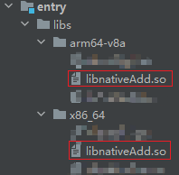
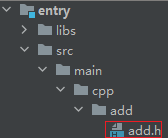
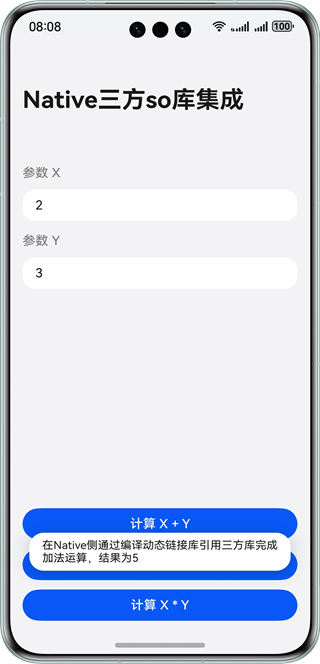
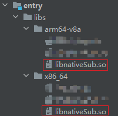
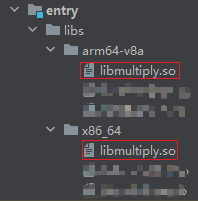
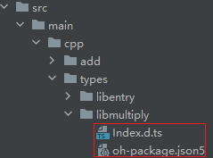
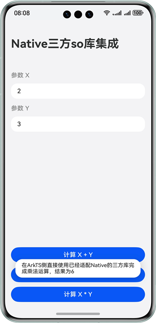
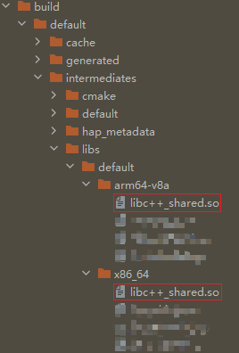
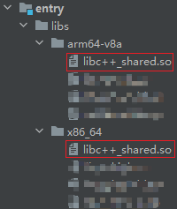

# 三方动态链接库集成

更新时间：2026-03-12 08:45:02

来源：https://developer.huawei.com/consumer/cn/doc/best-practices/bpta-dynamic-link-library

**   


##### 概述

在实际项目中，业务功能可能由不同“团队/组织”提供，如：团队A开发功能编译生成so库，团队B引用so库进行后续开发。so库可以将项目的不同功能模块化，提升代码的复用性和工程的可维护性。团队开发过程中引用三方so库的场景可分为两种：
 1. 在Native侧引用三方so库。
2. 在ArkTS侧引用三方so库。
 
下面针对这两种场景给出具体的实现方案。
 
 

##### 在Native侧引用三方so库

按照实际开发场景可分为两部分：编译生成so库和在Native侧引用so库。
 
第一部分：开发功能函数，编译生成so库。具体操作可参考：[使用命令行CMake构建NDK工程](https://developer.huawei.com/consumer/cn/doc/harmonyos-guides/build-with-ndk-cmake)。
 
第二部分：在Native侧引用so库调用功能函数。可以采用如下两种方案：
 
- 方案一：通过编译动态链接库的方式引用。
- 方案二：通过调用dlopen的方式引用。

 
 

##### 通过编译动态链接库的方式引用

**实现原理**
 
将so库加入到工程中，在Native侧使用CMake编译动态链接库，通过include引用头文件调用功能函数。
 
**开发步骤**
 
以引用一个加法计算so库为例，具体实现步骤如下：
 1. 将第一部分生成的so库文件置于entry/libs对应的架构目录下，将其对应的头文件置于src/main/cpp目录下。



  


2. 修改src/main/cpp目录下CMakeLists.txt文件配置，使用target_link_libraries命令将需要预加载的加法so库链接到项目中。
```text
# Compile and link third-party SO libraries
target_link_libraries(entry PUBLIC ${NATIVERENDER_ROOT_PATH}/../../../libs/${OHOS_ARCH}/libnativeAdd.so)
```

3. 在Native侧通过头文件引用加法so库。
```cpp
static napi_value NAPI_Global_nativeAdd(napi_env env, napi_callback_info info) {
    size_t argc = 2;
    napi_value args[2] = {nullptr};

    napi_get_cb_info(env, info, &argc, args, nullptr, nullptr);

    napi_valuetype valuetype0;
    napi_typeof(env, args[0], &valuetype0);

    napi_valuetype valuetype1;
    napi_typeof(env, args[1], &valuetype1);

    double value0;
    napi_get_value_double(env, args[0], &value0);

    double value1;
    napi_get_value_double(env, args[1], &value1);

    napi_value ret;
    napi_create_double(env, add(value0, value1), &ret);

    return ret;
}

// ...

EXTERN_C_START
static napi_value Init(napi_env env, napi_value exports) {
    napi_property_descriptor desc[] = {
        {"nativeAdd", nullptr, NAPI_Global_nativeAdd, nullptr, nullptr, nullptr, napi_default, nullptr},
        // ...
    napi_define_properties(env, exports, sizeof(desc) / sizeof(desc[0]), desc);
    return exports;
}
EXTERN_C_END
```

4. 在index.d.ts文件中导出Native侧提供的接口，在ArkTS侧进行结果验证。
```ts
// Export the addition calculation APIs provided on the Native side
export const nativeAdd: (a: number, b: number) => number;
```
 在ArkTS侧调用Native侧提供的接口进行加法计算。

  
```ArkTS
// Integrate the SO library on the Native side directly to complete the addition operation
let result = testNapi.nativeAdd(Number(this.paramX), Number(this.paramY));
```

 
图1 **在Native侧通过编译动态链接库的方式引用so库完成加法运算效果展示**


 
 

##### 通过调用dlopen的方式引用

**实现原理**
 
将so库加入到工程中，在ArkTS侧将so库的沙箱路径传递至Native侧，在Native侧使用dlopen解析so库调用功能函数。但是需要注意，该方案只能引用C语言编译模式生成的so库，因此用于生成so库的.h头文件需要用extern "C" {}包裹。
 
**开发步骤**
 
以引用一个减法计算so库为例，具体实现步骤如下：
 1. 将第一部分生成的so库文件置于entry/libs对应的架构目录下。


2. 在ArkTS侧将so库的[沙箱路径](https://developer.huawei.com/consumer/cn/doc/harmonyos-guides/app-sandbox-directory)传递至Native侧。
> [!NOTE]
> 此处需要使用so库的沙箱路径，而不是其真实路径。 为保障用户隐私安全，dlopen具有命名空间隔离能力，应用可以加载的动态库受到命名空间的限制。一般应用只能够加载应用安装包目录/data/storage/el1/bundle下的动态库，以及系统内置对外开放的动态库，若加载自定义路径动态库会报错：MUSL-LDSO bundlename E Open absolute_path library: check ns accessible failed, pathname libxxx.so namespace moduleNs_default。


  
```ArkTS
let projectPath = this.getUIContext().getHostContext()!.bundleCodeDir; // Get the project path
let abiPath = deviceInfo.abiList === 'x86_64' ? 'x86_64' : 'arm64';
let soLibPath = `${projectPath}/libs/${abiPath}/libnativeSub.so`;
```

3. 在Native侧引入dlfcn.h，通过调用dlopen解析so库实现减法计算。
```cpp
typedef double (*Sub)(double, double);
static napi_value NAPI_Global_nativeSub(napi_env env, napi_callback_info info) {
    size_t argc = 3;
    napi_value args[3] = {nullptr};
    napi_get_cb_info(env, info, &argc, args, nullptr, nullptr);
    double value0;
    napi_get_value_double(env, args[0], &value0);
    double value1;
    napi_get_value_double(env, args[1], &value1);
    size_t length = 0;
    napi_status status = napi_get_value_string_utf8(env, args[2], nullptr, 0, &length);
    if (status != napi_ok) {
        return nullptr;
    }
    char *path = new char[length + 1];
    std::memset(path, 0, length + 1);
    napi_get_value_string_utf8(env, args[2], path, length + 1, &length); // Get the SO library path information
    void *handle = dlopen(path, RTLD_LAZY);                              // Open a SO library and get the path
    napi_value result = nullptr;
    Sub sub_func = (Sub)dlsym(handle, "sub"); // Get the function named sub
    status = napi_create_double(env, sub_func(value0, value1), &result);
    delete[] path;
    dlclose(handle); // Remember to close the SO library
    if (status != napi_ok) {
        return nullptr;
    }
    return result;
}

EXTERN_C_START
static napi_value Init(napi_env env, napi_value exports) {
    napi_property_descriptor desc[] = {
        // ...
        {"nativeSub", nullptr, NAPI_Global_nativeSub, nullptr, nullptr, nullptr, napi_default, nullptr}};
    napi_define_properties(env, exports, sizeof(desc) / sizeof(desc[0]), desc);
    return exports;
}
EXTERN_C_END
```

4. 在index.d.ts文件中导出Native侧提供的接口，在ArkTS侧进行结果验证。
```ts
// Export the subtraction calculation interface provided by the Native side
export const nativeSub: (a: number, b: number, path: string) => number;
```
 在ArkTS侧调用Native侧提供的接口进行减法计算。

  
```ArkTS
// Integrate the SO library on the Native side by dlopen to complete the subtraction operation
let result = testNapi.nativeSub(Number(this.paramX), Number(this.paramY), soLibPath);
```

 
图2 **在Native侧通过调用dlopen引用三方so库完成减法运算效果展示**


 
 

##### 在ArkTS侧引用三方so库

按照实际开发场景可分为两部分：生成适配Native的so库和在ArkTS侧引用so库。
 
第一部分：开发功能函数，编译生成so库并适配Native。具体操作可参考：[使用命令行CMake构建NDK工程](https://developer.huawei.com/consumer/cn/doc/harmonyos-guides/build-with-ndk-cmake)。
 
第二部分：在ArkTS侧通过配置模块动态依赖的方式引用so库。
 
 

##### 通过配置模块动态依赖引用

**实现原理**
 
将so库和对应的Native侧接口文件加入到工程中，在工程中配置so库对应的模块动态依赖，在ArkTS侧通过import引入依赖接口调用so库。但是需要注意该方案只能引用适配Native的so库，因此在编译生成so库时需要实现功能函数并[向Napi注册其Native侧接口](https://developer.huawei.com/consumer/cn/doc/harmonyos-guides/use-napi-process#native侧方法的实现)，提供对应的Native侧接口文件index.d.ts和配置文件oh-package.json5。
 

 
**开发步骤**
 
以引用一个乘法计算so库为例，具体实现步骤如下：
 
1. 将第一部分生成的so库文件置于entry/libs对应的架构目录下。


2. 在src/main/cpp/types下新建目录并将so库模块src/main/cpp/types目录下的index.d.ts、oh-package.json5移动到该目录下。


3. 在模块级oh-package.json5中声明乘法so库根目录路径。
```json
{
  // ...
  "dependencies": {
    // ...
    // The declared dependency name should match the name of the referenced SO library
    "libmultiply.so": "file:./src/main/cpp/types/libmultiply"
  }
}
```

4. 在ArkTS侧使用import引用oh-package.json5中声明的依赖并进行结果验证。
```ArkTS
// Integrate the SO library that has been adapted to Native On the ArkTS side to complete the multiplication operation
let result = multiplyNapi.multiply(Number(this.paramX), Number(this.paramY));
```

 
图3 **在ArkTS侧引用已经适配Native的三方so库完成乘法运算效果展示



 

##### 常见问题

 

##### 如何在同一个工程中实现三方so库的编译和引用

可以在工程中创建两个Module，通过其中一个Module编译生成加法、减法和乘法运算so库，通过另外一个Module引用三方so库，进行结果验证。
 
**参考链接**
 
- [使用命令行CMake构建NDK工程](https://developer.huawei.com/consumer/cn/doc/harmonyos-guides/build-with-ndk-cmake)
- [在NDK工程中使用预构建库](https://developer.huawei.com/consumer/cn/doc/harmonyos-guides/build-with-ndk-prebuilts)

 
 

##### 在集成三方so库时，.so库文件和.h头文件一定要置于上述方法的路径下吗

不一定。原则上.so库文件和.h头文件可以置于需要引用so库的工程目录的任意位置，但是需要在工程的CMakeLists.txt文件中修改文件配置。如：将add.h头文件和libnativeAdd.so库文件放置在entry的根目录下，需要在CMakeLists.txt文件中通过include_directories命令添加entry的根目录作为头文件路径，并修改target_link_libraries命令中需要预加载的加法so库的路径，才能保证so库链接成功。
 
**代码示例**
 
```text
# src/main/cpp/CMakeLists.txt
include_directories(${NATIVERENDER_ROOT_PATH}/../../..)
target_link_libraries(entry PUBLIC ${NATIVERENDER_ROOT_PATH}/../../../libnativeAdd.so)
```
 
 

##### 在纯ArkTS工程中如何引用三方so库

纯ArkTS工程可以通过配置模块动态依赖的方式引用so库。但是需要注意，在引用过程中除了将已经适配Native的xxx.so库文件置于entry/libs对应的架构目录下外，还需要将编译三方so库时配套产生的libc++_xxx.so库文件置于该目录下。
 
**示例如下**
 




 
 

##### 示例代码

- [实现动态链接库（.so）的引用](https://gitcode.com/harmonyos_samples/NativeSoIntegration)
