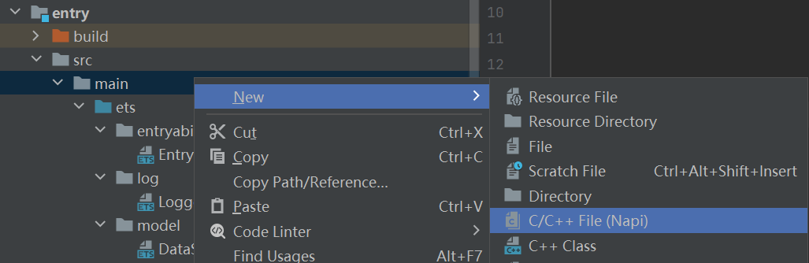
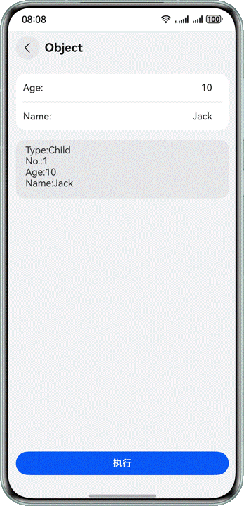
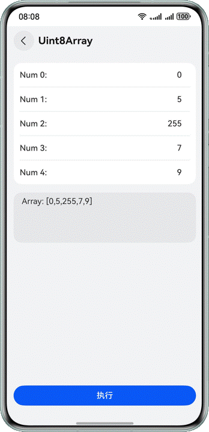

# 跨语言调用复杂参数传递

更新时间：2026-05-18 00:55:31

来源：https://developer.huawei.com/consumer/cn/doc/best-practices/bpta-complex-type-pass

**   


#### 概述

开发者为了提高程序运行效率，通常需要将一些运算量较大的内容放在C++环境中运行，因此经常需要进行ArkTS与C++之间的数据传递。本文以常见的五种数据类型：Array(uint8Array)、Object、HashMap、PixelMap、Class为例，向开发者介绍如何进行复杂参数的跨语言传递。
 
 
在开始介绍不同场景的开发流程之前，请注意，跨语言数据传递，需要使用[Node-API](https://developer.huawei.com/consumer/cn/doc/harmonyos-references/napi)。因此，在新建项目后，请手动新建Native模块，方法如图所示:
 
图1 **新建Napi模块



 

#### 场景案例

 

#### arrayBuffer类型数据交互

本章以简单的数组传递场景为例，在ArkTS侧输入一个Uint8Array数组，传递到C++侧，再构造另一个数组，并返回ArkTS侧。
 
以此为例，介绍ArrayBuffer类型的数据如何相互传递使用。除数组外，string等连续数据类型也可参考本段。
 
**实现原理**
 
ArrayBuffer是一种用于表示通用的、固定长度的原始二进制数据缓冲区的对象。在C++侧接受该类型参数时一般会通过Node-API提供的函数（如napi_get_arraybuffer_info()）获取到ArrayBuffer的数据指针和长度，从而可以访问和操作这些数据。
 
从C++侧传递ArrayBuffer数据到ArkTS侧时，通常会在C++层创建出一个数据缓冲区（如std::vector&lt;uint8_t&gt;）并填充所需的数据。然后使用Node-API提供的函数（如napi_create_arraybuffer()和napi_create_typedarray()）在ArkTS侧创建一个新的ArrayBuffer对象，并将其与C++层的数据缓冲区关联起来。最后传递该对象到ArkTS侧。
 
**开发步骤**
 1. 需要先在index.d.ts文件中，声明一个用于数据传递的函数。
```ts
export const uint8ArrayPassing: (input: Uint8Array) => Uint8Array;
```


  并在ArkTS文件中进行引用，如：
```ArkTS
import ParamPassing from 'libentry.so';
```


  使用时将Uint8Array类型的数据作为参数传入uint8ArrayPassing()函数即可。

  
```ArkTS
// entry/src/main/ets/pages/Uint8ArrayPage.ets
paramPassing() {
  let sendArray: number[] = [];
  try {
    this.inputArray.forEach((inputField) => {
      if (inputField.inputStr.length > 0) {
        if (Number(inputField.inputStr) <= 0xff) {
          sendArray.push(Number(inputField.inputStr));
        } else {
          throw new Error('Invalid data type.');
        }
      }
    })
    this.printStr = `Array: [${ParamPassing.uint8ArrayPassing(new Uint8Array(sendArray))}]`;
  } catch (e) {
    this.printStr = e?.message;
  }
}
```

2. 在C++工程中，定义数据传递函数。
```cpp
// entry\src\main\cpp\napi_init.cpp
static napi_value Uint8ArrayPassing(napi_env env, napi_callback_info info) {
    vector<uint8_t> num_array = {};
    Uint8ArrayPassingTs2Napi(env, info, num_array);
    return Uint8ArrayPassingNapi2Ts(env, num_array);
}
```


  其中uint8ArrayPassingTs2Napi()与uint8ArrayPassingNapi2Ts()分别负责数据从ArkTS至C++传递与反向传递。
```cpp
// entry\src\main\cpp\napi_init.cpp
void Uint8ArrayPassingTs2Napi(napi_env env, napi_callback_info info, vector<uint8_t> &input_array) {
    // Obtain parameters transmitted from the TS layer
    size_t argc = 1;
    napi_value args;
    // Gets detailed information about the function call, such as input parameters.
    napi_get_cb_info(env, info, &argc, &args, NULL, NULL);
    napi_value input_array_napi = args;

    // Retrieve the input array typedarray and generate input_buffer
    napi_typedarray_type type;
    napi_value input_buffer;
    size_t byte_offset;
    size_t length;
    napi_get_typedarray_info(env, input_array_napi, &type, &length, NULL, &input_buffer, &byte_offset);

    // Retrieve array data
    void *data;
    size_t byte_length;
    napi_get_arraybuffer_info(env, input_buffer, &data, &byte_length);

    if (type == napi_uint8_array) {
        uint8_t *data_bytes = (uint8_t *)(data);
        int num = length / sizeof(uint8_t);

        for (int i = 0; i < num; i++) {
            input_array.push_back(*((uint8_t *)(data_bytes) + i));
        }
    }

    return;
}
```


  在这段代码中，先用三个函数获取关键信息：

  napi_get_cb_info()：负责从ArkTS侧获取输入参数。

  napi_get_typedarray_info()：用于在Node-API模块中获得某个TypedArray的各种属性。

  napi_get_arraybuffer_info()：获取ArrayBuffer的底层数据缓冲区和长度。

  之后，通过循环配合指针和偏移量，读取其中的数据，并将其存入inputArray中。

  
```cpp
// entry\src\main\cpp\napi_init.cpp
napi_value Uint8ArrayPassingNapi2Ts(napi_env env, vector<uint8_t> &output_array) {
    // Number of data
    int num = output_array.size();

    // create output_buffer
    napi_value output_buffer;
    void *output_ptr = NULL;
    napi_create_arraybuffer(env, num * sizeof(uint8_t), &output_ptr, &output_buffer);

    // output_array
    napi_value output_array_napi;
    napi_create_typedarray(env, napi_uint8_array, num, output_buffer, 0, &output_array_napi);

    // Assign values to output_ptr and output_buffer
    uint8_t *output_bytes = (uint8_t *)output_ptr;
    for (int i = 0; i < num; i++) {
        output_bytes[i] = output_array[i];
    }

    return output_array_napi;
}
```
 在这段代码中，先用两个函数构建buffer和array：

  
- napi_create_arraybuffer()：负责构建buffer。

3. napi_create_typedarray()：负责构建array。

4. 在Init()函数中，实现ArkTS接口与C++接口的绑定和映射。
```cpp
static napi_value Init(napi_env env, napi_value exports) {
    napi_property_descriptor desc[] = {
        {"uint8ArrayPassing", nullptr, Uint8ArrayPassing, nullptr, nullptr, nullptr, napi_default, nullptr},
        // ...
    };
    // ...
}
```


  **实现效果**

  


  

  #### object类型数据交互

  本章通过模拟一个“排号机”应用，向开发者介绍如何进行object数据类型的相互传递，以及如何解析、修改其中的数据。

  **实现原理**

  Object类是所有其他类型的基类。在C++侧接收该类型参数时一般会通过Node-API提供的函数（如napi_get_named_property()）来获取object对象的某个属性，从而操作其属性值。

  从C++侧传递object类型到ArkTS侧时，可以利用Node-API封装好的接口（napi_create_object_with_named_properties()）直接通过传递参数数组的方式构建出一个带有给定属性值的object类型对象。

  **开发步骤**

1. 函数声明与调用，与[arrayBuffer类型数据交互](#section9552193517193)类同，此处不再赘述。特别的，此处还需定义需要使用的object数据类型。

  作为一个简单的“排号机”(比如医院中的)，需要年龄和姓名作为输入，并额外返回标志成人与否的布尔值和所排序号。因此，构造如下两种object，分别用于输入和输出。
```ts
// entry/src/main/ets/model/SampleObject.ts
export type SampleInputObject = {
  age: number;
  name: string;
}

export type SampleOutputObject = {
  isAdult: boolean;
  code: number;
  age: number;
  name: string;
}
```


2. 在C++工程中，定义数据传递函数。
```cpp
// entry\src\main\cpp\napi_init.cpp
static napi_value ObjectPassing(napi_env env, napi_callback_info info) {
    return ObjectPassingNapi2Ts(env, ObjectPassingTs2Napi(env, info));
}
```


  其中objectPassingTs2Napi()与objectPassingNapi2Ts()分别负责数据从ArkTS至C++传递与反向传递。
```cpp
// entry\src\main\cpp\napi_init.cpp
napi_value ObjectPassingTs2Napi(napi_env env, napi_callback_info info) {
    // Obtain parameters transmitted from the TS layer
    size_t argc = 1;
    napi_value args;
    // Gets detailed information about the function call, such as input parameters.
    napi_get_cb_info(env, info, &argc, &args, NULL, NULL);

    return args;
}
```


  napi_get_cb_info()：负责从ArkTS侧获取输入参数。

  
```cpp
// entry\src\main\cpp\napi_init.cpp
napi_value ObjectPassingNapi2Ts(napi_env env, napi_value inputObj) {
    static int32_t codeChild = 1;
    static int32_t codeAdult = 1;

    napi_value input_age;
    napi_value input_name;
    napi_get_named_property(env, inputObj, "age", &input_age);
    napi_get_named_property(env, inputObj, "name", &input_name);

    napi_value output_obj;
    napi_value output_is_adult;
    napi_value output_code;
    napi_value output_age = input_age;
    napi_value output_name = input_name;
    int32_t age;
    napi_get_value_int32(env, input_age, &age);
    napi_get_boolean(env, age >= 18, &output_is_adult);
    if (age < 18) {
        napi_create_int32(env, codeChild++, &output_code);
    } else {
        napi_create_int32(env, codeAdult++, &output_code);
    }

    const char *keysArray[] = {"isAdult", "code", "age", "name"};
    const napi_value outputArray[] = {output_is_adult, output_code, output_age, output_name};

    napi_create_object_with_named_properties(env, &output_obj, 4, keysArray, outputArray);

    return output_obj;
}
```
 napi_get_named_property()：负责获取并储存inputObj中的属性。

  napi_get_value_int32()：负责将获取到的inputAge属性解析为int32数据，并存入age中。

  napi_get_boolean()：负责将需要返回的boolean属性写入对应的napi_value量中。

  napi_create_int32()：负责将需要返回的int32属性写入对应的napi_value量中。

  napi_create_object_with_named_properties()：负责构造需要返回的object。

3. 在DevEco Studio[预生成](#fig08576372193)的Init()函数中设置写好的数据传递函数。与[arrayBuffer类型数据交互](#section9552193517193)类同，此处不再赘述。

  **实现效果**

  



  

  #### hashMap类型数据交互

  本章通过模拟一个“积分累计”应用，每次输入对象的本次积分，并返回所有对象的累积积分。向开发者介绍如何进行hashMap数据类型的相互传递，以及如何解析、修改其中的数据。

  **实现原理**

  hashMap是一种基于哈希表的Map接口实现的数据结构。在C++侧接受该类型参数时，由于C++没有可以直接接收该类型参数的数据类型，所以一般采用两种方式进行传递。

  1.传递数组：分别将HashMap的key、value作为数组取出，然后将两个数组传递至C++侧并组装成Map进行数据处理。

  2.传递JSON：将HashMap转为Json字符串传递至C++侧，在C++侧通过反序列化的方式构造成Map类型数据进行处理。

  同样的，从C++侧传递Map类型到ArkTS侧时，需要将Map序列化成Json字符串传递到ArkTS，然后在ArkTS侧进行反序列化获取对应参数。

  **开发步骤**

1. 函数声明与调用，与[arrayBuffer类型数据交互](#section9552193517193)类同，此处不再赘述。此外，由于程序不支持直接传递hashMap类型，因此需要使用其他数据类型作为媒介。

  有两种主流方案：

  
通过JSON进行序列化和反序列化，以string类型为媒介；

2. 将key和value拆成两个array，并以此为媒介。

  本文以前者为例，后者可参考：[如何实现ArkTS与C/C++的HashMap转换](https://developer.huawei.com/consumer/cn/doc/harmonyos-faqs/faqs-ndk-67)

  同时，由于ArkTS中的JSON.stringify不支持直接将hashMap序列化，因此还需将hashMap先转换为Record，再序列化。方法如下：
```ArkTS
// entry/src/main/ets/pages/HashMapPage.ets
hashMap2Rec(map: HashMap<string, Object>): Record<string, Object> {
  let Rec: Record<string, Object> = {}

  try {
    map.forEach((value: Object, key: string) => {
      // value may also be HashMap
      if (value instanceof HashMap) {
        let vRec: Record<string, Object> = this.hashMap2Rec(value);
        value = vRec;
      }
      Rec[key] = value;
    })
  } catch (error) {
    let err = error as BusinessError;
    hilog.error(0x0000, 'testTag', `forEach fail. code = ${err.code}, message = ${err.message}`);
  }

  return Rec;
}
```


  之后，将Record类型数据通过JSON.stringify序列化后即可传入C++侧。
- 在C++工程中，定义数据传递函数。
```cpp
static napi_value HashMapPassing(napi_env env, napi_callback_info info) {
    return HashMapPassingNapi2Ts(env, HashMapPassingTs2Napi(env, info));
}
```
 其中hashMapPassingNapi2Ts()与hashMapPassingTs2Napi()分别负责数据从ArkTS至C++传递与反向传递。同时，在C++侧，也需完成序列化和反序列化，本文采用nlohmann三方库完成此操作。

  三方库获取：[OpenHarmony / third_party_json · GitCode](https://gitcode.net/openharmony/third_party_json)
```cpp
// entry\src\main\cpp\napi_init.cpp
map<string, int> HashMapPassingTs2Napi(napi_env env, napi_callback_info info) {
    size_t argc = 1;
    napi_value args;
    // Gets detailed information about the function call, such as input parameters.
    napi_get_cb_info(env, info, &argc, &args, nullptr, nullptr);

    return nlohmann::json::parse(Value2String(env, args).c_str());
}
```


  napi_get_cb_info()：负责从ArkTS侧获取输入参数。

  value2String()：将napi_value数据解析为string的过程包装为一个函数，方便多次调用。

  nlohmann::json::parse()：负责将string反序列化为map<string, int>类型数据。

  其中，value2String函数需要开发者自己实现。
```cpp
// entry\src\main\cpp\napi_init.cpp
static std::string Value2String(napi_env env, napi_value value) {
    size_t string_size = 0;
    // Get string length
    napi_get_value_string_utf8(env, value, nullptr, 0, &string_size);
    std::string result_string;
    result_string.resize(string_size + 1);
    // Convert to string based on length
    napi_get_value_string_utf8(env, value, &result_string[0], string_size + 1, &string_size);
    return result_string;
}
```


  napi_get_value_string_utf8()：负责将napi_value数据解析为string。
> [!NOTE]
> 此处stringSize需要+1，这是因为napi_value是一个C的结构体指针，C语言的字符串实际上是使用空字符 \0 结尾的一维字符数组。而napi_get_value_string_utf8返回的stringSize，其长度不含结尾的\0。为了保证写入valueString的内容包含结尾的\0，所以需要+1。


  
```cpp
// entry\src\main\cpp\napi_init.cpp
napi_value HashMapPassingNapi2Ts(napi_env env, map<string, int> inputMap) {
    static map<string, int> points_table;
    std::map<string, int>::iterator iter;
    for (iter = inputMap.begin(); iter != inputMap.end(); ++iter) {
        points_table[iter->first] += iter->second;
    }

    string dump_string = nlohmann::ordered_json(points_table).dump();
    return String2value(env, dump_string);
}
```
 nlohmann::ordered_json()：负责将map序列化。

  dump()：负责将序列化后的数据转换为string类型。

  string2value()：将string转换为napi_value的过程包装为一个函数，方便多次调用。

  其中，string2value()也需要开发者自己实现。
```cpp
// entry\src\main\cpp\napi_init.cpp
static napi_value String2value(napi_env env, string str) {
    int length = str.length();

    napi_value output_string;
    napi_create_string_utf8(env, str.c_str(), length, &output_string);

    return output_string;
}
```


  napi_create_string_utf8()：负责将string类型数据转换为napi_value类型。
- 需在DevEco Studio[预生成](#fig08576372193)的Init()函数中设置写好的数据传递函数。与[arrayBuffer类型数据交互](#section9552193517193)类同，此处不再赘述。
- 将C++侧返回的string重新反序列化为hashMap。
```ArkTS
// entry/src/main/ets/pages/HashMapPage.ets
let receiveObj: object = JSON.parse(receiveStr);
let receiveMap: HashMap<string, number> = new HashMap();
Object.entries(receiveObj).forEach((value: [string, number]) => {
  receiveMap.set(value[0], value[1]);
})
```
 JSON.parse()：此函数只能将string反序列化为object，因此还需额外一步将其转换为hashMap类型。

 
 
**实现效果**
 


 

#### pixelMap类型数据交互

本章以图片处理应用为例，介绍如何进行pixelMap类型数据交互。
 
除本文介绍的方法外，也可通过readPixelsToBuffer将其转换为Uint8Array类型，进行处理。此方案可以参考[arrayBuffer类型数据交互](#section9552193517193)，本文不作介绍。
 
> [!NOTE]
> 在进行应用开发之前，开发者需要打开native工程的src/main/cpp/CMakeLists.txt，在target_link_libraries依赖中添加image的libpixelmap_ndk.z.so CODE18

 
**实现原理**
 
PixelMap是一种用于显示图像的数据结构。在C++侧接收该类型参数的时候，可以直接调用libpixelmap.so库中的函数直接通过ArkTS侧的pixelmap对象构造出Native侧的pixelmap类型对象（NativePixelMap），进而对其进行数据处理。
 
由于pixelMap类似一个C++语言中的指针，通过上述操作之后更改了其指向的内容，因此在ArkTS侧通过设定延迟可以直接触发ArkTS侧的图像自渲染，从而实现ArkTS页面刷新，直接显示修改后的图像。
 
**开发步骤**
 1. 函数声明与调用，与[arrayBuffer类型数据交互](#section9552193517193)类同，此处不再赘述。
2. 在ArkTS侧，需要先完成图片的加载和pixelMap化。
```ArkTS
// entry/src/main/ets/pages/PixelMapPage.ets
async loadPixelMap() {
  let resourceManager = this.getUIContext().getHostContext()!.resourceManager;
  try {
    let imageArray = await resourceManager.getMediaContent($r('app.media.SampleImage').id);
    let imageResource = image.createImageSource(imageArray.buffer);
    let opts: image.DecodingOptions = { editable: true, desiredPixelFormat: image.PixelMapFormat.BGRA_8888 };
    imageResource.createPixelMap(opts).then((pixelMap) => {
      this.pixelMap = pixelMap;
      this.loadComplete = true;
    })
  } catch (error) {
    let err = error as BusinessError;
    hilog.error(0x0000, 'testTag', `getMediaContent fail. code = ${err.code}, message = ${err.message}`);
  }
}

aboutToAppear(): void {
  this.loadPixelMap();
}
```
 createPixelMap()：负责将从imageResource加载的图片解码为pixelMap格式。
3. 在C++工程中，定义数据传递函数。
```cpp
// entry\src\main\cpp\napi_init.cpp
static napi_value PixelMapPassing(napi_env env, napi_callback_info info) {
    size_t argc = 1;
    napi_value ts_pixel_map;
    // Gets detailed information about the function call, such as input parameters.
    napi_get_cb_info(env, info, &argc, &ts_pixel_map, nullptr, nullptr);

    // Initialize the NativePixelMap object.
    // NativePixelMap and ArkTSPixelMap share memory space.
    // That is, modifications to NativePixelMap also affect ArkTSPixelMap.
    NativePixelMap *native_pixel_map = OH_PixelMap_InitNativePixelMap(env, ts_pixel_map);

    float opacity = 0.5;
    OH_PixelMap_SetOpacity(native_pixel_map, opacity);

    return nullptr;
}
```
 napi_get_cb_info()：负责从ArkTS侧获取输入参数。

  OH_PixelMap_InitNativePixelMap()：负责初始化NativePixelMap对象。

  OH_PixelMap_SetOpacity()：负责修改NativePixelMap中的不透明度。

  其他诸如旋转、缩放等操作可以参考[位图操作（使用Image处理PixelMap数据）](https://developer.huawei.com/consumer/cn/doc/harmonyos-guides/image-pixelmap-operation-native)。

  
> [!NOTE]
> 输入的TSPixelMap与生成的NativePixelMap共享内存空间，因此直接调用相关方法修改NativePixelMap对象，即可同步影响TSPixelMap对象。所以此处无需回传数据。

4. 在Init()函数中的设置流程与[arrayBuffer类型数据交互](#section9552193517193)相同，不再赘述。
5. 在ArkTS中令Image组件重新渲染。
```ArkTS
// entry/src/main/ets/pages/PixelMapPage.ets
if (this.loadComplete) {
  Image(this.pixelMap)
    .height(400)
} else {
  Image($r('app.media.loading'))
    .height(400)
}
```


  如上所示，通过更改this.loadComplete()即可完成Image的重新渲染。
```ArkTS
// entry/src/main/ets/pages/PixelMapPage.ets
if (this.pixelMap) {
  this.loadComplete = false;
  ParamPassing.pixelMapPassing(this.pixelMap);
  // Only modifying PixelMap cannot cause the system to re render,
  // so this method is required to manually refresh the image component.
  setTimeout(() => this.loadComplete = true, 500);
}
```


  这是因为pixelMap类似一个C语言指针，只更改其指向的内容，其本身值未变，不会引发自动重渲染。此处设定的延迟也是为了确保重渲染可以触发。
 
 
**实现效果**
 


 

#### class类型数据，ArkTS传递至C++

本章以简单的计算器为例，介绍如何进行class类型数据交互。由于两侧传递方式差异较大，因此分为两章讲解。
 
本章讲解ArkTS传递至C++。
 
**实现原理**
 
ArkTS语言中，class（类）是用于定义对象的模板，并拥有特有的属性和方法。在C++侧接收该类型时与object类型基本一致，一般会通过Node-API提供的函数（如napi_get_named_property()）来获取class对象的某个属性，从而操作其属性值。
 
**开发步骤**
 1. 在index.d.ts中声明需要传递的class。
```ts
// entry/src/main/cpp/types/libentry/Index.d.ts
export interface SampleClassTs2Napi {
  result: string;

  add(a: number, b: number): string;
}
```


  声明传递用的函数。
```ts
// entry/src/main/cpp/types/libentry/Index.d.ts
export const classPassingTs2Napi: (input: SampleClassTs2Napi) => string;
```


  ArkTS文件中也需要对此进行引用，并实现上文声明的class。
```ArkTS
// entry/src/main/ets/pages/ClassPage.ets
import ParamPassing from 'libentry.so';
import { OutputArea } from '../model/IOModel';

const HINT_STRING: string = 'Calculation completed:\n';

class SampleClassTs2Napi implements ParamPassing.SampleClassTs2Napi {
  public result: string = '';

  add(a: number, b: number) {
    this.result = `${a} + ${b} = ${a + b}`;
    return HINT_STRING;
  }
}
```

2. 在C++工程中，定义数据传递函数。
```cpp
// entry\src\main\cpp\napi_init.cpp
napi_value ClassPassingTs2Napi(napi_env env, napi_callback_info info) {
    size_t argc = 1;
    napi_value args;
    // Gets detailed information about the function call, such as input parameters.
    napi_get_cb_info(env, info, &argc, &args, nullptr, nullptr);

    // Retrieve the method named "add" from the parameter object and store it in the "add" variable.
    napi_value add;
    napi_get_named_property(env, args, "add", &add);

    // Create parameter array
    napi_value arr[2];
    napi_create_int32(env, 114, &arr[0]);
    napi_create_int32(env, 514, &arr[1]);
    // Call the "add" method of the parameter object, pass this array as a parameter,
    // and store the result in the funcResult variable.
    napi_value func_result;
    napi_call_function(env, args, add, 2, arr, &func_result);

    // Retrieve the property values named "result" from the parameter object
    // using the napi_get_named_property function, and store them in the param_result variables.
    napi_value param_result;
    napi_get_named_property(env, args, "result", &param_result);

    string resultStr = Value2String(env, func_result) + Value2String(env, param_result);
    return String2value(env, resultStr);
}
```
 classPassingTs2Napi()：负责将class从ArkTS传递至Napi，之后返回一个string作为结果。

  napi_get_cb_info()：负责从ArkTS侧获取输入参数。

  napi_get_named_property()：第一次调用，负责将方法名为"add"的方法存入变量add中。

  napi_create_int32()：负责将入参解析为int32，并存入数组arr中。

  napi_call_function()：负责在C++工程中调用从ArkTS传入的class的方法，需要使用上两步获得的入参数组arr和方法add。

  napi_get_named_property()：第二次调用，负责将名为"result"的属性存入param_result中。

  value2String、string2value()：负责napi_value与string类型之间的相互转换，实现方法详见[hashMap类型数据交互](#section81062596218)。
3. 需在DevEco Studio[预生成](#fig08576372193)的Init()函数中设置写好的数据传递函数。与[arrayBuffer类型数据交互](#section9552193517193)类同，此处不再赘述。
 
 
**实现效果**
 



 

#### class类型数据，C++传递至ArkTS

本章仍以简单的计算器为例，介绍class类型数据如何从C++传递至ArkTS。
 
**实现原理**
 
从C++侧传递class类型到ArkTS侧时，需要在C++侧对C++类方法进行Napi适配，然后在init函数中通过napi_define_class建立ArkTS类方法与C++侧方法的映射关系，然后将对应的class对象挂载到export上导出。注意：需要在index.d.ts文件中声明需要传递的class。
 
**开发步骤**
 1. 需要在index.d.ts中声明需要传递的class。
```ts
// entry/src/main/cpp/types/libentry/Index.d.ts
export class SampleClassNapi2Ts {
  private _hintStr: string;

  constructor(hintStr: string);

  times(a: number, b: number): string;
  public get hintStr();
  public set hintStr(value:string);
}
```
 
> [!NOTE]
> 此处需要使用get和set关键字定义访问器，不能直接引用、修改属性。

2. 在ArkTS侧调用该class及其属性、方法。
```ArkTS
// entry/src/main/ets/pages/ClassPage.ets
let napiClass: ParamPassing.SampleClassNapi2Ts = new ParamPassing.SampleClassNapi2Ts(HINT_STRING);
napiClass.hintStr += 'modify by ArkTS: \n';
this.printStr = napiClass.hintStr + napiClass.times(6, 9);
```
 在调用时，用法与其他寻常的ArkTS的class一样。无需特别注意。
3. 在C++工程中，定义对应的class。
```cpp
// entry\src\main\cpp\napi_init.cpp
class SampleClassNapi2Ts {
public:
    std::string hint_str;
    SampleClassNapi2Ts(string str) { this->hint_str = str; };
    std::string times(int a, int b) {
        std::ostringstream ost;
        ost << a << " × " << b << " = " << a * b;
        return ost.str();
    };
};
```
 此处使用ostringstream输出流，以便完成字符串的构造。因此需要提前导入stream。

  同时，还需依次完成供ArkTS调用的访问器、构造函数和方法。

  
- getHintStr()，用于获取hintStr属性。
```cpp
// entry\src\main\cpp\napi_init.cpp
static napi_value GetHintStr(napi_env env, napi_callback_info info) {
    napi_value ts_class_obj;
    // Gets detailed information about the function call, such as input parameters.
    napi_get_cb_info(env, info, nullptr, nullptr, &ts_class_obj, nullptr);

    SampleClassNapi2Ts *c_class_obj;
    // Retrieve and manipulate the C++object previously bound to jsThis using napi_unwrap
    napi_unwrap(env, ts_class_obj, reinterpret_cast<void **>(&c_class_obj));
    if (c_class_obj) {
        return String2value(env, c_class_obj->hint_str);
    } else {
        return nullptr;
    }
}
```


  napi_get_cb_info()：负责从ArkTS侧获取输入参数。

  napi_unwrap()：负责解析ArkTS class中包装的C++ class，并使用指针c_class_obj进行储存。

  string2value()：负责将obj->hintStr转换为napi_value，作为输出。此函数的实现方法详见[hashMap类型数据交互](#section81062596218)。

  ArkTS侧调用hintStr的值的时候，需要调用此函数，从而获得C++侧的hintStr的值。

  
> [!NOTE]
> 初始化阶段的访问器，napi_unwrap后获得的c_class_obj可能为空指针，所以必须验空。下同。


1. setHintStr()，用于设置hintStr属性。原理与getHintStr相通。
```cpp
// entry\src\main\cpp\napi_init.cpp
static napi_value SetHintStr(napi_env env, napi_callback_info info) {
    // Obtain parameters transmitted from the TS layer
    size_t argc = 1;
    napi_value value;
    napi_value ts_class_obj;
    // Gets detailed information about the function call, such as input parameters.
    napi_get_cb_info(env, info, &argc, &value, &ts_class_obj, nullptr);

    SampleClassNapi2Ts *c_class_obj;
    // Retrieve and manipulate the C++object previously bound to jsThis using napi_unwrap
    napi_unwrap(env, ts_class_obj, reinterpret_cast<void **>(&c_class_obj));

    if (c_class_obj) {
        c_class_obj->hint_str = Value2String(env, value);
    }

    return nullptr;
}
```


1. 实现times方法，为加区分，此处命名为TSTimes。napi_get_cb_info()：负责从ArkTS侧获取输入参数。

  napi_unwrap()：负责将传入的ArkTS class解包，获取与其绑定的C++ class，并使用指针c_class_obj进行储存。

  napi_get_value_int32()：负责将入参解析为int32并存入value0/value1中。

  string2Value()：负责将string转换为napi_value数据。此函数的实现方法详见[hashMap类型数据交互](#section81062596218)。
```cpp
// entry\src\main\cpp\napi_init.cpp
static napi_value TSTimes(napi_env env, napi_callback_info info) {
    size_t argc = 2;
    napi_value args[2] = {nullptr};
    napi_value ts_class_obj = nullptr;
    // Gets detailed information about the function call, such as input parameters.
    napi_get_cb_info(env, info, &argc, args, &ts_class_obj, nullptr);
    SampleClassNapi2Ts *c_class_obj = nullptr;
    // Convert ArkTS object to C++ object
    napi_unwrap(env, ts_class_obj, (void **)&c_class_obj);
    // Get parameters passed by ArkTS
    int value0;
    napi_get_value_int32(env, args[0], &value0);
    int value1;
    napi_get_value_int32(env, args[1], &value1);
    string c_result = c_class_obj->times(value0, value1);
    return String2value(env, c_result);
}
```


1. TsConstructor()，用于构造ArkTS class。napi_get_cb_info()：负责从ArkTS侧获取输入参数。

  value2String()：负责将入参转换为string。此函数的实现方法详见[hashMap类型数据交互](#section81062596218)。

  napi_set_named_property()：负责对指定的object加入一个新属性，并指定属性名。ArkTS侧调用的时候，将使用此处指定的名称。

  napi_wrap()：负责将C++ class包装为ArkTS class。
```cpp
// entry\src\main\cpp\napi_init.cpp
static napi_value TsConstructor(napi_env env, napi_callback_info info) {
    // Create Napi object
    napi_value ts_class_obj;
    size_t argc = 1;
    napi_value args[1] = {nullptr};
    // Gets detailed information about the function call, such as input parameters.
    napi_get_cb_info(env, info, &argc, args, &ts_class_obj, nullptr);
    string hint_str = Value2String(env, args[0]);
    // Create C++ object
    SampleClassNapi2Ts *c_class_obj = new SampleClassNapi2Ts(hint_str);
    // Set the JS object hintStr attribute
    napi_set_named_property(env, ts_class_obj, "hintStr", args[0]);
    // Binding JS objects with C++objects
    napi_wrap(
        env, ts_class_obj, c_class_obj,
        // Define callback function for recycling JS objects, used to destroy C++objects and prevent memory leaks
        [](napi_env env, void *finalize_data, void *finalize_hint) {
            SampleClassNapi2Ts *c_class_obj = (SampleClassNapi2Ts *)finalize_data;
            delete c_class_obj;
            c_class_obj = nullptr;
        },
        nullptr, nullptr);
    return ts_class_obj;
}
```

- 在Init()函数中设置class。
```cpp
// entry\src\main\cpp\napi_init.cpp
EXTERN_C_START
static napi_value Init(napi_env env, napi_value exports) {
    // ...
    napi_property_descriptor class_prop[] = {
        {"hintStr", 0, 0, getHintStr, setHintStr, 0, napi_default, 0},
        {"times", nullptr, TSTimes, nullptr, nullptr, nullptr, napi_default, nullptr}};
    napi_value sample_class = nullptr;
    const char *class_name = "SampleClassNapi2Ts";
    // Establish the association between ArkTS constructor and C++ methods
    napi_define_class(env, class_name, sizeof(class_name), TsConstructor, nullptr,
                      sizeof(class_prop) / sizeof(class_prop[0]), class_prop, &sample_class);
    napi_set_named_property(env, exports, class_name, sample_class);

    return exports;
}
EXTERN_C_END
```
 需要先在DevEco Studio[预生成](#fig08576372193)的Init()函数中，定义一个classProp，并写入class对应的访问器与方法

  并调用napi_define_class()和napi_set_named_property()完成ArkTS class 与C++ class的关联与设置。从而令ArkTS可以调用C++中的class。

 
 
**实现效果**
 


 

#### 示例代码

- [实现复杂参数的跨语言交互功能](https://gitcode.com/harmonyos_samples/ComplexTypePass)
