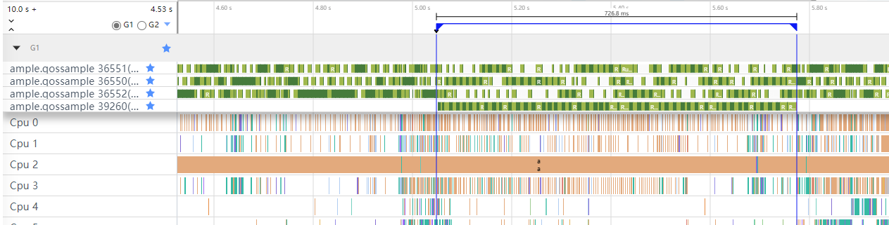
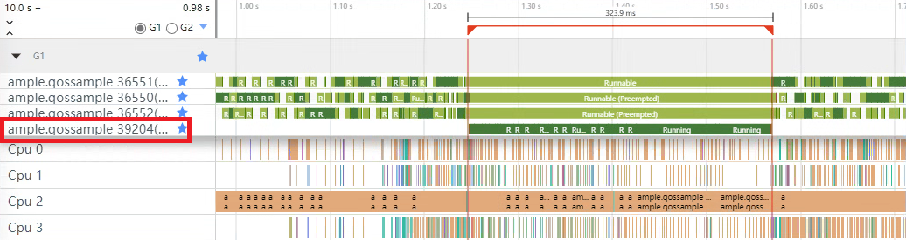

# 高负载场景线程优先级设置

更新时间：2026-03-12 08:45:02

来源：https://developer.huawei.com/consumer/cn/doc/best-practices/bpta-thread-priority-setting

## 概述


在现代软件开发中，多线程或多进程的并发处理已成为常态。在多线程环境中，不同线程执行的任务可能具有不同的重要性和紧急程度。在高负载情况下，系统资源（如CPU时间）变得尤为宝贵，此时若关键线程（例如UI渲染线程）因频繁被非关键线程抢占而无法获得足够的连续执行时间和资源保障，可能会导致画面卡顿、延迟等问题，从而严重影响用户体验。


## 解决思路


在负载较重的时候，为了让关键的任务能够拿到足够的资源，系统会依据任务的重要性，给任务分配相应的时间片，重要性越高的任务，可以分配到越多的时间片。那么开发者在可以识别自己应用中的关键线程的情况下，针对各个线程的任务紧急程度，给予关键线程相对较高的QoS等级以防止被其他线程打断，从而保证应用的流畅运行和更好的用户体验。


### QoS


服务质量（QoS）一文介绍了QoS的基本概念、原理、各个QoS等级适用的场景及负载特征及相关接口的用法。

在操作系统层面，QoS等级是一种用于区分不同线程优先级和服务质量的技术。通常系统会自动识别主线程，并在前台焦点情况下为其配置高于开放给应用开发者调用的QoS等级，以确保其优先执行。

与ArkTS端 taskpool.Priority 的线程优先级类似，QoS提供的优先级等级也都会相对应的映射到内核的优先级上。不过QoS提供的等级更多，自适应调度策略更强，它们属于两套不同的逻辑。

FFRT（Function Flow运行时）的QoS提供了ffrt_qos_inherit（-1）到ffrt_qos_user_initiated（3）5个优先等级，它与当前的QoS接口有着同一套底层逻辑。两者的差别在于，当前开发所用的QoS接口是直接开放给应用线程的，而FFRT的QoS则是面向任务的优先级配置，关于线程编程模型和任务编程模型的对比详见 FFRT 概述。


## 场景示例


下面是一个在高负载情况下，配置了不同QoS等级的两个关键线程完成相同计算任务所花时间的对比图，从界面的运行结果可以看到在高负载情况下，配置了高优先级的线程执行完计算所花的时间更少一些。


具体实现步骤如下：

1、实现负载线程所要完成的任务。

```cpp
// the Load task
void AddLoads(int n) {
  if (!n) {
    OH_LOG_Print(LOG_APP, LOG_ERROR, LOG_PRINT_DOMAIN, "QoS", "invalid input.");
    return;
  }

  // set QoS level
  int ret = OH_QoS_SetThreadQoS(QoS_Level::QOS_BACKGROUND);
  if (ret) {
    OH_LOG_Print(LOG_APP, LOG_ERROR, LOG_PRINT_DOMAIN, "QoS", "set load thread QoS level failed.");
    return;
  }

  // bind cpu
  cpu_set_t mask;
  CPU_SET(*g_affinity, &mask);
  if (sched_setaffinity(0, sizeof(mask), &mask) != 0) {
    OH_LOG_Print(LOG_APP, LOG_ERROR, LOG_PRINT_DOMAIN, "QoS", "bind load thread failed");
    return;
  }
  // Perform load calculation
  for (int i = 0; i < BOUND; i++) {
    for (int j = 0; j < BOUND; j++) {
      int x = (i + j) - n;
      printf("%d", x);
    }
  }
  // reset load flag
  g_addLoad = false;
}
```

2、实现高、低QoS等级计算线程（关键线程）所要完成的计算任务（斐波那契数列计算）。先通过 OH_QoS_SetThreadQoS 接口设置当前线程的QoS等级，再执行 DoFib() 斐波那契数列计算。

```cpp
// Perform Fibonacci sequence calculations
long long DoFib(double n) {
  if (n == ONE) {
    return ONE;
  }
  if (n == TWO) {
    return TWO;
  }
  return DoFib(n - ONE) + DoFib(n - TWO);
}

void SetQoS(QoS_Level level) {
  // set QoS level
  int ret = OH_QoS_SetThreadQoS(level);
  if (!ret) {
    OH_LOG_Print(LOG_APP, LOG_INFO, LOG_PRINT_DOMAIN, "QoS", "set qos level success.");
    //  query qos level
    QoS_Level queryLevel = QOS_DEFAULT;
    ret = OH_QoS_GetThreadQoS(&queryLevel);
    if (!ret) {
      OH_LOG_Print(LOG_APP, LOG_INFO, LOG_PRINT_DOMAIN, "QoS", "the qos level of current thread : %{public}d",
      queryLevel);
    } else {
      OH_LOG_Print(LOG_APP, LOG_ERROR, LOG_PRINT_DOMAIN, "QoS", "get qos level failed.");
      return;
    }
  } else {
    OH_LOG_Print(LOG_APP, LOG_ERROR, LOG_PRINT_DOMAIN, "QoS", "get level qos failed!");
    return;
  }

  // bind cpu
  cpu_set_t mask;
  CPU_SET(*g_affinity, &mask);
  if (sched_setaffinity(0, sizeof(mask), &mask) != 0) {
    OH_LOG_Print(LOG_APP, LOG_ERROR, LOG_PRINT_DOMAIN, "QoS", "bind qos thread failed");
    return;
  }
  auto startTime = std::chrono::system_clock::now();
  // Execute computational tasks
  long long res = DoFib(DEPTH);
  auto endTime = std::chrono::system_clock::now();
  g_durationTime = std::chrono::duration<double, std::milli>(endTime - startTime).count();
  OH_LOG_Print(LOG_APP, LOG_INFO, LOG_PRINT_DOMAIN, "QoS", "calculate res is: %{public}llu", res);

  // Reset QoS level
  ret = OH_QoS_ResetThreadQoS();
  if (!ret) {
    OH_LOG_Print(LOG_APP, LOG_INFO, LOG_PRINT_DOMAIN, "QoS", "reset qos level success.");
  } else {
    OH_LOG_Print(LOG_APP, LOG_ERROR, LOG_PRINT_DOMAIN, "QoS", "reset qos level failed!");
    return;
  }

  // after reset QoS, query QoS again will fail
  QoS_Level queryLevelTwo;
  ret = OH_QoS_GetThreadQoS(&queryLevelTwo);
  if (!ret) {
    OH_LOG_Print(LOG_APP, LOG_INFO, LOG_PRINT_DOMAIN, "QoS", "the qos level after: %{public}d", queryLevelTwo);
    return;
  } else {
    OH_LOG_Print(LOG_APP, LOG_ERROR, LOG_PRINT_DOMAIN, "QoS", "query qos level failed after reset.");
    return;
  }
}
```

3、然后分别将计算线程（关键线程）设置低、高QoS等级来对比两者在相同的高负载情况下完成相同层级的斐波那契数列计算所花时间。

- **给计算线程配置低QoS等级**
```cpp
static napi_value lowQoSCalculate(napi_env env, napi_callback_info info) {
  g_durationTime = 0;
  // Simulate system load
  if (!g_addLoad) {
    std::vector<std::thread> loadThreads;
    for (int i = 0; i < TASKS; i++) {
      // Activate threads to execute load tasks
      loadThreads.emplace_back(std::thread(AddLoads, TASKS));
      loadThreads[i].detach();
    }
    g_addLoad = true;
  }

  // set QOS_BACKGROUND level
  QoS_Level level = QoS_Level::QOS_BACKGROUND;
  std::thread task(SetQoS, level);
  task.join();

  // Return calculation time
  napi_value res;
  napi_create_double(env, g_durationTime, &res);
  return res;
}
```


计算线程（线程id：39260）设置低QoS等级trace图：





如上图所示，计算线程执行完计算任务耗时726.8毫秒。

- **给计算线程配置高QoS等级**
```cpp
static napi_value highQoSCalculate(napi_env env, napi_callback_info info) {
  g_durationTime = 0;
  // Simulate system load
  if (!g_addLoad) {
    std::vector<std::thread> loadThreads;
    for (int i = 0; i < TASKS; i++) {
      // Activate threads to execute load tasks
      loadThreads.emplace_back(std::thread(AddLoads, TASKS));
      loadThreads[i].detach();
    }
    g_addLoad = true;
  }
  // set QOS_USER_INTERACTIVE level
  QoS_Level level = QoS_Level::QOS_USER_INTERACTIVE;
  std::thread task(SetQoS, level);
  task.join();

  // Return calculation time
  napi_value res;
  napi_create_double(env, g_durationTime, &res);
  return res;
}
```


计算线程（线程id：39204）设置高QoS等级trace图：





如上图所示，计算线程执行完计算任务耗时323.9毫秒。


> [!NOTE]
> 该示例只在高负载压力下有效。
>  在低负载情况下，由于系统资源相对充足，大多数线程能够获得足够的CPU时间，因此优先级设置对线程执行效率的影响不明显。


## 总结


| 方案 | 斐波那契数列项数 | 计算耗时 |
| --- | --- | --- |
| 低QoS等级 QOS_BACKGROUND | 34 | 726.8毫秒 |
| 高QoS等级 QOS_USER_INTERACTIVE | 34 | 323.9毫秒 |


通过上述对比可以发现， 高负载压力下，高QoS优先级的线程可以更快的执行完计算任务。因此在实践中我们通过合理设置线程优先级，给关键线程以相对较高的QoS等级可以有效地避免关键线程被打断，从而保证应用程序的稳定性和响应性。


由于整机资源有限，若应用内部方法均设置高QoS等级，将导致资源相互抢占。此外，高QoS等级线程会相比低等级线程获取更多资源，过度提升线程QoS等级可能引起其他线程饥饿，从而影响整个系统的稳定运行。因此，线程QoS等级的设置需要结合具体应用场景和需求。


## 示例代码


- [基于QoS设置线程优先级](https://gitcode.com/harmonyos_samples/BestPracticeSnippets/tree/master/NdkQoS)
