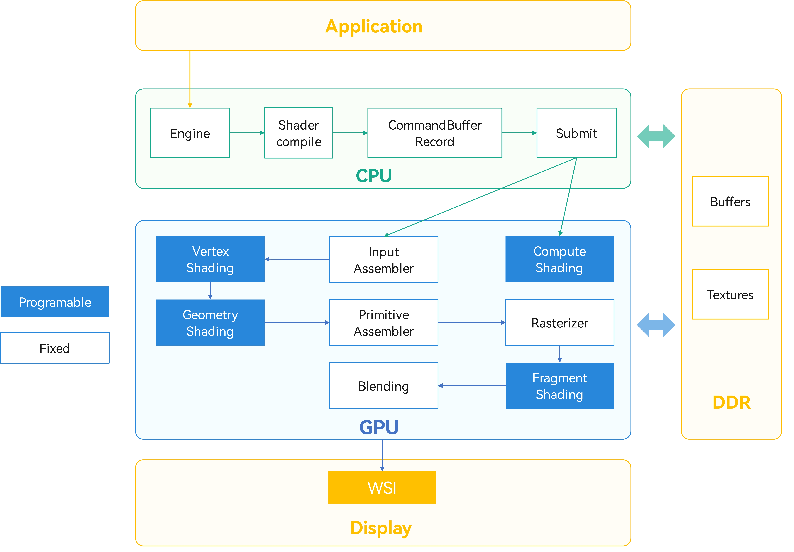
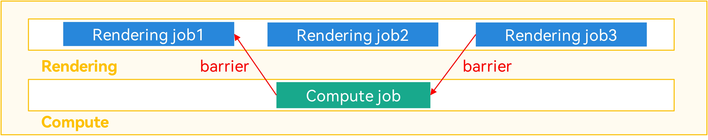

# 马良GPU渲染优化

更新时间：2026-03-19 08:43:01

来源：https://developer.huawei.com/consumer/cn/doc/best-practices/bpta-maleoon-gpu-best-practices

##### 概述

本文档主要指导开发者如何在马良（Maleoon）GPU上达到最佳的性能表现，只针对Maleoon GPU的优化实践，帮助开发者高效完成渲染任务，如果想要达成该目标，首先需要通过[Graphics Profiler](https://developer.huawei.com/consumer/cn/doc/Tools-Guides/overview-0000001050741459)等GPU分析工具，找到当前的能效瓶颈点，并遵循以下两个基本优化原则进行性能调优。本文所有优化建议，都将围绕这两个基本优化原则展开。
 1. 结合Maleoon GPU的软硬件架构，让驱动和硬件各模块并发执行，使芯片能力充分释放出来。
2. 利用硬件能力高效执行任务，从而降低芯片负载。
 
图形渲染的基本流程如下图所示。
 



 
> [!NOTE]
> 本文档主要适用于以下开发者： 熟悉图形标准API（ Vulkan 或 OpenGL ES ）、了解shader编码，有一定GPU性能优化基础。

 
 

##### CPU优化

 

##### Memory

**1. Device Memory分配与释放**
> [!NOTE]
> 仅适用于 Vulkan 。

 
 
vkAllocateMemory为了避免分配的内存没有真正被渲染线程使用，造成内存浪费，采用了延迟分配（protected memory除外）的处理。在调用vkBindImageMemory || vkBindBufferMemory || vkMapMemory（如果内存支持VK_MEMORY_PROPERTY_HOST_VISIBLE_BIT属性）时会真正分配内存，但是需要在此之前调用vkAllocateMemory分配device memory对象。
 
**【推荐】**
 
根据资源需求，选择最为匹配的内存类型进行内存分配，相同类型的memory按照用户实际需求一次分配大块size用于不同类型的资源（比如index buffer、vertex buffer及uniform buffer），可以提升内存申请的效率。
 



 
- vkFreeMemory一定要与vkAllocateMemory成对使用，避免内存泄漏。
- 绑定的memory资源尽量分时复用。
- 如果存在CPU访问内存，建议使用VK_MEMORY_PROPERTY_HOST_CACHED_BIT进行申请。

 
**【不推荐】**
 
频繁使用vkAllocateMemory。设备内存申请次数支持的最大数量可以通过maxMemoryAllocationCount limits属性获取。
 
**2. D****evice Memory访问**
 
 
> [!NOTE]
> 仅适用于 Vulkan 。

 
按照spec描述的内存类型范围支持4种类型：
 
- VK_MEMORY_PROPERTY_DEVICE_LOCAL_BIT | VK_MEMORY_PROPERTY_HOST_VISIBLE_BIT | VK_MEMORY_PROPERTY_HOST_COHERENT_BIT

 
- VK_MEMORY_PROPERTY_DEVICE_LOCAL_BIT | VK_MEMORY_PROPERTY_HOST_VISIBLE_BIT | VK_MEMORY_PROPERTY_HOST_CACHED_BIT

 
- VK_MEMORY_PROPERTY_DEVICE_LOCAL_BIT | VK_MEMORY_PROPERTY_LAZILY_ALLOCATED_BIT

 
- VK_MEMORY_PROPERTY_DEVICE_LOCAL_BIT | VK_MEMORY_PROPERTY_PROTECTED_BIT

 
对于不同类型的memory资源，有不同的使用方法：
 
- DEVICE_LOCAL | HOST_VISIBLE | HOST_COHERENT类型：属于CPU non-cache的内存，最好是用于CPU只写的资源。
- DEVICE_LOCAL | HOST_VISIBLE | HOST_CACHED类型：HOST_CACHED内存的访问要考虑一致性问题，该类型内存写操作后要使用如下接口进行cache同步操作：
vkFlushMappedMemoryRanges：CPU修改对GPU可见，CPU到GPU的同步。
- vkInvalidateMappedMemoryRanges：GPU对memory的更新对CPU可见，GPU到CPU的同步。

 
以上这两个操作对性能都有一定的消耗。
 - DEVICE_LOCAL | LAZILY_ALLOCATED类型：此种类型的内存允许只分配虚拟地址空间而不分配物理页，如果存在内存访问，则按需分配更多的物理页，支持内存增长。
- DEVICE_LOCAL | PROTECTED类型：Protected Flag将内存分成了Protected device memory和Unprotected device memory两种。
Protected device memory只对device（即GPU）可见，对host（即CPU）不可见。
- Unprotected device memory对device可见，也可以对host可见，取决于host visible属性。

 
 
**【推荐】**
 
- DEVICE_LOCAL | HOST_VISIBLE | HOST_COHERENT类型的内存用于CPU只写的资源。
- DEVICE_LOCAL | HOST_VISIBLE | HOST_CACHED类型的内存用于CPU回读的资源。
- DEVICE_LOCAL | LAZILY_ALLOCATED类型的内存只能用于TRANSIENT_ATTACHMENT用途的image。

 
**【不推荐】**
 
从CPU non-cache的内存中频繁回读数据，会影响性能。
 

##### Pipeline

> [!NOTE]
> 仅适用于 Vulkan 。

 
Pipeline是整个渲染过程的状态集合，包括可编程的shader和不可编程的fixed function state，其参数配置影响整个渲染过程的执行效率。
 
**1. Shader Stage**
 
**【推荐】**
 
- 在shader中如果需要用同一个sampler对同一个纹理多次采样的结果进行加权处理（比如模糊处理）并且权值和坐标是都mediump，建议可以使用base采样坐标加多组偏移的方式进行采样，并且用一层for循环进行多次采样加权操作。base采样坐标、偏移值和加权值需要是uniform，例如编译时常量或者来自uniform buffer（循环次数为编译时常量，最大为64）。
```text
vec2 baseCoord = vec2(0.0);
vec2 offset[4] = {...};
float weight[4] = {...};
vec4 color = vec4(0.0);
for (int i = 0; i < 4; i++) {
    color += weight[i] * texture(texSampler, baseCoord + offset[i]);
}
```

- shader中如果访问小批量的常量数据，推荐使用push constant。
- shader中访问uniform buffer array时，索引下标使用编译时常量。
- shader中访问uniform buffer时，访问的位置使用编译时常量。
- compute shader的一个workgroup size的三个维度的乘积为32的整数倍。
- fragment shader中，使用input attribute作为采样坐标去采样的次数小于等于8次，且所有采样用的texture和sampler都放到同一个descriptor set中。

 
**【不推荐】**
 
- 使用tessellation shader和geometry shader。
- create VkDevice时使能VkPhysicalDeviceProtectedMemoryFeatures::protectedMemory(或者VkPhysicalDeviceVulkan11Features::protectedMemory)。
- 需要使能depth test时，fragment shader中使用discard指令。
- 需要使能depth test时，fragment shader中写gl_FragDepth。
- 需要使能depth test时，fragment shader中写了storage image或者storage buffer。
- 需要使能depth test时，fragment shader中写了gl_SampleMask。
- fragment shader中使用highp。
- 需要使能blend时，fragment shader的输出color值与color attachment format的精度不匹配。例如color format是VK_FORMAT_B10G11R11_UFLOAT_PACK32，针对R通道，预期颜色在0.0~1.0f精度范围内时11bit的float可以表示较为精准，但是数值越大能够表示的精度越差。两个相邻像素本来预期的颜色假如是1024.0f和1024.1f，但是11bit可以精确表示1024.0f，但是无法精确表示1024.1f，所以1024.1f被存储成1040.0f，导致视觉效果上产生突变。

 
 
**2. Fixed State**
 
**【推荐】**
 
- 不同的vertex attribute在vertex buffer内连续排布。
- 不同的vertex attribute其所属的vertex buffer的binding号从0开始连续编排。比如有2个vertex buffer，其binding号配置为0和1性能较友好，配置为1和3性能不友好。
- App如果需要提前使用vkCreateGraphicsPipelines进行场景预热，建议create info中（主要是renderpass、pipeline layout、blend state、multisample count、alpha to coverage）要填充真实场景所使用的create info，因为这些info会影响shader的编译，如果预热时填充的create info与真实场景不一致，pipeline cache起不到作用，达不到预热的目的。

 
**【不推荐】**
 
使能depth test时，开启alpha to coverage。
 
**【影响】**
 
使能multisample，消耗多倍GPU运行资源，降低执行效率。
 

##### Shader编译

> [!NOTE]
> 仅适用于 OpenGL ES 。

 
Shader的首次编译（glCompileShader，glLinkProgram）耗时长，若在应用运行时进行实时编译，容易引起卡顿和丢帧，影响用户体验。
 
**【推荐】**
 
建议将Shader编译提前至应用启动时进行。
 
**【不推荐】**
 
在应用运行时实时编译Shader。
 
 

##### Command Buffer

Command buffer usage flags会影响command buffer的执行性能。当使用了SIMULTANEOUS_USE_BIT时，会降低command buffer的执行性能。如果在renderpass内使用secondary command buffer，flags不会有影响。
 
**【推荐】**
 
使用ONE_TIME_SUBMIT_BIT flag创建Command Buffer。
 
**【不推荐】**
 
除了用在renderpass内的secondary command buffer，其他类型的command buffer使用SIMULTANEOUS_USE_BIT。
 
 

##### Draw Call Batching

游戏下发的draw call数量越多，带来的CPU开销越多，整体的性能越差，建议合并draw call来降低CPU侧的开销。
 
**【推荐】**
 
一些典型的Draw call Batching场景：
 
- 使用shader相同，资源不同所使用的vertex buffers或者texture等资源变化，这些draw可以通过合并vertex buffer或使用texture arrays等方式来合并。

 
- 使用shader和Mesh相同通常绘制石头、树、灌木丛等情况，游戏会使用多个相同几何形状的instance去绘制，这种情况建议使用instance draw来完成。

 
- 使用Multi-Draw indirect功能

 
**【不推荐】**
 
- 使用大量顶点数少的draw call。
- 频繁切换管线状态，例如program、uniform等，对应相同管线状态的draw call尽量集中处理。

 
 

##### GPU优化

 

##### Vertex shading

**1. 精度**
 
为了规避Vertex shader计算位置信息的偏差导致后续shader stage误差放大，Maleoon GPU上vertex shader精度统一按照highp实现。
 
**【推荐】**
 
建议使用highp设置。
 
**2. InstanceID**
 
InstanceID经常会参与uniform buffer索引值的计算，此种情况下，Maleoon GPU会根据是否能有效减小load mem的次数从而开启Single InstanceID优化。此优化可以保证每组任务运行时InstanceID一致，从而每组任务load mem只用执行first thread一次load即可拿到整组对应数据。进一步，如果此shader所有uniform不超过1024 bytes大小，此uniform buffer可以完全放在constant register里面，即可通过Maleoon GPU特有的relative constant register代替此load mem操作，性能最优。
 
**【推荐】**
 
- InstanceID参与uniform buffer索引值计算时，uniform buffer中尽量精简只保留有效数据。
- 条件允许下，InstanceID每个实例可以多画一些点，性能收益更大。
- InstanceID参与uniform buffer索引值计算时，尽量不要在复杂的嵌套之内。

 
**【示例】**
 
原始shader：
 
```text
struct UnityType {
  vec4 MemberA[4];
  vec4 MemberB[4];
};
layout(std140) uniform UnityInstance {
  UnityType Array[32];
};
void main() {
  uint Idx = gl_InstanceID + uniformA.x;
  Idx = Idx << 2;
  TempVec.xy = uniformB.xy + Array[Idx / 4].MemberA[3].xy;
}
```
 
推荐shader：
 
```text
struct UnityType {
    vec4 MemberA[4];
};
layout(std140) uniform UnityInstance {
    UnityType Array[32];
};
void main() {
    uint Idx = gl_InstanceID + uniformA.x;
    Idx = Idx << 2;
    TempVec.xy = uniformB.xy + Array[Idx / 4].MemberA[3].xy;
}
```
 
 
**3. 顶点排布**
 
Maleoon GPU是Tile-Based架构的GPU，对于Tile-Based架构的GPU，有一个单独的pass（binning pass）仅用于计算顶点着色器的顶点位置。因此，如果输入的顶点位置相关属性与所有其他属性存储在同一个buffer中，则binning pass获取vertex shader输入时，由于memory的连续读取粒度较大，将会导致实际读取到较多对该shader无效的输入数据，内存带宽将会增加很多。
 
**【推荐】**
 
将顶点相关的属性存储在独立buffer中。
 

##### Per-Fragment Test

**Overdraw**
 
Overdraw作为影响GPU性能的核心问题之一，开发者可以对于不透明的primitive进行排序，让后面的primitive可以被剔除，GPU也在硬件层次上支持不依赖primitive排序的剔除方案。
 
Maleoon GPU内部有一套针对Depth Test的硬件优化，主要功能是对传统图形管线Depth Test的补充优化，目的是在更早期阶段，以较粗的粒度区块，提前剔除掉一些无效的绘制，从而更好的减少后级管线的开销。
 
Renderpass整体的CompareOp是以第一次满足“可进行深度剔除”时的Op为主要方向，例如，一段Renderpass有3个draw，它们的Depth Test通过条件分别为less (不满足剔除条件) 、 greater (满足剔除约束) 、 greater (不满足剔除约束)，则该段Renderpass以greater为主要方向进行深度剔除。
 
**【推荐】**
 
- 尽可能开启depth write enable。不开启会导致当下draw无法更新深度剔除值，从而产生overdraw。
- renderpass内各个draw的compareOp保持一致。当renderpass中，某个draw的compareOp与该renderpass的主要方向的compareOp相反。此时，当下draw无法进行深度剔除及深度更新，从而产生overdraw。
- Clear attachment尽可能放在renderpass的最开始或者是renderpass尚未赋予主要方向。若出现主要方向后，某draw有clear attachment操作，则从此draw开始无法进行深度剔除及深度值更新。

 
**【不推荐】**
 
- 当Draw的compareOp为equal、not_equal、always、never这些状态时，当下draw无法进行深度更新。
- 当renderpass已确定主要方向后，若之后的过程中出现compareOp为always或者是not_equal，从此always或not_equal的draw开始，包含之后所有的draw，无法进行深度剔除及更新深度剔除值。
- Draw同时使能depth bound enable和depth write enable。若出现此种情况，从此draw开始，无法进行深度剔除及深度值更新。
- Draw同时使能blend和depth write enable。若出现此种情况，从此draw开始，无法再更新深度剔除值，从而降低剔除率。
- shader使用discard、gl_SampleMask、gl_FragDepth、alpha2coverage等配置。若出现此种情况，当下draw的深度剔除值将无法更新。
- renderpass中绑定不同组pipeline，其PipelineColorBlendAttachmentState -> colorWriteMask会出现不一致的情况，当下的draw无法进行深度更新。若满足该条件且depth write enable，从此draw开始，无法进行深度剔除及深度值更新。

 
 

##### Fragment Shading

**1. Renderpass**
 
**1.1 基本配置**
 
**Vulkan**
 
Vulkan API明确定义了每个attachment在渲染开始和结束时行为，比如API接口中的loadOp定义了GPU如何在渲染开始时初始化片上内存，storeOp定义了渲染结束时是否需要写回主内存。
 
**【推荐】**
 
- 在不依赖于attachment初始内容的情况下，attachment的loadOp设置为LOAD_OP_NONE来初始化。
- Attachment的loadOp设置为LOAD_OP_CLEAR来清除内存。
- 不依赖的attachment，其storeOp设置为STORE_OP_NONE节省带宽。

 
**【不推荐】**
 
- 使用vkCmdClearColorImage或者vkCmdClearDepthStencilImage接口来清除作为attachment的image。
- 使用vkCmdClearAttachments接口来清除attachment。
- 使用shader写固定颜色来清除attachment。
- 在不依赖于attachment初始内容的情况下，attachment的loadOp设置为LOAD_OP_LOAD。
- 配置不需要的attachment。
- 不依赖的attachment，storeOp设置为STORE_OP_STORE。

 
**OpenGL ES**
 
OpenGL ES并没有明确的API来定义render pass的开始和结束，而是由GPU驱动根据framebuffer的绑定调用来推断的。
 
一个framebuffer的render pass通常开始于该framebuffer的target被绑定为GL_DRAW_FRAMEBUFFER，结束于换绑另一个framebuffer为GL_DRAW_FRAMEBUFFER。
 
**【推荐】**
 
- 全屏绘制的render pass，在render pass开头增加一个glClear操作。如果一个render pass前没有glClear操作，GPU将会在render pass的开始插入一个回读的操作从内存中读取attachment初始内容到GPU片上，带来不必要的带宽开销。
- 如果attachments的内容在接下来的渲染操作中将是不再需要的，调用glInvalidateFramebuffer通知GPU，GPU会做相应的优化处理。

 
**【不推荐】**
 
- 来回切换FBO。每次FBO切换GPU都需要完成上下文切换从而带来开销。通常开发者都注意不会频繁做不必要的FBO切换，然而有一些特殊场景比较容易忽略。

  例如，用户先clear FBO A，然后在另一个FBO B上开始一个新的render pass，最后再回到FBO A上开始渲染。这样第一个clear操作将开始一个单独包含clear操作的render pass，最终实际上有3个render pass被执行，且第3个渲染过程将有额外的回读操作。如果将第一个clear操作往后移动到真正相关的FBO渲染之前，将仅生成2个render pass，并且不会出现额外的回读操作。
- 在一个render pass内部调用glFlush和glFinish，有性能开销。
- 使用glReadPixels，CPU会等GPU job执行完成，在这之前都是阻塞状态，破坏CPU和GPU的并行。

 
**1.2 Multisample**
 
对于MSAA的大多数场景，multisample attachment一般只需要保留在GPU内部的片上内存中，无需写回到主内存中，只需要解析为singlesample attachment，然后将singlesample attachment写回到主内存，即multisample attachment的额外带宽永远不会写回到主内存，可以提高效率。
 
**Vulkan**
 
**【推荐】**
 
- multisample attachment的loadOp设置为LOAD_OP_NONE或者LOAD_OP_CLEAR。
- multisample attachment的storeOp设置为STORE_OP_NONE。
- 通过在subpass中设置pResolveAttachments来将multisample解析为singlesample。

 
**【不推荐】**
 
- multisample attachment的loadOp设置为LOAD_OP_LOAD。
- multisample attachment的storeOp设置为STORE_OP_STORE。
- 使用vkCmdResolveImage接口将multisample image解析为singlesample image。
- 针对depth attachment进行resolve操作。

 
**OpenGL ES**
 
**【推荐】**
 
使用GL_EXT_multisampled_render_to_texture扩展，实现将GPU片上multisampled数据resolve后直接写回到一个非multisampled纹理中。
 
**【不推荐】**
 
先将multisampled数据写回内存中的multisampled纹理中，然后再通过调用glBlitFramebuffer来实现resolve。
 
**2. Texture Prefetch**
 
Texture Prefetch是Maleoon GPU上一种资源预读取的加速技术。通过在shader执行前，对采样操作进行预读取，可以加速shader执行。
 
**【推荐】**
 
shader中texture prefetch需要满足以下条件：
 
- 采样坐标为输入变量。如果在fragment shader中包含采样操作，其采样坐标是输入变量与立即数或输入变量与uniform线性运算的结果，可以尝试将线性运算放到vertex shader中执行，详见以下【示例】。
- 以下采样函数支持texture prefetch。

| gvec4 texture(gsampler2D sampler, vec2 P, [float bias]); bias is imm value or some other uniform variable |

| gvec4 textureLod(gsampler2D sampler, vec2 P, float lod); lod is imm value or some other uniform variable |

| gvec4 textureProj(gsampler2D sampler, vec4(or vec3) P, [float bias]); bias = 0.0 (or no bias parameter) |

| gvec4 textureLodOffset(gsampler2D sampler, vec2 P, float lod, ivec2 offset); lod is imm value or some other uniform variable |

 
**【不推荐】**
 
在fragment shader中的if条件语句中直接使用来自vertex shader的坐标进行prefetch，以免带来不必要的带宽开销。
 
**【示例】**
 
原始shader：
 
```text
// Vertex shader
#version 300 es
in vec4 in_position;
in vec2 in_coord;
out vec2 texCoord;
void main() {
    gl_Position = in_position;
    texCoord = in_coord;
}


// Fragment shader
#version 300 es
precision highp int;
precision highp float;
in vec2 texCoord;
uniform vec2 texOffset;
layout(location = 0) out highp vec4 fragColor0;
layout(location = 0) uniform highp sampler2D sampler0;
void main() {
    vec2 coord = texCoord + texOffset;
    fragColor0 = texture(sampler0, coord);
}
```
 

 
推荐shader：
 
```text
// Vertex shader
#version 300 es
in vec4 in_position;
in vec2 in_coord;
out vec2 texCoord;
uniform vec2 texOffset;
void main() {
    gl_Position = in_position;
    texCoord = in_coord + texOffset;
}


// Fragment shader
#version 300 es
precision highp int;
precision highp float;
in vec2 texCoord;
uniform vec2 texOffset;
layout(location = 0) out highp vec4 fragColor0;
layout(location = 0) uniform highp sampler2D sampler0;
void main() {
    fragColor0 = texture(sampler0, texCoord);
}
```
 
**3. Texture Reuse**
 
Texture Reuse是一种指令的合并方法，因为在Fragment Shader中texture使用频率较高，且消耗的资源较大，所以Maleoon GPU使用了Texture Reuse来优化符合条件的2D Texture。
 
**【推荐】**
 
Texture Reuse可以分为三种模式：TSLOOP、POLOOP和OFFSETLOOP。
 
- TSLOOP：不同的sampler，相同的texcoord。推荐shader：

  
```text
highp vec4 t0 = texture(texture_unit0, texcoord, bias);
highp vec4 t1 = texture(texture_unit1, texcoord, bias);
highp vec4 t2 = texture(texture_unit2, texcoord, bias);
highp vec4 t3 = texture(texture_unit3, texcoord, bias);
```

- POLOOP：相同的sampler，相同的texcoord，不同的offset。offset支持immediate。

  推荐shader：

  
```text
vec4 t0 = texelFetchOffset(texture_unit0, texcoord0, lod, offset0);
vec4 t1 = texelFetchOffset(texture_unit0, texcoord0, lod, offset1);
vec4 t2 = texelFetchOffset(texture_unit0, texcoord0, lod, offset2);
vec4 t3 = texelFetchOffset(texture_unit0, texcoord0, lod, offset3);
```

- OFFSETLOOP：相同的sampler，texcoord相同的base（texcoord0），不同的offset。offset支持immediate和uniform。

  推荐shader：

  
```text
vec4 t0 = texture(texture_unit0, texcoord0 + vec2(-0.25, 0), bias0);
vec4 t1 = texture(texture_unit0, texcoord0 + vec2(0.0, 0.25), bias1);
vec4 t2 = texture(texture_unit0, texcoord0 + vec2(0.0, 0.0), bias2);
vec4 t3 = texture(texture_unit0, texcoord0 + vec2(-0.25, 0.25), bias3);
```


 
对于这三类texture，Maleoon GPU会对其进行reuse，减少传输的次数，降低功耗。
 
**4. 高阶采样**
 
基于Texture Reuse做进一步优化，可以在采样单元直接计算出运算结果，支持POLOOP和OFFSETLOOP。
 
**【推荐】**
 
根据texture reuse的不同使用场景加入了三种高阶采样优化：Convolution、Max和Min。
 
- Convolution：卷积操作sampler支持lowp/mediump，weight支持mediump，可以为immediate或者uniform

  推荐shader：

  
```text
uniform lowp/mediump sampler2D texture_unit0;
uniform highp float w[4];
vec4 t0 = texelFetchOffset(texture_unit0, texcoord0, lod, offset0);
vec4 t1 = texelFetchOffset(texture_unit0, texcoord0, lod, offset1);
vec4 t2 = texelFetchOffset(texture_unit0, texcoord0, lod, offset2);
vec4 t3 = texelFetchOffset(texture_unit0, texcoord0, lod, offset3);
vec4 conv_enable = w[0] * t0 + w[1] * t1 + w[2] * t2 + w[3] * t3;
```

- Max：取最大值操作sampler支持lowp/mediump

  推荐shader：

  
```text
uniform lowp/mediump sampler2D texture_unit0;
vec4 t0 = texelFetchOffset(texture_unit0, texcoord0, lod, offset0);
vec4 t1 = texelFetchOffset(texture_unit0, texcoord0, lod, offset1);
vec4 t2 = texelFetchOffset(texture_unit0, texcoord0, lod, offset2);
vec4 t3 = texelFetchOffset(texture_unit0, texcoord0, lod, offset3);
vec4 max_enable = max(max(max(t0, t1), t2), t3);
```

- Min：取最小值操作sampler支持lowp/mediump

  推荐shader：

  
```text
uniform lowp/mediump sampler2D texture_unit0;
vec4 t0 = texelFetchOffset(texture_unit0, texcoord0, lod, offset0);
vec4 t1 = texelFetchOffset(texture_unit0, texcoord0, lod, offset1);
vec4 t2 = texelFetchOffset(texture_unit0, texcoord0, lod, offset2);
vec4 t3 = texelFetchOffset(texture_unit0, texcoord0, lod, offset3);
vec4 min_enable = min(min(min(t0, t1), t2), t3);
```


 
对于这三类texture，Maleoon GPU在reuse基础上进一步减少传输的信息，降低功耗。
 
 

##### Blend

Maleoon GPU上，Blend可以通过Fixed Function（硬件加速）的方式，或者软件shader的方式实现，具体的影响因素包括采用的blend mode和进行blend的color attachment的format。
 
**【推荐】**
 
- Blend mode为add、sub。
> [!NOTE]
> 仅适用于Maleoon 910 GPU。

- App本身不需要使能blend时，如果color attachment为以下format时，建议VkPipelineColorBlendAttachmentState::colorWriteMask配置成0xf，并且fragment shader中对应attachment输出color的四个通道都有赋值。
A2R10G10B10_UINT_PACK32
- A2R10G10B10_SINT_PACK32
- A2B10G10R10_UINT_PACK32
- A2B10G10R10_SINT_PACK32
- A2R10G10B10_UNORM_PACK32
- A2R10G10B10_SNORM_PACK32
- A2B10G10R10_UNORM_PACK32
- A2B10G10R10_SNORM_PACK32
- R5G6B5_UNORM_PACK16
- B5G6R5_UNORM_PACK16
- R5G5B5A1_UNORM_PACK16
- B5G5R5A1_UNORM_PACK16
- A1R5G5B5_UNORM_PACK16

 - App本身不需要使能blend时，如果color attachment的format是B10G11R11_UFLOAT_PACK32，建议VkPipelineColorBlendAttachmentState::colorWriteMask配置成0x7，并且fragment shader中对应attachment的输出color 3个通道都有赋值。

 
**【不推荐】**
 
- Blend mode为min、max。
> [!NOTE]
> 仅适用于Maleoon 910 GPU。


 
- App本身需要开启blend时，color attachment为以下format：
R32_SFLOAT
- R32G32_SFLOAT
- R32G32B32_SFLOAT
- R32G32B32A32_SFLOAT
- R16_UNORM
- R16G16_UNORM
- R16G16B16_SNORM
- R16G16B16A16_UNORM

 - 对于不透明的primitive，使能blend。

 
- Shader中大量使用EXT_shader_framebuffer_fetch，会影响GPU的执行效率。建议开发者识别如果是Maleoon GPU时，请关闭framebuffer fetch功能。
> [!NOTE]
> 仅适用于 OpenGL ES 。 Maleoon 920及以上的GPU，在单个三角形覆盖全屏区域的场景下，推荐使用EXT_shader_framebuffer_fetch。


 
 

##### Transfer

> [!NOTE]
> 仅适用于 Vulkan 。

 
通过transfer命令，用户可以执行GPU上数据的拷贝。在拷贝时，将数据对齐到合适的alignment以及适当合并拷贝的区域将有助于性能提升。
 
**【推荐】**
 
- 使用vkCmdCopyImageToBuffer/vkCmdCopyImageToBuffer2时，buffer的offset对应的地址建议对齐到optimalBufferCopyOffsetAlignment，单位为Byte。
- 使用vkCmdCopyImageToBuffer/vkCmdCopyImageToBuffer2时，buffer的rowStride建议对齐到optimalBufferCopyRowPitchAlignment，单位为Byte。
- 使用vkCmdCopyImage/vkCmdCopyImage2/vkCmdBlitImage/vkCmdBlitImage2时，如果image的format是FORMAT_D24_UNORM_S8_UINT，并且需要copy/blit depth和stencil两个aspect，那么建议使用一个region，aspectMask指定为VK_IMAGE_ASPECT_DEPTH_BIT | VK_IMAGE_ASPECT_STENCIL_BIT。

 
 

##### Compute

**1. Compute Shading**
 
**1.1 Workgroup size**
 
Workgroup size大小调优是一种简单有效的优化方法。
 
**【推荐】**
 
- 应用中的compute shader建议重新适配Maleoon GPU。
- Workgroup size为32/64，Maleoon GPU运行效率更佳。

 
 
**1.2 Barrier**
 
不管是数据并行和任务并行有时候不可避免存在相关性，需要等待其他任务或者数据才能进行下一步计算，这时要用到同步机制，OpenCL同步机制称为Barrier。
 
**【推荐】**
 
如果Workgroup size小于32(simd32)，硬件可以保证workgroup中的所有线程在一个warp中。因此开发者可以省略workgroup级别的Barrier，从而提升性能。
 
**1.3 Loop Reduction**
 
Loop Reduction是用OpenCL有效实现数组求和，Maleoon GPU支持Vulkan与OpenCL的subgroup特性。
 
**【推荐】**
 
尽量使用subgroup特性各类extension实现Loop reduction。
 
**2. OpenCL**
 
**2.1 API使用**
 
[OpenCL](https://registry.khronos.org/OpenCL/)作为一个支持多种计算设备的框架，提供了多个标准API以应对不同场景，使用具有很大的灵活性。为了引导OpenCL API使用者在Maleoon GPU上获取更好性能，给出以下OpenCL API的使用推荐。
 
**【推荐】**
 
- 对于相同的Kernel算子，需要在应用开始阶段编译一次OpenCL的算子在应用开始阶段，只编译一次，然后把binary保存下来，后面在应用中直接使用，减少多次编译引起的耗时。
- clEnqueueNDRangeKernel的work-items数量尽可能大GPU的shader优点是多核多线程操作，clEnqueueNDRangeKernel的work-items数量应该尽可能的大，充分发挥多warps的优势。
- 使用异步操作，避开任务提交和任务执行导致CPU侧阻塞在调用一个或者多个clEnqueueNDRange()后，再执行clFlush()，最后调用clWaitForEvent()。同步操作需要在任务下发后在CPU侧进行等待，阻塞CPU任务执行。
- 为了获取最优的性能，使用的workgroup size为32/64或者是32的倍数关系。
- 如果global size的值不能被workgroup size整除，需要补齐到workgroup size，或者使用non-uniform workgroup。
- 如果需要获得最优的OpenCL性能，需要去轮询workgroup size，使得并行度等最优，从而获取最优的性能。
- 使用cl_arm_import_memory_dma_buf的扩展特性。
```text
cl_mem clImportMemoryARM(cl_context context,
    cl_mem_flags flags,
    const cl_import_properties_arm *properties,
    void *memory,
    size_t size,
    cl_int *errorcode_ret);
```


 
**2.2 Kernel算子**
 
Kernel算子是OpenCL的核心模块，算子的写法会影响OpenCL程序的性能，体现在主机和设备间的数据传输、算子执行的并行度、内存的访问模式等。为了使OpenCL Kernel算子在Maleoon GPU上获取更好性能，给出以下Kernel算子的用法推荐。
 
**【推荐】**
 
- 使用合理的内建函数通常在精度允许的情况下，可以使用half_or native_等内建函数版本，这样可以获取比数学函数更好的性能。

  
```text
native_sin();
native_cos();
native_tan();
native_divide();
native_exp();
native_sqrt();
half_sqrt();
```


 
- 编译优化选项对于精度不高，计算单元负载大的场景，可以使用-cl-fast-relaxed-math。
- 合并一些小的，并且数据复合度很大的kernel。如果在流程中有一系列算子，算子的数据复合度很高，并且算子的逻辑很简单，考虑将小kernel进行适当的合并，但是如果数据没有依赖性的算子就尽可能不要合并。
- 拆分一些复杂算子如果一些算子逻辑中有大量的barrier，或者寄存器使用量太大，可以考虑对这类算子进行拆分，降低单个算子使用寄存器的数目，以提升warp的并行度。
- 在算子中使用向量化操作，避免标量化处理加载数据使用向量化的逻辑提升数据加载的效率和EU的指令数目，可以考虑vload16()等操作。
- 使用正确的数据类型
使用尽可能小的数据类型，使得加载的数据量小。
- 如果精度允许，可以使用ushort或者uchar等替换int等类型。

 - OpenCL算子中临时变量尽可能集中，防止寄存器的溢出需要避免在OpenCL算子中使用大量的临时变量，而且使用尽可能集中，减少寄存器的使用，汇编指令中寄存器的使用量超过64时，会大大降低warp的并行度。
- 在算子中使用常量寄存器（可以对输入buffer使用restrict和const的关键字）算子中使用const关键字等，方便编译时优化为常量寄存器。
- 使用离线编译binary的方式替换在线编译使用hv_clcc离线编译binary的方式替换在线编译的方式，减少编译器编译binary的时间，提升整体性能。
- Vload3的数据操作需要进行vector4对齐通过vload3加载global memory时，内存需要按照vector4的格式进行数据对齐。
- 使用constant和__attribute__((max_constant_size(字节数)))，使用FAU常量寄存器针对uniform的buffer，使用constant和max_constant_size关键字，把相关参数存入到FAU常量寄存器中，节省多个线程加载数据的执行时间。

 
**【不推荐】**
 
- 算子中进行不必要的类型转换在算子中对数据进行类型转换，可能会导致数据的对齐格式发生变化，那么在加载数据时需要额外的操作，会拉低执行效率。
- 算子中对数据进行类型转化，无法使用只读buffer的优化对于global内存，不要在算法内部进行数据的转换。例如，输入的全局内存是int*或者short *，不要让它转换为char*再作一个偏移，然后又转换为int*或者short*的类型，这样只读buffer优化就无法使用，无法将只读buffer带宽大的优势体现出来。
- 算子中使用大量分支逻辑Warp中的多个线程尽可能走同一跳转分支，如果算法中包含的分支数太多，例如switch，if，while等操作，使得warp中各个线程会走不同的分支逻辑。这样会导致ALU把所有的分支逻辑都走一遍，降低算子的性能。
- 算子中使用大量atomic操作在算子中使用大量global memory的atomic操作，会拉低warp的并行度，建议使用shared memory的atomic。

 

##### Window System Integration

> [!NOTE]
> 仅适用于 Vulkan 。

 
通过vkCreateSwapchainKHR创建交换链，用于呈现绘制结果。用户可以通过VkSwapchainCreateInfoKHR-> minImageCount自定义交换链中可供使用的image的数量。App会通过vkAcquireNextImageKHR从交换链中申请出一个可用的image资源，执行绘制任务，然后通过vkQueuePresentKHR将完成绘制的image送回交换链并呈现绘制结果。
 
用户可以定义一个非常大的minImageCount来保证每次都能申请到可用的image资源，但若GPU能在远低于Vsync的时间内完成绘制，则该行为可能会导致画面存在撕裂感，并显著增加内存开销。若绘制任务负载很重，GPU无法在一个Vsync周期内完成绘制，则一个很小的minImageCount（例如2）会导致帧率的显著降低。
 
**【推荐】**
 
- 低负载模式下，将minImageCount配置为2。
- 重负载模式下，将minImageCount配置为3或4。
- 尽量把调用image的时机，延迟到本帧最后一个renderpass（该pass一般即是送显的renderpass）之前执行。
- 请确保交换链的preTransform与vkGetPhysicalDeviceSurfaceCapabilityKHR返回的currentTransform值匹配。
- 如果vkAcquireNextImageKHR或vkQueuePresentKHR返回VK_SUBOPTIMAL_KHR或VK_ERROR_OUT_OF_DATE_KHR，建议此时根据surface属性变化重建交换链。

 
 

##### Resource

**1. Texture**
 
**1.1 HEBC**
 
HEBC是Maleoon GPU独有的硬件压缩算法，纹理的数据以无损的压缩格式存储，降低了数据传输的功耗和带宽，需要参考以下条件来使能HEBC。
 
**Vulkan**
 
**【推荐】**
 
- Image tiling必须为optimal。
- Image type必须为IMAGE_TYPE_2D。
- Image usage只能包含以下取值：
IMAGE_USAGE_COLOR_ATTACHMENT_BIT
- IMAGE_USAGE_DEPTH_STENCIL_ATTACHMENT_BIT
- IMAGE_USAGE_SAMPLED_BIT
- IMAGE_USAGE_TRANSFER_SRC_BIT
- IMAGE_USAGE_INPUT_ATTACHMENT_BIT
- IMAGE_USAGE_TRANSFER_DST_BIT

 - image可支持的format列表如下：

| 序号 | 可支持的format |

| --- | --- |

| 1 | FORMAT_A4B4G4R4_UNORM=2 |

| 2 | FORMAT_A4R4G4B4_UNORM=3 |

| 3 | FORMAT_B5G6R5_UNORM=4 |

| 4 | FORMAT_R5G6B5_UNORM=5 |

| 5 | FORMAT_A1B5G5R5_UNORM=6 |

| 6 | FORMAT_A1R5G5B5_UNORM=7 |

| 7 | FORMAT_B5G5R5A1_UNORM=8 |

| 8 | FORMAT_R8_UNORM=9 |

| 9 | FORMAT_R8_UINT=13 |

| 10 | FORMAT_R8_SINT=14 |

| 11 | FORMAT_R8G8_UNORM=16 |

| 12 | FORMAT_R8G8_UINT=20 |

| 13 | FORMAT_R8G8_SINT=21 |

| 14 | FORMAT_R8G8B8_UNORM=23 |

| 15 | FORMAT_R8G8B8_UINT=27 |

| 16 | FORMAT_R8G8B8_SINT=28 |

| 17 | FORMAT_R8G8B8_SRGB=29 |

| 18 | FORMAT_B8G8R8_UNORM=30 |

| 19 | FORMAT_B8G8R8_UINT=34 |

| 20 | FORMAT_B8G8R8_SINT=35 |

| 21 | FORMAT_B8G8R8_SRGB=36 |

| 22 | FORMAT_R8G8B8A8_UNORM=37 |

| 23 | FORMAT_R8G8B8A8_UINT=41 |

| 24 | FORMAT_R8G8B8A8_SINT=42 |

| 25 | FORMAT_R8G8B8A8_SRGB=43 |

| 26 | FORMAT_B8G8R8A8_UNORM=44 |

| 27 | FORMAT_B8G8R8A8_UINT=48 |

| 28 | FORMAT_B8G8R8A8_SINT=49 |

| 29 | FORMAT_B8G8R8A8_SRGB=50 |

| 30 | FORMAT_B10G10R10A2_UNORM=58 |

| 31 | FORMAT_B10G10R10A2_UINT=62 |

| 32 | FORMAT_R10G10B10A2_UNORM=64 |

| 33 | FORMAT_R10G10B10A2_UINT=68 |

| 34 | FORMAT_R16_UINT=74 |

| 35 | FORMAT_R16_SINT=75 |

| 36 | FORMAT_R16_SFLOAT=76 |

| 37 | FORMAT_R16G16_UINT=81 |

| 38 | FORMAT_R16G16_SINT=82 |

| 39 | FORMAT_R16G16_SFLOAT=83 |

| 40 | FORMAT_R16G16B16_UINT=88 |

| 41 | FORMAT_R16G16B16_SINT=89 |

| 42 | FORMAT_R16G16B16_SFLOAT=90 |

| 43 | FORMAT_R16G16B16A16_UINT=95 |

| 44 | FORMAT_R16G16B16A16_SINT=96 |

| 45 | FORMAT_R16G16B16A16_SFLOAT=97 |

| 46 | FORMAT_R32_UINT=98 |

| 47 | FORMAT_R32_SINT=99 |

| 48 | FORMAT_R32_SFLOAT=100 |

| 49 | FORMAT_R11G11B10_UFLOAT=122 |

| 50 | FORMAT_D16_UNORM=124 |

| 51 | FORMAT_D24_X8_UNORM=125 |

| 52 | FORMAT_D32_SFLOAT=126 |

| 53 | FORMAT_D24_UNORM_S8_UINT=129 |

| 54 | FORMAT_D32_SFLOAT_S8_UINT=130 |

 
**OpenGL ES**
 
**【推荐】**
 
- 纹理尺寸大于32，小于等于8192。
- 支持压缩的纹理internal format如下：

| 序号 | 可支持的format |

| --- | --- |

| 1 | GL_RGB8_OES |

| 2 | GL_RGBA8_OES |

| 3 | GL_BGRA8_EXT |

| 4 | GL_RGBA4 |

| 5 | GL_RGB565 |

| 6 | GL_RGB5_A1 |

| 7 | GL_DEPTH_COMPONENT16 |

| 8 | GL_DEPTH_COMPONENT24_OES |

| 9 | GL_DEPTH24_STENCIL8_OES |

| 10 | GL_DEPTH_COMPONENT32F |

| 11 | GL_DEPTH32F_STENCIL8 |

| 12 | GL_RGB10_EXT |

| 13 | GL_RGB10_A2_EXT |

| 14 | GL_R8_EXT |

| 15 | GL_RG8_EXT |

| 16 | GL_R16F |

| 17 | GL_RG16F |

| 18 | GL_RGBA16F |

| 19 | GL_R11F_G11F_B10F |

| 20 | GL_SRGB8_ALPHA8 |

| 21 | GL_RGB10_A2UI |

| 22 | GL_RGBA16UI |

| 23 | GL_RGBA8UI |

| 24 | GL_RGBA16IGL_RGBA8I |

 
**【不推荐】**
 
通过glBindImageTexture绑定到image unit的已经被压缩的纹理，在被imageLoad/imageStore访问时，驱动侧会触发解压缩流程。
 
> [!NOTE]
> 解压缩后的纹理在之后的渲染过程中不会被重新压缩，都是以非压缩的状态存在。

 
 
**1.2 Filtering**
 
各向异性滤波（Anisotropic Filtering）被用来避免mip-map的过度模糊效应，然而各向异性滤波和三线性滤波会降低纹理采样的性能。Maleoon GPU上，YUV纹理暂不支持各向异性滤波。
 
**【推荐】**
 
为了在Maleoon GPU上获得更好的性能，我们建议：
 
- 仅在必要的情况下使用AF和三线性滤波。使用AF时，检查性能尽量达成性能和效果的平衡。
- 尽量避免将各向异性滤波和三线性滤波的结果应用于阶跃函数或控制代码端（if-else代码结构等）。
- 检查图像质量是否需要各向异性滤波或三线性滤波。

 
**1.3 三通道Texture Buffer**
 
> [!NOTE]
> 仅适用于 OpenGL ES 。

 
使用GLSL texelFetch指令采样三通道的Texture Buffer，对性能有一定的影响，开发者尽量避免。
 
**【不推荐】**
 
使用GLSL texelFetch指令采样三通道的Texture Buffer。
 
**1.4 Feedback Loops**
 
一张纹理同时被采样和写出，spec定义该同读同写场景为feedback loops，feedback loops的结果未定义。
 
**【不推荐】**
 
使用feedback loops。
 
**2. Buffer**
 
> [!NOTE]
> 仅适用于 OpenGL ES 。

 
如果glMapBufferRange包含MAP_UNSYNCHRONIZED_BIT 标记位，GPU驱动无需关注buffer内存状态，直接将该buffer地址返回给用户。即使buffer内存正在被使用，也不会报错，后续该buffer内存读写操作所导致的结果都是未定义的。这个标志允许开发者在不等待之前操作完成的情况下映射buffer，可能会提高性能，但同时也带来了数据错误的风险。
 
**【推荐】**
 
如果可以保证buffer没有任何的读写依赖，调用glMapBufferRange时包含MAP_UNSYNCHRONIZED_BIT标记位，有助于提升性能。
 
**【不推荐】**
 
不能保证buffer没有任何的读写依赖，调用glMapBufferRange时不要包含MAP_UNSYNCHRONIZED_BIT标记位，否则会有数据错误的风险。
 

##### Synchronization

> [!NOTE]
> 仅适用于 Vulkan 。

 
Vulkan提供了多种不同的同步原语供App使用，用户可以用这些同步原语来保证GPU任务的执行时序，从而保证执行结果符合预期。其中Barrier、Event、Semaphore等同步原语都可以作为GPU任务间同步的工具，用户可以下发srcStageMask和dstStageMask来指定被等待的pipelineStages和等待的pipelineStages。
 
由于一般游戏应用中，graphics jobs是用来绘制游戏画面的，负载比较大且直接影响帧率。所以尽量不要让其他类型的Jobs（如Transfer、Compute）阻塞graphics jobs。如果有这类需要，应该尽量考虑消除或减少阻塞的时间。
 
**【推荐】**
 
- 尽量减少不必要的同步操作，同步操作中的srcStageMask应当包含尽量少的pipelineStages。
- graphics等待的transfer/compute jobs尽早提交、尽早解除对graphics的阻塞，且vkCmdPipelineBarrier()应当尽早下发。
- 等待transfer/compute jobs的graphics jobs尽量晚执行，避免graphics jobs被阻塞而导致GPU绘制性能下降。
- 如果compute/transfer jobs与某个graphics存在依赖，尽量使之与其他graphics jobs并发执行，从而提升graphics这类重载job的并发度。

 
例如以下序列，compute执行时graphics是闲置的，导致graphics并发度低。
 
```text
vkCmdBeginRenderPass(renderpass1)；
vkCmdDraw()；
vkCmdEndRenderPass()；
vkCmdPipelineBarrier(src: rendering, dst:compute)；
vkCmdDispatch()；
vkCmdPipelineBarrier(src: compute, dst:rendering)；
vkCmdBeginRenderPass(renderpass2)；
vkCmdDraw()；
vkCmdEndRenderPass()；
```
 
Job的执行顺序如下图所示，可见graphics jobs之间存在较大空隙，compute和graphics jobs为串行执行。
 


 
为了避免以上情况出现，compute执行时，尽量让可以并行的graphics任务与compute同时执行。API序列如下所示：
 
```text
vkCmdBeginRenderPass(renderpass1);
vkCmdDraw();
vkCmdEndRenderPass();
vkCmdPipelineBarrier(src:rendering, dst:compute);
vkCmdDispatch();
vkCmdBeginRenderPass(renderpass3);
vkCmdDraw();
vkCmdEndRenderPass();
vkCmdPipelineBarrier(src:compute, dst:rendering);
vkCmdBeginRenderPass(renderpass2);
vkCmdDraw();
vkCmdEndRenderPass();
```
  
Job的执行顺序如下图所示，此时compute和graphics jobs可以并发执行。
 


 
**【不推荐】**
 
- DstStageMask中包含VK_PIPELINE_STAGE_DRAW_INDIRECT_BIT、VK_PIPELINE_STAGE_VERTEX_*、VK_PIPELINE_STAGE_TESSELLATION_*或者VK_PIPELINE_STAGE_GEOMETRY_SHADER_BIT这些Bit。
- SrcStageMask中包含VK_PIPELINE_STAGE_VERTEX_* Bit。如果必须使用它们，需要尽早下发vkCmdPipelineBarrier()。

 
影响
 
不恰当的同步操作可能会使Maleoon GPU不同类型的Jobs并行度变差，从而导致GPU性能受损。
 
 

##### Subpass Merge

> [!NOTE]
> 仅适用于 Vulkan 。

 
Vulkan支持多subpass渲染，该功能使得GPU能够从一个subpass获取color attachment和depthstencil attachment，无需写回到主内存，直接在片上将它们用作后续subpass中的input attachment，这个优化叫做subpass merge。
 
在一些应用场景下（例如延迟着色场景），通过多subpass配置，成功merge-subpass，则会大大提高效率。
 
Maleoon GPU硬件支持在满足以下条件时，允许后面的subpass按照合适的tiler粒度和执行顺序直接从tile buffer上读取前面的subpass的输出结果来使用，从而避免出现“写出到DDR”和“从DDR读回”这样一个来回高耗带宽的数据存取过程。
 
**【推荐】**
 
当merge-subpass满足以下条件，能够实现merge-subpass方案。
 
- Subpass总数大于1。
- 所有的attachment必须是singlesample。
- 第一个subpass最多有8个color attachment，其他subpass最多4个color attachment，所有subpass的color attachment总数不能超过8个。
- 所有subpass的depthstencil attachment如果存在，则必须是同一个。
- depthstencil attachment只能有一次写操作。
- 必须存在前面subpass的输出被后面subpass作为input attachment的情况。
- Input attachment的format不能是srgb格式。
> [!NOTE]
> 仅适用于Maleoon 910 GPU。

- 非multiview和multilayer场景。
- SrcAccessMask和dstAccessMask只包含以下BIT:
INPUT_ATTACHMENT_READ_BIT
- COLOR_ATTACHMENT_READ_BIT
- COLOR_ATTACHMENT_WRITE_BIT
- DEPTH_STENCIL_ATTACHMENT_READ_BIT
- DEPTH_STENCIL_ATTACHMENT_WRITE_BIT

 
 
**【不推荐】**
 
- Input attachment的storeOp配置为STORE_OP_STORE。
- 在一个subpass内针对同一个attachment进行读写操作。

 
 

##### Shader编码优化

 

##### 不要使用较复杂shader

相比于CPU优化，在做GPU优化时，需要特别关注shader并发执行的情况，发挥GPU并行计算的能力，这个比做好单个shader的优化更加重要。这种并发分两个层面，一方面是不同的shader之间，如果无依赖，要尽量并发的执行，另一方面是同一个shader，不同的线程（vertex/pixel…）要尽可能的并发执行。
 
Shader执行所需的资源，在GPC/EU等层级上可能会有独占的情况，即如果一个shader申请了过多的资源，那其它shader可能无法并发执行，例如如果一个shader使用了过多GPR资源，那么在一个EU里并发一个warp任务，导致GPU算力发挥不了。移动端GPU资源更加紧凑，需要更加注意。
 
**【推荐】**
 
建议不要使用超过800行的shader，如果确实需要如此复杂的计算量，可以尝试拆分为多个shader来执行。虽然相同计算量下拆分draw会有额外开销，但是可以提升EU并发度，避免GPU卡在个别的几个shader上，阻塞了其它shader的执行。总体而言性能更佳。
 
 

##### 内存访问向量化

Maleoon GPU在内存访问操作上使用向量化是更加高效的行为，向量化的内存访问可以减少访问cycle和带宽。
 
**【推荐】**
 
推荐shader写法：
 
```text
struct FCocTileSample {
    vec4 Fgd;
};
void main() {
    uint u12 = 0u;
    FCocTileSample t10[3];
    while (u12 < 3u) {
        t10[int(u12)].Fgd = a;
        u12++;
    }
}
```
 
**【不推荐】**
 
原始shader写法：
 
```text
struct FCocTileSample {
    float FgdMinCoc;
    float FgdMaxCoc;
    float BgdMinCoc;
    float BgdMaxCoc;
};
void main() {
    uint u12 = 0u;
    FCocTileSample t10[3];
    while (u12 < 3u) {
        t10[int(u12)].FgdMinCoc = a;
        t10[int(u12)].FgdMaxCoc = b;
        t10[int(u12)].BgdMinCoc = c;
        t10[int(u12)].BgdMaxCoc = d;
        u12++;
    }
}
```
 
 

##### 尽量使用低精度

Maleoon GPU同时支持高精度和低精度，并且在软硬件上对低精度运算进行了深度优化。
 
**【推荐】**
 
- shader内部使用低精度可以加快shader的执行速度，在input/output上使用低精度可以有效减少带宽。因此推荐开发者在不影响视觉效果的情况下，尽可能在fragment shader和compute shader中使用低精度。
- 在OpenGL ES和Vulkan GLSL上，可以通过将全局变量或者临时变量的精度修改为mediump使用低精度运算，在SPIR-V上，可以通过对变量或者result使用relaxed-precision decoration使用低精度运算。需要注意的是，Maleoon GPU上lowp会按照mediump实现。

 
推荐shader写法：
 
```text
precision highp float;
varying mediump vec4 in0;
mediump vec2 var0 = in0.xw;
mediump vec2 var1 = in0.zy;
mediump vec2 var2 = (var0 + var1) / 2.0f;
```
 
**【不推荐】**
 
以下场景不建议使用低精度运算：
 
- Position计算
- Coordinate计算，尤其是采样坐标

 
原始shader写法：
 
```text
precision highp float;
varying vec4 in0;
vec2 var0 = in0.xw;
vec2 var1 = in0.zy;
vec2 var2 = (var0 + var1) / 2.0f;
```
 
 

##### 生成优化的SPIR-V

如果使用HLSL/GLSL开发vulkan应用，一般需要通过工具转换生成SPIR-V格式的shader，但是转换过程中可能与原本HLSL/GLSL有差异。
 
**【推荐】**
 
建议使用glslang 11.0及以上版本，并确认生成的SPIR-V包含了足够的优化信息，例如relaxed-precision描述等。
 
 

##### Uniforms

Maleoon GPU可以将部分uniform data转换成shader core的register，从而减少频繁的uniform data load。
 
**【推荐】**
 
- 一个shader内，使用不超过1024 bytes uniform data。
- 避免非必要的uniform dynamic indexing写法。
- 不相关的dynamic data请不要merge到uniform vector或者uniform matrix中。

 
**【不推荐】**
 
以下uniform data无法转换成register：
 
- Uniform data过多，导致shader core内部constant register用尽。
- 通过dynamic indexing的uniform data，且编译器无法通过loop unroll/动态索引寄存器等技术优化。

 
 

##### Uniform Expressions

Maleoon GPU通过协处理器，可以在draw call执行前，在协处理器上完成一部分标量运算，主要包括了uniform和立即数相关表达式的计算，计算结果提供给整个draw call使用。因此，在Maleoon GPU上uniform expressions不会占用GPU运行的时间。
 
**【推荐】**
 
通过调整计算顺序，合并uniform和立即数的计算过程，减少uniform计算和普通计算频繁交替。
 
 

##### Uniform Relative Indexing

Maleoon GPU对于Uniform relative indexing的一般做法为将动态索引的完整uniform buffer放在mem中，再通过运行时计算出来的index从mem中load出对应的uniform value。
 
**【推荐】**
 
- 从mem中load数据开销较大，因此避免非必要的uniform dynamic indexing写法。
- 如果有必要，可以通过向量化操作拉长整个变量的生命周期，减少load mem的次数。

 
**【示例】**
 
原始shader写法：
 
```text
if (_61.x) {
    vec3 _513 = (-_37.xyz) * _462._m0[_440 / 8]._m0.www + _462._m0[_440 / 8]._m0.xyz;
    _179.x = _516 + _462._m0[_440 / 8]._m3.w;
    _516 *= _462._m0[_440 / 8]._m2.x;
    _516 *= _462._m0[_440 / 8]._m3.w;
    _559 = dot(_462._m0[_440 / 8]._m3.xyz, _71.xyz);
    _559 = (_559 * _462._m0[_440 / 8]._m2.z) + _462._m0[_440 / 8]._m2.w;
}
```
 
推荐shader写法：
 
```text
if (_61.x) {
    vec4 ldubo_mo = _462._m0[_440 / 8]._m0.xyzw;
    vec4 ldubo_m2 = _462._m0[_440 / 8]._m2.xyzw;
    vec4 ldubo_m3 = _462._m0[_440 / 8]._m3.xyzw;
    vec3 _513 = (-_37.xyz) * ldubo_mo.www + ldubo_mo.xyz;
    _179.x = _516 + ldubo_m3.w;
    _516 *= ldubo_m2.x;
    _516 *= ldubo_m3.w;
    _559 = dot(ldubo_m3.xyz, _71.xyz);
    _559 = (_559 * ldubo_m2.z) + ldubo_m2.w;
}
```
 
 

##### Branch

分支（branching）在GPU上代价较大，原因如下：
 
- 分支使得一个warp内的线程会出现分叉，同一时刻可能只有一部分线程是active的，线程利用率降低。Maleoon GPU是大核结构（SIMD32/SIMD64），分支越多性能，利用率会越低。
- GPU硬件上需要额外的硬件单元记录branch和branch合并时的信息，这些资源是有限的，过多的branch可能导致warp并发度降低。
- 分支给编译器优化带来更多可变因子，而图形渲染大部分是在线编译，需要平衡优化效果和编译时间。
- uniform branch相比普通的branch，可以避免分叉的产生，但还是会有其它的影响。开发过程中还是要尽可能避免使用branch。

 
**【推荐】**
 
- 尽量减少复杂的分支结构，减少嵌套深度， 嵌套深度尽量控制在8层以内。
- 可以使用min()、max()、clamp()、mix()，三目运算符等方式减少简单的分支跳转。
- 如果冗余计算的代价不大，可以去掉分支结构保留冗余计算。
- 使用宏常量代替uniform变量。
- Vulkan使用push constant代替uniform变量。

 
**【不推荐】**
 
有些shader为了兼容性，会把memory的relative indexing改成if-else或者switch-case，这种太多分支操作写法对GPU不友好，导致性能很差。Maleoon GPU是支持所有memory类型的relative indexing，并且有些场景编译器还能优化，所以请保留relative indexing。
 
**【示例】**
 
原始shader写法：
 
```text
vec4 UniformArrayDynamicIndex(int i) {
    if (i <= 0) return UArray[0];
    else if (i == 1) return UArray[1];
    else if (i == 2) return UArray[2];
    else if (i == 3) return UArray[3];
    else if (i == 4) return UArray[4];
    else if (i == 5) return UArray[5];
    else if (i == 6) return UArray[6];
    else if (i == 7) return UArray[7];
    else if (i == 8) return UArray[8];
    else if (i == 9) return UArray[9];
    else if (i == 10) return UArray[10];
    else if (i == 11) return UArray[11];
    else if (i == 12) return UArray[12];
    else if (i == 13) return UArray[13];
    else if (i == 14) return UArray[14];
    else if (i == 15) return UArray[15];
    else if (i == 16) return UArray[16];
    else if (i == 17) return UArray[17];
    else if (i == 18) return UArray[18];
    else if (i == 19) return UArray[19];
    else if (i == 20) return UArray[20];
    else if (i == 21) return UArray[21];
    else if (i == 22) return UArray[22];
    else if (i == 23) return UArray[23];
    else if (i == 24) return UArray[24];
    else if (i == 25) return UArray[25];
    else if (i == 26) return UArray[26];
    else if (i == 27) return UArray[27];
    else if (i == 28) return UArray[28];
    else if (i == 29) return UArray[29];
    else if (i == 30) return UArray[30];
    else if (i == 31) return UArray[31];
    return UArray[0];
}
```
 
推荐shader写法：
 
```text
vec4 UniformArrayDynamicIndex(int i) {
    if (i <0 || i > 31)
        i = 0;
    return UArray[i];
}
```
 
 

##### Loop

Loop运行过程中，会产生较多的分叉，且会有大量的分支指令，性能在GPU上较差。
 
**【推荐】**
 
如果一定要使用loop，建议使用如下的for循环：
 
- for循环的循环次数优先使用常量，uniform变量次之。
- 简化for循环的条件，使得for循环的起始值、step值都是常量或者常量表达式。

 
推荐shader：
 
```text
for (i = 0; i < 2 ; i++) {}
```
 
**【不推荐】**
 
原始shader：
 
```text
i = 0;
for (;;) {
    if (((i * 2 ) + 1 >=4)) {
        break;
    }
    i++;
}
```
