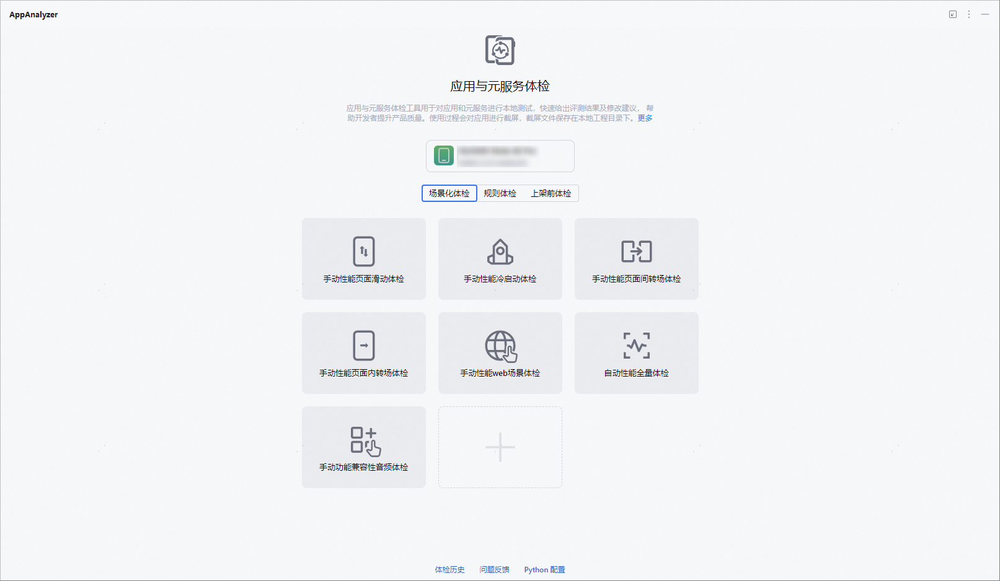
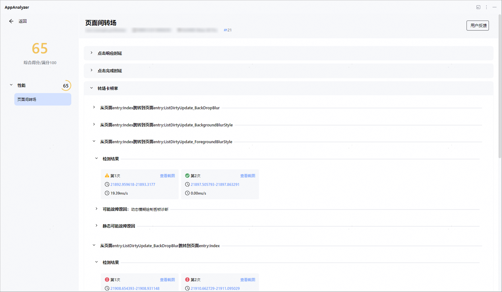
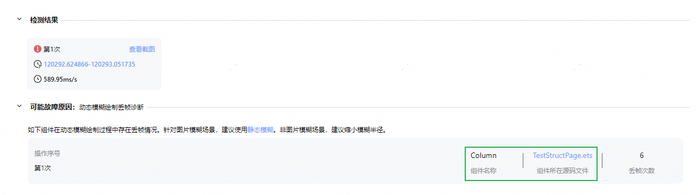
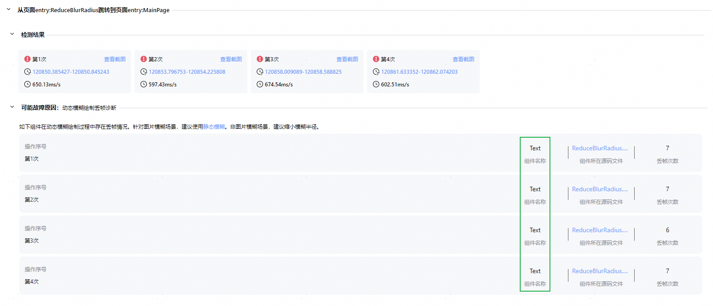

# 图像模糊卡顿问题分析

更新时间：2026-05-22 09:46:30

来源：https://developer.huawei.com/consumer/cn/doc/best-practices/bpta-analysis-of-image-blurring

#### 概述

在应用开发中，动态模糊效果虽然能够增强视觉体验，但不当使用（如对图片组件使用动态模糊、模糊半径过大等）可能导致性能问题，如图像卡顿、丢帧或渲染耗时增加等。这些问题不仅影响用户体验，还可能增加应用的功耗。通过合理优化代码逻辑，可有效降低渲染开销，提升用户体验。本文通过AppAnalyzer工具检测应用中存在的图像模糊卡顿问题，结合工具提示的故障原因，给出相应的优化解决方案，帮助开发者解决图像模糊性能问题。
 
 

#### 图像模糊卡顿问题检测和分析

开发者可以通过AppAnalyzer工具对应用的图像模糊性能进行检测，并根据检测报告中的建议进行优化，确保图像模糊性能达标。使用AppAnalyzer工具检测图像模糊性能的步骤如下：
 
1. 在DevEco Studio中启动AppAnalyzer工具，详细请参见[AppAnalyzer](https://developer.huawei.com/consumer/cn/doc/best-practices/bpta-performance-detection#section135451444171)。
2. 默认选择场景化体检，点击任一手动性能体检项（页面间转场、页面内转场、页面滑动）即可进入对应体检界面。本文以“手动性能页面间转场体检”为例进行说明。

  


3. 完成体检后，打开体检报告并点击展开“转场卡顿率”部分。如果检测结果显示黄色或红色警告，且提示“可能故障原因”为“动态模糊绘制丢帧诊断”，则表明存在图像模糊性能问题。

  


 
在检测出的图像模糊报告中，若“可能故障原因”为“动态模糊绘制丢帧诊断”，可参考以下两点建议进行优化：
 
- 建议对图片组件使用静态模糊
- 建议缩小模糊半径

 

#### 图像模糊卡顿问题优化方案

 

#### 对图片组件使用静态模糊

在使用动态模糊对图片组件进行处理时，若检测结果异常，动态模糊绘制过程中出现丢帧情况。建议改用静态模糊，以优化图片模糊性能。动态模糊与静态模糊的概念及使用场景，请参阅相关文档：[使用场景](https://developer.huawei.com/consumer/cn/doc/best-practices/bpta-fuzzy-scene-performance-optimization#section4945532519)。
 
 



 
例如，从检测报告中的可能故障原因中，点击组件所在源码文件，可跳转定位至TestStructPage.ets页面中的Column组件处。在示例代码中，使用了[blur](https://developer.huawei.com/consumer/cn/doc/harmonyos-references/ts-universal-attributes-image-effect#blur)动态模糊API对图片组件进行模糊处理，导致在检测中总耗时过长和丢帧。
 
**反例**
 
```text
Column() {
  Image($r('app.media.test'))
    .width('100%')
    .height('30%')
    .objectFit(ImageFit.Auto)
    .blur(13)
  // ...
}
```
 
**优化建议**
 
针对图片模糊场景，建议使用静态模糊。通过静态模糊和动态模糊性能[效果对比](https://developer.huawei.com/consumer/cn/doc/best-practices/bpta-fuzzy-scene-performance-optimization#section12488810070)，可以发现在模糊效果类似的条件下，静态模糊的性能要优于动态模糊。建议开发者在组件背景和内容无需实时更新的场景中，优先使用静态模糊，可以减少应用卡顿与丢帧，提升用户体验。
 
**正例**
 
```ArkTS
import { image } from '@kit.ImageKit';
import { effectKit } from '@kit.ArkGraphics2D';
import { window } from '@kit.ArkUI';
import { hilog } from '@kit.PerformanceAnalysisKit';
import { BusinessError } from '@kit.BasicServicesKit';

@Component
export struct StaticBlur {
  @Consume('navPathStack') navPathStack: NavPathStack;
  @State isShowStaticBlur: boolean = false;
  @State pixelMap: image.PixelMap | undefined = undefined;
  @State imgSource: image.ImageSource | undefined = undefined;
  @State bottomSafeHeight: number = 0; // bottom navigation bar height

  aboutToAppear(): void {
    window.getLastWindow(this.getUIContext().getHostContext()!, (err, windowBar) => {
      if (err.code) {
        return;
      }
      try {
        // get the height of the bottom navigation bar
        this.bottomSafeHeight =
          this.getUIContext()
            .px2vp(windowBar.getWindowAvoidArea(window.AvoidAreaType.TYPE_NAVIGATION_INDICATOR).bottomRect.height);
      } catch (error) {
        let err: BusinessError = error as BusinessError;
        hilog.warn(0x000, 'testTag', `getWindowAvoidArea failed, code=${err.code}, message=${err.message}`);
      }
      windowBar.setWindowLayoutFullScreen(true)
        .catch((err: BusinessError) => {
          hilog.error(0x000, 'testTag', `setWindowLayoutFullScreen failed, code=${err.code}, message=${err.message}`);
        })
    });
  }

  async staticBlur(): Promise<void> {
    let context: Context = this.getUIContext().getHostContext()!;
    await context.resourceManager.getRawFileContent('test.png') // retrieve images from the rawfile directory
      .then((fileData: Uint8Array) => {
        let buffer: ArrayBuffer = fileData.buffer.slice(0); // create an ArrayBuffer instance
        this.imgSource = image.createImageSource(buffer); // create an image source instance
      })
      .catch((err: BusinessError) => {
        hilog.error(0x000, 'testTag', `getRawFileContent failed, code=${err.code}, message=${err.message}`);
      })
    // create attributes for pixels
    let opts: image.InitializationOptions = {
      editable: true, // is it editable
      pixelFormat: 3, // pixel format. 3 represents RGBA_8888
      size: {
        // create image size
        height: 4,
        width: 6
      }
    };
    // create PixelMap
    await this.imgSource!.createPixelMap(opts).then((pixelMap: image.PixelMap) => {
      const blurRadius: number = 3;
      let headFilter: effectKit.Filter = effectKit.createEffect(pixelMap); // create Filter Instance
      if (headFilter !== null) {
        headFilter.blur(blurRadius); // set static blur. Add the blur effect to the effect list
        // retrieve the image of the source image with the added linked list effect PixelMap
        headFilter.getEffectPixelMap().then((pixelMap: image.PixelMap) => {
          this.pixelMap = pixelMap;
        });
      }
    })
  }

  @Builder
  staticBlurBuilder() {
    Stack({ alignContent: Alignment.Bottom }) {
      Image(this.pixelMap)
        .width('100%')
        .height('100%')
        .objectFit(ImageFit.Fill)
      Button('close')
        .width('90%')
        .height(40)
        .margin({ bottom: this.bottomSafeHeight + 16 })
        .onClick(() => {
          this.isShowStaticBlur = false;
        })
    }
    .width('100%')
    .height('100%')
  }

  build() {
    NavDestination() {
      Column() {
        Button('static blur')
          .width('90%')
          .height(40)
          .onClick(() => {
            this.isShowStaticBlur = true;
            // set static blur
            this.staticBlur();
          })
          .bindContentCover(this.isShowStaticBlur, this.staticBlurBuilder(), {
            modalTransition: ModalTransition.DEFAULT
          })
      }
      .padding({ bottom: this.bottomSafeHeight + 16 })
      .width('100%')
      .height('100%')
      .justifyContent(FlexAlign.End)
    }
    .hideTitleBar(true)
  }
}
```
 

#### 缩小模糊半径

在对非图片组件（如Text组件）或不适用静态模糊的场景（如Gif动图）使用模糊时，若检测结果显示动态模糊绘制时出现丢帧异常，可以考虑缩小模糊半径，以优化图片模糊性能。
 



 
例如，从检测报告中可能故障原因中，点击组件所在源码文件，可跳转定位至ReduceBlurRadius.ets页面中的Text组件处。在示例代码中，使用了[backdropBlur()](https://developer.huawei.com/consumer/cn/doc/harmonyos-references/ts-universal-attributes-background#backdropblur)对Text组件进行背景模糊，其模糊半径为2。
 
**反例**
 
```text
Text('Backdrop Blur')
  .padding(5)
  .width('90%')
  .height('50%')
  .fontSize(20)
  .fontColor(Color.White)
  .textAlign(TextAlign.Center)
  .backdropBlur(2) // Blurring radius is 2, detecting performance anomaly.
  .backgroundImage($r('app.media.test'))
  .backgroundImageSize({ width: '90%' })
  .backgroundImagePosition(Alignment.Center)
```
 
**优化建议**
 
非图片模糊场景，建议缩小模糊半径。动态模糊每帧需重新计算，通过缩小半径，可降低性能消耗。
 
**正例**
 
```ArkTS
Text('Backdrop Blur')
  .padding(5)
  .width('90%')
  .height('50%')
  .fontSize(20)
  .fontColor(Color.White)
  .textAlign(TextAlign.Center)
  .backdropBlur(0.2) // The blur radius is reduced to 0.2,the specific value depends on actual requirements.
  .backgroundImage($r('app.media.test')) // Here 'app.media.test' is just an example, developers should replace it with their own.
  .backgroundImageSize({ width: '90%' })
  .backgroundImagePosition(Alignment.Center)
```
  
| 模糊API | 模糊类型 | 优化建议 |
| --- | --- | --- |
| blur | 内容模糊 | 1、若是图片组件，建议使用静态模糊； 2、若是非图片组件或不适用静态模糊的场景，建议减小模糊半径； |
| backdropBlur | 背景模糊 | 1、若是图片组件，建议使用静态模糊； 2、若是非图片组件或不适用静态模糊的场景，建议减小模糊半径； |
| backgroundBlurStyle | 背景模糊 | 1、若是图片组件，建议使用静态模糊； 2、若是非图片组件或不适用静态模糊的场景，建议减小模糊半径； |
| foregroundBlurStyle | 内容模糊 | 1、若是图片组件，建议使用静态模糊； 2、若是非图片组件或不适用静态模糊的场景，建议减小模糊半径； |
| backgroundEffect | 背景模糊 | 1、若是图片组件，建议使用静态模糊； 2、若是非图片组件或不适用静态模糊的场景，建议减小模糊半径； |
 
 
 

#### 示例代码

- [背景模糊示例](https://gitcode.com/harmonyos_samples/BestPracticeSnippets/tree/master/BackgroundBlur)
