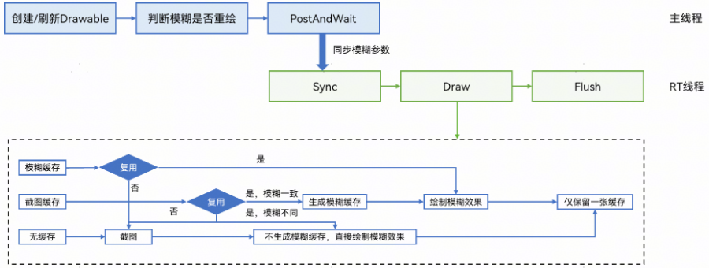
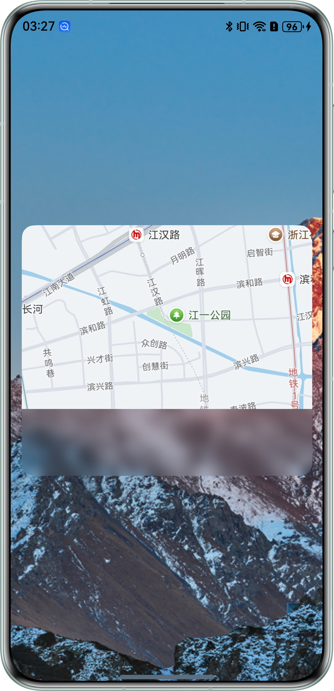
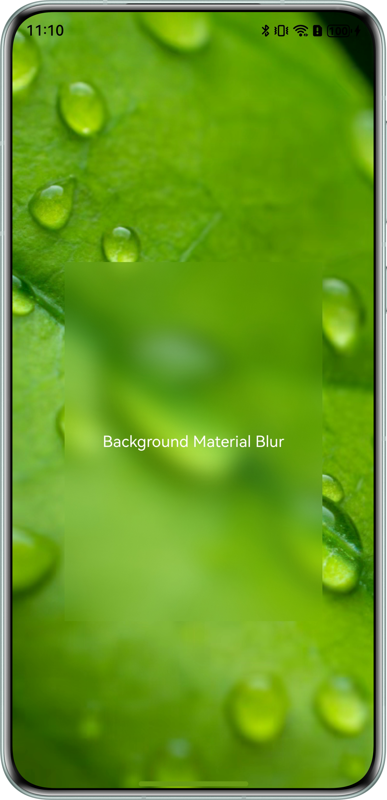
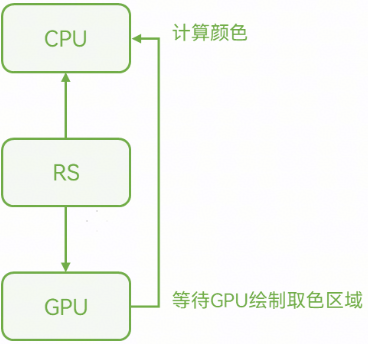
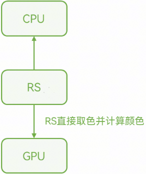
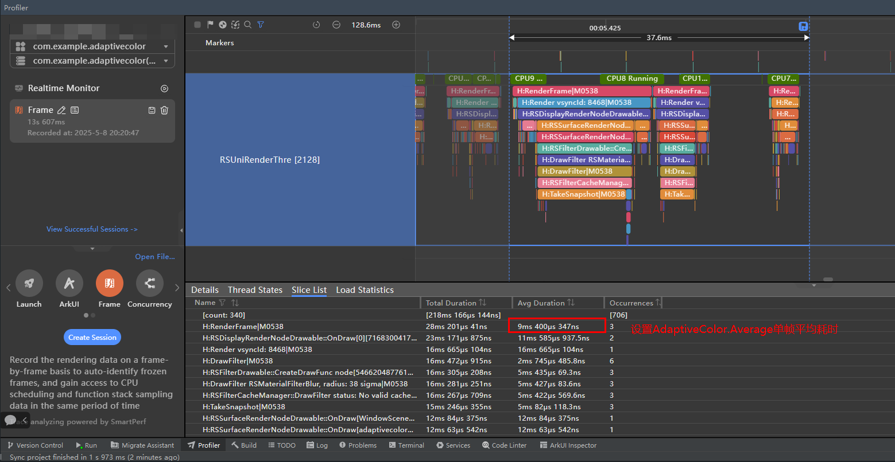
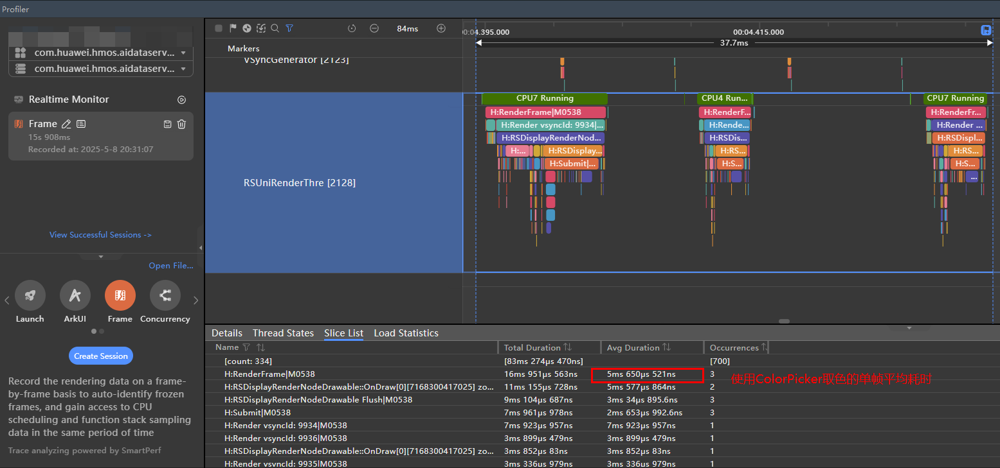
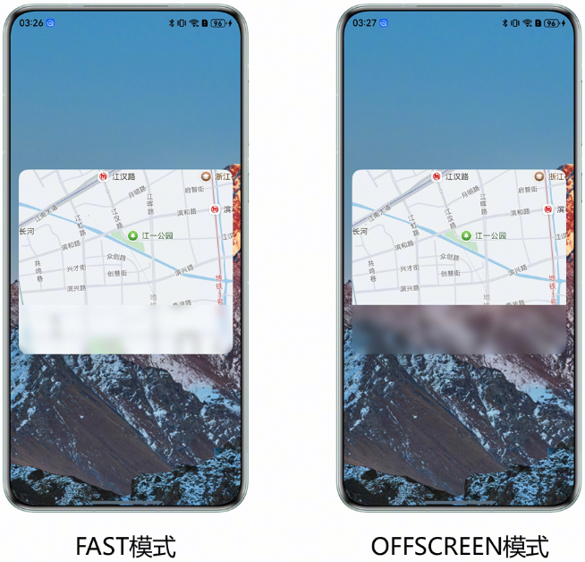
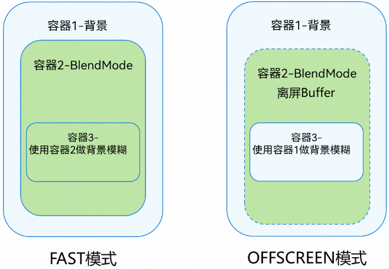
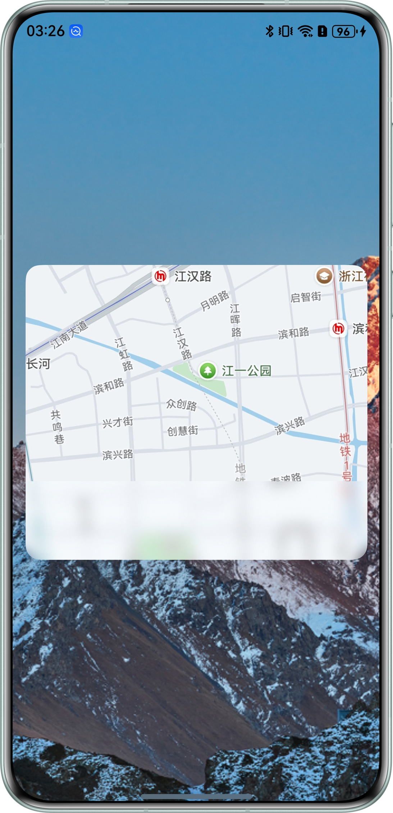

# 图像模糊高效使用

更新时间：2026-03-12 08:45:02

来源：https://developer.huawei.com/consumer/cn/doc/best-practices/bpta-background-blur

#### **概述**

在图像处理中，模糊效果（Blur Effect）是一种通过算法降低图像局部或整体的清晰度、减少细节或噪声的技术。模糊常用于突出主体、模拟景深、隐藏敏感信息或为后续处理（如边缘检测）做准备。
 
本文介绍的背景模糊属于动态模糊，根据效果区分为材质模糊和普通模糊。背景模糊在实际应用中应用场景广泛，例如：在包含多个卡片的页面中，应用背景模糊效果可突出层次感；在页面转场时，添加背景模糊能使过渡更加平滑。为进一步提升效果，系统通过使用缓存技术优化动态模糊的性能。本文旨在探讨背景模糊技术的高效应用方法，结合应用场景进行说明。
  
| 层次类型 | 效果分类 | 接口 | 使用说明 |
| 背景模糊 | 材质模糊 | .backgroundBlurStyle() | 通过枚举值的方式封装了不同的模糊半径、亮度、饱和度、蒙版颜色。 适用场景：通过设置枚举值来使用系统已经封装好的效果。 |
| 背景模糊 | .backgroundEffect() | 材质模糊 | 可以自定义模糊半径、亮度、饱和度、蒙版颜色、取色方式以及灰阶参数。 适用场景：用户需要自定义效果的场景。 |
| 背景模糊 | 普通模糊 | .backdropBlur() | 仅能设置模糊半径和灰阶参数。 适用场景：仅需设置模糊半径的场景，如：页面转场。 |
 
 
 

#### **实现原理**

 

#### **系统渲染工作流程**


 
**RenderService (RS) ：**系统渲染服务进程，接收来自于其他系统服务进程（如桌面进程）及用户进程（如应用）的自渲染图层及ArkUI控件绘制指令，进行统一的组合以及渲染控制。其渲染动作会调用CPU/GPU等通用计算器件进行。
 
 

#### **RS模糊缓存工作流程**




 
**RenderThread (RT) ：**渲染线程，RS进程划分为主线程和RT线程，RT线程负责接收各种渲染参数，渲染各种图像效果并上屏。
 
基本逻辑：根据需要创建或者刷新Drawable，同步模糊参数；做模糊先截图（生成截图的缓存），再做模糊（生成模糊的缓存），最多存在一份缓存（截图或者模糊结果）。
 
（1）主线程：创建/刷新Drawable；判断模糊是否重绘：模糊区域改变、模糊参数改变、是否与脏区相交；同步模糊参数。
 
（2）RT线程：如缓存有效则复用缓存，否则RT线程重做模糊，并重新缓存。
 
 

#### **合理使用背景模糊的取色方式**

 

#### **场景描述**

如果需要设置背景模糊的蒙版颜色，有两种取色方式可以选择，这里推荐使用ColorPicker取色方式，性能更优。
 
**效果图**
 



 
 

#### **实现原理**

如果要设置背景模糊的蒙版颜色，有如下两种取色方式：
 
（1）方式1：直接设置AdaptiveColor.AVERAGE取色。此方式需要RS在CPU计算阶段，先用GPU绘制一遍取色区域，然后再计算区域平均颜色值。优点：开发方式简单，适合轻负载应用使用。缺点：性能较低。
 



 
（2）方式2：创建ColorPicker取色。此方式先使用EffectKit接口创建ColorPicker进行取色，再赋值给模糊参数中的color属性。优点：由于绘制取色区域的过程在应用层进行，所以性能有所提升，适合静态模糊场景。
 



 
 

#### **开发步骤**

 
**方式1：设置背景模糊的接口参数adaptiveColor为AdaptiveColor.AVERAGE**
 
对背景图片应用backgroundEffect接口设置模糊效果，设置adaptiveColor属性值为AdaptiveColor.AVERAGE。
 
**示例代码**
 
```ArkTS
@Component
export struct AdaptiveColorMode {
  @Consume('navPathStack') navPathStack: NavPathStack;

  build() {
    NavDestination() {
      Column() {
        Flex({ alignItems: ItemAlign.Center, justifyContent: FlexAlign.Center }) {
          Text('Background Material Blur').fontColor('#FFFFFF')
        }
        .height('50%')
        .width('70%')
        // just set the parameter adaptiveColor
        .backgroundEffect({
          radius: 20,
          saturation: 1.0,
          brightness: 1.0,
          adaptiveColor: AdaptiveColor.AVERAGE
        })
        .position({ x: '15%', y: '30%' })
      }
      .height('100%')
      .width('100%')
      .backgroundImage($r('app.media.test'))
      .backgroundImageSize(ImageSize.Cover)
      .expandSafeArea([SafeAreaType.SYSTEM], [SafeAreaEdge.TOP, SafeAreaEdge.BOTTOM])
    }
    .hideTitleBar(true)
  }
}
```
 
**方式2：先使用ColorPicker进行取色，再给模糊接口的color参数赋值**
 
传入图片资源，创建pixMap，根据pixMap创建ColorPicker，调用ColorPicker的getAverageColor()方法获取颜色，转换成backgroundEffect接口参数color的格式，调用接口时替换成获取到的blurColor。
 
**示例代码**
 
```ArkTS
import { image } from '@kit.ImageKit';
import { effectKit } from '@kit.ArkGraphics2D';

@Component
export struct ColorPickerMode {
  @Consume('navPathStack') navPathStack: NavPathStack;
  @State pixMap: image.PixelMap | null = null
  @State kitColor: effectKit.Color = {
    red: 255,
    green: 255,
    blue: 255,
    alpha: 255
  };
  @State blurColor: string = 'rgba(255,255,255,255)';

  async blurPix(resource: Resource) {
    try {
      const context: Context = this.getUIContext().getHostContext()!;
      const fileData: Uint8Array = await context.resourceManager.getMediaContent(resource.id);
      const buffer: ArrayBufferLike = fileData.buffer
      let imageSource: image.ImageSource = image.createImageSource(buffer as ArrayBuffer)
      this.pixMap = await imageSource.createPixelMap();
      // create a color picker for color extraction
      this.kitColor = (await effectKit.createColorPicker(this.pixMap, [0, 0, 1, 1])).getAverageColor();
      // convert to the format of the blur interface color parameter
      this.blurColor = 'rgba(' + this.kitColor.red + ',' + this.kitColor.green + ',' + this.kitColor.blue + ',0)';
    } catch (err) {
    }
  }

  build() {
    NavDestination() {
      Column() {
        Flex({ alignItems: ItemAlign.Center, justifyContent: FlexAlign.Center }) {
          Text('Background Material Blur').fontColor('#FFFFFF')
        }
        .height('50%')
        .width('70%')
        // assign a value to the color parameter of a blur interface
        .backgroundEffect({
          radius: 20,
          saturation: 1.0,
          brightness: 1.0,
          color: this.blurColor
        })
        .position({ x: '15%', y: '30%' })
      }
      .height('100%')
      .width('100%')
      .backgroundImage($r('app.media.test'))
      .backgroundImageSize(ImageSize.Cover)
      .onAppear(() => {
        // import image resources
        this.blurPix($r('app.media.test'));
      })
      .expandSafeArea([SafeAreaType.SYSTEM], [SafeAreaEdge.TOP, SafeAreaEdge.BOTTOM])
    }
    .hideTitleBar(true)
  }
}
```
 
**性能对比**
 
测试使用两种取色方式绘制背景模糊效果的单帧渲染耗时，最终使用DevEco Studio内置的Profiler中的帧率分析工具Frame抓取绘制背景模糊时的性能差异。
 



 



 
如上图所示，通过RenderFrame（执行GPU绘制）标签可以看出，使用ColorPicker取色的单帧平均耗时为5.650ms；而直接设置背景模糊的接口参数为AdaptiveColor.Average的单帧平均耗时为9.400ms。
 

#### **在背景模糊场景正确使用混合模式**

 

#### **场景描述**

如果需要在背景模糊场景使用混合模式，需要结合实际场景选择合适的混合模式，才能得到预期的效果。以下是同一场景下使用两种不同的方式实现的效果图：
 



 
 

#### **实现原理**

**BlendMode****（混合模式）：**这是一种图形处理技术，用于控制两个或多个图层（或图形元素）在叠加时如何混合颜色。它决定了上层像素与下层像素的交互方式，从而产生不同的视觉效果。
 
BlendMode的类型有两种：一种是FAST类型，另一种是OFFSCREEN类型。FAST类型使各个图层的效果按顺序进行混合，而OFFSCREEN类型使用离屏画布，组件内容先绘制到离屏画布上，然后再整体进行混合。
 
因此当场景中同时存在BlendMode和背景模糊时，需要注意BlendMode的类型。BlendMode设置为OFFSCREEN类型时使用离屏画布进行绘制，而模糊处理过程需要对背景进行截图，如果离屏画布未完成绘制，模糊流程已经进行了对背景的截图并绘制，那么绘制结果可能是非预期的。
 
两种类型的差异见下图：
 



 
 

#### **开发步骤**

如果想得到最底层是背景图片，其上是地图，在地图上叠加模糊的效果，应使用FAST方式。
 
**预期效果图**
 



 
 
设置blendMode为FAST类型使各个图层的效果按顺序进行混合，所以可以实现预期的效果。
 
**示例代码**
 
```ArkTS
@Component
export struct FastMode {
  @Consume('navPathStack') navPathStack: NavPathStack;

  build() {
    NavDestination() {
      Stack() {
        Stack() {
          Image($r('app.media.map')).width('100%').height('100%').borderRadius(15)
          Flex({ direction: FlexDirection.ColumnReverse }) {
          }
          .height(80)
          .backgroundBlurStyle(BlurStyle.COMPONENT_ULTRA_THIN, { scale: 0.3 })
          .flexShrink(0)
          .width('100%')
          .padding(0)
          .borderRadius({
            topLeft: 0,
            topRight: 0,
            bottomLeft: 15,
            bottomRight: 15
          })
          .position({ x: 0, y: 220 })
        }.margin({ left: '16', right: '16' })
        .height(300)
        .borderRadius(15)
        // blend mode is set to fast mode
        .blendMode(BlendMode.SRC_OVER, BlendApplyType.FAST)
      }
      .width('100%')
      .height('100%')
      .backgroundImage($r('app.media.img'))
      .backgroundImageSize(ImageSize.Cover)
      .expandSafeArea([SafeAreaType.SYSTEM], [SafeAreaEdge.TOP, SafeAreaEdge.BOTTOM])
    }
    .hideTitleBar(true)
  }
}
```
 
**非预期效果图**
 
如果使用OFFSCREEN方式，将得到非预期的效果：背景模糊对背景图片进行模糊，而后与地图的图层进行效果混合。
 



 
设置blendMode为OFFSCREEN类型会创建离屏画布，而模糊处理过程需要对背景进行截图，当离屏画布未完成绘制回到屏幕上时，模糊流程已经进行了背景的截图并绘制，所以混合后的效果非预期。
 
**示例代码**
 
```ArkTS
@Component
export struct OffscreenMode {
  @Consume('navPathStack') navPathStack: NavPathStack;

  build() {
    NavDestination() {
      Stack() {
        Stack() {
          Image($r('app.media.map')).width('100%').height('100%').borderRadius(15)
          Flex({ direction: FlexDirection.ColumnReverse }) {
          }
          .height(80)
          .backgroundBlurStyle(BlurStyle.COMPONENT_ULTRA_THIN, { scale: 0.3 })
          .flexShrink(0)
          .width('100%')
          .padding(0)
          .borderRadius({
            topLeft: 0,
            topRight: 0,
            bottomLeft: 15,
            bottomRight: 15
          })
          .position({ x: 0, y: 220 })
        }.margin({ left: '16', right: '16' })
        .height(300)
        .borderRadius(15)
        // blend mode is set to offscreen mode
        .blendMode(BlendMode.SRC_OVER, BlendApplyType.OFFSCREEN)
      }
      .width('100%')
      .height('100%')
      .backgroundImage($r('app.media.img'))
      .backgroundImageSize(ImageSize.Cover)
      .expandSafeArea([SafeAreaType.SYSTEM], [SafeAreaEdge.TOP, SafeAreaEdge.BOTTOM])
    }
    .hideTitleBar(true)
  }
}
```
 

#### **总结**

本文针对系统的背景模糊特性，深度解析其技术原理与实现机制，并基于不同应用场景提出高效实施方案。在涉及取色功能的开发场景中，建议开发者通过性能开销和视觉效果的量化评估，选择最优实现方案；对于需要使用混合模式进行上下层图层混合的场景，开发者应当结合混合模式和背景模糊的工作原理，选择合适的混合类型。
 
 

#### **示例代码**

- [高效使用背景模糊开发实践](https://gitcode.com/harmonyos_samples/BestPracticeSnippets/tree/master/BackgroundBlur)
