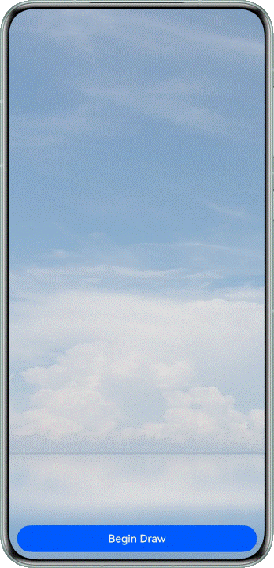
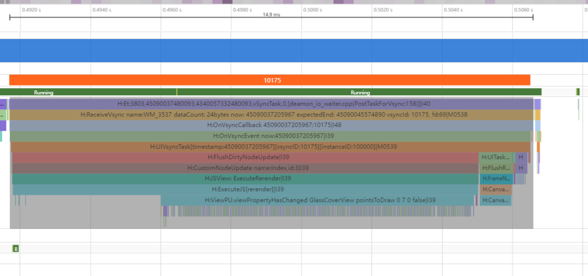
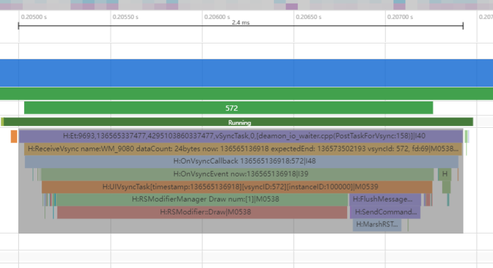

# Drawing自绘制性能提升

更新时间：2026-04-13 06:22:00

来源：https://developer.huawei.com/consumer/cn/doc/best-practices/bpta-drawing-capability-improve-performance

##### 概述

[Canvas](https://developer.huawei.com/consumer/cn/doc/harmonyos-references/ts-components-canvas-canvas)画布组件是用来显示自绘内容的组件，它具有保留历史绘制内容、增量绘制的特点。Canvas有[CanvasRenderingContext2D](https://developer.huawei.com/consumer/cn/doc/harmonyos-references/ts-canvasrenderingcontext2d)/[OffscreenCanvasRenderingContext2D](https://developer.huawei.com/consumer/cn/doc/harmonyos-references/ts-offscreencanvasrenderingcontext2d)和[DrawingRenderingContext](https://developer.huawei.com/consumer/cn/doc/harmonyos-references/ts-drawingrenderingcontext)两套API，应用使用两套绘制API绘制的内容都可以在绑定的Canvas组件上显示。其中CanvasRenderingContext2D按照W3C标准封装了Native Drawing接口，可以方便快速复用Web应用的绘制逻辑，因此非常适用于Web应用和游戏、快速原型设计、数据可视化、在线绘图板、教学工具或创意应用等场景。
 
为了遵循W3C标准，实现过程中进行了多层的封装，涉及一些数据结构的转换，不如原生API那样接近硬件，因此对于性能要求比较高、绘制比较复杂，或者硬件依赖性比较强的场景（如高性能游戏开发、专业图形处理软件、桌面或移动应用等），使用Canvas CanvasRenderingContext2D绘制会存在一定的卡顿、掉帧等性能问题，此时可以直接使用Native Drawing接口自绘制替代Canvas CanvasRenderingContext2D绘制来提升绘制性能。
  
| 方案 | 适用场景 | 特点 |
| 使用Canvas CanvasRenderingContext2D | Web应用和游戏、快速原型设计、数据可视化、在线绘图板、教学工具、创意应用 | 场景简单、跨平台、快捷灵活、兼容性强、开发维护成本低、性能要求低。 |
| 使用Native Drawing | 高性能游戏开发、专业图形处理软件、桌面或移动应用开发 | 场景复杂、资源管理精细、硬件依赖强、与平台深度集成、定制化、性能要求高。 |
 
 
 

##### 原理机制

由于Canvas CanvasRenderingContext2D绘制本质上是对Native Drawing接口的封装，相对于直接使用Native Drawing接口，Canvas CanvasRenderingContext2D在实现过程中进行了多层的封装，涉及一些数据结构的转换。如果图片绘制比较复杂，执行的绘制指令可能会成倍数的增长，进而绘制性能下降的更加严重，导致卡顿、掉帧等问题。下面以实现在背景图上绘制1000个透明空心圆的玻璃效果来对比两者的性能差异。
 
 

##### 场景示例

下图是一个绘制1000个透明空心圆与背景图融合的绘制场景，下面分别使用Canvas CanvasRenderingContext2D和Native侧的Drawing来实现该场景，并分析两者的性能差异。
 



 
 

##### 使用Canvas CanvasRenderingContext2D绘制

 
Canvas CanvasRenderingContext2D使用[globalCompositeOperation](https://developer.huawei.com/consumer/cn/doc/harmonyos-references/ts-canvasrenderingcontext2d#globalcompositeoperation)属性来实现各种图层混合模式，此处将该属性的值设置为destination-out来实现透明空心圆。具体实现步骤如下：
 1. 使用自定义组件GlassCoverView来实现透明圆圈。在首页点击"Begin Draw"按钮，随机生成1000个0-1的位置列表。
```ArkTS
import GlassCoverView from './GlassCoverView';

@Entry
@Component
struct Index {
  @State pointsToDraw: number[][] = [];

  /**
   * Make a list of 1000 0-1 positions and draw circles at the corresponding positions
   */
  startDraw(): void {
    this.pointsToDraw = [];
    for (let index = 0; index < 1000; index++) {
      this.pointsToDraw.push([Math.random(), Math.random()]);
    }
  }

  build() {
    Stack() {
      Image($r('app.media.layered_image'))
        .width('100%')
        .height('100%')
      // Transparent circle custom component, in which 1000 transparent circles are drawn
      GlassCoverView({ pointsToDraw: this.pointsToDraw })
        .width('100%')
        .height('100%')
      Row() {
        Button('Begin Draw')
          .width('100%')
          .height(40)
      }
      .padding({
        right: 16,
        bottom: 16,
        left: 16
      })
      .onClick(() => {
        this.startDraw();
      })
    }
    .alignContent(Alignment.Bottom)
    .width('100%')
    .height('100%')
  }
}
```

2. GlassCoverView子页面使用@Watch装饰器，监控到首页位置列表数据pointsToDraw更新后，在页面上绘制1000个透明空心圆圈（具体参见 onDraw()方法）。
```ArkTS
import { hilog, hiTraceMeter } from '@kit.PerformanceAnalysisKit';

const DOMAIN = 0x0000;
const TAG = 'GlassCoverView';
const FORMAT = '%{public}s';

/**
 * Glass cladding effect
 */
@Preview
@Component
export default struct GlassCoverView {
  @Prop @Watch('onDraw') pointsToDraw: number[][] = [];
  private settings = new RenderingContextSettings(true);
  private renderContext = new CanvasRenderingContext2D(this.settings);
  private viewWidth: number = 0;
  private viewHeight: number = 0;

  build() {
    Stack() {
      Canvas(this.renderContext)
        .width('100%')
        .height('100%')
        .onAreaChange((_: Area, newValue: Area) => {
          this.handleAreaChange(newValue);
        })
    }
    .height('100%')
    .width('100%')
  }

  private handleAreaChange(area: Area): void {
    this.viewWidth = parseInt(area.width.toString());
    this.viewHeight = parseInt(area.height.toString());
    this.onDraw();
  }

  private onDraw(): void {
    const canvas = this.renderContext;
    canvas.reset();
    if (canvas === undefined) {
      return;
    }
    // Hollow transparent circle
    hiTraceMeter.startTrace('slow', 1);
    hilog.info(DOMAIN, TAG, FORMAT, 'debug: slow start');
    // Save drawing context
    canvas.save();
    // Clears the specified pixel within the given rectangle
    canvas.clearRect(0, 0, this.viewWidth, this.viewHeight);
    // Specifies the fill color of the drawing
    canvas.fillStyle = '#77CCCCCC';
    // Fill a rectangle
    canvas.fillRect(0, 0, this.viewWidth, this.viewHeight);
    // Draw a hollow circle
    canvas.globalCompositeOperation = 'destination-out';
    canvas.fillStyle = '#CCCCCC';
    this.pointsToDraw.forEach((xy: number[]) => {
      this.drawOneCell(canvas, xy[0] * this.viewWidth, xy[1] * this.viewHeight, this.getUIContext().px2vp(15));
    })
    canvas.fill();
    // Restore the saved drawing context
    canvas.restore();
    hilog.info(DOMAIN, TAG, FORMAT, 'debug: slow end');
    hiTraceMeter.finishTrace('slow', 1);
  }

  /**
   * Draw a circle according to the specified position and width
   */
  private drawOneCell(canvas: CanvasRenderer, x: number, y: number, width: number): void {
    canvas.moveTo(x + width, y);
    canvas.arc(x, y, width, 0, Math.PI * 2);
  }
}
```
 使用Canvas CanvasRenderingContext2D绘制的trace图，可以看到绘制1000个圆圈耗时14.9毫秒。

  


 

##### 使用Native侧Drawing绘制

Native Drawing主要使用分层接口[OH_Drawing_CanvasSaveLayer()](https://developer.huawei.com/consumer/cn/doc/harmonyos-references/capi-drawing-canvas-h#oh_drawing_canvassavelayer)和融合接口[OH_Drawing_BrushSetBlendMode()](https://developer.huawei.com/consumer/cn/doc/harmonyos-references/capi-drawing-brush-h#oh_drawing_brushsetblendmode)来实现多图融合效果。通过在前端创建一个自绘制节点[RenderNode](https://developer.huawei.com/consumer/cn/doc/harmonyos-references/js-apis-arkui-rendernode)，并将图形绘制上下文及背景图参数通过Native侧暴露的接口传入，由Native使用相应Drawing接口进行绘制。具体实现步骤如下：
 
1. 前端定义一个[RenderNode](https://developer.huawei.com/consumer/cn/doc/harmonyos-references/js-apis-arkui-rendernode)自绘制渲染节点，将背景图this.pMap及图形绘制上下文context传入Native，调用Native侧的nativeOnDraw接口进行绘制。
```ArkTS
// entry\src\main\ets\pages\Index.ets
// Define a RenderNode self-drawing RenderNode MyRenderNode, so as to draw with the interface of Native
class MyRenderNode extends RenderNode {
  private drawType: DrawType = DrawType.NONE;
  private pMap: image.PixelMap | undefined = undefined; // background image

  draw(context: DrawContext): void {
    // Call the Native onDraw interface on the native side to draw, and pass in the background image this.pMap and the graphic drawing context as parameters
    testNapi.nativeOnDraw(666, context, uiContext?.vp2px(this.size.width), uiContext?.vp2px(this.size.height),
      this.drawType, this.pMap);
  }

  // Set the drawing type
  resetType(type: DrawType): void {
    this.drawType = type;
  }

  // Set the background picture
  setPixelMap(p: PixelMap): void {
    this.pMap = p;
  }
}
```
 新建一个自绘制渲染节点，并定义一个[NodeController](https://developer.huawei.com/consumer/cn/doc/harmonyos-references/js-apis-arkui-nodecontroller)，对该节点进行管理。

  
```ArkTS
// entry\src\main\ets\pages\Index.ets
// Create a MyRenderNode object
const newNode = new MyRenderNode();
// Defines the size and location of the newNode
newNode.frame = {
  x: 0,
  y: 0,
  width: 980,
  height: 1280
};

// Mount the MyRenderNode object node on the NodeContainer
class MyNodeController extends NodeController {
  private rootNode: FrameNode | null = null;

  makeNode(uiContext: UIContext): FrameNode | null {
    this.rootNode = new FrameNode(uiContext);
    if (this.rootNode === null) {
      return null;
    }
    const renderNode = this.rootNode.getRenderNode();
    if (renderNode !== null) {
      renderNode.appendChild(newNode);
    }
    return this.rootNode;
  }
}
```

2. 在页面中将自绘制节点挂载到[NodeContainer](https://developer.huawei.com/consumer/cn/doc/harmonyos-references/ts-basic-components-nodecontainer)上。
```ArkTS
// entry\src\main\ets\pages\Index.ets
@Entry
@Component
struct Index {
  private myNodeController: MyNodeController = new MyNodeController();

  aboutToAppear(): void {
    const context: Context = this.getUIContext().getHostContext()!;
    const resourceMgr: resourceManager.ResourceManager = context.resourceManager;
    resourceMgr.getRawFileContent('drawImage.jpg').then((fileData: Uint8Array) => {
      hilog.info(DOMAIN, TAG, FORMAT, `success in getRawFileContent`);
      const buffer = fileData.buffer.slice(0);
      const imageSource: image.ImageSource = image.createImageSource(buffer);
      imageSource.createPixelMap().then((pMap: image.PixelMap) => {
        // Self-drawing rendering node background map
        newNode.setPixelMap(pMap);
      }).catch((err: BusinessError) => {
        hilog.error(DOMAIN, TAG, FORMAT, `fail to create PixelMap, error code: ${err.code}, message: ${err.message}.`);
      }).catch((err: BusinessError) => {
        hilog.error(DOMAIN, TAG, FORMAT,
          `fail to getRawFileContent, error code: ${err.code}, message: ${err.message}.`);
      });
    }).catch((err: BusinessError) => {
      hilog.error(DOMAIN, TAG, FORMAT,
        `callback getRawFileContent failed, error code: ${err.code}, message: ${err.message}.`);
    });
  }

  build() {
    Stack() {
      // Mount the self-drawn rendering node to NodeContainer
      NodeContainer(this.myNodeController)
        .height('100%')
      Row() {
        Button('Begin Draw')
          .width('100%')
          .height(40)
          .onClick(() => {
            newNode.resetType(DrawType.IMAGE);
            newNode.invalidate();
          })
      }
      .padding({
        right: 16,
        bottom: 16,
        left: 16
      })
    }
    .alignContent(Alignment.Bottom)
    .width('100%')
    .height('100%')
  }
}
```

3. Native侧暴露绘制接口nativeOnDraw()供前端调用，该接口绑定Native侧的OnDraw()函数，ArkTS传入的参数在该函数中处理。
```cpp
// entry\src\main\cpp\native_bridge.cpp
EXTERN_C_START
static napi_value Init(napi_env env, napi_value exports) {
    napi_property_descriptor desc[] = {
        // Expose the NativeOnDraw interface for the front-end to call and bind the native OnDraw function
        {"nativeOnDraw", nullptr, OnDraw, nullptr, nullptr, nullptr, napi_default, nullptr}};
    napi_define_properties(env, exports, sizeof(desc) / sizeof(desc[0]), desc);
    return exports;
}
EXTERN_C_END
```

4. 在OnDraw()函数中接收前端传入的参数，主要是图形绘制上下文与背景图。
```cpp
// entry\src\main\cpp\native_bridge.cpp
static napi_value OnDraw(napi_env env, napi_callback_info info) {
    size_t argc = 6;
    napi_value args[6] = {nullptr};

    napi_get_cb_info(env, info, &argc, args, nullptr, nullptr);

    int32_t id;
    napi_get_value_int32(env, args[0], &id);

    // Graphic drawing context parameters
    void *temp = nullptr;
    napi_unwrap(env, args[1], &temp);
    OH_Drawing_Canvas *canvas = reinterpret_cast<OH_Drawing_Canvas *>(temp);

    int32_t width;
    napi_get_value_int32(env, args[2], &width);

    int32_t height;
    napi_get_value_int32(env, args[3], &height);

    DRAWING_LOGI("OnDraw, width:%{public}d, height:%{public}d", width, height);
    int32_t drawOption;
    napi_get_value_int32(env, args[4], &drawOption);
    // Background image parameters
    NativePixelMap *nativePixelMap = OH_PixelMap_InitNativePixelMap(env, args[5]);
    if (drawOption == IMAGE) {
        // Call the fusion drawing interface to draw
        NativeOnDrawPixelMap(canvas, nativePixelMap);
    }
    return nullptr;
}
```

5. 在NativeOnDrawPixelMap函数中实现透明圆圈绘制（主要使用[OH_Drawing_CanvasSaveLayer()](https://developer.huawei.com/consumer/cn/doc/harmonyos-references/capi-drawing-canvas-h#oh_drawing_canvassavelayer)分层接口及 [OH_Drawing_BrushSetBlendMode()](https://developer.huawei.com/consumer/cn/doc/harmonyos-references/capi-drawing-brush-h#oh_drawing_brushsetblendmode)融合接口得到图形融合效果）。
```cpp
// entry\src\main\cpp\native_bridge.cpp
enum DrawType { NONE, PATH, TEXT, IMAGE };
#define DRAW_MAX_NUM 1000 // Maximum number of drawn circles

// Generate random coordinates
static int RangedRand(int range_min, int range_max) {
    int r = ((double)rand() / RAND_MAX) * (range_max - range_min) + range_min;
    return r;
}

void DrawCircle(OH_Drawing_Path *path, int x, int y, int width) {
    OH_Drawing_PathMoveTo(path, x + width, y);
    OH_Drawing_Rect *rect = OH_Drawing_RectCreate(x - width, y - width, x + width, y + width);
    OH_Drawing_PathAddArc(path, rect, 0, 360);
}

// Scene draw by fusion of hollow circle and background image
static void NativeOnDrawPixelMap(OH_Drawing_Canvas *canvas, NativePixelMap *nativeMap) {
    // Draw a background picture
    OH_Drawing_CanvasSave(canvas);
    OH_Drawing_PixelMap *pixelMap = OH_Drawing_PixelMapGetFromNativePixelMap(nativeMap);
    // Create a sampling option object
    OH_Drawing_SamplingOptions *sampling = OH_Drawing_SamplingOptionsCreate(FILTER_MODE_NEAREST, MIPMAP_MODE_NONE);
    // Acquiring a background image drawing area
    OH_Drawing_Rect *src = OH_Drawing_RectCreate(0, 0, 360, 693);
    // Create a render area
    OH_Drawing_Rect *dst = OH_Drawing_RectCreate(0, 0, 1300, 2800);
    // Create a brush
    OH_Drawing_Brush *brush = OH_Drawing_BrushCreate();
    OH_Drawing_CanvasAttachBrush(canvas, brush);
    // Render the background image to the designated area of the canvas.
    OH_Drawing_CanvasDrawPixelMapRect(canvas, pixelMap, src, dst, sampling);
    OH_Drawing_CanvasDetachBrush(canvas);

    // Call hierarchical interface
    OH_Drawing_CanvasSaveLayer(canvas, dst, brush);

    // Painting mask layer
    OH_Drawing_Rect *rect2 = OH_Drawing_RectCreate(0, 0, 1300, 2800);
    OH_Drawing_Brush *brush2 = OH_Drawing_BrushCreate();
    // Set the brush color
    OH_Drawing_BrushSetColor(brush2, OH_Drawing_ColorSetArgb(0x77, 0xCC, 0xCC, 0xCC));
    OH_Drawing_CanvasAttachBrush(canvas, brush2);
    OH_Drawing_CanvasDrawRect(canvas, rect2);
    OH_Drawing_CanvasDetachBrush(canvas);

    OH_Drawing_Point *point = OH_Drawing_PointCreate(800, 1750);
    OH_Drawing_Brush *brush3 = OH_Drawing_BrushCreate();
    // Set the brush and blending mode of the circle.
    OH_Drawing_BrushSetBlendMode(brush3, BLEND_MODE_DST_OUT);
    OH_Drawing_CanvasAttachBrush(canvas, brush3);
    // Circle
    OH_Drawing_Path *path = OH_Drawing_PathCreate();
    int x = 0;
    int y = 0;
    for (int i = 0; i < DRAW_MAX_NUM; i++) {
        x = RangedRand(0, 1300);
        y = RangedRand(0, 2800);
        DrawCircle(path, x, y, 15);
    }
    OH_Drawing_CanvasDrawPath(canvas, path);

    // Destroy the object
    OH_Drawing_CanvasDetachBrush(canvas);
    OH_Drawing_RectDestroy(rect2);
    OH_Drawing_BrushDestroy(brush2);
    OH_Drawing_BrushDestroy(brush3);
    OH_Drawing_PointDestroy(point);
    OH_Drawing_BrushDestroy(brush);
    OH_Drawing_CanvasRestore(canvas);
    OH_Drawing_SamplingOptionsDestroy(sampling);
    OH_Drawing_RectDestroy(src);
    OH_Drawing_RectDestroy(dst);
    OH_Drawing_PathDestroy(path);
    OH_Drawing_PixelMapDissolve(pixelMap);
}
```
 使用Native侧Drawing绘制trace图，可以看到绘制1000个圆圈耗时2.4毫秒，相较于Canvas CanvasRenderingContext2D绘制有较大的性能提升。

  


 

##### 效果对比
 
| 方案 | 圆圈数量 | 耗时 |
| Canvas CanvasRenderingContext2D 画透明圈 | 1000 | 14.9毫秒 |
| Native Drawing画透明圈 | 1000 | 2.4毫秒 |
 
 
通过上述对比可以发现，在实现较大数量透明空心圆这样的复杂的绘制场景，相比于Canvas CanvasRenderingContext2D，使用Native [Drawing](https://developer.huawei.com/consumer/cn/doc/harmonyos-references/capi-drawing-canvas-h)可以得到明显的性能提升。以上只是实现透明空心圆融合场景，针对实心圆及其他融合场景（如[globalCompositeOperation](https://developer.huawei.com/consumer/cn/doc/harmonyos-references/ts-canvasrenderingcontext2d#globalcompositeoperation)属性的其他值），由于实现机制的不同，绘制指令数量也存在差异，从而性能数据会存在一些差异。实际应用中，可以根据实际情况，在对性能要求不高的情况采用Canvas CanvasRenderingContext2D，如果对性能要求比较高，建议使用Native [Drawing](https://developer.huawei.com/consumer/cn/doc/harmonyos-references/capi-drawing-canvas-h)进行绘制。
 
 

##### 示例代码

- [Drawing自绘制性能提升](https://gitcode.com/harmonyos_samples/BestPracticeSnippets/tree/master/NdkDrawing)
