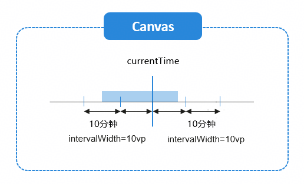
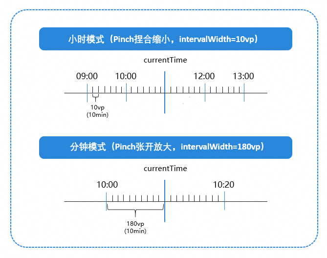

# 基于Canvas实现录像回放时间轴

更新时间：2026-03-12 08:45:02

来源：https://developer.huawei.com/consumer/cn/doc/best-practices/bpta-implement-timeline-based-on-canvas

**   


#### **概述**

在安防监控、车载回放等场景中，录像回放是核心功能。用户通过滑动时间轴，查看不同时间节点的历史视频。本文基于Canvas绘图能力和视频组件，提供功能完备的录像回放时间轴解决方案，封装了[核心组件TimeBarView](https://gitcode.com/harmonyos_samples/timebar/blob/master/time_bar/src/main/ets/components/TimeBarView.ets)，助力开发者快速实现时间轴功能。该组件集成了时间轴绘制、单指滑动浏览、双指缩放切换时间粒度等功能。
 

 
本文主要介绍如何实现TimeBarView时间轴组件，并结合“滑动时间轴控制视频播放”的核心场景，阐述TimeBarView组件的使用方法。
 

 
TimeBarView时间轴组件提供以下核心功能：
 
- 支持自定义时间轴样式，可配置刻度线、中间指示线、视频区域的外观（如颜色、尺寸、位置）。
- 支持双指缩放以调整时间刻度精度，单指滑动以定位至目标时间点。
- 支持设置时间轴当前进度。
- 支持基于时间轴组件的二次自定义绘制。

 
 

#### **实现原理**

 

#### 关键技术

TimeBarView组件采用分层绘制，依次为刻度线、中间线、视频区域及顶层自定义绘制区域。通过滑动和缩放手势事件，实时更新状态并触发时间轴重绘。详细实现参考本章[开发流程](#section42461138131619)。
 
刻度线绘制主要将时间戳转换为Canvas像素坐标。例如，开发者自定义刻度间隔的宽度为intervalWidth（如intervalWidth = 10vp），相同长度的时间间隔对应10分钟，实现“固定时间对应固定像素”的精准映射，确保任意时间戳均能通过公式计算出唯一的画布坐标。
 
图1 **时间-像素映射示意图**


 
 

#### 开发流程
1. 绘制时间轴
- 时间刻度绘制**计算基本参数**

  
scaleNum属性：表示当前画布上需绘制的时间间隔数量。viewWidth属性表示时间轴画布的总宽度，intervalWidth属性表示每个时间格子在画布上占用的宽度（intervalWidth值为自定义，例如组件内为10vp/格）。加2是为了预留左右两边的额外格子，避免滚动或缩放时边缘出现空白。

2. middleLineDuration属性：计算画布左半部分对应的实际时间。

3. leftTime：表示画布最左侧边缘对应的实际时间戳（毫秒）。

4. 中间指示线绘制中间线是时间轴上的当前时间标记，固定在画布中央，用于标识当前选中或播放的时间点。

  
```ArkTS
/** Draw middle indicator line at canvas center. */
private drawMiddleLine() {
  this.context.beginPath();
  this.context.moveTo(this.context.width / 2, 0);
  this.context.lineTo(this.context.width / 2, this.middleIndicatorOption.length);
  this.context.strokeStyle = this.middleIndicatorOption.fillColor;
  this.context.lineWidth = 2;
  this.context.stroke();
}
```


5. 视频区域绘制**获取图片pixelMap对象**

  视频区域用于显示视频片段的时间分布（如录制片段、有效视频区间），采用离屏预渲染，避免滑动缩放时重复计算绘制。

  
预渲染时机：当视频片段数据timeRange变化时（通过@Watch('onTimeRangeChange')监听），执行预渲染。

6. 预渲染规则：使用[OffscreenCanvasRenderingContext2D](https://developer.huawei.com/consumer/cn/doc/harmonyos-references/ts-offscreencanvasrenderingcontext2d)构造离屏Canvas画布对象offPaint，按1vp等于1分钟的比例绘制所有视频片段，调用offPaint.getPixelMap()方法生成videoPixelMap像素图。
- 滑动时间轴滑动功能允许用户通过单指拖拽浏览时间轴，核心逻辑如下：

  
手势监听：通过PanGesture()回调监听手指按下、移动、抬起事件。
- 灵敏度控制：当累计位移（_panResidual）超过灵敏度阈值（MOVE_SENSITIVE）时，将其作为有效位移（effectiveDelta ）处理，避免手指轻微抖动触发频繁更新。
- 边界限制：通过clampToBounds()方法限制滑动范围，防止滑动至无数据区域。
- 回调通知：滑动过程中实时触发onMoveScaleCallback()回调，通知外部当前选中时间。
- 帧同步合并渲染：将一帧内的多次重绘请求合并为一次，确保每次重绘均在新帧开始时执行。重绘的scheduleRedraw()方法基于DisplaySync实现帧同步刷新。

 
将有效位移（effectiveDelta）通过刻度密度（intervalWidth）属性转换为时间偏移量，更新时间轴当前时间（_currentTime属性），同步至TimeBarModel组件控制器，供外部获取。调用scheduleRedraw()方法，延迟绘制至下一帧，减少频繁绘制引起的性能消耗，确保滑动过程的视觉流畅性。
 
```ArkTS
// Capture raw delta for accumulation.
const rawDelta = event.offsetX - this._touchDownPosition;
this._touchDownPosition = event.offsetX;

// Accumulate sub-pixel movement for smoother tracking.
this._panResidual += rawDelta;
if (Math.abs(this._panResidual) < this.MOVE_SENSITIVE) {
  return;
}

const effectiveDelta = this._panResidual;
this._panResidual = 0;

// Update middle-line time, then clamp into [min, max]
const nextTime = this._currentTime - (effectiveDelta * (TimeMsUnit.TEN_MINUTE / this.intervalWidth));
this._currentTime = this.clampToBounds(nextTime);

this.model.currentTime = this._currentTime;

// Redraw and notify
this.scheduleRedraw(); // Defer redraw to next frame for smoother visuals.
this._onTimeBarMoveListener?.onMoveScaleCallback(this._currentTime, PlayStatus.PLAYING);
```
 

 - 缩放时间轴缩放功能允许通过双指捏合/张开切换时间粒度。核心逻辑如下：

  
手势监听：通过PinchGesture()回调监听双指缩放事件。
- 缩放因子过滤：设置scaleChange > 0.1，避免微小缩放动作触发频繁更新。
- intervalWidth调整：缩放时修改intervalWidth属性（10分钟对应的像素宽度），放大时增加，缩小时减少。
- 模式切换：根据intervalWidth阈值切换显示模式（小时/分钟）。
intervalWidth < 60：小时模式（10分钟/刻度，6个刻度 = 1小时）。
- 60≤intervalWidth < 180：分钟模式（1分钟/细分刻度）。
- intervalWidth ≥ 180：最大缩放限制，锁定分钟模式。

 - 边界限制：设置最小（10vp）和最大（180vp）缩放阈值，避免过度缩放。

 
图2 **缩放时间轴示意图**


 
```ArkTS
// Update per-division width
if (this.zoomSize > 1) {
  this.intervalWidth += 10;
} else {
  this.intervalWidth -= 10;
}

// Switch modes and enforce bounds
if (this.intervalWidth < 60) {
  this.divisorMode = ScaleMode.MODE_HOUR;
  if (this.intervalWidth < 10) {
    this.intervalWidth = 10;
  }
} else if (this.intervalWidth < 180) {
  this.divisorMode = ScaleMode.MODE_MINUTE;
} else {
  this.divisorMode = ScaleMode.MODE_MINUTE;
  this.intervalWidth = 180;
}
```
 

 - 数据驱动交互为实现时间轴组件与外部（如视频控制器）的数据联动，构建了TimeBarModel类。TimeBarModel封装了时间轴的两个核心数据：timeRange（视频片段集合）和currentTime（当前时间戳）。

  
timeRange：当外部传入录像片段时，自动对timeRange排序并计算有效时间边界（minTime/maxTime），确保时间轴仅显示有录像的时段。
```ArkTS
set timeRange(segments: RecordSegment[]) {
  if (!segments || segments.length === 0) {
    this._timeRange = [];
    this.updateTimeBounds();
    this.notifyDataChange('timeRange');
    return;
  }

  const segArr: RecordSegment[] = [...segments];

  segArr.sort((a, b) => {
    const ta = parseTimeString(a.beginTime).getTime();
    const tb = parseTimeString(b.beginTime).getTime();
    return ta - tb;
  });

  this._timeRange = [...segArr];

  // Update time bounds (min/max time)
  this.updateTimeBounds();
  // Ensure current time stays within valid bounds
  this.currentTime = this.clampToBounds(this._currentTime);
  // Notify external listeners of the data change
  this.notifyDataChange('timeRange');
}
```

- currentTime：通过getter和setter机制实现双向同步，既接收外部视频播放进度的更新，也在时间轴滑动时将最新时间输出给外部。
```ArkTS
set currentTime(time: number) {
  if (!Number.isFinite(time) || time <= 0) {
    return;
  } // ignore invalid time values

  const clampedTime = this.clampToBounds(time);
  if (this._currentTime === clampedTime) {
    return;
  } // do not trigger update if time hasn't changed

  this._currentTime = clampedTime;
  this.notifyDataChange('currentTime');
}
```

- 数据变更通知：通过onDataChange()回调，监听timeRange和currentTime的变化，简化了开发者调用。
```ArkTS
private notifyDataChange(type: 'timeRange' | 'currentTime') {
  this._onDataChange && this._onDataChange(type);
}
```


 
 
 

#### 时间轴控制视频播放场景

 

#### 场景描述

TimeBarView时间轴与视频播放联动，滑动时间轴可快速定位至目标录像片段。
 
滑动停止时，若时间轴中线对应的时间点在录像片段有效时间内，视频立即跳转并继续播放；若处于两端录像间的空白区域，系统自动跳转至最近的录像起始时间点，避免无画面时段，提高效率。时间轴滑动存在硬性边界限制，用户试图将时间轴向右滑动至所有录像片段的最末端（即最新一段录像的结束时间）时，将无法继续拖动，防止超出录像数据范围导致播放异常。
 
图3 **效果图


 
 

#### 开发步骤
1. 引入TimeBarView时间轴组件创建TimeBarModel实例作为数据载体，实例对象viewModel通过组件参数传入TimeBarView时间轴组件，即可渲染基本的时间轴。核心代码如下：

  
```ArkTS
import {
  TimeBarView,
  TimeBarModel,
  // ...
} from '@samples/time_bar';
// ...
@Component
struct TimeBarVideoLinkage {
  // ...
  private viewModel: TimeBarModel = new TimeBarModel();
  // ...
  build() {
    NavDestination() {
      Row() {
        // ...
          Column() {
            TimeBarView({
              model: this.viewModel,
              // ...
            })
          }
          // ...
      }
      .height('100%')
      .alignItems(VerticalAlign.Top)
    }
    .title($r('app.string.route_title2'))
  }
}
```


  
> [!NOTE]
> TimeBarView组件属性参考： TimeBarView 接口信息 。

2. 时间轴展示视频区域开发者处理视频片段，生成RecordSegment类型的集合。通过viewModel对象的timeRange属性传递给组件，在时间轴上即可绘制视频区域。核心代码如下：

  
```ArkTS
async getTimeInfoFromVideo() {
  if (this.videosInfo.length === 0) {
    try {
      this.videosInfo = await extractOnlineVideosInfo(LEGITIMATE_VIDEO_URLS);
    } catch (e) {
      this.videosInfo = [];
    }
  }
  // ...
  const fileInfoList: Array<RecordSegment> = [];
  const initialTimeISO = getTodayStartMs();

  // Generate segments aligned to the time bar (including gaps)
  this.videosInfo.forEach((curInfo, index) => {
    const seg = new RecordSegment();

    const startOffset = this.timelineOffsets[index] || 0;
    const durMs = Number(curInfo.duration) || 0;

    seg.beginTime = dayjs(initialTimeISO).add(startOffset, 'millisecond').format(MILLISECOND_FORMAT);
    seg.endTime = dayjs(initialTimeISO).add(startOffset + durMs, 'millisecond').format(MILLISECOND_FORMAT);

    fileInfoList.push(seg)
  });
  this.viewModel.timeRange = fileInfoList;
}
```


  
> [!NOTE]
> 可向TimeBarView组件传递videoAreaOption属性，以修改时间区域的背景色及在时间轴垂直方向的位置；传递timeScaleOption属性，以修改时间轴刻度的长度、颜色及对齐方式。

3. 绑定时间轴事件监听器，同步时间状态在onContextReady()回调中，获取TimeBarView实例并绑定setTimeBarMoveListener()方法，监听时间轴滑动事件，实时同步当前选中时间（curTime）与操作状态（timeBarStatus）。核心代码如下：

  
```ArkTS
private handleContextReady = (_ctx: CanvasRenderingContext2D, component: TimeBarView) => {
  this.timeBarRef = component;
  this.timeBarRef.setTimeBarMoveListener({
    onMoveScaleCallback: (curTime: number, status?: PlayStatus) => {
      this.currentTime = curTime;
      this.timeBarStatus = status;
    }
  })
}
```


  
```ArkTS
Column() {
  TimeBarView({
    model: this.viewModel,
    onContextReady: this.handleContextReady
  })
}
```


  
> [!NOTE]
> onMoveScaleCallback()回调会在时间轴开始滑动（START）、滑动过程中（PLAYING）、松手后（STOP）触发，curTime为时间轴中间线对应的绝对时间戳，是视频跳转的核心依据。

4. 实现时间同步逻辑，处理视频跳转时间轴滑动时，通过@Watch监听currentTime属性变化，处理视频跳转逻辑。

  
- 有效区域滑动：拖动时间轴至某段视频内，松手后视频精准跳转至对应时间并播放。

5. 空白区域滑动：拖动至两段视频的空白间隔，视频自动跳转至下一段视频的起始位置。

6. 边界滑动：拖动至视频范围最右侧（最后一段视频结束时间），时间轴无法继续右滑，视频停留在最后一帧。
计算目标视频位置（时间映射与边界处理）从时间轴拖动的currentTime（选中时间）出发，通过“时间偏移计算→片段定位→进度校正”，确定视频需跳转的目标进度。核心代码如下：

  
```ArkTS
const totalTimelineMs = this.totalTimelineMs || 0;
const rawOffset = (this.curTime ?? this.initialTime) - this.initialTime; // relative offset (ms)
const clampedOffset = clamp(rawOffset, 0, totalTimelineMs);

// Resolve segment index (including gaps) and derive target segment window
const info = findSegmentIndexByTimeline(this.timelineOffsets ?? [], this.videosInfo, clampedOffset);
const prevIndex = this.curIndex;
const nextIndex = info.index !== -1 ? info.index : prevIndex;

// Start time and duration of the target segment
const segStartMs = this.timelineOffsets?.[nextIndex] ?? 0;
const segDurMs = Number(this.videosInfo[nextIndex]?.duration) || 0;

// Whether dragged to the "absolute end"
const playEnd = (nextIndex === this.videosInfo.length - 1) && (clampedOffset === totalTimelineMs);

// Compute the preview/target progress inside the segment (seconds)
const videoProgressSec = this.computeProgressSeconds(clampedOffset, segStartMs, segDurMs, info, playEnd);

const prevSrc = this.videoSrcArray[prevIndex] ?? '';
const nextSrc = this.videoSrcArray[nextIndex] ?? '';
const indexChanged = nextIndex !== prevIndex;
const willReload = indexChanged && nextSrc !== prevSrc;

// Decide whether player source must reload (URL change) and apply index switch side-effects
this.decideAndApplyIndexChange(indexChanged, willReload, nextIndex, segStartMs);
```


7. 执行视频跳转与播放控制根据视频进度属性（目标进度）videoProgressSec，结合视频加载状态执行跳转，并控制播放行为。核心代码如下：

  
```ArkTS
private performSeek(videoProgressSec: number, willReload: boolean) {
  if (willReload) {
    // Source will reload: cache and let onPrepared execute precise seek
    this.pendingSeekSec = videoProgressSec;
    return;
  }

  // No reload (or no segment change): attempt immediate precise seek
  if (this.durationTime === 0) {
    // Duration is not available yet: still cache the seek
    this.pendingSeekSec = videoProgressSec;
  } else {
    this.controller.setCurrentTime(videoProgressSec, SeekMode.Accurate);
  }
}
```


 
 
 

#### 常见问题

 

#### **canvas画的时间轴，在手势捏合缩放时画面不停闪烁，是否有解决方案**

在Canvas画布进行缩放操作时，尤其是在处理手势缩放时，可能会出现画面闪烁的问题。这是由于缩放操作导致画布上的图形重新计算和绘制，引起视觉上的闪烁效果。为减少这种现象，可采取以下方法：设置临界点，在手势捏合持续回调中，不是每次移动都重新绘制图形，而是设定特定条件，当满足这些条件时才重新绘制。例如，可检查手势移动的距离，当移动超过特定阈值时才更新画面。
 
```text
if (Math.abs(offsetX - this.lastOffsetX) < 0.5 && Math.abs(offsetY - this.lastOffsetY) < 0.5) {
    return;
}
this.lastOffsetX = offsetX;
```
 
此段代码表示仅当X轴与Y轴的位移均超过0.5时，才更新画布，从而减少不必要的重绘。
 
 

#### 示例代码

- [实现可缩放时间轴功能](https://gitcode.com/harmonyos_samples/timebar)
