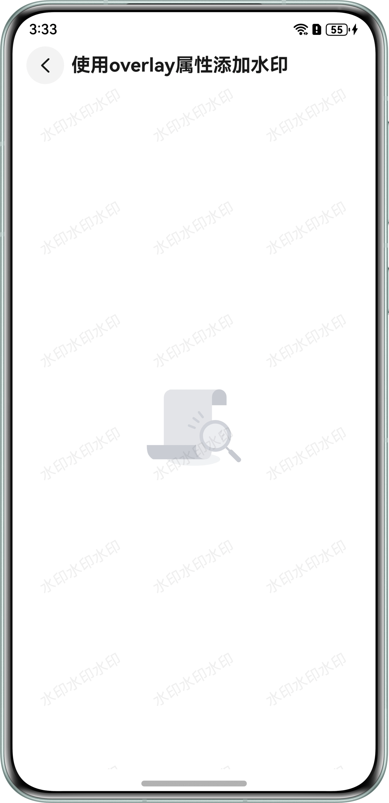
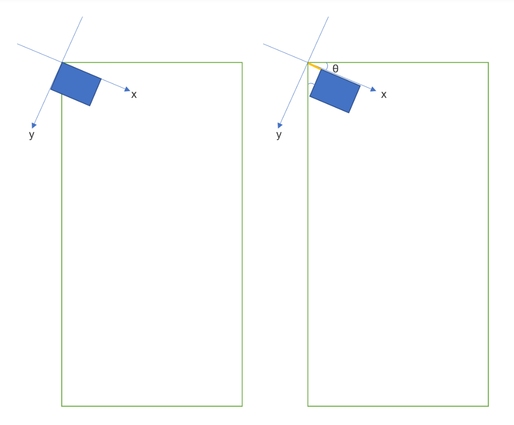
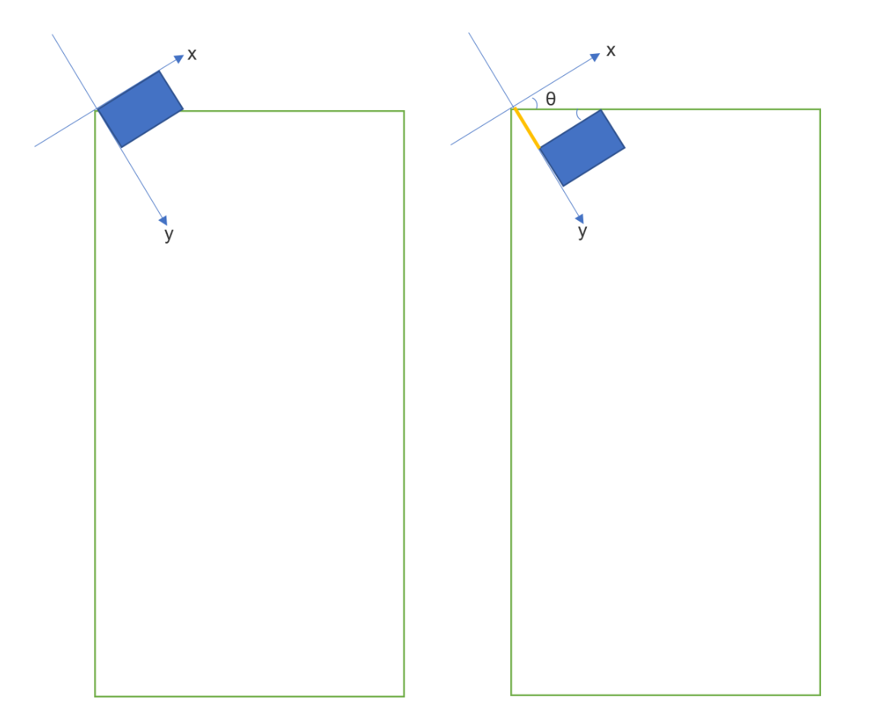
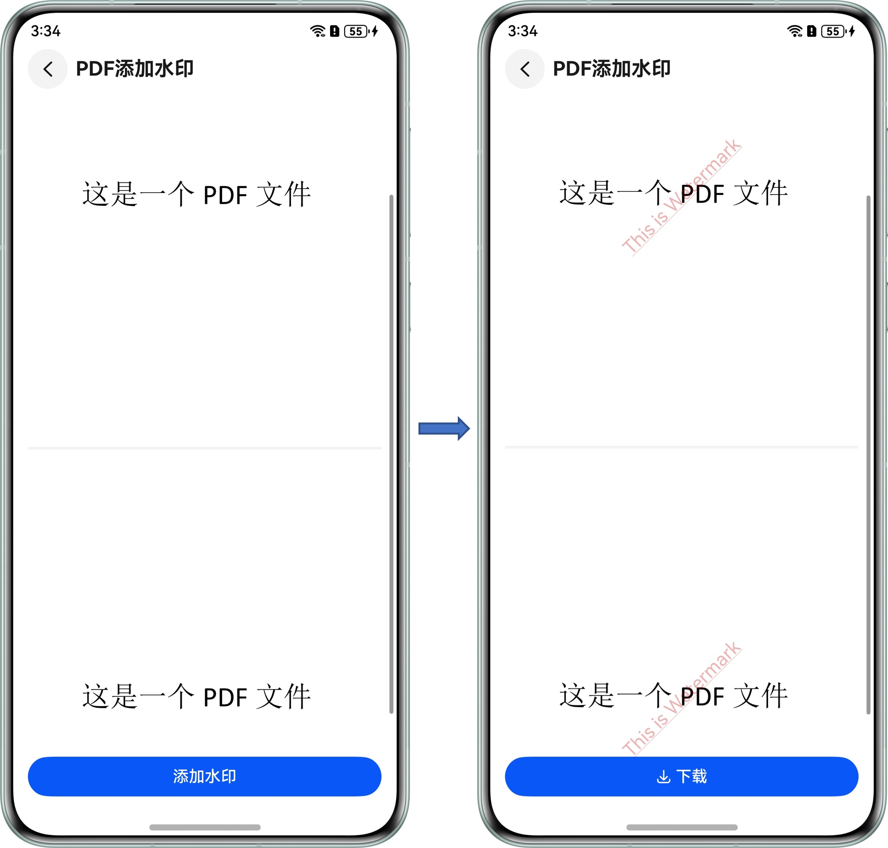
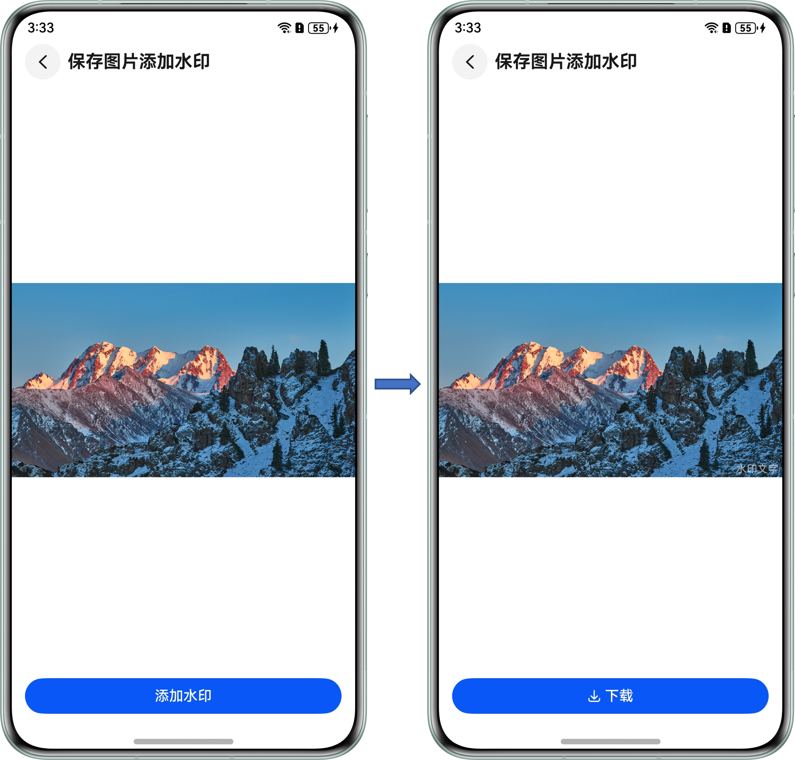

# 水印添加

更新时间：2026-05-18 00:55:31

来源：https://developer.huawei.com/consumer/cn/doc/best-practices/bpta-add-watermark

#### 概述

在软件开发中，水印是一种在应用页面、图片或文档中嵌入的标记，它通常采用文字或图案的形式展现。水印通常有以下用途：
 
- 标识来源：可用于标识应用、各种文件的来源或作者，确保产权的归属。
- 版权保护：可携带版权保护信息，有效防止他人篡改、盗用、非法复制。
- 艺术效果：可作为一种艺术效果，为图片或应用增添独特的风格。

 
本文通过图文与代码结合的方式，对以下几种常见的水印添加场景进行讲解，旨在让开发者理解水印添加的基本原理以及掌握开发的流程与细节。
 
- [页面上添加水印](#section12388834480)
- [图片上添加水印](#section987311343125)
- [PDF文档添加水印](#section7418171112138)

 
 

#### 页面上添加水印

 

#### 场景描述

某个页面背景上添加水印文字，实现效果图如下。
 



 
 

#### 实现原理

**关键技术**
 
[Canvas](https://developer.huawei.com/consumer/cn/doc/harmonyos-references/ts-components-canvas-canvas)提供画布组件，用于自定义绘制图形。使用[CanvasRenderingContext2D](https://developer.huawei.com/consumer/cn/doc/harmonyos-references/ts-canvasrenderingcontext2d)对象在[Canvas](https://developer.huawei.com/consumer/cn/doc/harmonyos-references/ts-components-canvas-canvas)组件上进行绘制，其中[fillText()](https://developer.huawei.com/consumer/cn/doc/harmonyos-references/ts-canvasrenderingcontext2d#filltext)方法用于绘制文本，[drawImage()](https://developer.huawei.com/consumer/cn/doc/harmonyos-references/ts-canvasrenderingcontext2d#drawimage)方法用于图像绘制。
 
**开发流程**
 1. 创建[Canvas](https://developer.huawei.com/consumer/cn/doc/harmonyos-references/ts-components-canvas-canvas)画布，在画布上绘制水印。
2. 使用[Stack](https://developer.huawei.com/consumer/cn/doc/harmonyos-references/ts-container-stack)组件或[浮层overlay](https://developer.huawei.com/consumer/cn/doc/harmonyos-references/ts-universal-attributes-overlay#overlay)属性，将画布与UI页面组件融合显示。
 
 

#### 开发步骤
1. 封装水印组件
- 创建Canvas组件，监听[Canvas.onReady](https://developer.huawei.com/consumer/cn/doc/harmonyos-references/ts-components-canvas-canvas#事件)事件，该事件回调在Canvas组件初始化完成时或大小变化时执行，在回调中进行水印绘制draw()方法的执行。并通过设置Canvas组件的[hitTestBehavior](https://developer.huawei.com/consumer/cn/doc/harmonyos-references/ts-universal-attributes-hit-test-behavior#hittestbehavior)属性，使水印组件不影响其他组件的触摸测试，让页面能正常交互。
```ArkTS
@Component
export struct Watermark {
  private settings: RenderingContextSettings = new RenderingContextSettings(true);
  private context: CanvasRenderingContext2D = new CanvasRenderingContext2D(this.settings);
  // ...
  build() {
    Canvas(this.context)
      .width('100%')
      .height('100%')
      .hitTestBehavior(HitTestMode.Transparent)
      .onReady(() => this.draw())
  }
}
```


2. 实现绘制水印draw()方法。绘制的起点默认为坐标轴的原点（画布的左上角），通过坐标轴的平移及旋转，实现在画布的不同位置、不同角度绘制水印。如果水印有一定旋转角度，想保证第一个水印能完整显示，需要对绘制的起点做平移，平移距离通过旋转角度及水印宽高计算。
旋转角度大于0，由下图可知，水印沿x轴方向平移距离positionX = tan(θ) * 水印高度，即绘制起点为(positionX, 0)。



3. 旋转角度小于0，由下图可知，水印沿y轴方向平移距离positionY = tan(θ) * 水印宽度，即绘制起点为(0, positionY)。


- 将水印组件与UI页面组件融合显示。方式一：使用Stack将水印组件叠加在UI组件上层。

  
```ArkTS
Stack({ alignContent: Alignment.Center }) {
  Column() {
    Image($r('app.media.empty'))
      .width(110)
      .height(88)
      // ...
  }
  Watermark({ rotationAngle: 20 })
}
```
 方式二：设置UI组件的overlay属性，使水印组件作为UI组件的浮层显示。注意watermarkBuilder中嵌套了一层父元素Column，所以需要同时设置Column的[hitTestBehavior](https://developer.huawei.com/consumer/cn/doc/harmonyos-references/ts-universal-attributes-hit-test-behavior#hittestbehavior)属性，使浮层下方页面能正常交互。

  
```ArkTS
@Builder
watermarkBuilder() {
  Column() {
    Watermark()
  }
  .hitTestBehavior(HitTestMode.Transparent)
}
build() {
  // ...
    Column() {
      Image($r('app.media.empty'))
        .width(110)
        .height(88)
        // ...
    }
    .justifyContent(FlexAlign.Center)
    .alignItems(HorizontalAlign.Center)
    .layoutWeight(1)
    .overlay(this.watermarkBuilder())
    // ...
}
```


 
> [!NOTE]
> 如果需要多个页面或应用全局添加水印，可将上述方式二中的watermarkBuilder封装到一个单独的文件，export出一个全局的watermarkBuilder。在需要添加水印页面的根节点上添加.overlay绑定watermarkBuilder即可。

 
 

#### 图片上添加水印

 

#### 场景描述

保存的图片、拍照生成的图片等场景，需要添加水印。实现效果图如下。
 



 
 

#### 实现原理

**关键技术**
 
[OffscreenCanvas](https://developer.huawei.com/consumer/cn/doc/harmonyos-references/ts-components-offscreencanvas)提供离屏画布，与[Canvas](https://developer.huawei.com/consumer/cn/doc/harmonyos-references/ts-components-canvas-canvas)使用场景区别在于是否需要将画布渲染在屏幕上。使用[OffscreenCanvasRenderingContext2D](https://developer.huawei.com/consumer/cn/doc/harmonyos-references/ts-offscreencanvasrenderingcontext2d)在[OffscreenCanvas](https://developer.huawei.com/consumer/cn/doc/harmonyos-references/ts-components-offscreencanvas)上进行离屏绘制，其中[fillText()](https://developer.huawei.com/consumer/cn/doc/harmonyos-references/ts-offscreencanvasrenderingcontext2d#filltext)方法用于绘制文本，[drawImage()](https://developer.huawei.com/consumer/cn/doc/harmonyos-references/ts-offscreencanvasrenderingcontext2d#drawimage)方法用于图像绘制。
 
**开发流程**
 1. 解析图片得到pixelMap数据。
2. 创建与图片宽高一致的[OffscreenCanvas](https://developer.huawei.com/consumer/cn/doc/harmonyos-references/ts-components-offscreencanvas)离屏画布。
3. 将图片和水印依次绘制到离屏画布上。
4. 获取离屏画布的pixelMap数据。
5. 将pixelMap数据写入文件中。
 
 

#### 开发步骤
1. 解析图片得到pixelMap数据。
- 使用[resourceManager.getMediaContent()](https://developer.huawei.com/consumer/cn/doc/harmonyos-references/js-apis-resource-manager#getmediacontent9-1)方法获取图片内容，得到ArrayBuffer数据。使用[image.createImageSource(buf: ArrayBuffer)](https://developer.huawei.com/consumer/cn/doc/harmonyos-references/arkts-apis-image-f#imagecreateimagesource9-2)方法创建图片源实例。
> [!NOTE]
> ImagePixelMap为自定义类型：{ pixelMap: image.PixelMap, width: number, height: number }。


  
```ArkTS
async getImagePixelMap(resource: Resource): Promise<ImagePixelMap | undefined> {
  let result: ImagePixelMap | undefined = undefined;
  try {
    const data: Uint8Array =
      await this.getUIContext().getHostContext()?.resourceManager.getMediaContent(resource.id) as Uint8Array;
    const arrayBuffer: ArrayBuffer = data.buffer.slice(data.byteOffset, data.byteLength + data.byteOffset);
    const imageSource: image.ImageSource = image.createImageSource(arrayBuffer);
    result = await imageSource2PixelMap(imageSource);
  } catch (e) {
    let err = e as BusinessError;
    hilog.error(0x0000, TAG, `failed code=${err.code}, message=${err.message}`);
  }
  return result;
}
```


2. 使用[ImageSource.getImageInfo()](https://developer.huawei.com/consumer/cn/doc/harmonyos-references/arkts-apis-image-imagesource#getimageinfo-2)方法获取图片宽、高信息，使用[ImageSource.createPixelMap()](https://developer.huawei.com/consumer/cn/doc/harmonyos-references/arkts-apis-image-imagesource#createpixelmap7)方法创建PixelMap对象。
```ArkTS
export async function imageSource2PixelMap(imageSource: image.ImageSource): Promise<ImagePixelMap> {
  const imageInfo: image.ImageInfo = await imageSource.getImageInfo();
  const height = imageInfo.size.height;
  const width = imageInfo.size.width;
  const options: image.DecodingOptions = {
    editable: true,
    desiredSize: { height, width }
  };
  const pixelMap: PixelMap = await imageSource.createPixelMap(options);
  const result: ImagePixelMap = { pixelMap, width, height };
  return result;
}
```

- 通过[OffscreenCanvas](https://developer.huawei.com/consumer/cn/doc/harmonyos-references/ts-components-offscreencanvas)离屏画布绘制图片及水印，得到融合水印后的pixelMap数据。1. 创建与图片宽高一致的[OffscreenCanvas](https://developer.huawei.com/consumer/cn/doc/harmonyos-references/ts-components-offscreencanvas)离屏画布，这里注意单位保持一致。

2. 使用[OffscreenCanvasRenderingContext2D.drawImage()](https://developer.huawei.com/consumer/cn/doc/harmonyos-references/ts-offscreencanvasrenderingcontext2d#drawimage)将图片绘制到离屏画布上。

3. 使用[OffscreenCanvasRenderingContext2D.fillText()](https://developer.huawei.com/consumer/cn/doc/harmonyos-references/ts-offscreencanvasrenderingcontext2d#filltext)将水印绘制在离屏画布的指定位置。

4. 使用[OffscreenCanvasRenderingContext2D.getPixelMap()](https://developer.huawei.com/consumer/cn/doc/harmonyos-references/ts-offscreencanvasrenderingcontext2d#getpixelmap)以当前离屏画布指定区域内的像素创建PixelMap对象。
```ArkTS
export function addWatermark(
  imagePixelMap: ImagePixelMap,
  text: string = 'watermark',
  drawWatermark?: (OffscreenContext: OffscreenCanvasRenderingContext2D) => void
): image.PixelMap {
  const height = uiContext?.px2vp(imagePixelMap.height) as number;
  const width = uiContext?.px2vp(imagePixelMap.width) as number;
  const offScreenCanvas = new OffscreenCanvas(width, height);
  const offScreenContext = offScreenCanvas.getContext('2d');
  offScreenContext.drawImage(imagePixelMap.pixelMap, 0, 0, width, height);
  if (drawWatermark) {
    drawWatermark(offScreenContext);
  } else {
    let displayWidth: number = 0;
    try {
      displayWidth = display.getDefaultDisplaySync().width;
    } catch (e) {
      let err = e as BusinessError;
      hilog.error(0x0000, TAG, `failed code=${err.code}, message=${err.message}`);
    }
    const vpWidth = uiContext?.px2vp(displayWidth) ?? displayWidth;
    const imageScale = width / vpWidth;
    offScreenContext.textAlign = 'right';
    offScreenContext.fillStyle = '#A2FFFFFF';
    offScreenContext.font = 12 * imageScale + 'vp';
    const padding = 5 * imageScale;
    offScreenContext.fillText(text, width - padding, height - padding);
  }
  return offScreenContext.getPixelMap(0, 0, width, height);
}
```

- 将添加水印后得到的pixelMap数据写入文件中。
```ArkTS
export async function saveToFile(pixelMap: image.PixelMap, context: Context): Promise<void> {
  try {
    const phAccessHelper = photoAccessHelper.getPhotoAccessHelper(context);
    const filePath = await phAccessHelper.createAsset(photoAccessHelper.PhotoType.IMAGE, 'png');
    const imagePacker = image.createImagePacker();
    const imageBuffer = await imagePacker.packToData(pixelMap, {
      format: 'image/png',
      quality: 100
    });
    const mode = fileIo.OpenMode.READ_WRITE | fileIo.OpenMode.CREATE;
    fd = (await fileIo.open(filePath, mode)).fd;
    await fileIo.truncate(fd);
    await fileIo.write(fd, imageBuffer);
  } catch (err) {
    hilog.error(0x0000, TAG, 'saveToFile error：', JSON.stringify(err) ?? '');
  } finally {
    try {
      if (fd) {
        fileIo.close(fd);
      }
    } catch (e) {
      let err = e as BusinessError;
      hilog.error(0x0000, TAG, `close failed code=${err.code}, message=${err.message}`);
    }
  }
}
```


 
 

#### PDF文档添加水印

 

#### 场景描述

在PDF预览页面点击添加水印按钮，生成带水印的PDF文档，并显示在预览页面中。
 



 
 

#### 实现原理

**关键技术**
 
[pdfService](https://developer.huawei.com/consumer/cn/doc/harmonyos-references/pdf-arkts-pdfservice)模块为应用提供统一管理PDF页面的页眉页脚、水印、背景、批注、书签的能力。[TextWatermarkInfo](https://developer.huawei.com/consumer/cn/doc/harmonyos-references/pdf-arkts-pdfservice#textwatermarkinfo)类和[ImageWatermarkInfo](https://developer.huawei.com/consumer/cn/doc/harmonyos-references/pdf-arkts-pdfservice#imagewatermarkinfo)分别提供创建文本水印和图片水印的能力。[PdfDocument](https://developer.huawei.com/consumer/cn/doc/harmonyos-references/pdf-arkts-pdfservice#pdfdocument)类提供与文档相关能力，其中[addWatermark()](https://developer.huawei.com/consumer/cn/doc/harmonyos-references/pdf-arkts-pdfservice#addwatermark)方法用于添加水印。
 
**开发流程**
 1. 将应用侧PDF文件写入沙箱中。
2. 使用[pdfService](https://developer.huawei.com/consumer/cn/doc/harmonyos-references/pdf-arkts-pdfservice)模块相关API加载指定沙箱路径的PDF并添加水印。
 
 

#### 开发步骤
1. 使用[getRawFileContentSync()](https://developer.huawei.com/consumer/cn/doc/harmonyos-references/js-apis-resource-manager#getrawfilecontentsync10)方法获取resource/rawfile目录下的PDF文件内容，使用[writeSync()](https://developer.huawei.com/consumer/cn/doc/harmonyos-references/js-apis-file-fs#writesync10)方法写入沙箱中。
```ArkTS
savePdfToSandbox(): string {
  const filePath = this.getPdfSandboxPath();
  try {
    fileIo.accessSync(filePath);
    const content: Uint8Array = this.getUIContext().getHostContext()?.resourceManager.getRawFileContentSync('watermark.pdf') as Uint8Array;
    const file = fileIo.openSync(filePath, fileIo.OpenMode.WRITE_ONLY | fileIo.OpenMode.CREATE | fileIo.OpenMode.TRUNC);
    fileIo.writeSync(file.fd, content.buffer);
    fileIo.closeSync(file.fd);
  } catch (e) {
    let err = e as BusinessError;
    hilog.error(0x0000, TAG, `savePdfToSandbox failed code=${err.code}, message=${err.message}`);
  }
  return filePath;
}
```

2. 使用[PdfController](https://developer.huawei.com/consumer/cn/doc/harmonyos-references/pdf-arkts-pdfviewmanage#pdfcontroller)控制器中的[loadDocument()](https://developer.huawei.com/consumer/cn/doc/harmonyos-references/pdf-arkts-pdfservice#loaddocument)方法通过沙箱路径加载文件，显示到PDF预览组件[PdfView](https://developer.huawei.com/consumer/cn/doc/harmonyos-references/pdf-arkts-pdfview-component)中。
```ArkTS
private controller: pdfViewManager.PdfController = new pdfViewManager.PdfController();
// ...
aboutToAppear(): void {
  const filePath = this.savePdfToSandbox();
  this.controller.loadDocument(filePath);
}
// ...
build() {
  // ...
      PdfView({
        controller: this.controller,
        pageFit: pdfService.PageFit.FIT_WIDTH
      })
        // ...
```

3. 通过文本水印类TextWatermarkInfo创建水印对象，设置水印内容、字体、颜色、位置等相关属性；图片水印对象通过ImageWatermarkInfo创建。
```ArkTS
getWatermarkInfo() {
  const watermarkInfo: pdfService.TextWatermarkInfo = new pdfService.TextWatermarkInfo();
  watermarkInfo.watermarkType = pdfService.WatermarkType.WATERMARK_TEXT;
  watermarkInfo.content = 'This is Watermark';
  watermarkInfo.textSize = 32;
  watermarkInfo.textColor = 200;
  watermarkInfo.rotation = 45;
  watermarkInfo.opacity = 0.3;
  return watermarkInfo;
}
```

4. 通过PDF文档类PdfDocument创建文档对象，使用文档对象的loadDocument()方法加载文档，addWatermark()方法添加水印、[saveDocument()](https://developer.huawei.com/consumer/cn/doc/harmonyos-references/pdf-arkts-pdfservice#savedocument)方法将添加水印后的文档保存到沙箱中。
```ArkTS
addWatermark() {
  const filePath = this.getPdfSandboxPath();
  let pdfDocument: pdfService.PdfDocument = new pdfService.PdfDocument();
  pdfDocument.loadDocument(filePath);
  pdfDocument.addWatermark(this.getWatermarkInfo(), 0, pdfDocument.getPageCount(), true, true);
  const watermarkFilePath = this.getAddedWatermarkPdfSandboxPath();
  pdfDocument.saveDocument(watermarkFilePath);
  this.showInPdfView(watermarkFilePath);
}
```

5. 将沙箱中添加水印后的文档加载到PDF预览器中。
```ArkTS
async showInPdfView(filePath: string) {
  this.hasWatermark = true;
  // release before reload avoid crash.
  this.controller.releaseDocument();
  await this.controller.loadDocument(filePath);
  this.controller.setPageFit(pdfService.PageFit.FIT_WIDTH);
}
```

 
 

#### 示例代码

- [实现添加水印功能](https://gitcode.com/harmonyos_samples/watermark)
