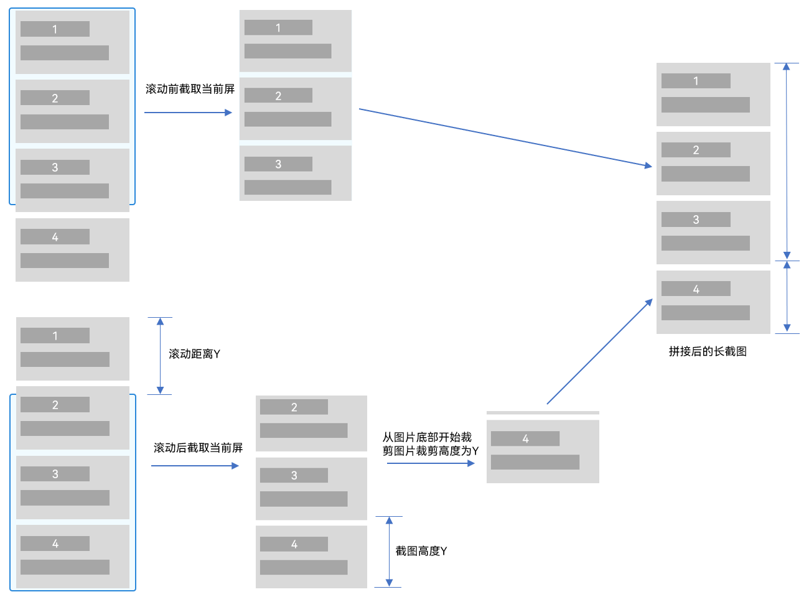
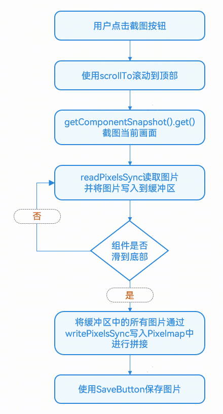

# 长截图

更新时间：2026-03-12 08:45:02

来源：https://developer.huawei.com/consumer/cn/doc/best-practices/bpta-long-snapshot-practice

## 概述


在移动应用中，标准的截图方法仅能捕捉当前屏幕显示的内容，对于超出屏幕可视区域的长页面或文档而言，这种方式显得不够便捷。当用户截图分享和保存（如聊天记录、网页文章、活动海报等）的内容较长的时候，需要用户多次截图来保证内容完整性。为了解决这一问题，本文将介绍长截图功能，使用户能够一键截取整个页面的长图，更轻松地分享和保存信息。

长截图功能适用于支持滚动的UI组件，比如List组件、Scroll组件、Web组件等。本文将以List组件和Web组件为例来介绍长截图功能的开发，分别通过控制器Scroller和WebviewController，结合UIContext的getComponentSnapshot().get()方法，实现长截图功能。


## 实现原理


List组件和Web组件实现长截图功能的原理相同，均可以通过模拟用户滚动行为，然后使用getComponentSnapshot().get()方法逐步截取不同位置的画面，将这些画面通过拼接得到长截图。Web组件通过WebviewController的相关API控制组件滚动，List组件通过Scroller的相关API控制组件滚动。

长截图拼接原理如下，将每次滚动新进入屏幕的内容裁剪后，拼接到之前的屏幕截图，依次类推。

图1 长截图拼接原理图




长截图主要流程如下：

图2 滚动长截图流程




> [!NOTE]
> 在长截图的拼接过程中，所有截图会被暂时缓存到内存中。对于无限滚动或数据量较大的场景，应当限制单张截图的高度，以防止过高的内存占用影响应用性能。


## 滚动组件长截图


List、Scroll、Grid、WaterFlow等滚动组件均是通过Scroller来控制组件滚动，本章将以List组件为例来介绍滚动组件长截图的实现。下面介绍了滚动组件两种常见的长截图场景，一键截图和滚动截图。


### 一键截图


场景描述

一键截图将组件数据从顶部截取到底部，在截图过程中用户看不到界面的滚动，实现无感知滚动截图。这种方案一般用于分享截图、保存数据量较少的场景。

实现效果

点击“一键截图”，会生成整个列表的长截图。


开发流程

1. 给List绑定滚动控制器，添加监听事件。1.1 为List滚动组件绑定Scroller控制器，以控制其滚动行为，并给List组件绑定自定义的id。 1.2 通过onDidScroll()方法实时监听并获取滚动偏移量，确保截图拼接位置的准确性。 1.3 同时，利用onAreaChange()事件获取List组件的尺寸，以便精确计算截图区域的大小。
```ts
// src/main/ets/view/ScrollSnapshot.ets
@Component
export struct ScrollSnapshot {
  // Scroll controller
  private scroller: Scroller = new Scroller();
  private listComponentWidth: number = 0;
  private listComponentHeight: number = 0;
  // The current offset of the List component
  private curYOffset: number = 0;
  private scrollHeight: number = 0;
  // ...
  build() {
    // ...
    Stack() {
      // ...
      List({
        space: 12,
        scroller: this.scroller
      })
      // ...
      .id(LIST_ID)
      .onDidScroll(() => {
        this.curYOffset = this.scroller.currentOffset().yOffset;
      })
      .onAreaChange((oldValue, newValue) => {
        this.listComponentWidth = newValue.width as number;
        this.listComponentHeight = newValue.height as number;
        this.scrollHeight = this.listComponentHeight;
      })
      .onClick(() => {
        // Click on the list to stop scrolling
        if (!this.isEnableScroll) {
          this.scroller.scrollBy(0, 0);
          this.isClickStop = true;
        }
      })
    }
    .width('100%')
    .layoutWeight(1)
    .padding({
      left: 16,
      right: 16,
      top: 16
    })
    .bindContentCover($$this.isShowPreview, this.previewWindowComponent(),
    {
      modalTransition: ModalTransition.NONE,
      onWillDismiss: (action: DismissContentCoverAction) => {
        if (action.reason === DismissReason.PRESS_BACK) {
          Logger.info('BindContentCover dismiss reason is back pressed');
        }
      }
    })

    Row({ space: 12 }) {
      Button($r('app.string.one_click_snapshot'))
      .layoutWeight(1)
      .onClick(() => {
        this.onceSnapshot();
      })
      Button($r('app.string.scroll_snapshot'))
      .layoutWeight(1)
      .onClick(() => {
        // Prevent users from clicking the button during the screenshot process,
        // and the method is repeatedly called, resulting in an exception
        if (this.scrollYOffsets.length === 0) {
          this.scrollSnapshot();
        }
      })
    }
    .width('100%')
    .padding({
      left: 16,
      right: 16,
      bottom: (AppStorage.get<number>('naviIndicatorHeight') ?? 0) + 16,
      top: 12
    })
  }
}
.title($r('app.string.title_scroll_snapshot'))
.backgroundColor($r('sys.color.background_secondary'))
}
}
```
2. 给List添加遮罩图，初始化滚动位置。“一键截图”功能确保在滚动截图过程中用户不会察觉到页面的滚动。通过截取当前屏幕生成遮罩图覆盖列表，并记录此时的滚动偏移量（yOffsetBefore），便于后续完成滚动截图之后，恢复到之前记录的偏移量，使用户无感知页面变化。 为保证截图的完整性，设置完遮罩图后，同样利用scrollTo()方法将列表暂时滚至顶部，确保截图从最顶端开始。
```ts
// src/main/ets/view/ScrollSnapshot.ets
@Component
export struct ScrollSnapshot {
  // Scroll controller
  private scroller: Scroller = new Scroller();
  private listComponentWidth: number = 0;
  private listComponentHeight: number = 0;
  // The current offset of the List component
  private curYOffset: number = 0;
  private scrollHeight: number = 0;
  // The component is overwritten during the screenshot process
  @State componentMaskImage: PixelMap | undefined = undefined;
  // The location of the component before backing up the screenshot
  private yOffsetBefore: number = 0;
  // ...
  /**
  * One-click screenshot
  */
  async onceSnapshot() {
    await this.beforeSnapshot();
    await this.snapAndMerge();
    await this.afterSnapshot();
    // ...
  }

  /**
  * Scroll through the screenshots
  */
  async scrollSnapshot() {
    // The settings list cannot be manually scrolled during the screenshot process
    // to avoid interference with the screenshot
    this.isEnableScroll = false;
    // Saves the current location of the component for recovery
    this.yOffsetBefore = this.curYOffset;
    // Set the prompt pop-up to be centered
    await this.scrollSnapAndMerge();
    // Open the prompt pop-up window
    this.isShowPreview = true;
    // Initial variable after stitching
    await this.afterGeneratorImage();
    this.isEnableScroll = true;
    this.isClickStop = false;
  }

  /**
  * One click screenshot loop traversal screenshot and merge
  */
  async snapAndMerge() {
    try {
      this.scrollYOffsets.push(this.curYOffset);
      // Call the component screenshot interface to obtain the current screenshot
      const pixelMap = await this.getUIContext().getComponentSnapshot().get(LIST_ID);
      // Gets the number of bytes per line of image pixels.
      let area: image.PositionArea =
      await ImageUtils.getSnapshotArea(this.getUIContext(), pixelMap, this.scrollYOffsets, this.listComponentWidth,
      this.listComponentHeight);
      this.areaArray.push(area);
      // Determine whether the bottom has been reached during the loop process
      if (!this.scroller.isAtEnd()) {
        CommonUtils.scrollAnimation(this.scroller, 200, this.scrollHeight);
        await CommonUtils.sleep(200)
        await this.snapAndMerge();
      } else {
        this.mergedImage =
        await ImageUtils.mergeImage(this.getUIContext(), this.areaArray,
        this.scrollYOffsets[this.scrollYOffsets.length - 1],this.listComponentHeight);
      }
    } catch (err) {
      let error = err as BusinessError;
      Logger.error(TAG, `snapAndMerge err, errCode: ${error.code}, error message: ${error.message}`);
    }
  }


  /**
  * Rolling screenshots, looping through screenshots, and merge them
  */
  async scrollSnapAndMerge() {
    try {
      // Record an array of scrolls
      this.scrollYOffsets.push(this.curYOffset - this.yOffsetBefore);
      // Call the API for taking screenshots to obtain the current screenshots
      const pixelMap = await this.getUIContext().getComponentSnapshot().get(LIST_ID);
      // Gets the number of bytes per line of image pixels.
      let area: image.PositionArea =
      await ImageUtils.getSnapshotArea(this.getUIContext(), pixelMap, this.scrollYOffsets, this.listComponentWidth,
      this.listComponentHeight)
      this.areaArray.push(area);

      // During the loop, it is determined whether the bottom is reached, and the user does not stop taking screenshots
      if (!this.scroller.isAtEnd() && !this.isClickStop) {
        // Scroll to the next page without scrolling to the end
        CommonUtils.scrollAnimation(this.scroller, 1000, this.scrollHeight);
        await CommonUtils.sleep(1500);
        await this.scrollSnapAndMerge();
      } else {
        // After scrolling to the bottom, the buffer obtained by each round of scrolling is spliced
        // to generate a long screenshot
        this.mergedImage =
        await ImageUtils.mergeImage(this.getUIContext(), this.areaArray,
        this.scrollYOffsets[this.scrollYOffsets.length - 1], this.listComponentHeight);
      }
    } catch (err) {
      let error = err as BusinessError;
      Logger.error(TAG, `scrollSnapAndMerge err, errCode: ${error.code}, error message: ${error.message}`);
    }
  }


  async beforeSnapshot() {
    try {
      this.yOffsetBefore = this.curYOffset;
      // Take a screenshot of the loaded List component as a cover image for the List component
      this.componentMaskImage = await this.getUIContext().getComponentSnapshot().get(LIST_ID);
      this.scroller.scrollTo({
        xOffset: 0,
        yOffset: 0,
        animation:
        {
          duration: 200
        }
      });
      // ...
      await CommonUtils.sleep(200);
    } catch (err) {
      let error = err as BusinessError;
      Logger.error(TAG, `beforeSnapshot err, errCode: ${error.code}, error message: ${error.message}`);
    }
  }

  async afterSnapshot() {
    this.scroller.scrollTo({
      xOffset: 0,
      yOffset: this.yOffsetBefore,
      animation: {
        duration: 200
      }
    });
    await CommonUtils.sleep(200);
  }


  async afterGeneratorImage() {
    // Delay for transition animation
    await CommonUtils.sleep(200);
    this.componentMaskImage = undefined;
    this.scrollYOffsets.length = 0;
    this.areaArray.length = 0;
  }

  @Builder
  previewWindowComponent() {
    Column() {
      SnapshotPreview({
        mergedImage: $mergedImage,
        isShowPreview: $isShowPreview
      })
    }
  }

  build() {
    // ...
    Stack() {
      //  The masking layer of the screenshot process prevents users from noticing the screen swiping quickly
      //  and improves the user experience
      if (this.componentMaskImage) {
        Image(this.componentMaskImage)
        // ...
      }
      List({
        space: 12,
        scroller: this.scroller
      })
      // ...
      .id(LIST_ID)
      .onDidScroll(() => {
        this.curYOffset = this.scroller.currentOffset().yOffset;
      })
      .onAreaChange((oldValue, newValue) => {
        this.listComponentWidth = newValue.width as number;
        this.listComponentHeight = newValue.height as number;
        this.scrollHeight = this.listComponentHeight;
      })
      .onClick(() => {
        // Click on the list to stop scrolling
        if (!this.isEnableScroll) {
          this.scroller.scrollBy(0, 0);
          this.isClickStop = true;
        }
      })
    }
    .width('100%')
    .layoutWeight(1)
    .padding({
      left: 16,
      right: 16,
      top: 16
    })
    .bindContentCover($$this.isShowPreview, this.previewWindowComponent(),
    {
      modalTransition: ModalTransition.NONE,
      onWillDismiss: (action: DismissContentCoverAction) => {
        if (action.reason === DismissReason.PRESS_BACK) {
          Logger.info('BindContentCover dismiss reason is back pressed');
        }
      }
    })

    Row({ space: 12 }) {
      Button($r('app.string.one_click_snapshot'))
      .layoutWeight(1)
      .onClick(() => {
        this.onceSnapshot();
      })
      Button($r('app.string.scroll_snapshot'))
      .layoutWeight(1)
      .onClick(() => {
        // Prevent users from clicking the button during the screenshot process,
        // and the method is repeatedly called, resulting in an exception
        if (this.scrollYOffsets.length === 0) {
          this.scrollSnapshot();
        }
      })
    }
    .width('100%')
    .padding({
      left: 16,
      right: 16,
      bottom: (AppStorage.get<number>('naviIndicatorHeight') ?? 0) + 16,
      top: 12
    })
  }
}
.title($r('app.string.title_scroll_snapshot'))
.backgroundColor($r('sys.color.background_secondary'))
}
}
```
3. 循环滚动截图，裁剪和缓存截图数据。3.1 记录每次滚动的位置到数组scrollYOffsets中，并使用componentSnapshot.get(LIST_ID) 方法获取当前画面的截图。 3.2 如果非首次截图，则使用crop方法截取从底部滚动进来的区域，然后调用pixmap.readPixelsSync(area)方法将截图数据读取到缓冲区域area中，并将area通过集合进行保存，用于后续截图拼接。 3.3 如果页面没有滚动到底部，继续滚动，继续递归调用snapAndMerge()方法进行截图；如果到达底部，则调用mergeImage()方法拼接所有收集到的图像片段，生成完整的长截图；同时还需限制截图的高度，以防过大的截图占用过多内存，影响应用性能，例如这里设置截长截图高度不超过5000。
```ts
/**
* One click screenshot loop traversal screenshot and merge
*/
async snapAndMerge() {
  try {
    this.scrollYOffsets.push(this.curYOffset);
    // Call the component screenshot interface to obtain the current screenshot
    const pixelMap = await this.getUIContext().getComponentSnapshot().get(LIST_ID);
    // Gets the number of bytes per line of image pixels.
    let area: image.PositionArea =
    await ImageUtils.getSnapshotArea(this.getUIContext(), pixelMap, this.scrollYOffsets, this.listComponentWidth,
    this.listComponentHeight);
    this.areaArray.push(area);
    // Determine whether the bottom has been reached during the loop process
    if (!this.scroller.isAtEnd()) {
      CommonUtils.scrollAnimation(this.scroller, 200, this.scrollHeight);
      await CommonUtils.sleep(200)
      await this.snapAndMerge();
    } else {
      this.mergedImage =
      await ImageUtils.mergeImage(this.getUIContext(), this.areaArray,
      this.scrollYOffsets[this.scrollYOffsets.length - 1],this.listComponentHeight);
    }
  } catch (err) {
    let error = err as BusinessError;
    Logger.error(TAG, `snapAndMerge err, errCode: ${error.code}, error message: ${error.message}`);
  }
}
```

```ts
/**
* Read the screenshot PixelMap object into the buffer area
* @param {PixelMap} pixelMap - Screenshot PixelMap
* @param {number[]} scrollYOffsets - Component scrolls an array of y-axis offsets
* @param {number} listWidth - List component width
* @param {number} listHeight - List component height
* @returns {image.PositionArea} Picture buffer area
*/
static async getSnapshotArea(uiContext: UIContext, pixelMap: PixelMap, scrollYOffsets: number[], listWidth: number,
listHeight: number): Promise<image.PositionArea> {
  // Gets the number of bytes per line of image pixels.
  let stride = pixelMap.getBytesNumberPerRow();
  // Get the total number of bytes of image pixels.
  let bytesNumber = pixelMap.getPixelBytesNumber();
  let buffer: ArrayBuffer = new ArrayBuffer(bytesNumber);
  // Region size, read based on region.   PositionArea represents the data within the specified area of the image.
  let len = scrollYOffsets.length;

  // Except for the first screenshot, you don't need to crop it, and you need to crop the new parts
  if (scrollYOffsets.length >= 2) {
    // Realistic roll distance
    let realScrollHeight = scrollYOffsets[len-1] - scrollYOffsets[len-2];
    if (listHeight - realScrollHeight > 0) {
      let cropRegion: image.Region = {
        x: 0,
        y: uiContext.vp2px(listHeight - realScrollHeight),
        size: {
          height: uiContext.vp2px(realScrollHeight),
          width: uiContext.vp2px(listWidth)
        }
      };
      // Crop roll area
      await pixelMap.crop(cropRegion);
    }
  }

  let area: image.PositionArea = {
    pixels: buffer,
    offset: 0,
    stride: stride,
    region: {
      size: {
        width: 0,
        height: 0
      },
      x: 0,
      y: 0
    }
  }

  try {
    let imgInfo = pixelMap.getImageInfoSync();
    // Region size, read based on region. PositionArea represents the data within the specified area of the image.
    area = {
      pixels: buffer,
      offset: 0,
      stride: stride,
      region: {
        size: {
          width: imgInfo.size.width,
          height: imgInfo.size.height
        },
        x: 0,
        y: 0
      }
    }
    // Write data to a specified area
    pixelMap.readPixelsSync(area);
  } catch (err) {
    let error = err as BusinessError;
    Logger.error(TAG, `getSnapshotArea err, code: ${error.code}, message: ${error.message}`);
  }
  return area;
}
```
4. 拼接截图片段。使用image.createPixelMapSync()方法创建长截图longPixelMap，并遍历之前保存的图像片段数据 (this.areaArray)，构建image.PositionArea对象area，然后调用longPixelMap.writePixelsSync(area) 方法将这些片段逐个写入到正确的位置，从而拼接成一个完整的长截图。
```ts
/**
* Merge image area array into long screenshots
* @param {image.PositionArea[]} areaArray - screenshot area
* @param {number} lastOffsetY - The offset Y of the last screenshot
* @param {number} listWidth - List component width
* @param {number} listHeight - List component height
* @returns {PixelMap} Long image after merge
*/
static async mergeImage(uiContext: UIContext, areaArray: image.PositionArea[], lastOffsetY: number,
listHeight: number): Promise<PixelMap> {
  // Create a long screenshot PixelMap
  let opts: image.InitializationOptions = {
    editable: true,
    pixelFormat: 4,
    size: {
      // You need to ensure that the width of the PixelMap is greater than the width of the area
      width:  ImageUtils.getMaxAreaWidth(areaArray),
      height: uiContext.vp2px(lastOffsetY + listHeight)
    }
  };
  let longPixelMap = image.createPixelMapSync(opts);
  let imgPosition: number = 0;

  for (let i = 0; i < areaArray.length; i++) {
    let readArea = areaArray[i];
    let area: image.PositionArea = {
      pixels: readArea.pixels,
      offset: 0,
      stride: readArea.stride,
      region: {
        size: {
          width: readArea.region.size.width,
          height: readArea.region.size.height
        },
        x: 0,
        y: imgPosition
      }
    }
    imgPosition += readArea.region.size.height;
    try {
      longPixelMap.writePixelsSync(area);
    } catch (err) {
      let error = err as BusinessError;
      Logger.error(TAG, `writePixelsSync err, code: ${error.code}, message: ${error.message}`);
    }
  }
  return longPixelMap;
}
```
5. 恢复到截图前的状态，滚动到截图前的位置。
```ts
async afterSnapshot() {
  this.scroller.scrollTo({
    xOffset: 0,
    yOffset: this.yOffsetBefore,
    animation: {
      duration: 200
    }
  });
  await CommonUtils.sleep(200);
}
```
6. 使用安全控件SaveButton保存截图相册。通过安全控件[SaveButton](https://developer.huawei.com/consumer/cn/doc/harmonyos-references/ts-security-components-savebutton)结合[photoAccessHelper](https://developer.huawei.com/consumer/cn/doc/harmonyos-references/js-apis-photoaccesshelper)模块保存截图到相册。
```ts
SaveButton({
  icon: SaveIconStyle.FULL_FILLED,
  text: SaveDescription.SAVE_IMAGE,
  buttonType: ButtonType.Capsule,
})
  // ...
  .onClick((event, result) => {
    this.saveSnapshot(result);
  });
```

```ts
/**
* Save the picture to the album
* @param {SaveButtonOnClickResult} result - The security control returns the result
*/
async saveSnapshot(result: SaveButtonOnClickResult): Promise<void> {
  try {
    if (result === SaveButtonOnClickResult.SUCCESS) {
      const helper = photoAccessHelper.getPhotoAccessHelper(this.context);
      const uri = await helper.createAsset(photoAccessHelper.PhotoType.IMAGE, 'png');
      // Open the file with a URI to write content continuously
      const file = await fileIo.open(uri, fileIo.OpenMode.READ_WRITE | fileIo.OpenMode.CREATE);
      const imagePackerApi: image.ImagePacker = image.createImagePacker();
      const packOpts: image.PackingOption = {
        format: 'image/png',
        quality: 100,
      };
      imagePackerApi.packToData(this.mergedImage, packOpts).then((data) => {
        fileIo.writeSync(file.fd, data);
        fileIo.closeSync(file.fd);
        Logger.info(TAG, `Succeeded in packToFile`);
        this.getUIContext().getPromptAction().showToast({
          message: $r('app.string.save_album_success'),
          duration: 1800
        })
      }).catch((error: BusinessError) => {
        Logger.error(TAG, `Failed to packToFile. Error code is ${error.code}, message is ${error.message}`);
      });
    }
    // ...
  } catch (err) {
    let error = err as BusinessError;
    Logger.error(TAG, `saveSnapshot err, errCode: ${error.code}, error message: ${error.message}`);
  }
}
```


### 滚动截图


场景描述

此方案允许用户控制长截图的起止位置，增加了使用的灵活性。它适用于大数据量场景，方便用户选择性保存滚动组件中的特定数据。

实现效果

点击“滚动截图”按钮后，列表将自动滚动。点击列表中的任意条目时，滚动会立即停止，并开始截取从滚动开始到停止这段时间内的数据截图。


功能实现

“滚动截图”功能的实现流程与前述的“一键截图”一样，因此这里不再重复详述整个过程，而仅聚焦于其中的几个关键差异点，例如滚动的控制和偏移量的记录，分别如下面1和2所描述。

1. 在截图滚动的过程中，为了防止用户手动滚动对截图产生干扰，应禁用列表的手动滚动功能。可以通过设置List组件的enableScrollInteraction属性来控制是否允许手动滚动。当准备开始截图时，将isEnableScroll设置为false以禁用滚动交互。而当用户点击列表项以确定截图结束位置时，使用scroller.scrollBy(0, 0)方法确保列表立即停止滑动。
```ts
// src/main/ets/view/ScrollSnapshot.ets
@Component
export struct ScrollSnapshot {
  // Scroll controller
  private scroller: Scroller = new Scroller();
  private listComponentWidth: number = 0;
  private listComponentHeight: number = 0;
  // The current offset of the List component
  private curYOffset: number = 0;
  private scrollHeight: number = 0;
  // The component is overwritten during the screenshot process
  @State componentMaskImage: PixelMap | undefined = undefined;
  // The location of the component before backing up the screenshot
  private yOffsetBefore: number = 0;
  // is click to stop scroll
  private isClickStop: boolean = false;
  @State isEnableScroll: boolean = true;
  // ...
  /**
  * Scroll through the screenshots
  */
  async scrollSnapshot() {
    // The settings list cannot be manually scrolled during the screenshot process
    // to avoid interference with the screenshot
    this.isEnableScroll = false;
    // Saves the current location of the component for recovery
    this.yOffsetBefore = this.curYOffset;
    // Set the prompt pop-up to be centered
    await this.scrollSnapAndMerge();
    // ...
    this.isEnableScroll = true;
    this.isClickStop = false;
  }

  /**
  * One click screenshot loop traversal screenshot and merge
  */
  async snapAndMerge() {
    try {
      this.scrollYOffsets.push(this.curYOffset);
      // Call the component screenshot interface to obtain the current screenshot
      const pixelMap = await this.getUIContext().getComponentSnapshot().get(LIST_ID);
      // Gets the number of bytes per line of image pixels.
      let area: image.PositionArea =
      await ImageUtils.getSnapshotArea(this.getUIContext(), pixelMap, this.scrollYOffsets, this.listComponentWidth,
      this.listComponentHeight);
      this.areaArray.push(area);
      // Determine whether the bottom has been reached during the loop process
      if (!this.scroller.isAtEnd()) {
        CommonUtils.scrollAnimation(this.scroller, 200, this.scrollHeight);
        await CommonUtils.sleep(200)
        await this.snapAndMerge();
      } else {
        this.mergedImage =
        await ImageUtils.mergeImage(this.getUIContext(), this.areaArray,
        this.scrollYOffsets[this.scrollYOffsets.length - 1],this.listComponentHeight);
      }
    } catch (err) {
      let error = err as BusinessError;
      Logger.error(TAG, `snapAndMerge err, errCode: ${error.code}, error message: ${error.message}`);
    }
  }


  /**
  * Rolling screenshots, looping through screenshots, and merge them
  */
  async scrollSnapAndMerge() {
    try {
      // Record an array of scrolls
      this.scrollYOffsets.push(this.curYOffset - this.yOffsetBefore);
      // Call the API for taking screenshots to obtain the current screenshots
      const pixelMap = await this.getUIContext().getComponentSnapshot().get(LIST_ID);
      // Gets the number of bytes per line of image pixels.
      let area: image.PositionArea =
      await ImageUtils.getSnapshotArea(this.getUIContext(), pixelMap, this.scrollYOffsets, this.listComponentWidth,
      this.listComponentHeight)
      this.areaArray.push(area);

      // During the loop, it is determined whether the bottom is reached, and the user does not stop taking screenshots
      if (!this.scroller.isAtEnd() && !this.isClickStop) {
        // Scroll to the next page without scrolling to the end
        CommonUtils.scrollAnimation(this.scroller, 1000, this.scrollHeight);
        await CommonUtils.sleep(1500);
        await this.scrollSnapAndMerge();
      } else {
        // After scrolling to the bottom, the buffer obtained by each round of scrolling is spliced
        // to generate a long screenshot
        this.mergedImage =
        await ImageUtils.mergeImage(this.getUIContext(), this.areaArray,
        this.scrollYOffsets[this.scrollYOffsets.length - 1], this.listComponentHeight);
      }
    } catch (err) {
      let error = err as BusinessError;
      Logger.error(TAG, `scrollSnapAndMerge err, errCode: ${error.code}, error message: ${error.message}`);
    }
  }


  async beforeSnapshot() {
    try {
      this.yOffsetBefore = this.curYOffset;
      // Take a screenshot of the loaded List component as a cover image for the List component
      this.componentMaskImage = await this.getUIContext().getComponentSnapshot().get(LIST_ID);
      this.scroller.scrollTo({
        xOffset: 0,
        yOffset: 0,
        animation:
        {
          duration: 200
        }
      });
      this.isShowPreview = true;
      // Delay ensures that the scroll has reached the top
      await CommonUtils.sleep(200);
    } catch (err) {
      let error = err as BusinessError;
      Logger.error(TAG, `beforeSnapshot err, errCode: ${error.code}, error message: ${error.message}`);
    }
  }

  async afterSnapshot() {
    this.scroller.scrollTo({
      xOffset: 0,
      yOffset: this.yOffsetBefore,
      animation: {
        duration: 200
      }
    });
    await CommonUtils.sleep(200);
  }


  async afterGeneratorImage() {
    // Delay for transition animation
    await CommonUtils.sleep(200);
    this.componentMaskImage = undefined;
    this.scrollYOffsets.length = 0;
    this.areaArray.length = 0;
  }

  @Builder
  previewWindowComponent() {
    Column() {
      SnapshotPreview({
        mergedImage: $mergedImage,
        isShowPreview: $isShowPreview
      })
    }
  }

  build() {
    // ...
    List({
      space: 12,
      scroller: this.scroller
    })
    // ...
    .id(LIST_ID)
    .onDidScroll(() => {
      this.curYOffset = this.scroller.currentOffset().yOffset;
    })
    .onAreaChange((oldValue, newValue) => {
      this.listComponentWidth = newValue.width as number;
      this.listComponentHeight = newValue.height as number;
      this.scrollHeight = this.listComponentHeight;
    })
    .onClick(() => {
      // Click on the list to stop scrolling
      if (!this.isEnableScroll) {
        this.scroller.scrollBy(0, 0);
        this.isClickStop = true;
      }
    })
  }
  .width('100%')
  .layoutWeight(1)
  .padding({
    left: 16,
    right: 16,
    top: 16
  })
  .bindContentCover($$this.isShowPreview, this.previewWindowComponent(),
  {
    modalTransition: ModalTransition.NONE,
    onWillDismiss: (action: DismissContentCoverAction) => {
      if (action.reason === DismissReason.PRESS_BACK) {
        Logger.info('BindContentCover dismiss reason is back pressed');
      }
    }
  })

  Row({ space: 12 }) {
    Button($r('app.string.one_click_snapshot'))
    .layoutWeight(1)
    .onClick(() => {
      this.onceSnapshot();
    })
    Button($r('app.string.scroll_snapshot'))
    .layoutWeight(1)
    .onClick(() => {
      // Prevent users from clicking the button during the screenshot process,
      // and the method is repeatedly called, resulting in an exception
      if (this.scrollYOffsets.length === 0) {
        this.scrollSnapshot();
      }
    })
  }
  .width('100%')
  .padding({
    left: 16,
    right: 16,
    bottom: (AppStorage.get<number>('naviIndicatorHeight') ?? 0) + 16,
    top: 12
  })
}
}
.title($r('app.string.title_scroll_snapshot'))
.backgroundColor($r('sys.color.background_secondary'))
}
}
```
2. “滚动截图”功能依据当前坐标启动截图过程，因此在记录滚动偏移量时，通过 this.curYOffset - this.yOffsetBefore 来计算相对于初始位置的变化。
```ts
/**
* Rolling screenshots, looping through screenshots, and merge them
*/
async scrollSnapAndMerge() {
  try {
    // Record an array of scrolls
    this.scrollYOffsets.push(this.curYOffset - this.yOffsetBefore);
    // Call the API for taking screenshots to obtain the current screenshots
    const pixelMap = await this.getUIContext().getComponentSnapshot().get(LIST_ID);
    // Gets the number of bytes per line of image pixels.
    let area: image.PositionArea =
    await ImageUtils.getSnapshotArea(this.getUIContext(), pixelMap, this.scrollYOffsets, this.listComponentWidth,
    this.listComponentHeight)
    this.areaArray.push(area);

    // During the loop, it is determined whether the bottom is reached, and the user does not stop taking screenshots
    if (!this.scroller.isAtEnd() && !this.isClickStop) {
      // Scroll to the next page without scrolling to the end
      CommonUtils.scrollAnimation(this.scroller, 1000, this.scrollHeight);
      await CommonUtils.sleep(1500);
      await this.scrollSnapAndMerge();
    } else {
      // After scrolling to the bottom, the buffer obtained by each round of scrolling is spliced
      // to generate a long screenshot
      this.mergedImage =
      await ImageUtils.mergeImage(this.getUIContext(), this.areaArray,
      this.scrollYOffsets[this.scrollYOffsets.length - 1], this.listComponentHeight);
    }
  } catch (err) {
    let error = err as BusinessError;
    Logger.error(TAG, `scrollSnapAndMerge err, errCode: ${error.code}, error message: ${error.message}`);
  }
}
```
3. 与“一键截图”不同，“滚动截图”在执行过程中不使用遮罩层，用户能够直接看到列表的滚动效果。为了确保流畅的视觉体验，在调用 scroller.scrollTo 进行滚动时，添加了动画效果，使得滚动更加自然和顺滑。
```ts
static scrollAnimation(scroller: Scroller, duration: number, scrollHeight: number): void {
  scroller.scrollTo({
    xOffset: 0,
    yOffset: (scroller.currentOffset().yOffset + scrollHeight),
    animation: {
      duration: duration,
      curve: Curve.Smooth,
      canOverScroll: false
    }
  });
}
```


## Web组件长截图


### 场景描述


Web组件的长截图功能与之前介绍的滚动组件长截图在使用场景上相似，两者均旨在为用户提供快速便捷的数据信息分享和保存方式。主要区别在于，Web组件专门针对网页内容进行截图，确保用户能够完整地捕获和分享浏览的网页信息。


### 实现效果


点击“截图”按钮即可完成整个网页的长截图，并可将截图保存至相册。


### 功能实现


Web组件的长截图可以通过前文介绍的滚动截图方案以及使用WebView提供的webPageSnapshot()方法进行全量截图。本章将重点介绍webPageSnapshot()方法的使用方法，而滚动截图的相关信息已在前文详述。

使用滚动截图的方式进行长截图

Web组件滚动长截图和滚动组件长截图开发流程大体一样，主要是控制组件的滚动的方法不同。List组件使用的是Scroller，而Web组件使用的是webViewController。

在滚动截图过程中，webViewController负责控制Web组件的滚动，通过调用webViewController.scrollBy()方法来实现。为了判断是否已滚动到底部，使用this.webViewController.getPageHeight() 方法获取网页内容的总高度，并将当前偏移量this.curYOffset加上组件自身的高度与网页总高度进行比较。如果两者的和小于网页总高度，则表示尚未触底。

```ts
/**
* One click screenshot loop traversal screenshot and merge
*/
async snapAndMerge() {
  try {
    this.scrollYOffsets.push(this.curYOffset);
    // Call the component screenshot interface to obtain the current screenshot
    const pixelMap = await this.getUIContext().getComponentSnapshot().get(WEB_ID);
    let area: image.PositionArea =
    await ImageUtils.getSnapshotArea(this.getUIContext(), pixelMap, this.scrollYOffsets, this.webComponentWidth,
    this.webComponentHeight);
    this.areaArray.push(area);
    // Determine whether the bottom has been reached during the loop process
    if (Math.ceil(this.curYOffset + this.webComponentHeight) < this.webviewController.getPageHeight()) {
      // Not scrolling to the bottom, scrolling to the next page
      this.webviewController.scrollBy(0, this.scrollHeight, 500);
      await CommonUtils.sleep(600)
      await this.snapAndMerge();
    } else {
      this.mergedImage =
      await ImageUtils.mergeImage(this.getUIContext(), this.areaArray,
      this.scrollYOffsets[this.scrollYOffsets.length - 1], this.webComponentHeight);
    }
  } catch (err) {
    let error = err as BusinessError;
    Logger.error(TAG, `snapAndMerge err, errCode: ${error.code}, error message: ${error.message}`);
  }
}
```

使用webPageSnapshot()方法进行网页全量截图

此外，Web组件还可以使用webPageSnapshot()方法进行网页全量截图，比较适合结构简单、静态元素的页面长截图。如果网页中有动态资源，结构相对复杂，比如有固定的标题头等，推荐上面的滚动长截图方案。使用webPageSnapshot()方法实现长截图的步骤如下：

1. Web初始化，调用enableWholeWebPageDrawing()方法开启网页全量绘制能力。
```ts
aboutToAppear(): void {
  try {
    webview.WebviewController.initializeWebEngine();
    webview.WebviewController.enableWholeWebPageDrawing();
    webview.WebviewController.prepareForPageLoad(EXAMPLE_URL, true, 2);
  } catch (err) {
    let error = err as BusinessError;
    Logger.error(TAG, `web snapshot init err, errCode: ${error.code}, error message: ${error.message}`);
  }
}
```
2. 获取网页内容高度和宽度。
```ts
async getWebSize() {
  const SCRIPT = '[document.documentElement.scrollWidth, document.documentElement.scrollHeight]';
  try {
    this.webviewController.runJavaScriptExt(SCRIPT).then((result) => {
      if (result.getType() === webview.JsMessageType.ARRAY) {
        this.h5Width = (result.getArray() as number[])[0];
        this.h5Height = (result.getArray() as number[])[1];
        Logger.info(TAG, `h5Width is ${this.h5Width}, h5Height is ${this.h5Height}`);
      }
    }).catch((error: BusinessError) => {
      Logger.error(TAG, `getWebSize exception, errCode: ${error.code}, error message: ${error.message}`);
    });
  } catch (error) {
    let err = error as BusinessError;
    Logger.error(TAG, `getWebSize failed, errCode: ${err.code}, error message: ${err.message}`);
  }
}
```
3. 调用webPageSnapshot()方法，进行网页截图。
```ts
async webSnapshot() {
  try {
    this.webviewController.webPageSnapshot({ id: WEB_ID, size: { width: this.h5Width, height: this.h5Height } },
    async (error, result) => {
      if (result) {
        this.longPixelMap = result.imagePixelMap;
      }
    });
  } catch (error) {
    let err = error as BusinessError;
    Logger.error(TAG, `webSnapshot err, errCode: ${err.code}, error message: ${err.message}`);
  }
}
```


> [!NOTE]
> 加载网络html文件时，需要在entry/src/main路径下的module.json5中配置网络权限。示例代码如下所示：
>  {
>   "module": {
>     "requestPermissions": [
>       {
>         "name": "ohos.permission.INTERNET"
>       }
>     ]
>   }
> }


## 示例代码


- [实现长截图功能](https://gitcode.com/harmonyos_samples/LongSnapshotPractice)
