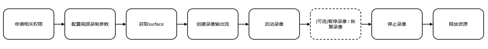
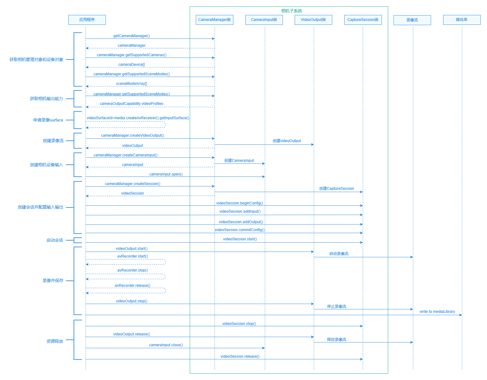

# 自定义相机录像

更新时间：2026-03-19 08:43:01

来源：https://developer.huawei.com/consumer/cn/doc/best-practices/bpta-custom-camera-video

## 概述


本文面向于相机应用开发场景，在相机应用中实现了基础视频录制功能。内容涵盖相机设备的创建与调用、录像的启动与停止、以及输出处理的完整流程，有效满足第三方应用在不同硬件平台上对录像功能的开发需求。


## 基础录像


### 场景描述


录像功能是自定义相机应用的核心功能，提供实时预览和构图调整能力。通过点击界面上的录像按钮，用户即可开始视频录制。在录制过程中，相机应用会持续采集画面数据并将其保存为视频文件，用户可根据需要随时暂停或结束录制。


### 开发步骤








详细的API说明请参考Camera API参考。


1. 申请相关权限在开发相机应用时，需要先参考[申请相机开发的权限](https://developer.huawei.com/consumer/cn/doc/harmonyos-guides/camera-preparation)。
2. 配置视频录制参数
- 通过相册管理模块 PhotoAccessHelper 创建一个视频资源，以便后续写入录像文件。
```text
let options: photoAccessHelper.CreateOptions = {
title: Date.now().toString()
};
let videoAccessHelper: photoAccessHelper.PhotoAccessHelper = photoAccessHelper.getPhotoAccessHelper(this.context);
try {
this.videoUri = await videoAccessHelper.createAsset(photoAccessHelper.PhotoType.VIDEO, 'mp4', options);
this.file = fileIo.openSync(this.videoUri, fileIo.OpenMode.READ_WRITE | fileIo.OpenMode.CREATE);
} catch (exception) {
Logger.error(TAG_LOG, `createAsset failed, code is ${exception.code}, message is ${exception.message}`);
}
```
- 动态生成视频录制的配置profile。
```text
this.avProfile = {
audioBitrate: 48000, // Audio bitrate (unit: bps), which affects audio quality
audioChannels: 2, // Stereo two-channel recording
audioCodec: media.CodecMimeType.AUDIO_AAC, // The audio encoding format is AAC
audioSampleRate: 48000, // Audio sampling rate (unit: Hz), CD-quality sound
fileFormat: media.ContainerFormatType.CFT_MPEG_4, // Container Format Configuration
videoBitrate: 32000000, // Video bitrate (unit: bps) determines video clarity
// Dynamic Selection of Video Encoding Format
videoCodec: (this.qualityLevel === QualityLevel.HIGHER &&
this.cameraPosition === camera.CameraPosition.CAMERA_POSITION_BACK) ?
media.CodecMimeType.VIDEO_HEVC : media.CodecMimeType.VIDEO_AVC,
videoFrameWidth: this.videoProfile?.size.width, // Obtain width from video configuration
videoFrameHeight: this.videoProfile?.size.height, // Obtain height from video configuration
videoFrameRate: this.cameraPosition === camera.CameraPosition.CAMERA_POSITION_BACK ?
60 : 30, // Obtain rate from video configuration
};
```
- 音视频录制参数设置，包括采集源类型、编码方式、画质配置、保存路径等，为录制的启动和后续操作提供基础配置。
```text
this.avConfig = {
audioSourceType: media.AudioSourceType.AUDIO_SOURCE_TYPE_CAMCORDER,
videoSourceType: media.VideoSourceType.VIDEO_SOURCE_TYPE_SURFACE_YUV,
profile: this.avProfile,
url: `fd://${this.file.fd}`,
metadata: {
videoOrientation: this.getCameraImageRotation().toString()
}
};
```


1. 获取Surface系统提供的media接口可以创建一个录像AVRecorder实例，通过该实例的[getInputSurface()](https://developer.huawei.com/consumer/cn/doc/harmonyos-references/arkts-apis-media-avrecorder#getinputsurface9-1)方法获取SurfaceId，用于后续录像输出流的关联，处理录像输出流的数据。
```text
let videoSurfaceId = await this.avRecorder.getInputSurface();
```


1. 创建录像输出流通过[CameraOutputCapability](https://developer.huawei.com/consumer/cn/doc/harmonyos-references/arkts-apis-camera-i#cameraoutputcapability)模块中的videoProfiles属性，可获取当前设备支持的录像输出流配置，根据设备能力和目标配置，选择合适的视频配置。在当前示例中，演示了根据不同相机位置、图片质量去设置不同的分辨率和帧率，最后通过[createVideoOutput()](https://developer.huawei.com/consumer/cn/doc/harmonyos-references/arkts-apis-camera-cameramanager#createvideooutput)方法创建录像输出流。
```text
async createVideoOutput(cameraManager: camera.CameraManager | undefined): Promise<void> {
if (!this.avRecorder || this.avRecorder.state !== AVRecorderState.PREPARED) {
return;
}
try {
let videoSurfaceId = await this.avRecorder.getInputSurface();
this.output = cameraManager?.createVideoOutput(this.videoProfile, videoSurfaceId);
} catch (error) {
Logger.error(TAG_LOG,
`Failed to create the output instance. error code: ${error.code}`);
}
}

setVideoProfile(cameraManager: camera.CameraManager | undefined, targetProfile: camera.Profile,
device: camera.CameraDevice): void {
this.cameraPosition = device.cameraPosition;
let cameraOutputCap: camera.CameraOutputCapability | undefined =
cameraManager?.getSupportedOutputCapability(device,
camera.SceneMode.NORMAL_VIDEO);
let videoProfilesArray: camera.VideoProfile[] | undefined = cameraOutputCap?.videoProfiles;
if (videoProfilesArray?.length) {
try {
const displayRatio = targetProfile.size.width / targetProfile.size.height;
const profileWidth = targetProfile.size.width;
const videoProfile = videoProfilesArray
.sort((a, b) => Math.abs(a.size.width - profileWidth) - Math.abs(b.size.width - profileWidth))
.find(pf => {
const pfDisplayRatio = pf.size.width / pf.size.height;
return Math.abs(pfDisplayRatio - displayRatio) <= CameraConstant.PROFILE_DIFFERENCE &&
pf.format === camera.CameraFormat.CAMERA_FORMAT_YUV_420_SP;
});
if (!videoProfile) {
Logger.error(TAG_LOG, 'Failed to get video profile');
return;
}
this.videoProfile = videoProfile;
} catch (error) {
Logger.error(TAG_LOG, `Failed to createPhotoOutput. error: ${JSON.stringify(error)}`);
}
}
}
```


1. 启动录像先通过videoOutput的[start()](https://developer.huawei.com/consumer/cn/doc/harmonyos-references/arkts-apis-camera-videooutput#start-1)方法启动录像输出流，再通过avRecorder的[start()](https://developer.huawei.com/consumer/cn/doc/harmonyos-references/arkts-apis-media-avrecorder#start9)方法开始录像。如需实现前置摄像头录像功能，先通过[isMirrorSupported()](https://developer.huawei.com/consumer/cn/doc/harmonyos-references/arkts-apis-camera-videooutput#ismirrorsupported15)方法判断设备是否支持镜像功能；如果支持且当前为前置摄像头，则调用[enableMirror()](https://developer.huawei.com/consumer/cn/doc/harmonyos-references/arkts-apis-camera-videooutput#enablemirror15)方法开启镜像效果。
```text
async start(isFront: boolean): Promise<void> {
try {
if (this.avRecorder?.state === AVRecorderState.PREPARED) {
if (this.isSupportMirror() && isFront) {
this.output?.enableMirror(true);
}
// ...
await this.output?.start();
await this.avRecorder?.start();
}
} catch (error) {
Logger.info(TAG_LOG, `Failed to start and catch error is  ${error.message}`);
}
}
```


1. 暂停录像先通过avRecorder的[pause()](https://developer.huawei.com/consumer/cn/doc/harmonyos-references/arkts-apis-media-avrecorder#pause9-1)方法暂停录像，再通过videoOutput的[stop()](https://developer.huawei.com/consumer/cn/doc/harmonyos-references/arkts-apis-camera-videooutput#stop-1)方法停止录像输出流。
```text
async pause(): Promise<void> {
try {
if (this.avRecorder?.state === AVRecorderState.STARTED) {
await this.avRecorder.pause();
await this.output?.stop();
}
} catch (error) {
Logger.error(TAG_LOG, `Failed to pause and catch error is  ${error.message}`);
}
}
```
2. 恢复录像先通过videoOutput的[start()](https://developer.huawei.com/consumer/cn/doc/harmonyos-references/arkts-apis-camera-videooutput#start-1)方法启动录像输出流，再通过avRecorder的[resume()](https://developer.huawei.com/consumer/cn/doc/harmonyos-references/arkts-apis-media-avrecorder#resume9-1)方法恢复录像。
```text
async resume(): Promise<void> {
try {
if (this.avRecorder?.state === AVRecorderState.PAUSED) {
await this.output?.start();
await this.avRecorder.resume();
}
} catch (error) {
Logger.error(TAG_LOG, `Failed to resume and catch error is  ${error.message}`);
}
}
```
3. 停止录像先通过avRecorder的[stop()](https://developer.huawei.com/consumer/cn/doc/harmonyos-references/arkts-apis-media-avrecorder#stop9-1)方法停止录像，再通过videoOutput的[stop()](https://developer.huawei.com/consumer/cn/doc/harmonyos-references/arkts-apis-camera-videooutput#stop-1)方法停止录像输出流。
```text
async stop(): Promise<void> {
try {
if (this.avRecorder?.state === AVRecorderState.STARTED ||
this.avRecorder?.state === AVRecorderState.PAUSED) {
await this.avRecorder.stop();
await this.output?.stop();
const thumbnail = await this.getVideoThumbnail();
if (thumbnail) {
this.callback(thumbnail, this.videoUri);
}
}
} catch (error) {
Logger.error(TAG_LOG, `Failed to stop and catch error is  ${error.message}`);
}
}
```
4. 释放资源先通过avRecorder的[release()](https://developer.huawei.com/consumer/cn/doc/harmonyos-references/arkts-apis-media-avrecorder#release9-1)方法释放录像资源，再通过videoOutput的[release()](https://developer.huawei.com/consumer/cn/doc/harmonyos-references/arkts-apis-camera-cameraoutput#release-1)方法释放输出流。
```text
async release(): Promise<void> {
try {
await this.avRecorder?.release();
await this.output?.release();
this.file && await fileIo.close(this.file.fd);
} catch (exception) {
Logger.error(TAG_LOG, `release failed, code is ${exception.code}, message is ${exception.message}`);
}
this.avRecorder?.off('stateChange');
this.avRecorder = undefined;
this.output = undefined;
this.file = undefined;
}
```


## 视频防抖


通过session中setVideoStabilizationMode()方法可以设置视频防抖模式，详细请参见Stabilization。

```text
setVideoStabilizationMode(session: camera.VideoSession): boolean {
let mode: camera.VideoStabilizationMode = camera.VideoStabilizationMode.AUTO;
// Check whether video stabilization is supported
try {
let isSupported: boolean = session.isVideoStabilizationModeSupported(mode);
if (!isSupported) {
Logger.info(TAG_LOG, `videoStabilizationMode: ${mode} is not support`);
return false;
}
Logger.info(TAG_LOG, `setVideoStabilizationMode: ${mode}`);
// Set video stabilization
session.setVideoStabilizationMode(mode);
let activeVideoStabilizationMode = session.getActiveVideoStabilizationMode();
Logger.info(TAG_LOG, `activeVideoStabilizationMode: ${activeVideoStabilizationMode}`);
return isSupported;
} catch (exception) {
Logger.error(TAG_LOG,
`setVideoStabilizationMode failed, code is ${exception.code}, message is ${exception.message}`);
return false;
}
}
```


## 设置录像旋转角度


录像的旋转角度与重力方向（即设备旋转角度）相关。调用VideoOutput类中的getVideoRotation()可以获取到录像的旋转角度。详细请参见适配相机旋转角度(ArkTS) 。

deviceDegree：设备旋转角度。获取方式请见计算设备旋转角度。

```text
getVideoRotation(deviceDegree: number): camera.ImageRotation {
let videoRotation: camera.ImageRotation = this.getCameraImageRotation();
try {
if (this.output) {
videoRotation = this.output.getVideoRotation(deviceDegree);
}
Logger.info(TAG_LOG, `Video rotation is: ${videoRotation}`);
} catch (error) {
Logger.error(TAG_LOG, `Failed to getVideoRotation and catch error is: ${error.message}`);
}
return videoRotation;
}
```


## HDR Vivid相机录像


HDR Vivid是UWA认证的动态HDR视频标准，能够拍摄出层次更丰富、光影细节更鲜明的画面，显著提升画面质感。应用仅需接入媒体领域提供的API，即可集成HarmonyOS的HDR Vivid视频采集、转码和解码显示功能。与普通录像相比，HDR录像需要开启视频防抖，随后查询设备支持的色彩空间列表，最终通过调用setColorSpace()方法完成色彩空间设置。普通录像无需执行这些步骤。详细请参见HDR Vivid相机录像(ArkTS)。

```text
getSupportedColorSpaces(session: camera.VideoSession): colorSpaceManager.ColorSpace[] {
let colorSpaces: colorSpaceManager.ColorSpace[] = [];
try {
colorSpaces = session.getSupportedColorSpaces();
} catch (error) {
Logger.error(TAG_LOG, `The getSupportedColorSpaces call failed. error code: ${error.message}`);
}
return colorSpaces;
}

setColorSpaceAfterCommitConfig(session: camera.VideoSession, isHdr: boolean): void {
let colorSpace: colorSpaceManager.ColorSpace =
isHdr ? colorSpaceManager.ColorSpace.BT2020_HLG_LIMIT : colorSpaceManager.ColorSpace.BT709_LIMIT;
let colorSpaces: colorSpaceManager.ColorSpace[] = this.getSupportedColorSpaces(session);
if (!colorSpaces.includes(colorSpace)) {
Logger.info(TAG_LOG, `colorSpace: ${colorSpace} is not support`);
return;
}
try {
Logger.info(TAG_LOG, `setColorSpace: ${colorSpace}`);
session.setColorSpace(colorSpace);
} catch (exception) {
Logger.error(TAG_LOG, `setColorSpace failed, code is ${exception.code}, message is ${exception.message}`);
}
try {
let activeColorSpace: colorSpaceManager.ColorSpace = session.getActiveColorSpace();
Logger.info(TAG_LOG, `activeColorSpace: ${activeColorSpace}`);
} catch (error) {
Logger.error(TAG_LOG, `getActiveColorSpace Faild: ${error.message}`);
}
}
```


## 示例代码


- [实现自定义相机功能](https://gitcode.com/harmonyos_samples/CustomCamera)
