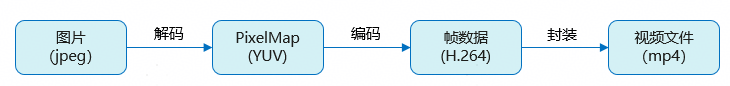

# 图片合成视频开发实践

更新时间：2026-04-01 09:49:00

来源：https://developer.huawei.com/consumer/cn/doc/best-practices/bpta-image-to-video-synthesis

## 概述


在个人相册制作、电商产品展示、理财销售回放等多个场景中，都需要将图片合成视频。开发者通过调用Image Kit、视频编码、媒体数据封装提供的接口，可以实现图片合成视频的功能。

- [Image Kit](https://developer.huawei.com/consumer/cn/doc/harmonyos-guides/image-overview)提供图片的解码、编码、编辑、元数据处理等功能。
- [视频编码](https://developer.huawei.com/consumer/cn/doc/harmonyos-guides/video-encoding)可将未压缩的视频数据压缩为视频码流，如H.264、H.265。
- [媒体数据封装](https://developer.huawei.com/consumer/cn/doc/harmonyos-guides/audio-video-muxer)可完成媒体文件的封装，将编码后的音视频数据，按一定的格式写入媒体文件中。


本文以图库图片合成视频场景为例，介绍图片解码、图片数据编码、视频生成的主要步骤，并给出开发过程中常见问题的分析思路和解决方案。


## 图库图片合成视频


### 场景描述


以将图库中的图片转换为MP4文件为例，本场景展示使用图片和编解码的基础能力来实现图片合成视频的功能。


### 实现原理


Image Kit中的PixelMap是用于读取或写入图像数据以及获取图像信息的图像像素类。在图片合成视频的过程中，首先将图片解码为PixelMap，然后使用Buffer模式编码，将PixelMap中保存的图像数据复制到编码器的输入buffer中，未压缩的YUV输出成已压缩的视频码流H.264，编码完成后封装成视频文件。





如果需要使用Surface模式编码，将图片解码成PixelMap后，需要先从编码器的NativeWindow申请buffer，然后将PixelMap中保存的图像数据复制到申请的buffer中并提交buffer，编码完成后再封装为视频文件，具体实现可以参考NativeWindow开发指导 (C/C++)。


### 开发步骤


1. 使用[PhotoViewPicker](https://developer.huawei.com/consumer/cn/doc/harmonyos-references/arkts-apis-photoaccesshelper-photoviewpicker)从图库中选择图片，数量不少于两张。当选择数量不足两张时，将弹出提示框。
```ts
// Use photoAccessHelper to pull up the gallery and select images.
let photoSelectOptions = new photoAccessHelper.PhotoSelectOptions();
photoSelectOptions.MIMEType = photoAccessHelper.PhotoViewMIMETypes.IMAGE_TYPE;
let photoPicker = new photoAccessHelper.PhotoViewPicker();
photoPicker
  .select(photoSelectOptions)
  .then(async (PhotoSelectResult: photoAccessHelper.PhotoSelectResult) => {
    this.imageUri = PhotoSelectResult.photoUris;
    if (this.imageUri.length < 2) {
      this.showToast($r('app.string.Please_select_at_least_two_images'), 2000);
      return;
    } else {
      this.dialogController.open();
      await this.processImages();
      this.synthesis();
    }
  })
  .catch((err: BusinessError) => {
    hilog.error(
      0x0000,
      TAG,
      `PhotoViewPicker.select failed, error: ${err.code}, ${err.message}`,
    );
  });
```
2. 遍历处理从图库选择的图片。（1）读取图片数据并创建ImageSource。 （2）配置图片解码参数，使用[imageSource.createPixelMap()](https://developer.huawei.com/consumer/cn/doc/harmonyos-references/arkts-apis-image-imagesource#createpixelmap7)获取解码后的PixelMap。
（3）将PixelMap保存到队列中。
```ts
// Decode the image and pass it to the native.
async processImages() {
  for (let i = 0; i < this.imageUri.length; i++) {
    // Read image file data.
    let imgData: ArrayBuffer | undefined;
    let imgFile: fileIo.File | undefined;
    try {
      imgFile = fileIo.openSync(this.imageUri[i], fileIo.OpenMode.READ_ONLY);
      let stat: fileIo.Stat = fileIo.statSync(imgFile.fd);
      imgData = new ArrayBuffer(stat.size);
      fileIo.readSync(imgFile.fd, imgData);
    } catch (err) {
      hilog.error(0x0000, 'testTag', `failed to open uri. code=${err.code},message=${err.message}`);
    } finally {
      if (imgFile) {
        try {
          fileIo.closeSync(imgFile);
        } catch (err) {
          hilog.error(0x0000, 'testTag', `failed to close fileIo. code=${err.code},message=${err.message}`);
        }
      }
    }
    // Decoding images.
    let imageSource: image.ImageSource | undefined;
    let pixelMap: image.PixelMap | undefined;
    try {
      imageSource = image.createImageSource(imgData);
      // Set the decoding bitmap size to be consistent with the first image.
      if (this.imageWidth === 0 && this.imageHeight === 0) {
        let imageInfo: image.ImageInfo = imageSource.getImageInfoSync();
        this.imageWidth = imageInfo.size.width;
        this.imageHeight = imageInfo.size.height;
      }
      let decodingOptions: image.DecodingOptions = {
        editable: true,
        desiredPixelFormat: image.PixelMapFormat.NV12,
        desiredSize: { width: this.imageWidth, height: this.imageHeight }
      }
      pixelMap = await imageSource.createPixelMap(decodingOptions);
      transcoding.pushPixelMap(pixelMap);
    } catch (err) {
      hilog.error(0x0000, 'testTag', `failed to add pictures. code=${err.code},message=${err.message}`);
    } finally {
      if (imageSource) {
        imageSource.release();
      }
      if (pixelMap) {
        pixelMap.release();
      }
    }
  }
}
```
3. 创建编码器和封装器。
（1）初始化视频编码环境。
```cpp
// Initialize the encoder environment, create and configure the muxer.
int32_t Transcoding::InitEncoder() {
  CHECK_AND_RETURN_RET_LOG(!isStarted_, AVCODEC_SAMPLE_ERR_ERROR, "Already started.");
  CHECK_AND_RETURN_RET_LOG(muxer_ == nullptr && videoEncoder_ == nullptr, AVCODEC_SAMPLE_ERR_ERROR,
  "Already started.");

  videoEncoder_ = std::make_unique<VideoEncoder>();
  muxer_ = std::make_unique<Muxer>();

  int32_t ret = muxer_->Create(sampleInfo_.outputFd);
  CHECK_AND_RETURN_RET_LOG(ret == AVCODEC_SAMPLE_ERR_OK, ret, "Create muxer with fd(%{public}d) failed",
  sampleInfo_.outputFd);
  ret = muxer_->Config(sampleInfo_);

  CHECK_AND_RETURN_RET_LOG(ret == AVCODEC_SAMPLE_ERR_OK, ret, "Create audio encoder failed");

  ret = CreateVideoEncoder();
  CHECK_AND_RETURN_RET_LOG(ret == AVCODEC_SAMPLE_ERR_OK, ret, "Create video encoder failed");

  AVCODEC_SAMPLE_LOGI("Succeed");
  return AVCODEC_SAMPLE_ERR_OK;
}
```


（2）创建封装器。
```cpp
int32_t Muxer::Create(int32_t fd) {
  muxer_ = OH_AVMuxer_Create(fd, AV_OUTPUT_FORMAT_MPEG_4);
  CHECK_AND_RETURN_RET_LOG(muxer_ != nullptr, AVCODEC_SAMPLE_ERR_ERROR, "Muxer create failed, fd: %{public}d", fd);
  return AVCODEC_SAMPLE_ERR_OK;
}
```


（3）创建编码器。
```cpp
// Create and configure encoder.
int32_t Transcoding::CreateVideoEncoder() {
  int32_t ret = videoEncoder_->Create(sampleInfo_.outputVideoCodecMime);
  CHECK_AND_RETURN_RET_LOG(ret == AVCODEC_SAMPLE_ERR_OK, ret, "Create video encoder failed");

  videoEncContext_ = new CodecUserData;
  ret = videoEncoder_->Config(sampleInfo_, videoEncContext_);
  CHECK_AND_RETURN_RET_LOG(ret == AVCODEC_SAMPLE_ERR_OK, ret, "Encoder config failed");

  return AVCODEC_SAMPLE_ERR_OK;
}
```
4. 对图片进行编码和封装。
（1）启动编码器和封装器，启动编码输入输出处理线程。
```cpp
// Start the encoder, create input and output thread.
int32_t Transcoding::Start() {
  std::unique_lock<std::mutex> lock(mutex_);
  int32_t ret;
  CHECK_AND_RETURN_RET_LOG(!isStarted_, AVCODEC_SAMPLE_ERR_ERROR, "Already started.");
  if (videoEncContext_) {
    CHECK_AND_RETURN_RET_LOG(videoEncoder_ != nullptr && muxer_ != nullptr, AVCODEC_SAMPLE_ERR_ERROR,
    "Already started.");
    int32_t ret = muxer_->Start();
    CHECK_AND_RETURN_RET_LOG(ret == AVCODEC_SAMPLE_ERR_OK, ret, "Muxer start failed");
    ret = videoEncoder_->Start();
    isStarted_ = true;
    CHECK_AND_RETURN_RET_LOG(ret == AVCODEC_SAMPLE_ERR_OK, ret, "Encoder start failed");
    videoEncInputThread_ = std::make_unique<std::thread>(&Transcoding::VideoEncInputThread, this);
    videoEncOutputThread_ = std::make_unique<std::thread>(&Transcoding::VideoEncOutputThread, this);
    if (videoEncInputThread_ == nullptr || videoEncOutputThread_ == nullptr) {
      AVCODEC_SAMPLE_LOGE("Create thread failed");
      StartRelease();
      return AVCODEC_SAMPLE_ERR_ERROR;
    }
  }
  if (isReleased_) {
    isReleased_ = false;
    videoEncContext_->outputFrameCount = 0;
  }
  AVCODEC_SAMPLE_LOGI("Succeed");
  doneCond_.notify_all();
  return AVCODEC_SAMPLE_ERR_OK;
}
```


（2）编码器输入线程从PixelMap队列中取出待编码数据，然后复制到编码器输入队列中。
```cpp
// Encoding input thread.
void Transcoding::VideoEncInputThread() {
  while (true) {
    OH_LOG_ERROR(LOG_APP, "do VideoEncInputThread while");
    std::unique_lock<std::mutex> lock(videoEncContext_->outputMutex);
    bool condRet = videoEncContext_->inputCond.wait_for(
    lock, 5s, [this]() { return !isStarted_ || !videoEncContext_->inputBufferInfoQueue.empty(); });
    CHECK_AND_BREAK_LOG(isStarted_, "Work done, thread out");
    CHECK_AND_CONTINUE_LOG(!videoEncContext_->inputBufferInfoQueue.empty(),
    "Buffer queue is empty, continue, cond ret: %{public}d", condRet);
    // get Buffer from inputBufferInfoQueue.
    CodecBufferInfo bufferInfo = videoEncContext_->inputBufferInfoQueue.front();
    videoEncContext_->inputBufferInfoQueue.pop();
    videoEncContext_->inputFrameCount++;
    lock.unlock();
    if (!pictures.empty()) {
      // Get the data of the current frame.
      OH_PixelmapNative *currentFrame = pictures.front();
      pictures.pop();
      CopyStrideYUV420SP(bufferInfo, currentFrame);
    } else {
      bufferInfo.attr.size = 0;
      bufferInfo.attr.offset = 0;
      bufferInfo.attr.pts = 0;
      bufferInfo.attr.flags = AVCODEC_BUFFER_FLAGS_EOS;
    }
    int32_t ret = videoEncoder_->PushInputBuffer(bufferInfo);
    CHECK_AND_BREAK_LOG(ret == AVCODEC_SAMPLE_ERR_OK, "Push data failed, thread out");
    AVCODEC_SAMPLE_LOGW(
    "Out bufferInfo flags: %{public}u, offset: %{public}d, pts: %{public}u, size: %{public}" PRId64,
    bufferInfo.attr.flags, bufferInfo.attr.offset, bufferInfo.attr.pts, bufferInfo.attr.size);
    if (bufferInfo.attr.flags & AVCODEC_BUFFER_FLAGS_EOS) {
      AVCODEC_SAMPLE_LOGW("VideoDecOutputThread Catch EOS, thread out" PRId64);
      break;
    }
  }
}
```


（3）编码器输出线程从编码器输出队列中取出已编码的数据送入封装器。
```cpp
// Encoding output thread.
void Transcoding::VideoEncOutputThread() {
  while (true) {
    std::unique_lock<std::mutex> lock(videoEncContext_->outputMutex);
    bool condRet = videoEncContext_->outputCond.wait_for(
    lock, 5s, [this]() { return !isStarted_ || !videoEncContext_->outputBufferInfoQueue.empty(); });
    CHECK_AND_BREAK_LOG(isStarted_, "Work done, thread out");
    CHECK_AND_CONTINUE_LOG(!videoEncContext_->outputBufferInfoQueue.empty(),
    "Buffer queue is empty, continue, cond ret: %{public}d", condRet);

    CodecBufferInfo bufferInfo = videoEncContext_->outputBufferInfoQueue.front();
    videoEncContext_->outputBufferInfoQueue.pop();
    CHECK_AND_BREAK_LOG(!(bufferInfo.attr.flags & AVCODEC_BUFFER_FLAGS_EOS),
    "VideoEncOutputThread  Catch EOS, thread out");
    lock.unlock();
    if ((bufferInfo.attr.flags & AVCODEC_BUFFER_FLAGS_SYNC_FRAME) ||
    (bufferInfo.attr.flags == AVCODEC_BUFFER_FLAGS_NONE)) {
      videoEncContext_->outputFrameCount++;
      bufferInfo.attr.pts = videoEncContext_->outputFrameCount * MICROSECOND / sampleInfo_.outputFrameRate;
    } else {
      bufferInfo.attr.pts = 0;
    }
    AVCODEC_SAMPLE_LOGW("Out buffer count: %{public}u, size: %{public}d, flag: %{public}u, pts: %{public}" PRId64,
    videoEncContext_->outputFrameCount, bufferInfo.attr.size, bufferInfo.attr.flags,
    bufferInfo.attr.pts);
    muxer_->WriteSample(muxer_->GetVideoTrackId(), reinterpret_cast<OH_AVBuffer *>(bufferInfo.buffer),
    bufferInfo.attr);
    int32_t ret = videoEncoder_->FreeOutputBuffer(bufferInfo.bufferIndex);
    CHECK_AND_BREAK_LOG(ret == AVCODEC_SAMPLE_ERR_OK, "Encoder output thread out");
    CHECK_AND_BREAK_LOG(videoEncContext_->outputFrameCount != sampleInfo_.imgCount, "Encoder output thread out");
  }
  AVCODEC_SAMPLE_LOGI("Exit, frame count: %{public}u", videoEncContext_->outputFrameCount);
  StartRelease();
}
```
5. 所有图片都处理完成后，使用[Video](https://developer.huawei.com/consumer/cn/doc/harmonyos-references/ts-media-components-video)组件播放合成后的视频。
```ts
// Play videos using the Video component.
Video({
  src: this.videoSrc,
  controller: this.controller,
})
  .width('100%')
  .height('100%')
  .autoPlay(true)
  .controls(false)
  .objectFit(1)
  .zIndex(0)
  .onPrepared((event) => {
    if (event) {
      this.durationTime = event.duration;
    }
  })
  .onUpdate((event) => {
    if (event) {
      this.currentTime = event.time;
    }
  })
  .onFinish(() => {
    this.isStart = !this.isStart;
  })
  .transition(
    TransitionEffect.OPACITY.animation({ duration: 1000, curve: Curve.Sharp }),
  );
```
6. 使用[SaveButton](https://developer.huawei.com/consumer/cn/doc/harmonyos-references/ts-security-components-savebutton)安全控件，将视频保存到图库。
（1）创建安全控件按钮。
```ts
// Use SaveButton Component to Save Video.
SaveButton({ text: SaveDescription.SAVE_TO_GALLERY })
  .width('100%')
  .height(40)
  .backgroundColor(this.showVideo ? 'rgba(10,89,247)' : 'rgba(10,89,247,0.4)')
  .onClick(async (event, result: SaveButtonOnClickResult) => {
    if (!this.showVideo) {
      return;
    }
    if (result === SaveButtonOnClickResult.SUCCESS) {
      try {
        this.saveVideo();
        this.showToast($r('app.string.Save_Success'));
      } catch (err) {
        hilog.error(
          0x0000,
          TAG,
          'createAsset failed, error: ' + JSON.stringify(err),
        );
      }
    } else {
      hilog.error(0x0000, TAG, 'SaveButtonOnClickResult create asset failed.');
    }
  });
```

 （2）调用[MediaAssetChangeRequest.createImageAssetRequest()](https://developer.huawei.com/consumer/cn/doc/harmonyos-references/kts-apis-photoaccesshelper-mediaassetchangerequest#createimageassetrequest11)和[PhotoAccessHelper.applyChanges()](https://developer.huawei.com/consumer/cn/doc/harmonyos-references/arkts-apis-photoaccesshelper-photoaccesshelper#applychanges11)接口，将视频保存到图库。
```ts
// Save videos using photoAccessHelper.
saveVideo() {
  let context = this.getUIContext().getHostContext();
  let phAccessHelper = photoAccessHelper.getPhotoAccessHelper(context);
  let assetChangeRequest: photoAccessHelper.MediaAssetChangeRequest | undefined;
  try {
    assetChangeRequest =
    photoAccessHelper.MediaAssetChangeRequest.createVideoAssetRequest(context, this.videoSrc);
  } catch (error) {
    let err = error as BusinessError;
    hilog.error(0x0000, 'openSync', `openSync failed. code =${err.code}, message =${err.message}`);
  }
  phAccessHelper.applyChanges(assetChangeRequest).then(() => {
    hilog.info(0x0000, 'testTag', '%{public}s', 'apply Changes successfully');
  }).catch((err: BusinessError) => {
    hilog.error(0x0000, 'testTag', `apply Changes failed. code=${err.code},message=${err.message}`);
  });
}
```


## 常见问题


### 合成后的视频出现花屏


问题根因

buffer复制时没有考虑跨距的问题。视频编码需要注意宽高对齐，处理对应的跨距。

解决方案

将图片数据复制到编码器的输入buffer时，应依据编码器的跨距值进行复制，跨距值可通过接口OH_VideoEncoder_GetInputDescription()获取。

1. 获取编码器的跨距值。
```cpp
// Add the index and pointer of the input buffer to the inputBufferInfoQueue.
void SampleCallback::OnNeedInputBuffer(OH_AVCodec *codec, uint32_t index, OH_AVBuffer *buffer, void *userData) {
  if (userData == nullptr) {
    return;
  }
  CodecUserData *codecUserData = static_cast<CodecUserData *>(userData);
  // Process the first frame and obtain the width, height, and stride of the image.
  if (codecUserData->isEncFirstFrame) {
    OH_AVFormat *format = OH_VideoEncoder_GetInputDescription(codec);
    OH_AVFormat_GetIntValue(format, OH_MD_KEY_VIDEO_PIC_WIDTH, &codecUserData->width);
    OH_AVFormat_GetIntValue(format, OH_MD_KEY_VIDEO_PIC_HEIGHT, &codecUserData->height);
    OH_AVFormat_GetIntValue(format, OH_MD_KEY_VIDEO_STRIDE, &codecUserData->widthStride);
    OH_AVFormat_GetIntValue(format, OH_MD_KEY_VIDEO_SLICE_HEIGHT, &codecUserData->heightStride);
    OH_AVFormat_Destroy(format);
    codecUserData->isEncFirstFrame = false;
  }
  std::unique_lock<std::mutex> lock(codecUserData->inputMutex);
  codecUserData->inputBufferInfoQueue.emplace(index, buffer);
  codecUserData->inputCond.notify_all();
}
```
2. 按照编码器的跨距值进行复制。
```cpp
// Copy the YUV 420SP format image data into the buffer while considering the stride of the image.
void Transcoding::CopyStrideYUV420SP(CodecBufferInfo &bufferInfo, OH_PixelmapNative *pixelmap) {
  // Obtain the info of the Pixelmap.
  OH_Pixelmap_ImageInfo *imageInfo = nullptr;
  OH_PixelmapImageInfo_Create(&imageInfo);
  OH_PixelmapNative_GetImageInfo(pixelmap, imageInfo);
  uint32_t width;
  uint32_t height;
  OH_PixelmapImageInfo_GetWidth(imageInfo, &width);
  OH_PixelmapImageInfo_GetHeight(imageInfo, &height);
  OH_PixelmapImageInfo_Release(imageInfo);

  // Read the data of the current frame to oneFrameData.
  size_t bufferSize = width * height * 3 / 2;
  uint8_t *oneFrameData = new uint8_t[bufferSize];
  OH_PixelmapNative_ReadPixels(pixelmap, oneFrameData, &bufferSize);
  uint8_t *inputBufferAddr = OH_AVBuffer_GetAddr(reinterpret_cast<OH_AVBuffer *>(bufferInfo.buffer));
  // handle Stride.
  uint8_t *dst = inputBufferAddr;
  uint8_t *src = oneFrameData;
  uint32_t srcHeight = height;
  int32_t videoStrideWidth = videoEncContext_->widthStride;
  int32_t videoStrideHeight = videoEncContext_->heightStride;
  // Y -> Copy the source data of region Y to the target data of another region.
  for (int32_t i = 0; i < srcHeight; ++i) {
    std::memcpy(dst, src, width);
    dst += videoStrideWidth;
    src += width;
  }
  // padding -> Update pointers to both the data source and target data, with pointers moving down one
  // padding.
  dst += (videoStrideHeight - height) * videoStrideWidth;
  srcHeight >>= 1;
  // UV -> Copy the source data of the UV area to the target data of another area.
  for (int32_t i = 0; i < srcHeight; ++i) {
    std::memcpy(dst, src, width);
    dst += videoStrideWidth;
    src += width;
  }
  bufferInfo.attr.size = videoStrideWidth * videoStrideHeight * 3 / 2;
  bufferInfo.attr.flags = AVCODEC_BUFFER_FLAGS_NONE;
  delete[] oneFrameData;
}
```


## 示例代码


- [实现图片合成视频功能](https://gitcode.com/harmonyos_samples/ImageToVideo/tree/master)
