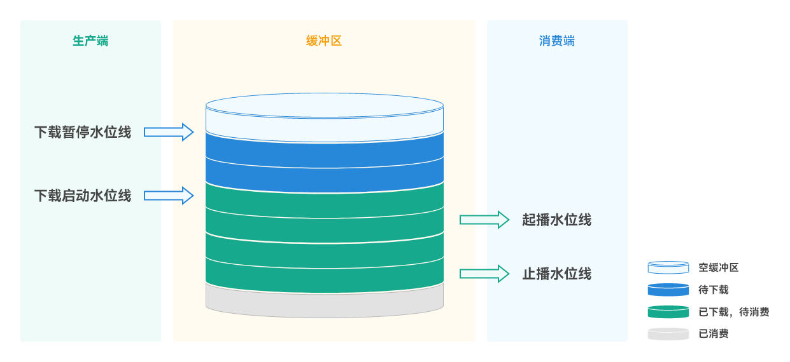
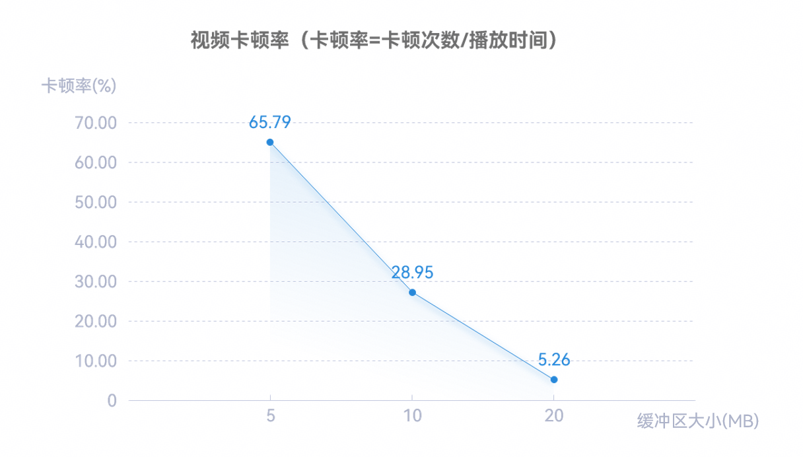
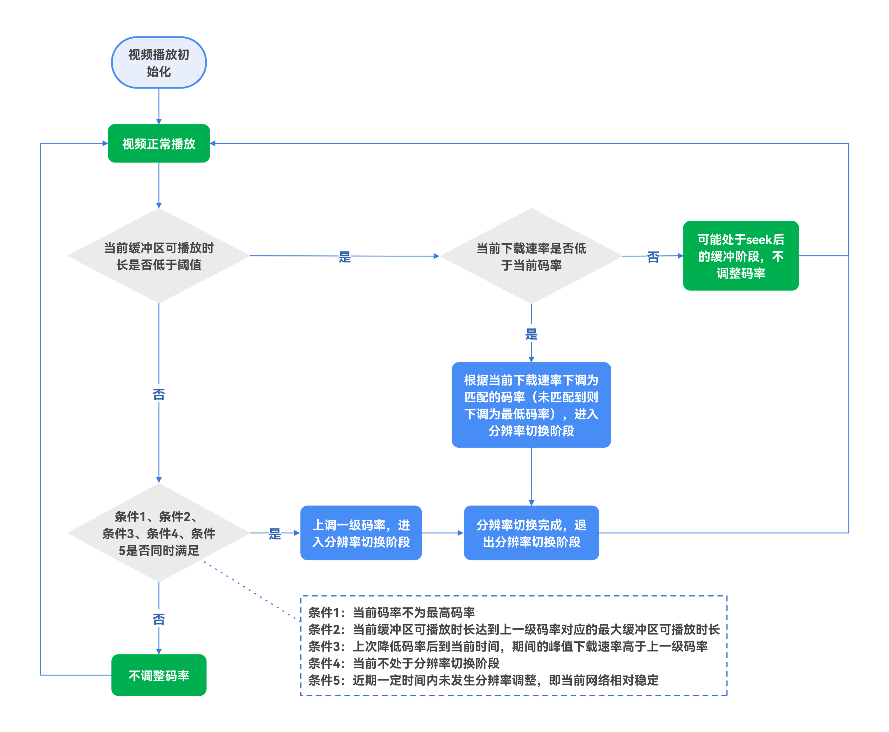

# 在线视频播放卡顿优化

更新时间：2026-03-12 08:45:02

来源：https://developer.huawei.com/consumer/cn/doc/best-practices/bpta-online-video-playback-lags-practice

**   


##### 概述

在观看在线视频时，流畅播放是至关重要的。当使用[AVPlayer](https://developer.huawei.com/consumer/cn/doc/harmonyos-references/arkts-apis-media-avplayer)组件配合[XComponent](https://developer.huawei.com/consumer/cn/doc/harmonyos-references/ts-basic-components-xcomponent)组件渲染播放在线视频时，有时会出现在线视频播放卡顿的问题。此问题通常由于设备网络环境较差或需加载高码率片源，导致视频缓冲时间不足，从而引起播放卡顿。当视频缓冲时间不足时，设备需要频繁从服务器下载视频数据，可能导致视频播放卡顿甚至停止。为应对这一问题，有以下两种优化方案：
 
- 通过合理地设置[preferredBufferDuration](https://developer.huawei.com/consumer/cn/doc/harmonyos-references/arkts-apis-media-i#playbackstrategy12)属性增加视频缓冲时间。在网络环境较差时，这种方案可以确保有更多的可用缓冲，从而提高视频播放的流畅性。
- 对于流媒体格式，可以通过setBitrate()合理调整码率，以动态调节视频缓冲的压力。在网络环境较差时，这种方案可以通过降低画面质量来换取播放的流畅性。当前AVPlayer支持的流媒体格式请参阅[setBitrate()](https://developer.huawei.com/consumer/cn/doc/harmonyos-references/arkts-apis-media-avplayer#setbitrate9)接口说明。

 
 

##### 实现原理

 

##### 缓冲区工作过程

对于缓冲区而言，下载线程是生产端，读取线程则是消费端。生产端将数据写入到缓冲区中，消费端则从缓冲区读取数据，下面将介绍下缓冲区中的几个水位线概念。
 
图1 **缓冲区原理图**


 
 
如上图所示：
 
- 起播水位线：限制消费方行为，限制最低消费额度的数值，只有缓冲区达到此数值后，才允许（通知）读取线程进行数据读取。
- 止播水位线：限制消费方行为，保留最低额度的数值（可以类比理解为账户最低余额），避免将缓冲区中的可用数据耗尽。
- 下载启动水位线：限制生产方行为，当前读取位置的连续数据低于某个数值时，启动下载，确保消费的连续性。
- 下载暂停水位线：限制生产方行为，在缓冲区写满时，暂停下载。

  
| 水位线 | 默认值 | 说明 |
| --- | --- | --- |
| 起播水位线 | 若下载速率 >= 码率，起播水位线取值：0.3秒 * 码率 若下载速率 < 码率，起播水位线取值：5秒 * 码率 若起播水位线小于10KB，取10KB | 在快速起播和顺滑播放间进行一个相对合理的分割。 |
| 止播水位线 | 单次读取数据量，若小于5KB则取5KB | 避免将缓冲区中的可用数据耗尽。 |
| 下载启动水位线 | 480KB | 降低线程启动频率，进行集中下载，降低cpu及指令数消耗。 |
| 下载暂停水位线 | 缓冲区大小 | 当缓冲区写满时，停止下载，支持修改。 |
 
 
> [!NOTE]
> 下载速率：单位时间（不小于500ms）内写入缓冲区的数据。（下载速率统计的最小周期是500ms，也就是最少要500ms统计一次） 码率：通过码流描述信息解析出的媒体码率。 当缓冲区写满时，按照读取的先后顺序依次释放已读数据，以避免缓冲区满导致数据无法写入。

 
AVPlayer的缓冲区工作原理如下：
 1. 当AVPlayer开始播放时，它会从服务器请求数据，并将其存储到内存中的缓冲区。
2. 当缓冲区存储量达到播放标准时（起播水位线），才可以从缓冲区读取下载数据，从而进行视频播放。
3. 视频播放过程是多线程的，读取和下载分别由两个线程执行。在正常播放时，视频一边播放一边下载。当缓冲区数据量低于止播水位线时，播放会暂停（读取线程停止读取），等下载一定数据，达到起播水位线后，视频恢复播放。
 

##### 多码率视频流切换过程

传统的.mp4或.flv视频格式以单个文件为单位，包含完整的视频和音轨数据。这些格式在视频较短时表现良好，但当视频较长时，处理弱网络环境的能力较差，且在切换分辨率时需要重新加载整个视频资源，用户会明显感受到卡顿。相比之下，流媒体协议（例如HLS或DASH）基于分片加载和播放视频，可以动态调整不同的码率，从而在弱网络条件下表现更佳，且在码率切换时能提供更流畅的用户体验。以下将简要介绍视频流多码率切换的流程。
 
图2 **多码率流切换示例图**


 
如上图所示：
 1. 视频提供三种不同码率的流，每种码率的流都包含完整的视频播放分片数据。初始播放从第1个分片开始，采用高码率。
2. 当播放环境变差（例如网络质量下降），视频在播放第2个分片时切换至中码率，并以中码率继续播放第3个分片。
3. 当播放环境进一步恶化，视频在播放第4个分片时调整至低码率，并以低码率继续播放第5个和第6个分片。
4. 当播放环境逐步恢复（例如网络质量恢复），视频后续的第7个、第8个和第9个分片的码率会逐步调回高码率。
 
 

##### AVPlayer开发流程

为了实现上述两种优化方案，需要在视频播放前对AVPlayer进行相应的初始化操作，包括注册回调和设置媒体源等。关键开发流程如下：
 1. 调用[createAVPlayer()](https://developer.huawei.com/consumer/cn/doc/harmonyos-references/arkts-apis-media-f#mediacreateavplayer9)创建AVPlayer实例，初始AVPlayer为idle状态。
2. 对于视频流格式，可以注册以下回调，用于获取码率、分辨率以及缓存相关信息。

  
- [on('availableBitrates')](https://developer.huawei.com/consumer/cn/doc/harmonyos-references/arkts-apis-media-avplayer#onavailablebitrates9)回调会在切换为prepared状态后被触发，返回当前视频流的可选码率列表。后续可通过setBitrate()设置列表中的对应码率。

3. [on('bitrateDone')](https://developer.huawei.com/consumer/cn/doc/harmonyos-references/arkts-apis-media-avplayer#onbitratedone9)回调会在setBitrate()方法成功设置码率后触发。

4. [on('videoSizeChange')](https://developer.huawei.com/consumer/cn/doc/harmonyos-references/arkts-apis-media-avplayer#onvideosizechange9)回调会在视频大小信息调整后被触发。在码率设置完成后，AVPlayer会缓冲新码率的视频数据，但会先消耗旧码率的视频数据。在将要消耗新码率的视频数据时，才会触发上述回调。

5. [on('bufferingUpdate')](https://developer.huawei.com/consumer/cn/doc/harmonyos-references/arkts-apis-media-avplayer#onbufferingupdate9)是AVPlayer在视频播放过程中提供的一个回调，反映了缓冲区的变化情况，返回值内容可参考[BufferingInfoType](https://developer.huawei.com/consumer/cn/doc/harmonyos-references/arkts-apis-media-e#bufferinginfotype8)。其中类型为CACHED_DURATION的返回值表示缓冲区已缓冲数据预估可播放时长，当其值较低时表明视频可能将要卡顿。可结合上述返回值以及视频下载速率设置不同的码率切换逻辑，其中视频下载速率可通过步骤4中设置的定时器定期获取。

6. 配置媒体源和播放策略，初始化视频播放资源，并设置surfaceID属性以保证视频窗口正常显示，此后AVPlayer进入prepared状态。

  
使用AVPlayer的[setMediaSource()](https://developer.huawei.com/consumer/cn/doc/harmonyos-references/arkts-apis-media-avplayer#setmediasource12)方法设置媒体源以及播放策略。其中媒体源可使用[createMediaSourceWithUrl()](https://developer.huawei.com/consumer/cn/doc/harmonyos-references/arkts-apis-media-f#mediacreatemediasourcewithurl12)方法自行创建，也可以直接设置AVPlayer的url属性。播放策略中的preferredBufferDuration用于设置播放器的缓冲区大小，AVPlayer会根据preferredBufferDuration属性的值来决定缓冲区的大小。

7. AVPlayer的surfaceID属性需要在创建XComponent后获取，请参考[通过XComponent创建surfaceId](https://developer.huawei.com/consumer/cn/doc/harmonyos-references/ts-basic-components-xcomponent#getxcomponentsurfaceid9)。

8. 对于视频流格式，设置一个定时器以定期获取下载速率，并记录近期的下载速率。

  
[getPlaybackInfo()](https://developer.huawei.com/consumer/cn/doc/harmonyos-references/arkts-apis-media-avplayer#getplaybackinfo12)可在AVPlayer进入prepared状态后被主动调用，用于获取播放过程中的部分信息，包括视频的平均下载速率以及1s内的下载速率。

9. 为了避免个别突变的下载速率影响码率切换的决策，建议使用多个近期下载速率的平均值作为决策标准。

  在完成上述配置后，可调用AVPlayer相应的播控方法进入视频播放流程，相关开发流程请参考[使用AVPlayer播放视频](https://developer.huawei.com/consumer/cn/doc/harmonyos-guides/video-playback)。

  

  ##### 合理设置缓冲区大小

  为应对弱网环境和高码率视频源导致的卡顿问题，一种方案是根据文件大小合理设置缓冲区大小。缓冲区越大，能够缓存的视频数据量就越多，在遇到弱网环境或切换到高码率视频源时可正常播放的时间也越久，进而减少或推迟卡顿的发生。但缓冲区过大也会导致内存占用高，因此需要合理设置缓冲区大小。

  当前AVPlayer支持自定义缓冲区大小，用户可通过[setMediaSource()](https://developer.huawei.com/consumer/cn/doc/harmonyos-references/arkts-apis-media-avplayer#setmediasource12)方法调整PlaybackStrategy中的preferredBufferDuration参数。preferredBufferDuration的单位为秒，缓冲区大小将被设定为preferredBufferDuration * 1MB。例如，将preferredBufferDuration设为20秒，缓冲区大小将被设置为20MB。

| 默认缓冲区大小 | 用户自定义缓冲区大小 |

| --- | --- |

| 20MB | 5MB ~ 20MB |

  参照上表提供的自定义缓冲区大小的范围，当视频较小时，可以将缓冲区大小设置为视频文件的大小；当视频大小超过用户设定的最大缓冲区值20MB时，此时应将缓冲区设置为最大值20MB。以下是一个配置preferredBufferDuration的示例。

  
```ArkTS
// entry/src/main/ets/common/CustomConfigs.ets
export class CustomConfigs {
  // ...
  public static readonly PREFERRED_BUFFER_SIZE = 20;

  public static readonly PLAYBACK_STRATEGY: media.PlaybackStrategy = {
    preferredWidth: 1920,
    preferredHeight: 1080,
    preferredBufferDuration: CustomConfigs.PREFERRED_BUFFER_SIZE
  };
  // ...
}
```
 
```ArkTS
// entry/src/main/ets/viewmodel/AVPlayerController.ets
public async initAVPlayer(id: string, source: media.MediaSource, strategy: media.PlaybackStrategy) {
  // ...
    this.source = source;
    this.strategy = strategy;
    this.avPlayer.setMediaSource(this.source, this.strategy);
  } catch (error) {
    Logger.error(`initAVPlayer error: ${JSON.stringify(error)}`);
  }
}
```
 本节的测试场景为在弱网络条件下使用AVPlayer+XComponent渲染并播放一个大小为56MB的在线视频。

| 用户自定义缓冲区大小 | 卡顿率（卡顿率=卡顿次数/播放时间） |

| --- | --- |

| 5MB | 65.79% |

| 10MB | 28.95% |

| 20MB | 5.26% |

  图3 **视频卡顿率折线图

  



  从实验数据可以看出，当媒体文件大小超过可设置的缓冲区最大值时，缓冲区越大，视频卡顿率越低，将缓冲区设置为最大值20MB，可最大程度减少视频卡顿。

  
> [!NOTE]
> 测试时，播放时间的长短需结合测试目标和场景综合判断，通常建议为3-5分钟。 循环播放时，若应用会重新创建下载实例， 则新的实例 会重新下载数据 。 循环播放时，若应用不会重新创建下载实例，且媒体文件大小，小于缓冲区大小， 则会循环读取已下载数据，不会重新触发下载 。 循环播放时，若应用不会重新创建下载实例，且媒体文件大小，大于缓冲区大小， 则会循环下载超出缓冲区部分的数据 。


  

  ##### 合理调整视频流码率

  对于HLS/DASH视频流，为了应对弱网环境，除了设置尽可能大的缓冲区外，还可以在播放过程中动态调整码率，基本的调整思路如下：

  
当缓冲区内容可播放时长低，且当前视频下载速率低于码率时，可以考虑下调码率。为了保证视频播放流畅性，可以选择较为激进的下调策略。例如检测到下载速率低于码率时立即降低码率，且根据下载速率的不同允许码率多级下调。
- 当缓冲区内容可播放时长充足，且当前视频下载速率高于码率时，可以考虑上调码率。为了避免码率频繁切换，可以选择较为保守的上调策略，额外增加一些限制条件。例如在检测到下载速率高于码率时，等待缓冲区充分填充后才允许上调码率，且每次仅允许上调一级。

 
AVPlayer当前默认支持HLS/DASH视频流的码率自适应调节，但此功能会在调用一次setBitrate()后完全失效，此后需要开发者手动管理码率切换，建议自行设计码率切换策略。下面是一个基于AVPlayer实现的码率调整策略示例。
 
**图4 **码率调整策略示例流程图


1. 注册码率信息相关回调，包括on('availableBitrates')、on('bitrateDone')、on('videoSizeChange')。

  
```ArkTS
// entry/src/main/ets/viewmodel/AVPlayerController.ets
private setCustomCallback(avPlayer: media.AVPlayer) {
  avPlayer.on('availableBitrates', (bitrateList: Array<number>) => {
    // ...
    // Obtain the list of optional bitrates, sort them in ascending order, and save them.
    this.bitrateList = bitrateList.sort((a, b) => (a - b));
    // ...
    // Preset a bitrate, block AVPlayer's adaptive logic, and reset the peak download rate.
    this.setBitrate(this.bitrateList[bitrateListLength - 1]);
    // ...
  });
  avPlayer.on('bitrateDone', (bitrate: number) => {
    // ...
    // When the bitrate is set successfully, record the current bitrate with the index value recorded here.
    this.currentBitrateIndex = this.bitrateList.findIndex((value) => value === bitrate);
  });
  avPlayer.on('videoSizeChange', (width: number, height: number) => {
    // ...
    // If the resolution switching is successful, record the current resolution. Here, record the index value, which
    // is consistent with the current bitrate.
    this.currentResolutionIndex = this.currentBitrateIndex;
    // ...
  });
  // ...
}
```

2. 设置定时器，内部使用getPlaybackInfo()获取下载速率。

  
- 由于AVPlayer下载速率为单位时间（不小于500ms）内写入缓冲区的数据，因此定时器需要不低于500ms。此处设置定时器为500ms。

3. 建议采用近期多次下载速率的平均值而非单次下载速率，以减轻个别突变速率对码率切换决策的影响。此处使用近期3次下载速率的平均值作为码率调整标准。

4. 在on('bufferingUpdate')回调内，结合缓存信息以及下载速率信息，实现码率自定义调整策略。

  
下调码率：当视频剩余可播放时长低于当前缓存区最大可播放时长的指定比例时，根据视频当前下载速率下调当前码率。

5. 上调码率：满足以下五个条件后，考虑上调一级码率：
当前视频码率不为最高码率。

6. 缓存剩余可播放时长达到上一级码率的最大缓存可播放时长，保证切换期间已缓冲数据可播放时长充足。

7. 近期峰值下载速率大于上一级码率，表明网络情况可能恢复。

8. 当前不处于分辨率调整阶段，即码率完成切换但分辨率未切换的情况，避免频繁上调码率。

9. 近期一定时间内未发生分辨率调整，即当前网络相对稳定。

 
```ArkTS
// entry/src/main/ets/viewmodel/AVPlayerController.ets
private setCustomCallback(avPlayer: media.AVPlayer) {
  // ...
  avPlayer.on('bufferingUpdate', (infoType: media.BufferingInfoType, value: number) => {
    // ...
    // When the playable duration of the video cache is less than the set threshold, adjust the bitrate according to
    // the current download rate.
    if (value < CustomConfigs.CACHED_PERCENT_THRESHOLD * this.maxBufferValueList[this.currentBitrateIndex!]) {
      // Match the bitrate lower than the current download rate; if no match is found, select the lowest bitrate.
      const targetBitrate = this.findTargetBitrate();
      if (targetBitrate < this.bitrateList[this.currentBitrateIndex!]) {
        this.autoReduceBitrate(targetBitrate);
      }
    } else {
      // The bitrate shall be increased by one level when all the following five conditions are simultaneously met:
      // 1. The current bitrate is not the maximum bitrate.
      // 2. The playable duration of the video cache at the current bitrate reaches the maximum playable duration of
      //    the cache corresponding to the next higher bitrate.
      // 3. The recent peak network download rate is greater than the next higher bitrate.
      // 4. The system is not currently in the state of resolution switching.
      // 5. No resolution adjustment has occurred within a recent certain period, indicating relatively stable network
      //    conditions.
      const nextBitrateIndex = this.currentBitrateIndex! + 1;
      if (nextBitrateIndex < this.bitrateList.length && value > this.maxBufferValueList[nextBitrateIndex] &&
        this.maxDownloadRate >= this.bitrateList[nextBitrateIndex] &&
        !this.isNewResolutionCaching() && this.isBitrateUpAvailable) {
        this.autoIncreaseBitrate(this.bitrateList[nextBitrateIndex]);
      }
    }
  });
  // ...
}
```
 


 

 
本节的测试场景为使用AVPlayer+XComponent渲染并播放包含低、中、高三种码率（分别对应低、中、高三种分辨率）的HLS视频流，视频时长为10min。初始条件设置preferredBufferDuration为20MB，并播放前使用setBitrate()将视频设置为高码率（使AVPlayer内部的自适应切换逻辑失效）。视频播放过程中，首先在正常网络环境下播放两分钟，随后切换至较差网络环境播放两分钟，最后再切换回正常网络环境持续播放至视频结束。整个播放过程中视频码率以及分辨率变化如下：
  
| 时间范围 | 网络状况 | 码率 | 分辨率 | 说明 |
| --- | --- | --- | --- | --- |
| 0~120s | 正常 | 高 | 高 | 视频初始为高分辨率，正常播放。此阶段由于网络质量正常，高码率下视频数据充分缓冲。 |
| 121~157s | 较差 | 高 | 高 | 进入较差网络环境，由于视频剩余缓存数据充足，表现为以高码率继续播放。此阶段由于网络情况较差，高码率下消耗数据的速率大于缓冲数据的速率，因此缓冲数据量整体处于下降趋势。 |
| 158~168s | 较差 | 低 | 高 | 视频剩余缓存数据低于码率切换阈值，切换为低码率。此阶段开始缓冲低码率下的视频数据，同时继续消耗高码率剩余的视频数据。 |
| 169~240s | 较差 | 低 | 低 | 高码率剩余的视频数据消耗完成，低码率下的视频数据缓存值已达到起播水位线，切换至低分辨率。此阶段低码率下视频数据充分缓冲。 |
| 241~353s | 正常 | 中 | 低 | 网络环境恢复正常，且距离上次分辨率调整完成时间较久，考虑上调码率。由于低码率下的视频缓冲值可播放时长充分，且峰值网络速率满足中码率要求，因此上调一级码率为中码率。此阶段开始缓冲中码率下的视频数据，不断消耗低码率剩余的视频数据，表现为低分辨率。 |
| 354~363s | 正常 | 中 | 中 | 低码率下的视频数据消耗完成，中码率下的视频数据缓存值已达到起播水位线，切换至中分辨率。此阶段中码率下视频数据充分缓冲。 |
| 364~408s | 正常 | 高 | 中 | 距离上次分辨率调整完成时间较久，考虑上调码率。由于中码率下的视频缓冲值可播放时长充分，且峰值网络速率满足高码率要求，因此上调一级码率为高码率。此阶段开始缓冲高码率下的视频数据，不断消耗中码率剩余的视频数据，表现为中分辨率。 |
| 409~600s | 正常 | 高 | 高 | 中码率下的视频数据消耗完成，高码率下的视频数据缓存值已达到起播水位线，切换至高分辨率。此阶段以高分辨率正常播放至视频结尾。 |
 
 
从上述数据可以看出：
 1. 在进入较差网络环境后的前期阶段，视频播放以消耗缓存数据为主。因此设置较大的preferredBufferDuration能够在进入较差网络环境前缓冲更多的视频数据，从而延后卡顿发生的时间。
2. 在进入较差网络环境后的中期阶段，由于当前码率下的视频数据缓冲量无法满足消耗量，因此缓冲数据量整体会不断降低。为了避免因缓冲数据量低于止播水位线而产生卡顿，当数据量降至某一阈值时，应及时下调到合适的码率。因此阈值的设定会直接影响切换期间的体验，可以考虑针对不同的码率设置不同的切换阈值。
3. 整个播放过程中，上调码率到上调分辨率间隔的时间较久，而下调码率到下调分辨率的间隔相对较短。这是由于切换码率后，视频缓冲区仍保留有先前码率的缓存数据，AVPlayer需要先消耗这些数据，然后才能读取新的码率缓冲数据，此时表现为分辨率发生切换。对于下调码率的场景，由于下调的条件为视频缓存数据量低于指定阈值，触发码率下调时剩余的缓存数据量较低，因此这部分视频数据消耗较快，表现为分辨率切换较快；对于码率上调的场景，剩余的视频缓存数据量较大，完全消耗需要一定时间，因此切换分辨率所需时间较长。
 
 

##### 常见问题

 

##### 设置preferredBufferDuration后，刚开始视频正常播放，但当用户拖动进度条后，为什么视频卡顿暂停播放

读取尚未缓存位置的数据，包括用户拖动进度条以及部分特殊片源在播放过程中来回跳跃下载数据。当从缓冲区读取的数据量低于停止播放的水位线时，将暂停视频播放并开始缓冲数据，直至缓冲至起播水位线后才会恢复播放，此缓存时间即为卡顿时间。如果媒体文件大小不超过20MB，可根据其大小设置preferredBufferDuration。如果媒体文件大于20MB，设置preferredBufferDuration为20可最大限度地减少卡顿。
 
 
> [!NOTE]
> 缓冲区大小所占的是应用内存。假设同时创建10个视频实例，每个实例设置的缓冲区为20MB，此时缓冲区所占的应用内存为200MB，会对应用性能产生影响。如果根据媒体文件大小设置缓冲区，可以最大程度地降低设置缓冲区对应用性能带来的影响。

 

##### 针对HLS视频流，当主动使用setBitrate()切换码率后，on('bitrateDone')回调会立即触发，但on('videoSizeChange')回调不会立即触发，为什么视频分辨率需要在码率调整完成一定时间后才能完成切换

在使用setBitrate()切换码率后，当前视频缓冲区的数据可能未完全消耗，并开始缓冲切换后码率的视频数据，导致缓冲区中同时存在两种码率的视频数据。当先前码率的视频数据消耗完毕后，才会消耗切换后码率的视频数据，对外表现为视频分辨率切换成功。为了降低这一问题带来的影响，可以在on('bufferingUpdate')回调的返回值中读取缓冲区剩余数据可播放时长，并考虑在其值较低时调用setBitrate()切换码率，确保先前码率的视频数据能够被快速消耗。
 
> [!NOTE]
> 缓冲区剩余数据可播放时长较少时，需要结合当前的网络情况下调为合适的码率。当码率下调不充分时，可能出现切换前码率的视频缓存数据耗尽，而切换后码率的视频缓存数据短时间内未能达到起播水位线的情况，最终导致切换过程中出现卡顿。

 
 

##### 示例代码

- [网络视频流自适应码率调节](https://gitcode.com/harmonyos_samples/NetAdaptiveVideoStream)
