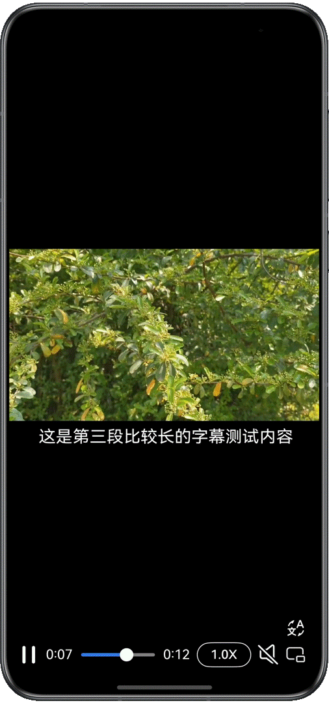
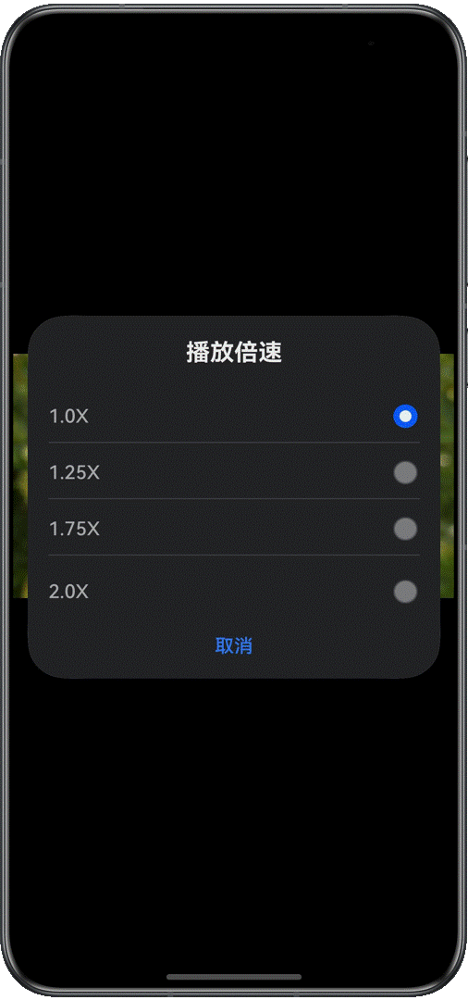

# 基于AVPlayer基础播控实践

更新时间：2026-03-12 08:45:02

来源：https://developer.huawei.com/consumer/cn/doc/best-practices/bpta-avplayer-basic-control

**   


##### 概述

本文适用于视频播放类应用的开发，针对市场上主流视频播放类应用的常见场景，介绍了如何基于AVPlayer系统播放器实现视频播放应用。
 
本文指导开发者基于HarmonyOS提供的媒体和ArkUI等能力，实现视频播放、暂停、跳转播放、静音播放、循环播放、窗口缩放模式设置、倍速设置、音量设置等基本开发场景，可以为视频播放应用提供灵活的交互体验和良好的观看效果。
 
> [!NOTE]
> 在阅读本文之前，建议开发者先熟悉视频播放器 《使用AVPlayer播放视频(ArkTS)》 。

 
 

##### 场景分析

  
| 场景名称 | 描述 | 实现方案 |
| --- | --- | --- |
| 基础播控 | 视频资源的加载、播放、暂停、退出等操作。 | 使用AVPlayer接口实现。 |
| 跳转播放 | 滑动进度条精准跳转到指定时间进行播放。 | 使用Slider组件实现进度条，在其onChange回调中触发进度调节。 |
| 静音播放 | 点击按钮设置静音播放。 | 使用AVPlayer的setMediaMuted()方法控制静音状态。 |
| 循环播放 | 视频播放结束后会从初始位置再次播放。 | 通过在prepared状态下，设置视频播放器AVPlayer的loop属性值为true，实现视频循环播放。 |
| 窗口缩放模式设置 | 设置窗口缩放模式体验不同的缩放效果。 | 通过设置AVPlayer的videoScaleType属性设置窗口缩放模式。 |
| 倍速设置 | 可以通过点击按钮选择倍速或者通过长按手势调节倍速。 | 使用AVPlayer的setSpeed()方法设置倍速。通过添加按钮和弹窗实现通过按钮调节倍速；通过给组件绑定长按手势实现长按倍速。 |
| 音量设置 | 可以滑动屏幕调节音量。 | 使用AVVolumePanel组件显示音量，通过给组件绑定手势滑动监听实现调节音量。 |
| 字幕挂载与切换 | 视频下方显示字幕。 | 使用AVPlayer的addSubtitleFromFd()方法设置外挂字幕资源，并通过AVPlayer实例注册字幕回调函数on('subtitleUpdate')；通过切换字幕资源并使用AVPlayer的reset()方法重置播放实现切换字幕。 |
 
 

##### 基础播控

 

##### 场景描述

通过[AVPlayer](https://developer.huawei.com/consumer/cn/doc/harmonyos-guides/video-playback)实现核心视频播放控制能力，包括视频资源加载、播放、暂停、停止及退出等操作。
 
 

##### 实现原理

 
本开发指导将介绍如何使用AVPlayer开发视频播放功能，以完整地播放一个视频作为示例，实现端到端播放原始媒体资源。
 
播放的全流程包含：创建AVPlayer，设置播放资源和窗口，设置播放参数（音量/倍速/缩放模式），播放控制（播放/暂停/跳转/停止），重置，销毁资源。在进行应用开发的过程中，开发者可以通过AVPlayer的state属性主动获取当前状态或使用on('stateChange')方法监听状态变化。如果应用在视频播放器处于错误状态时执行操作，系统可能会抛出异常或生成其他未定义的行为。
 
原理详情可查看[《使用AVPlayer播放视频(ArkTS)》](https://developer.huawei.com/consumer/cn/doc/harmonyos-guides/video-playback)。
 

##### 开发步骤
1. 创建实例：调用createAVPlayer()接口创建AVPlayer实例，初始化进入idle状态。
2. 设置视频资源：设置AVPlayer实例的url或者fdSrc属性值，进入initialized状态。
3. 准备播放：调用prepare()接口，进入prepared状态。
4. 播放：调用play()接口，进入playing状态。
5. 暂停：调用pause()接口，进入paused状态。
6. 停止：调用stop()接口，进入stopped状态。
7. 销毁实例：调用release()接口销毁实例，AVPlayer进入released状态，退出播放。
 
 

##### 跳转播放

 

##### 场景描述

进度条是视频应用的一个基础能力，可以通过点击或拖动进度条精准跳转到指定时间进行播放。
 



 
 

##### 实现原理

基于[Slider组件](https://developer.huawei.com/consumer/cn/doc/harmonyos-references/ts-basic-components-slider)和视频播放器AVPlayer的[seek()方法](https://developer.huawei.com/consumer/cn/doc/harmonyos-references/arkts-apis-media-avplayer#seek9)实现跳转播放。
 
 

##### 开发步骤

采用[Slider组件](https://developer.huawei.com/consumer/cn/doc/harmonyos-references/ts-basic-components-slider)实现进度条功能，根据Slider组件属性设置进度条样式，并在其onChange()事件中触发视频播放器AVPlayer的[seek()方法](https://developer.huawei.com/consumer/cn/doc/harmonyos-references/arkts-apis-media-avplayer#seek9)跳转到指定播放位置，实现视频进度的控制。
 
```ArkTS
/**
 * Progress slider
 */
Slider({
  value: this.currentTime,
  min: 0,
  max: this.durationTime,
  style: SliderStyle.OutSet
})
  .id('Slider')
  .blockColor(Color.White)
  .trackColor(Color.Gray)
  .selectedColor($r('app.color.slider_selected'))
  .showTips(false)
  .onChange((value: number, mode: SliderChangeMode) => {
    if (mode === SliderChangeMode.Begin) {
      this.isSwiping = true;
      this.avPlayerController.videoPause();
    }
    this.avPlayerController.videoSeek(value);
    this.currentTime = value;
    if (mode === SliderChangeMode.End) {
      this.isSwiping = false;
      this.flag = true;
      this.avPlayerController.videoPlay();
    }
  })
```
 
 

##### 静音播放

 

##### 场景描述

通过界面按钮快捷切换视频播放静音状态，实现一键开启或关闭静音，提升媒体播放的交互便捷性。
 


 
 

##### 实现原理

通过视频播放器AVPlayer的[setMediaMuted()方法](https://developer.huawei.com/consumer/cn/doc/harmonyos-references/arkts-apis-media-avplayer#setmediamuted12)，实现控制视频静音状态。
 
 

##### 开发步骤
1. 在底部操作栏添加[Button组件](https://developer.huawei.com/consumer/cn/doc/harmonyos-references/ts-basic-components-button)，按钮显示为icon图标；根据Button组件属性设置按钮样式，并在其onClick()事件中触发视频管理接口AvPlayerController.ets文件中封装的videoMuted()方法。

  
```ArkTS
/**
 * Video Muted Button
 */
Button() {
  Image(this.isMuted ? $r('app.media.ic_video_speaker_slash') : $r('app.media.ic_video_speaker'))
    .width($r('app.float.size_30'))
    .height($r('app.float.size_30'))
}
.type(ButtonType.Normal)
.width($r('app.float.size_30'))
.height($r('app.float.size_30'))
.borderRadius($r('app.float.size_20'))
.backgroundColor('rgba(0, 0, 0, 0)')
.margin({ left: $r('app.float.size_5') })
.fontColor(Color.White)
.onClick(() => {
  this.isMuted = !this.isMuted;
  this.avPlayerController.videoMuted(this.isMuted)
})
```

2. videoMuted()方法中调用了视频播放器AVPlayer的[setMediaMuted()方法](https://developer.huawei.com/consumer/cn/doc/harmonyos-references/arkts-apis-media-avplayer#setmediamuted12)，实现控制视频静音状态，其中第一个参数[mediaType](https://developer.huawei.com/consumer/cn/doc/harmonyos-references/arkts-apis-media-e#mediatype8)选择媒体类型为MEDIA_TYPE_AUD表示音频，第二个参数是静音开关。

  
```ArkTS
/**
 * Video muted
 * @param isMuted
 * @returns
 */
async videoMuted(isMuted: boolean): Promise<void> {
  if (this.avPlayer) {
    try {
      this.isMuted = isMuted;
      await this.avPlayer!.setMediaMuted(media.MediaType.MEDIA_TYPE_AUD, isMuted)
    } catch (err) {
      hilog.error(CommonConstants.LOG_DOMAIN, TAG,
        `videoMuted failed, code is ${err.code}, message is ${err.message}`);
    }
  }
}
```

 
 

##### 循环播放

 

##### 场景描述

本功能可以用于在视频播放结束后自动将播放器重置至初始状态，使用户能够立即重新开始播放视频内容，实现无缝循环观看体验。
 
 

##### 开发步骤

在视频prepared状态下，设置视频播放器AVPlayer的[loop属性](https://developer.huawei.com/consumer/cn/doc/harmonyos-references/arkts-apis-media-avplayer#属性)值为true，实现视频循环播放。
```ArkTS
// Callback function for state machine changes
this.avPlayer.on('stateChange', async (state) => {
  if (!this.avPlayer) {
    return;
  }
  switch (state) {
    // ...
    case 'prepared': // This state machine is reported after the prepare interface is successfully invoked.
      this.isReady = true;
      this.avPlayer.loop = true
      // ...
      break;
    // ...
  }
});
```
 
 
 

##### 窗口缩放模式设置

 

##### 场景描述

通过窗口缩放模式设置功能，用户可根据实际观看需求灵活调整视频内容的显示方式。该功能在未设置视频固定宽高时，在窗口尺寸频繁调整、不同宽高比视频源适配、全屏/窗口模式切换及多屏协作等场景下较为重要。
 
点击按钮即可弹出设置弹窗，可选择"拉伸至与窗口等大"模式，视频拉伸至与窗口等大，适合需要充分利用显示区域且对比例变化不敏感的场景；选择"缩放至最短边填满窗口"模式，视频将保持原始宽高比并以最短边为基准进行缩放，适合需要保持画面比例不变的场景。
 
图1 **拉伸至与窗口等大模式**


 
图2 **缩放至最短边填满窗口



 
 

##### 实现原理

通过设置视频播放器AVPlayer的[videoScaleType](https://developer.huawei.com/consumer/cn/doc/harmonyos-references/arkts-apis-media-e#videoscaletype9)属性值，实现窗口缩放模式的切换。由于VIDEO_SCALE_TYPE_SCALED_ASPECT（缩放至长边填满窗口）属性值从APIversion20开始才支持在元服务中使用，因此在这之前的版本中可根据屏幕大小为视频设置固定宽高来实现。
 
> [!NOTE]
> 在未设置视频固定宽高的情况下，即未设置XComponent的height和width为固定值时，设置AVPlayer的videoScaleType属性值才能生效。

 
 

##### 开发步骤
1. 可选择拉伸至与窗口等大/缩放至最短边填满窗口模式，选择后调用封装的videoScaleFit()/videoScaleFitCrop()方法。

  
```ArkTS
List() {
  ForEach(this.scaleList, (item: Resource, index) => {
    ListItem() {
      Column() {
        Row() {
          Text(item)
          // ...
          Blank()
          Image(this.windowScaleSelect === index ? $r('app.media.ic_radio_selected') :
            $r('app.media.ic_radio'))
          // ...
        }
        // ...
      }
      .width('90%')
    }
    .width('100%')
    .height($r('app.float.size_48'))
    .onClick(() => {
      this.windowScaleSelect = index;
      switch (this.windowScaleSelect) {
        case ZERO:
          this.avPlayerController.videoScaleFit();
          break;
        case ONE:
          this.avPlayerController.videoScaleFitCrop();
          break;
        default:
          break;
      }
      this.controller.close();
    })
  })
}
```

2. videoScaleFit()/videoScaleFitCrop()方法内设置视频播放器AVPlayer的[videoScaleType](https://developer.huawei.com/consumer/cn/doc/harmonyos-references/arkts-apis-media-e#videoscaletype9)属性值。VIDEO_SCALE_TYPE_FIT表示拉伸至与窗口等大；VIDEO_SCALE_TYPE_FIT_CROP表示缩放至最短边填满窗口。

  
```ArkTS
/**
 * Set window scale mode
 */
videoScaleFit(): void {
  if (this.avPlayer) {
    try {
      this.avPlayer.videoScaleType = media.VideoScaleType.VIDEO_SCALE_TYPE_FIT
    } catch (err) {
      hilog.error(CommonConstants.LOG_DOMAIN, TAG,
        `videoScaleType_0 failed, code is ${err.code}, message is ${err.message}`);
    }
  }
}

videoScaleFitCrop(): void {
  if (this.avPlayer) {
    try {
      this.avPlayer.videoScaleType = media.VideoScaleType.VIDEO_SCALE_TYPE_FIT_CROP
    } catch (err) {
      hilog.error(CommonConstants.LOG_DOMAIN, TAG,
        `videoScaleType_1 failed, code is ${err.code}, message is ${err.message}`);
    }
  }
}
```

 
 

##### 点击按钮选择倍速

 

##### 场景描述

通过点击按钮选择预设倍速实现倍速设置，为用户提供灵活的视频播放速率控制。
 


 
 

##### 实现原理

根据选择的倍速调用视频播放器AVPlayer的[setSpeed()方法](https://developer.huawei.com/consumer/cn/doc/harmonyos-references/arkts-apis-media-avplayer#setspeed9)设置对应值，实现视频播放倍速设置。
 
 

##### 开发步骤
1. 可选择1.0X、1.25X、1.75X、2.0X，选择后调用对应的设置倍速方法。

  
```ArkTS
ForEach(this.speedList, (item: Resource, index) => {
    ListItem() {
      Column() {
        Row() {
          Text(item)
          // ...
          Blank()
          Image(this.speedSelect === index ? $r('app.media.ic_radio_selected') :
          $r('app.media.ic_radio'))
          // ...
        }
        // ...
      }
      .width('90%')
    }
    .width('100%')
    .height($r('app.float.size_48'))
    .onClick(() => {
      this.speedSelect = index;
      switch (this.speedSelect) {
        case ZERO:
          this.avPlayerController.videoSpeed(media.PlaybackSpeed.SPEED_FORWARD_1_00_X);
          break;
        case ONE:
          this.avPlayerController.videoSpeed(media.PlaybackSpeed.SPEED_FORWARD_1_25_X);
          break;
        case TWO:
          this.avPlayerController.videoSpeed(media.PlaybackSpeed.SPEED_FORWARD_1_75_X);
          break;
        case THREE:
          this.avPlayerController.videoSpeed(media.PlaybackSpeed.SPEED_FORWARD_2_00_X);
          break;
        default:
          break;
      }
      this.controller.close();
    })
  }, (item: Resource, index) => index + '_' + JSON.stringify(item))
}
```

2. 设置倍速方法内调用视频播放器AVPlayer的[setSpeed()方法](https://developer.huawei.com/consumer/cn/doc/harmonyos-references/arkts-apis-media-avplayer#setspeed9)实现设置倍速。

  
```ArkTS
videoSpeed(speed: number): void {
  if (this.avPlayer) {
    try {
      this.avPlayer.setSpeed(speed);
    } catch (err) {
      hilog.error(CommonConstants.LOG_DOMAIN, TAG,
        `videoSpeed failed, code is ${err.code}, message is ${err.message}`);
    }
  }
}
```

 
 

##### 长按手势调节倍速

 

##### 场景描述

通过长按手势实现长按屏幕时2倍速播放，长按结束时恢复1倍速播放。
 
 

##### 实现原理

通过为元素绑定[长按手势](https://developer.huawei.com/consumer/cn/doc/harmonyos-references/ts-basic-gestures-longpressgesture)事件，在长按手势开始时调用视频播放器AVPlayer的[setSpeed()方法](https://developer.huawei.com/consumer/cn/doc/harmonyos-references/arkts-apis-media-avplayer#setspeed9)设置值为media.[PlaybackSpeed](https://developer.huawei.com/consumer/cn/doc/harmonyos-references/arkts-apis-media-e#playbackspeed8).SPEED_FORWARD_2_00_X，实现长按时2倍速播放；长按结束后调用视频播放器AVPlayer的setSpeed()方法设置值为media.PlaybackSpeed.SPEED_FORWARD_1_00_X，恢复播放速度为1倍速。
 
 

##### 开发步骤
1. 为元素绑定[长按手势LongPressGesture](https://developer.huawei.com/consumer/cn/doc/harmonyos-references/ts-basic-gestures-longpressgesture)事件，并调用封装的videoSpeed()方法，长按手势开始时传递参数为media.PlaybackSpeed.SPEED_FORWARD_2_00_X，设置播放速度为2倍速；长按手势结束时传递参数为media.PlaybackSpeed.SPEED_FORWARD_1_00_X，恢复播放速度为1倍速。

  
```ArkTS
.gesture(
  LongPressGesture({ repeat: true })
    .onAction(() => {
      this.speedSelect = CASE_THREE
      this.avPlayerController.videoSpeed(media.PlaybackSpeed.SPEED_FORWARD_2_00_X);
    })
    .onActionEnd(() => {
      this.speedSelect = CASE_ZERO
      this.avPlayerController.videoSpeed(media.PlaybackSpeed.SPEED_FORWARD_1_00_X);
    })
)
```

2. 设置倍速方法内调用视频播放器AVPlayer的[setSpeed()方法](https://developer.huawei.com/consumer/cn/doc/harmonyos-references/arkts-apis-media-avplayer#setspeed9)实现设置倍速。

  
```ArkTS
videoSpeed(speed: number): void {
  if (this.avPlayer) {
    try {
      this.avPlayer.setSpeed(speed);
    } catch (err) {
      hilog.error(CommonConstants.LOG_DOMAIN, TAG,
        `videoSpeed failed, code is ${err.code}, message is ${err.message}`);
    }
  }
}
```

 
 

##### 音量设置

 

##### 场景描述

滑动调节音量是一项非常实用的功能，它允许用户在不离开视频播放界面的情况下快速调整音量，以获得更好的观看体验。该功能位于窗口左侧，通过上下滑动手势即可调整音量。
 


 
 

##### 实现原理

用[AVVolumePanel组件](https://developer.huawei.com/consumer/cn/doc/harmonyos-references/ohos-multimedia-avvolumepanel)显示系统音量面板，为元素绑定[PanGesture](https://developer.huawei.com/consumer/cn/doc/harmonyos-references/ts-basic-gestures-pangesture)滑动手势事件，设置滑动方向为竖直方向，当手势在移动时，上滑增加音量，下滑减少音量，实现控制系统音量功能。
 
 

##### 开发步骤

1. 添加[AVVolumePanel组件](https://developer.huawei.com/consumer/cn/doc/harmonyos-references/ohos-multimedia-avvolumepanel)显示系统音量面板。

  
```ArkTS
import { AVVolumePanel } from '@kit.AudioKit';

@Component
export struct SetVolume {
  @Prop volume: number = 5
  @Prop volumeVisible: boolean = false

  build() {
    Column() {
      AVVolumePanel({
        volumeLevel: this.volume,
        volumeParameter: {
          position: {
            x: 50,
            y: 1000
          }
        }
      })
        .width(10)
    }
    .visibility(this.volumeVisible ? Visibility.Visible : Visibility.Hidden)
    .height('50%')
  }
}
```

2. 为元素绑定[PanGesture](https://developer.huawei.com/consumer/cn/doc/harmonyos-references/ts-basic-gestures-pangesture)滑动手势事件，并根据手势滑动距离计算音量值volume。

  
```ArkTS
.gesture(
  PanGesture({ direction: PanDirection.Vertical })
    .onActionStart(() => {
    })
    .onActionUpdate((event: GestureEvent) => {
      this.volumeVisible = true;
      let curVolume = this.volume - this.getUIContext().vp2px(event.offsetY) / this.windowHeight;
      curVolume = curVolume >= 15.0 ? 15.0 : curVolume;
      curVolume = curVolume <= 0.0 ? 0.0 : curVolume;
      this.volume = curVolume;
    })
    .onActionEnd(() => {
      this.setVolumeTimer();
    })
)
```

 

##### 字幕挂载与切换

 

##### 场景描述

在视频播放前，用户可设置外挂字幕文件，字幕将精准同步显示于视频画面下方，并可以通过按钮切换字幕语言，提升观看体验。
 


 
 

##### 实现原理

通过AVPlayer视频播放器的[addSubtitleFromFd()](https://developer.huawei.com/consumer/cn/doc/harmonyos-references/arkts-apis-media-avplayer#addsubtitlefromfd12)方法加载外挂字幕，并使用[on('subtitleUpdate')](https://developer.huawei.com/consumer/cn/doc/harmonyos-references/arkts-apis-media-avplayer#onsubtitleupdate12)方法注册字幕回调函数。在回调函数中获取字幕文本，通过状态变量刷新[Text组件](https://developer.huawei.com/consumer/cn/doc/harmonyos-references/ts-basic-components-text)显示内容。使用Text组件显示字幕并设置字体格式。
 
切换字幕语言需依据所选语言加载相应的字幕资源，然后调用AVPlayer的[reset()方法](https://developer.huawei.com/consumer/cn/doc/harmonyos-references/arkts-apis-media-avplayer#reset9-1)重置播放器并重新初始化。
 
 

##### 开发步骤

1. 使用AVPlayer实例的[addSubtitleFromFd()](https://developer.huawei.com/consumer/cn/doc/harmonyos-references/arkts-apis-media-avplayer#addsubtitlefromfd12)方法为视频添加外挂字幕资源。

  
```ArkTS
if (this.curSource.caption) {
  let fileDescriptorSub = await this.context.resourceManager.getRawFd(this.curSource.caption);
  this.avPlayer.addSubtitleFromFd(fileDescriptorSub.fd, fileDescriptorSub.offset, fileDescriptorSub.length)
    .catch((err: BusinessError) => {
      hilog.error(CommonConstants.LOG_DOMAIN, TAG,
        `addSubtitleFromFd failed, code is ${err.code}, message is ${err.message}`);
    });
}
```

2. 通过AVPlayer的[on('subtitleUpdate')](https://developer.huawei.com/consumer/cn/doc/harmonyos-references/arkts-apis-media-avplayer#onsubtitleupdate12)方法订阅获取外挂字幕事件，当有外挂字幕时，会通过订阅的回调方法通知用户。用户只能订阅一个外挂字幕事件的回调方法，若用户重复订阅，则以最后一次订阅的回调接口为准。回调中可以获取字幕文本、当前时间等信息，从而可以通过状态变量刷新Text组件显示的内容。

  
```ArkTS
this.avPlayer.on('subtitleUpdate', (info: media.SubtitleInfo) => {
  if (info) {
    let text = (!info.text) ? '' : info.text;
    this.currentCaption = text; //update current caption content
  } else {
    this.currentCaption = '';
    hilog.error(CommonConstants.LOG_DOMAIN, TAG, 'subtitleUpdate info is null');
  }
});
```

3. 使用状态变量刷新[Text组件](https://developer.huawei.com/consumer/cn/doc/harmonyos-references/ts-basic-components-text)的内容，并通过修改Text属性调整字幕字体格式。

  
```ArkTS
Stack({ alignContent: Alignment.Center }) {
  Text(this.avPlayerController.currentCaption)
    .fontColor(Color.White)
    .fontSize($r('app.float.size_20'))
    .fontFamily('Sans')
}
.width('100%')
.position({ x: $r('app.float.size_zero'), y: $r('app.float.size_216') })
.zIndex(1)
```

4. 根据所选语言切换对应字幕资源，并调用AVPlayer的[reset()方法](https://developer.huawei.com/consumer/cn/doc/harmonyos-references/arkts-apis-media-avplayer#reset9-1)重置播放器并重新初始化。

  
```ArkTS
async languageChange(languageSelect: number = 0): Promise<void> {
  if (this.avPlayer) {
    try {
      if (this.curSource && this.curSource.caption) {
        this.curSource.caption = languageSelect === 0 ? 'captions.srt' : 'en_captions.srt'
        this.curSource.seekTime = this.avPlayer.currentTime;
        await this.avPlayer.reset();
        this.initAVPlayer(this.curSource, this.surfaceID, this.avPlayer);
      }
    } catch (err) {
      hilog.error(CommonConstants.LOG_DOMAIN, TAG,
        `languageChange failed, code is ${err.code}, message is ${err.message}`);
    }
  }
}
```

 

##### 示例代码

- [基于AVPlayer实现视频基础播控功能](https://gitcode.com/harmonyos_samples/avplayer-basic-control)
