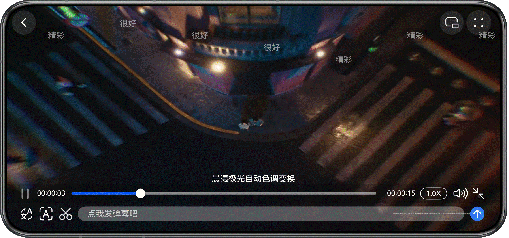
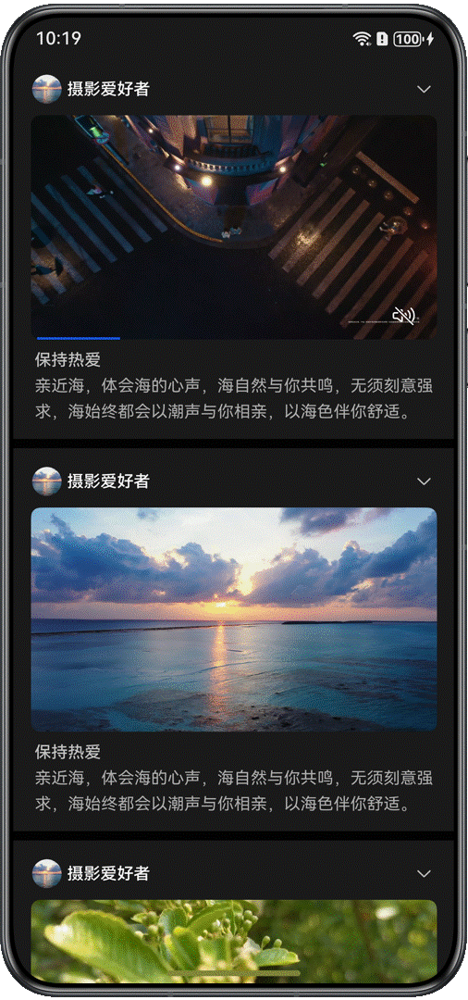
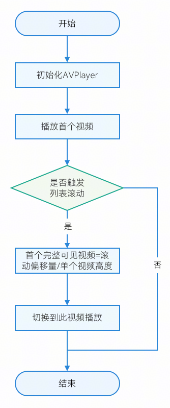
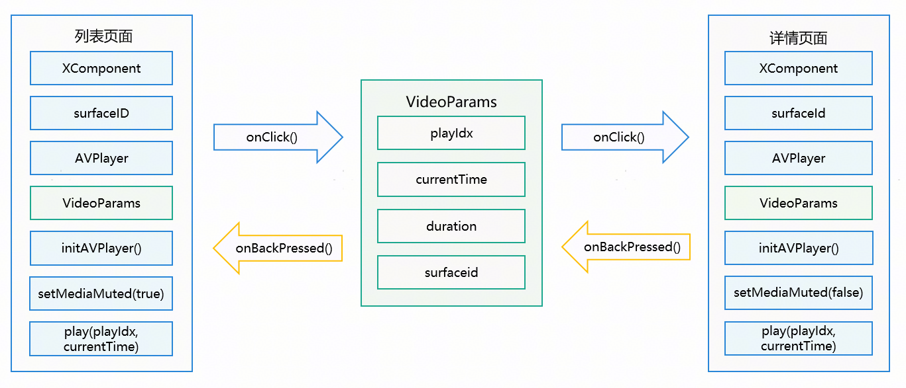

# 基于AVPlayer播放嵌入式短视频实践

更新时间：2026-03-12 08:45:02

来源：https://developer.huawei.com/consumer/cn/doc/best-practices/bpta-avplayer-embeded-short-video

#### 概述

本文适用于视频播放类应用开发，针对市场上主流视频播放应用常见场景，介绍如何基于[AVPlayer](https://developer.huawei.com/consumer/cn/doc/harmonyos-references/arkts-apis-media-avplayer)系统播放器实现嵌入式短视频播放。本文指导开发者实现以下几种场景：
 
- [基础播控能力](#section19871518619)
- [焦点管理](#section9451174918313)
- [前后台感知](#section1560144415411)
- [横竖屏切换和旋转感知](#section92411245940)
- [画中画播放](#section17471045441)
- [视频首帧显示](#section11121172718716)
- [嵌入式视频列表自动播放](#section1243616221447)
- [视频无缝转场播放](#section129361938786)

 
 

#### 基础播控能力

通过[AVPlayer](https://developer.huawei.com/consumer/cn/doc/harmonyos-references/arkts-apis-media-avplayer)实现视频资源加载、播放、暂停、停止、退出操作，包含了静音播放、倍数设置和字幕挂载等功能，实现原理详情可参考[《基于AVPlayer基础播控实践》](https://developer.huawei.com/consumer/cn/doc/best-practices/bpta-avplayer-basic-control)。
 
 

#### 焦点管理

 

#### 场景描述

前台视频播放过程中，音频被后台闹钟、电话等中断事件打断，完成播放过程音视频焦点管理。
 


 
 

#### 开发步骤

 
具体开发步骤可参考基于AVPlayer播放长视频实践的[焦点管理开发步骤](https://developer.huawei.com/consumer/cn/doc/best-practices/bpta-avplayer-long-video#section1716082163419)。
 

#### 前后台感知

 

#### 场景描述

应用从后台切回到前台时，保持原视频播放且会从之前的位置继续播放。
 


 
 

#### 开发步骤

具体开发步骤可参考基于AVPlayer播放长视频实践的[前后台感知开发步骤](https://developer.huawei.com/consumer/cn/doc/best-practices/bpta-avplayer-long-video#section1448773335411)。
 
 

#### 横竖屏切换和旋转感知

 

#### 场景描述

播放视频时可以手动进行横竖屏切换，也支持根据设备旋转方向自动切换横竖屏模式，以适应不同屏幕方向下的视频播放需求。
 



 
 

#### 开发步骤

具体开发步骤可参考基于AVPlayer播放长视频实践的[横竖屏切换和旋转感知开发步骤](https://developer.huawei.com/consumer/cn/doc/best-practices/bpta-avplayer-long-video#section1257185216407)。
 
 

#### 画中画播放

 

#### 场景描述

画中画模式用户可进行其他界面操作，提升使用体验。应用场景包括视频播放、直播、视频通话和视频会议等。
 


 
 

#### 开发步骤

具体开发步骤可参考基于AVPlayer播放长视频实践的[画中画播放开发步骤](https://developer.huawei.com/consumer/cn/doc/best-practices/bpta-avplayer-long-video#section4691194231313)。
 
 

#### 视频首帧显示

 

#### 场景描述

视频播放列表或播放窗口中显示视频首帧作为视频描述信息。
 



 
 

#### 开发步骤

具体开发步骤可参考基于AVPlayer播放长视频实践的[视频首帧显示开发步骤](https://developer.huawei.com/consumer/cn/doc/best-practices/bpta-avplayer-long-video#section27212108403)。
 
 

#### 嵌入式视频列表自动播放

 

#### 场景描述

用户浏览视频列表时自动播放视频，在用户滑动视频列表时自动切换至首个完全可见的视频播放。
 


 
 

#### 实现原理

使用[AVPlayer](https://developer.huawei.com/consumer/cn/doc/harmonyos-references/arkts-apis-media-avplayer)组件实现视频播放列表页面。通过监听列表滑动[onScrollStop()](https://developer.huawei.com/consumer/cn/doc/harmonyos-references/ts-container-list#onscrollstop)事件，在滑动停止时获取滑动偏移量offset，计算首个可完全展示的视频的索引，切换至该视频播放，实现视频列表中首个可见视频自动播放效果。
 
逻辑如下：
 



 
 

#### 开发步骤
1. 创建视频列表的模拟数据。

  
```ArkTS
export const VIDEO_DATA: VideoItemData[] =
  [
    new VideoItemData($r('app.string.info_detail'), 0, '1.mp4', $r(`app.media.preview1`)),
    new VideoItemData($r('app.string.info_detail'), 0, '2.mp4', $r(`app.media.preview2`)),
    new VideoItemData($r('app.string.info_detail'), 0, '3.mp4', $r(`app.media.preview3`)),
    // ...
  ];
```

1. 声明initAVPlayer()方法初始化[AVPlayer](https://developer.huawei.com/consumer/cn/doc/harmonyos-references/arkts-apis-media-avplayer)实例。

  
```ArkTS
// Create an AVPlayer instance
public async initAVPlayer(source: VideoData, surfaceId: string) {
  // ...
    // Creates the avPlayer instance object.
    this.avPlayer = await media.createAVPlayer();
    // Creates a callback function for state machine changes.
    this.setAVPlayerCallback();
    // ...
}
```

2. 创建setStateChangeCallback()状态回调函数，[AVPlayerState](https://developer.huawei.com/consumer/cn/doc/harmonyos-references/arkts-apis-media-t#avplayerstate9)状态为prepared时，使用[emitter.emit()](https://developer.huawei.com/consumer/cn/doc/harmonyos-references/js-apis-emitter#emitteremit)传递当前[AVPlayer](https://developer.huawei.com/consumer/cn/doc/harmonyos-references/arkts-apis-media-avplayer)实例的高度和宽度。

  
```ArkTS
private setStateChangeCallback() {
  // ...
  // Callback function for state machine changes
  this.avPlayer.on('stateChange', async (state) => {
    // ...
    switch (state) {
      // ...
      case 'prepared': // This state machine is reported after the prepare interface is successfully invoked.
        // ...
        let eventData: emitter.EventData = {
          data: {
            'percent': this.avPlayer.width / this.avPlayer.height
          }
        };
        emitter.emit(CommonConstants.AVPLAYER_PREPARED, eventData);
        // ...
        break;
      // ...
    }
  });
}
```

3. 使用[getDefaultDisplaySync()](https://developer.huawei.com/consumer/cn/doc/harmonyos-references/js-apis-display#displaygetdefaultdisplaysync9)方法获取当前屏幕宽度，以默认16:9的屏幕比例，通过屏幕宽度计算[RelativeContainer](https://developer.huawei.com/consumer/cn/doc/harmonyos-references/ts-container-relativecontainer)组件的高度和宽度，计算[ListItem](https://developer.huawei.com/consumer/cn/doc/harmonyos-references/ts-container-listitem)所需高度；订阅[AVPlayerState](https://developer.huawei.com/consumer/cn/doc/harmonyos-references/arkts-apis-media-t#avplayerstate9)状态为prepared的事件，获取[AVPlayer](https://developer.huawei.com/consumer/cn/doc/harmonyos-references/arkts-apis-media-avplayer)实例的高度和宽度。

  
```ArkTS
aboutToAppear() {
  try {
    this.windowClass.setWindowSystemBarProperties({
      // Status bar color
      statusBarColor: '#1A1A1A'
    }).catch((error: BusinessError) => {
      hilog.error(Constants.DOMAIN, TAG,
        `setWindowSystemBarProperties failed, Code:${error.code}, message:${error.message}`);
    });

    // Calculated based on screen width RelativeContainer width
    let winWidth = this.getUIContext().px2vp(display.getDefaultDisplaySync().width);
    this.frameWidth = winWidth - Constants.LIST_ITEM_LEFT_PADDING - Constants.LIST_ITEM_RIGHT_PADDING;
    this.frameHeight = Math.floor(this.frameWidth / Constants.WH_RADIO);
    this.listItemHeight =
      this.frameHeight + Constants.TITLE_HEIGHT + Constants.LIST_ITEM_TOP_PADDING + Constants.INFO_AREA_HEIGHT;
    emitter.on('prepared', (eventData: emitter.EventData) => {
      let vWidth: number = eventData.data!.width;
      let vHeight: number = eventData.data!.height;
      let surfaceID: string = eventData.data!.surfaceID;
      if (this.playIdx < this.dataSource.totalCount()) {
        let playSurfaceID = this.dataSource.getData(this.playIdx).surfaceID;
        if (playSurfaceID === surfaceID) {
          this.setXComponentWH(vWidth, vHeight);
        }
      }
    });
  } catch (error) {
    if (error.code !== null && error.message !== null) {
      hilog.error(Constants.DOMAIN, TAG, `aboutToAppear failed, code is ${error.code}, message is ${error.message}`);
    }
  }
}
```

4. 根据[AVPlayer](https://developer.huawei.com/consumer/cn/doc/harmonyos-references/arkts-apis-media-avplayer)实例的高度、宽度计算设置[XComponent](https://developer.huawei.com/consumer/cn/doc/harmonyos-references/ts-basic-components-xcomponent)的高度、宽度。

  
```ArkTS
/*
 * Calculate XComponent Width&Height
 */
setXComponentWH(vWidth: number, vHeight: number) {
  let radio = vWidth / vHeight;
  if (radio > 1) {
    // Horizontal video
    this.xWidth = this.frameWidth;
    this.xHeight = Math.floor(this.xWidth / radio);
    if (this.xHeight > this.frameHeight) {
      this.xHeight = this.frameHeight;
      this.xWidth = Math.floor(this.xHeight * radio);
    }
  } else {
    // Vertical video
    this.xHeight = this.frameHeight;
    this.xWidth = Math.floor(this.xHeight * radio);
    if (this.xWidth > this.frameWidth) {
      this.xWidth = this.frameWidth;
      this.xHeight = Math.floor(this.xWidth / radio);
    }
  }
}
```

5. 声明avPlayerController的实例。

  
```ArkTS
private avPlayerController: AvPlayerController = new AvPlayerController();
```

6. 在页面的[onDidBuild()](https://developer.huawei.com/consumer/cn/doc/harmonyos-references/ts-custom-component-lifecycle#ondidbuild12)函数中加载模拟视频数据，初始化加载首个视频数据。

  
```ArkTS
onDidBuild(): void {
  this.dataSource.loadData();
  this.play(this.playIdx);
}
```

7. 根据所需播放视频的索引，获取视频相关信息，使用videoReset()方法重置[AVPlayer](https://developer.huawei.com/consumer/cn/doc/harmonyos-references/arkts-apis-media-avplayer)实例，随后利用获取的视频信息调用[initAVPlayer()](#li71231589325)方法重新初始化，设置该实例的surfaceId，确保其在指定surfaceId的组件上播放。

  
```ArkTS
play(index: number) {
  this.startRender = false;
  // Reset AVPlayer
  this.avPlayerController.videoReset().then(() => {
    // ...
        this.isMuted = true;
        // Init AVPlayer
        this.avPlayerController.initAVPlayer({
          type: VideoDataType.RAW_FILE,
          videoSrc: this.dataSource.getData(index).src!,
          name: $r("app.string.app_name"),
          description: '',
          caption: '',
          index: 0,
          seekTime: stopTime,
          isMuted: true,
          head: $r("app.media.preview1")
        }, surfaceID);
        // ...
  });
}
```

8. 用[List](https://developer.huawei.com/consumer/cn/doc/harmonyos-references/ts-container-list)显示视频列表，使用[LazyForEach](https://developer.huawei.com/consumer/cn/doc/harmonyos-references/ts-rendering-control-lazyforeach)对列表数据进行懒加载。

  
```ArkTS
List({ scroller: this.listScroller }) {
  LazyForEach(this.dataSource, (info: VideoInfo, index: number) => {
    ListItem() {
      this.videoItemBuilder(info, index)
    }
    // ...
  }, (info: VideoInfo) => info.id)
}
```

9. 创建[XComponent](https://developer.huawei.com/consumer/cn/doc/harmonyos-references/ts-basic-components-xcomponent)组件，其提供用于图形绘制和媒体数据写入的Surface，负责将其嵌入视图中，用于视频播放。

  
```ArkTS
XComponent({
  type: XComponentType.SURFACE,
  controller: info.xController
})
```

10. 在[XComponent](https://developer.huawei.com/consumer/cn/doc/harmonyos-references/ts-basic-components-xcomponent)组件的[onLoad()](https://developer.huawei.com/consumer/cn/doc/harmonyos-references/ts-basic-components-xcomponent#onload)加载事件中，使用[getXComponentSurfaceId()](https://developer.huawei.com/consumer/cn/doc/harmonyos-references/ts-basic-components-xcomponent#getxcomponentsurfaceid9)获取该播放组件的Id，将其Id设置到[AVPlayer](https://developer.huawei.com/consumer/cn/doc/harmonyos-references/arkts-apis-media-avplayer)的surfaceId上，即可实现在该组件上播放视频。

  
```ArkTS
.onLoad(() => {
  let surfaceID = info.xController!.getXComponentSurfaceId();
  info.surfaceID = surfaceID;
  if (info.id === this.unloadID) {
    this.play(index);
  }
})
```

11. 设置[List](https://developer.huawei.com/consumer/cn/doc/harmonyos-references/ts-container-list)的[onScrollStop()](https://developer.huawei.com/consumer/cn/doc/harmonyos-references/ts-container-list#onscrollstop)事件，在列表滑动停止时触发，根据滑动偏移量及单个[ListItem](https://developer.huawei.com/consumer/cn/doc/harmonyos-references/ts-container-listitem)的高度计算当前屏幕内首个可完整显示的视频索引。若计算得出的视频索引与当前播放视频索引不符，则使用play()方法重新初始化[AVPlayer](https://developer.huawei.com/consumer/cn/doc/harmonyos-references/arkts-apis-media-avplayer)，切换至计算得出的视频进行播放。

  
```ArkTS
.onScrollStop(() => {
  let yOffset = this.listScroller.currentOffset().yOffset;
  let curIndex = Math.floor(yOffset / (this.listItemHeight + Constants.LIST_DIVIDER_WIDTH));
  let offsetInItem = yOffset - curIndex * (this.listItemHeight + Constants.LIST_DIVIDER_WIDTH);
  if (offsetInItem > Constants.LIST_ITEM_TOP_PADDING + 34) {
    curIndex += 1;
  }
  this.curIndex = curIndex;
  if (curIndex !== this.playIdx && curIndex < this.dataSource.totalCount()) {
    setTimeout(() => {
      if (this.curIndex === curIndex && this.curIndex !== this.playIdx) {
        this.play(curIndex);
      }
    }, Constants.DELAY_MS);
  }
})
```

 
 

#### 视频无缝转场播放

 

#### 场景描述

视频播放无缝转场是影音娱乐类应用中的典型场景之一，如视频列表中自动播放的热门视频，点击当前播放视频跳转至视频详情页后继续播放。
 


 
 

#### 实现原理

基于[AVPlayer](https://developer.huawei.com/consumer/cn/doc/harmonyos-references/arkts-apis-media-avplayer)与[XComponent](https://developer.huawei.com/consumer/cn/doc/harmonyos-references/ts-basic-components-xcomponent)实现视频播放，通过切换AVPlayer的surfaceId控制不同XComponent播放视频，实现转场效果，使用[seek()](https://developer.huawei.com/consumer/cn/doc/harmonyos-references/arkts-apis-media-avplayer#seek9)方法跳转至指定位置播放，主要分为两部分：
 
**列表页面跳转到详情页面**：当点击正在播放的视频时，记录当前播放视频的索引、播放进度、总时长、surfaceId信息，并在页面跳转[pushPathByName()](https://developer.huawei.com/consumer/cn/doc/harmonyos-references/ts-basic-components-navigation#pushpathbyname10)方法中传入此视频信息。在视频播放详情页面使用[getParamByIndex()](https://developer.huawei.com/consumer/cn/doc/harmonyos-references/ts-basic-components-navigation#getparambyindex10)接收传入信息，根据接收的视频信息使用initAVPlayer()初始化AVPlayer实例，初始化新的XComponent组件和surfaceID，将其绑定到AVPlayer上，使用seek()方法从记录的播放进度开始播放；
 
**详情页面返回到列表页面**：在详情页面点击返回时，记录当前播放视频的索引、播放进度、总时长、原surfaceId信息，并在页面回调[onBackPressed()](https://developer.huawei.com/consumer/cn/doc/harmonyos-references/js-apis-app-ability-uiability#onbackpressed10)函数中，使用[pop()](https://developer.huawei.com/consumer/cn/doc/harmonyos-references/ohos-arkui-advanced-multinavigation#pop)方法传入此视频信息，根据接收的视频信息，使用play(index)初始化AVPlayer，将其surfaceId设置为原surfaceId，使用seek()方法从记录的播放进度开始播放。
 
逻辑如下：
 



 
 

#### 开发步骤
1. 创建route_map.json路由配置文件，配置视频跳转播放页面参数信息。

  
```ArkTS
{
  "routerMap": [
    {
      "name": "DetailPage",
      "pageSourceFile": "src/main/ets/pages/DetailPage.ets",
      "buildFunction": "detailPageBuilder"
    }
  ]
}
```

2. 创建AppRouter.ets文件，声明页面路由相关操作方法。

  
```ArkTS
public getPathStack(): NavPathStack {
  return this.pathStack;
}
```

3. 在首页的[Navigation](https://developer.huawei.com/consumer/cn/doc/harmonyos-references/ts-basic-components-navigation)组件中使用[getPathStack()](https://developer.huawei.com/consumer/cn/doc/harmonyos-references/ts-basic-components-navigation#getpathstack19)获取页面路由信息。

  
```ArkTS
build() {
  Navigation(AppRouter.getInstance().getPathStack()) {
    // ...
  }
  .hideTitleBar(true)
  .width('100%')
  .height('100%')
  .mode(NavigationMode.Stack)
}
```

4. 在[pushPathByName()](https://developer.huawei.com/consumer/cn/doc/harmonyos-references/ts-basic-components-navigation#pushpathbyname10)基础上封装pushByName()方法，用于页面跳转时的参数传递。

  
```ArkTS
public static pushByName(name: string, param: Object, onPop: Callback<PopInfo>): void {
  AppRouter.instance.pushPathByName(name, param, onPop);
}
```

5. 设置[XComponent](https://developer.huawei.com/consumer/cn/doc/harmonyos-references/ts-basic-components-xcomponent)的点击事件，当用户点击当前播放的视频时，保存当前播放进度，然后使用[pushByName()](#li1647811562593)方法，在页面跳转的同时将当前播放视频相关信息传递到视频详情页面。

  
```ArkTS
.onClick(() => {
  // Save video data
  AppStorage.setOrCreate(Constants.SURFACE_ID_KEY, info.surfaceID);
  this.avPlayerController.videoPause();

  info.stopTime = this.avPlayerController.currentTime;
  info.duration = this.avPlayerController.duration;
  // Jump video play detail
  AppRouter.pushByName(Constants.DETAIL_PAGE_NAME,
    new VideoParams(info, this.playIdx, index), () => {
      let param: VideoParams = AppStorage.get("BackParam") as VideoParams;
      let _index = param.index;
      this.dataSource.getData(_index).stopTime = param.videoInfo.stopTime;
      this.play(param.playIdx);
    })
})
```

6. 基于[getParamByIndex()](https://developer.huawei.com/consumer/cn/doc/harmonyos-references/ts-basic-components-navigation#getparambyindex10)封装getLastParams()方法，用于页面跳转后获取传递的参数。

  
```ArkTS
public static getLastParams(): Object {
  return AppRouter.instance.pathStack.getParamByIndex(AppRouter.instance.pathStack.size() - 1) as Object;
}
```

7. 在视频详情页面的[aboutToAppear()](https://developer.huawei.com/consumer/cn/doc/harmonyos-references/ts-custom-component-lifecycle#abouttoappear)事件中，使用[getLastParams()](#li1482553124015)方法获取传递的参数信息，取消[AVPlayer](https://developer.huawei.com/consumer/cn/doc/harmonyos-references/arkts-apis-media-avplayer)实例的静音设置。

  
```ArkTS
aboutToAppear(): void {
  try {
    this.mainWin = this.windowStage.getMainWindowSync();
    this.windowClass = this.context.windowStage.getMainWindowSync();
  } catch (error) {
    let err = error as BusinessError;
    hilog.error(Constants.DOMAIN, TAG, `getMainWindowSync error, code: ${err.code};message: ${err.message};`);
  }


  this.setOrientation();
  // ...

  // Get params
  let params = AppRouter.getLastParams() as VideoParams;
  this.info = params.videoInfo;
  this.playIdx = params.playIdx;
  this.index = params.index;
  this.src = params.videoInfo.src as string;
  this.currentTime = this.info.stopTime as number;
  this.duration = this.info.duration;
  this.avPlayerController.videoMuted(false);
  // ...
}
```

8. 在视频详情页面创建[XComponent](https://developer.huawei.com/consumer/cn/doc/harmonyos-references/ts-basic-components-xcomponent#xcomponent19)组件。

  
```ArkTS
XComponent({
  type: XComponentType.SURFACE,
  controller: this.xComponentController
})
  .id(`videoXComponent_${this.info?.id}`)
```

9. [XComponent](https://developer.huawei.com/consumer/cn/doc/harmonyos-references/ts-basic-components-xcomponent#xcomponent19)的[onLoad()](https://developer.huawei.com/consumer/cn/doc/harmonyos-references/ts-basic-components-xcomponent#onload)事件中重新初始化[AVPlayer](https://developer.huawei.com/consumer/cn/doc/harmonyos-references/arkts-apis-media-avplayer)实例，将跳转时的播放时间进度currentTime传递给[AVPlayer](https://developer.huawei.com/consumer/cn/doc/harmonyos-references/arkts-apis-media-avplayer)，然后使用[seek()](https://developer.huawei.com/consumer/cn/doc/harmonyos-references/arkts-apis-media-avplayer#seek9)跳转到currentTime时间帧继续播放。

  
```ArkTS
.onLoad(() => {
  // Init AVPlayer
  this.surfaceId = this.xComponentController.getXComponentSurfaceId();
  if (this.avPlayerController !== undefined) {
    this.avPlayerController.initAVPlayer({
      type: VideoDataType.RAW_FILE,
      videoSrc: this.src,
      name: $r("app.string.app_name"),
      description: '',
      caption: 'captions.srt',
      index: 0,
      seekTime: this.currentTime,
      head: $r("app.media.preview1")
    }, this.surfaceId);
  }
})
```

10. 声明handleBackAction()方法，当在详情页面点击返回按钮时，记录当前播放视频的信息，包括视频当前进度、总时长、索引等。

  
```ArkTS
handleBackAction() {
  if (this.isLayoutFullScreen) {
    // Cancel full screen
    this.isLayoutFullScreen = false;
    this.setWindowDirection(window.Orientation.PORTRAIT);
  }

  this.isPIPShow = false;
  this.windowClass?.setWindowSystemBarProperties({
    // Status bar color
    statusBarColor: '#1A1A1A'
  }).catch((error: BusinessError) => {
    hilog.error(Constants.DOMAIN, TAG,
      `setWindowSystemBarProperties: Failed. code: ${error.code} ;message: ${error.message}`);
  });

  this.avPlayerController.videoPause();
  this.isPlaying = false;
  // Save params
  if (this.info !== undefined) {
    this.info.stopTime = this.avPlayerController.currentTime;
  }
  let param: VideoParams = new VideoParams(
    this.info as VideoInfo,
    this.playIdx,
    this.index
  )
  AppStorage.setOrCreate("BackParam", param);
  AppRouter.popWithParam(Object({ result: true }));
}
```

11. 在视频列表页面的点击跳转事件[pushByName()](#li1647811562593)方法中，使用回调函数接收详情页面返回参数信息，随后调用[play()](#li37514173917)方法，设置[seekTime](https://developer.huawei.com/consumer/cn/doc/harmonyos-references/arkts-apis-media-avplayer#seek9)为currentTime以继续播放。

  
```ArkTS
.onClick(() => {
  // Save video data
  AppStorage.setOrCreate(Constants.SURFACE_ID_KEY, info.surfaceID);
  this.avPlayerController.videoPause();

  info.stopTime = this.avPlayerController.currentTime;
  info.duration = this.avPlayerController.duration;
  // Jump video play detail
  AppRouter.pushByName(Constants.DETAIL_PAGE_NAME,
    new VideoParams(info, this.playIdx, index), () => {
      let param: VideoParams = AppStorage.get("BackParam") as VideoParams;
      let _index = param.index;
      this.dataSource.getData(_index).stopTime = param.videoInfo.stopTime;
      this.play(param.playIdx);
    })
})
```

 
 

#### 示例代码

- [基于AVPlayer实现嵌入式短视频播放](https://gitcode.com/harmonyos_samples/avplayer-embeded-short-video/tree/master/)
