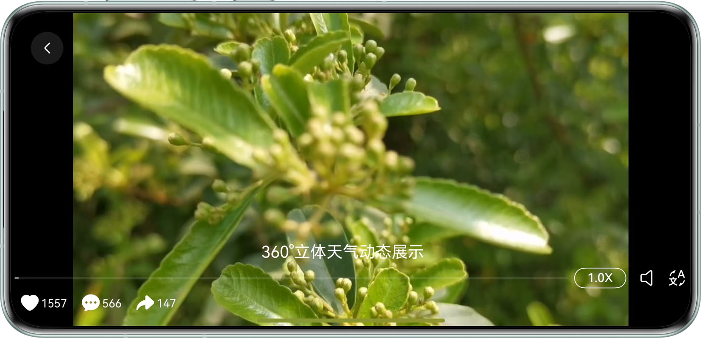
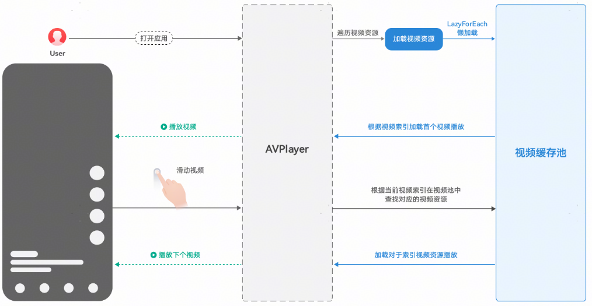

# 基于AVPlayer播放短视频实践

更新时间：2026-03-12 08:45:02

来源：https://developer.huawei.com/consumer/cn/doc/best-practices/bpta-avplayer-short-video

**   


#### 概述

 
短视频已成为内容消费的核心场景，用户对“秒开、丝滑、沉浸”的体验阈值极高。本示例基于AVPlayer能力，实现短视频流畅切换，提炼出一套可复制的方案，帮助开发者交付极速、流畅的播放体验。本文指导开发者实现以下几种场景：
 
- [基本播控能力](#section19871518619)
- [焦点管理](#section9451174918313)
- [前后台感知](#section1560144415411)
- [横竖屏切换和旋转感知](#section92411245940)
- [短视频列表流畅切换](#section49561448161814)

 

#### 基本播控能力

通过[AVPlayer](https://developer.huawei.com/consumer/cn/doc/harmonyos-references/arkts-apis-media-avplayer)实现视频资源加载、播放、暂停、停止、退出操作，包含了静音播放、倍速设置和字幕挂载等功能，原理详情可参考[《基于AVPlayer基础播控实践》](https://developer.huawei.com/consumer/cn/doc/best-practices/bpta-avplayer-basic-control)。
 
 

#### 焦点管理

 

#### 场景描述

前台视频播放过程中，音频被后台闹钟、电话等中断事件打断，完成播放过程音视频焦点管理。
 
 

#### 开发步骤

具体开发步骤可参考基于AVPlayer播放长视频实践的[焦点管理开发步骤](https://developer.huawei.com/consumer/cn/doc/best-practices/bpta-avplayer-long-video#section468112791916)。
 
 

#### 前后台感知

 

#### 场景描述

应用从后台切回到前台时，保持原视频播放且会从之前的位置继续播放。
 


 
 

#### 开发步骤

具体开发步骤可参考基于AVPlayer播放长视频实践的[前后台感知开发步骤](https://developer.huawei.com/consumer/cn/doc/best-practices/bpta-avplayer-long-video#section1448773335411)。
 
 

#### 横竖屏切换和旋转感知

 

#### 场景描述

播放视频时可以手动进行横竖屏切换，也支持根据设备旋转方向自动切换横竖屏模式，以适应不同屏幕方向下的视频播放需求。
 



 
 

#### 开发步骤

具体开发步骤可参考基于AVPlayer播放长视频实践的[横竖屏切换和旋转感知开发步骤](https://developer.huawei.com/consumer/cn/doc/best-practices/bpta-avplayer-long-video#section1257185216407)。
 
 

#### 短视频列表流畅切换

 

#### 场景描述

 
短视频：小于5分钟的短视频为例进行说明。
 1. 应用内滑动视频，新视频起播时延≤230ms（不包含滑动动画效果耗时）。
2. 起点时间：松手时的时间。
3. 终点时间：视频内容开始播放，画面首次变化的时间。
 


 

#### 场景体验指标

 
起播时延计时标准
 
1、以用户滑动屏幕后抬手、手指离屏的时刻为起点，以视频第二帧画面显示的时刻为终点。
 
2、转场动画时长建议设置为300ms。
 
3、在动画开始时使用预先准备的播放器起播，起播时延不超过230ms。
 

#### 实现原理
1. 数据懒加载冷启动时创建第一个播放器，播放当前视频时预加载下一个视频（预加载会增加用户流量消耗，需开发者自行决策）。使用XComponent的Surface类型动态渲染视频流，LazyForEach进行数据懒加载。
2. 异步在线视频预加载在轮播过程中，对下一个视频提前进入AVPlayer的prepared状态。
3. 在线视频播放预加载滑动过程中，手指离开屏幕时，滑动动效开始播放。此时，可以调用AVPlayer的play方法进行播放。
 
图1 ****流程图**
 



 
 
1. 使用视频播放框架AVPlayer可以将Audio/Video媒体资源（比如mp4/mp3/mkv/mpeg-ts等）转码为可供渲染的图像和可听见的音频模拟信号，并通过输出设备进行播放。
 
2. 使用LazyForEach进行数据懒加载，设置cachedCount属性指定缓存数量，搭配组件复用能力。冷启动时创建并初始化AVPlayer到prepared阶段。
 
> [!NOTE]
> 在滚动容器中使用了LazyForEach，框架会根据滚动容器可视区域按需创建组件，当组件滑出可视区域外时，框架会进行组件销毁回收以降低内存占用，详情参考 《LazyForEach》 。

 
3. 在滑块视图容器[Swiper](https://developer.huawei.com/consumer/cn/doc/harmonyos-references/ts-container-swiper)进行短视频滑动轮播过程中，会根据当前轮询滑动的窗口索引index到缓存池中找到对应的视频（prepared阶段），直接进行播放，从而提高切换性能。
 
**图2 ****异步加载示意图**
 


 
在缓存池中有多个播放器实例，播放视频A时，提前预加载视频B并进入prepare状态；切换短视频时，可以立即播放已预加载的视频B，减少切换时间。手势上下滑动的时候，在动画开始时就更新当前索引值，最终实现短视频快速切换，综合起播时间≤230ms。
 

#### 开发步骤

1. 在swiper组件中对播放组件AVPlayerView使用懒加载，确保每个视频有单独的Xcomponent、SurfaceID和AVPlayer播放器。
2. 通过设置swiper组件cachedCount属性确定缓存池大小，缓存池中的视频提前进入prepared状态；在动画开始的回调函数onAnimationStart()中就更新当前索引curIndex，而不是等动画结束更新。不使用默认的弹簧曲线（弹簧动效持续560毫秒），将曲线改为Curve.Ease，并将持续时间设置为300毫秒。

  
```ArkTS
Swiper(this.swiperController) {
  LazyForEach(new AVDataSource(SOURCES), (item: VideoData, index: number) => {
    AVPlayerView({
      curSource: item,
      curIndex: this.curIndex,
      index: index,
      isPageShow: this.isPageShow
    })
  })
}
.cachedCount(3)
.vertical(true)
.loop(true)
.curve(Curve.Ease)
.duration(300)
.indicator(false)
.onAnimationStart((index: number, targetIndex: number, extraInfo: SwiperAnimationEvent) => {
  Logger.info(TAG, `onAnimationStart index:${index} , targetIndex: ${targetIndex},extraInfo: ${extraInfo}`);
  this.curIndex = targetIndex;
  // key point: Animation starts updating index
})
```

3. 使用@Watch监听当前索引curIndex值，对比当前索引curIndex和轮播索引index，仅播放索引相同的视频，缓存池其余视频均暂停。

  
```ArkTS
async onIndexChange() {
  if (this.curIndex !== this.index) {
    this.avPlayerController.videoPause();
  } else {
    if (this.avPlayerController.isReady === true) {
      this.avPlayerController.languageChange(AppStorage.get('currentLanguageType'))
      this.avPlayerController.videoPlay();
    }
  }
}
```

 

#### 示例代码

- [基于AVPlayer实现短视频播放](https://gitcode.com/harmonyos_samples/avplayer-short-video)
