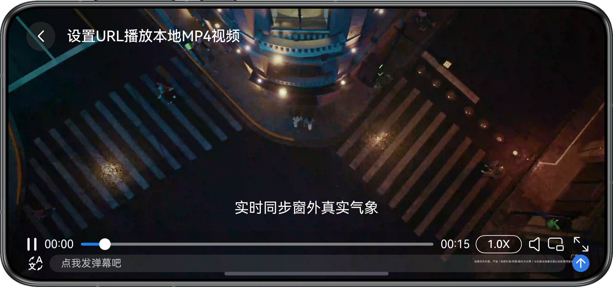
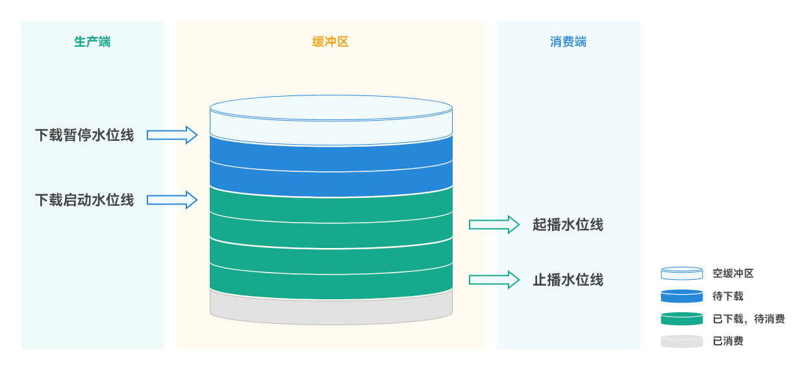

# 基于AVPlayer播放网络视频实践

更新时间：2026-03-19 08:43:01

来源：https://developer.huawei.com/consumer/cn/doc/best-practices/bpta-avplayer-embeded-network-video

## 概述


本文适用于网络视频播放类应用开发，针对市场上主流网络视频播放类应用常见场景，介绍如何基于AVPlayer系统播放器实现网络视频播放。本文指导开发者实现以下场景：

- [基础播控](#section102791912878)
- [焦点管理](#section878625410102)
- [弹幕发送与显示](#section28801440152211)
- [画中画播放](#section16229471226)
- [横竖屏切换与旋转感知](#section178071122418)
- [网络视频URL设置](#section269016599556)
- [网络视频缓冲条](#section14584123411115)
- [网络视频边缓冲边播放](#section1383513409117)


## 基础播控


### 场景描述


通过AVPlayer实现视频资源加载、播放、暂停、停止、退出、倍速播放、静音播放、窗口缩放模式、音量调节等操作。详细信息可参考《基于AVPlayer基础播控实践》。


## 焦点管理


### 场景描述


通过正确设置音频流类型、中断事件处理和自定义焦点策略，完成播放过程中的音频焦点管理。


### 开发步骤


具体开发步骤可参考基于AVPlayer播放长视频实践的焦点管理开发步骤。


## 弹幕发送与显示


### 场景描述


视频弹幕发送与显示是影音娱乐类应用中的高频使用场景之一，如用户在播放视频、观看直播时可以发送弹幕，实时评论互动，增强用户参与度。


### 开发步骤


具体开发步骤可参考基于AVPlayer播放长视频实践的弹幕发送与显示开发步骤。


## 画中画播放


### 场景描述


应用在视频播放时，可以使用画中画能力将视频内容以小窗（画中画）模式呈现。切换为小窗（画中画）模式后，用户可以进行其他界面操作，提升使用体验。


### 开发步骤


具体开发步骤可参考基于AVPlayer播放长视频实践的画中画播放开发步骤。


## 横竖屏切换与旋转感知


### 场景描述


用户播放视频时可以根据实际需求进行横竖屏切换。





### 开发步骤


具体开发步骤可参考基于AVPlayer播放长视频实践的横竖屏切换和旋转感知开发步骤。


## 通过URL设置视频源


### 场景描述


用AVPlayer开发播放功能，在不同场景下如何设置URL。该特性主要用于AVPlayer播放网络流媒体资源，包括在线流媒体链接及本地m3u8流媒体记录文件。在线流媒体支持以下协议：


| 流媒体协议类型 | 典型链接 |
| --- | --- |
| HLS | https://xxxx/index.m3u8 |
| DASH | https://xxxx.mpd |
| HTTP/HTTPS | https://xxxx.mp4 |
| HTTP-FLV | https://xxxx.flv |


详情可参考使用AVPlayer播放流媒体(ArkTS)

本章节主要介绍如何配置HLS协议和HTTP/HTTPS协议的在线链接URL，以及如何设置本地M3U8文件和MP4文件的URL，以实现视频播放功能。


### 实现原理


AVPlayer通过URL形式配置播放源，有以下两种方式：

- 一种是直接设置AVPlayer的url属性，适用于不需要额外配置项的场景，例如下文的在线视频配置URL示例。
- 另一种是调用[media.createMediaSourceWithUrl()](https://developer.huawei.com/consumer/cn/doc/harmonyos-references/arkts-apis-media-f#mediacreatemediasourcewithurl12)函数通过URL创建播放源，然后调用[AVPlayer.setMediaSource()](https://developer.huawei.com/consumer/cn/doc/harmonyos-references/arkts-apis-media-avplayer#setmediasource12)方法设置播放源，适用于需要额外配置媒体类型或者播放策略的场景，例如下文的本地M3U8文件配置URL示例。


### 开发步骤


1. 创建AVPlayer。
```ts
// Create an AVPlayer instance
public async initAVPlayer(source: VideoData, surfaceId: string) {
  // ...
  try {
    hilog.info(CommonConstants.LOG_DOMAIN, TAG, 'initPlayer videoPlay avPlayerDemo');
    // Creates the avPlayer instance object.
    this.avPlayer = await media.createAVPlayer();
    // ...
  } catch (err) {
    hilog.error(CommonConstants.LOG_DOMAIN, TAG,
    `initPlayer initPlayer, code is ${err.code}, message is ${err.message}`);
  }

}
```
2. 设置AVPlayer的url属性，或者调用[media.createMediaSourceWithUrl()](https://developer.huawei.com/consumer/cn/doc/harmonyos-references/arkts-apis-media-f#mediacreatemediasourcewithurl12)函数通过URL创建播放源，并配置到AVPlayer，之后AVPlayer将自动进入initialized状态。
```ts
// Create an AVPlayer instance
public async initAVPlayer(source: VideoData, surfaceId: string) {
  // ...
  try {
    hilog.info(CommonConstants.LOG_DOMAIN, TAG, 'initPlayer videoPlay avPlayerDemo');
    // Creates the avPlayer instance object.
    this.avPlayer = await media.createAVPlayer();
    // Creates a callback function for state machine changes.
    this.setAVPlayerCallback();
    hilog.info(CommonConstants.LOG_DOMAIN, TAG, 'initPlayer videoPlay setAVPlayerCallback');

    if (!this.context) {
      hilog.error(CommonConstants.LOG_DOMAIN, TAG, `initPlayer failed context not set`);
      return
    }
    switch (this.curSource.type) {
      // ...
      // Set online video source by url
      case VideoDataType.URL:
      this.avPlayer.url = this.curSource.videoSrc;
      hilog.info(CommonConstants.LOG_DOMAIN, TAG,
      `initPlayer videoPlay url = ${JSON.stringify(this.avPlayer.url)}`);
      break;
      // Set the mediaSource by url with playbackStrategy
      case VideoDataType.RAW_M3U8_FILE:
      let m3u8Fd = await this.context.resourceManager.getRawFd(this.curSource.videoSrc);
      let fdUrl = 'fd://' + m3u8Fd.fd + '?offset=' + m3u8Fd.offset + '&size=' + m3u8Fd.length;
      // create mediaSource by the URL instead of an assigned URL
      let mediaSource = media.createMediaSourceWithUrl(fdUrl);
      mediaSource.setMimeType(media.AVMimeTypes.APPLICATION_M3U8);
      // create PlaybackStrategy
      let playbackStrategy: media.PlaybackStrategy = { preferredBufferDuration: 20, showFirstFrameOnPrepare: true };
      await this.avPlayer.setMediaSource(mediaSource, playbackStrategy);
      hilog.info(CommonConstants.LOG_DOMAIN, TAG, `initPlayer videoPlay fdUrl = ${JSON.stringify(fdUrl)}`);
      break;
      // Set local video source by url
      case VideoDataType.RAW_MP4_FILE:
      let mp4Fd = await this.context.resourceManager.getRawFd(this.curSource.videoSrc);
      let mp4FdUrl = 'fd://' + mp4Fd.fd;
      this.avPlayer.url = mp4FdUrl;
      hilog.info(CommonConstants.LOG_DOMAIN, TAG, `initPlayer videoPlay fdUrl = ${JSON.stringify(mp4FdUrl)}`);
      break;

      default:
      hilog.error(CommonConstants.LOG_DOMAIN, TAG, `initPlayer failed VideoDataType is invalid`);
      break;
    }
    await this.setCaption();
  } catch (err) {
    hilog.error(CommonConstants.LOG_DOMAIN, TAG,
    `initPlayer initPlayer, code is ${err.code}, message is ${err.message}`);
  }

}
```


## 网络视频缓冲条


### 场景描述


网络视频缓冲进度条是影音娱乐类应用中的典型场景之一，如用户播放在线视频时，进度条显示当前缓冲的可播放进度。


### 实现原理


本示例基于AVPlayer实现在线视频播放，基于Slider实现视频播放和缓冲进度条显示。由于Slider没有多进度特性，这里使用Stack布局，将缓冲条Slider和进度条Slider重叠显示，来实现缓冲进度和播放进度同时显示的效果。

其中缓冲条Slider的value值绑定由@State修饰的状态变量currentBufferTime，并通过注册bufferingUpdate事件处理函数，在该函数中获取已缓冲内容预计可播放时长，结合已播放时长得到当前缓冲进度。


> [!NOTE]
> 由于bufferingUpdate事件的回调函数参数中，infoType为media.BufferingInfoType.CACHED_DURATION时，value为已缓冲内容预计可播放时长，该值为预估值，所以缓冲进度亦为预估值，并不能保证百分百精准。bufferingUpdate事件的回调函数参数详情可参考[OnBufferingUpdateHandler](https://developer.huawei.com/consumer/cn/doc/harmonyos-references/arkts-apis-media-t#onbufferingupdatehandler12)。


### 开发步骤


1. 创建AVPlayer，并配置好相应的播放源。
```ts
// Create an AVPlayer instance
public async initAVPlayer(source: VideoData, surfaceId: string) {
  // ...
  try {
    hilog.info(CommonConstants.LOG_DOMAIN, TAG, 'initPlayer videoPlay avPlayerDemo');
    // Creates the avPlayer instance object.
    this.avPlayer = await media.createAVPlayer();
    // Creates a callback function for state machine changes.
    this.setAVPlayerCallback();
    hilog.info(CommonConstants.LOG_DOMAIN, TAG, 'initPlayer videoPlay setAVPlayerCallback');

    if (!this.context) {
      hilog.error(CommonConstants.LOG_DOMAIN, TAG, `initPlayer failed context not set`);
      return
    }
    switch (this.curSource.type) {
      // ...
      // Set online video source by url
      case VideoDataType.URL:
      this.avPlayer.url = this.curSource.videoSrc;
      hilog.info(CommonConstants.LOG_DOMAIN, TAG,
      `initPlayer videoPlay url = ${JSON.stringify(this.avPlayer.url)}`);
      break;
      // ...
    }
    await this.setCaption();
  } catch (err) {
    hilog.error(CommonConstants.LOG_DOMAIN, TAG,
    `initPlayer initPlayer, code is ${err.code}, message is ${err.message}`);
  }

}
```
2. 注册[timeUpdate](https://developer.huawei.com/consumer/cn/doc/harmonyos-references/arkts-apis-media-avplayer#ontimeupdate9)事件处理函数，并在函数中更新由@State修饰的状态变量currentTime。
```ts
private setAVPlayerCallback() {
  // ...
  this.avPlayer.on('timeUpdate', (time: number) => {
    this.currentTime = time;
    AppStorage.setOrCreate('CurrentTime', time);
    hilog.info(CommonConstants.LOG_DOMAIN, TAG,
    `setAVPlayerCallback timeUpdate success,and new time is = ${this.currentTime}`);
  });
  // ...
}
```
3. 注册[bufferingUpdate](https://developer.huawei.com/consumer/cn/doc/harmonyos-references/arkts-apis-media-avplayer#onbufferingupdate9)事件处理函数，并在函数中更新由@State修饰的状态变量currentBufferTime。
```ts
private setAVPlayerCallback() {
  // ...
  // Listen to the streaming media buffer status and the estimated playback duration of the buffered data
  this.avPlayer.on('bufferingUpdate', (infoType: media.BufferingInfoType, value: number) => {
    hilog.info(CommonConstants.LOG_DOMAIN, TAG,
    `BufferedProgressBar bufferingUpdate, infoType is ${infoType}, value is ${value}.`);
    // ...
    if (infoType === media.BufferingInfoType.CACHED_DURATION && this.avPlayer) {
      this.currentBufferTime = Math.max(this.currentBufferTime, this.currentTime + value);
      hilog.info(CommonConstants.LOG_DOMAIN, TAG, `currentBufferTime: ${this.currentBufferTime}`)
    }
  });

  // ...
}
```
4. 绑定currentTime到播放Slider的value属性，绑定currentBufferTime到缓冲Slider的value属性，并利用[Stack](https://developer.huawei.com/consumer/cn/doc/harmonyos-guides/arkts-layout-development-stack-layout)布局将播放[Slider](https://developer.huawei.com/consumer/cn/doc/harmonyos-references/ts-basic-components-slider)和缓冲Slider重叠在一起，然后设置播放Slider的trackColor为透明，缓冲Slider的style属性设为SliderStyle.NONE以隐藏滑块。
```ts
@Builder
progressBuilder() {
  Stack() {
    Slider({
      value: this.avPlayerController.currentTime,
      min: CommonConstants.SLIDER_PROGRESS_MIN,
      max: this.avPlayerController.durationTime,
      step: CommonConstants.SLIDER_PROGRESS_STEP,
      direction: Axis.Horizontal
    })
    .blockColor(Color.White)
    .trackColor($r('app.color.track_color_show'))
    .selectedColor($r('app.color.slider_selected'))
    .trackThickness(5)
    .zIndex(1)
    .onChange((value: number) => {
      this.avPlayerController.videoSeek(value);
    })

    Slider({
      value: this.avPlayerController.currentBufferTime,
      min: CommonConstants.SLIDER_PROGRESS_MIN,
      max: this.avPlayerController.durationTime,
      step: CommonConstants.SLIDER_PROGRESS_STEP,
      direction: Axis.Horizontal,
      style: SliderStyle.NONE
    })
    .trackColor(Color.Grey)
    .selectedColor(Color.White)
    .blockColor($r('app.color.track_color_show'))
    .trackThickness(5)
    .margin({ left: 12, right: 12 })
    .zIndex(0)
  }
  .layoutWeight(1)
}
```


## 网络视频边缓冲边播放


### 场景描述


网络视频边缓冲边播放是影音娱乐类应用中的典型场景之一，如用户播放在线视频时，不用等待视频资源完全加载（缓冲）后再进行播放，可以缓冲到一定资源后，就可直接起播。AVPlayer自带边缓冲边播放的特性，本章节介绍AVPlayer缓冲区相关参数配置。


### AVPlayer缓冲区工作过程


对于缓冲区而言，下载线程是生产端，读取线程则是消费端。生产端将数据写入到缓冲区中，消费端则从缓冲区读取数据，下面将介绍缓冲区中的几个水位线概念。





以上四个水位线取值情况如下，其中起播水位线，和下载暂停水位线（缓冲区大小）可通过配置AVPlayer的播放策略来控制，其他两个暂未提供配置接口。


| 水位线 | 默认值 | 说明 |
| --- | --- | --- |
| 起播水位线 | 若下载速率 >= 码率场景，起播水位线取值：0.3秒 * 码率 若下载速率 < 码率场景，起播水位线取值：5秒 * 码率 若起播水位线小于10KB，取10KB | 在快速起播和顺滑播放间进行一个相对合理的分割。 |
| 止播水位线 | 单次读取数据量，若小于5KB则取5KB | 避免将缓冲区中的可用数据耗尽。 |
| 下载启动水位线 | 480KB | 降低线程启动频率，进行集中下载，降低cpu及指令数消耗。 |
| 下载暂停水位线 | 缓冲区大小 | 当缓冲区写满时，停止下载，支持修改。 |


起播水位线的默认值是根据下载速率确定，下载速率 >= 码率时，取值：0.3秒 * 码率，即缓冲速度大于播放速度时，缓冲到0.3秒，开始播放；下载速率 < 码率时，起播水位线取值：5秒 * 码率，即在缓冲内容累计满5秒后开始播放。这样可以在网络好的情况下快起播，减少用户等待时间，在网络差的情况下慢起播，避免播放和暂停状态间频繁来回切换，影响用户体验。若开发者不满足默认设置，可通过配置AVPlayer播放策略PlaybackStrategy来控制起播水位线。

下载暂停水位线是指已缓冲，但还未被消费（播放）数据最大占用空间，该值的大小依赖于缓冲区大小，可通过配置缓冲区大小间接控制该参数值。该值设置太小的话，在网络波动较大的环境，可能会影响视频播放的顺滑度；设置太大的情况下，一定程度会浪费用户网络资源。该参数默认为最大值20M，开发者可根据需要自行配置PlaybackStrategy中的preferredBufferDuration参数来控制缓冲区大小。preferredBufferDuration的单位为秒，缓冲区大小将被设定为preferredBufferDuration * 1MB。例如，将preferredBufferDuration设为20秒，缓冲区大小将被设置为20MB。


| 默认缓冲区大小 | 用户自定义缓冲区大小 |
| --- | --- |
| 20MB | 5MB ~ 20MB |


起播水位线和下载暂停水位线（缓冲区大小）的配置方式均由AVPlayer的播放策略控制，播放策略的配置方式有两种：

- 一种是通过AVPlayer的[setMediaSource()](https://developer.huawei.com/consumer/cn/doc/harmonyos-references/arkts-apis-media-avplayer#setmediasource12)方法将[PlaybackStrategy](https://developer.huawei.com/consumer/cn/doc/harmonyos-references/arkts-apis-media-i#playbackstrategy12)实例配置进AVPlayer，详情可参考[在线视频播放卡顿优化](https://developer.huawei.com/consumer/cn/doc/best-practices/bpta-online-video-playback-lags-practice#section1411814743015)。
- 另一种是通过AVPlayer的[setPlaybackStrategy()](https://developer.huawei.com/consumer/cn/doc/harmonyos-references/arkts-apis-media-avplayer#setplaybackstrategy12)方法将[PlaybackStrategy](https://developer.huawei.com/consumer/cn/doc/harmonyos-references/arkts-apis-media-i#playbackstrategy12)实例配置进AVPlayer，第二种需要在AVPlayer状态为initialized或者stopped时，才可生效。


### 通过setMediaSource()方法配置


1. 创建AVPlayer，并通过[media.createMediaSourceWithUrl()](https://developer.huawei.com/consumer/cn/doc/harmonyos-references/arkts-apis-media-f#mediacreatemediasourcewithurl12)方法生成MediaSource实例。
```ts
// Create an AVPlayer instance
public async initAVPlayer(source: VideoData, surfaceId: string) {
  // ...
  try {
    hilog.info(CommonConstants.LOG_DOMAIN, TAG, 'initPlayer videoPlay avPlayerDemo');
    // Creates the avPlayer instance object.
    this.avPlayer = await media.createAVPlayer();
    // Creates a callback function for state machine changes.
    this.setAVPlayerCallback();
    hilog.info(CommonConstants.LOG_DOMAIN, TAG, 'initPlayer videoPlay setAVPlayerCallback');

    if (!this.context) {
      hilog.error(CommonConstants.LOG_DOMAIN, TAG, `initPlayer failed context not set`);
      return
    }
    switch (this.curSource.type) {
      // ...
      // Set online video source by url
      case VideoDataType.URL:
      this.avPlayer.url = this.curSource.videoSrc;
      hilog.info(CommonConstants.LOG_DOMAIN, TAG,
      `initPlayer videoPlay url = ${JSON.stringify(this.avPlayer.url)}`);
      break;
      // ...
    }
    await this.setCaption();
  } catch (err) {
    hilog.error(CommonConstants.LOG_DOMAIN, TAG,
    `initPlayer initPlayer, code is ${err.code}, message is ${err.message}`);
  }

}
```
2. 创建PlaybackStrategy实例，并通过AVPlayer的[setMediaSource()](https://developer.huawei.com/consumer/cn/doc/harmonyos-references/arkts-apis-media-avplayer#setmediasource12)方法，将[PlaybackStrategy](https://developer.huawei.com/consumer/cn/doc/harmonyos-references/arkts-apis-media-i#playbackstrategy12)实例配置进AVPlayer。
```ts
// Create an AVPlayer instance
public async initAVPlayer(source: VideoData, surfaceId: string) {
  // ...
  try {
    // ...
    switch (this.curSource.type) {
      // ...
      // Set the mediaSource by url with playbackStrategy
      case VideoDataType.RAW_M3U8_FILE:
      let m3u8Fd = await this.context.resourceManager.getRawFd(this.curSource.videoSrc);
      let fdUrl = 'fd://' + m3u8Fd.fd + '?offset=' + m3u8Fd.offset + '&size=' + m3u8Fd.length;
      // create mediaSource by the URL instead of an assigned URL
      let mediaSource = media.createMediaSourceWithUrl(fdUrl);
      mediaSource.setMimeType(media.AVMimeTypes.APPLICATION_M3U8);
      // create PlaybackStrategy
      let playbackStrategy: media.PlaybackStrategy = { preferredBufferDuration: 20, showFirstFrameOnPrepare: true };
      await this.avPlayer.setMediaSource(mediaSource, playbackStrategy);
      hilog.info(CommonConstants.LOG_DOMAIN, TAG, `initPlayer videoPlay fdUrl = ${JSON.stringify(fdUrl)}`);
      break;
      // ...
    }
    await this.setCaption();
  } catch (err) {
    hilog.error(CommonConstants.LOG_DOMAIN, TAG,
    `initPlayer initPlayer, code is ${err.code}, message is ${err.message}`);
  }

}
```


### 通过setPlaybackStrategy()方法配置


1. 创建AVPlayer，并直接通过赋值AVPlayer.url属性，对AVPlayer初始化。
```ts
// Create an AVPlayer instance
public async initAVPlayer(source: VideoData, surfaceId: string) {
  // ...
  try {
    hilog.info(CommonConstants.LOG_DOMAIN, TAG, 'initPlayer videoPlay avPlayerDemo');
    // Creates the avPlayer instance object.
    this.avPlayer = await media.createAVPlayer();
    // Creates a callback function for state machine changes.
    this.setAVPlayerCallback();
    hilog.info(CommonConstants.LOG_DOMAIN, TAG, 'initPlayer videoPlay setAVPlayerCallback');

    if (!this.context) {
      hilog.error(CommonConstants.LOG_DOMAIN, TAG, `initPlayer failed context not set`);
      return
    }
    switch (this.curSource.type) {
      // ...
      // Set online video source by url
      case VideoDataType.URL:
      this.avPlayer.url = this.curSource.videoSrc;
      hilog.info(CommonConstants.LOG_DOMAIN, TAG,
      `initPlayer videoPlay url = ${JSON.stringify(this.avPlayer.url)}`);
      break;
      // ...
    }
    await this.setCaption();
  } catch (err) {
    hilog.error(CommonConstants.LOG_DOMAIN, TAG,
    `initPlayer initPlayer, code is ${err.code}, message is ${err.message}`);
  }

}
```
2. 注册AVPlayer的状态回调函数，并在initialized状态回调中配置[PlaybackStrategy](https://developer.huawei.com/consumer/cn/doc/harmonyos-references/arkts-apis-media-i#playbackstrategy12)实例。
```ts
// Callback function for state machine changes
this.avPlayer.on('stateChange', async (state) => {
  if (!this.avPlayer) {
    return;
  }
  switch (state) {
    // ...
    case 'initialized': // This status is reported after the playback source is set on the AVPlayer.
      hilog.info(
        CommonConstants.LOG_DOMAIN,
        TAG,
        'setAVPlayerCallback AVPlayerState initialized called.',
      );
      // Set the display screen. This parameter is not required when the resource to be played is audio-only.
      this.avPlayer.surfaceId = this.surfaceID;
      hilog.info(
        CommonConstants.LOG_DOMAIN,
        TAG,
        `setAVPlayerCallback this.avPlayer.surfaceId = ${this.avPlayer.surfaceId}`,
      );
      await this.avPlayer.setPlaybackStrategy({
        preferredBufferDurationForPlaying: 0.3,
        preferredBufferDuration: 20,
        showFirstFrameOnPrepare: true,
      });
      this.avPlayer.prepare();
      break;
    // ...
  }
});
```


## 示例代码


- [基于AVPlayer播放网络视频实践](https://gitcode.com/harmonyos_samples/avplayer-online-video)
