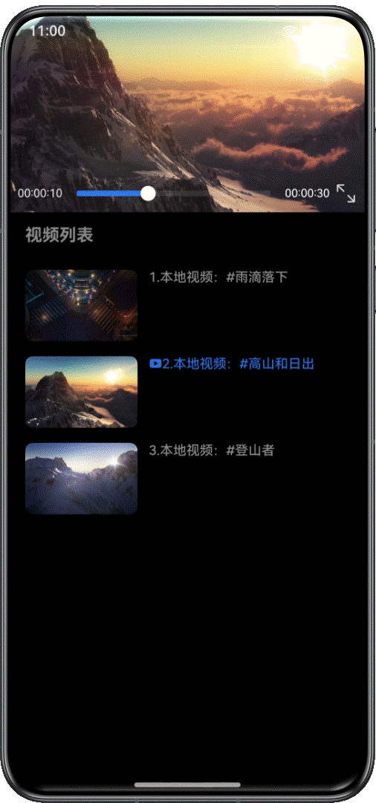
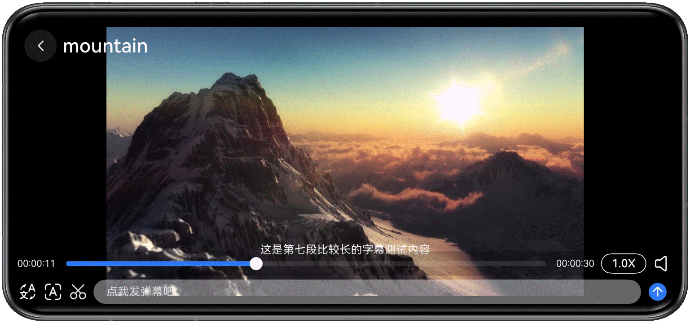
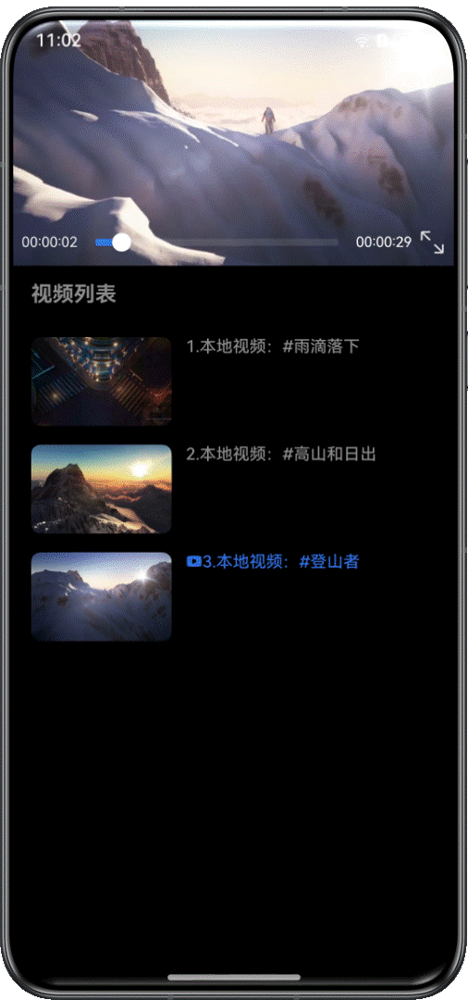
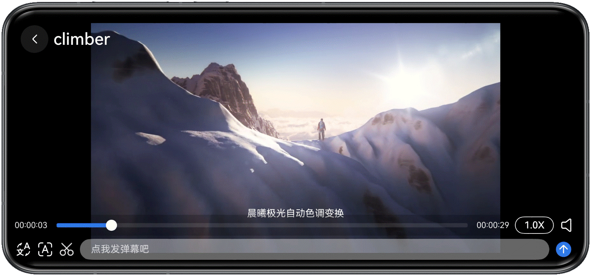

# 基于AVPlayer播放长视频实践

更新时间：2026-03-12 08:45:02

来源：https://developer.huawei.com/consumer/cn/doc/best-practices/bpta-avplayer-long-video

## 概述


本文适用于视频播放类应用的开发，针对市场上主流视频播放类应用的常见场景，介绍了如何基于AVPlayer系统播放器实现长视频播放。本文指导开发者实现基本播控、精准跳转、静音播放、窗口缩放模式设置、倍速播放、音量控制、亮度控制、焦点管理、前后台感知、弹幕发送与显示、字幕挂载、视频截图、画中画播放、后台播放与接入播控中心、视频首帧显示等开发场景。

- [亮度控制](#section512331617222)
- [焦点管理](#section745373252219)
- [前后台感知](#section141437368229)
- [弹幕发送与显示](#section28801440152211)
- [视频截图](#section3655185020221)
- [画中画播放](#section16229471226)
- [接入播控中心](#section1489902163313)
- [后台播放](#section19176174913234)
- [视频首帧显示](#section96024162316)
- [横竖屏切换与旋转感知](#section178071122418)
- [视频无缝转场播放](#section86364193363)


## 基本播控


基本播控、精准跳转、静音播放、窗口缩放设置、倍速播放、音量控制、字幕挂载场景参见《基于AVPlayer基础播控实践》。


## 亮度控制


### 场景描述


用户在横屏播放视频时可通过手势滑动调节屏幕亮度。


### 实现原理


使用Slider组件设置亮度面板，绑定PanGesture滑动手势事件，当Pan手势在移动过程中调用setWindowBrightness()方法，实现上滑增加亮度、下滑减少亮度的功能。


### 开发步骤


1. 当进入全屏播放模式时，在视频播放界面右侧区域添加Slider组件，用来展示屏幕亮度变化情况。
```ts
Column() {
  Stack() {
    Slider({
      value: this.screenBrightness,
      min: 0,
      max: 1,
      step: 0.05,
      style: SliderStyle.NONE,
      direction: Axis.Vertical,
      reverse: true
    })
    .visibility(this.visible ? Visibility.Visible : Visibility.Hidden)
    .height(160)
    .selectedColor(Color.White)
    .trackColor(Color.Black)
    .trackThickness(40)

    Image($r('app.media.sun_max_fill'))
    .visibility(this.visible ? Visibility.Visible : Visibility.Hidden)
    .margin({ top: 120 })
    .width(20)
    .height(20)
  }
  .margin({
    top: 0,
    right: 0
  })
}
.width('50%')
.alignItems(HorizontalAlign.End)
.justifyContent(FlexAlign.Center)
.padding({
  right: 30,
  bottom: 20
})
```
2. 在视频播放界面绑定PanGesture滑动手势事件，设置触发条件为仅在屏幕右侧区域且垂直方向滑动Pan手势时，调用setWindowBrightness()方法，实现亮度的调节。
补充说明：此处setScreenBrightness()为setWindowBrightness()的封装。
```ts
.gesture(
// Sliding in the vertical direction
PanGesture({ direction: PanDirection.Vertical })
.onActionStart(() => {
})
.onActionUpdate((event: GestureEvent) => {
  // The area on the right side of the screen
  if (event.fingerList[0].globalX > (this.screenWidth / 2)) {
    if (this.isInputtingBulletComment) {
      return; // When inputting bullet comment, disable screen brightness change
    }
    this.visible = true;
    let curBrightness = this.screenBrightness -
    this.getUIContext().vp2px(event.offsetY) / this.getUIContext().vp2px(this.screenHeight);
    curBrightness = this.getValidValue(curBrightness, 0.0, 1.0);
    this.screenBrightness = curBrightness;
    this.setScreenBrightness(this.screenBrightness);
  } else {
    this.visible = false;
    let curVolume = this.volume - this.getUIContext().vp2px(event.offsetY) / this.screenHeight;
    curVolume = this.getValidValue(curVolume, 0.0, 15.0);
    this.volume = curVolume;
  }
})
.onActionEnd(() => {
  setTimeout(() => {
    this.visible = false;
  }, 3000)
})
)
```


## 焦点管理


### 场景描述


通过正确设置音频流类型、中断事件处理和自定义焦点策略，完成播放过程音频焦点管理。


### 实现原理


通过AVPlayer的on('audioInterrupt')方法，监听音频焦点变化，根据不同的打断类型和中断提示作相应的处理，更多焦点管理相关说明可参考音频焦点管理。

- 当闹钟或电话等外部打断事件发生时，打断类型为强制打断（INTERRUPT_FORCE），视频会自动中断播放。
- 当闹钟或电话的提示音结束后，系统将发送打断类型为共享打断类型(INTERRUPT_SHARE)、中断提示为音频可继续播放(INTERRUPT_HINT_RESUME)的事件，应用在监听到该事件时调用AVPlayer的play()函数恢复播放。


### 开发步骤


1. 通过AVPlayer实例注册[on('audioInterrupt')](https://developer.huawei.com/consumer/cn/doc/harmonyos-references/arkts-apis-media-avplayer#onaudiointerrupt9)方法，监听外部打断事件，当打断类型为INTERRUPT_FORCE时，视频会自动中断播放。
2. 当打断类型为INTERRUPT_SHARE、中断提示为INTERRUPT_HINT_RESUME时，调用videoPlay()函数恢复播放视频。补充说明：此处videoPlay()为[play()](https://developer.huawei.com/consumer/cn/doc/harmonyos-references/arkts-apis-media-avplayer#play9)的封装。
```ts
private setInterruptCallback() {
  if (!this.avPlayer) {
    return;
  }
  this.avPlayer.on('audioInterrupt', async (interruptEvent: audio.InterruptEvent) => {
    if (interruptEvent.forceType === audio.InterruptForceType.INTERRUPT_FORCE) {
      // For the INTERRUPT_FORCE type: Audio-related processing has been performed by the system, and the
      // application needs to update its own state and make the corresponding adjustments.
      switch (interruptEvent.hintType) {
        // This branch indicates that the system has paused the audio stream (temporarily lost focus).
        case audio.InterruptHint.INTERRUPT_HINT_PAUSE:
        // This branch indicates that the system has stopped the audio stream (permanently lost focus).
        case audio.InterruptHint.INTERRUPT_HINT_STOP:
        this.isPlaying = false;
        this.updateIsPlay();
        break;
        // This branch indicates that the system has reduced the audio volume (default to 20% of the normal volume).
        case audio.InterruptHint.INTERRUPT_HINT_DUCK:
        // This branch indicates that the system has restored the audio volume to normal.
        case audio.InterruptHint.INTERRUPT_HINT_UNDUCK:
        break;
        default:
        break;
      }
    } else if (interruptEvent.forceType === audio.InterruptForceType.INTERRUPT_SHARE) {
      // For the INTERRUPT_SHARE type: The application can choose to perform related actions or ignore the
      // audio interruption event.
      switch (interruptEvent.hintType) {
        // This branch indicates that the audio stream, which was paused due to temporary loss of focus,
        // can resume playing.
        case audio.InterruptHint.INTERRUPT_HINT_RESUME:
        this.videoPlay();
        break;
        default:
        break;
      }
    }
  })
}
```


## 前后台感知


### 场景描述


应用从前台切到后台，再从后台切回前台时，能够保持原有进度继续播放原视频。


### 实现原理


在切换到前台的生命周期方法onPageShow()里调用AVPlayer的播放方法play()，并在切换到后台的生命周期方法onPageHide()里调用AVPlayer的暂停方法pause()。


### 开发步骤


1. 在主页面的onPageShow()和onPageHide()里变更状态变量。
```ts
onPageHide(): void {
  this.isPageShow = false;
}
```

```ts
onPageShow(): void {
  this.isPageShow = true;
}
```
2. 在视频播放组件里对该状态变量添加@Watch装饰器。
```ts
@Prop @Watch('onPageShowChange') isPageShow: boolean = false; // Whether the app is on the front end or back end
```
3. 通过监听事件onPageShowChange调用AVPlayer的播放/暂停方法，以实现切换到后台时视频暂停播放、切回前台时视频恢复播放。补充说明：此处avPlayerController为基于AVPlayer实现基本播控的控制器实例，resumePlayback()和pausePlay()分别为[play()](https://developer.huawei.com/consumer/cn/doc/harmonyos-references/arkts-apis-media-avplayer#play9)和[pause()](https://developer.huawei.com/consumer/cn/doc/harmonyos-references/arkts-apis-media-avplayer#pause9)的封装。
```ts
onPageShowChange() {
  if (!this.isPIPShow && this.curIndex === this.index) {
    this.isPageShow ? this.resumePlayback() : this.pausePlay();
  }
}
```

```ts
private resumePlayback() {
  if (!this.avPlayerController.isPlaying) {
    this.avPlayerController.videoPlay();
  }
}
```

```ts
private pausePlay() {
  if (this.avPlayerController.isPlaying) {
    this.avPlayerController.videoPause();
  }
}
```


## 弹幕发送与显示


### 场景描述


视频弹幕发送与显示是影音娱乐类应用中的高频使用场景之一，如用户在播放视频、观看直播时可以发送弹幕，实时评论互动，增强用户参与度。


### 实现原理


通过数组保存实现弹幕发送，基于setInterval()函数和translate属性实现弹幕水平移动的动画效果。


### 开发步骤


1. 在视频播放组件里定义一个空数组，用来保存发送的弹幕，用户输入弹幕点击发送后将输入内容存入当前数组中。
```ts
private sendBulletComment() {
  if (this.bulletCommentInput.trim()) {
    this.bulletComments = [...this.bulletComments, new BulletComment(this.bulletCommentInput, true)];
    this.bulletCommentInput = '';
    if (this.bulletComments.length > 50) {
      this.bulletComments = this.bulletComments.slice(1);
    }
  }
  this.resumePlayback(); // Resume video playback after sending
}
```
2. 在弹幕展示组件中，通过调用[setInterval](https://developer.huawei.com/consumer/cn/doc/harmonyos-references/js-apis-timer#setinterval)函数设置定时器，定时器定时刷新承载弹幕内容的Text组件的[translate](https://developer.huawei.com/consumer/cn/doc/harmonyos-references/ts-page-transition-animation#translate)属性，刷新所有弹幕位置。
```ts
// Start bullet comment animation
private startAnimation() {
  if (this.timerId > 0) {
    clearInterval(this.timerId);
  }
  // Refresh the postion of bullet comments by timer
  this.timerId = setInterval(() => {
    let needUpdate = false;
    this.bulletComments.forEach(item => {
      const positionX = item.translateX - item.speed;
      if (positionX !== item.translateX) {
        item.translateX = positionX; // Set new X position of bullet comment
        needUpdate = true;
      }
    });
    const beforeLength = this.bulletComments.length;
    this.bulletComments =
    this.bulletComments.filter(item => item.translateX > -20); // Remove the bullet comment which beyond the screen
    if (needUpdate || this.bulletComments.length !== beforeLength) {
      this.forceUpdate = !this.forceUpdate; // Trigger ui refresh
    }
  }, 16);
}
```


## 视频截图


### 场景描述


视频截图是影音娱乐类应用中的典型场景之一，如用户可在观看视频时截取画面，并对截图的前后帧进行微调，避免所截图片与预期不符。


### 实现原理


以XComponent作为媒体流播放组件，通过ComponentSnapshot对象获取组件截图的能力。


### 开发步骤


1. 通过getUIContext().getComponentSnapshot().get()方法获取视频播放组件XComponent当前截图。
```ts
private async screenshot() {
  try {
    this.pixmap = await this.getUIContext().getComponentSnapshot().get(`videoXComponent_${this.curSource.index}`);
  } catch (exception) {
    hilog.error(0x0000, TAG, `screenshot failed: code: ${exception.code}, message: ${exception.message}`);
  }
}
```
2. 调用AVPlayer的[seek()](https://developer.huawei.com/consumer/cn/doc/harmonyos-references/arkts-apis-media-avplayer#seek9)方法跳转到视频播放的上一秒或下一秒，再次通过步骤1的方法获取当前截图。
补充说明：此处avPlayerController为基于AVPlayer实现基本播控的控制器实例，videoSeek()为seek()的封装。
```ts
private async clickPreviousFrame() {
  this.avPlayerController?.videoSeek(this.screenshotTime - 1000 / ScreenShotConstants.FRAME_RATE);
  this.pausePlay();
  setTimeout(() => {
    this.screenshot()
  }, 500)
  this.screenshotTime -= 1000 / ScreenShotConstants.FRAME_RATE
}
```


```ts
private async clickNextFrame() {
  this.avPlayerController?.videoSeek(this.screenshotTime + 1000 / ScreenShotConstants.FRAME_RATE);
  this.pausePlay();
  setTimeout(() => {
    this.screenshot()
  }, 500)
  this.screenshotTime += 1000 / ScreenShotConstants.FRAME_RATE
}
```


## 画中画播放


### 场景描述


应用在视频播放时，可以使用画中画能力将视频内容以小窗（画中画）模式呈现。切换为小窗（画中画）模式后，用户可以进行其他界面操作，提升使用体验。


### 实现原理


以XComponent作为媒体流播放组件，通过PiPWindow模块实现画中画基础功能。


> [!NOTE]
> 仅支持以XComponent作为媒体流播放组件的界面进入画中画模式，XComponent的type必须为XComponentType.SURFACE。在API version 20之前，支持在Phone、Tablet设备使用XComponent实现画中画功能开发；从API version 20开始，支持在Phone、PC/2in1、Tablet设备使用XComponent实现画中画功能开发。


### 开发步骤


1. 创建画中画控制器，设置[setAutoStartEnabled()](https://developer.huawei.com/consumer/cn/doc/harmonyos-references/js-apis-pipwindow#setautostartenabled)为true以在应用返回桌面时启动画中画。
```ts
// Create PIPWindows
async createPipController() {
  if (!this.pipController) {
    try {
      this.pipController = await PiPWindow.create({
        context: this.context,
        componentController: this.xComponentController,
        templateType: PiPWindow.PiPTemplateType.VIDEO_PLAY
      });
    } catch (exception) {
      Logger.error(TAG,
      `pipController init failed, Code:${exception.code}, message:${exception.message}`);
    }
  }
  this.pipController?.on('stateChange', (State: PiPWindow.PiPState, reason: string) => {
    this.onStateChange(State, reason);
  })

  this.pipController?.on('controlPanelActionEvent', (event: PiPWindow.PiPActionEventType, status?: number) => {
    this.onActionEvent(event, status);
  })
  this.pipController?.setAutoStartEnabled(true); // Key point:  Set the animation to start when the application returns to the desktop
}
```
2. 注册生命周期事件和控制事件回调。
```ts
onStateChange(state: PiPWindow.PiPState, reason: string) {
  switch (state) {
    case PiPWindow.PiPState.ABOUT_TO_START:
    this.curState = 'ABOUT_TO_START';
    break;
    case PiPWindow.PiPState.STARTED:
    this.curState = 'STARTED';
    let status: PiPWindow.PiPControlStatus =
    this.avPlayerController?.isPlaying ? PiPWindow.PiPControlStatus.PLAY : PiPWindow.PiPControlStatus.PAUSE;
    this.pipController?.updatePiPControlStatus(PiPWindow.PiPControlType.VIDEO_PLAY_PAUSE, status);
    break;
    case PiPWindow.PiPState.ABOUT_TO_STOP:
    this.curState = 'ABOUT_TO_STOP';
    break;
    case PiPWindow.PiPState.STOPPED:
    this.curState = 'STOPPED';
    break;
    case PiPWindow.PiPState.ABOUT_TO_RESTORE:
    this.curState = 'ABOUT_TO_RESTORE';
    break;
    case PiPWindow.PiPState.ERROR:
    this.curState = 'ERROR';
    break;
    default:
    break;
  }
}
```

```ts
onActionEvent(event: PiPWindow.PiPActionEventType, status?: number) {
  switch (event) {
    case 'playbackStateChanged':
    if (status === 0) {
      this.avPlayerController?.videoPause();
    } else {
      this.avPlayerController?.videoPlay();
    }
    break;
    default:
    break;
  }
}
```
3. 销毁画中画控制器，设置setAutoStartEnabled()为false以关闭画中画。
```ts
// Destroy PIPWindows
destroyPipController() {
  if (!this.pipController) {
    return;
  }
  this.pipController.setAutoStartEnabled(false);
  this.pipController.off('stateChange');
  this.pipController.off('controlPanelActionEvent');
  this.pipController = undefined;
}
```


## 接入播控中心


### 场景描述


通过播控中心，控制播放、暂停、切换上下视频。


### 实现原理


通过AVSessionKit音频播控服务实现视频应用接入播控中心。


### 开发步骤


1. 通过[createAVSession()](https://developer.huawei.com/consumer/cn/doc/harmonyos-references/arkts-apis-avsession-f#avsessioncreateavsession10)创建AVSession实例并激活媒体会话，[AVSessionType](https://developer.huawei.com/consumer/cn/doc/harmonyos-references/arkts-apis-avsession-t#avsessiontype10)设置为video。
```ts
public initAvSession() {
  this.context = AppStorage.get('context');
  if (!this.context) {
    Logger.error(TAG, 'session create failed : context is undefined');
    return;
  }
  avSession.createAVSession(this.context, 'LONG_VIDEO_SESSION', 'video').then(async (avSession) => {
    this.avSession = avSession;
    BackgroundTaskManager.startContinuousTask(this.context);
    this.setLaunchAbility();
    this.avSession.activate().catch((err: BusinessError) => {
      Logger.error(TAG, `avSession activate failed, code is ${err.code}, message is ${err.message}`);
    });
  }).catch((err: BusinessError) => {
    Logger.error(TAG, `createAVSession failed, code is ${err.code}, message is ${err.message}`);
  });
}
```
2. 通过[setAVMetadata()](https://developer.huawei.com/consumer/cn/doc/harmonyos-references/arkts-apis-avsession-avsession#setavmetadata10)把会话的一些元数据信息设置给系统，从而在播控中心界面进行展示。如媒体ID（assetId）、标题（title）、播控中心显示的图片（mediaImage）、媒体时长（duration）等。
```ts
// Set video session metadata
public async setAVMetadata(curSource: VideoData, duration: number) {
  if (curSource === undefined) {
    Logger.error(TAG, 'SetAVMetadata Error, curSource is null');
    return;
  }
  let metadata: avSession.AVMetadata = {
    assetId: `${curSource.index}`,
    title: curSource.name,
    duration: duration // Video duration
  };
  if (this.avSession) {
    this.avSession.setAVMetadata(metadata).then(() => {
      this.avSessionMetadata = metadata;
    }).catch((err: BusinessError) => {
      Logger.error(TAG, `SetAVMetadata BusinessError: code: ${err.code}, message: ${err.message}`);
    });
  }
}
```
3. 设置用于被播控中心拉起的UIAbility。
```ts
private setLaunchAbility() {
  if (!this.context) {
    return;
  }
  const wantAgentInfo: wantAgent.WantAgentInfo = {
    wants: [
    {
      bundleName: this.context.abilityInfo.bundleName,
      abilityName: this.context.abilityInfo.name
    }
    ],
    operationType: wantAgent.OperationType.START_ABILITIES,
    requestCode: 0,
    wantAgentFlags: [wantAgent.WantAgentFlags.UPDATE_PRESENT_FLAG]
  };
  wantAgent.getWantAgent(wantAgentInfo).then((agent) => {
    if (this.avSession) {
      this.avSession.setLaunchAbility(agent).catch((err: BusinessError) => {
        Logger.error(TAG, `setLaunchAbility failed: code: ${err.code}, message: ${err.message}`);
      });
    }
  }).catch((err: BusinessError) => {
    Logger.error(TAG, `getWantAgent failed: code: ${err.code}, message: ${err.message}`);
  });
}
```
4. 注册播控命令事件监听，便于响应用户通过播控中心下发的播控命令，比如播放[on('play')](https://developer.huawei.com/consumer/cn/doc/harmonyos-references/arkts-apis-avsession-avsession#onplay10)、暂停[on('pause')](https://developer.huawei.com/consumer/cn/doc/harmonyos-references/arkts-apis-avsession-avsession#onpause10)、上一曲[on('playPrevious')](https://developer.huawei.com/consumer/cn/doc/harmonyos-references/arkts-apis-avsession-avsession#onplayprevious10)、下一曲[on('playNext')](https://developer.huawei.com/consumer/cn/doc/harmonyos-references/arkts-apis-avsession-avsession#onplaynext10)等。
```ts
// Set background control monitor the callback events
public async setAvSessionListener() {
  if (!this.avSessionController) {
    return;
  }
  try {
    this.avSessionController.getAvSession()?.on('play', () => this.sessionPlayCallback());
    this.avSessionController.getAvSession()?.on('pause', () => this.sessionPauseCallback());
    this.avSessionController.getAvSession()?.on('seek', (seekTime: number) => this.sessionSeekCallback(seekTime));
    this.avSessionController.getAvSession()?.on('setLoopMode', (mode: avSession.LoopMode) => {
      Logger.info(`on setLoopMode: ${mode}`)
    });
    this.avSessionController.getAvSession()?.on('playPrevious', () => {
      this.sessionPlayPreviousCallback();
    });
    this.avSessionController.getAvSession()?.on('playNext', () => {
      this.sessionPlayNextCallback();
    });
  } catch (exception) {
    Logger.error(TAG,
    `Invoke setAvSessionListener failed, code is ${exception.code}, message is ${exception.message}`);
  }
}
```
5. 应用状态上报播控中心，当视频状态发生改变时，需要通过[setAVPlaybackState()](https://developer.huawei.com/consumer/cn/doc/harmonyos-references/arkts-apis-avsession-avsession#setavplaybackstate10)向播控中心上报视频状态，来达到播控中心与应用的状态同步，包括播放状态（state）、播放位置（position）、当前媒体播放时长（duration）等。
```ts
// Report the video state to background control
private updateIsPlay() {
  this.avSessionController.setAvSessionPlayState({
    state: this.isPlaying ? avSession.PlaybackState.PLAYBACK_STATE_PLAY :
    avSession.PlaybackState.PLAYBACK_STATE_PAUSE,
    position: {
      elapsedTime: this.currentTime,
      updateTime: new Date().getTime()
    },
    duration: this.currentTime
  });
}
```

```ts
public setAvSessionPlayState(playbackState: avSession.AVPlaybackState) {
  if (this.avSession) {
    this.avSession.setAVPlaybackState(playbackState, (err: BusinessError) => {
      if (err) {
        Logger.error(TAG, `SetAVPlaybackState BusinessError: code: ${err.code}, message: ${err.message}`);
      } else {
        Logger.info(TAG, 'SetAVPlaybackState successfully');
      }
    });
  }
}
```


## 后台播放


### 场景描述


视频切换到后台播放。


### 实现原理


首先需实现播控中心的接入，在此基础上申请后台运行权限并设置后台模式，同时为视频应用创建长时后台任务，从而实现视频在后台持续播放的功能。


> [!NOTE]
> 后台播放的实现依赖于播控中心，建议开发者先完成[接入播控中心](#section1489902163313)章节的学习。


### 开发步骤


1. 在module.json5配置文件中配置ohos.permission.KEEP_BACKGROUND_RUNNING权限和后台模式audioPlayback。
```json
"requestPermissions": [
{
  "name": "ohos.permission.KEEP_BACKGROUND_RUNNING",
  "reason": "$string:reason_background",
  "usedScene": {
    "abilities": [
    "EntryAbility"
    ],
    "when": "always"
  }
}
],
```

```json
"backgroundModes": [
"audioPlayback"
],
```
2. 创建后台任务管理类，实现后台任务的申请（startContinuousTask）与取消（stopContinuousTask），长时任务类型选择[AUDIO_PLAYBACK](https://developer.huawei.com/consumer/cn/doc/harmonyos-references/js-apis-resourceschedule-backgroundtaskmanager#backgroundmode)，表示视频后台播放。
```ts
public static startContinuousTask(context?: common.UIAbilityContext): void {
  if (!context) {
    return;
  }
  let wantAgentInfo: wantAgent.WantAgentInfo = {
    wants: [
    {
      bundleName: context.abilityInfo.bundleName,
      abilityName: context.abilityInfo.name
    }
    ],
    operationType: wantAgent.OperationType.START_ABILITY,
    requestCode: 0,
    wantAgentFlags: [wantAgent.WantAgentFlags.UPDATE_PRESENT_FLAG]
  };
  wantAgent.getWantAgent(wantAgentInfo).then((wantAgentObj) => {
    if (canIUse('SystemCapability.ResourceSchedule.BackgroundTaskManager.Core')) {
      backgroundTaskManager.startBackgroundRunning(context,
      backgroundTaskManager.BackgroundMode.AUDIO_PLAYBACK, wantAgentObj).then(() => {
      }).catch((err: BusinessError) => {
        Logger.error(TAG, `startBackgroundRunning failed, code is ${err.code}, message is ${err.message}`);
      });
    }
  }).catch((err: BusinessError) => {
    Logger.error(TAG, `getWantAgent failed, code is ${err.code}, message is ${err.message}`);
  });
}
```

```ts
public static stopContinuousTask(context?: common.UIAbilityContext): void {
  if (!context) {
    return;
  }
  if (canIUse('SystemCapability.ResourceSchedule.BackgroundTaskManager.Core')) {
    backgroundTaskManager.stopBackgroundRunning(context).then(() => {
    }).catch((err: BusinessError) => {
      Logger.error(TAG, `stopBackgroundRunning failed, code is ${err.code}, message is ${err.message}`);
    });
  }
}
```
3. 在AVSession创建和释放时，分别申请和销毁后台长时任务。
```ts
public initAvSession() {
  this.context = AppStorage.get('context');
  if (!this.context) {
    Logger.error(TAG, 'session create failed : context is undefined');
    return;
  }
  avSession.createAVSession(this.context, 'LONG_VIDEO_SESSION', 'video').then(async (avSession) => {
    this.avSession = avSession;
    BackgroundTaskManager.startContinuousTask(this.context);
    this.setLaunchAbility();
    this.avSession.activate().catch((err: BusinessError) => {
      Logger.error(TAG, `avSession activate failed, code is ${err.code}, message is ${err.message}`);
    });
  }).catch((err: BusinessError) => {
    Logger.error(TAG, `createAVSession failed, code is ${err.code}, message is ${err.message}`);
  });
}
```

```ts
async unregisterSessionListener() {
  if (!this.avSession) {
    return;
  }
  try {
    this.avSession.off('play');
    this.avSession.off('pause');
    this.avSession.off('playNext');
    this.avSession.off('playPrevious');
    this.avSession.off('setLoopMode');
    this.avSession.off('seek');
  } catch (exception) {
    Logger.error(TAG, `unregisterSessionListener failed: code: ${exception.code}, message: ${exception.message}`);
  }
  BackgroundTaskManager.stopContinuousTask(this.context);
}
```


## 视频首帧显示


### 场景描述


在播放列表或者窗口中显示视频的首帧。


### 实现原理


- 通过[fetchFrameByTime()](https://developer.huawei.com/consumer/cn/doc/harmonyos-references/arkts-apis-media-avimagegenerator#fetchframebytime12)方法获取本地视频的首帧图片在视频列表展示。
- 通过设置播放策略[setPlaybackStrategy](https://developer.huawei.com/consumer/cn/doc/harmonyos-references/arkts-apis-media-avplayer#setplaybackstrategy12)的showFirstFrameOnPrepare属性为true来实现AVPlayer显示视频起播首帧。


### 开发步骤


播放列表中显示视频首帧的实现步骤：

1. 使用media.AVImageGenerator实例的[fetchFrameByTime()](https://developer.huawei.com/consumer/cn/doc/harmonyos-references/arkts-apis-media-avimagegenerator#fetchframebytime12)方法获取本地视频的首帧图片在列表展示。
```ts
public static async getThumbnailFromVideo(src: string, timeUs: number) {
  let pixelMap: image.PixelMap | undefined = undefined;
  let queryOption = media.AVImageQueryOptions.AV_IMAGE_QUERY_NEXT_SYNC;
  let param: media.PixelMapParams = {
    width: 540,
    height: 304
  };
  try {
    let generator: media.AVImageGenerator = await media.createAVImageGenerator();
    let fileDescriptor = await uiContext?.getHostContext()?.resourceManager?.getRawFd(src);
    generator.fdSrc = fileDescriptor;
    pixelMap = await generator.fetchFrameByTime(timeUs, queryOption, param);
  } catch (exception) {
    hilog.error(0x0000, 'ImageUtil',
    `getThumbnailFromVideo failed, code is ${exception.code}, message is ${exception.message}`)
  }
  return pixelMap;
}
```


播放窗口中显示视频首帧的实现步骤：

1. 确认AVPlayer实例中的[on('stateChange')](https://developer.huawei.com/consumer/cn/doc/harmonyos-references/arkts-apis-media-avplayer#onstatechange9)方法在prepared状态下没有调用this.avPlayer.play()，如有调用，则去掉，避免视频在加载完毕后自动播放。
2. 在on('stateChange')方法中initialized状态下，设置播放策略[setPlaybackStrategy](https://developer.huawei.com/consumer/cn/doc/harmonyos-references/arkts-apis-media-i#playbackstrategy12)的showFirstFrameOnPrepare为true。
```ts
case 'initialized': // This status is reported after the playback source is set on the AVPlayer.
Logger.info(TAG, 'setAVPlayerCallback AVPlayerState initialized called.');
// Set the display screen. This parameter is not required when the resource to be played is audio-only.
this.avPlayer.surfaceId = this.surfaceID;

try {
  await this.avPlayer.setPlaybackStrategy({
    preferredBufferDuration: 20,
    showFirstFrameOnPrepare: true
  });
} catch (exception) {
  Logger.error(TAG,
  `setPlaybackStrategy failed. Cause code: ${exception.code}, message: ${exception.message}`);
}
this.avPlayer.prepare().catch((err: BusinessError) => {
  Logger.error(TAG, `prepare failed. Code:${err.code}, message:${err.message}`);
});
break;
```


## 横竖屏切换与旋转感知


### 场景描述


用户播放视频时可以根据实际需求进行横竖屏切换。








### 实现原理


- 通过设置orientation为auto_rotation_restricted实现传感器自动感知。
- 通过设置window.Orientation为USER_ROTATION_LANDSCAPE/USER_ROTATION_PORTRAIT实现横竖屏的手动切换。


### 开发步骤


通过传感器旋转自动感知切换：

1. 在模块级配置文件module.json5中设置[窗口显示方向](https://developer.huawei.com/consumer/cn/doc/harmonyos-references/arkts-apis-window-e#orientation9)为AUTO_ROTATION_RESTRICTED。
```json
"orientation": "auto_rotation_restricted",
```


通过点击按钮实现横竖屏切换：

1. 封装横竖屏切换的实现方法。
```ts
setMainWindowOrientation(orientation: window.Orientation, callback?: Function): void {
  if (this.mainWindowClass === undefined) {
    hilog.error(0x0000, TAG, 'MainWindowClass is undefined');
    return;
  }
  this.mainWindowClass.setPreferredOrientation(orientation).then(() => {
    callback?.();
  }).catch((err: BusinessError) => {
    hilog.error(0x0000, TAG,
    `Failed to set the ${orientation} of main window. Code:${err.code}, message:${err.message}`);
  });
}
```
2. 点击横屏播放按钮时，设置window.Orientation为USER_ROTATION_LANDSCAPE。
```ts
this.windowUtil.setMainWindowOrientation(
  window.Orientation.USER_ROTATION_LANDSCAPE,
);
```
3. 点击返回按钮时，设置window.Orientation为USER_ROTATION_PORTRAIT。
```ts
this.windowUtil.setMainWindowOrientation(
  window.Orientation.USER_ROTATION_PORTRAIT,
);
```


## 视频无缝转场播放


### 场景描述


用户在横竖屏切换后，视频保持原有进度继续播放。








### 实现原理


基于AVPlayer与XComponent实现视频播放，在横竖屏来回切换时，AVPlayer本身具有保持原有进度继续播放的特性，开发者无需进行额外开发。


## 示例代码


基于AVPlayer实现长视频播放
