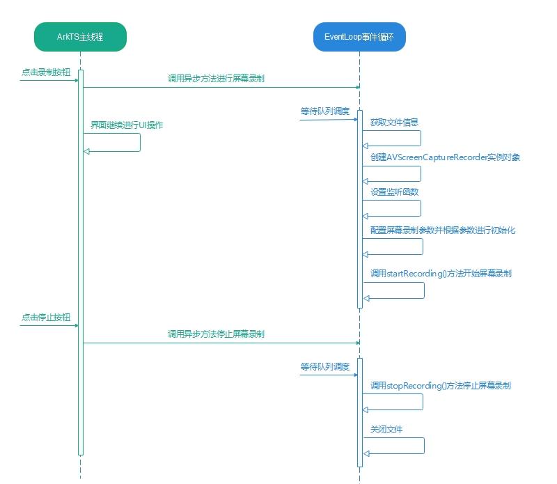
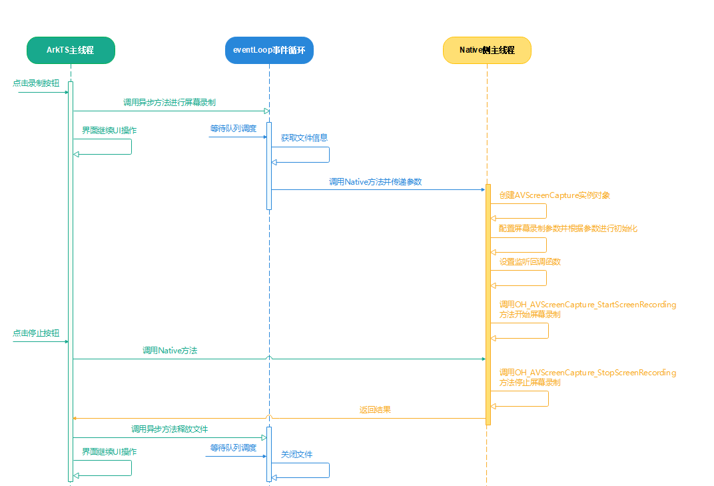
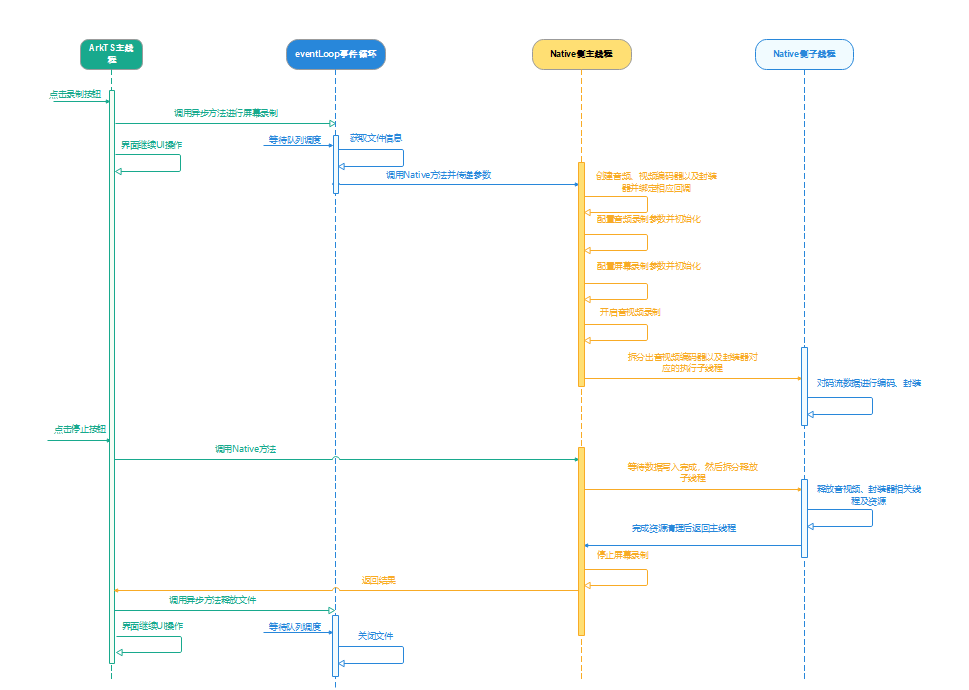

# 基于AVScreenCapture实现屏幕录制

更新时间：2026-03-12 08:45:02

来源：https://developer.huawei.com/consumer/cn/doc/best-practices/bpta-avscreencapture-for-screen-recording

## 概述


AVScreenCapture是系统提供的用于实现屏幕录制功能的模块，属于媒体子系统的核心能力之一。AVScreenCapture主要应用于需要捕获屏幕内容的场景，例如在线教育录课、游戏直播、会议录制、远程协作等。AVScreenCapture主要工作是捕获音频信号、视频信号，并通过音视频编码保存屏幕信息，提供录屏写文件和录屏转码流两套接口，能够输出原始码流和文件两种不同形式的信息。该模块允许调用者指定屏幕录制的编码格式、封装格式和文件路径等参数，同时支持全屏录制、指定窗口录制或指定物理屏录制的配置。

- 转码流形式：连续的二进制数据包（如：01001011 01100101...），无边界标记，不区分数据块。其存在形式为内存/网络传输中的瞬时状态，类似网络传输中的TCP流、摄像头实时视频流。其生命周期为实时生成、实时消费、立即销毁。
- 写文件形式：静态的存储容器，结构化存储单元（如：文件头 + 数据区 + 文件尾）， 具有明确的边界，通过文件系统标记起始和结束位置。其存在形式为存储介质中的持久实体，其生命周期包括创建、写入、关闭和长期存储。


原始码流

本文主要针对以下几种实现方案详细讲解其实现原理和开发流程。

- [使用AVScreenCaptureRecorder模块录屏写文件（ArkTS）](#section162864319340)
- [使用AVScreenCapture模块录屏写文件（C/C++）](#section6121629163710)
- [使用AVScreenCapture模块录屏转码流（C/C++）](#section15553154512379)


三种实现方案对比情况如下：


|  | 优点 | 缺点 | 适用场景 |
| --- | --- | --- | --- |
| 使用AVScreenCaptureRecorder模块录屏写文件（ArkTS） | 开发逻辑简单，代码维护成本低，无需具备Native相关知识，开发效率相对较高。内存管理相对安全，无需手动释放资源，GC自动回收。与UI界面无缝联动，可以实时更新界面元素。 | 功能缺失，仅支持文件输出模式（OH_CAPTURE_FILE），无法获取原始数据码流。受JS运行时限制，高负载场景下性能相对较差。实时性不佳，不适用于延迟敏感场景。格式受限，仅支持输出MP4格式。CPU占用率高。 | 该方案适用于重视开发交互效率和UI界面交互，同时对实时性要求不高的常规场景，例如在线教育课程录制、简单屏幕录制等文件录制场景。 |
| 使用AVScreenCapture模块录屏写文件（C/C++） | 开发逻辑简单，开发效率适中。实时性表现一般，延迟低于ArkTS方法，但高于C/C++转码流方法。支持动态音频切换。CPU占用率相对较低 | 开发逻辑较为复杂，需要掌握C++/NDK相关知识。需要手动释放资源。仍依赖系统封装器，仅支持MP4视频格式。无法获取原始数据码流，对数据进行相关操作。 | 该方案适用于对实时性、视频画质有较高要求，且需要动态音频切换的高性能场景，例如游戏高帧率录制、会议录制等文件录制场合。 |
| 使用AVScreenCapture模块录屏转码流（C/C++） | 极致性能，实时性强，延迟极低。可以自由掌控数据，支持自定义编码、多源合成及逐帧处理等。资源优化，内存占用率极低。 | 开发成本极高，需要具备音视频编码的专业知识。风险较高，需要自行管理线程和内存安全风险。容易出现编码器碎片化问题。维护和调试都较为困难。 | 该方案适用于对实时性要求极高、需要多源合成及逐帧处理的专业场景，例如游戏直播、远程桌面控制和定制格式输出等。 |


开发者可以对比三种方式的优缺点及其适用场景，自行选择最适合的实现方案。


> [!NOTE]
> 在进行屏幕录制开发前需要申请相应权限：麦克风权限（**ohos.permission.MICROPHONE**）、后台长时任务权限（**ohos.permission.KEEP_BACKGROUND_RUNNING**）。其他权限可根据需要申请，例如：若需访问公共目录，则应申请公共目录的读写权限。
>  开发者如果想要了解音视频编码相关内容，可以参考：[音频编码](https://developer.huawei.com/consumer/cn/doc/harmonyos-guides/audio-encoding)和[视频编码](https://developer.huawei.com/consumer/cn/doc/harmonyos-guides/video-encoding)。


## 使用AVScreenCaptureRecorder模块录屏写文件（ArkTS）


### 场景描述


HarmonyOS 提供了用于实现录屏功能的ArkTS接口，能够支持屏幕录制及音频数据采集。然而，ArkTS侧的实现方案仅能通过文件形式将数据流转至其他模块进行播放或处理。

本节将通过一个案例介绍如何在ArkTS侧实现录屏存文件。在该案例中，用户点击屏幕录制按钮即可启动屏幕录制，期间可以切换至后台录制桌面或其他应用页面。当用户点击停止按钮或屏幕左上角录屏胶囊中的停止按钮时，屏幕录制将停止。录屏内容将保存至应用沙箱文件中，点击结束录屏后出现的播放按钮，即可播放录制的视频文件。

案例展示图：


### 实现原理


调用流程图





当点击录制按钮时，会调用异步方法进行屏幕录制。关键过程如下：

1. 等到异步任务得到调度后，会先获取文件信息，用于保存录屏视频。
2. 接着会通过createAVScreenCaptureRecorder()方法构建出AVScreenCaptureRecorder的实例化对象。
3. 然后为该实例对象绑定状态变化监听函数和异常监听函数。
4. 接着还需要配置屏幕录制参数，然后根据参数配置对实例化对象进行初始化。
5. 初始化完成之后即可调用startRecording()方法开启屏幕录制。


当点击停止按钮时，同样系统会调用异步方法来停止录制。等到异步任务被调度后，将调用stopRecording()方法停止屏幕录制，随后关闭文件fd。


> [!NOTE]
> EventLoop事件循环是ArkTS异步编程模型的核心（单线程+任务队列），其在JS/TS的基础上结合了HarmonyOS的UI框架和任务调度特性，主要用于管理代码执行顺序、处理异步操作（如网络请求、定时器、用户交互、I/O）以及更新UI等。


### 开发步骤


1. 获取文件信息。首先，通过时间戳和应用沙箱目录拼接出文件路径，然后利用文件管理模块的openSync()接口获取文件信息。后续的录屏文件将存储在该文件中。 获取沙箱路径。
```ts
private filesDir = this.getUIContext().getHostContext()?.filesDir;
```
 拼接文件路径并获取文件信息。
```ts
public updateFileFd(filesDir: string) {
  // 获取文件fd
  this.fileName = systemDateTime.getTime(true).toString() + '.mp4';
  this.path = filesDir + '/' + this.fileName;
  try {
    this.file = fs.openSync(this.path, fs.OpenMode.READ_WRITE | fs.OpenMode.CREATE);
  } catch (error) {
    let err = error as BusinessError;
    hilog.error(0x0000, 'testTag', `openSync fail. code = ${err.code}, message = ${err.message}`);
  }
}
```
2. 创建AVScreenCaptureRecorder实例化对象并绑定监听函数。通过MediaKit提供的createAVScreenCaptureRecorder()接口构建实例对象，然后使用.on接口为其绑定可选的监听回调函数。在以下示例中，订阅了两个回调事件：stateChange（状态切换事件回调）和error（错误事件回调）。对于同一个回调事件，用户只能订阅一次，若重复订阅，则以最后一次订阅的回调接口为准。已订阅的回调事件还可以通过off接口取消订阅。
```ts
// 获取fd
this.updateFileFd(filesDir);
// 实例化对象
try {
  this.screenCapture = await media.createAVScreenCaptureRecorder();
} catch (error) {
  let err = error as BusinessError;
  hilog.error(
    0x0000,
    'testTag',
    `createAVScreenCaptureRecorder fail. code = ${err.code}, message = ${err.message}`,
  );
}
if (this.screenCapture != undefined) {
  hilog.info(
    0xff00,
    CommonConstants.LOG_TAG,
    'ScreenCapture has been created successfully.',
  );
} else {
  hilog.info(0xff00, CommonConstants.LOG_TAG, 'ScreenCapture creation failed.');
  return;
}

// 监听屏幕捕获的状态更改
this.screenCapture?.on(
  'stateChange',
  async (infoType: media.AVScreenCaptureStateCode) => {
    switch (infoType) {
      case media.AVScreenCaptureStateCode.SCREENCAPTURE_STATE_STARTED:
        hilog.info(
          0xff00,
          CommonConstants.LOG_TAG,
          '录屏成功开始后会收到的回调.',
        );
        break;
      case media.AVScreenCaptureStateCode.SCREENCAPTURE_STATE_CANCELED:
        this.screenCapture?.release();
        this.screenCapture = undefined;
        hilog.info(0xff00, CommonConstants.LOG_TAG, '不允许使用录屏功能.');
        break;
      case media.AVScreenCaptureStateCode.SCREENCAPTURE_STATE_STOPPED_BY_USER:
        this.screenCapture?.release();
        this.screenCapture = undefined;
        AppStorage.setOrCreate('isRecordOne', false);
        AppStorage.setOrCreate('fileNameOne', this.fileName);
        hilog.info(
          0xff00,
          CommonConstants.LOG_TAG,
          '通过屏幕录制胶囊结束屏幕录制，底层录制停止',
        );
        break;
      case media.AVScreenCaptureStateCode
        .SCREENCAPTURE_STATE_INTERRUPTED_BY_OTHER:
        hilog.info(0xff00, CommonConstants.LOG_TAG, '屏幕录制因其他中断而停止');
        break;
      case media.AVScreenCaptureStateCode.SCREENCAPTURE_STATE_STOPPED_BY_CALL:
        hilog.info(0xff00, CommonConstants.LOG_TAG, '屏幕录制被电话打断');
        break;
      case media.AVScreenCaptureStateCode.SCREENCAPTURE_STATE_MIC_UNAVAILABLE:
        hilog.info(0xff00, CommonConstants.LOG_TAG, '录屏麦克风不可用');
        break;
      case media.AVScreenCaptureStateCode.SCREENCAPTURE_STATE_MIC_MUTED_BY_USER:
        hilog.info(0xff00, CommonConstants.LOG_TAG, '录屏麦克风被用户静音');
        break;
      case media.AVScreenCaptureStateCode
        .SCREENCAPTURE_STATE_MIC_UNMUTED_BY_USER:
        hilog.info(0xff00, CommonConstants.LOG_TAG, '录屏麦克风被用户取消静音');
        break;
      case media.AVScreenCaptureStateCode
        .SCREENCAPTURE_STATE_ENTER_PRIVATE_SCENE:
        hilog.info(0xff00, CommonConstants.LOG_TAG, '录屏进入隐私场景');
        break;
      case media.AVScreenCaptureStateCode
        .SCREENCAPTURE_STATE_EXIT_PRIVATE_SCENE:
        hilog.info(0xff00, CommonConstants.LOG_TAG, '录屏退出隐私场景');
        break;
      case media.AVScreenCaptureStateCode
        .SCREENCAPTURE_STATE_STOPPED_BY_USER_SWITCHES:
        hilog.info(
          0xff00,
          CommonConstants.LOG_TAG,
          '用户账号切换，底层录制会停止',
        );
        break;
      default:
        break;
    }
  },
);

// 监听异常
this.screenCapture?.on('error', (err) => {
  hilog.info(0xff00, CommonConstants.LOG_TAG, 'Handle exception cases.');
});
```
3. 配置录制参数并初始化AVScreenCaptureRecorder对象。示例中通过 getDefaultDisplaySync() 方法获取屏幕宽高。开发者也可以自定义屏幕宽高，但需注意，若设置不当，可能会导致录制的视频界面出现黑边。
```ts
let displayInfo = display.getDefaultDisplaySync();
```
 以下配置了屏幕录制参数，除了fd配置外，其余配置均为可选。未配置时，将采用默认值。默认值可参考：[AVScreenCaptureRecordConfig](https://developer.huawei.com/consumer/cn/doc/harmonyos-references/arkts-apis-media-i#avscreencapturerecordconfig12)。
```ts
// 配置屏幕录制参数
let captureConfig: media.AVScreenCaptureRecordConfig = {
  // 开发者可以根据自己的需要设置宽度和高度
  frameWidth: this.displayInfo.width,
  frameHeight: this.displayInfo.height,
  // 用于写入文件的文件描述符（fd）
  fd: (this.file as fs.File).fd,
  // 可选参数及其默认值
  videoBitrate: 10000000,
  audioSampleRate: 48000,
  audioChannelCount: 2,
  audioBitrate: 96000,
  displayId: 0,
};
```
 基于上述配置信息初始化screenCapture实例对象。
```ts
await this.screenCapture?.init(captureConfig);
```
4. 通过startRecording()接口开启录制。startRecording()接口以异步方式启动录屏，启动后录屏不会影响页面操作。
```ts
await this.screenCapture?.startRecording();
```
5. 通过stopRecording()停止录制并关闭文件。同样的，stopRecording()接口也是异步接口，示例中首先通过stopRecording()接口停止录制，然后调用release()方法销毁实例，释放资源。
```ts
// 停止录屏
public async stopRecording() {
  if (this.screenCapture == undefined) {
    hilog.info(0xFF00, CommonConstants.LOG_TAG, 'ScreenCapture exception.');
    return;
  }

  try {
    await this.screenCapture?.stopRecording();

    // 调用release()方法来销毁实例并释放资源
    await this.screenCapture?.release();

    // 关闭文件
    fs.close((this.file as fs.File).fd);
  } catch (error) {
    let err = error as BusinessError;
    hilog.error(0x0000, 'testTag', `stop fail. code = ${err.code}, message = ${err.message}`);
  }
}
```


> [!NOTE]
> 除了通过主动点击按钮调用stopRecording()来停止录屏外，还可以通过点击录屏胶囊中的结束按钮来停止录制。该方案主要依赖于回调函数实现，当用户点击胶囊中的停止按钮时，录屏对象实例screenCapture会触发SCREENCAPTURE_STATE_STOPPED_BY_USER的回调，通知应用录屏已停止，无需开发者主动调用stopRecording()方法。在C/C++方法中，对应的回调是OH_SCREEN_CAPTURE_STATE_STOPPED_BY_USER。


## 使用AVScreenCapture模块录屏写文件（C/C++）


### 场景描述


除了ArkTS侧接口，系统还提供实现录屏功能相应的C语言版本的API接口。该API接口支持文件和码流两种格式，本小节主要介绍其进行屏幕录制时，直接存文件的实现方案，该方案需要配置录屏的数据类型为OH_CAPTURE_FILE。

案例实现的页面效果与上一章节一致，主要区别在于代码层面。同样的，在该案例中用户点击屏幕录制按钮会开启屏幕录制，当用户点击停止按钮或者点击屏幕左上角录屏胶囊中的停止按钮会停止屏幕录制并将录屏信息保存到应用沙箱文件中。点击播放按钮会播放录制的视频文件。

案例展示图：


### 实现原理


调用流程图





当点击录制按钮时，会调用异步方法进行屏幕录制。关键过程如下：

1. 当异步任务被调度，会先获取一个文件信息，用于保存录屏视频。
2. 然后调用Native侧的方法，并传递文件fd、设备宽高等参数至Native侧。
3. 在Native侧，首先创建一个AVScreenCapture实例对象，并使用从ArkTS传递过来的参数（文件fd、设备宽高等）配置屏幕录制参数并进行初始化。
4. 初始化完成后，还需为该实例对象绑定可选的回调函数，如状态变更和数据处理等。
5. 最后，在完成所有配置后，调用OH_AVScreenCapture_StartScreenRecording()方法开始屏幕录制。


当点击停止按钮时，会调用相应的Native方法，Native侧通过调用OH_AVScreenCapture_StopScreenRecording()方法来停止屏幕录制；随后，控制权返回到ArkTS侧，在此调用异步方法以关闭文件fd。


### 开发步骤


1. 获取文件信息并调用Native侧方法传递参数。与上述方案类似，通过时间戳和应用沙箱目录拼接生成文件路径，然后利用文件管理模块提供的openSync()接口获取文件信息。该文件的fd将传递到Native侧，用于配置录屏数据的最终存储位置。在以下示例中，可以看到通过调用Native方法startScreenCaptureToFile()，将文件fd和屏幕的宽度及高度三个参数传递到Native侧。
```ts
// 获取保存文件信息并调用Native方法
async createVideoFd(): Promise<void> {
  // 拼接文件路径
  this.tmpFileNameTwo = systemDateTime.getTime(true) + '.mp4';
  // ...
  this.filepath = this.getUIContext().getHostContext()?.filesDir + '/' + this.tmpFileNameTwo;
  hilog.info(0xFF00, CommonConstants.LOG_TAG, 'filepath uri: %{public}s', this.filepath);

  try {
    // 获取文件信息
    this.file = fs.openSync(this.filepath, fs.OpenMode.READ_WRITE | fs.OpenMode.CREATE);
    // ...

    // 调用native方法开启录制并传递fd、宽高
    avScreenCapture.startScreenCaptureToFile(this.file.fd, this.displayInfo.width, this.displayInfo.height);

    // ...
  } catch (error) {
    let err = error as BusinessError;
    hilog.error(0x0000, 'testTag', `startScreenCaptureToFile fail. code = ${err.code}, message = ${err.message}`);
  }
}
```
 这里获取屏幕宽高的实现代码与上述内容一致，都是通过ArkTS接口获取的。开发者也可以选择在Native侧获取，参考：[oh_display_manager.h](https://developer.huawei.com/consumer/cn/doc/harmonyos-references/capi-oh-display-manager-h)。
```ts
let displayInfo = display.getDefaultDisplaySync();
```
2. 创建AVScreenCapture实例化对象并初始化。首先，获取了ArkTS侧的参数信息，这些参数在配置录屏参数时将被使用。接着，调用OH_AVScreenCapture_Create()创建实例对象，随后配置录制参数并初始化AVScreenCapture对象。 创建实例化对象。
```cpp
napi_value CAVScreenCaptureToFile::StartScreenCaptureToFile(napi_env env, napi_callback_info info) {
  size_t argc = 3;
  napi_value args[3] = {nullptr};
  napi_get_cb_info(env, info, &argc, args, nullptr, nullptr);

  int32_t outputFd, videoWidth, videoHeight;
  // 获取参数：文件fd和宽高
  napi_get_value_int32(env, args[0], &outputFd);
  napi_get_value_int32(env, args[1], &videoWidth);
  napi_get_value_int32(env, args[2], &videoHeight);
  OH_LOG_INFO(LOG_APP, "文件FD为 %{public}d", outputFd);
  if (outputFd <= 0) {
    OH_LOG_ERROR(LOG_APP, "FD ERROR: %{public}d", outputFd);
    napi_value res;
    napi_create_int32(env, -1, &res);
    return res;
  }

  if (g_avCapture_ != nullptr) {
    StopScreenCaptureRecording(g_avCapture_);
    OH_AVScreenCapture_Release(g_avCapture_);
  }
  // 创建实例化对象
  g_avCapture_ = OH_AVScreenCapture_Create();
  if (g_avCapture_ == nullptr) {
    OH_LOG_ERROR(LOG_APP, "CAVScreenCaptureToFile create screen capture failed");
  }

  // ...
}
```
 录屏模式，录屏流数据类型以及录屏文件参数配置。 上面获取的文件fd信息也是在此处配置的。直接将录屏保存到文件时，需要将dataType值设置为OH_CAPTURE_FILE。当数据格式为OH_CAPTURE_FILE时，必须配置录制文件参数（recorderInfo），其中包含文件保存的路径信息。在将录屏保存为文件时，默认录制内部音频，但也可以同时录制内外音频，且麦克风可以动态开启或关闭。可以使用OH_AVScreenCapture_SetMicrophoneEnabled()函数动态控制麦克风的开关。
```cpp
OH_AVScreenCaptureConfig config_;
OH_RecorderInfo recorderInfo;

// 转文件fd为url
std::string fileUrl = "fd://" + std::to_string(outputFd);
recorderInfo.url = const_cast<char *>(fileUrl.c_str());
// 文件格式MP4
recorderInfo.fileFormat = OH_ContainerFormatType::CFT_MPEG_4;
OH_LOG_INFO(LOG_APP, "CAVScreenCaptureToFile ScreenCapture fileUrl %{public}s", fileUrl.c_str());

// 调用音视频录制参数配置函数
SetConfigAsFile(config_, videoWidth, videoHeight);
config_.captureMode = OH_CAPTURE_HOME_SCREEN;
config_.dataType = OH_CAPTURE_FILE;
config_.recorderInfo = recorderInfo;

// 设置麦克风开关
bool isMicrophone = true;
OH_AVScreenCapture_SetMicrophoneEnabled(g_avCapture_, isMicrophone);

OH_AVScreenCapture_SetCanvasRotation(g_avCapture_, true);
```
 音视频录制参数配置。 上面获取到的屏幕宽高数据是在这里配置的。请注意，内录参数为必填项。如果同时设置了内录和外录参数，内录和麦克风（即外录）的参数设置需要保持一致。
```cpp
void CAVScreenCaptureToFile::SetConfigAsFile(OH_AVScreenCaptureConfig &config, int32_t videoWidth,
int32_t videoHeight) {
  // 音频配置
  OH_AudioCaptureInfo micCapInfo = {.audioSampleRate = 48000, .audioChannels = 2, .audioSource = OH_SOURCE_DEFAULT};
  OH_AudioCaptureInfo innerCapInfo = {.audioSampleRate = 48000, .audioChannels = 2, .audioSource = OH_ALL_PLAYBACK};
  OH_AudioEncInfo audioEncInfo = {.audioBitrate = 96000, .audioCodecformat = OH_AudioCodecFormat::OH_AAC_LC};
  OH_AudioInfo audioInfo = {.micCapInfo = micCapInfo, .innerCapInfo = innerCapInfo, .audioEncInfo = audioEncInfo};

  // 视频配置
  OH_VideoCaptureInfo videoCapInfo = {
    .videoFrameWidth = videoWidth, .videoFrameHeight = videoHeight, .videoSource = OH_VIDEO_SOURCE_SURFACE_RGBA};
  OH_VideoEncInfo videoEncInfo = {
    .videoCodec = OH_VideoCodecFormat::OH_H264, .videoBitrate = 10000000, .videoFrameRate = 30};
  OH_VideoInfo videoInfo = {.videoCapInfo = videoCapInfo, .videoEncInfo = videoEncInfo};

  config = {
    .captureMode = OH_CAPTURE_HOME_SCREEN,
    .dataType = OH_ORIGINAL_STREAM,
    .audioInfo = audioInfo,
    .videoInfo = videoInfo,
    .recorderInfo = {},
  };
}
```
 根据配置初始化AVScreenCapture实例对象。
```cpp
OH_AVSCREEN_CAPTURE_ErrCode result = OH_AVScreenCapture_Init(g_avCapture_, config_);
```
3. 绑定回调函数这里设置了 stateChange（状态切换事件回调）和 error（错误事件回调）。
```cpp
// 设置回调
OH_AVScreenCapture_SetErrorCallback(g_avCapture_, OnErrorSaveFile, nullptr);
OH_AVScreenCapture_SetStateCallback(g_avCapture_, OnStateChangeSaveFile, nullptr);
```
 回调具体实现如下： 状态变化回调。
```text
void CAVScreenCaptureToFile::OnStateChangeSaveFile(struct OH_AVScreenCapture *capture,
OH_AVScreenCaptureStateCode stateCode, void *userData) {
(void)capture;
switch (stateCode) {
case OH_SCREEN_CAPTURE_STATE_STARTED: {
OH_LOG_INFO(LOG_APP, "录屏开始状态变更");
break;
}

case OH_SCREEN_CAPTURE_STATE_CANCELED: {
OH_LOG_INFO(LOG_APP, "录屏取消状态变更 ");
StopScreenCaptureRecording(capture);
break;
}
case OH_SCREEN_CAPTURE_STATE_STOPPED_BY_CALL: {
OH_LOG_INFO(LOG_APP,
"录屏被电话打断状态处理");
break;
}
case OH_SCREEN_CAPTURE_STATE_MIC_UNAVAILABLE: {
OH_LOG_INFO(LOG_APP,
"录屏中途麦克风无法获取状态");
break;
}
case OH_SCREEN_CAPTURE_STATE_INTERRUPTED_BY_OTHER: {
OH_LOG_INFO(LOG_APP,
"录屏状态被打断");
break;
}
case OH_SCREEN_CAPTURE_STATE_MIC_MUTED_BY_USER: {
OH_LOG_INFO(LOG_APP,
"录屏中途用户将麦克风禁音");
break;
}

case OH_SCREEN_CAPTURE_STATE_MIC_UNMUTED_BY_USER: {
OH_LOG_INFO(LOG_APP,
"录屏中途用户将麦克风解除禁音");
break;
}

case OH_SCREEN_CAPTURE_STATE_ENTER_PRIVATE_SCENE: {
OH_LOG_INFO(LOG_APP,
"录屏进入隐私状态");
std::thread releaseSCInstanceThread(ReleaseSCWorker, capture);
releaseSCInstanceThread.detach();
break;
}

case OH_SCREEN_CAPTURE_STATE_EXIT_PRIVATE_SCENE: {
OH_LOG_INFO(LOG_APP,
"录屏退出隐私模式状态");
break;
}

case OH_SCREEN_CAPTURE_STATE_STOPPED_BY_USER: {
napi_acquire_threadsafe_function(tsFn);
napi_call_threadsafe_function(tsFn, nullptr, napi_tsfn_nonblocking);
napi_release_threadsafe_function(tsFn, napi_tsfn_release);
tsFn = nullptr;
OH_LOG_INFO(LOG_APP,
"录屏被用户切换打断");
std::thread releaseSCInstanceThread(ReleaseSCWorker, capture);
releaseSCInstanceThread.detach();
break;
}

default:
break;
}

(void)userData;
}
```
 错误监听回调。
```cpp
void CAVScreenCaptureToFile::OnErrorSaveFile(OH_AVScreenCapture *capture, int32_t errorCode, void *userData) {
  (void)capture;
  OH_LOG_INFO(LOG_APP, "录屏发生错误，错误码为 %{public}d", errorCode);
  (void)userData;
}
```
4. 通过OH_AVScreenCapture_StartScreenRecording()开启录制。
```cpp
result = OH_AVScreenCapture_StartScreenRecording(g_avCapture_);
```
5. 通过调用OH_AVScreenCapture_StopScreenRecording()停止录制，然后释放ScreenCapture实例。
```cpp
napi_value CAVScreenCaptureToFile::StopScreenCaptureToFile(napi_env env, napi_callback_info info) {
  // ...

  OH_LOG_INFO(LOG_APP, "停止屏幕录制");
  result = OH_AVScreenCapture_StopScreenRecording(g_avCapture_);
  if (result != AV_SCREEN_CAPTURE_ERR_BASE) {
    OH_LOG_ERROR(
    LOG_APP,
    "停止屏幕录制错误，结果为：%{public}d",
    result);
  } else {
    OH_LOG_INFO(LOG_APP, "停止屏幕录制成功");
  }
  result = OH_AVScreenCapture_Release(g_avCapture_);
  if (result != AV_SCREEN_CAPTURE_ERR_BASE) {
    OH_LOG_ERROR(LOG_APP, "释放实例化对象异常，错误为: %{public}d",
    result);
  } else {
    OH_LOG_INFO(LOG_APP, "释放实例化对象成功");
  }
  // ...
}
```
 然后在ArkTS侧关闭文件。
```cpp
async releaseFD() {
  if (this.file?.fd != undefined && this.file.fd?.valueOf() > 0) {
    // 关闭文件
    try {
      fs.close(this.file.fd);
    } catch (error) {
      let err = error as BusinessError;
      hilog.error(0x0000, 'testTag', `close fail. code = ${err.code}, message = ${err.message}`);
    }
  }
}
```


## 使用AVScreenCapture模块录屏转码流（C/C++）


### 场景描述


本小节主要介绍通过C语言版本的API实现屏幕录制的另一种方法，即将录屏数据提取为码流，然后通过该码流合成视频文件。此方案需要将录屏的数据类型配置为OH_ORIGINAL_STREAM，实现过程较为复杂，涉及绑定音频和视频编码器以及封装器对数据进行处理。


> [!NOTE]
> 本案例中，屏幕录制使用的是AVScreenCapture框架能力，音频流使用的是AudioCapturer创建的音频采集器录制，如需对音频流进行操作，需要修改AudioCapturer对应的相关配置。


案例实现的页面效果与前两个章节一致，通过点击对应按钮开启/关闭录屏，录屏结束后可以播放录屏视频。

案例展示图：


### 实现原理


调用流程图





当点击录制按钮时，系统会调用异步方法来执行屏幕录制。关键过程如下：

1. 当异步任务被调度后，系统会先获取文件信息，用于保存录屏视频。
2. 然后调用Native侧方法，并传递文件fd、设备宽度等参数至Native侧。
3. Native侧首先会创建音频编码器、视频编码器以及封装器对应的实例对象并绑定相应的数据处理回调函数。
4. 然后配置音频录制参数并初始化音频录制实例对象（OH_AudioCapturer类型），同时配置屏幕录制参数并初始化屏幕录制实例对象（OH_AVScreenCapture类型）。
5. 最后，启动音视频录制，并创建音视频编码器及封装器的子线程，这些子线程主要用于处理采集的音视频码流数据并进行封装。


当点击停止按钮时，会调用相应的Native方法。Native侧首先等待数据写入完成，随后启动子线程来释放音视频编码器及封装器的相关资源。此时，Native主线程将等待这些资源释放完毕，然后调用OH_AVScreenCapture_StopScreenRecording()方法停止屏幕录制。之后，控制权返回到ArkTS侧，在ArkTS侧调用异步方法关闭文件fd。


### 开发步骤


1. 获取文件信息并调用Native侧方法传递参数。这一步与C/C++侧录屏存文件的方法一致。通过时间戳和应用沙箱目录拼接出文件路径，然后获取文件信息。接着调用Native方法startScreenCaptureToStream()并传递参数。
```ts
// 获取保存文件信息并调用Native方法
async createVideoFd(): Promise<void> {
  // 拼接文件路径
  this.tmpFileNameThree = systemDateTime.getTime(true) + '.mp4';
  // ...
  this.filepath = this.getUIContext().getHostContext()?.filesDir + '/' + this.tmpFileNameThree;
  hilog.info(0xFF00, CommonConstants.LOG_TAG, 'filepath uri: %{public}s', this.filepath);
  try {
    // 获取文件信息
    this.file = fs.openSync(this.filepath, fs.OpenMode.READ_WRITE | fs.OpenMode.CREATE);

    // ...

    // 调用native方法开启录制并传递fd、宽高
    avScreenCapture.startScreenCaptureToStream(this.file.fd, this.displayInfo.width, this.displayInfo.height)

    // ...
  } catch (error) {
    let err = error as BusinessError;
    hilog.error(0x0000, 'testTag', `startScreenCaptureToStream fail. code = ${err.code}, message = ${err.message}`);
  }
}
```
 通过ArkTS侧接口获取屏幕宽高，Native侧获取方法参考：[oh_display_manager.h](https://developer.huawei.com/consumer/cn/doc/harmonyos-references/capi-oh-display-manager-h)。
```ts
let displayInfo = display.getDefaultDisplaySync();
```
2. 初始化音频编码器、视频编码器以及封装器。首先，也需要获取ArkTS侧的参数，这部分内容在前面已经介绍过，这里不再赘述。具体可参考使用AVScreenCapture模块进行录屏存文件的章节。 音视频编码器的相关配置中，sampleInfo用于存储参数配置信息，这些信息将在后续配置音频编码器、视频编码器及封装器配置项时使用。
```cpp
void CAVScreenCaptureToStream::InitConfig(int32_t outputFd, int32_t videoWidth, int32_t videoHeight) {
  sampleInfo_.outputFd = outputFd;

  // 视频编码器配置
  sampleInfo_.videoWidth = videoWidth;
  sampleInfo_.videoHeight = videoHeight;
  sampleInfo_.frameRate = 30;
  sampleInfo_.bitrate = 10000000;
  sampleInfo_.videoCodecMime = "video/avc";

  // 音频编码器配置
  sampleInfo_.audioCodecMime = OH_AVCODEC_MIMETYPE_AUDIO_AAC;
  sampleInfo_.audioSampleFormat = OH_BitsPerSample::SAMPLE_S16LE;
  sampleInfo_.audioSampleRate = 48000;
  sampleInfo_.audioChannelCount = 2;
  sampleInfo_.audioBitRate = 96000;
  sampleInfo_.audioChannelLayout = OH_AudioChannelLayout::CH_LAYOUT_STEREO;
  sampleInfo_.audioMaxInputSize = sampleInfo_.audioSampleRate * 0.02 * sampleInfo_.audioChannelCount * sizeof(short);

  std::lock_guard<std::mutex> lock(mutex_);

  // 声明音视频编码器、音频采集器及封装器类对象
  audioEncoder_ = std::make_unique<AudioEncoder>();
  audioCapturer_ = std::make_unique<AudioCapturer>();
  videoEncoder_ = std::make_unique<VideoEncoder>();
  muxer_ = std::make_unique<Muxer>();

  // 根据文件fd创建封装器并初始化
  muxer_->Create(sampleInfo_.outputFd);
  muxer_->Config(sampleInfo_);

  // 创建音视频编码器
  CreateEncoder();

  // 初始化音频采集器对象
  audioCapturer_->AudioCapturerInit(sampleInfo_, audioEncContext_);

  // ...
}
```
 创建封装器对象。 需要提供文件fd及封装器的输出格式，此处配置为MP4格式。
```cpp
int32_t Muxer::Create(int32_t fd) {
  muxer_ = OH_AVMuxer_Create(fd, AV_OUTPUT_FORMAT_MPEG_4);
  return 0;
}
```
 配置封装器配置项。 通过调用OH_AVFormat_CreateVideoFormat()创建视频格式来添加视频轨道。 配置完成后，即可调用OH_AVMuxer_Start()开始封装音视频数据。
```cpp
int32_t Muxer::Config(SampleInfo &sampleInfo) {
  // 创建并添加音频轨
  OH_AVFormat *formatAudio = OH_AVFormat_CreateAudioFormat(sampleInfo.audioCodecMime.data(),
  sampleInfo.audioSampleRate, sampleInfo.audioChannelCount);
  // 设置相关参数
  OH_AVFormat_SetIntValue(formatAudio, OH_MD_KEY_PROFILE, AAC_PROFILE_LC);

  int32_t ret = OH_AVMuxer_AddTrack(muxer_, &audioTrackId_, formatAudio);
  OH_AVFormat_Destroy(formatAudio);

  // 创建并添加视频轨
  OH_AVFormat *formatVideo =
  OH_AVFormat_CreateVideoFormat(sampleInfo.videoCodecMime.data(), sampleInfo.videoWidth, sampleInfo.videoHeight);

  // 设置相关参数
  OH_AVFormat_SetDoubleValue(formatVideo, OH_MD_KEY_FRAME_RATE, sampleInfo.frameRate);
  OH_AVFormat_SetIntValue(formatVideo, OH_MD_KEY_WIDTH, sampleInfo.videoWidth);
  OH_AVFormat_SetIntValue(formatVideo, OH_MD_KEY_HEIGHT, sampleInfo.videoHeight);
  OH_AVFormat_SetStringValue(formatVideo, OH_MD_KEY_CODEC_MIME, sampleInfo.videoCodecMime.data());

  ret = OH_AVMuxer_AddTrack(muxer_, &videoTrackId_, formatVideo);
  if (ret != AV_ERR_OK) {
    OH_LOG_ERROR(LOG_APP, "AddTrack failed");
  }
  OH_AVFormat_Destroy(formatVideo);
  formatVideo = nullptr;
  return ret;
}
```
 创建音频编码器。 从mime类型创建音频编码器实例。
```cpp
// 创建音频编码器
int32_t AudioEncoder::Create(const std::string &codecMime) {
  encoder_ = OH_AudioCodec_CreateByMime(codecMime.c_str(), true);
  return 0;
}
```
 配置音频编码器。 首先，将配置信息写入format，然后通过OH_AudioCodec_Configure()接口配置编码器。接下来，使用OH_AudioCodec_RegisterCallback()方法注册回调函数。这些回调函数包括：监控编解码器操作错误、监控编解码器流变化、监控编解码器需要输入数据、监控编解码器已生成输出数据。请注意，音频编码器目前不支持监控编解码器流变化的回调。
```cpp
int32_t AudioEncoder::Config(SampleInfo &sampleInfo, CodecUserData *codecUserData) {
  OH_AVFormat *format = OH_AVFormat_Create();
  if (format == nullptr) {
    OH_LOG_ERROR(LOG_APP, "AVFormat create failed");
  }

  // 配置相关参数
  OH_AVFormat_SetIntValue(format, OH_MD_KEY_AUDIO_SAMPLE_FORMAT, sampleInfo.audioSampleFormat);
  OH_AVFormat_SetIntValue(format, OH_MD_KEY_AUD_CHANNEL_COUNT, sampleInfo.audioChannelCount);
  OH_AVFormat_SetIntValue(format, OH_MD_KEY_AUD_SAMPLE_RATE, sampleInfo.audioSampleRate);
  OH_AVFormat_SetLongValue(format, OH_MD_KEY_BITRATE, sampleInfo.audioBitRate);
  OH_AVFormat_SetLongValue(format, OH_MD_KEY_CHANNEL_LAYOUT, sampleInfo.audioChannelLayout);
  OH_AVFormat_SetIntValue(format, OH_MD_KEY_MAX_INPUT_SIZE, sampleInfo.audioMaxInputSize);
  int ret = OH_AudioCodec_Configure(encoder_, format);
  if (ret != AV_ERR_OK) {
    OH_LOG_ERROR(LOG_APP, "Config failed, ret: %{public}d", ret);
  }
  OH_AVFormat_Destroy(format);
  format = nullptr;

  // 设置音频编码器处理回调
  OH_AudioCodec_RegisterCallback(encoder_,
  {AudioEncoder::OnCodecError, AudioEncoder::OnCodecFormatChange,
    AudioEncoder::OnNeedInputBuffer, AudioEncoder::OnNewOutputBuffer},
  codecUserData);
  // 准备编码器内部资源，必须在调用此接口之前调用配置接口
  ret = OH_AudioCodec_Prepare(encoder_);
  if (ret != AV_ERR_OK) {
    OH_LOG_ERROR(LOG_APP, "Prepare failed, ret: %{public}d", ret);
  }
  return 0;
}
```
 创建视频编码器。 同样从mime类型创建视频编码器实例。
```cpp
void VideoEncoder::Create(const std::string &videoCodecMime) {
  encoder_ = OH_VideoEncoder_CreateByMime(videoCodecMime.c_str());
}
```
 配置视频编码器。 与音频编码器配置方法相同，将配置信息写入format，然后通过OH_VideoEncoder_Configure()接口进行编码器配置。接下来，使用OH_VideoEncoder_RegisterCallback()方法注册回调函数。这些回调函数用于监控编解码器操作错误、编解码器流变化、编解码器需要输入数据以及编解码器已生成输出数据。
```cpp
int32_t VideoEncoder::Config(SampleInfo &sampleInfo, CodecUserData *codecUserData) {
  OH_AVFormat *format = OH_AVFormat_Create();

  // 配置相关参数
  OH_AVFormat_SetIntValue(format, OH_MD_KEY_WIDTH, sampleInfo.videoWidth);
  OH_AVFormat_SetIntValue(format, OH_MD_KEY_HEIGHT, sampleInfo.videoHeight);
  OH_AVFormat_SetDoubleValue(format, OH_MD_KEY_FRAME_RATE, sampleInfo.frameRate);
  OH_AVFormat_SetIntValue(format, OH_MD_KEY_PIXEL_FORMAT, sampleInfo.pixelFormat);
  OH_AVFormat_SetIntValue(format, OH_MD_KEY_VIDEO_ENCODE_BITRATE_MODE, sampleInfo.bitrateMode);
  OH_AVFormat_SetLongValue(format, OH_MD_KEY_BITRATE, sampleInfo.bitrate);
  OH_AVFormat_SetIntValue(format, OH_MD_KEY_PROFILE, sampleInfo.hevcProfile);

  int ret = OH_VideoEncoder_Configure(encoder_, format);
  if (ret != AV_ERR_OK) {
    OH_LOG_ERROR(LOG_APP, "Config failed, ret: %{public}d", ret);
  }
  OH_AVFormat_Destroy(format);
  format = nullptr;

  // 根据视频编码器获取Surface
  OH_VideoEncoder_GetSurface(encoder_, &sampleInfo.window);

  // 设置视频编码器处理回调
  OH_VideoEncoder_RegisterCallback(encoder_,
  {VideoEncoder::OnCodecError, VideoEncoder::OnCodecFormatChange,
    VideoEncoder::OnNeedInputBuffer, VideoEncoder::OnNewOutputBuffer},
  codecUserData);
  // 准备编码器内部资源，必须在调用此接口之前调用配置接口
  OH_VideoEncoder_Prepare(encoder_);

  return 0;
}
```
3. 初始化音频采集（音频录制）器。首先，创建一个音频流构造器，然后设置其相关属性值，并设置输入音频流的回调。OnReadData回调用于读取音频数据。接着，通过OH_AudioStreamBuilder_GenerateCapturer()方法，根据音频流构造器创建音频流实例。
```cpp
// 初始化音频采集器
void AudioCapturer::AudioCapturerInit(SampleInfo &sampleInfo, CodecUserData *audioEncContext)
{
  AudioCapturerRelease();

  // 创建builder
  OH_AudioStream_Type type = AUDIOSTREAM_TYPE_CAPTURER;
  OH_AudioStreamBuilder_Create(&builder_, type);
  // 设置参数和回调
  OH_AudioStreamBuilder_SetSamplingRate(builder_, sampleInfo.audioSampleRate);
  OH_AudioStreamBuilder_SetChannelCount(builder_, sampleInfo.audioChannelCount);
  OH_AudioStreamBuilder_SetSampleFormat(builder_, AUDIOSTREAM_SAMPLE_S16LE);
  OH_AudioStreamBuilder_SetLatencyMode(builder_, AUDIOSTREAM_LATENCY_MODE_NORMAL);
  OH_AudioStreamBuilder_SetEncodingType(builder_, AUDIOSTREAM_ENCODING_TYPE_RAW);
  OH_AudioCapturer_Callbacks callbacks;
  callbacks.OH_AudioCapturer_OnReadData = AudioCapturerOnReadData;
  OH_AudioStreamBuilder_SetCapturerCallback(builder_, callbacks, audioEncContext);
  // 创建 OH_AudioCapturer对象
  OH_AudioStreamBuilder_GenerateCapturer(builder_, &audioCapturer_);
}
```
4. 初始化视频采集（视频录制）器。类似于上述C/C+文件存储方法，首先创建实例化对象，接着配置相关回调函数及参数。随后，调用OH_AVScreenCapture_Init()方法初始化视频采集器。
```cpp
void CAVScreenCaptureToStream::StartScreenCapture(int32_t outputFd, int32_t videoWidth, int32_t videoHeight) {
  // ...

  if (g_avCapture != nullptr) {
    StopScreenCaptureRecording(g_avCapture);
  }

  // 创建实例化对象
  g_avCapture = OH_AVScreenCapture_Create();
  if (g_avCapture == nullptr) {
    OH_LOG_ERROR(LOG_APP, "create screen capture failed");
  }
  OH_LOG_INFO(LOG_APP, "ScreenCapture after create sc");

  // 设置回调
  OH_AVScreenCapture_SetErrorCallback(g_avCapture, OnErrorToStream, nullptr);
  OH_AVScreenCapture_SetStateCallback(g_avCapture, OnSurfaceStateChangeToStream, nullptr);

  OH_AVScreenCapture_SetCanvasRotation(g_avCapture, true);

  // 初始化配置
  OH_AVScreenCaptureConfig config_;
  SetConfigToStream(config_, videoWidth, videoHeight);
  int result = OH_AVScreenCapture_Init(g_avCapture, config_);
  if (result != AV_SCREEN_CAPTURE_ERR_OK) {
    OH_LOG_INFO(LOG_APP, "ScreenCapture OH_AVScreenCapture_Init failed %{public}d", result);
  }
  OH_LOG_INFO(LOG_APP, "ScreenCapture OH_AVScreenCapture_Init %{public}d", result);

  // ...
}
```
5. 通过OH_AVScreenCapture_StartScreenCaptureWithSurface()接口开启屏幕录制。这里使用Surface模式启动录屏。通过OH_AVScreenCapture_StartScreenCaptureWithSurface()方法指定Surface并启动录屏。同时启动封装器。
```cpp
result = OH_AVScreenCapture_StartScreenCaptureWithSurface(g_avCapture, sampleInfo_.window);
OH_LOG_INFO(LOG_APP, "OH_VideoEncoder_Start Started 2 %{public}d", result);
if (result != AV_SCREEN_CAPTURE_ERR_OK) {
  OH_LOG_INFO(LOG_APP, "ScreenCapture Started failed %{public}d", result);
  OH_AVScreenCapture_Release(g_avCapture);
}
```
6. 拆分音视频编码器以及封装器子线程。启动音视频编码器和封装器，并将音视频编码器及封装器的数据处理子线程分离以进行数据处理。详细处理逻辑请参见示例代码。
```cpp
// 开启封装器
int32_t ret = muxer_->Start();
// 开启视频编码器
ret = videoEncoder_->Start();

// ...

// 启动视频输出线程
encOutputThread_ = std::make_unique<std::thread>(&CAVScreenCaptureToStream::EncOutputThread, this);
if (encOutputThread_ == nullptr) {
  StartRelease();
  return;
}

if (audioEncContext_) {
  // 开启音频采集器
  audioCapturer_->AudioCapturerStart();

  // 开启音频编码器
  audioEncoder_->Start();

  // ...

  // 启动音频输入输出线程
  audioEncInputThread_ = std::make_unique<std::thread>(&CAVScreenCaptureToStream::AudioEncInputThread, this);
  audioEncOutputThread_ = std::make_unique<std::thread>(&CAVScreenCaptureToStream::AudioEncOutputThread, this);
  if (audioEncInputThread_ == nullptr || audioEncOutputThread_ == nullptr) {
    StartRelease();
    return;
  }

  // 清空播放缓存队列
  if (audioEncContext_ != nullptr) {
    audioEncContext_->ClearCache();
  }
}
```
7. 停止屏幕录制并释放相应资源。首先，等待数据写入完成，然后启动子线程以释放音视频编码器及封装器的相关资源。在资源完全释放后，调用OH_AVScreenCapture_StopScreenRecording()方法停止屏幕录制，最后释放ScreenCapture实例。
```cpp
// 停止屏幕录制
void CAVScreenCaptureToStream::StopScreenCapture() {
  int32_t ret = videoEncoder_->NotifyEndOfStream();

  // 等待数据写入
  std::unique_lock<std::mutex> lock(mutex_);
  doneCond_.wait(lock);
  // 等待资源释放
  if (releaseThread_ && releaseThread_->joinable()) {
    releaseThread_->join();
    releaseThread_.reset();
  }

  // ...

  // 停止录屏
  ret = OH_AVScreenCapture_StopScreenCapture(g_avCapture);
  if (ret != AV_SCREEN_CAPTURE_ERR_BASE) {
    OH_LOG_ERROR(LOG_APP, "StopScreenCapture OH_AVScreenCapture_StopScreenCapture Result: %{public}d", ret);
  } else {
    OH_LOG_INFO(LOG_APP, "StopScreenCapture OH_AVScreenCapture_StopScreenCapture");
  }
  // 释放实例对象
  ret = OH_AVScreenCapture_Release(g_avCapture);
  if (ret != AV_SCREEN_CAPTURE_ERR_BASE) {
    OH_LOG_ERROR(LOG_APP, "StopScreenCapture OH_AVScreenCapture_Release: %{public}d", ret);
  } else {
    OH_LOG_INFO(LOG_APP, "OH_AVScreenCapture_Release success");
  }

  // ...
}
```
 音视频编码器及封装器资源释放。
```cpp
// 释放线程
void CAVScreenCaptureToStream::Release() {
  std::lock_guard<std::mutex> lock(mutex_);
  isStarted_ = false;
  // 视频输出线程
  if (encOutputThread_ && encOutputThread_->joinable()) {
    encOutputThread_->join();
    encOutputThread_.reset();
  }
  // 音频输入线程
  if (audioEncInputThread_ && audioEncInputThread_->joinable()) {
    audioEncContext_->inputCond.notify_all();
    audioEncInputThread_->join();
    audioEncInputThread_.reset();
  }
  // 音频输出线程
  if (audioEncOutputThread_ && audioEncOutputThread_->joinable()) {
    audioEncContext_->outputCond.notify_all();
    audioEncOutputThread_->join();
    audioEncOutputThread_.reset();
  }

  // 释放封装器
  if (muxer_ != nullptr) {
    muxer_->Release();
    muxer_.reset();
    OH_LOG_INFO(LOG_APP, "Muxer release successful");
  }
  // 释放编码器
  if (videoEncoder_ != nullptr) {
    videoEncoder_->Stop();
    if (sampleInfo_.window != nullptr) {
      OH_NativeWindow_DestroyNativeWindow(sampleInfo_.window);
      sampleInfo_.window = nullptr;
    }
    videoEncoder_->Release();
    videoEncoder_.reset();
    OH_LOG_INFO(LOG_APP, "Video encoder release successful");
  }
  if (audioEncoder_ != nullptr) {
    audioEncoder_->Stop();
    audioEncoder_->Release();
    audioEncoder_.reset();
    OH_LOG_INFO(LOG_APP, "Audio encoder release successful");
  }

  // 释放资源
  if (audioCapturer_ != nullptr) {
    audioCapturer_->AudioCapturerRelease();
    audioCapturer_.reset();
    OH_LOG_INFO(LOG_APP, "Audio Capturer release successful");
  }
  if (audioEncContext_ != nullptr) {
    delete audioEncContext_;
    audioEncContext_ = nullptr;
  }
  if (videoEncContext_ != nullptr) {
    delete videoEncContext_;
    videoEncContext_ = nullptr;
  }
  doneCond_.notify_all();
  OH_LOG_INFO(LOG_APP, "Release successful");
}
```
 最后在ArkTS侧关闭文件。
```cpp
async releaseFD() {
  if (this.file?.fd != undefined && this.file.fd?.valueOf() > 0) {
    // 关闭文件
    try {
      fs.close(this.file.fd);
    } catch (error) {
      let err = error as BusinessError;
      hilog.error(0x0000, 'testTag', `close fail. code = ${err.code}, message = ${err.message}`);
    }
  }
}
```


> [!NOTE]
> AVScreenCapture在屏幕录制过程中无法动态调整参数。 若要实现动态调整参数，可以通过配置编码器来完成。


## 常见问题


### 如何配置音频内录和音频外录


内录和外录是指在录音设备中进行录音的两种不同方式。内录是使用设备内部的音频输入接口来录制声音，而外录则是通过外部麦克风或其他音频源连接到设备来录制声音。

配置内录外录的代码如下：

其中micCapInfo对应外录（麦克风）配置，innerCapInfo对应内录配置。

```cpp
void CAVScreenCaptureToFile::SetConfigAsFile(OH_AVScreenCaptureConfig &config, int32_t videoWidth,
int32_t videoHeight) {
  // 音频配置
  OH_AudioCaptureInfo micCapInfo = {.audioSampleRate = 48000, .audioChannels = 2, .audioSource = OH_SOURCE_DEFAULT};
  OH_AudioCaptureInfo innerCapInfo = {.audioSampleRate = 48000, .audioChannels = 2, .audioSource = OH_ALL_PLAYBACK};
  OH_AudioEncInfo audioEncInfo = {.audioBitrate = 96000, .audioCodecformat = OH_AudioCodecFormat::OH_AAC_LC};
  OH_AudioInfo audioInfo = {.micCapInfo = micCapInfo, .innerCapInfo = innerCapInfo, .audioEncInfo = audioEncInfo};

  // 视频配置
  OH_VideoCaptureInfo videoCapInfo = {
    .videoFrameWidth = videoWidth, .videoFrameHeight = videoHeight, .videoSource = OH_VIDEO_SOURCE_SURFACE_RGBA};
  OH_VideoEncInfo videoEncInfo = {
    .videoCodec = OH_VideoCodecFormat::OH_H264, .videoBitrate = 10000000, .videoFrameRate = 30};
  OH_VideoInfo videoInfo = {.videoCapInfo = videoCapInfo, .videoEncInfo = videoEncInfo};

  config = {
    .captureMode = OH_CAPTURE_HOME_SCREEN,
    .dataType = OH_ORIGINAL_STREAM,
    .audioInfo = audioInfo,
    .videoInfo = videoInfo,
    .recorderInfo = {},
  };
}
```


### 如何减少录制文件的大小


可以通过修改视频压缩标准或者降低屏幕录制的帧率来实现。

具体方法如下：

- 使用H265（HEVC）替代H264（AVC）。H265（HEVC）的压缩效率更高。
- 通过调用OH_AVScreenCapture_SetMaxVideoFrameRate()将最高帧率设置为30，以降低录制的帧率。


### 如何单独录制视频或者音频


屏幕录制时，涉及的OH_AVScreenCaptureConfig相关配置项包括录制模式（OH_CaptureMode ）、数据格式（OH_DataType）、音频参数（OH_AudioInfo）、视频参数（OH_VideoInfo）以及录制文件参数（OH_RecorderInfo）。

其中包含了音频录制参数与视频录制参数。如果单录音频，只需配置OH_AudioInfo即可，如果单录视频，只需配置OH_VideoInfo即可。


## 示例代码


- [基于AVScreenCapture实现录屏功能](https://gitcode.com/harmonyos_samples/avscreen-capture-screen-record)
