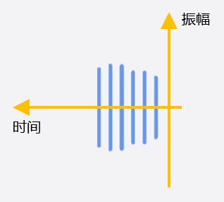

# 基于AudioRenderer和AudioCapturer实现音频波形动画

更新时间：2026-04-07 05:56:00

来源：https://developer.huawei.com/consumer/cn/doc/best-practices/bpta-audio-ripple-animation

##### 概述

 
音频波形动画是音频数据的线性波形显示，其中，水平X轴用于衡量时间，垂直Y轴用于衡量振幅，如下图所示：
 



 
由于音频波形可以清晰地显示振幅变化，因此非常适合于直观显示声音、音乐等的音量大小变化，常用于用户在录音或播放录音过程中实时展示音量大小的场景。
 
本文将介绍以下两种音频波形场景的实现：
 
- [基于AudioRenderer实现音频播放波形](#section1373162254116)
- [基于AudioCapturer实现音频录制波形](#section223649195014)

 

##### 实现原理

dBFS是描述音频信号在数字系统中的幅度的单位，在波形显示中，通常使用dBFS衡量数字音频中的信号强度。其计算公式如下所示：
 


 
其中，A表示当前的振幅数值，即当前音频数据的位深。Amax表示振幅数值的最大值，即音频的最大位深。
 
在计算音频的振幅dBFS后，将振幅高度绘制到画布上，再通过动画向左移动，重复以上步骤后，即可实现音频波形动画。
 
 

##### 基于AudioRenderer实现音频播放波形

 

##### 场景描述

开发者在开发录音播放等场景时，为了体现当前播放音量的大小，需要实现音频播放波形，下面将介绍如何基于AudioRenderer实现音频播放波形。
 


 
 

##### 实现原理

在基于[AudioRenderer](https://developer.huawei.com/consumer/cn/doc/harmonyos-references/arkts-apis-audio-audiorenderer)实现音频播放波形场景中，需要定时计算获取音频的dBFS。因为需要定时绘制dBFS，所以需要计算这一段时间内的平均音频位深。然后，根据平均位深计算当前的dBFS，将对应高度的线条绘制到画布上。最后，通过动画移动画布，从而实现音频播放波形。
 
 

##### 开发步骤
1. 初始化AudioRenderer，在回调函数writeData()中需要计算位深的总数，便于后续计算其平均值。

  
```ArkTS
this.renderer.on('writeData', (buffer: ArrayBuffer) => {
  let lastLen: number = this.fileSize - this.readOffset;
  let readLen: number = lastLen >= buffer.byteLength ? buffer.byteLength : lastLen;
  try {
    fileIo.readSync(this.playFile?.fd, buffer, { offset: this.readOffset, length: readLen });
  } catch (error) {
    Logger.error(TAG, `writeData error. message:${(error as BusinessError).message}`);
  }

  this.readOffset += readLen;
  AppStorage.setOrCreate('RWOffset', this.readOffset);
  if (this.readOffset >= this.fileSize) {
    this.readOffset = 0;
  }
  // sum samples
  let samples: Int16Array = new Int16Array(buffer);
  for (let i = 0; i < samples.length; i++) {
    let val: number = samples[i] / Constants.VOLUME_MAX;
    this.sampleValSum += val * val;
    this.sampleValCnt += 1;
  }
});
```
 
> [!NOTE]
> 为了后续波形显示，此处在处理音频数据时，将当前获取的位深进行了平方。

2. 根据音频数据的位深计算对应的dBFS。例如，在画布移动6px后，根据这段时间的总位深sampleValSum及其采样的数量sampleValCnt计算平均位深，再根据平均位深计算这段时间的dBFS。

  
```ArkTS
calculateDecibel(): number {
  if (this.sampleValCnt === 0) {
    return 0;
  }
  let rms: number = this.sampleValSum / this.sampleValCnt;
  // calculate dBFS
  let dBFS: number = Math.max(Constants.MIN_DB, Math.min(0, 20 * Math.log10(rms)));
  this.sampleValCnt = 0;
  this.sampleValSum = 0;

  return (dBFS + Math.abs(Constants.MIN_DB)) / Math.abs(Constants.MIN_DB);
}
```

3. 将数据绘制到画布上，通过移动画布实现音频波形动效。

  
```ArkTS
drawOnPlay(): void {
  let drawCanvas = this.forwardCanvas;
  let xPos = this.drawXPos + this.dWidth + 2 * Constants.LINE_SPACE;
  if (xPos >= 2 * this.dWidth) {
    drawCanvas = 1 - drawCanvas;
    xPos = xPos % (2 * this.dWidth);
  }
  let context: CanvasRenderingContext2D = drawCanvas === 0 ? this.context0 : this.context1;
  let h: number = this.audioRendererMgr === undefined ? 0 :
    this.audioRendererMgr.calculateDecibel() * (this.dWidth / Constants.CANVAS_ASPECT_RADIO);
  // draw straight lines
  context.lineCap = 'round';
  context.lineWidth = 2;
  context.strokeStyle = 'rgba(10, 89, 247, 0.6)';
  context.beginPath();
  context.moveTo(xPos, this.dWidth / Constants.CANVAS_ASPECT_RADIO);
  context.lineTo(xPos, this.dWidth / Constants.CANVAS_ASPECT_RADIO + h);
  context.moveTo(xPos, this.dWidth / Constants.CANVAS_ASPECT_RADIO);
  context.lineTo(xPos, this.dWidth / Constants.CANVAS_ASPECT_RADIO - h);
  context.stroke();

  this.drawXPos += Constants.LINE_SPACE;
}
```

 
 

##### 基于AudioCapturer实现音频录制波形

 

##### 场景描述

开发者在开发通讯软件的语音录制发送、音乐录制等场景时，为了体现当前录制音量的大小，需要实现音频录制波形。下面将介绍如何基于AudioCapturer实现音频录制波形。
 


 
 

##### 实现原理

在基于AudioCapturer实现音频播放波形场景中，需要在readData的回调函数中获取对应的位深，再计算对应的dBFS，其他实现步骤与基于AudioRenderer实现音频播放波形类似。
 
 

##### 开发步骤
1. 初始化AudioCapturer，在回调函数readData()中需要计算位深的总数，便于后续计算其平均值。

  
```ArkTS
this.capturer.on('readData', (buffer: ArrayBuffer) => {
  let options: WriteOptions = { offset: this.writeOffset, length: buffer.byteLength };
  fileIo.writeSync(this.recordFile?.fd, buffer, options);
  this.writeOffset += buffer.byteLength;
  AppStorage.setOrCreate('RWOffset', this.writeOffset)
  // sum samples
  let samples = new Int16Array(buffer);
  for (let i = 0; i < samples.length; i++) {
    let val = samples[i] / Constants.VOLUME_MAX;
    this.sampleValSum += val * val;
    this.sampleValCnt += 1;
  }
});
```

2. 根据音频数据的位深计算对应的dBFS。例如，在画布移动6px后，根据这段时间的总位深sampleValSum及其采样的数量sampleValCnt计算平均位深，再根据平均位深计算这段时间的dBFS。

  
```ArkTS
calculateDecibel(): number {
  if (this.sampleValCnt === 0) {
    return 0;
  }
  let rms: number = this.sampleValSum / this.sampleValCnt;
  // calculate dBFS
  let dBFS: number = Math.max(Constants.MIN_DB, Math.min(0, 20 * Math.log10(rms)));
  this.sampleValCnt = 0;
  this.sampleValSum = 0;

  return (dBFS + Math.abs(Constants.MIN_DB)) / Math.abs(Constants.MIN_DB);
}
```

3. 将数据绘制到画布上，通过移动画布实现音频波形动效。

  
```ArkTS
drawOnRecord() {
  let drawCanvas: number = this.forwardCanvas;
  let xPos: number = this.drawXPos + this.dWidth + Constants.LINE_SPACE;
  if (xPos >= 2 * this.dWidth) {
    drawCanvas = 1 - drawCanvas;
    xPos -= 2 * this.dWidth;
  }
  let context: CanvasRenderingContext2D = drawCanvas === 0 ? this.context0 : this.context1;
  let h: number = this.audioCapturerMgr.calculateDecibel() * (this.dWidth / Constants.CANVAS_ASPECT_RADIO);
  // draw straight lines
  context.lineCap = 'round';
  context.lineWidth = 2;
  context.strokeStyle = 'rgba(10, 89, 247, 0.6)';
  context.beginPath();
  context.moveTo(xPos, this.dWidth / Constants.CANVAS_ASPECT_RADIO)
  context.lineTo(xPos, this.dWidth / Constants.CANVAS_ASPECT_RADIO + h);
  context.moveTo(xPos, this.dWidth / Constants.CANVAS_ASPECT_RADIO)
  context.lineTo(xPos, this.dWidth / Constants.CANVAS_ASPECT_RADIO - h);
  context.stroke();

  this.drawXPos += Constants.LINE_SPACE;
}
```

 
 

##### 示例代码

- [实现音频动画](https://gitcode.com/harmonyos_samples/audio-ripple-animation)
