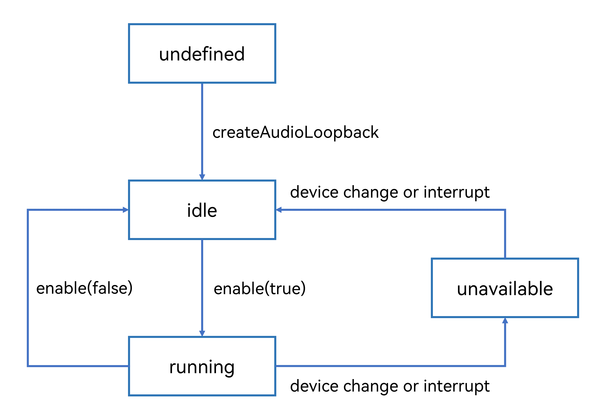
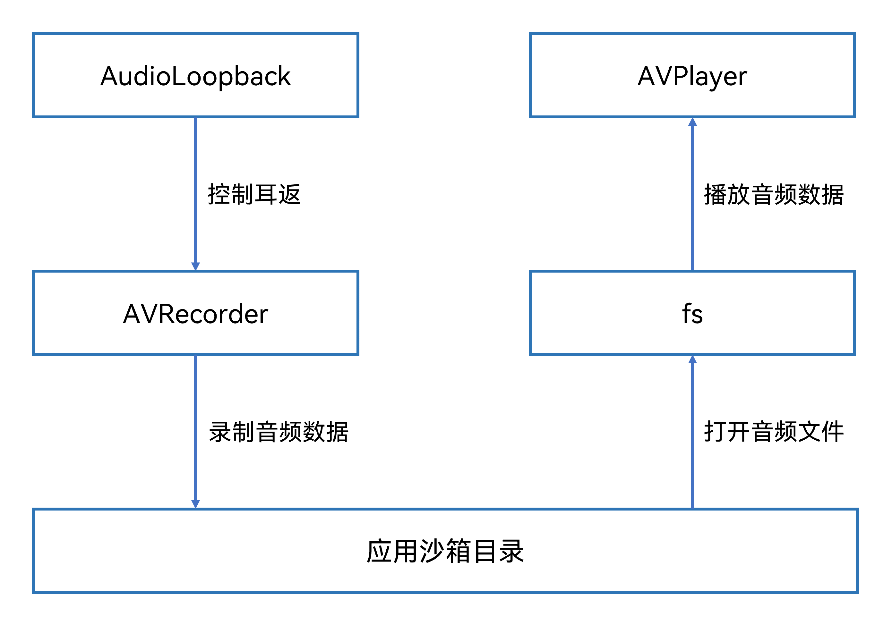
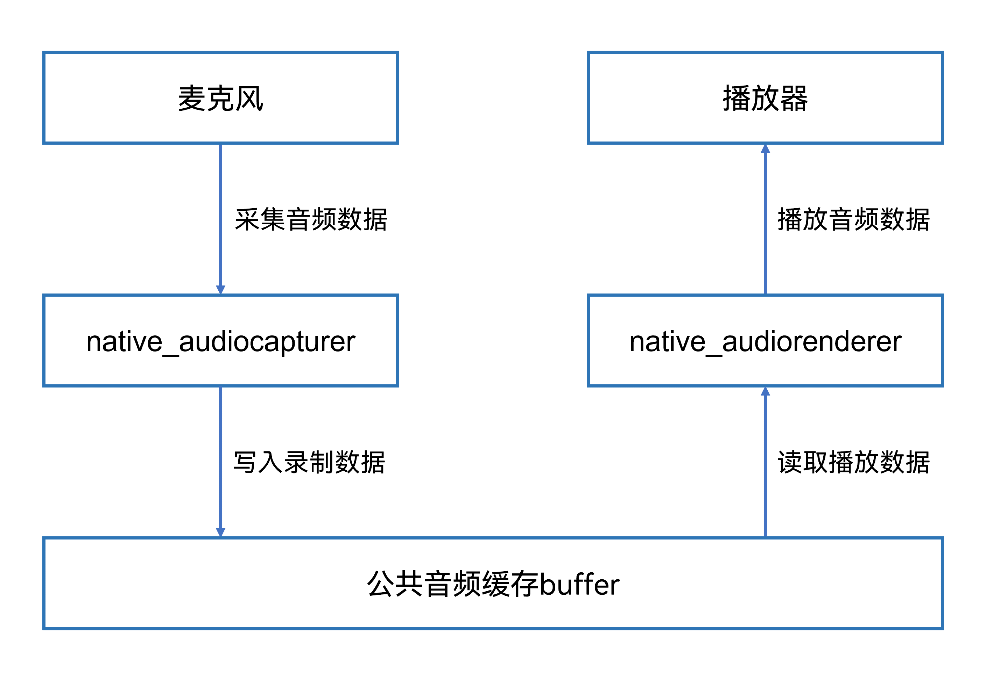

# 基于Audio能力实现音频耳返

更新时间：2026-04-01 09:49:00

来源：https://developer.huawei.com/consumer/cn/doc/best-practices/bpta-audio-in-ear-monitor

## 概述


耳返是指通过耳机系统将音频实时传输到耳机中，让使用者能够听到自己的声音、伴奏或其它需要的信息。例如在K歌类应用中，将录制的人声和背景音乐实时送到耳机中，使用户通过反馈即时调整，获得更好的使用体验。

当前系统支持耳返的两种方案如下：


|  | 实现方案 | 优点 | 缺点 |
| --- | --- | --- | --- |
| 硬件耳返 | 基于[AudioLoopback](https://developer.huawei.com/consumer/cn/doc/harmonyos-references/arkts-apis-audio-audioloopback)实现音频耳返 | 物理耳返，延时低。在API21，提供混响和均衡器等音效。 | 当前仅支持有线耳机，不支持蓝牙耳机。在耳返的场景下，仅支持录制麦克风。 |
| 软件耳返 | 基于[OHAudio](https://developer.huawei.com/consumer/cn/doc/harmonyos-references/capi-ohaudio)实现音频耳返 | 可以支持有线耳机和蓝牙耳机。可以支持耳返（使用者自己的声音或其它需要的信息等）和背景音乐同时录制写入到文件中。 | 暂无硬件耳返的接口，软件耳返延时比硬件耳返高。无音效相关的接口，音效等算法需要自行实现。 |


本文将介绍以下两种实现音频耳返方案：

- [基于AudioLoopback实现音频耳返](#section1720354614413)
- [基于OHAudio实现音频耳返](#section144598624518)


## 基于AudioLoopback实现音频耳返


### 场景描述


点击进入AudioLoopback页面，连接有线耳机，点击录制按钮开启耳返。开启耳返后开发者可通过麦克风在耳机中实时听到自己或周围的声音，同时进行耳返内音频的录制，并且可通过Slider滑块实现耳返音量调节功能。录制完成后进入播放页面，播放录制的音频资源。实现效果如下图：


### 实现原理


AudioLoopback是HarmonyOS提供的音频返听接口，用于实现低时延耳返功能，支持自动创建低时延渲染器与采集器，采集的音频可直接通过内部路由返回到渲染器，实时传输到耳机。

AudioLoopback的状态变化如下图所示，在创建AudioLoopback实例后，调用对应的方法可以进入指定的状态实现对应行为。同时需要注意的是，在确定的状态执行不合适的方法，可能导致AudioLoopback发生错误，建议开发者在调用状态转换的方法前进行状态检查，避免程序运行产生预期以外的结果，详细开发指导请参考：实现音频低时延耳返。





### 开发步骤


使用AudioLoopback控制耳返的开启和关闭，结合AVRecorder实现音频的录制，将录制的音频保存在应用沙箱目录，并通过@ohos.file.fs (文件管理)打开录制的音频文件，再通过AVPlayer实现已录制音频的播放控制，详细流程如下图所示：





具体开发步骤如下：

1. 创建AudioLoopback。
- 通过[isAudioLoopbackSupported()](https://developer.huawei.com/consumer/cn/doc/harmonyos-references/arkts-apis-audio-audiostreammanager#isaudioloopbacksupported20)查询当前系统是否支持音频返听模式。若支持，则调用[audio.createAudioLoopback()](https://developer.huawei.com/consumer/cn/doc/harmonyos-references/arkts-apis-audio-f#audiocreateaudioloopback20)接口创建音频返听器。
```ts
private audioLoopback: audio.AudioLoopback | undefined = undefined;
// ...

// Query capability, create AudioLoopback instance.
public initAudioLoopback(): void {
  try {
    // Check whether the current system supports hardware in-ear monitor cancellation mode.
    let isSupported = audio.getAudioManager().getStreamManager().isAudioLoopbackSupported(this.mode);
    if (isSupported) {
      audio.createAudioLoopback(this.mode)
      .then((loopback) => {
        this.audioLoopback = loopback;
      })
      .catch((err: BusinessError) => {
        logger.error(`Invoke createAudioLoopback failed, code is ${err.code}, message is ${err.message}.`);
      });
    }
  } catch (error) {
    let err = error as BusinessError;
    logger.error(`Failed to use isAudioLoopbackSupported, code=${err.code}, message=${err.message}}`);
  }
}
```
- 通过AudioLoopback的[getStatus()](https://developer.huawei.com/consumer/cn/doc/harmonyos-references/arkts-apis-audio-audioloopback#getstatus20)方获取音频返听状态，当返听状态为AVAILABLE_IDLE时，表示返听可用，此时可调用[enable()](https://developer.huawei.com/consumer/cn/doc/harmonyos-references/arkts-apis-audio-audioloopback#enable20)方法传入参数true，开启音频返听。
```ts
// Set up a listening event and enable audio feedback.
public async enable(): Promise<void> {
  // ...

  try {
    let status = await this.audioLoopback.getStatus();
    if (status === audio.AudioLoopbackStatus.AVAILABLE_IDLE) {
      // Enable in-ear monitor.
      await this.audioLoopback.enable(true)
      .then((isSuccess: boolean) => {
        if (isSuccess) {
          this.setAudioReverbPreset(audio.AudioLoopbackReverbPreset.ORIGINAL);
          this.setEqualizerPreset(audio.AudioLoopbackEqualizerPreset.FULL);
        }
      })
      .catch((err: BusinessError) => {
        logger.error(`Audio loopback enable failed. code=${err.code}, message=${err.message}`);
      })
    } else {
      this.statusChangeCallback(status);
    }
  } catch (err) {
    logger.error(`code is ${err.code}, message is ${err.message}.`);
  }
}
```
- 当返听状态为AVAILABLE_RUNNING时，表示返听在运行中，调用[enable()](https://developer.huawei.com/consumer/cn/doc/harmonyos-references/arkts-apis-audio-audioloopback#enable20)方法传入参数false，禁用音频返听。
```ts
// Disable audio playback, close monitoring event.
public async disable(): Promise<void> {
  // ...
  try {
    let status = await this.audioLoopback.getStatus();
    if (status === audio.AudioLoopbackStatus.AVAILABLE_RUNNING) {
      // Disable in-ear monitor.
      await this.audioLoopback.enable(false)
      .then((isSuccess: boolean) => {
        if (isSuccess) {
          // Close monitoring.
          this.audioLoopback?.off('statusChange', this.statusChangeCallback);
        }
      })
      .catch((err: BusinessError) => {
        logger.error(`Audio loopback enable failed. code=${err.code}, message=${err.message}`);
      })
    } else {
      this.statusChangeCallback(status);
    }
  } catch (err) {
    logger.error(`Invoke disable failed, code is ${err.code}, message is ${err.message}.`);
  }
}
```
- 调用[setVolume()](https://developer.huawei.com/consumer/cn/doc/harmonyos-references/arkts-apis-audio-audioloopback#setvolume20)方法实现音频返听音量的调节。
```ts
// Set audio playback volume.
public async setVolume(volume: number): Promise<void> {
  // ...
  try {
    await this.audioLoopback.setVolume(volume);
    logger.info(`Invoke setVolume ${volume} succeeded.`);
  } catch (err) {
    logger.error(`Invoke setVolume failed, code is ${err.code}, message is ${err.message}.`);
  }
}
```
2. 创建AVRecorder。
- 调用[media.createAVRecorder()](https://developer.huawei.com/consumer/cn/doc/harmonyos-references/arkts-apis-media-f#mediacreateavrecorder9)方法，用于创建AVRecorder实例。
```ts
private avRecorder: media.AVRecorder | undefined = undefined;

// Create an avRecorder instance.
public async initAVRecorder() {
  try {
    this.avRecorder = await media.createAVRecorder();
  } catch (err) {
    let error: BusinessError = err as BusinessError;
    logger.error(`Failed to create avRecorder, error code: ${error.code}, message: ${error.message}`);
  }
}
```
- 调用[prepare()](https://developer.huawei.com/consumer/cn/doc/harmonyos-references/arkts-apis-media-avrecorder#prepare9)方法设置音频录制的音频编码比特率、采集声道数、编码格式、采样率和容器格式等信息。
```ts
// Configure audio recording parameters.
public prepareAVRecorder(uiContext: Context) {
  // Audio recording configuration file.
  let avProfile: media.AVRecorderProfile = {
    audioBitrate: 112000, // Audio Bit Rate.
    audioChannels: 2, // Number of audio channels.
    audioCodec: media.CodecMimeType.AUDIO_AAC, // Audio encoding format.
    audioSampleRate: 48000, // Audio sampling rate.
    fileFormat: media.ContainerFormatType.CFT_MPEG_4A // Container format.
  };

  const context: Context = uiContext;
  let filePath: string = context.filesDir + '/example.mp3';
  try {
    let audioFile: fs.File = fs.openSync(filePath, fs.OpenMode.READ_WRITE | fs.OpenMode.CREATE);
    let fileFd: number = audioFile?.fd as number;
    // Parameter settings for audio recording.
    let avConfig: media.AVRecorderConfig = {
      audioSourceType: media.AudioSourceType.AUDIO_SOURCE_TYPE_MIC, // Audio input source, set as microphone here
      profile: avProfile,
      url: 'fd://' + fileFd
    };
    AppStorage.setOrCreate('fdSrc', fileFd);
    if(!this.avRecorder) {
      return;
    }
    if (this.avRecorder.state === 'idle' || this.avRecorder.state === 'stopped') {
      this.avRecorder.prepare(avConfig, (err: BusinessError) => {
        if (!err) {
          this.startRecorder();
        }
      });
    }
  } catch (error) {
    let err = error as BusinessError;
    logger.error(`Failed to open file, error code: ${err.code}, message: ${err.message}`);
  }
}
```
- 调用[start()](https://developer.huawei.com/consumer/cn/doc/harmonyos-references/arkts-apis-media-avrecorder#start9)方法开始音频录制。
```ts
// Start recording.
public startRecorder() {
  // ...
  this.avRecorder.start((err: BusinessError) => {
    if (!err) {
      logger.info('Succeeded in start avRecorder');
    }
  });
}
```
- 调用[pause()](https://developer.huawei.com/consumer/cn/doc/harmonyos-references/arkts-apis-media-avrecorder#pause9)方法暂停音频录制。
```ts
// Pause recording.
public pauseRecorder() {
  // ...
  this.avRecorder.pause((err: BusinessError) => {
    if (!err) {
      logger.info('Succeeded in pause avRecorder');
    }
  });
}
```
- 调用[resume()](https://developer.huawei.com/consumer/cn/doc/harmonyos-references/arkts-apis-media-avrecorder#resume9)方法恢复音频录制。
```ts
// Resume recording.
public resumeRecorder() {
  // ...
  this.avRecorder.resume((err: BusinessError) => {
    if (!err) {
      logger.info('Succeeded in resume avRecorder');
    }
  });
}
```
- 调用[stop()](https://developer.huawei.com/consumer/cn/doc/harmonyos-references/arkts-apis-media-avrecorder#stop9)方法停止音频录制。
```ts
// Stop recording.
public stopRecorder() {
  // ...
  this.avRecorder.stop((err: BusinessError) => {
    if (!err) {
      logger.info('Succeeded in stop avRecorder');
    }
  });
}
```
- 调用[release()](https://developer.huawei.com/consumer/cn/doc/harmonyos-references/arkts-apis-media-avrecorder#release9)方法释放音频录制资源。
```ts
// Release audio recording resources.
public releaseRecorder() {
  // ...
  this.avRecorder.release((err: BusinessError) => {
    if (!err) {
      logger.info('Succeeded in release avRecorder');
    }
  });
}
```
3. 创建AVPlayer。
- 调用[media.createAVPlayer()](https://developer.huawei.com/consumer/cn/doc/harmonyos-references/arkts-apis-media-f#mediacreateavplayer9-1)方法创建AVPlayer实例。
```ts
private avPlayer: media.AVPlayer | undefined = undefined;

// Initialize and create an AVPlayer instance.
async initAVPlayer(fd: number, isPlay: boolean): Promise<void> {
  try {
    this.avPlayer = await media.createAVPlayer();
    await this.setAVPlayerCallback(isPlay);
    this.avPlayer.fdSrc = { fd: fd };
  } catch (error) {
    let err = error as BusinessError;
    logger.error(`AVPlayer init fail. code=${err.code}, message=${err.message}`);
  }
}
```
- 调用[play()](https://developer.huawei.com/consumer/cn/doc/harmonyos-references/arkts-apis-media-avplayer#play9-1)方法，用于播放录制的音频资源。
```ts
// Play audio.
play(): void {
  // ...
  this.avPlayer.play()
  .catch(() => {
    logger.error('AVPlayerController play error!');
  })
}
```
- 调用[pause()](https://developer.huawei.com/consumer/cn/doc/harmonyos-references/arkts-apis-media-avplayer#pause9-1)方法，暂停播放音频。
```ts
// Pause playback.
pause(): void {
  // ...
  this.avPlayer.pause()
  .catch(() => {
    logger.error('AVPlayerController pause error!');
  })
}
```
- 调用[release()](https://developer.huawei.com/consumer/cn/doc/harmonyos-references/arkts-apis-media-avplayer#release9-1)方法，释放播放资源。
```ts
// Destruction of playback resources.
release(): void {
  // ...
  this.avPlayer.release()
  .catch(() => {
    logger.error('AVPlayerController release error!');
  });
}
```
4. 在页面内点击录制按钮后，请求用户授权麦克风权限，通过AudioLoopback开启耳返，同时通过AVRecorder进行耳返音频的录制。
- 开启耳返并录制音频。
[@ohos.abilityAccessCtrl (程序访问控制管理)](https://developer.huawei.com/consumer/cn/doc/harmonyos-references/js-apis-abilityaccessctrl)提供了应用程序的权限校验和管理能力，通过[requestPermissionsFromUser()](https://developer.huawei.com/consumer/cn/doc/harmonyos-references/js-apis-abilityaccessctrl#requestpermissionsfromuser9)接口拉起弹框，向用户请求授权麦克风权限。
```ts
// Pull up the pop-up box and request user authorization.
atManager
  .requestPermissionsFromUser(this.getUIContext().getHostContext(), [
    'ohos.permission.MICROPHONE',
  ])
  .then((data) => {
    if (data.authResults[0] !== 0) {
      return;
    }
    this.capturesStart();
  })
  .catch((err: BusinessError) => {
    logger.error(
      `requestPermissionsFromUser fail. err.code=${err.code}, err.message=${err.message}}`,
    );
  });
```

 调用自定义capturesStart()方法，通过AudioLoopback的enable()开启耳返，并通过prepareAVRecorder()进行耳返音频的录制。
```ts
// Start collecting audio.
capturesStart() {
  try {
    // Enable in-ear monitor.
    if (this.isArkTS) {
      this.audioLoopbackController.enable();
    } else {
      // ...
    }
    this.recorderController.prepareAVRecorder(this.getUIContext().getHostContext()!); // Start recording.
    this.recordSec = 0; // Initialize recording duration.
    this.showTime = '00:00:00'; // Initialize audio capture time.
    this.recordState = CommonConstants.PLAY_STARTED; // Start recording status.
    clearInterval(this.interval); // Clear timer.
    this.interval = setInterval(async () => {
      // ...
      this.recordSec++;
      this.showTime = FormatTimeTools.getTimesBySecond(this.recordSec); // Audio acquisition time conversion
    }, 1000)
  } catch (error) {
    let err = error as BusinessError;
    logger.error(`AudioRecording:audioCapturer start err.code = ${err.code}, err.message=${err.message}`);
  }
}
```
- 暂停录制。定义capturesPause()方法，在其中调用pauseRecorder()暂停音频录制，并调用disable()禁用音频返听。
```ts
// Pause audio capture.
capturesPause() {
  try {
    clearInterval(this.interval);
    this.recordState = CommonConstants.PLAY_PAUSED;
    this.recorderController.pauseRecorder(); // Pause recording.
    // Disable in-ear monitor.
    if (this.isArkTS) {
      this.audioLoopbackController.disable();
    } else {
      // ...
    }
  } catch (error) {
    let err = error as BusinessError;
    logger.error(`AudioRecording:audioCapturer stop. err.code=${err.code}, err.message=${err.message}}`);
  }
}
```
- 继续录制。
定义capturesContinue()方法，在其中调用enable()重启音频返听，并通过resumeRecorder()恢复录制。
```ts
// Continue to collect.
capturesContinue() {
  try {
    // ...
    this.recordState = CommonConstants.PLAY_CONTINUED;
    // Enable in-ear monitor.
    if (this.isArkTS) {
      this.audioLoopbackController.enable();
    } else {
      // ...
    }
    this.recorderController.resumeRecorder(); // Resume recording
    this.interval = setInterval(async () => {
      // ...
      this.recordSec++;
      this.showTime = FormatTimeTools.getTimesBySecond(this.recordSec);
    }, 1000);
  } catch (err) {
    logger.error(`AudioRecording:audioCapturer start err = ${JSON.stringify(err)}`);
  }
}
```
- 调节耳返音量。
在Slider组件的onChange()事件中，调用audioLoopbackController的setVolume()方法，并传入value值，实现耳返音量的调节。
```ts
Slider({
  min: 0,
  max: 1,
  step: 0.1,
  value: this.volumeValue,
})
  .width('75%')
  .onChange((value: number) => {
    this.volumeValue = value;
    if (this.isArkTS) {
      this.audioLoopbackController.setVolume(value);
    } else {
      // ...
    }
  });
```
- 停止录制。
定义capturesStop()方法，在其中调用stopRecorder()方法停止录制，并通过disable()禁用音频返听。
```ts
// Stop audio collection
capturesStop() {
  clearInterval(this.interval);
  this.recorderController.stopRecorder(); // Stop recording.
  // Disable in-ear monitor.
  if (this.isArkTS) {
    this.audioLoopbackController.disable();
  } else {
    // ...
  }
}
```
5. 播放音频。
- 初始化AVPlayer实例，并传入音频资源句柄。
```ts
private avPlayerController: AVPlayerController = new AVPlayerController();
private fdSrc: number | undefined = 0;

aboutToAppear(): void {
  this.fdSrc = AppStorage.get('fdSrc') as number;
  this.avPlayerController.initAVPlayer(this.fdSrc, false);
}
```
- 在点击事件中，调用avPlayerController的play()方法或pause()方法，实现音频资源的播放和暂停。
```ts
Column() {
  // ...
}
// ...
.onClick(() => {
  this.isPlay = !this.isPlay;
  if (this.fdSrc) {
    this.isPlay ? this.avPlayerController.play() : this.avPlayerController.pause();
  }
})
```


## 基于OHAudio实现音频耳返


### 场景描述


点击进入OHAudio页面，连接有线耳机或蓝牙耳机，点击录制按钮开启耳返。开启耳返后开发者同样可以通过麦克风在耳机中实时听到自己或周围的声音，并进行耳返音频的录制，以及可以通过Slider滑块实现耳返音量的调节。录制完成后进入播放页面，播放录制的音频资源。实现效果如下图：


### 实现原理


在C/C++侧实现耳返依赖OHAudio提供的低时延模式进行录制和播放。

1. 通过native_audiocapturer采集麦克风数据，并将数据写入到音频录制与播放间的数据中转区，即音频的公共缓存中。
2. 读取音频的公共缓存，通过native_audiorenderer播放音频，实现返听。





### 开发步骤


1. 录制音频数据。
- 调用[OH_AudioStreamBuilder_Create()](https://developer.huawei.com/consumer/cn/doc/harmonyos-references/capi-native-audiostreambuilder-h#oh_audiostreambuilder_create)，并指定[OH_AudioStream_Type](https://developer.huawei.com/consumer/cn/doc/harmonyos-references/capi-native-audiostream-base-h#oh_audiostream_type)音频流类型为AUDIOSTREAM_TYPE_CAPTURER，创建输入类型的音频流构造器实例，并设置输入音频流的采样率、声道数、低时延模式、采样格式、编码类型及工作场景等属性。
```cpp
static napi_value AudioCapturerInit(napi_env env, napi_callback_info info) {
  if (audioCapturer) {
    OH_AudioCapturer_Release(audioCapturer);
    OH_AudioStreamBuilder_Destroy(builder);
    audioCapturer = nullptr;
    builder = nullptr;
  }
  codecUserData = new CodecUserData();

  // Create builder.
  OH_AudioStream_Type type = AUDIOSTREAM_TYPE_CAPTURER;
  // Create an audio stream constructor of input type.
  OH_AudioStreamBuilder_Create(&builder, type);
  // Set the sampling rate of the audio stream.
  OH_AudioStreamBuilder_SetSamplingRate(builder, g_samplingRate);
  // Set the number of channels for the audio stream.
  OH_AudioStreamBuilder_SetChannelCount(builder, g_channelCount);
  // Set up low-latency audio streaming.
  OH_AudioStreamBuilder_SetLatencyMode(builder, AUDIOSTREAM_LATENCY_MODE_FAST);
  // Set the sampling format of the audio stream.
  OH_AudioStreamBuilder_SetSampleFormat(builder, AUDIOSTREAM_SAMPLE_S16LE);
  // Set the encoding type of the audio stream.
  OH_AudioStreamBuilder_SetEncodingType(builder, AUDIOSTREAM_ENCODING_TYPE_RAW);
  // Set a working scenario for inputting audio streams.
  OH_AudioStreamBuilder_SetCapturerInfo(builder, AUDIOSTREAM_SOURCE_TYPE_MIC);
  // ...

  // Create OH_AudioCapturer.
  OH_AudioStreamBuilder_GenerateCapturer(builder, &audioCapturer);
  return nullptr;
}
```
- 调用[OH_AudioCapturer_Start()](https://developer.huawei.com/consumer/cn/doc/harmonyos-references/capi-native-audiocapturer-h#oh_audiocapturer_start)启动音频采集器，获取音频数据。
```cpp
static napi_value AudioCapturerStart(napi_env env, napi_callback_info info) {
  // start
  OH_AudioCapturer_Start(audioCapturer);
  return nullptr;
}
```
- 调用[OH_AudioCapturer_Pause()](https://developer.huawei.com/consumer/cn/doc/harmonyos-references/capi-native-audiocapturer-h#oh_audiocapturer_pause)暂停音频流数据输入。
```cpp
static napi_value AudioCapturerPause(napi_env env, napi_callback_info info) {
  OH_AudioCapturer_Pause(audioCapturer);
  return nullptr;
}
```
- 调用[OH_AudioCapturer_Stop()](https://developer.huawei.com/consumer/cn/doc/harmonyos-references/capi-native-audiocapturer-h#oh_audiocapturer_stop)停止音频采集器，停止音频流数据输入。
```cpp
static napi_value AudioCapturerStop(napi_env env, napi_callback_info info) {
  OH_AudioCapturer_Stop(audioCapturer);
  return nullptr;
}
```
- 调用[OH_AudioCapturer_Release()](https://developer.huawei.com/consumer/cn/doc/harmonyos-references/capi-native-audiocapturer-h#oh_audiocapturer_release)释放输入音频流，并通过[OH_AudioStreamBuilder_Destroy()](https://developer.huawei.com/consumer/cn/doc/harmonyos-references/capi-native-audiostreambuilder-h#oh_audiostreambuilder_destroy)销毁输入类型的音频流构造器。
```cpp
static napi_value AudioCapturerRelease(napi_env env, napi_callback_info info) {
  if (audioCapturer) {
    OH_AudioCapturer_Release(audioCapturer);
    if (builder) {
      OH_AudioStreamBuilder_Destroy(builder);
    }
    audioCapturer = nullptr;
    builder = nullptr;
  }
  // ...
  return nullptr;
}
```
2. 播放音频数据。
- 调用[OH_AudioStreamBuilder_Create()](https://developer.huawei.com/consumer/cn/doc/harmonyos-references/capi-native-audiostreambuilder-h#oh_audiostreambuilder_create)，并指定[OH_AudioStream_Type](https://developer.huawei.com/consumer/cn/doc/harmonyos-references/capi-native-audiostream-base-h#oh_audiostream_type)音频流类型为AUDIOSTREAM_TYPE_RENDERER，创建输出类型的音频流构造器实例，并设置输出音频流的采样率、声道数、低时延模式、音频播放回调帧长、采样格式、编码类型及工作场景等。
```cpp
static napi_value AudioRendererInit(napi_env env, napi_callback_info info) {
  if (audioRenderer) {
    OH_AudioRenderer_Release(audioRenderer);
    OH_AudioStreamBuilder_Destroy(rendererBuilder);

    audioRenderer = nullptr;
    rendererBuilder = nullptr;
  }

  // Create an audio stream builder of output type.
  OH_AudioStream_Type type = AUDIOSTREAM_TYPE_RENDERER;
  OH_AudioStreamBuilder_Create(&rendererBuilder, type);

  // Set the sampling rate of the audio stream.
  OH_AudioStreamBuilder_SetSamplingRate(rendererBuilder, g_samplingRate);
  // Set the number of channels for the audio stream.
  OH_AudioStreamBuilder_SetChannelCount(rendererBuilder, g_channelCount);
  // Set up low-latency audio streaming.
  OH_AudioStreamBuilder_SetLatencyMode(rendererBuilder, AUDIOSTREAM_LATENCY_MODE_FAST);
  OH_AudioStreamBuilder_SetFrameSizeInCallback(rendererBuilder, 2500);
  // Set the sampling format of the audio stream.
  OH_AudioStreamBuilder_SetSampleFormat(rendererBuilder, AUDIOSTREAM_SAMPLE_S16LE);
  // Set the working scenario for outputting audio streams.
  OH_AudioStreamBuilder_SetRendererInfo(rendererBuilder, AUDIOSTREAM_USAGE_MUSIC);
  OH_AudioStreamBuilder_SetRendererWriteDataCallback(rendererBuilder, AudioRendererOnWriteData, codecUserData);

  // Create an instance of output audio stream.
  OH_AudioStreamBuilder_GenerateRenderer(rendererBuilder, &audioRenderer);
  g_readEnd = false;
  g_rendererLowLatency = false;
  return nullptr;
}
```
- 调用[OH_AudioRenderer_Start()](https://developer.huawei.com/consumer/cn/doc/harmonyos-references/capi-native-audiorenderer-h#oh_audiorenderer_start)输出音频数据。
```cpp
static napi_value AudioRendererStart(napi_env env, napi_callback_info info) {
  g_readEnd = false;
  // start
  OH_AudioRenderer_Start(audioRenderer);
  return nullptr;
}
```
- 调用[OH_AudioRenderer_Pause()](https://developer.huawei.com/consumer/cn/doc/harmonyos-references/capi-native-audiorenderer-h#oh_audiorenderer_pause)暂停输出音频数据。
```cpp
static napi_value AudioRendererPause(napi_env env, napi_callback_info info) {
  g_readEnd = false;
  OH_AudioRenderer_Pause(audioRenderer);
  return nullptr;
}
```
- 调用[OH_AudioRenderer_SetVolume()](https://developer.huawei.com/consumer/cn/doc/harmonyos-references/capi-native-audiorenderer-h#oh_audiorenderer_setvolume)设置音频流音量值。
```cpp
static napi_value AudioRendererSetVolume(napi_env env, napi_callback_info info) {
  size_t argc = 1;
  napi_value args[1] = {nullptr};
  napi_get_cb_info(env, info, &argc, args, nullptr, nullptr);
  double volume = 1;
  napi_get_value_double(env, args[0], &volume);
  OH_AudioRenderer_SetVolume(audioRenderer, volume);
  return nullptr;
}
```
- 调用[OH_AudioRenderer_Stop()](https://developer.huawei.com/consumer/cn/doc/harmonyos-references/capi-native-audiorenderer-h#oh_audiorenderer_stop)停止输出音频流。
```cpp
static napi_value AudioRendererStop(napi_env env, napi_callback_info info) {
  g_readEnd = false;
  OH_AudioRenderer_Stop(audioRenderer);
  return nullptr;
}
```
- 调用[OH_AudioRenderer_Release()](https://developer.huawei.com/consumer/cn/doc/harmonyos-references/capi-native-audiorenderer-h#oh_audiorenderer_release)释放输出音频流资源，并通过OH_AudioStreamBuilder_Destroy()销毁输出类型的音频流构造器。
```cpp
static napi_value AudioRendererRelease(napi_env env, napi_callback_info info) {
  if (audioRenderer) {
    OH_AudioRenderer_Release(audioRenderer);
    OH_AudioStreamBuilder_Destroy(rendererBuilder);
    audioRenderer = nullptr;
    rendererBuilder = nullptr;
  }
  return nullptr;
}
```
3. 在页面内点击录制按钮后，通过C/C++侧定义的方法实现耳返的开启或关闭，并通过AVRecorder进行耳返音频的录制。
- 开启耳返并录制音频。
调用audioCapturesStart()方法获取音频数据，并调用audioRendererStart()方法将音频数据通过耳机进行输出实现返听，以及通过prepareAVRecorder()方法进行耳返音频的录制。
```ts
// Start collecting audio.
capturesStart() {
  try {
    // Enable in-ear monitor.
    if (this.isArkTS) {
      // ...
    } else {
      nativeRecord.audioCapturesStart();
      nativeRecord.audioRendererStart();
    }
    this.recorderController.prepareAVRecorder(this.getUIContext().getHostContext()!); // Start recording.
    this.recordSec = 0; // Initialize recording duration.
    this.showTime = '00:00:00'; // Initialize audio capture time.
    this.recordState = CommonConstants.PLAY_STARTED; // Start recording status.
    clearInterval(this.interval); // Clear timer.
    this.interval = setInterval(async () => {
      // ...
      this.recordSec++;
      this.showTime = FormatTimeTools.getTimesBySecond(this.recordSec); // Audio acquisition time conversion
    }, 1000)
  } catch (error) {
    let err = error as BusinessError;
    logger.error(`AudioRecording:audioCapturer start err.code = ${err.code}, err.message=${err.message}`);
  }
}
```
- 暂停录制。
调用pauseRecorder()方法暂停音频录制，并通过audioCapturesPause()方法及audioRendererPause()方法暂停音频数据的输入和输出，关闭音频返听。
```ts
// Pause audio capture.
capturesPause() {
  try {
    clearInterval(this.interval);
    this.recordState = CommonConstants.PLAY_PAUSED;
    this.recorderController.pauseRecorder(); // Pause recording.
    // Disable in-ear monitor.
    if (this.isArkTS) {
      // ...
    } else {
      nativeRecord.audioCapturesPause();
      nativeRecord.audioRendererPause();
    }
  } catch (error) {
    let err = error as BusinessError;
    logger.error(`AudioRecording:audioCapturer stop. err.code=${err.code}, err.message=${err.message}}`);
  }
}
```
- 继续录制。
调用audioCapturesStart()方法和audioRendererStart()方法获取并输出音频数据，开启返听，并通过resumeRecorder()恢复录制。
```ts
// Continue to collect.
capturesContinue() {
  try {
    // ...
    this.recordState = CommonConstants.PLAY_CONTINUED;
    // Enable in-ear monitor.
    if (this.isArkTS) {
      // ...
    } else {
      nativeRecord.audioCapturesStart();
      nativeRecord.audioRendererStart();
    }
    this.recorderController.resumeRecorder(); // Resume recording
    this.interval = setInterval(async () => {
      // ...
      this.recordSec++;
      this.showTime = FormatTimeTools.getTimesBySecond(this.recordSec);
    }, 1000);
  } catch (err) {
    logger.error(`AudioRecording:audioCapturer start err = ${JSON.stringify(err)}`);
  }
}
```
- 调节返听音量。
在Slider组件的onChange()事件中，调用audioRendererSetVolume()方法，并传入value值，设置返听音量。
```ts
Slider({
  min: 0,
  max: 1,
  step: 0.1,
  value: this.volumeValue,
})
  .width('75%')
  .onChange((value: number) => {
    this.volumeValue = value;
    if (this.isArkTS) {
      // ...
    } else {
      nativeRecord.audioRendererSetVolume(value);
    }
  });
```
- 停止录制。
调用stopRecorder()方法停止录制，并通过audioCapturesStop()方法和audioRendererStop()方法实现音频流数据的输入和输出，关闭耳返。
```ts
// Stop audio collection
capturesStop() {
  clearInterval(this.interval);
  this.recorderController.stopRecorder(); // Stop recording.
  // Disable in-ear monitor.
  if (this.isArkTS) {
    // ...
  } else {
    nativeRecord.audioCapturesStop();
    nativeRecord.audioRendererStop();
  }
}
```
4. 音频播放，请参考基于AudioLoopback实现音频耳返场景中[播放音频](#li11370953124216)小节。


## 示例代码


- [实现音频耳返](https://gitcode.com/HarmonyOS_Samples/audio-in-ear-monitor)
