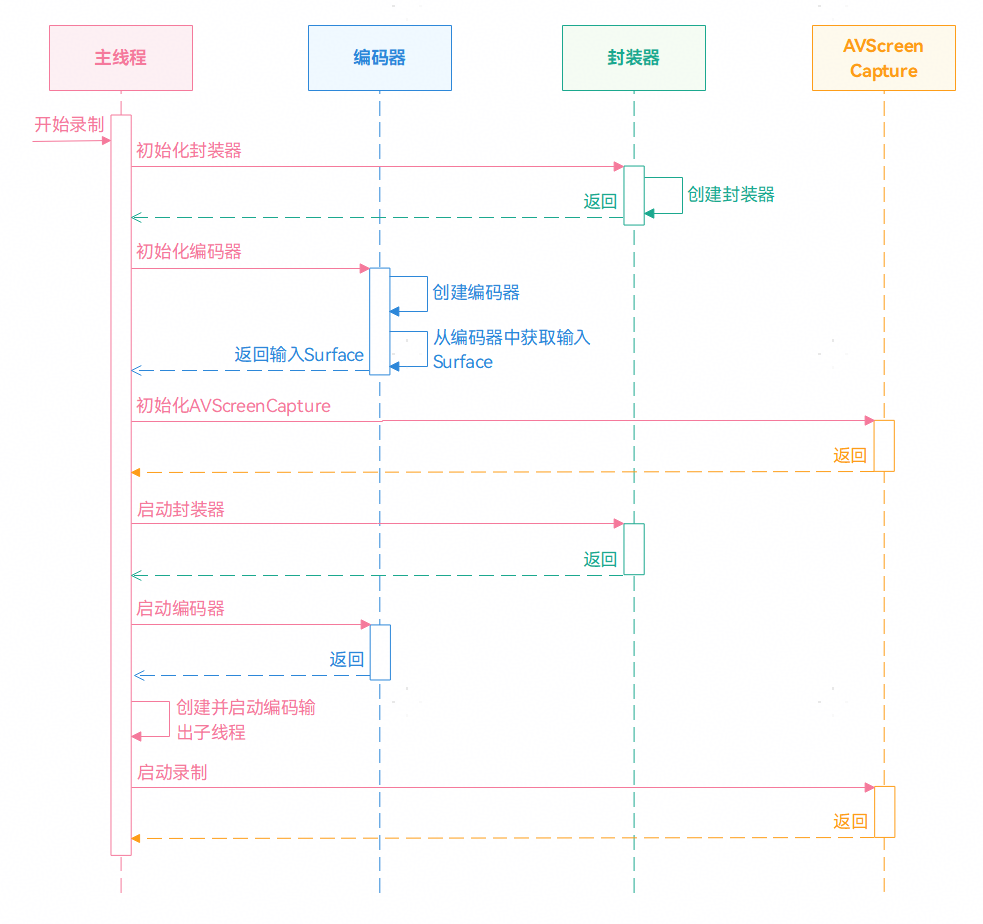
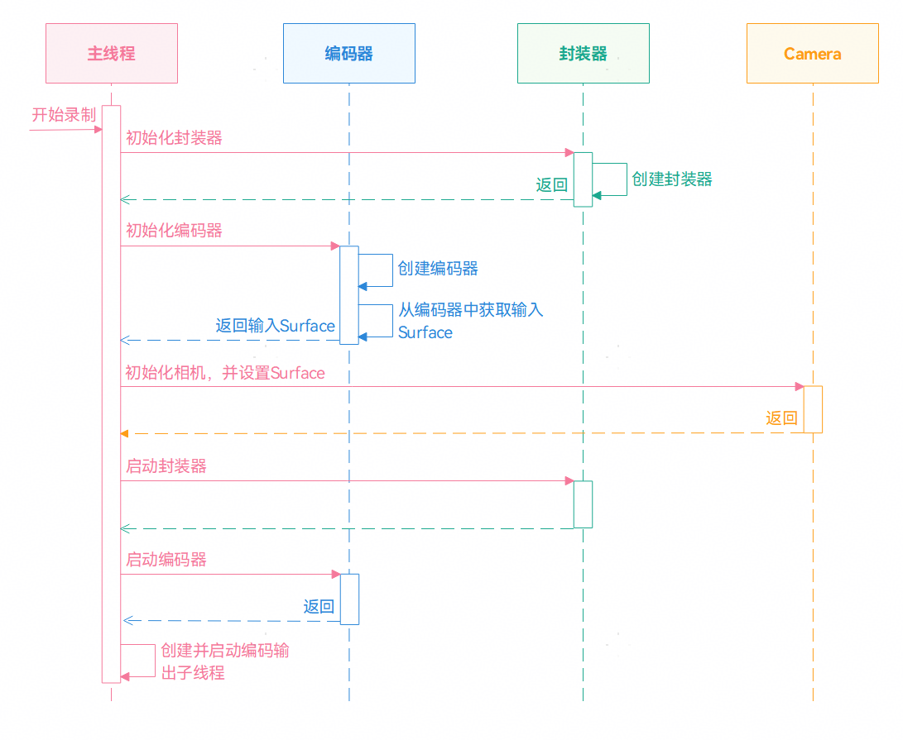

# 基于Surface模式进行视频编码

更新时间：2026-03-12 08:45:02

来源：https://developer.huawei.com/consumer/cn/doc/best-practices/bpta-surface-encoder

##### 概述

视频编码是指通过压缩技术，将原始视频数据转换成压缩数据的过程。HarmonyOS提供了媒体文件的解析和封装、音视频的编解码。基于[Surface模式](https://developer.huawei.com/consumer/cn/doc/harmonyos-guides/video-encoding#surface模式)进行视频编码指通过NativeWindow来传递编码的输入数据，使用AVCodec提供的视频编码能力实现视频编码的过程。开发者可以通过OHNativeWindow与其他模块进行对接，如相机模块、屏幕录制模块等。
 
 

##### 实现原理

 

##### Surface轮转原理

在Surface模式下，视频编码依赖NativeWindow传递编码数据。其中，NativeWindow是本地平台化窗口，表示图形队列的生产者端，包含了Surface对象。
 
Surface主要是用于管理、传递图形和媒体的共享内存，具体场景如图形的生产、消费、合成，媒体的播放、录制等。Surface通过共享内存的方式传递图形/媒体数据，避免了进程之间图形/媒体数据的拷贝，减少了进程之间数据传递的开销。
 
Surface分为生产者ProducerSurface和消费者ConsumerSurface。NativeWindow依赖生产者ProducerSurface，所以表示图形队列的生产者端。
 
> [!NOTE]
> 相对于Buffer模式，Surface模式避免了进程之间的媒体数据拷贝，所以Surface模式的性能会更高。

 
Surface轮转流程如下所示，生产者先申请到一块Buffer，填充数据后将Buffer返回给BufferQueue。在触发回调函数后，通知消费者Buffer已经被生产者填充好数据。之后，消费者可以获取填充好数据的Buffer，直到不再需要该Buffer后，释放对应的Buffer。
 



 

 
视频编码器提供了获取NativeWindow的接口，通过NativeWindow可以将相机产生的数据与视频编码器进行对接。视频编码器作为消费者，将Buffer数据进行消费编码，从而实现视频编码的操作。下面我们将通过相机录制和屏幕录制，介绍基于Surface模式进行视频编码。
 
 

##### 使用AVScreenCapture+AVCodec进行视频编码

 

##### 场景描述

系统中提供了AVScreenCapture用于屏幕录制，AVScreenCapture可以支持屏幕录制并直接保存到视频文件中，还可以将录制的数据通过NativeWindow对接编码器进行数据编码。在基于Surface实现屏幕录制的方案中，开发者可以根据自己的需求保存对应的格式。
 
 

##### 实现原理

Surface模式是通过NativeWindow包含的Surface传递录屏数据进行视频编码。在使用AVScreenCapture实现屏幕录制的场景中，开发者需要提前在编码器中获取NativeWindow对象，然后将获取的NativeWindow设置到AVScreenCapture中实现屏幕录制。具体开发步骤如下所示。
 1. 初始化视频封装器，创建并配置视频封装器。
2. 初始化视频编码器，创建并配置视频编码器，并从编码器中获取NativeWindow对象。
3. 初始化AVScreenCapture，创建并配置AVScreenCapture。
4. 启动视频封装器。
5. 启动视频编码器。
6. 创建并启动编码输出子线程。
7. 将从编码器中获取的NativeWindow对象设置给AVScreenCapture，启动屏幕录制。
 



 
 

##### 开发步骤
1. 初始化视频封装器，创建并配置视频封装器。
```cpp
int32_t Muxer::Create(int32_t fd) {
    muxer_ = OH_AVMuxer_Create(fd, AV_OUTPUT_FORMAT_MPEG_4);
    if (muxer_ == nullptr) {
        return -1;
    }
    return 0;
}

int32_t Muxer::Config(SampleInfo &sampleInfo) {
    OH_AVFormat *formatAudio = OH_AVFormat_CreateAudioFormat(sampleInfo.audioCodecMime.data(),
                                                             sampleInfo.audioSampleRate, sampleInfo.audioChannelCount);

    OH_AVFormat_SetIntValue(formatAudio, OH_MD_KEY_PROFILE, AAC_PROFILE_LC);

    int32_t ret = OH_AVMuxer_AddTrack(muxer_, &audioTrackId_, formatAudio);
    OH_AVFormat_Destroy(formatAudio);

    OH_AVFormat *formatVideo =
        OH_AVFormat_CreateVideoFormat(sampleInfo.videoCodecMime.data(), sampleInfo.videoWidth, sampleInfo.videoHeight);

    OH_AVFormat_SetDoubleValue(formatVideo, OH_MD_KEY_FRAME_RATE, sampleInfo.frameRate);
    OH_AVFormat_SetIntValue(formatVideo, OH_MD_KEY_WIDTH, sampleInfo.videoWidth);
    OH_AVFormat_SetIntValue(formatVideo, OH_MD_KEY_HEIGHT, sampleInfo.videoHeight);
    OH_AVFormat_SetStringValue(formatVideo, OH_MD_KEY_CODEC_MIME, sampleInfo.videoCodecMime.data());

    ret = OH_AVMuxer_AddTrack(muxer_, &videoTrackId_, formatVideo);
    if (ret != AV_ERR_OK) {
        OH_LOG_ERROR(LOG_APP, "AddTrack failed");
    }
    OH_AVFormat_Destroy(formatVideo);
    formatVideo = nullptr;
    return ret;
}
```

2. 初始化视频编码器，创建并配置视频编码器，并从编码器中获取NativeWindow对象。
```cpp
int32_t VideoEncoder::Create(const std::string &videoCodecMime) {
    encoder_ = OH_VideoEncoder_CreateByMime(videoCodecMime.c_str());
    if (encoder_ == nullptr) {
        return -1;
    }
    return 0;
}

int32_t VideoEncoder::Config(SampleInfo &sampleInfo, CodecUserData *codecUserData) {
    // Configure video encoder
    OH_AVFormat *format = OH_AVFormat_Create();

    OH_AVFormat_SetIntValue(format, OH_MD_KEY_WIDTH, sampleInfo.videoWidth);
    OH_AVFormat_SetIntValue(format, OH_MD_KEY_HEIGHT, sampleInfo.videoHeight);
    OH_AVFormat_SetDoubleValue(format, OH_MD_KEY_FRAME_RATE, sampleInfo.frameRate);
    OH_AVFormat_SetIntValue(format, OH_MD_KEY_PIXEL_FORMAT, sampleInfo.pixelFormat);
    OH_AVFormat_SetIntValue(format, OH_MD_KEY_VIDEO_ENCODE_BITRATE_MODE, sampleInfo.bitrateMode);
    OH_AVFormat_SetLongValue(format, OH_MD_KEY_BITRATE, sampleInfo.bitrate);
    OH_AVFormat_SetIntValue(format, OH_MD_KEY_PROFILE, sampleInfo.hevcProfile);

    int ret = OH_VideoEncoder_Configure(encoder_, format);
    if (ret != AV_ERR_OK) {
        OH_LOG_ERROR(LOG_APP, "Config failed, ret: %{public}d", ret);
    }
    OH_AVFormat_Destroy(format);
    format = nullptr;

    // GetSurface from video encoder
    OH_VideoEncoder_GetSurface(encoder_, &sampleInfo.window);

    // SetCallback for video encoder
    OH_VideoEncoder_RegisterCallback(encoder_,
                                     {VideoEncoder::OnCodecError, VideoEncoder::OnCodecFormatChange,
                                      VideoEncoder::OnNeedInputBuffer, VideoEncoder::OnNewOutputBuffer},
                                     codecUserData);
    // Prepare video encoder
    OH_VideoEncoder_Prepare(encoder_);

    return 0;
}
```

3. 初始化AVScreenCapture，创建并配置AVScreenCapture。
```cpp
void CAVScreenCaptureToStream::InitAVScreenCapture(int32_t videoWidth,
                                                 int32_t videoHeight) {
    if (g_avCapture != nullptr) {
        StopScreenCaptureRecording(g_avCapture);
    }

    g_avCapture = OH_AVScreenCapture_Create();
    if (g_avCapture == nullptr) {
        OH_LOG_ERROR(LOG_APP, "create screen capture failed");
    }
    OH_LOG_INFO(LOG_APP, "ScreenCapture after create sc");

    // Set callback
    OH_AVScreenCapture_SetErrorCallback(g_avCapture, OnErrorToStream, nullptr);
    OH_AVScreenCapture_SetStateCallback(g_avCapture, OnSurfaceStateChangeToStream, nullptr);

    OH_AVScreenCapture_SetMicrophoneEnabled(g_avCapture, true);
    OH_AVScreenCapture_SetCanvasRotation(g_avCapture, true);

    // Initialize configuration information
    OH_AVScreenCaptureConfig config;
    OH_AudioCaptureInfo micCapInfo = {.audioSampleRate = 48000, .audioChannels = 2, .audioSource = OH_SOURCE_DEFAULT};
    OH_AudioCaptureInfo innerCapInfo = {.audioSampleRate = 48000, .audioChannels = 2, .audioSource = OH_ALL_PLAYBACK};
    OH_AudioEncInfo audioEncInfo = {.audioBitrate = 96000, .audioCodecformat = OH_AudioCodecFormat::OH_AAC_LC};
    OH_AudioInfo audioInfo = {.micCapInfo = micCapInfo, .innerCapInfo = innerCapInfo, .audioEncInfo = audioEncInfo};

    OH_VideoCaptureInfo videoCapInfo = {
        .videoFrameWidth = videoWidth, .videoFrameHeight = videoHeight, .videoSource = OH_VIDEO_SOURCE_SURFACE_RGBA};

    OH_VideoEncInfo videoEncInfo = {
        .videoCodec = OH_VideoCodecFormat::OH_H264, .videoBitrate = 10000000, .videoFrameRate = 30};

    OH_VideoInfo videoInfo = {.videoCapInfo = videoCapInfo, .videoEncInfo = videoEncInfo};

    config = {
        .captureMode = OH_CAPTURE_HOME_SCREEN,
        .dataType = OH_ORIGINAL_STREAM,
        .audioInfo = audioInfo,
        .videoInfo = videoInfo,
    };

    int result = OH_AVScreenCapture_Init(g_avCapture, config);
    if (result != AV_SCREEN_CAPTURE_ERR_OK) {
        OH_LOG_INFO(LOG_APP, "ScreenCapture OH_AVScreenCapture_Init failed %{public}d", result);
    }
    OH_LOG_INFO(LOG_APP, "ScreenCapture OH_AVScreenCapture_Init %{public}d", result);
}
```

4. 启动视频封装器。
```cpp
int32_t Muxer::Start() {
    int ret = OH_AVMuxer_Start(muxer_);
    return ret;
}
```

5. 启动视频编码器。
```cpp
int32_t VideoEncoder::Start() {
    int ret = OH_VideoEncoder_Start(encoder_);
    return ret;
}
```

6. 创建并启动编码输出子线程。
```cpp
void CAVScreenCaptureToStream::EncOutputThread() {
    while (true) {
        if (!isStarted_) {
            OH_LOG_ERROR(LOG_APP, "Work done, thread out");
            break;
        }
        std::unique_lock<std::mutex> lock(videoEncContext_->outputMutex);
        bool condRet = videoEncContext_->outputCond.wait_for(
            lock, 5s, [this]() { return !isStarted_ || !videoEncContext_->outputBufferInfoQueue.empty(); });
        if (!isStarted_) {
            OH_LOG_ERROR(LOG_APP, "Work done, thread out");
            break;
        }
        if (videoEncContext_->outputBufferInfoQueue.empty()) {
            OH_LOG_ERROR(LOG_APP, "Buffer queue is empty, continue, cond ret: %{public}d", condRet);
            continue;
        }

        CodecBufferInfo bufferInfo = videoEncContext_->outputBufferInfoQueue.front();
        videoEncContext_->outputBufferInfoQueue.pop();

        if (bufferInfo.attr.flags & AVCODEC_BUFFER_FLAGS_EOS) {
            OH_LOG_ERROR(LOG_APP, "Catch EOS, thread out");
            break;
        }
        lock.unlock();
        if ((bufferInfo.attr.flags & AVCODEC_BUFFER_FLAGS_SYNC_FRAME) ||
            (bufferInfo.attr.flags == AVCODEC_BUFFER_FLAGS_NONE)) {
            videoEncContext_->outputFrameCount++;
            // if first Frame, last frame info not init, Set pts directly to 0
            if (lastFrameTimestampPts_ == 0) {
                lastFrameTimestampPts_ = bufferInfo.attr.pts;
                bufferInfo.attr.pts = 0;
            } else {
                // calc cur frame pts and last pts diff, get cur frame encode pts
                lastFrameEncodePts_ += (bufferInfo.attr.pts - lastFrameTimestampPts_) / 1000;
                // record last frame pts info
                lastFrameTimestampPts_ = bufferInfo.attr.pts;
                // set cur frame encode pts.
                bufferInfo.attr.pts = lastFrameEncodePts_;
            }
        } else {
            bufferInfo.attr.pts = 0;
        }

        muxer_->WriteSample(muxer_->GetVideoTrackId(), reinterpret_cast<OH_AVBuffer *>(bufferInfo.buffer),
                            bufferInfo.attr);
        int32_t ret = videoEncoder_->FreeOutputBuffer(bufferInfo.bufferIndex);

        if (ret) {
            OH_LOG_ERROR(LOG_APP, "Encoder output thread out");
            break;
        }
    }
    StartRelease();
    OH_LOG_INFO(LOG_APP, "Exit, frame count: %{public}u", videoEncContext_->outputFrameCount);
}
```

7. 将从编码器中获取的NativeWindow对象设置给AVScreenCapture，启动屏幕录制。
```cpp
void CAVScreenCaptureToStream::StartScreenCapture(int32_t outputFd, int32_t videoWidth, int32_t videoHeight) {
    InitMuxerAndEncoder(outputFd, videoWidth, videoHeight);

    InitAVScreenCapture(videoWidth, videoHeight);
    
    m_IsRunning = true;

    StartMuxerAndEncoder();

    int result = OH_AVScreenCapture_StartScreenCaptureWithSurface(g_avCapture, sampleInfo_.window);
    OH_LOG_INFO(LOG_APP, "OH_VideoEncoder_Start Started 2 %{public}d", result);
    if (result != AV_SCREEN_CAPTURE_ERR_OK) {
        OH_LOG_INFO(LOG_APP, "ScreenCapture Started failed %{public}d", result);
        OH_AVScreenCapture_Release(g_avCapture);
    }
}
```

 
 

##### 使用Camera+AVCodec进行视频编码

 

##### 场景描述

在相机录制的场景中，可以Camera相机对接AVRecorder实现录制，还可以通过Surface将相机与视频编码器进行对接，从而实现视频录制。在基于Surface实现相机录制的场景中，开发者可以自行配置对应的格式，如录制HDR视频。
 
 

##### 实现原理

在使用Camera实现相机录制中，需要通过NativeWindow传递相机数据。开发者需要提前从视频编码器中获取NativeWindow，并从NativeWindow中获取对应的surfaceId。最后，在相机配置时，通过surfaceId创建相机输出流。具体开发步骤如下所示。
 1. 初始化视频封装器，创建并配置视频封装器。
2. 初始化视频编码器，创建并配置视频编码器，从编码器中获取NativeWindow对象。从NativeWindow对象获取对应的surfaceId。
3. 初始化相机配置，并通过createVideoOutput接口创建相机输出流。
4. 在开启相机时，启动视频封装器。
5. 启动视频编码器。
6. 创建并启动编码输出子线程。
 


 
 

##### 开发步骤

1. 初始化视频封装器，创建并配置视频封装器。（此代码与屏幕录制一致）
2. 初始化视频编码器，创建并配置视频编码器，从编码器中获取NativeWindow对象。
```cpp
int32_t VideoEncoder::GetSurface(SampleInfo &sampleInfo) {
    int32_t ret = OH_VideoEncoder_GetSurface(encoder_, &sampleInfo.window);
    CHECK_AND_RETURN_RET_LOG(ret == AV_ERR_OK && sampleInfo.window, AVCODEC_SAMPLE_ERR_ERROR,
                             "Get surface failed, ret: %{public}d", ret);
    return AVCODEC_SAMPLE_ERR_OK;
}
```
 从NativeWindow对象获取对应的surfaceId。

  
```cpp
void NativeInit(napi_env env, void *data) {
    AsyncCallbackInfo *asyncCallbackInfo = static_cast<AsyncCallbackInfo *>(data);
    int32_t ret = Recorder::GetInstance().Init(asyncCallbackInfo->sampleInfo);
    if (ret != AVCODEC_SAMPLE_ERR_OK) {
        SetCallBackResult(asyncCallbackInfo, -1);
    }

    uint64_t id = 0;
    ret = OH_NativeWindow_GetSurfaceId(asyncCallbackInfo->sampleInfo.window, &id);
    if (ret != AVCODEC_SAMPLE_ERR_OK) {
        SetCallBackResult(asyncCallbackInfo, -1);
    }
    asyncCallbackInfo->surfaceId = std::to_string(id);
    SurfaceIdCallBack(asyncCallbackInfo, asyncCallbackInfo->surfaceId);
}
```

3. 初始化相机配置，并通过createVideoOutput接口创建相机输出流。
```ArkTS
// Add the encoder video stream to the session.
try {
  videoSession.addOutput(encoderVideoOutput);
} catch (error) {
  let err = error as BusinessError;
  Logger.error(TAG, `Failed to add encoderVideoOutput. error: ${JSON.stringify(err)}`);
}
```
 点击相机录制时，启动相机输出流。

  
```ArkTS
// Start the video output stream
encoderVideoOutput.start((err: BusinessError) => {
  if (err) {
    Logger.error(TAG, `Failed to start the encoder video output. error: ${JSON.stringify(err)}`);
    return;
  }
  Logger.info(TAG, 'Callback invoked to indicate the encoder video output start success.');
});
```

4. 在开启相机时，启动视频封装器。
```cpp
int32_t Muxer::Start() {
    CHECK_AND_RETURN_RET_LOG(muxer_ != nullptr, AVCODEC_SAMPLE_ERR_ERROR, "Muxer is null");

    int ret = OH_AVMuxer_Start(muxer_);
    CHECK_AND_RETURN_RET_LOG(ret == AV_ERR_OK, AVCODEC_SAMPLE_ERR_ERROR, "Start failed, ret: %{public}d", ret);
    return AVCODEC_SAMPLE_ERR_OK;
}
```

5. 启动视频编码器。
```cpp
// Start Encoder
int32_t VideoEncoder::Start() {
    CHECK_AND_RETURN_RET_LOG(encoder_ != nullptr, AVCODEC_SAMPLE_ERR_ERROR, "Encoder is null");

    int ret = OH_VideoEncoder_Start(encoder_);
    CHECK_AND_RETURN_RET_LOG(ret == AV_ERR_OK, AVCODEC_SAMPLE_ERR_ERROR, "Start failed, ret: %{public}d", ret);
    return AVCODEC_SAMPLE_ERR_OK;
}
```

6. 创建并启动编码输出子线程。
```cpp
void Recorder::EncOutputThread() {
    while (true) {
        CHECK_AND_BREAK_LOG(isStarted_, "Work done, thread out");
        std::unique_lock<std::mutex> lock(encContext_->outputMutex);
        bool condRet = encContext_->outputCond.wait_for(
            lock, 5s, [this]() { return !isStarted_ || !encContext_->outputBufferInfoQueue.empty(); });
        CHECK_AND_BREAK_LOG(isStarted_, "Work done, thread out");
        CHECK_AND_CONTINUE_LOG(!encContext_->outputBufferInfoQueue.empty(),
                               "Buffer queue is empty, continue, cond ret: %{public}d", condRet);

        CodecBufferInfo bufferInfo = encContext_->outputBufferInfoQueue.front();
        encContext_->outputBufferInfoQueue.pop();
        CHECK_AND_BREAK_LOG(!(bufferInfo.attr.flags & AVCODEC_BUFFER_FLAGS_EOS), "Catch EOS, thread out");
        lock.unlock();
        if ((bufferInfo.attr.flags & AVCODEC_BUFFER_FLAGS_SYNC_FRAME) ||
            (bufferInfo.attr.flags == AVCODEC_BUFFER_FLAGS_NONE)) {
            encContext_->outputFrameCount++;
            bufferInfo.attr.pts = encContext_->outputFrameCount * MICROSECOND / sampleInfo_.frameRate;
        } else {
            bufferInfo.attr.pts = 0;
        }
        AVCODEC_SAMPLE_LOGW("Out buffer count: %{public}u, size: %{public}d, flag: %{public}u, pts: %{public}" PRId64,
                            encContext_->outputFrameCount, bufferInfo.attr.size, bufferInfo.attr.flags,
                            bufferInfo.attr.pts);

        muxer_->WriteSample(muxer_->GetVideoTrackId(), reinterpret_cast<OH_AVBuffer *>(bufferInfo.buffer),
                            bufferInfo.attr);
        int32_t ret = videoEncoder_->FreeOutputBuffer(bufferInfo.bufferIndex);
        CHECK_AND_BREAK_LOG(ret == AVCODEC_SAMPLE_ERR_OK, "Encoder output thread out");
    }
    AVCODEC_SAMPLE_LOGI("Exit, frame count: %{public}u", encContext_->outputFrameCount);
    StartRelease();
}
```

 

##### 示例代码

- 使用AVScreenCapture+AVCodec进行视频编码参考代码：[基于AVScreenCapture实现录屏功能](https://gitcode.com/harmonyos_samples/avscreen-capture-screen-record)
- 使用Camera+AVCodec进行视频编码参考代码：[基于AVCodec能力的视频编解码](https://gitcode.com/harmonyos_samples/AVCodecVideo)
