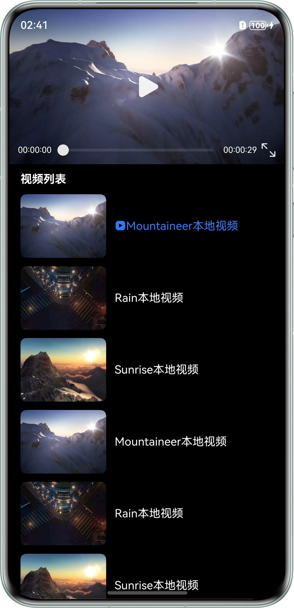
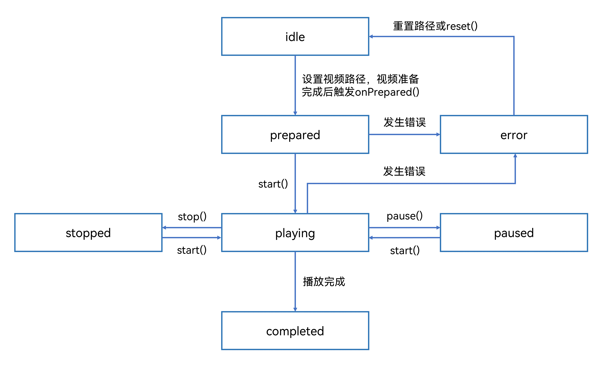

# 基于Video组件播放长视频

更新时间：2026-05-18 00:55:31

来源：https://developer.huawei.com/consumer/cn/doc/best-practices/bpta-video-component-long-video

##### 概述

Video组件可用于播放视频文件并控制其播放状态。本文针对市场上主流视频播放类应用的常见场景，介绍如何基于Video组件实现长视频播放，指导开发者实现基本播控、视频首帧显示、全屏播放、跳转播放、前台小窗播放、点击按钮选择倍速、长按视频倍速、循环播放、音量设置、接入播控中心等功能。
 
在阅读内容前，建议开发者先了解[视频播放 (Video)](https://developer.huawei.com/consumer/cn/doc/harmonyos-guides/arkts-common-components-video-player)、[Slider](https://developer.huawei.com/consumer/cn/doc/harmonyos-references/ts-basic-components-slider)、[基础手势](https://developer.huawei.com/consumer/cn/doc/harmonyos-references/basic-gestures)、[AVSession Kit](https://developer.huawei.com/consumer/cn/doc/harmonyos-guides/avsession-kit)相关知识。
 
本文主要介绍以下场景的实现：
 
- [基础播控](#section42611837143314)
- [视频首帧显示](#section144531238153517)
- [横竖屏切换和旋转感知](#section1047075173619)
- [跳转播放](#section15644530123614)
- [前台小窗播放](#section1141713610409)
- [点击按钮选择倍速](#section738062610377)
- [长按视频倍速](#section107981344143717)
- [循环播放](#section1024864191117)
- [音量设置](#section131242023153813)
- [接入播控中心](#section156851949193813)

 
 

##### 基础播控

 

##### 场景描述

通过Video组件实现视频基础播放控制能力，包括播放视频、暂停播放等操作。实现效果如下图：
 


 
 

##### 实现原理

通过Video组件的[VideoController](https://developer.huawei.com/consumer/cn/doc/harmonyos-references/ts-media-components-video#videocontroller)对象控制视频播放，VideoController在底层调用[start()](https://developer.huawei.com/consumer/cn/doc/harmonyos-references/ts-media-components-video#start)和[pause()](https://developer.huawei.com/consumer/cn/doc/harmonyos-references/ts-media-components-video#pause)等方法切换视频的播放状态。
 
Video组件的接口和状态变化关系如下图所示：
 


 
 

##### 开发步骤
1. 创建Video视频组件。
2. 加载视频资源：设置Video的src参数，配置视频的数据源。
3. 准备视频：通过[onPrepared()](https://developer.huawei.com/consumer/cn/doc/harmonyos-references/ts-media-components-video#onprepared)事件，监听视频完成加载。
4. 创建Video控制器[VideoController](https://developer.huawei.com/consumer/cn/doc/harmonyos-references/ts-media-components-video#videocontroller)。
5. 播放视频：调用VideoController的start()方法进行视频播放。
6. 暂停播放：调用VideoController的pause()方法暂停视频播放。
 
Video组件和Video控制器的基础使用请参考：[视频播放 (Video)](https://developer.huawei.com/consumer/cn/doc/harmonyos-guides/arkts-common-components-video-player)。
 
 

##### 视频首帧显示

 

##### 场景描述

长视频未播放时，显示视频资源的首帧画面或特定画面。
 


 
 

##### 实现原理

Video组件要实现视频未播放时显示预览画面，设置方式有如下两种：
 
- 方案一：通过设置previewUri显示视频未播放时的预览画面，参数说明请参考：[VideoOptions对象说明](https://developer.huawei.com/consumer/cn/doc/harmonyos-references/ts-media-components-video#videooptions对象说明)。previewUri属性设置预览画面时，在视频实际播放前，系统会优先渲染previewUri指定的图像资源，将该图像作为预览图直接渲染到Video组件显示区域，避免播放启动前的黑屏或白屏状态。
- 方案二：通过设置showFirstFrame显示视频首帧画面，参数说明请参考：[PosterOptions对象说明](https://developer.huawei.com/consumer/cn/doc/harmonyos-references/ts-media-components-video#posteroptions18对象说明)。当showFirstFrame属性设置为true时（showFirstFrame的优先级高于previewUri，此时previewUri字段不生效），系统会在初始化播放器阶段异步解码视频文件，提取时间戳为0（即首帧）的视频帧数据，作为视频首帧画面显示。

  
| 实现方案 | 优点 | 缺点 | 适用场景 |
| --- | --- | --- | --- |
| previewUri | 灵活性高，可自定义图片内容，不依赖视频首帧。通过静态图片替代视频首帧解码，减少初始化资源消耗。支持复用已有图片资源。 | 需要手动处理预览画面，代码复杂度相对较高。开发和维护的复杂性相对较高。预览图需要单独存储和加载，消耗额外存储空间。 | 适用于自定义视频封面、网络视频预加载优化或需缓存首帧图片的场景。 |
| showFirstFrame | 简单易用，通过布尔值即可控制是否显示视频首帧。无需手动处理代码逻辑。只加载显示视频第一帧，资源占用相对较低。 | 定制性弱，无法自定义首帧画面。当视频第一帧为空白或黑屏时，影响用户体验。网络视频需等待下载完成后才能解码显示首帧。 | 适合本地视频，对首帧实时性要求高，且希望简化代码逻辑的场景。 |
 
 
 

##### 开发步骤

本场景以showFirstFrame为例，设置视频视频未播放时显示视频首帧画面：
 
```ArkTS
Video({
  src: this.videoSrc,
  controller: this.videoController,
  currentProgressRate: this.curRate, // Set playback speed.
  posterOptions: {
    showFirstFrame: true,
  }
})
```
 
previewUri使用示例请参考：[视频播放基础用法](https://developer.huawei.com/consumer/cn/doc/harmonyos-references/ts-media-components-video#示例1视频播放基础用法)。
 
 

##### 横竖屏切换和旋转感知

 

##### 场景描述

播放视频时，可通过点击全屏图标按钮实现全屏播放，或通过旋转设备进行横竖屏切换。
 



 
 

##### 实现原理

- 自动旋转：在设备控制面板中取消旋转锁定，并将orientation设置为AUTO_ROTATION_RESTRICTED时，应用会跟随传感器自动旋转。
> [!NOTE]
> 须提前打开设备的控制中心，取消旋转锁定，否则自动旋转不生效。

- 手动切换：通过[setPreferredOrientation()](https://developer.huawei.com/consumer/cn/doc/harmonyos-references/arkts-apis-window-window#setpreferredorientation9)设置应用的主窗口显示方向：
USER_ROTATION_LANDSCAPE：旋转到横屏。
- USER_ROTATION_PORTRAIT：旋转到竖屏。

 
 
 

##### 开发步骤

通过传感器自动旋转：
 1. 在模块级配置文件module.json5中，设置窗口显示方向[orientation](https://developer.huawei.com/consumer/cn/doc/harmonyos-references/arkts-apis-window-e#orientation9)的字段值为AUTO_ROTATION_RESTRICTED。
```json
"orientation": "auto_rotation_restricted",
```

 
手动切换：
 1. 通过setPreferredOrientation()方法，设置主窗口的显示方向。
```ArkTS
public setMainWindowOrientation(orientation: window.Orientation) {
  if (!this.mainWindowClass) {
    return;
  }
  this.mainWindowClass.setPreferredOrientation(orientation)
    .then(() => {
      Logger.info('setPreferredOrientation succeed.');
    })
    .catch((err: BusinessError) => {
      Logger.error(TAG, `setPreferredOrientation failed. code: ${err.code}, message: ${err.message}`);
    })
}
```

2. 通过[setWindowSystemBarEnable()](https://developer.huawei.com/consumer/cn/doc/harmonyos-references/arkts-apis-window-window#setwindowsystembarenable9)方法，设置主窗口状态栏、底部导航的可见模式。
```ArkTS
// Display the status bar of the main window and the bottom navigation.
public enableWindowSystemBar(): void {
  if (!this.mainWindowClass) {
    return;
  }
  this.mainWindowClass.setWindowSystemBarEnable(['status', 'navigation'])
    .catch((err: BusinessError) => {
      Logger.error(TAG, `setWindowSystemBarEnable failed. code: ${err.code}, message: ${err.message}`);
    })
}
```
 
```ArkTS
// Disable the status bar and bottom navigation of the main window.
public disableWindowSystemBar(): void {
  if (!this.mainWindowClass) {
    return;
  }
  this.mainWindowClass.setWindowSystemBarEnable([])
    .catch((err: BusinessError) => {
      Logger.error(TAG, `setWindowSystemBarEnable failed. code: ${err.code}, message: ${err.message}`);
    })
}
```

3. 点击全屏按钮，设置window.Orientation为USER_ROTATION_LANDSCAPE，并设置状态栏和底部导航区域不可见。
```ArkTS
this.windowUtil.disableWindowSystemBar();
this.windowUtil.setMainWindowOrientation(window.Orientation.USER_ROTATION_LANDSCAPE);
```

4. 点击缩放按钮，设置window.Orientation为USER_ROTATION_PORTRAIT，并设置显示状态栏和底部导航区域。
```ArkTS
this.windowUtil.enableWindowSystemBar();
this.windowUtil.setMainWindowOrientation(window.Orientation.USER_ROTATION_PORTRAIT);
```

 
 

##### 跳转播放

 

##### 场景描述

通过点击或拖动自定义进度条，实现视频跳转至指定时间进行播放功能。
 


 
 

##### 实现原理

Video组件自带的控制栏由[controls](https://developer.huawei.com/consumer/cn/doc/harmonyos-references/ts-media-components-video#controls)属性进行控制。当controls属性设置为false时，控制栏隐藏，此时可基于[Slider](https://developer.huawei.com/consumer/cn/doc/harmonyos-references/ts-basic-components-slider)组件实现自定义播放进度条，并通过[setCurrentTime()](https://developer.huawei.com/consumer/cn/doc/harmonyos-references/ts-media-components-video#setcurrenttime8)方法，指定视频播放进度，实现跳转播放。
 
 

##### 开发步骤
1. controls属性设置为false，禁用Video控制栏。
```ArkTS
Video({
  src: this.videoSrc,
  controller: this.videoController,
  currentProgressRate: this.curRate, // Set playback speed.
  posterOptions: {
    showFirstFrame: true,
  }
})
// ...
  .controls(false)
```

2. 在Slider组件的[onChange()](https://developer.huawei.com/consumer/cn/doc/harmonyos-references/ts-basic-components-slider#onchange)事件中，调用VideoController的setCurrentTime()方法传入Slider组件进度值，并设置[SeekMode](https://developer.huawei.com/consumer/cn/doc/harmonyos-references/ts-media-components-video#seekmode8枚举说明)跳转模式为Accurate精准跳转，实现视频跳转播放。
```ArkTS
Slider({
  value: this.currentTime,
  max: this.durationTime,
  step: 1
})
  // ...
  .onChange((value) => {
    this.videoController.setCurrentTime(value, SeekMode.Accurate);
  })
```

 
 

##### 前台小窗播放

 

##### 场景描述

播放视频时，向下滑动视频列表，Video组件从页面消失后，视频以小窗口模式进行播放，同时用户可以进行其它操作，提升使用体验。
 


 
 

##### 实现原理

Video通过自定义组件实现小窗口播放视频，通过[onWillScroll()](https://developer.huawei.com/consumer/cn/doc/harmonyos-references/ts-container-scroll#onwillscroll12)计算Scroll组件在竖直方向的偏移量，当偏移量超过Video组件自身高度时，通过自定义组件实现小窗口播放视频。
 
> [!NOTE]
> Video组件不支持视频以画中画模式播放，如需使用画中画模式，请参考基于AVPlayer播放长视频实践 画中画播放 小节。

 
 

##### 开发步骤
1. 自定义SmallWindowVideo组件，用于小窗播放视频。
```ArkTS
@Component
export struct SmallWidnowVideo {
  // ...

  build() {
    Column() {
      Video({
        src: this.videoSrc,
        controller: this.videoController,
        currentProgressRate: this.curRate, // Set playback speed.
        posterOptions: {
          showFirstFrame: true,
        }
      })
        // ...
        .onPrepared((event) => {
          this.videoController.start();
          if (event) {
            this.videoController.setCurrentTime(this.currentTime, SeekMode.Accurate);
          }
        })
        .onUpdate((event) => {
          if (event) {
            this.currentTime = event.time;
          }
        })
      Image($r('app.media.video_close'))
        // ...
    }
    // ...
  }
}
```

2. 在Scroll组件的onWillScroll()事件中，计算偏移量，通过偏移量判断是否显示小窗。
```ArkTS
Scroll() {
  // ...
}
// ...
.onWillScroll((_xOffset: number, yOffset: number) => {
  this.scrollVal += yOffset;
})
```
 
```ArkTS
// Play in a small window.
if (this.scrollVal >= 240 && this.isPlaying && !this.isFullScreen) {
  SmallWidnowVideo({
    videoSrc: this.videoSrc,
    curRate: this.curRate,
    isMute: this.isMute,
    currentTime: this.currentTime,
    isPlaying: this.isPlaying,
    videoController: this.videoController,
  })
}
```

 
 

##### 点击按钮选择倍速

 

##### 场景描述

视频横屏时，通过点击按钮选择预设播放速度，实现视频倍速（1.0、1.25、1.75或2.0速度）播放。
 


 
 

##### 实现原理

Video组件支持通过[currentProgressRate](https://developer.huawei.com/consumer/cn/doc/harmonyos-references/ts-media-components-video#videooptions对象说明)参数设置视频播放倍速。同时，结合[Menu](https://developer.huawei.com/consumer/cn/doc/harmonyos-references/ts-basic-components-menu)组件预设视频播放速度，实现点击按钮后倍速播放视频。
 
 

##### 开发步骤
1. 在Menu中，预设视频播放速度，并在点击事件中修改播放倍速的值。
```ArkTS
@State curRate: PlaybackSpeed = PlaybackSpeed.Speed_Forward_1_00_X; // Playback speed.
```
 
```ArkTS
// Playback speed setting.
@Builder
SpeedMenu() {
  Menu() {
    MenuItem({ content: '2.0X' })
      .width('100%')
      .onClick(() => {
        this.playbackSpeed = '2.0X';
        this.curRate = PlaybackSpeed.Speed_Forward_2_00_X;
      })
    MenuItem({ content: '1.75X' })
      .width('100%')
      .onClick(() => {
        this.playbackSpeed = '1.75X';
        this.curRate = PlaybackSpeed.Speed_Forward_1_75_X;
      })
    MenuItem({ content: '1.25X' })
      .width('100%')
      .onClick(() => {
        this.playbackSpeed = '1.25X';
        this.curRate = PlaybackSpeed.Speed_Forward_1_25_X;
      })
    MenuItem({ content: '1.0X' })
      .width('100%')
      .onClick(() => {
        this.playbackSpeed = '1.0X';
        this.curRate = PlaybackSpeed.Speed_Forward_1_00_X;
      })
  }
  // ...
}
```

2. 为Video组件配置currentProgressRate参数，并赋值为预设的播放倍速。
```ArkTS
Video({
  src: this.videoSrc,
  controller: this.videoController,
  currentProgressRate: this.curRate, // Set playback speed.
  posterOptions: {
    showFirstFrame: true,
  }
})
```

 
 

##### 长按视频倍速

 

##### 场景描述

视频横屏时，长按屏幕可实现2倍速播放，离手后视频恢复至默认1倍速播放。
 


 
 

##### 实现原理

通过绑定长按手势事件[LongPressGesture](https://developer.huawei.com/consumer/cn/doc/harmonyos-references/ts-basic-gestures-longpressgesture)，实现长按屏幕边缘视频倍速播放。
 
 

##### 开发步骤
1. 绑定LongPressGesture长按手势事件，在[onAction()](https://developer.huawei.com/consumer/cn/doc/harmonyos-references/ts-basic-gestures-longpressgesture#onaction)方法中设置预设倍速值，在[onActionEnd()](https://developer.huawei.com/consumer/cn/doc/harmonyos-references/ts-basic-gestures-longpressgesture#onactionend)方法中，恢复初始播放速度。
```ArkTS
LongPressGesture({ repeat: true })
  .onAction(() => {
    this.playbackSpeed = '2.0X';
    this.curRate = PlaybackSpeed.Speed_Forward_2_00_X;
  })
  .onActionEnd(() => {
    this.playbackSpeed = '1.0X';
    this.curRate = PlaybackSpeed.Speed_Forward_1_00_X;
  })
```

2. 为Video组件配置currentProgressRate参数，并重新赋值。
```ArkTS
Video({
  src: this.videoSrc,
  controller: this.videoController,
  currentProgressRate: this.curRate, // Set playback speed.
  posterOptions: {
    showFirstFrame: true,
  }
})
```

 
 

##### 循环播放

 

##### 场景描述

视频播放结束后，立即重新开始播放，以实现无缝循环播放的效果。
 


 
 

##### 实现原理

Video组件的[loop](https://developer.huawei.com/consumer/cn/doc/harmonyos-references/ts-media-components-video#loop)属性支持设置单个视频循环播放，当视频播放结束时，系统自动触发onFinish()回调。在回调中，播放器通过setCurrentTime(0)重置进度到起始位置，并调用start()重新播放。此过程通过VideoController控制，无需开发者手动干预。
 
 

##### 开发步骤

将Video组件的loop属性设置为true，即可实现视频无缝循环播放。
 
```ArkTS
Video({
  src: this.videoSrc,
  controller: this.videoController,
  currentProgressRate: this.curRate, // Set playback speed.
  posterOptions: {
    showFirstFrame: true,
  }
})
// ...
  .loop(true)
```
 
 

##### 音量设置

 

##### 场景描述

滑动调节音量是视频应用中的常见交互：在播放界面左侧上下滑动，即可快速调节音量，无需中断观看，从而提升用户的观看体验。
 


 
 

##### 实现原理

系统音量面板[AVVolumePanel](https://developer.huawei.com/consumer/cn/doc/harmonyos-references/ohos-multimedia-avvolumepanel)提供了展示和调节系统音量的功能，结合[PanGesture](https://developer.huawei.com/consumer/cn/doc/harmonyos-references/ts-basic-gestures-pangesture)滑动手势事件，设置滑动方向为竖直方向，当手势移动时，上滑增加音量，下滑减少音量，实现控制系统音量功能。
 
 

##### 开发步骤
1. 创建AVVolumePanel，显示系统音量面板。
```ArkTS
AVVolumePanel({
  volumeLevel: this.volume,
  volumeParameter: {
    position: {
      x: 150,
      y: 300
    }
  }
})
```

2. 为元素绑定PanGesture滑动手势事件，根据手势滑动距离计算并设置音量值volume。
```ArkTS
// Bind the swipe gesture event.
PanGesture({ direction: PanDirection.Vertical })
  .onActionStart(() => {
  })
  .onActionUpdate((event: GestureEvent) => {
    this.visible = false;
    // Current Volume value = Volume value - Vertical offset (physical pixels) of the gesture / Screen height.
    let curVolume = this.volume - this.getUIContext().vp2px(event.offsetY) / this.screenHeight;
    // Limit the volume range between 0 and 15.
    curVolume = this.getValidValue(curVolume, CommonConstants.MIN_VOLUME, CommonConstants.MAX_VOLUME);
    if(curVolume === 0) {
      this.isMute = true;
    } else {
      this.isMute = false;
    }
    this.volume = curVolume;
  })
  .onActionEnd(() => {
    setTimeout(() => {
      this.visible = false;
    }, 1500)
  }),
```

 
 

##### 接入播控中心

 

##### 场景描述

Video组件播放视频时，可以通过控制中心，实现视频的播放、暂停、切换视频、跳转播放、点击拉起应用等功能。
 



 
 

##### 实现原理

通过AVSession Kit实现应用接入播控中心，AVSession Kit是系统提供的音视频管控服务，可用于统一管理系统中所有音视频行为，帮助开发者快速构建音视频统一展示和控制能力。
 
 

##### 开发步骤
1. 通过[createAVSession()](https://developer.huawei.com/consumer/cn/doc/harmonyos-references/arkts-apis-avsession-f#avsessioncreateavsession10)创建AVSession实例，并指定[AVSessionType](https://developer.huawei.com/consumer/cn/doc/harmonyos-references/arkts-apis-avsession-t#avsessiontype10)为video类型。创建成功后，通过[activate()](https://developer.huawei.com/consumer/cn/doc/harmonyos-references/arkts-apis-avsession-avsession#activate10)方法激活会话。
```ArkTS
public initAVSession() {
  if (!this.context) {
    return;
  }
  // Create a session object of video type.
  avSession.createAVSession(this.context, 'LONG_VIDEO_SESSION', 'video')
    .then((data: avSession.AVSession) => {
      this.avSession = data;
      this.setLaunchAbility();
      BackgroundTaskManager.startContinuousTask(this.context);
      // Activate session.
      this.avSession.activate()
        .then(() => {
          Logger.info(TAG, `AVSession activate successed`);
        })
        .catch((err: BusinessError) => {
          BackgroundTaskManager.stopContinuousTask(this.context);
          Logger.error(TAG, `AVSession activate failed. code: ${err.code}, message: ${err.message}`);
        })
    })
    .catch((err: BusinessError) => {
      Logger.error(TAG, `Create AVSession failed. code: ${err.code}, message: ${err.message}`);
    })
}
```

2. 通过[setAVMetadata()](https://developer.huawei.com/consumer/cn/doc/harmonyos-references/arkts-apis-avsession-avsession#setavmetadata10)设置会话元数据，如：媒体ID（assetId）、标题（title）、媒体时长（duration）等，从而在播控中心界面进行展示。
```ArkTS
public setAVMetadata(curSource: VideoInfo, duration: number) {
  if (!curSource) {
    return;
  }
  try {
    // Set session metadata.
    let metadata: avSession.AVMetadata = {
      assetId: `${curSource.index}`, // Media ID
      title: this.context?.resourceManager.getStringSync(curSource.name.id), // Title
      duration: duration // Media duration
    }
    if (this.avSession) {
      this.avSession.setAVMetadata(metadata)
        .catch((err: BusinessError) => {
          Logger.error(TAG, `Set AVMetadata failed. code: ${err.code}, message: ${err.message}`);
        })
    }
  } catch (error) {
    let err = error as BusinessError;
    Logger.error(TAG, `getStringSync failed. code: ${err.code}, message: ${err.message}`);
  }
}
```

3. 通过[setAVPlaybackState()](https://developer.huawei.com/consumer/cn/doc/harmonyos-references/arkts-apis-avsession-avsession#setavplaybackstate10)设置会话播放状态。
```ArkTS
// Set session playback status.
public setAVSessionPlayState(playbackState: avSession.AVPlaybackState) {
  if (!this.avSession) {
    return;
  }
  this.avSession.setAVPlaybackState(playbackState, (err: BusinessError) => {
    if (err) {
      Logger.error(TAG, `SetAVPlaybackState failed. code: ${err.code}, message: ${err.message}`);
    } else {
      Logger.info('SetAVPlaybackState successfully');
    }
  })
}
```

4. 通过[getWantAgent()](https://developer.huawei.com/consumer/cn/doc/harmonyos-references/js-apis-app-ability-wantagent#wantagentgetwantagent)创建WantAgent，并通过[setLaunchAbility()](https://developer.huawei.com/consumer/cn/doc/harmonyos-references/arkts-apis-avsession-avsession#setlaunchability10)设置用于被播控中心拉起的UIAbility。
```ArkTS
public setLaunchAbility() {
  if (!this.context) {
    return;
  }
  const wantAgentInfo: wantAgent.WantAgentInfo = {
    wants: [
      {
        bundleName: this.context.abilityInfo.bundleName,
        abilityName: this.context.abilityInfo.name
      }
    ],
    actionType: wantAgent.OperationType.START_ABILITIES, // Enable multiple Abilities with pages.
    requestCode: 0,
    actionFlags: [wantAgent.WantAgentFlags.UPDATE_PRESENT_FLAG]
  };
  // Create WantAgent
  wantAgent.getWantAgent(wantAgentInfo)
    .then((agent: WantAgent) => {
      if (this.avSession) {
        // Set up a WantAgent to initiate the Ability of the session.
        this.avSession.setLaunchAbility(agent)
          .catch((err: BusinessError) => {
            Logger.error(TAG, `SetLaunchAbility failed. code: ${err.code}, message: ${err.message}`);
          })
      }
    })
    .catch((err: BusinessError) => {
      Logger.error(TAG, `Get wantAgent failed. code: ${err.code}, message: ${err.message}`);
    })
}
```

5. 注册播控命令事件监听，以响应用户通过播控中心触发的操作，如：播放[on('play')](https://developer.huawei.com/consumer/cn/doc/harmonyos-references/arkts-apis-avsession-avsession#onplay10)、暂停[on('pause')](https://developer.huawei.com/consumer/cn/doc/harmonyos-references/arkts-apis-avsession-avsession#onpause10)、切换上一个视频[on('playPrevious')](https://developer.huawei.com/consumer/cn/doc/harmonyos-references/arkts-apis-avsession-avsession#onplayprevious10)、切换下一个视频[on('playNext')](https://developer.huawei.com/consumer/cn/doc/harmonyos-references/arkts-apis-avsession-avsession#onplaynext10)等。
```ArkTS
// Set AVSession to listen.
public async setAVSessionListener() {
  if (!this.avSessionController) {
    return;
  }
  try {
    this.avSessionController.getAVSession()?.on('play', () => this.sessionPlay());
    this.avSessionController.getAVSession()?.on('pause', () => this.sessionPause());
    this.avSessionController.getAVSession()?.on('seek', (msTime: number) => {
      this.sessionSeek(msTime);
    });
    this.avSessionController.getAVSession()?.on('setLoopMode', () => {
    });
    this.avSessionController.getAVSession()?.on('playPrevious', () => this.changePlayVideo(true));
    this.avSessionController.getAVSession()?.on('playNext', () => this.changePlayVideo(false));
  } catch (error) {
    let err = error as BusinessError;
    Logger.error(TAG, `Set AVSession listener failed. code: ${err.code}, message: ${err.message}`);
  }
}
```

6. 视频播放状态需要上报播控中心。当视频状态发生改变时，通过setAVPlaybackState()向播控中心上报视频状态，实现播控中心与应用的状态同步，包括播放状态（state）、播放位置（position）、当前媒体播放时长（duration）等。
```ArkTS
// Update AVSession playback status.
updateIsPlay() {
  this.avSessionController.setAVSessionPlayState({
    state: this.isPlaying ? avSession.PlaybackState.PLAYBACK_STATE_PLAY :
      avSession.PlaybackState.PLAYBACK_STATE_PAUSE, // Playback status.
    position: {
      elapsedTime: this.currentTime * 1000, // Elapsed time.
      updateTime: new Date().getTime() // Update time.
    },
    duration: this.durationTime * 1000, // The duration of current media resources.
    speed: this.curRate
  })
}
```

 
 

##### 示例代码

- [基于Video组件播放长视频](https://gitcode.com/HarmonyOS_Samples/video-show)
