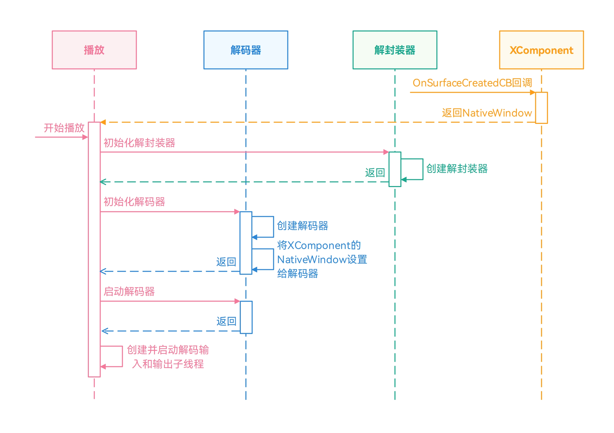
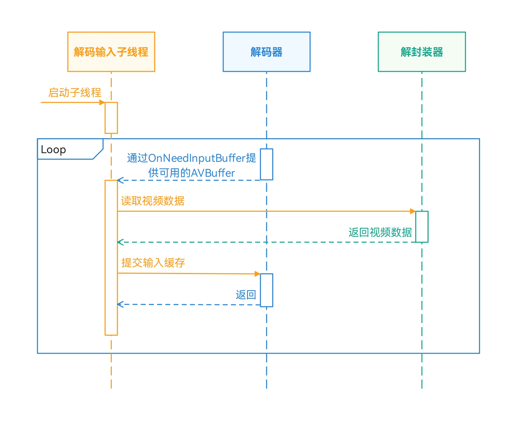
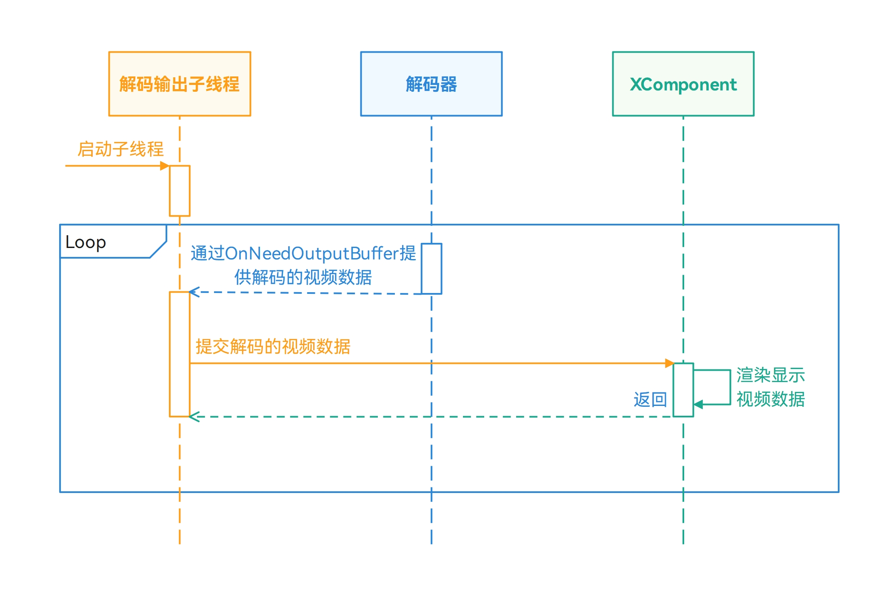
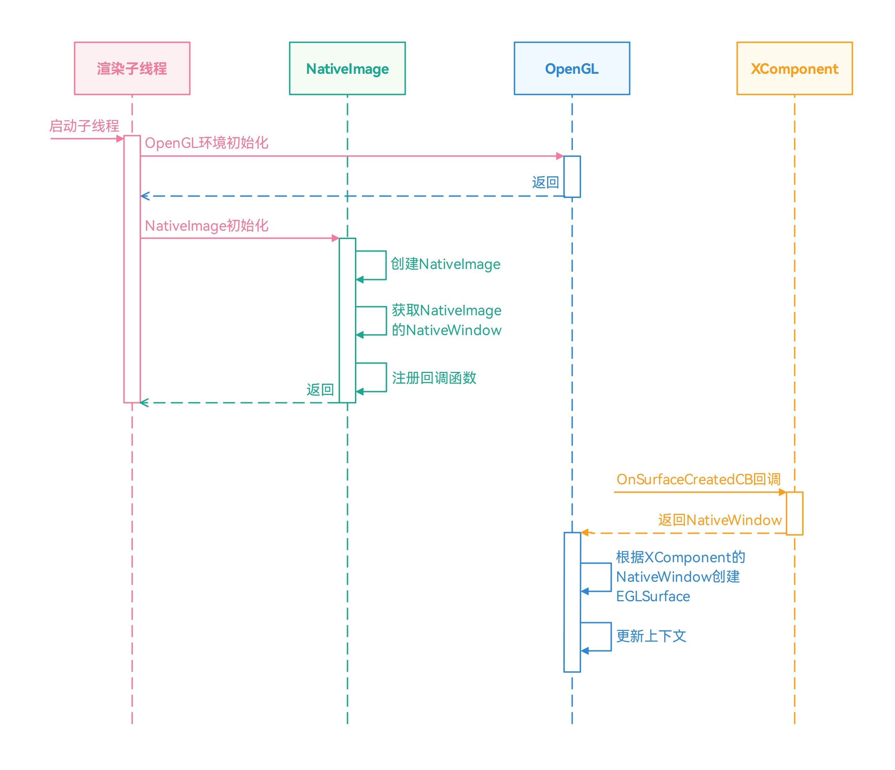
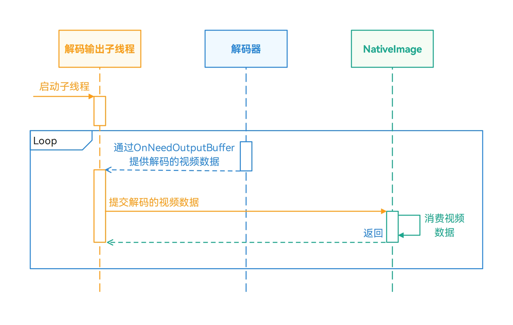
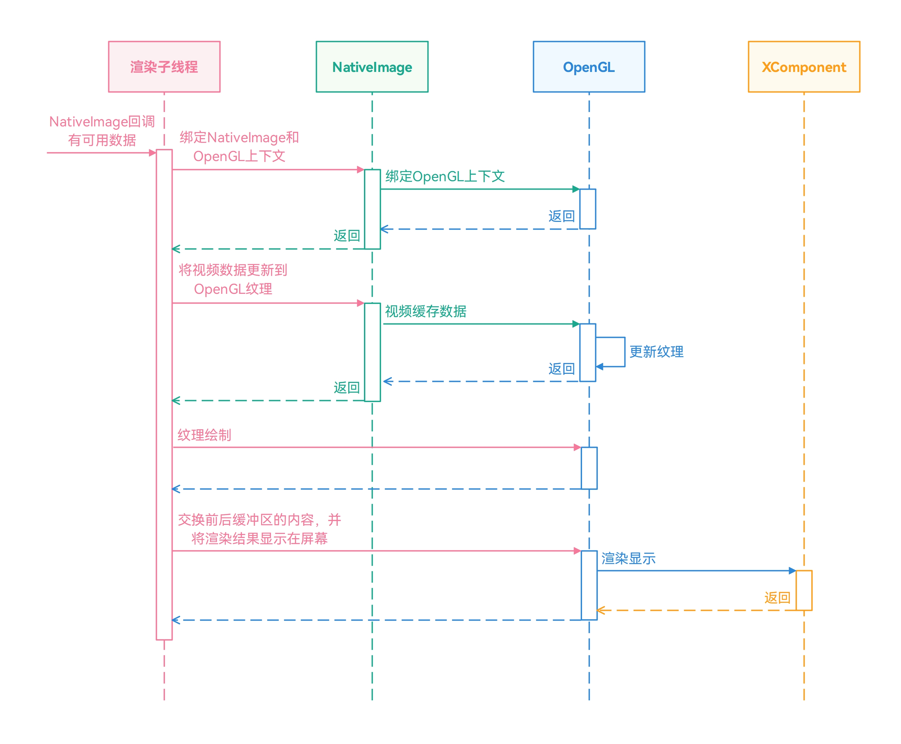
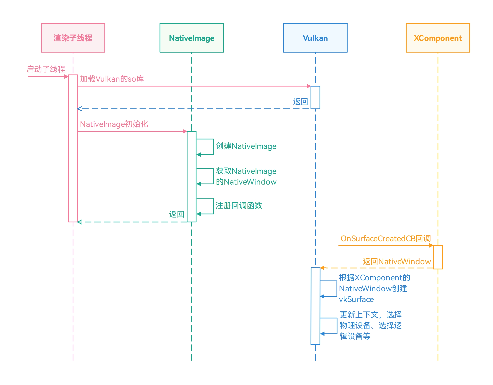
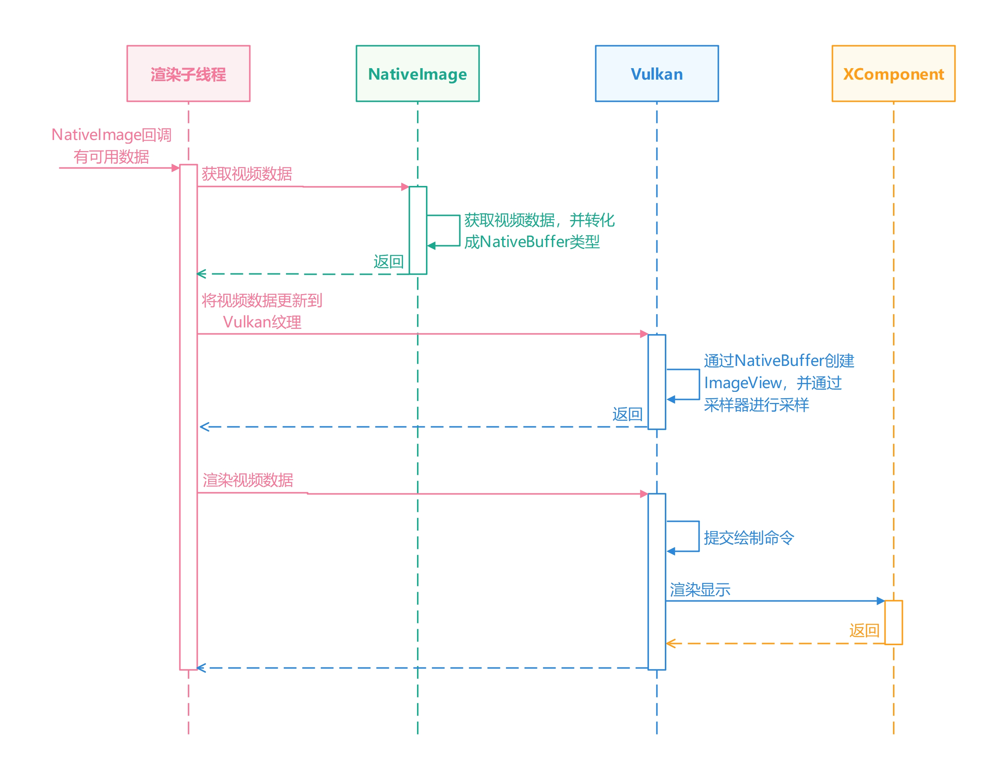

# 渲染视频画面

更新时间：2026-05-18 00:55:31

来源：https://developer.huawei.com/consumer/cn/doc/best-practices/bpta-video-render

##### 概述

渲染视频画面是将原始视频数据（如 YUV、RGB 等格式）转换为可在屏幕上显示的图像，并最终输出到显示设备（如手机屏幕）的过程。此过程是视频解码播放、视频直播、相机预览等场景中的关键环节，决定了画面视觉效果。
 
本文以视频解码播放为场景案例，介绍了视频在解码后，如何将解码的视频数据渲染送显到设备屏幕上。目前，系统中提供了多种方式渲染视频画面，包括使用XComponent渲染视频画面、使用OpenGL渲染视频画面、使用Vulkan渲染视频画面。这三个方案的优点、缺点和适用场景如下表所示。
  
|    | 优点 | 缺点 | 使用场景 |
| --- | --- | --- | --- |
| 使用XComponent渲染视频画面 | 开发门槛不高，可以通过XComponent的NativeWindow直接对接解码器。解码后的YUV视频数据，无需额外进行处理，可以直接提交给XComponent进行渲染显示。 | 定制化能力弱，无法满足复杂的开发场景。性能优化的空间不多，在较为复杂或高规格的场景中，无法干预渲染流程，导致性能不高。 | 该方案适用于简单的视频播放，不需要对视频画面做复杂的处理。 |
| 使用OpenGL渲染视频画面 | 可以满足复杂的场景，根据开发者的需求定制化开发。OpenGL是跨编程语言和跨平台的应用编程接口，便于应用的开发与迁移。开发门槛适中，生态资料丰富。 | 需要额外处理视频数据的格式，视频解码后的数据通常需要转化成RGBA的格式。 | 该方案可以满足复杂的开发场景，开发者可以根据实际需求实现，如视频直播、视频弹幕等场景。 |
| 使用Vulkan渲染视频画面 | 可细粒度控制渲染全流程，优化渲染链路以获得更高性能。可适配复杂的场景。Vulkan是跨编程语言和跨平台的应用编程接口，便于应用的开发与迁移。 | 需要额外处理视频数据的格式，视频解码后的数据通常需要转化成RGBA的格式。开发门槛较高，需要手动管理内存、命令缓冲等，且需要开发的代码量大，出现问题难定位。 | 同上。 |
 
 
 

##### 使用XComponent渲染视频画面

 

##### 场景描述

系统提供了AVPlayer、Video组件播放视频文件，其实现方式简单，但支持的文件格式有限。在播放其他格式（如rmvb格式）或有数字版权保护的视频时，AVPlayer、Video组件不能满足开发者的诉求。此时，开发者可以通过AVCodec将视频文件进行解码，然后将解码后的视频数据通过XComponent组件直接进行渲染送显即可。使用XComponent渲染视频画面是简单、常用的方式，开发者可以将解码的YUV视频数据传入给XComponent，无需关注YUV格式转化等问题。
 
 

##### 实现原理

在使用XComponent渲染视频画面的方案中，需要提前获取XComponent对应的NativeWindow对象，并在创建视频解码器时，将NativeWindow设置给视频解码器。其具体开发流程如下所示。
 1. 在XComponent创建时，通过回调函数OnSurfaceCreatedCB获取对应的NativeWindow对象。
2. 初始化视频解码的环境，包括初始化解封装器、初始化解码器。
3. 启动解码器、解码输入子线程、解码输出子线程。


4. 通过OnNeedInputBuffer获取可用的AVBuffer后，在解码输入子线程中，将解封装器读取视频数据填充到AVBuffer中，并提交给解码器进行解码。


5. 通过OnNeedOutputBuffer获取解码的视频数据后，在解码输出子线程中，将解码后的视频数据提交给输出Surface（即XComponent的NativeWindow）。


 
 

##### 开发步骤
1. 在XComponent创建时，通过回调函数OnSurfaceCreatedCB获取对应的NativeWindow对象。
```cpp
void OnSurfaceCreatedCB(OH_NativeXComponent *component, void *window)
{
    OH_LOG_Print(LOG_APP, LOG_INFO, LOG_PRINT_DOMAIN, "Callback", "OnSurfaceCreatedCB");
    if ((component == nullptr) || (window == nullptr)) {
        OH_LOG_Print(LOG_APP, LOG_ERROR, LOG_PRINT_DOMAIN, "Callback",
                     "onSurfaceCreatedCB: component or window is null");
        return;
    }
    char idStr[OH_XCOMPONENT_ID_LEN_MAX + 1] = {'\0'};
    uint64_t idSize = OH_XCOMPONENT_ID_LEN_MAX + 1;
    if (OH_NativeXComponent_GetXComponentId(component, idStr, &idSize) != OH_NATIVEXCOMPONENT_RESULT_SUCCESS) {
        OH_LOG_Print(LOG_APP, LOG_ERROR, LOG_PRINT_DOMAIN, "Callback",
                     "OnSurfaceCreatedCB:Unable to get XComponent id");
        return;
    }
    std::string id(idStr);
    auto render = PluginRender::GetInstance(id);
    uint64_t width;
    uint64_t height;
    int32_t xSize = OH_NativeXComponent_GetXComponentSize(component, window, &width, &height);
    if ((xSize != OH_NATIVEXCOMPONENT_RESULT_SUCCESS) || (render == nullptr)) {
        OH_LOG_Print(LOG_APP, LOG_ERROR, LOG_PRINT_DOMAIN, "Callback",
                     "OnSurfaceCreatedCB: Unable to qet XComponent size");
        return;
    }
    render->nativeWindow = reinterpret_cast<OHNativeWindow *>(window);
    (void)OH_NativeWindow_NativeWindowHandleOpt(render->nativeWindow, SET_BUFFER_GEOMETRY, static_cast<int>(width),
                                                    static_cast<int>(height));
    if (id == "OpenGL") {
        render->openGLRenderThread_->UpdateNativeWindow(render->nativeWindow, width, height);
    } else if(id == "Vulkan") {
        render->vulkanRenderThread_->UpdateNativeWindow(render->nativeWindow, width, height);
    }
}
```

2. 初始化视频解码的环境。
```cpp
int32_t Player::Init(SampleInfo &sampleInfo) {
    std::unique_lock<std::mutex> lock(mutex_);
    if(isStarted_ || (demuxer_ != nullptr && videoDecoder_ != nullptr)) {
        OH_LOG_ERROR(LOG_APP, "Already started.");
        return AVCODEC_SAMPLE_ERR_ERROR;
    }

    sampleInfo_ = sampleInfo;

    videoDecoder_ = std::make_unique<VideoDecoder>();
    demuxer_ = std::make_unique<Demuxer>();
    isReleased_ = false;
    int32_t ret = demuxer_->Create(sampleInfo_);
    if (ret != AVCODEC_SAMPLE_ERR_OK) {
        OH_LOG_ERROR(LOG_APP, "Create demuxer failed");
        doneCond_.notify_all();
        lock.unlock();
        StartRelease();
        return AVCODEC_SAMPLE_ERR_ERROR;
    }

    ret = CreateVideoDecoder();
    if (ret != AVCODEC_SAMPLE_ERR_OK) {
        OH_LOG_ERROR(LOG_APP, "Create video decoder failed");
        doneCond_.notify_all();
        lock.unlock();
        StartRelease();
        return AVCODEC_SAMPLE_ERR_ERROR;
    }

    OH_LOG_INFO(LOG_APP, "Succeed");
    return AVCODEC_SAMPLE_ERR_OK;
}
```
 创建解封装器。

  
```cpp
int32_t Demuxer::Create(SampleInfo &info) {
    source_ = OH_AVSource_CreateWithFD(info.inputFd, info.inputFileOffset, info.inputFileSize);
    if (source_ == nullptr) {
        OH_LOG_ERROR(LOG_APP,
                     "Create demuxer source failed, fd: %{public}d, offset: %{public}ld, file size: %{public}ld",
                     info.inputFd, info.inputFileOffset, info.inputFileSize);
        return AVCODEC_SAMPLE_ERR_ERROR;
    }
    
    demuxer_ = OH_AVDemuxer_CreateWithSource(source_);
    if (demuxer_ == nullptr) {
        OH_LOG_ERROR(LOG_APP, "Create demuxer failed");
        return AVCODEC_SAMPLE_ERR_ERROR;
    }

    auto sourceFormat = std::shared_ptr<OH_AVFormat>(OH_AVSource_GetSourceFormat(source_), OH_AVFormat_Destroy);
    if (sourceFormat == nullptr) {
        OH_LOG_ERROR(LOG_APP, "Get source format failed");
        return AVCODEC_SAMPLE_ERR_ERROR;
    }

    int32_t ret = GetTrackInfo(sourceFormat, info);
    if (ret != AVCODEC_SAMPLE_ERR_OK) {
        OH_LOG_ERROR(LOG_APP, "Get video track info, ret: %{public}d", ret);
        return AVCODEC_SAMPLE_ERR_ERROR;
    }
    
    return AVCODEC_SAMPLE_ERR_OK;
}
```
 创建视频解码器。

  
```cpp
int32_t Player::CreateVideoDecoder() {
    OH_LOG_INFO(LOG_APP, "video mime:%{public}s", sampleInfo_.videoCodecMime.c_str());
    int32_t ret = videoDecoder_->Create(sampleInfo_.videoCodecMime);
    if (ret != AVCODEC_SAMPLE_ERR_OK) {
        OH_LOG_INFO(LOG_APP, "Create video decoder failed, mime:%{public}s", sampleInfo_.videoCodecMime.c_str());
    } else {
        videoDecContext_ = new CodecUserData;
        ret = videoDecoder_->Config(sampleInfo_, videoDecContext_);
        if(!(ret == AVCODEC_SAMPLE_ERR_OK)) {
            OH_LOG_ERROR(LOG_APP, "Video Decoder config failed");
            return ret;
        }
    }
    return AVCODEC_SAMPLE_ERR_OK;
}
```
 设置视频解码器的Surface。

  
```cpp
int32_t VideoDecoder::Config(const SampleInfo &sampleInfo, CodecUserData *codecUserData) {
    if (decoder_ == nullptr) {
        OH_LOG_ERROR(LOG_APP, "Decoder is null");
        return AVCODEC_SAMPLE_ERR_ERROR;
    }

    if (codecUserData == nullptr) {
        OH_LOG_ERROR(LOG_APP, "Invalid param: codecUserData");
        return AVCODEC_SAMPLE_ERR_ERROR;
    }
    
    int32_t ret = Configure(sampleInfo);
    if (ret != AVCODEC_SAMPLE_ERR_OK) {
        OH_LOG_ERROR(LOG_APP, "Configure failed");
        return AVCODEC_SAMPLE_ERR_ERROR;
    }

    if (sampleInfo.window != nullptr) {
        int ret = OH_VideoDecoder_SetSurface(decoder_, sampleInfo.window);
        if (ret != AV_ERR_OK) {
            OH_LOG_ERROR(LOG_APP, "Set surface failed, ret: %{public}d", ret);
            return AVCODEC_SAMPLE_ERR_ERROR;
        }
    }
    
    ret = SetCallback(codecUserData);
    if (ret != AVCODEC_SAMPLE_ERR_OK) {
        OH_LOG_ERROR(LOG_APP, "Set callback failed, ret: %{public}d", ret);
        return AVCODEC_SAMPLE_ERR_ERROR;
    }
    
    ret = OH_VideoDecoder_Prepare(decoder_);
    if (ret != AV_ERR_OK) {
        OH_LOG_ERROR(LOG_APP, "Prepare failed, ret: %{public}d", ret);
        return AVCODEC_SAMPLE_ERR_ERROR;
    }

    return AVCODEC_SAMPLE_ERR_OK;
}
```

3. 启动解码器、解码输入子线程、解码输出子线程。
```cpp
int32_t Player::Start() {
    std::unique_lock<std::mutex> lock(mutex_);
    int32_t ret;
    if (isStarted_ || demuxer_ == nullptr) {
        OH_LOG_ERROR(LOG_APP, "Already started.");
        return AVCODEC_SAMPLE_ERR_ERROR;
    }
    
    if (videoDecContext_) {
        ret = videoDecoder_->Start();
        if (ret != AVCODEC_SAMPLE_ERR_OK) {
            OH_LOG_ERROR(LOG_APP, "Video Decoder start failed");
            lock.unlock();
            StartRelease();
            return AVCODEC_SAMPLE_ERR_ERROR;
        }
        isStarted_ = true;
        videoDecInputThread_ = std::make_unique<std::thread>(&Player::VideoDecInputThread, this);
        videoDecOutputThread_ = std::make_unique<std::thread>(&Player::VideoDecOutputThread, this);

        if (videoDecInputThread_ == nullptr || videoDecOutputThread_ == nullptr) {
            OH_LOG_ERROR(LOG_APP, "Create thread failed");
            lock.unlock();
            StartRelease();
            return AVCODEC_SAMPLE_ERR_ERROR;
        }
    }

    OH_LOG_INFO(LOG_APP, "Succeed");
    doneCond_.notify_all();
    return AVCODEC_SAMPLE_ERR_OK;
}
```

4. 通过OnNeedInputBuffer获取可用的AVBuffer，将AVBuffer放到队列中，便于后续处理。
```cpp
void SampleCallback::OnNeedInputBuffer(OH_AVCodec *codec, uint32_t index, OH_AVBuffer *buffer, void *userData) {
    if (userData == nullptr) {
        return;
    }
    (void)codec;
    CodecUserData *codecUserData = static_cast<CodecUserData *>(userData);
    std::unique_lock<std::mutex> lock(codecUserData->inputMutex);
    codecUserData->inputBufferInfoQueue.emplace(index, buffer);
    codecUserData->inputCond.notify_all();
}
```
 在解码输入子线程中，将解封装器读取视频数据填充到AVBuffer中，并提交给解码器进行解码。

  
```cpp
void Player::VideoDecInputThread() {
    while (true) {
        if (!isStarted_) {
            OH_LOG_ERROR(LOG_APP, "Decoder input thread out");
            break;;
        }
        
        std::unique_lock<std::mutex> lock(videoDecContext_->inputMutex);
        bool condRet = videoDecContext_->inputCond.wait_for(
            lock, 5s, [this]() { return !isStarted_ || !videoDecContext_->inputBufferInfoQueue.empty(); });
        if (!isStarted_) {
            OH_LOG_ERROR(LOG_APP, "Work done, thread out");
            break;
        }
        if (videoDecContext_->inputBufferInfoQueue.empty()) {
            OH_LOG_ERROR(LOG_APP, "Buffer queue is empty, continue, cond ret: %{public}d", condRet);
            continue;
        }

        CodecBufferInfo bufferInfo = videoDecContext_->inputBufferInfoQueue.front();
        videoDecContext_->inputBufferInfoQueue.pop();
        videoDecContext_->inputFrameCount++;
        lock.unlock();

        demuxer_->ReadSample(demuxer_->GetVideoTrackId(), reinterpret_cast<OH_AVBuffer *>(bufferInfo.buffer),
                             bufferInfo.attr);

        int32_t ret = videoDecoder_->PushInputBuffer(bufferInfo);
        if (ret != AVCODEC_SAMPLE_ERR_OK) {
            OH_LOG_ERROR(LOG_APP, "Push data failed, thread out");
            break;
        }

        if (bufferInfo.attr.flags & AVCODEC_BUFFER_FLAGS_EOS) {
            OH_LOG_ERROR(LOG_APP, "Catch EOS, thread out");
            break;
        }
    }
}
```

5. 在解码输出子线程中，将解码后的视频数据提交给输出Surface。通过OnNeedOutputBuffer获取解码的视频数据。
```cpp
void SampleCallback::OnNewOutputBuffer(OH_AVCodec *codec, uint32_t index, OH_AVBuffer *buffer, void *userData) {
    if (userData == nullptr) {
        return;
    }
    (void)codec;
    CodecUserData *codecUserData = static_cast<CodecUserData *>(userData);
    std::unique_lock<std::mutex> lock(codecUserData->outputMutex);
    codecUserData->outputBufferInfoQueue.emplace(index, buffer);
    codecUserData->outputCond.notify_all();
}
```
 在解码输出子线程中，将解码后的视频数据提交给输出Surface。Surface在已在解码器初始化配置，设置的是XComponent的NativeWindow对象。

  
```cpp
void Player::VideoDecOutputThread() {
    sampleInfo_.frameInterval = MICROSECOND / sampleInfo_.frameRate;
    while (true) {
        thread_local auto lastPushTime = std::chrono::system_clock::now();
        if (!isStarted_) {
            OH_LOG_ERROR(LOG_APP, "Decoder output thread out");
            break;
        }
        std::unique_lock<std::mutex> lock(videoDecContext_->outputMutex);
        bool condRet = videoDecContext_->outputCond.wait_for(
            lock, 5s, [this]() { return !isStarted_ || !videoDecContext_->outputBufferInfoQueue.empty(); });
        if (!isStarted_) {
            OH_LOG_ERROR(LOG_APP, "Decoder output thread out");
            break;
        }
        if (videoDecContext_->outputBufferInfoQueue.empty()) {
            OH_LOG_ERROR(LOG_APP, "Buffer queue is empty, continue, cond ret: %{public}d", condRet);
            continue;
        }

        CodecBufferInfo bufferInfo = videoDecContext_->outputBufferInfoQueue.front();
        videoDecContext_->outputBufferInfoQueue.pop();
        if (bufferInfo.attr.flags & AVCODEC_BUFFER_FLAGS_EOS) {
            OH_LOG_ERROR(LOG_APP, "Catch EOS, thread out");
            break;
        }
        videoDecContext_->outputFrameCount++;
        OH_LOG_INFO(LOG_APP,"Out buffer count: %{public}u, size: %{public}d, flag: %{public}u, pts: %{public}ld",
                            videoDecContext_->outputFrameCount, bufferInfo.attr.size, bufferInfo.attr.flags,
                            bufferInfo.attr.pts);
        lock.unlock();

        int32_t ret = videoDecoder_->FreeOutputBuffer(bufferInfo.bufferIndex, true);
        if (ret != AVCODEC_SAMPLE_ERR_OK) {
            OH_LOG_ERROR(LOG_APP, "Decoder output thread out");
            break;
        }

        std::this_thread::sleep_until(lastPushTime + std::chrono::microseconds(sampleInfo_.frameInterval));
        lastPushTime = std::chrono::system_clock::now();
    }
    StartRelease();
}
```
 通过OH_VideoDecoder_RenderOutputBuffer通知解码器将视频数据提交给输出Surface。

  
```cpp
int32_t VideoDecoder::FreeOutputBuffer(uint32_t bufferIndex, bool render) {
    if (decoder_ == nullptr) {
        OH_LOG_ERROR(LOG_APP, "Decoder is null");
        return AVCODEC_SAMPLE_ERR_ERROR;
    }

    int32_t ret = AVCODEC_SAMPLE_ERR_OK;
    if (render) {
        ret = OH_VideoDecoder_RenderOutputBuffer(decoder_, bufferIndex);
    } else {
        ret = OH_VideoDecoder_FreeOutputBuffer(decoder_, bufferIndex);
    }
    if (ret != AV_ERR_OK) {
        OH_LOG_ERROR(LOG_APP, "Free output data failed");
        return AVCODEC_SAMPLE_ERR_ERROR;
    }
    return AVCODEC_SAMPLE_ERR_OK;
}
```

 
 

##### 使用OpenGL渲染视频画面

 

##### 场景描述

OpenGL(Open Graphics Library)是一种跨语言、跨平台的应用程序编程接口（API），用于渲染2D和3D矢量图形。使用XComponent渲染视频画面的实现方案简单，支持的视频格式多，但对视频画面处理不够灵活，例如视频放大、旋转等操作。通过OpenGL，开发者可以根据需求定制实现各种图像处理功能，如视频旋转、视频弹幕等。
 
 

##### 实现原理

在使用OpenGL渲染视频画面中，需要使用NativeImage对接解码器和OpenGL。开发者需要通过OH_NativeImage_AcquireNativeWindow()获取NativeImage的NativeWindow对象，并将NativeImage的NativeWindow对象设置给解码器，以消费解码器生成的视频图像数据。然后，通过OH_NativeImage_UpdateSurfaceImage()将NativeImage获取到的视频图像缓存更新到Opengl相关的纹理中。最后，通过eglSwapBuffers将渲染的缓存提交给XComponent的NativeWindow对象。
 
其具体实现如下所示。
 1. 启动渲染子线程，初始化OpenGL环境，包括获取显示设备、初始化EGL环境、创建OpenGL上下文等。
2. 创建NativeImage对象，并根据NativeImage获取NativeWindow对象。
3. 获取XComponent的NativeWindow对象，并根据XComponent的NativeWindow对象创建EGLSurface。


4. 初始化视频解码的环境，包括初始化解封装器、初始化配置解码器。
> [!NOTE]
> 在初始化配置解码器时，与直接使用XComponent渲染的方案不同，解码器设置Surface的入参是NativeImage的NativeWindow对象，而不是XComponent的NativeWindow对象。

5. 启动解码器、解码输入子线程、解码输出子线程。


6. 通过OnNeedInputBuffer获取可用的AVBuffer后，在解码输入子线程中，将解封装器读取视频数据填充到AVBuffer中，并提交给解码器进行解码。
7. 通过OnNeedOutputBuffer获取解码的视频数据后，在解码输出子线程中，将解码后的视频数据提交给输出Surface（当前Surface为NativeImage的NativeWindow对象）。


8. 通过NativeImage，将视频图像缓存更新至OpenGL的纹理上。
9. 通过eglSwapBuffers交换前后缓冲区的内容，并将渲染结果显示在屏幕。


 
 

##### 开发步骤
1. 启动渲染子线程，初始化OpenGL环境。
```cpp
void OpenGLRenderThread::ThreadMainLoop()
{
    threadId_ = std::this_thread::get_id();
    if (!InitRenderContext()) {
        return;
    }
    if (!InitNativeVsync()) {
        return;
    }
    if (!CreateNativeImage()) {
        return;
    }
    while (running_) {
        {
            std::unique_lock<std::mutex> lock(wakeUpMutex_);
            wakeUpCond_.wait(lock, [this]() { return wakeUp_ || vSyncCnt_ > 0 || availableFrameCnt_ > 0; });
            wakeUp_ = false;
            vSyncCnt_--;
            (void)OH_NativeVSync_RequestFrame(nativeVsync_, &OpenGLRenderThread::OnVsync, this);
        }
        
        std::vector<RenderTask> tasks;
        {
            std::unique_lock<std::mutex> lock(taskMutex_);
            tasks.swap(tasks_);
        }
        for (const auto &task : tasks) {
            task(*renderContext_);
        }

        if (availableFrameCnt_ <= 0) {
            continue;
        }
        DrawImage();
        availableFrameCnt_--;
    }
}
```
 初始化OpenGL环境，包括获取Display、EGL初始化、EGL上下文的创建等。

  
```cpp
bool OpenGLRender::Init()
{
    if (IsEglContextReady()) {
        return true;
    }

    OH_LOG_Print(LOG_APP, LOG_DEBUG, LOG_PRINT_DOMAIN, "EglRenderContext", "EglRenderContext::Init begin.");
    eglDisplay_ = GetPlatformEglDisplay(EGL_PLATFORM_OHOS_KHR, EGL_DEFAULT_DISPLAY, NULL);
    if (eglDisplay_ == EGL_NO_DISPLAY) {
        OH_LOG_Print(LOG_APP, LOG_ERROR, LOG_PRINT_DOMAIN, "EglRenderContext",
                     "EglRenderContext::Init: failed to create eglDisplay, error: %{public}s.", GetEglErrorString());
        return false;
    }

    EGLint major;
    EGLint minor;
    if (eglInitialize(eglDisplay_, &major, &minor) == EGL_FALSE) {
        OH_LOG_Print(LOG_APP, LOG_ERROR, LOG_PRINT_DOMAIN, "EglRenderContext",
                     "EglRenderContext::Init: Failed to initialize EGLDisplay, error: %{public}s.",
                     GetEglErrorString());
    }
    SetupEglExtensions();

    if (eglBindAPI(EGL_OPENGL_ES_API) == EGL_FALSE) {
        OH_LOG_Print(LOG_APP, LOG_ERROR, LOG_PRINT_DOMAIN, "EglRenderContext",
                     "EglRenderContext::Init: Failed to bind OpenGL ES API, error: %{public}s.", GetEglErrorString());
        return false;
    }
    EGLint count;
    EGLint configAttribs[] = { EGL_SURFACE_TYPE,
                               EGL_WINDOW_BIT,
                               EGL_RED_SIZE,
                               8,
                               EGL_GREEN_SIZE,
                               8,
                               EGL_BLUE_SIZE,
                               8,
                               EGL_ALPHA_SIZE,
                               8,
                               EGL_RENDERABLE_TYPE,
                               EGL_OPENGL_ES3_BIT,
                               EGL_NONE };
    if (eglChooseConfig(eglDisplay_, configAttribs, &config_, 1, &count) == EGL_FALSE) {
        OH_LOG_Print(LOG_APP, LOG_ERROR, LOG_PRINT_DOMAIN, "EglRenderContext",
                     "EglRenderContext::Init: Failed to bind choose config, error: %{public}s.", GetEglErrorString());
        return false;
    }
    const EGLint contextAttribs[] = { EGL_CONTEXT_CLIENT_VERSION, 2, EGL_NONE };
    eglContext_ = eglCreateContext(eglDisplay_, config_, EGL_NO_CONTEXT, contextAttribs);
    if (eglContext_ == EGL_NO_CONTEXT) {
        OH_LOG_Print(LOG_APP, LOG_ERROR, LOG_PRINT_DOMAIN, "EglRenderContext",
                     "EglRenderContext::Init: Failed to bind create context, error: %{public}s.", GetEglErrorString());
        return false;
    }

    OH_LOG_Print(LOG_APP, LOG_DEBUG, LOG_PRINT_DOMAIN, "EglRenderContext", "EglRenderContext::Init end.");
    return true;
}
```

2. 创建NativeImage对象，然后根据OH_NativeImage_AcquireNativeWindow()获取NativeWindow对象，并注册NativeImage的回调方法。
```cpp
bool OpenGLRenderThread::CreateNativeImage()
{
    nativeImage_ = OH_NativeImage_Create(-1, GL_TEXTURE_EXTERNAL_OES);
    if (nativeImage_ == nullptr) {
        OH_LOG_Print(LOG_APP, LOG_ERROR, LOG_PRINT_DOMAIN, "OpenGLRenderThread", "OH_NativeImage_Create failed.");
        return false;
    }
    int ret = 0;
    {
        std::lock_guard<std::mutex> lock(nativeImageSurfaceIdMutex_);
        nativeImageWindow_ = OH_NativeImage_AcquireNativeWindow(nativeImage_);
        ret = OH_NativeImage_GetSurfaceId(nativeImage_, &nativeImageSurfaceId_);
    }
    if (ret != 0) {
        OH_LOG_Print(LOG_APP, LOG_ERROR, LOG_PRINT_DOMAIN, "OpenGLRenderThread",
                     "OH_NativeImage_GetSurfaceId failed, ret is %{public}d.", ret);
        return false;
    }

    nativeImageFrameAvailableListener_.context = this;
    nativeImageFrameAvailableListener_.onFrameAvailable = &OpenGLRenderThread::OnNativeImageFrameAvailable;
    ret = OH_NativeImage_SetOnFrameAvailableListener(nativeImage_, nativeImageFrameAvailableListener_);
    if (ret != 0) {
        OH_LOG_Print(LOG_APP, LOG_ERROR, LOG_PRINT_DOMAIN, "OpenGLRenderThread",
                     "OH_NativeImage_SetOnFrameAvailableListener failed, ret is %{public}d.", ret);
        return false;
    }

    return true;
}
```

3. 在XComponent的回调函数OnSurfaceCreatedCB中，获取XComponent的NativeWindow对象。
```cpp
void OnSurfaceCreatedCB(OH_NativeXComponent *component, void *window)
{
    OH_LOG_Print(LOG_APP, LOG_INFO, LOG_PRINT_DOMAIN, "Callback", "OnSurfaceCreatedCB");
    if ((component == nullptr) || (window == nullptr)) {
        OH_LOG_Print(LOG_APP, LOG_ERROR, LOG_PRINT_DOMAIN, "Callback",
                     "onSurfaceCreatedCB: component or window is null");
        return;
    }
    char idStr[OH_XCOMPONENT_ID_LEN_MAX + 1] = {'\0'};
    uint64_t idSize = OH_XCOMPONENT_ID_LEN_MAX + 1;
    if (OH_NativeXComponent_GetXComponentId(component, idStr, &idSize) != OH_NATIVEXCOMPONENT_RESULT_SUCCESS) {
        OH_LOG_Print(LOG_APP, LOG_ERROR, LOG_PRINT_DOMAIN, "Callback",
                     "OnSurfaceCreatedCB:Unable to get XComponent id");
        return;
    }
    std::string id(idStr);
    auto render = PluginRender::GetInstance(id);
    uint64_t width;
    uint64_t height;
    int32_t xSize = OH_NativeXComponent_GetXComponentSize(component, window, &width, &height);
    if ((xSize != OH_NATIVEXCOMPONENT_RESULT_SUCCESS) || (render == nullptr)) {
        OH_LOG_Print(LOG_APP, LOG_ERROR, LOG_PRINT_DOMAIN, "Callback",
                     "OnSurfaceCreatedCB: Unable to qet XComponent size");
        return;
    }
    render->nativeWindow = reinterpret_cast<OHNativeWindow *>(window);
    (void)OH_NativeWindow_NativeWindowHandleOpt(render->nativeWindow, SET_BUFFER_GEOMETRY, static_cast<int>(width),
                                                    static_cast<int>(height));
    if (id == "OpenGL") {
        render->openGLRenderThread_->UpdateNativeWindow(render->nativeWindow, width, height);
    } else if(id == "Vulkan") {
        render->vulkanRenderThread_->UpdateNativeWindow(render->nativeWindow, width, height);
    }
}
```
 根据XComponent的NativeWindow对象，调用eglCreateWindowSurface()创建EGLSurface对象。

  
```cpp
void OpenGLRenderThread::UpdateNativeWindow(void *window, uint64_t width, uint64_t height)
{
    OH_LOG_Print(LOG_APP, LOG_DEBUG, LOG_PRINT_DOMAIN, "OpenGLRenderThread", "UpdateNativeWindow.");
    auto nativeWindow = reinterpret_cast<OHNativeWindow *>(window);
    PostTask([this, nativeWindow, width, height](OpenGLRender &renderContext) {
        if (nativeWindow_ != nativeWindow) {
            if (nativeWindow_ != nullptr) {
                (void)OH_NativeWindow_NativeObjectUnreference(nativeWindow_);
            }
            nativeWindow_ = nativeWindow;
            if (nativeWindow_ != nullptr) {
                (void)OH_NativeWindow_NativeObjectReference(nativeWindow_);
            }

            if (eglSurface_ != EGL_NO_SURFACE) {
                renderContext_->DestroyEglSurface(eglSurface_);
                eglSurface_ = EGL_NO_SURFACE;
                CleanGLResources();
            }
        }
        if (nativeWindow_ != nullptr) {
            (void)OH_NativeWindow_NativeWindowHandleOpt(nativeWindow_, SET_BUFFER_GEOMETRY, static_cast<int>(width),
                                                        static_cast<int>(height));
            if (eglSurface_ == EGL_NO_SURFACE) {
                eglSurface_ = renderContext_->CreateEglSurface(static_cast<EGLNativeWindowType>(nativeWindow_));
            }
            if (eglSurface_ == EGL_NO_SURFACE) {
                OH_LOG_Print(LOG_APP, LOG_ERROR, LOG_PRINT_DOMAIN, "OpenGLRenderThread", "xfl CreateEglSurface failed.");
                return;
            }
            renderContext_->MakeCurrent(eglSurface_);
            CreateGLResources();
        }
    });
}
```

4. 初始化视频解码的环境，包括初始化解封装器、初始化解码器。注意，解码器设置的是NativeImage的NativeWindow对象。
```cpp
napi_value PluginRender::StartPlayer(napi_env env, napi_callback_info info)
{
    SampleInfo sampleInfo;
    size_t argc = 4;
    napi_value args[4] = {nullptr};
    napi_get_cb_info(env, info, &argc, args, nullptr, nullptr);
    napi_get_value_int32(env, args[0], &sampleInfo.inputFd);
    napi_get_value_int64(env, args[1], &sampleInfo.inputFileOffset);
    napi_get_value_int64(env, args[2], &sampleInfo.inputFileSize);
    size_t length = 0;
    napi_status status = napi_get_value_string_utf8(env, args[3], nullptr, 0, &length);
    char* buf = new char[length + 1];
    std::memset(buf, 0, length + 1);
    status = napi_get_value_string_utf8(env, args[3], buf, length + 1, &length);
    std::string type = buf;
    PluginRender *render = PluginRender::GetInstance(type);
    if (render != nullptr) {
        if (type == "OpenGL") {
            sampleInfo.window = render->openGLRenderThread_->GetNativeImageWindow();
        } else if (type == "Vulkan") {
            sampleInfo.window = render->vulkanRenderThread_->GetNativeImageWindow();
        } else {
            sampleInfo.window = render->nativeWindow;
        }
    }
    int32_t ret = Player::GetInstance().Init(sampleInfo);
    if (ret != AVCODEC_SAMPLE_ERR_OK) {
        return nullptr;
    }
    Player::GetInstance().Start();
    return nullptr;
}
```

5. 启动解码器、解码输入子线程、解码输出子线程。（代码与使用XComponent渲染一致）
6. 通过OnNeedInputBuffer获取可用的AVBuffer后，在解码输入子线程中，将解封装器读取视频数据填充到AVBuffer中，并提交给解码器进行解码。（代码与使用XComponent渲染一致）
7. 通过OnNeedOutputBuffer获取解码的视频数据后，在解码输出子线程中，将解码后的视频数据提交给输出Surface。（代码与使用XComponent渲染一致）
8. 通过OH_NativeImage_AttachContext()绑定上下文，再通过OH_NativeImage_UpdateSurfaceImage()将视频图像缓存更新至OpenGL的纹理上。
```cpp
void OpenGLRenderThread::DrawImage()
{
    if (nativeImageTexId_ == 9999) {
        glGenTextures(1, &nativeImageTexId_);
        glBindTexture(GL_TEXTURE_EXTERNAL_OES, nativeImageTexId_);
        // set the texture wrapping parameters
        glTexParameteri(GL_TEXTURE_EXTERNAL_OES, GL_TEXTURE_WRAP_S, GL_REPEAT);
        glTexParameteri(GL_TEXTURE_EXTERNAL_OES, GL_TEXTURE_WRAP_T, GL_REPEAT);
        // set texture filtering parameters
        glTexParameteri(GL_TEXTURE_EXTERNAL_OES, GL_TEXTURE_MIN_FILTER, GL_LINEAR);
        glTexParameteri(GL_TEXTURE_EXTERNAL_OES, GL_TEXTURE_MAG_FILTER, GL_LINEAR);
    }
    OH_LOG_Print(LOG_APP, LOG_DEBUG, LOG_PRINT_DOMAIN, "OpenGLRenderThread", "DrawImage.");

    if (eglSurface_ == EGL_NO_SURFACE) {
        OH_LOG_Print(LOG_APP, LOG_WARN, LOG_PRINT_DOMAIN, "OpenGLRenderThread", "eglSurface_ is EGL_NO_SURFACE");
        return;
    }

    OH_NativeImage_AttachContext(nativeImage_, nativeImageTexId_);

    int32_t ret = OH_NativeImage_UpdateSurfaceImage(nativeImage_);
    if (ret != 0) {
        OH_LOG_Print(LOG_APP, LOG_ERROR, LOG_PRINT_DOMAIN, "OpenGLRenderThread",
                     "OH_NativeImage_UpdateSurfaceImage failed, ret: %{public}d, texId: %{public}d", ret,
                     nativeImageTexId_);
        return;
    }
    OH_LOG_Print(LOG_APP, LOG_DEBUG, LOG_PRINT_DOMAIN, "OpenGLRenderThread", "OH_NativeImage_UpdateSurfaceImage succeed.");

    ret = OH_NativeImage_GetTransformMatrix(nativeImage_, matrix_);
    if (ret != 0) {
        OH_LOG_Print(LOG_APP, LOG_ERROR, LOG_PRINT_DOMAIN, "OpenGLRenderThread",
                     "OH_NativeImage_GetTransformMatrix failed, ret: %{public}d", ret);
        return;
    }

    int32_t transformTmp = 2;
    ComputeTransformByMatrix(transformTmp, matrix_);

    DrawVideoImage();
}
```

9. 通过eglSwapBuffers将渲染的缓存提交给XComponent的NativeWindow对象进行显示。
```cpp
void OpenGLRender::SwapBuffers(EGLSurface surface) const
{
    EGLBoolean ret = eglSwapBuffers(eglDisplay_, surface);
    if (ret == EGL_FALSE) {
        EGLint surfaceId = -1;
        eglQuerySurface(eglDisplay_, surface, EGL_CONFIG_ID, &surfaceId);
        OH_LOG_Print(
            LOG_APP, LOG_ERROR, LOG_PRINT_DOMAIN, "EglRenderContext",
            "EglRenderContext::SwapBuffers: Failed to SwapBuffers on EGLSurface %{public}d, error is %{public}s.",
            surfaceId, GetEglErrorString());
    }
}
```

 
 

##### 使用Vulkan渲染视频画面

 

##### 场景描述

Vulkan是一套用来做2D和3D渲染的图形应用程序接口，能够跨平台高效访问GPU。Vulkan提供了更细粒度的硬件控制，允许开发者更精细地管理资源和状态，从而提高性能和效率。相比之下，OpenGL的一些细节对开发者是隐藏的，在部分情况下会限制性能。在实际开发实现中，Vulkan的门槛远高于OpenGL，需要手动管理内存、渲染流程等。如果开发者对性能较高，且熟悉Vulkan，可以使用Vulkan渲染视频画面。
 
 

##### 实现原理

NativeImage是提供Surface关联OpenGL外部纹理的模块，表示图形队列的消费者端，有两种方式消费处理数据。第一种是将数据和OpenGL纹理对接，需在OpenGL环境下使用，此方式在使用OpenGL渲染视频画面中介绍过。另一种是开发者自行获取Buffer进行渲染处理，使用Vulkan渲染视频画面采用的是第二种方式。
 
在将NativeImage的NativeWindow对象设置给解码器后，NativeImage成为了视频解码器的数据消费者。开发者可以使用OH_NativeImage_AcquireNativeWindowBuffer()从NativeImage获取NativeWindowBuffer对象，消费使用OHNativeWindowBuffer对象中的视频数据。然后，通过OH_NativeBuffer_FromNativeWindowBuffer()方法，将OHNativeWindowBuffer对象转化成NativeBuffer。最后，将NativeBuffer提交给Vulkan，Vulkan根据NativeBuffer创建ImageView对象用于后续的渲染。同时，需要注意的是，解码器解码后的图像格式通常是YUV的格式，开发者需要对数据格式进行转化，才能正常渲染显示。
 
其具体实现如下所示。
 1. 启动渲染子线程，加载Vulkan的动态链接库。
2. 创建NativeImage对象，并根据NativeImage获取NativeWindow对象。
3. 获取XComponent的NativeWindow对象，并根据XComponent的NativeWindow对象创建Vulkan的Surface用于显示。


4. 初始化视频解码的环境，包括初始化解封装器、初始化解码器。
> [!NOTE]
> 在初始化配置解码器时，与直接使用XComponent渲染的方案不同，解码器设置Surface的入参是NativeImage的NativeWindow对象，而不是XComponent的NativeWindow对象。

5. 启动解码器、解码输入子线程、解码输出子线程。
6. 在解码输入子线程中，通过解封装器读取视频数据，并提交给解码器。
7. 通过OnNeedOutputBuffer获取解码的视频数据后，在解码输出子线程中，将解码后的视频数据提交给输出Surface（当前Surface为NativeImage的NativeWindow对象）。
8. 在NativeImage的回调onFrameAvailable()有可用数据后，通过OH_NativeImage_AcquireNativeWindowBuffer()获取视频数据，并通过OH_NativeBuffer_FromNativeWindowBuffer()转化为NativeBuffer的类型。
9. Vulkan根据NativeBuffer创建对应的ImageView用于采样，同时，创建对应格式的采样器，通过采样器将YUV格式的图像转化成RGBA的图像，最后，通过渲染管道进行显示。


 
 

##### 开发步骤
1. 启动渲染子线程，加载Vulkan的动态链接库。
```cpp
void VulkanRenderThread::ThreadMainLoop() {
    threadId_ = std::this_thread::get_id();
    if (!InitRenderContext()) {
        return;
    }
    if (!InitNativeVsync()) {
        return;
    }
    if (!CreateNativeImage()) {
        return;
    }
    while (running_) {
        {
            OH_LOG_Print(LOG_APP, LOG_ERROR, LOG_PRINT_DOMAIN, "RenderThread", "Waiting for Vsync.");
            std::unique_lock<std::mutex> Lock(wakeUpMutex_);
            wakeUpCond_.wait(Lock, [this]() { return wakeup_ || vSyncCnt_ > 0 || availableFrameCnt_ > 0; });
            wakeup_ = false;
            vSyncCnt_--;
            (void)OH_NativeVSync_RequestFrame(nativeVsync_, &VulkanRenderThread::OnVsync, this);
        }

        std::vector<VulkanRenderTask> tasks;
        {
            std::lock_guard<std::mutex> lock(taskMutex_);
            tasks.swap(tasks_);
        }
        for (const auto &task : tasks) {
            task(*vulkanRenderContext_);
        }
        if (availableFrameCnt_ <= 0) {
            continue;
        }
        DrawImage();
        availableFrameCnt_--;
    }
}
```
 动态加载libvulkan.so，并加载Vulkan基础函数的指针。

  
```cpp
// Dynamically load Vulkan library and base function pointers
bool LoadVulkanLibrary() {
    // Load vulkan library
    constexpr char *path = "libvulkan.so";
    dlerror();
    g_libVulkan = dlopen(path, RTLD_NOW | RTLD_LOCAL);
    if (!g_libVulkan) {
        OH_LOG_ERROR(LOG_APP, "Failed to load vulkan Library, %{public}s", dlerror());
        return false;
    }

    // // Load base function pointers
    vkEnumerateInstanceExtensionProperties = reinterpret_cast<PFN_vkEnumerateInstanceExtensionProperties>(
        dlsym(g_libVulkan, "vkEnumerateInstanceExtensionProperties"));
    vkEnumerateInstanceLayerProperties = reinterpret_cast<PFN_vkEnumerateInstanceLayerProperties>(
        dlsym(g_libVulkan, "vkEnumerateInstanceLayerProperties"));
    vkCreateInstance = reinterpret_cast<PFN_vkCreateInstance>(dlsym(g_libVulkan, "vkCreateInstance"));
    vkGetInstanceProcAddr = reinterpret_cast<PFN_vkGetInstanceProcAddr>(dlsym(g_libVulkan, "vkGetInstanceProcAddr"));
    vkGetDeviceProcAddr = reinterpret_cast<PFN_vkGetDeviceProcAddr>(dlsym(g_libVulkan, "vkGetDeviceProcAddr"));

    return true;
}
```

2. 创建NativeImage对象，并根据NativeImage获取NativeWindow对象。
```cpp
bool VulkanRenderThread::CreateNativeImage() {
    nativeImage_ = OH_NativeImage_Create(-1, GL_TEXTURE_EXTERNAL_OES);
    if (nativeImage_ == nullptr) {
        OH_LOG_Print(LOG_APP, LOG_ERROR, LOG_PRINT_DOMAIN, "RenderThread", "OH_NativeImage_Create failed.");
        return false;
    }
    int ret = 0;
    {
        std::lock_guard<std::mutex> Lock(nativeImageSurfaceIdMutex_);
        nativeImageWindow_ = OH_NativeImage_AcquireNativeWindow(nativeImage_);
        ret = OH_NativeImage_GetSurfaceId(nativeImage_, &nativeImageSurfaceId_);
    }
    if (ret != 0) {
        OH_LOG_Print(LOG_APP, LOG_ERROR, LOG_PRINT_DOMAIN, "RenderThread",
                     "OH_NativeImage_GetSurfaceId failed, ret is %{public}d.", ret);
        return false;
    }

    nativeImageFrameAvailableListener_.context = this;
    nativeImageFrameAvailableListener_.onFrameAvailable = &VulkanRenderThread::OnNativeImageFrameAvailable;
    ret = OH_NativeImage_SetOnFrameAvailableListener(nativeImage_, nativeImageFrameAvailableListener_);
    if (ret != 0) {
        OH_LOG_Print(LOG_APP, LOG_ERROR, LOG_PRINT_DOMAIN, "RenderThread",
                     "OH_NativeImage_SetonFrameAvailableListener failed, ret is %{public}d.", ret);
        return false;
    }
    return true;
}
```

3. 在获取XComponent的NativeWindow对象后，根据XComponent的NativeWindow对象创建Vulkan的Surface。
```cpp
void VulkanRenderThread::UpdateNativeWindow(void *window, uint64_t width, uint64_t height) {
    OH_LOG_Print(LOG_APP, LOG_DEBUG, LOG_PRINT_DOMAIN, "RenderThread", "UpdateNativeWindow.");
    auto nativeWindow = reinterpret_cast<OHNativeWindow *>(window);
    PostTask([this, nativeWindow, width, height](VulkanRender &renderContext) {
        if (nativeWindow_ != nativeWindow) {
            if (nativeWindow_ != nullptr) {
                (void)OH_NativeWindow_NativeObjectUnreference(nativeWindow_);
            }
            nativeWindow_ = nativeWindow;
            if (nativeWindow_ != nullptr) {
                (void)OH_NativeWindow_NativeObjectReference(nativeWindow_);
            }
        }
        if (nativeWindow_ != nullptr) {
            vulkanRenderContext_->SetupWindow(nativeWindow_);
        }
    });
}
```
 设置Vulkan的Surface，同时更新初始化Vulkan的上下文，包括Vulkan的实例、选择物理设备、加载Vulkan的方法等。

  
```cpp
void VulkanRender::SetupWindow(NativeWindow *nativeWindow) {
    nativeWindow_ = nativeWindow;
    CreateInstance();
    vkExample::utils::LoadVulkanFunctions(instance);
    CreateSurface();
    PickPhysicalDevice();
    CreateLogicalDevice();
    vkExample::utils::LoadVulkanFunctions(device);

    createSwapChain();
    createRenderPass();
    createFrameBuffersAndImages();
    createVertexBuffer();
    createUniformBuffer();
    deviceInfoInitialized = true;
}
```
 通过vkCreateSurfaceOHOS()创建Surface对象。

  
```cpp
bool VulkanRender::CreateSurface() {
    VkSurfaceCreateInfoOHOS surfaceCreateInfo{};
    surfaceCreateInfo.sType = VK_STRUCTURE_TYPE_SURFACE_CREATE_INFO_OHOS;
    if (nativeWindow_ == nullptr) {
        OH_LOG_INFO(LOG_APP, "nativeWindow_ is nulptr.Failed to create surface !");
        return false;
    }
    surfaceCreateInfo.window = nativeWindow_;
    surfaceCreateInfo.flags = 0;
    surfaceCreateInfo.pNext = nullptr;
    bool res = CheckResult(vkCreateSurfaceOHOS(instance, &surfaceCreateInfo, nullptr, &surface));
    return res;
}
```

4. 初始化视频解码的环境，包括初始化解封装器、初始化解码器。
```cpp
napi_value PluginRender::StartPlayer(napi_env env, napi_callback_info info)
{
    SampleInfo sampleInfo;
    size_t argc = 4;
    napi_value args[4] = {nullptr};
    napi_get_cb_info(env, info, &argc, args, nullptr, nullptr);
    napi_get_value_int32(env, args[0], &sampleInfo.inputFd);
    napi_get_value_int64(env, args[1], &sampleInfo.inputFileOffset);
    napi_get_value_int64(env, args[2], &sampleInfo.inputFileSize);
    size_t length = 0;
    napi_status status = napi_get_value_string_utf8(env, args[3], nullptr, 0, &length);
    char* buf = new char[length + 1];
    std::memset(buf, 0, length + 1);
    status = napi_get_value_string_utf8(env, args[3], buf, length + 1, &length);
    std::string type = buf;
    PluginRender *render = PluginRender::GetInstance(type);
    if (render != nullptr) {
        if (type == "OpenGL") {
            sampleInfo.window = render->openGLRenderThread_->GetNativeImageWindow();
        } else if (type == "Vulkan") {
            sampleInfo.window = render->vulkanRenderThread_->GetNativeImageWindow();
        } else {
            sampleInfo.window = render->nativeWindow;
        }
    }
    int32_t ret = Player::GetInstance().Init(sampleInfo);
    if (ret != AVCODEC_SAMPLE_ERR_OK) {
        return nullptr;
    }
    Player::GetInstance().Start();
    return nullptr;
}
```

5. 启动解码器、解码输入子线程、解码输出子线程。（代码与使用XComponent渲染一致）
6. 在解码输入子线程中，通过解封装器读取视频数据，并提交给解码器。（代码与使用XComponent渲染一致）
7. 在解码输出子线程中，将解码后的视频数据提交给输出Surface。（代码与使用XComponent渲染一致）
8. 在NativeImage有可用数据后，通过OH_NativeImage_AcquireNativeWindowBuffer()获取视频数据，并通过OH_NativeBuffer_FromNativeWindowBuffer()转化为NativeBuffer的类型。
```cpp
void VulkanRenderThread::DrawImage() {
    OH_LOG_Print(LOG_APP, LOG_ERROR, LOG_PRINT_DOMAIN, "VulkanRenderThread", "DrawImage.");
    int ret;
    OHNativeWindowBuffer *inBuffer = nullptr;
    OH_NativeBuffer *nativeBuffer = nullptr;
    int32_t fenceFd1 = -1;
    ret = OH_NativeImage_AcquireNativeWindowBuffer(nativeImage_, &inBuffer, &fenceFd1);
    ret = OH_NativeWindow_NativeObjectReference(inBuffer);
    ret = OH_NativeBuffer_FromNativeWindowBuffer(inBuffer, &nativeBuffer);
    if (nativeBuffer == nullptr) {
        OH_NativeWindow_NativeObjectUnreference(inBuffer);
        OH_NativeImage_ReleaseNativeWindowBuffer(nativeImage_, inBuffer, -1);
        OH_LOG_Print(LOG_APP, LOG_ERROR, LOG_PRINT_DOMAIN, "VulkanRenderThread", "nativeBuffer is null.");
        return;
    }
    ret = OH_NativeImage_GetTransformMatrix(nativeImage_, matrix_);
    int32_t transformTmp = 0;
    ComputeTransform(transformTmp, matrix_);
    vulkanRenderContext_->hwBufferToTexture(nativeBuffer, matrix_);
    vulkanRenderContext_->render();
    if (lastInBuffer_ != nullptr) {
        OH_NativeWindow_NativeObjectUnreference(lastInBuffer_);
        OH_NativeImage_ReleaseNativeWindowBuffer(nativeImage_, lastInBuffer_, -1);
    }
    lastInBuffer_ = inBuffer;
}
```

9. Vulkan根据NativeBuffer创建对应的ImageView用于渲染显示，同时，创建对应格式的采样器，将YUV格式的图像转化成RGBA的图像，用于正确的渲染显示。
```cpp
void VulkanRender::hwBufferToTexture(OH_NativeBuffer *buffer, float transformMatrix[16]) {
    OH_LOG_Print(LOG_APP, LOG_INFO, 0xFF00, "VulkanRenderThread", "hwBufferToTexture.");
    if (!deviceInfoInitialized) {
        return;
    }
    UniformBufferObject ubo{};
    memcpy(ubo.mvp, transformMatrix, sizeof(float) * 16);
    memcpy(buffersInfo.uniformBufferMapped, &ubo, sizeof(ubo));
    VkNativeBufferFormatPropertiesOHOS nbFormatProps = {
        .sType = VK_STRUCTURE_TYPE_NATIVE_BUFFER_FORMAT_PROPERTIES_OHOS,
        .pNext = nullptr
    };
    VkNativeBufferPropertiesOHOS nbProps = {.sType = VK_STRUCTURE_TYPE_NATIVE_BUFFER_PROPERTIES_OHOS,
                                            .pNext = &nbFormatProps};
    CheckResult(vkGetNativeBufferPropertiesOHOS(device, buffer, &nbProps));

    VkImportNativeBufferInfoOHOS importBufferInfo = {
        .sType = VK_STRUCTURE_TYPE_IMPORT_NATIVE_BUFFER_INFO_OHOS,
        .pNext = nullptr,
        .buffer = buffer
    };

    VkMemoryDedicatedAllocateInfo dedicatedAllocateInfo = {
        .sType = VK_STRUCTURE_TYPE_MEMORY_DEDICATED_ALLOCATE_INFO,
        .pNext = &importBufferInfo,
        .image = VK_NULL_HANDLE, // wiLl be set later
        .buffer = VK_NULL_HANDLE
    };

    VkPhysicalDeviceMemoryProperties physicalDeviceMemProps;
    uint32_t foundTypeIndex = 0;
    vkGetPhysicalDeviceMemoryProperties(gpuDevice, &physicalDeviceMemProps);
    uint32_t memTypeCnt = physicalDeviceMemProps.memoryTypeCount;
    for (uint32_t i = 0; i < memTypeCnt; ++i) {
        if (nbProps.memoryTypeBits & (1 << i)) {
            const VkPhysicalDeviceMemoryProperties &pdmp = physicalDeviceMemProps;
            uint32_t supportedFLags = pdmp.memoryTypes[i].propertyFlags & VK_MEMORY_PROPERTY_DEVICE_LOCAL_BIT;
            if (supportedFLags == VK_MEMORY_PROPERTY_DEVICE_LOCAL_BIT) {
                foundTypeIndex = i;
                break;
            }
        }
    }

    VkMemoryAllocateInfo allocInfo{
        .sType = VK_STRUCTURE_TYPE_MEMORY_ALLOCATE_INFO,
        .pNext = &dedicatedAllocateInfo,
        .allocationSize = nbProps.allocationSize,
        .memoryTypeIndex = 0 // Memory type assigned in the next step
    };

    mapMemoryTypeToIndex(nbProps.memoryTypeBits, VK_MEMORY_PROPERTY_DEVICE_LOCAL_BIT, &allocInfo.memoryTypeIndex);
    VkExternalFormatOHOS externalFormat;
    externalFormat.sType = VK_STRUCTURE_TYPE_EXTERNAL_FORMAT_OHOS;
    externalFormat.pNext = nullptr;
    externalFormat.externalFormat = 0;
    if (nbFormatProps.format == VK_FORMAT_UNDEFINED) {
        externalFormat.externalFormat = nbFormatProps.externalFormat;
    }

    VkExternalMemoryImageCreateInfo externalMemoryImageInfo = {
        .sType = VK_STRUCTURE_TYPE_EXTERNAL_MEMORY_IMAGE_CREATE_INFO,
        .pNext = &externalFormat,
        .handleTypes = VK_EXTERNAL_MEMORY_HANDLE_TYPE_OHOS_NATIVE_BUFFER_BIT_OHOS,
    };

    VkImageUsageFlags usageFlags = VK_IMAGE_USAGE_SAMPLED_BIT;
    if (nbFormatProps.format != VK_FORMAT_UNDEFINED) {
        usageFlags = usageFlags | VK_IMAGE_USAGE_TRANSFER_SRC_BIT | VK_IMAGE_USAGE_TRANSFER_DST_BIT |
                     VK_IMAGE_USAGE_COLOR_ATTACHMENT_BIT | VK_IMAGE_USAGE_INPUT_ATTACHMENT_BIT;
    }
    OH_NativeBuffer_Config config;
    OH_NativeBuffer_GetConfig(buffer, &config);
    VkImageCreateInfo image_create_info = {
        .sType = VK_STRUCTURE_TYPE_IMAGE_CREATE_INFO,
        .pNext = &externalMemoryImageInfo,
        .flags = 0,
        .imageType = VK_IMAGE_TYPE_2D,
        .format = nbFormatProps.format,
        .extent = {static_cast<uint32_t>(config.width), static_cast<uint32_t>(config.height), 1},
        .mipLevels = 1,
        .arrayLayers = 1,
        .samples = VK_SAMPLE_COUNT_1_BIT,
        .tiling = VK_IMAGE_TILING_OPTIMAL,
        .usage = usageFlags,
        .sharingMode = VK_SHARING_MODE_EXCLUSIVE,
        .queueFamilyIndexCount = 1,
        .pQueueFamilyIndices = &queueFamilyIndex_,
        // VK_IMAGE_LAYOUT_UNDEFINED is mandatory when using external memory
        .initialLayout = VK_IMAGE_LAYOUT_UNDEFINED
    };

    CheckResult(vkCreateImage(device, &image_create_info, nullptr, &externalTextureImage));
    dedicatedAllocateInfo.image = externalTextureImage;
    CheckResult(vkAllocateMemory(device, &allocInfo, nullptr, &externalTextureMemory));
    CheckResult(vkBindImageMemory(device, externalTextureImage, externalTextureMemory, 0));

    VkSamplerYcbcrConversionCreateInfo ycbcrCreateInfo = {
        .sType = VK_STRUCTURE_TYPE_SAMPLER_YCBCR_CONVERSION_CREATE_INFO,
        .ycbcrRange = nbFormatProps.suggestedYcbcrRange,
        .components = nbFormatProps.samplerYcbcrConversionComponents,
        .xChromaOffset = nbFormatProps.suggestedXChromaOffset,
        .yChromaOffset = nbFormatProps.suggestedYChromaOffset,
        .chromaFilter = VK_FILTER_LINEAR,
        .forceExplicitReconstruction = false
    };

    if (nbFormatProps.format == VK_FORMAT_UNDEFINED) {
        ycbcrCreateInfo.pNext = &externalFormat;
        ycbcrCreateInfo.format = VK_FORMAT_UNDEFINED;
        ycbcrCreateInfo.ycbcrModel = nbFormatProps.suggestedYcbcrModel;
    }

    CheckResult(
        vkCreateSamplerYcbcrConversion(device, &ycbcrCreateInfo, nullptr, &externalTextureInfo.ycbcrConversion));

    VkSamplerYcbcrConversionInfo convInfoWrap = {
        .sType = VK_STRUCTURE_TYPE_SAMPLER_YCBCR_CONVERSION_INFO,
        .conversion = externalTextureInfo.ycbcrConversion,
        .pNext = nullptr,
    };

    VkImageViewCreateInfo view = {
        .sType = VK_STRUCTURE_TYPE_IMAGE_VIEW_CREATE_INFO,
        .pNext = &convInfoWrap,
        .flags = 0,
        .image = externalTextureImage,
        .viewType = VK_IMAGE_VIEW_TYPE_2D,
        .format = nbFormatProps.format,
        .components =
            {
                VK_COMPONENT_SWIZZLE_IDENTITY,
                VK_COMPONENT_SWIZZLE_IDENTITY,
                VK_COMPONENT_SWIZZLE_IDENTITY,
                VK_COMPONENT_SWIZZLE_IDENTITY
            },
        .subresourceRange = {VK_IMAGE_ASPECT_COLOR_BIT, 0, 1, 0, 1},
    };
    CheckResult(vkCreateImageView(device, &view, nullptr, &externalTextureInfo.view));

    // Create sampler
    const VkSamplerCreateInfo sampler = {
        .sType = VK_STRUCTURE_TYPE_SAMPLER_CREATE_INFO,
        .pNext = &convInfoWrap,
        .magFilter = VK_FILTER_NEAREST,
        .minFilter = VK_FILTER_NEAREST,
        .mipmapMode = VK_SAMPLER_MIPMAP_MODE_NEAREST,
        .addressModeU = VK_SAMPLER_ADDRESS_MODE_CLAMP_TO_EDGE,
        .addressModeV = VK_SAMPLER_ADDRESS_MODE_CLAMP_TO_EDGE,
        .addressModeW = VK_SAMPLER_ADDRESS_MODE_CLAMP_TO_EDGE,
        .mipLodBias = 0.0f,
        .compareEnable = VK_FALSE,
        .anisotropyEnable = VK_FALSE,
        .maxAnisotropy = 1,
        .compareOp = VK_COMPARE_OP_NEVER,
        .minLod = 0.0f,
        .maxLod = 0.0f,
        .borderColor = VK_BORDER_COLOR_FLOAT_OPAQUE_WHITE,
        .unnormalizedCoordinates = VK_FALSE
    };
    CheckResult(vkCreateSampler(device, &sampler, nullptr, &externalTextureInfo.sampler));

    createDescriptorSetLayout();
    createDescriptorSet();

    VkDescriptorImageInfo imageInfo = {
        .sampler = externalTextureInfo.sampler,
        .imageView = externalTextureInfo.view,
        .imageLayout = VK_IMAGE_LAYOUT_SHADER_READ_ONLY_OPTIMAL
    };

    VkDescriptorBufferInfo bufferInfo = {
        .buffer = buffersInfo.uniformBuf, .offset = 0, .range = sizeof(UniformBufferObject)};
    VkWriteDescriptorSet bufferWrite = {.sType = VK_STRUCTURE_TYPE_WRITE_DESCRIPTOR_SET,
                                        .dstSet = gfxPipelineInfo.descSet,
                                        .dstBinding = 0,
                                        .dstArrayElement = 0,
                                        .descriptorCount = 1,
                                        .descriptorType = VK_DESCRIPTOR_TYPE_UNIFORM_BUFFER,
                                        .pImageInfo = nullptr,
                                        .pBufferInfo = &bufferInfo,
                                        .pTexelBufferView = nullptr};
    VkWriteDescriptorSet imageWrite = {.sType = VK_STRUCTURE_TYPE_WRITE_DESCRIPTOR_SET,
                                       .dstSet = gfxPipelineInfo.descSet,
                                       .dstBinding = 1,
                                       .dstArrayElement = 0,
                                       .descriptorCount = 1,
                                       .descriptorType = VK_DESCRIPTOR_TYPE_COMBINED_IMAGE_SAMPLER,
                                       .pImageInfo = &imageInfo,
                                       .pBufferInfo = nullptr,
                                       .pTexelBufferView = nullptr};
    gfxPipelineInfo.descWrites[0] = bufferWrite;
    gfxPipelineInfo.descWrites[1] = imageWrite;
    vkUpdateDescriptorSets(device, 2, gfxPipelineInfo.descWrites, 0, nullptr);

    createGraphicsPipeline();
    createOtherStaff();

    recordCommandBuffer();
    OH_LOG_INFO(LOG_APP, "hwBufferToTexture end");
}
```

 
 

##### 示例代码

- [渲染视频数据](https://gitcode.com/harmonyos_samples/video-render)
