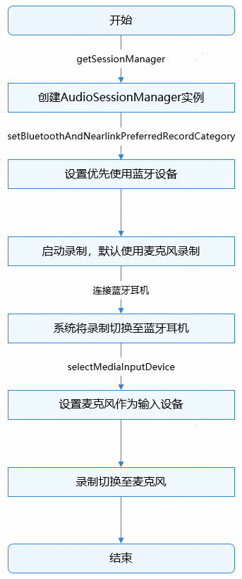
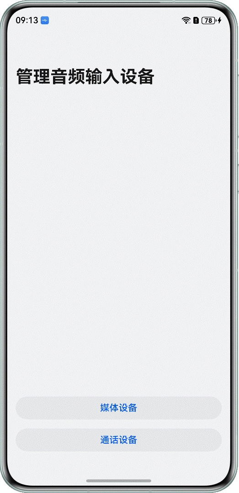

# 管理音频输入设备开发实践

更新时间：2026-05-18 00:55:31

来源：https://developer.huawei.com/consumer/cn/doc/best-practices/bpta-managing-audio-input-devices

##### 概述

 
在录音、语音通话、录制语音消息等场景下，经常需要切换输入设备，例如从手机麦克风切换到蓝牙耳机。因此，开发者需要对系统的音频输入设备进行管理。开发者可使用以下模块实现音频输入设备的管理功能。
  
| 模块 | 应用场景 |
| --- | --- |
| AudioRoutingManager | 管理全局音频输入设备，提供系统输入设备查询及状态变化的监听接口 |
| AudioSessionManager | 管理应用音频输入设备，提供切换输入设备的API接口 |
| AudioCapturer | 管理音频流输入设备，提供音频流输入设备变化的监听接口 |
| AVInputCastPicker | 切换音频输入设备的系统组件，目前仅支持PC/2in1设备 |
 
 
本文基于上述模块提供的能力，指导开发者实现获取输入设备信息、切换输入设备、响应设备变更等场景，并提供开发过程中常见问题的解决方案。
 

##### 获取输入设备信息

 

##### 场景描述

在开始录制音频之前，获取系统的输入设备信息并展示；当设备发生变化时，同步更新设备列表。例如，当蓝牙耳机上线时，将蓝牙耳机添加到设备列表中；当蓝牙耳机下线时，将蓝牙耳机从设备列表中移除。如下图所示：
 


 
 

##### 实现原理

[AudioRoutingManager](https://developer.huawei.com/consumer/cn/doc/harmonyos-references/arkts-apis-audio-audioroutingmanager)提供管理全局音频输入设备的能力，包括查询设备信息、监听设备连接状态变化等。
 
 

##### 开发步骤
1. 创建AudioRoutingManager实例。
```ArkTS
private audioManager = audio.getAudioManager();
// ...
private audioRoutingManager: audio.AudioRoutingManager = this.audioManager.getRoutingManager();
```

2. 使用[AudioRoutingManager.getDevices(deviceFlag: DeviceFlag)](https://developer.huawei.com/consumer/cn/doc/harmonyos-references/arkts-apis-audio-audioroutingmanager#getdevices9-1)获取所有已连接的输入设备。设置deviceFlag参数为[INPUT_DEVICES_FLAG](https://developer.huawei.com/consumer/cn/doc/harmonyos-references/arkts-apis-audio-e#deviceflag)表示获取输入设备。
```ArkTS
// Get all input devices and display them.
async getDevices(inputDeviceType: string) {
  this.deviceType = inputDeviceType;
  this.audioRoutingManager.getDevices(audio.DeviceFlag.INPUT_DEVICES_FLAG)
    .then((audioDeviceDescriptors: audio.AudioDeviceDescriptors) => {
      hilog.info(DOMAIN, 'testTag', '%{public}s',
        `Succeeded in getting devices, AudioDeviceDescriptors: ${JSON.stringify(audioDeviceDescriptors)}.`);
      this.getAvailableDevices();
      this.watchDeviceChange(); // Get changes in the status of audio devices.
      this.watchCurrentInputDeviceChanged(); // Monitor current input device change events.
      let deviceUsage = this.deviceType === CommonConstants.MEDIA_EQUIPMENT ? audio.DeviceUsage.MEDIA_INPUT_DEVICES :
        audio.DeviceUsage.CALL_INPUT_DEVICES;
      this.watchSessionAvailableDeviceChange(deviceUsage); // Available device connection status change events.
      this.watchRoutingAvailableDeviceChange(deviceUsage); // Available device connection status change events.
    })
    .catch((err: BusinessError) => {
      hilog.error(DOMAIN, 'testTag', '%{public}s', `Failed to get devices. error: ${err.code}, ${err.message}`);
    });
}
```

3. 使用[AudioRoutingManager.on('deviceChange')](https://developer.huawei.com/consumer/cn/doc/harmonyos-references/arkts-apis-audio-audioroutingmanager#ondevicechange9)监听输入设备连接状态的变化。
```ArkTS
// Get changes in the status of audio devices.
watchDeviceChange() {
  try {
    this.audioRoutingManager.on('deviceChange', audio.DeviceFlag.INPUT_DEVICES_FLAG,
      (deviceChanged: audio.DeviceChangeAction) => {
        // The device connection status changes, with 0 indicating connection and 1 indicating disconnection.
        if (deviceChanged.type === audio.DeviceChangeType.CONNECT) {
          hilog.info(DOMAIN, 'testTag', '%{public}s',
            'device connected : ' + deviceChanged.deviceDescriptors[0].displayName);
        } else if (deviceChanged.type === audio.DeviceChangeType.DISCONNECT) {
          hilog.info(DOMAIN, 'testTag', '%{public}s',
            'device disconnected : ' + deviceChanged.deviceDescriptors[0].displayName);
        }
      });
  } catch (err) {
    let error = err as BusinessError;
    hilog.error(DOMAIN, 'testTag', '%{public}s', `Failed to deviceChange. error: ${error.code}, ${error.message}`);
  }
}
```

4. 使用[AudioRoutingManager.getAvailableDevices(deviceUsage: DeviceUsage)](https://developer.huawei.com/consumer/cn/doc/harmonyos-references/arkts-apis-audio-audioroutingmanager#getavailabledevices12)获取可用输入设备。通过[DeviceUsage](https://developer.huawei.com/consumer/cn/doc/harmonyos-references/arkts-apis-audio-e#deviceusage12)参数区分不同的使用场景，[MEDIA_INPUT_DEVICES](https://developer.huawei.com/consumer/cn/doc/harmonyos-references/arkts-apis-audio-e#deviceusage12)表示媒体输入设备，[CALL_INPUT_DEVICES](https://developer.huawei.com/consumer/cn/doc/harmonyos-references/arkts-apis-audio-e#deviceusage12)表示通话输入设备。
```ArkTS
// Get the current list of available audio input devices.
getAvailableDevices() {
  let data: audio.AudioDeviceDescriptors = [];
  // Distinguish between media and calling devices.
  let deviceUsage = this.deviceType === CommonConstants.MEDIA_EQUIPMENT ? audio.DeviceUsage.MEDIA_INPUT_DEVICES :
    audio.DeviceUsage.CALL_INPUT_DEVICES;
  try {
    data = this.audioRoutingManager.getAvailableDevices(deviceUsage);
    hilog.info(DOMAIN, 'testTag', '%{public}s',
      `Succeeded in getting availableDevices: ${JSON.stringify(data)}.`);
    AppStorage.setOrCreate(CommonConstants.AVAILABLE_DEVICES, data);
  } catch (err) {
    let error = err as BusinessError;
    hilog.error(DOMAIN, 'testTag', '%{public}s',
      `Failed to getAvailableDevices. error: ${error.code}, ${error.message}`);
  }
}
```

5. 使用[AudioRoutingManager.on('availableDeviceChange')](https://developer.huawei.com/consumer/cn/doc/harmonyos-references/arkts-apis-audio-audioroutingmanager#onavailabledevicechange12)监听可用输入设备的变化，并在设备变化时更新设备列表。
```ArkTS
// Available device connection status change events.
watchRoutingAvailableDeviceChange(deviceUsage: audio.DeviceUsage) {
  let availableDeviceChangeCallback = (deviceChanged: audio.DeviceChangeAction) => {
    let data: audio.AudioDeviceDescriptors = deviceChanged.deviceDescriptors;
    hilog.info(DOMAIN, 'testTag', '%{public}s',
      `Get available device audioRoutingManager ChangeCallback, AudioDeviceDescriptors: ${data}.` +
      JSON.stringify(data));
    this.getAvailableDevices(); // Update available devices.
  };
  try {
    this.audioRoutingManager.on('availableDeviceChange', deviceUsage, availableDeviceChangeCallback);
  } catch (err) {
    let error = err as BusinessError;
    hilog.error(DOMAIN, 'testTag', '%{public}s',
      `Failed to availableDeviceChange. error: ${error.code}, ${error.message}`);
  }
}
```

6. 使用[AudioRoutingManager.getPreferredInputDeviceForCapturerInfo()](https://developer.huawei.com/consumer/cn/doc/harmonyos-references/arkts-apis-audio-audioroutingmanager#getpreferredinputdeviceforcapturerinfo10-1)获取录制使用的设备。通过[AudioCapturerInfo.source](https://developer.huawei.com/consumer/cn/doc/harmonyos-references/arkts-apis-audio-i#audiocapturerinfo8)参数区分不同的使用场景，例如SOURCE_TYPE_MIC表示普通录音，SOURCE_TYPE_VOICE_COMMUNICATION表示语音通话。
```ArkTS
// Get default or preferred input device.
getPreferredInputDevice() {
  this.audioRoutingManager.getPreferredInputDeviceForCapturerInfo(this.audioCapturerInfo,
    (err: BusinessError, audioDeviceDescriptors: audio.AudioDeviceDescriptors) => {
      if (err) {
        hilog.error(DOMAIN, 'testTag', '%{public}s',
          `Failed to get preferred input device for capturer info. Code: ${err.code}, message: ${err.message}`);
      } else {
        hilog.info(DOMAIN, 'testTag', '%{public}s',
          `Succeeded in getting preferred input device for capturer info, AudioDeviceDescriptors: ${JSON.stringify(audioDeviceDescriptors)}.`);
        if (audioDeviceDescriptors.length > 0) {
          AppStorage.setOrCreate(CommonConstants.SELECTED_DEVICE_ID, audioDeviceDescriptors[0].id);
        }
      }
    });
}
```

7. 使用[AudioRoutingManager.on('preferredInputDeviceChangeForCapturerInfo')](https://developer.huawei.com/consumer/cn/doc/harmonyos-references/arkts-apis-audio-audioroutingmanager#onpreferredinputdevicechangeforcapturerinfo10)监听录制设备的变化，并在变化时弹框提示用户。
```ArkTS
// Monitor the status changes of preferred input device.
watchPreferredInputDeviceChange() {
  try {
    this.audioRoutingManager.on('preferredInputDeviceChangeForCapturerInfo', this.audioCapturerInfo,
      (audioDeviceDescriptors: audio.AudioDeviceDescriptors) => {
        hilog.info(DOMAIN, 'testTag', '%{public}s',
          `Succeeded in using on function, AudioDeviceDescriptors: ${JSON.stringify(audioDeviceDescriptors)}.`);
        if (audioDeviceDescriptors.length > 0) {
          AppStorage.setOrCreate(CommonConstants.SELECTED_DEVICE_ID, audioDeviceDescriptors[0].id);
        }
      });
  } catch (err) {
    let error = err as BusinessError;
    hilog.error(DOMAIN, 'testTag', '%{public}s',
      `Failed to preferredInputDeviceChangeForCapturerInfo. error: ${error.code}, ${error.message}`);
  }
}
```

 
 

##### 通过API切换输入设备

 

##### 场景描述

音频流类型对输入设备的选择具有决定性影响，对于不同类型的音频流，系统会自动选择相应的输入设备。例如音频流类型是SOURCE_TYPE_MIC时，系统使用内置麦克风作为音频输入设备。如果默认的输入设备不符合使用需求，应用可以调用相关接口进行修改。
 


 
 

##### 实现原理

使用[AudioSessionManager](https://developer.huawei.com/consumer/cn/doc/harmonyos-references/arkts-apis-audio-audiosessionmanager)管理音频输入设备。通过该组件，可默认将蓝牙设备设为音频输入源，同时支持动态切换不同的媒体输入设备。
 
整体流程如图：
 



 
> [!NOTE]
> 在语音通话场景下，由于输入设备跟随当前输出设备，因此使用AudioSessionManager的API无法切换输入设备。

 
 

##### 开发步骤
1. 创建AudioSessionManager实例。
```ArkTS
private audioManager = audio.getAudioManager();
private audioSessionManager: audio.AudioSessionManager = this.audioManager.getSessionManager();
```

2. 使用[AudioSessionManager.setBluetoothAndNearlinkPreferredRecordCategory(category)](https://developer.huawei.com/consumer/cn/doc/harmonyos-references/arkts-apis-audio-audiosessionmanager#setbluetoothandnearlinkpreferredrecordcategory21)设置优先选择蓝牙设备作为输入设备，当蓝牙设备上线后，会自动切换到蓝牙设备进行录制。通过[category](https://developer.huawei.com/consumer/cn/doc/harmonyos-references/arkts-apis-audio-e#bluetoothandnearlinkpreferredrecordcategory21)参数设置蓝牙设备使用模式，当设置[PREFERRED_NONE](https://developer.huawei.com/consumer/cn/doc/harmonyos-references/arkts-apis-audio-e#bluetoothandnearlinkpreferredrecordcategory21)时，取消优先选择蓝牙设备。
```ArkTS
// Set priority to select Bluetooth devices as input devices.
async setBluetooth(category: number) {
  await this.audioSessionManager.setBluetoothAndNearlinkPreferredRecordCategory(category)
    .then(() => {
      hilog.info(DOMAIN, 'testTag', '%{public}s',
        'Succeeded in doing setBluetoothAndNearlinkPreferredRecordCategory.' + category);
      AppStorage.setOrCreate(CommonConstants.BLUETOOTH_AND_NEARLINK_PREFERRED, category);
    })
    .catch((err: BusinessError) => {
      hilog.error(DOMAIN, 'testTag', '%{public}s',
        `Failed to setBluetoothAndNearlinkPreferredRecordCategory. error: ${err.code}, ${err.message}`);
    });
}
```

3. 使用[AudioSessionManager.selectMediaInputDevice()](https://developer.huawei.com/consumer/cn/doc/harmonyos-references/arkts-apis-audio-audiosessionmanager#selectmediainputdevice21)将用户选择的设备设置为输入设备。
```ArkTS
// Set input device.
async setInputDevice(data: audio.AudioDeviceDescriptor) {
  this.audioSessionManager.selectMediaInputDevice(data).then(() => {
    hilog.info(DOMAIN, 'testTag', '%{public}s', 'Succeeded in doing selectMediaInputDevice.');
    this.getSelectedMediaInputDevice();
  }).catch((err: BusinessError) => {
    hilog.error(DOMAIN, 'testTag', '%{public}s',
      `Failed to selectMediaInputDevice. error: ${err.code}, ${err.message}`);
  });
}
```

4. 使用[AudioSessionManager.on('currentInputDeviceChanged')](https://developer.huawei.com/consumer/cn/doc/harmonyos-references/arkts-apis-audio-audiosessionmanager#oncurrentinputdevicechanged21)监听输入设备变化，当输入设备切换成功后会触发该回调。
```ArkTS
// Monitor current input device change events.
watchCurrentInputDeviceChanged() {
  hilog.info(DOMAIN, 'testTag', '%{public}s', 'currentInputDeviceChangedCallback');
  let currentInputDeviceChangedCallback = (currentInputDeviceChangedEvent: audio.CurrentInputDeviceChangedEvent) => {
    hilog.info(DOMAIN, 'testTag', '%{public}s',
      `reason of currentInputDeviceChanged: ${currentInputDeviceChangedEvent.changeReason} `);
  };
  try {
    this.audioSessionManager.on('currentInputDeviceChanged', currentInputDeviceChangedCallback);
    hilog.info(DOMAIN, 'testTag', '%{public}s', 'currentInputDeviceChanged');
  } catch (err) {
    let error = err as BusinessError;
    hilog.error(DOMAIN, 'testTag', '%{public}s',
      `Failed to currentInputDeviceChangedCallback. error: ${error.code}, ${error.message}`);
  }
}
```

5. 使用[AudioSessionManager.getSelectedMediaInputDevice()](https://developer.huawei.com/consumer/cn/doc/harmonyos-references/arkts-apis-audio-audiosessionmanager#getselectedmediainputdevice21)获取当前设置的输入设备。
```ArkTS
// Get the currently selected input device.
getSelectedMediaInputDevice() {
  try {
    let device: audio.AudioDeviceDescriptor = this.audioSessionManager.getSelectedMediaInputDevice();
    hilog.info(DOMAIN, 'testTag', '%{public}s',
      'Succeeded in doing getSelectedMediaInputDevice.' + JSON.stringify(device) + ',' + device?.id);
    AppStorage.setOrCreate(CommonConstants.SELECTED_DEVICE_ID, device.id);
  } catch (err) {
    let error = err as BusinessError;
    hilog.error(DOMAIN, 'testTag', '%{public}s',
      `Failed to getSelectedMediaInputDevice. error: ${error.code}, ${error.message}`);
  }
}
```

 
 

##### 通过系统组件切换输入设备

 

##### 场景描述

在PC设备上，通过系统提供的录音设备选择组件[AVInputCastPicker](https://developer.huawei.com/consumer/cn/doc/harmonyos-references/ohos-multimedia-avinputcastpicker)切换音频输入设备。
 


 
 

##### 实现原理

系统提供录音设备选择组件[AVInputCastPicker](https://developer.huawei.com/consumer/cn/doc/harmonyos-references/ohos-multimedia-avinputcastpicker)，作为音频输入设备发现与连接的统一入口。点击组件图标将弹出可选设备列表，从列表中选择设备后，即可切换至相应设备。
 
 

##### 开发步骤
1. 在需要切换设备的界面创建AVInputCastPicker组件。
```ArkTS
@Builder
customPickerBuilder() {
  Image($r('app.media.devices'))
    .width('100%')
    .height('100%')
}
```
 
```ArkTS
AVInputCastPicker({
  customPicker: () => this.customPickerBuilder(),
  onStateChange: this.onStateChange
})
```

2. 手动点击AVInputCastPicker组件，并在弹框中选择目标设备，即可切换输入设备。
 
 

##### 响应音频流输入设备变更

 

##### 场景描述

当系统因音频输入设备上下线、用户主动切换设备、设备抢占或设备选择策略变更等导致音频流输入设备变更时，应用可以根据需要做出对应的处理。
 



 
 

##### 实现原理

[AudioCapturer.on('inputDeviceChange')](https://developer.huawei.com/consumer/cn/doc/harmonyos-references/arkts-apis-audio-audiocapturer#oninputdevicechange11)可以监听音频流输入设备变化并返回切换后的设备信息。应用可以根据切换后的新设备做对应的处理。
 
 

##### 开发步骤

使用[AudioCapturer.on('inputDeviceChange')](https://developer.huawei.com/consumer/cn/doc/harmonyos-references/arkts-apis-audio-audiocapturer#oninputdevicechange11)监听到音频流输入设备变化时，显示新设备信息。
```ArkTS
// Monitor the status changes of input device.
watchInputDeviceChange() {
  try {
    // Use the inputDeviceChange method of audioCapturer to listen for changes in input devices.
    this.audioCapturer?.on('inputDeviceChange', (deviceChangeInfo: audio.AudioDeviceDescriptors) => {
      hilog.info(DOMAIN, 'testTag', '%{public}s', `inputDevice id: ${deviceChangeInfo[0].id}`);
      if (deviceChangeInfo.length > 0) {
        AppStorage.setOrCreate(CommonConstants.SELECTED_DEVICE_ID, deviceChangeInfo[0].id);
      }
    });
  } catch (err) {
    // ...
  }
}
```
 
 
 

##### 常见问题

 

##### 确定麦克风是否能够进行录制，判断麦克风是否处于被占用的状态

 
**解决方案**
 
API20提供了[AudioStreamManager.isRecordingAvailable(capturerInfo: AudioCapturerInfo)](https://developer.huawei.com/consumer/cn/doc/harmonyos-references/arkts-apis-audio-audiostreammanager#isrecordingavailable20)接口，设置AudioCapturerInfo.source为Audio.SourceType.SOURCE_TYPE_MIC，然后根据返回值判断麦克风状态。如果返回true，表明可以使用麦克风进行录制；如果返回false，表明麦克风可能已被占用。
 
API20之前，可以初始化一个AudioCapturer对象并开始录音，如果成功，说明可以使用麦克风进行录制；如果失败，表明麦克风可能已被占用。
 

##### 示例代码

- [实现音频输入设备管理功能](https://gitcode.com/HarmonyOS_Samples/managing-audio-input-devices)
