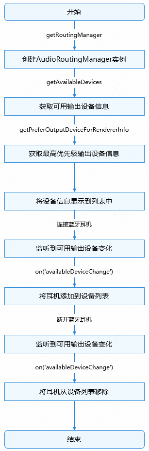

# 管理音频输出设备开发实践

更新时间：2026-05-18 00:55:31

来源：https://developer.huawei.com/consumer/cn/doc/best-practices/bpta-managing-audio-output-devices

##### 概述

 
在播放音乐、播放语音消息、语音通话等场景下，经常需要切换输出设备，例如在音乐播放过程中，断开蓝牙耳机连接后输出设备将从耳机切换至手机扬声器，如果不进行设备管理，就会出现断开连接后音乐在扬声器继续播放，造成不良体验。因此，开发者需要对系统的音频输出设备进行管理。开发者可使用以下模块实现音频输出设备的管理功能：
  
| 模块 | 应用场景 |
| --- | --- |
| AudioRoutingManager | 管理全局音频输出设备，提供系统输出设备查询及状态变化的监听接口 |
| AudioSessionManager | 管理应用音频输出设备，当应用不持有AudioRenderer对象时，管理应用的音频输出设备 |
| AudioRenderer | 管理音频流输出设备，提供音频流输出设备的切换接口及设备变化的监听接口 |
| AVCastPicker | 切换音频输出设备的系统组件 |
 
 
本文基于上述模块提供的能力，指导开发者实现获取输出设备信息、切换输出设备、响应设备变更等场景，并对开发过程中的常见问题提供解决方案。
 

##### 获取输出设备信息

 

##### 场景描述

在开始播放音频前，获取系统的输出设备信息并展示。当设备发生变化时，同步更新设备列表。例如，当蓝牙耳机上线时，将蓝牙耳机添加到设备列表中；当蓝牙耳机下线时，将蓝牙耳机从设备列表中移除。如下图所示：
 


 
 

##### 实现原理

[AudioRoutingManager](https://developer.huawei.com/consumer/cn/doc/harmonyos-references/arkts-apis-audio-audioroutingmanager)提供管理全局音频输出设备的能力，包括查询设备信息、监听设备连接状态变化等。
 
整体流程如图：
 
 



 

##### 开发步骤

1. 创建AudioRoutingManager实例。
```ArkTS
private audioManager = audio.getAudioManager();
// ...
private audioRoutingManager: audio.AudioRoutingManager = this.audioManager.getRoutingManager();
```

2. 使用[AudioRoutingManager.getDevices(deviceFlag: DeviceFlag)](https://developer.huawei.com/consumer/cn/doc/harmonyos-references/arkts-apis-audio-audioroutingmanager#getdevices9-1)获取所有已连接的输出设备。设置deviceFlag参数为[OUTPUT_DEVICES_FLAG](https://developer.huawei.com/consumer/cn/doc/harmonyos-references/arkts-apis-audio-e#deviceflag)，表示获取输出设备。
```ArkTS
// Get all output devices and display them.
async getDevices() {
  this.sceneType = AppStorage.get('outputDeviceType') as string;
  this.audioRoutingManager.getDevices(audio.DeviceFlag.OUTPUT_DEVICES_FLAG)
    .then((audioDeviceDescriptors: audio.AudioDeviceDescriptors) => {
      hilog.info(DOMAIN, 'testTag', '%{public}s',
        `Succeeded in getting devices, AudioDeviceDescriptors: ${JSON.stringify(audioDeviceDescriptors)}.`);
      this.getAvailableDevices();
      this.watchDeviceChange(); // Get changes in the status of audio devices.
      this.watchCurrentOutputDeviceChanged(); // Monitor current output device change events.
      let deviceUsage = this.sceneType === CommonConstants.MEDIA_EQUIPMENT ? audio.DeviceUsage.MEDIA_OUTPUT_DEVICES :
        audio.DeviceUsage.CALL_OUTPUT_DEVICES;
      this.watchSessionAvailableDeviceChange(deviceUsage); // Available device connection status change events.
      this.watchRoutingAvailableDeviceChange(deviceUsage); // Available device connection status change events.
      this.watchAudioSessionDeactivated();
    })
    .catch((err: BusinessError) => {
      hilog.error(DOMAIN, 'testTag', '%{public}s', `Failed to get devices. error: ${err.code}, ${err.message}`);
    });
}
```

3. 使用[AudioRoutingManager.on('deviceChange')](https://developer.huawei.com/consumer/cn/doc/harmonyos-references/arkts-apis-audio-audioroutingmanager#ondevicechange9)监听输出设备连接状态的变化。
```ArkTS
// Get changes in the status of audio devices.
watchDeviceChange() {
  try {
    this.audioRoutingManager.on('deviceChange', audio.DeviceFlag.OUTPUT_DEVICES_FLAG,
      (deviceChanged: audio.DeviceChangeAction) => {
        if (deviceChanged.deviceDescriptors.length > 0) {
          // The device connection status changes, with 0 indicating connection and 1 indicating disconnection.
          if (deviceChanged.type === audio.DeviceChangeType.CONNECT) {
            hilog.info(DOMAIN, 'testTag', '%{public}s',
              'device connected : ' + deviceChanged.deviceDescriptors[0].name);
          } else if (deviceChanged.type === audio.DeviceChangeType.DISCONNECT) {
            hilog.info(DOMAIN, 'testTag', '%{public}s',
              'device disconnected : ' + deviceChanged.deviceDescriptors[0].name);
          }
        }
      });
  } catch (err) {
    hilog.error(DOMAIN, 'testTag', '%{public}s', `Failed to deviceChange. error: ${err.code}, ${err.message}`);
  }
}
```

4. 使用[AudioRoutingManager.getAvailableDevices(deviceUsage: DeviceUsage)](https://developer.huawei.com/consumer/cn/doc/harmonyos-references/arkts-apis-audio-audioroutingmanager#getavailabledevices12)获取可用输出设备。通过[DeviceUsage](https://developer.huawei.com/consumer/cn/doc/harmonyos-references/arkts-apis-audio-e#deviceusage12)参数区分不同的使用场景，[MEDIA_OUTPUT_DEVICES](https://developer.huawei.com/consumer/cn/doc/harmonyos-references/arkts-apis-audio-e#deviceusage12)表示媒体输出设备，[CALL_OUTPUT_DEVICES](https://developer.huawei.com/consumer/cn/doc/harmonyos-references/arkts-apis-audio-e#deviceusage12)表示通话输出设备。
```ArkTS
// Get the current list of available audio output devices.
getAvailableDevices() {
  let data: audio.AudioDeviceDescriptors = [];
  // Distinguish between media and calling devices.
  let deviceUsage = this.sceneType === CommonConstants.MEDIA_EQUIPMENT ? audio.DeviceUsage.MEDIA_OUTPUT_DEVICES :
    audio.DeviceUsage.CALL_OUTPUT_DEVICES;
  try {
    data = this.audioRoutingManager.getAvailableDevices(deviceUsage);
    hilog.info(DOMAIN, 'testTag', '%{public}s',
      `Succeeded in getting availableDevices: ${JSON.stringify(data)}.`);
    AppStorage.setOrCreate('availableDevices', data);
    // ...
  } catch (err) {
    let error = err as BusinessError;
    hilog.error(DOMAIN, 'testTag', '%{public}s',
      `Failed to getAvailableDevices. error: ${error.code}, ${error.message}`);
  }
}
```

5. 使用[AudioRoutingManager.on('availableDeviceChange')](https://developer.huawei.com/consumer/cn/doc/harmonyos-references/arkts-apis-audio-audioroutingmanager#onavailabledevicechange12)监听可用输出设备的变化，并在设备变化时更新设备列表。
```ArkTS
// Available device connection status change events.
watchRoutingAvailableDeviceChange(deviceUsage: audio.DeviceUsage) {
  let availableDeviceChangeCallback = (deviceChanged: audio.DeviceChangeAction) => {
    let data: audio.AudioDeviceDescriptors = deviceChanged.deviceDescriptors;
    hilog.info(DOMAIN, 'testTag', '%{public}s',
      `Get available device audioRoutingManager ChangeCallback, AudioDeviceDescriptors: ${data}.` +
      JSON.stringify(data));
    this.getAvailableDevices();
  };
  try {
    this.audioRoutingManager.on('availableDeviceChange', deviceUsage, availableDeviceChangeCallback);
  } catch (err) {
    hilog.error(DOMAIN, 'testTag', '%{public}s',
      `Failed to availableDeviceChange. error: ${err.code}, ${err.message}`);
  }
}
```

6. 使用[AudioRoutingManager.getPreferOutputDeviceForRendererInfoSync()](https://developer.huawei.com/consumer/cn/doc/harmonyos-references/arkts-apis-audio-audioroutingmanager#getpreferredoutputdeviceforrendererinfosync10)获取播放使用的设备。通过[AudioRendererInfo.usage](https://developer.huawei.com/consumer/cn/doc/harmonyos-references/arkts-apis-audio-i#audiorendererinfo8)参数区分不同的使用场景，例如STREAM_USAGE_MUSIC表示音乐播放，STREAM_USAGE_VOICE_COMMUNICATION表示语音通话。
```ArkTS
// Get default or preferred output device.
getPreferredOutputDevice() {
  try {
    this.deviceDesc = this.audioRoutingManager.getPreferredOutputDeviceForRendererInfoSync(this.audioRendererInfo);
    hilog.info(DOMAIN, 'testTag', '%{public}s',
      `Succeeded in getting prefer output device: ${JSON.stringify(this.deviceDesc)}.`);
  } catch (err) {
    let error = err as BusinessError;
    hilog.error(DOMAIN, 'testTag', '%{public}s',
      `Failed to get prefer output device. Code: ${error.code}, message: ${error.message}`);
  }
  if (this.deviceDesc?.length) {
    AppStorage.setOrCreate('selectedDeviceType', this.deviceDesc[0].deviceType);
  }
  // ...
}
```

7. 使用[AudioRoutingManager.on('preferOutputDeviceChangeForRendererInfo')](https://developer.huawei.com/consumer/cn/doc/harmonyos-references/arkts-apis-audio-audioroutingmanager#onpreferoutputdevicechangeforrendererinfo10)监听播放设备的变化，并在变化时弹框提示用户。
```ArkTS
// Monitor the status changes of preferred output device.
watchPreferredOutputDeviceChange() {
  try {
    this.audioRoutingManager.on('preferOutputDeviceChangeForRendererInfo', this.audioRendererInfo,
      (audioDeviceDescriptors: audio.AudioDeviceDescriptors) => {
        hilog.info(DOMAIN, 'testTag', '%{public}s',
          `AudioDeviceDescriptors watchPreferredOutputDeviceChange: ${JSON.stringify(audioDeviceDescriptors)}.`);
        AppStorage.setOrCreate('selectedDeviceType', audioDeviceDescriptors[0].deviceType);
        // ...
      });
  } catch (err) {
    let error = err as BusinessError;
    hilog.error(DOMAIN, 'testTag', '%{public}s',
      `Failed to preferOutputDeviceChangeForRendererInfo. error: ${error.code}, ${error.message}`);
  }
}
```

 

##### 通过系统组件切换输出设备

 

##### 场景描述

音频流类型对输出设备的选择具有决定性影响，对于不同类型的音频流，系统会自动选择相应的输出设备。例如音频流类型是STREAM_USAGE_VOICE_COMMUNICATION时，系统使用听筒作为音频输出设备。为了提升交互的灵活性，应用可以提供主动切换播放设备的交互入口。下图中底部右侧的按钮，用于展示系统组件的使用方法。
 


 
 

##### 实现原理

系统提供播放设备选择组件[AVCastPicker](https://developer.huawei.com/consumer/cn/doc/harmonyos-references/ohos-multimedia-avcastpicker#avcastpicker)，作为音频输出设备发现与连接的统一入口。点击组件图标时，如果输出设备只有听筒和扬声器，可直接切换设备；否则将弹出可选设备列表，从列表中选择设备后，即可切换至相应设备。
 
 

##### 开发步骤
1. 使用[AVSession.createAVSession(context: Context, tag: string, type: AVSessionType)](https://developer.huawei.com/consumer/cn/doc/harmonyos-references/arkts-apis-avsession-f#avsessioncreateavsession10)创建AVSession。通过[AVSessionType](https://developer.huawei.com/consumer/cn/doc/harmonyos-references/arkts-apis-avsession-t#avsessiontype10)区分不同的使用场景，audio表示音乐播放，voice_call表示语音通话。
```ArkTS
// Create AVSession.
try {
  this.AVSession = await avSession.createAVSession(this.context, 'PLAY_AUDIO', this.sessionType);
  hilog.info(DOMAIN, 'testTag', '%{public}s', `session create successed : sessionId : ${this.AVSession.sessionId}`);
} catch (error) {
  hilog.error(DOMAIN, 'testTag',
    `avSession.createAVSession failed, code: ${error.code}, message: ${error.message}`);
}
```

2. 在需要切换设备的界面创建[AVCastPicker](https://developer.huawei.com/consumer/cn/doc/harmonyos-references/ohos-multimedia-avcastpicker#avcastpicker)组件。
```ArkTS
AVCastPicker({
  normalColor: this.avCastPickerColor,
  activeColor: this.avCastPickerColor,
  onStateChange: (state: AVCastPickerState) => {
    hilog.info(DOMAIN, 'testTag', '%{public}s', `change avcastpicker: ${state}`);
  }
})
```

3. 手动点击AVCastPicker组件，如果输出设备只有听筒和扬声器，可直接切换；否则，需在弹框中选择目标设备，以完成输出设备的切换。
 
 

##### 通过API切换输出设备

 

##### 场景描述

当应用不希望用户通过系统组件手动切换输出设备时，可以使用AudioRenderer API实现设备的切换。例如在应用需要根据使用场景自动切换输出设备或自动设置不同的默认设备时。下图中底部右侧的按钮，在不选择AVCastPicker系统组件时，用于展示AudioRenderer API的使用方法。
 


 
 

##### 实现原理

当音频流类型为语音消息、VoIP语音通话或VoIP视频通话时，可以使用[AudioRenderer](https://developer.huawei.com/consumer/cn/doc/harmonyos-references/arkts-apis-audio-audiorenderer)的接口切换播放设备。支持听筒、扬声器和系统默认设备间的切换。
 
 

##### 开发步骤
1. 通过[audio.createAudioRenderer](https://developer.huawei.com/consumer/cn/doc/harmonyos-references/arkts-apis-audio-f#audiocreateaudiorenderer8)创建AudioRenderer实例。
2. 使用[AudioRenderer.setDefaultOutputDevice(deviceType: DeviceType)](https://developer.huawei.com/consumer/cn/doc/harmonyos-references/arkts-apis-audio-audiorenderer#setdefaultoutputdevice12)切换输出设备。通过[DeviceType](https://developer.huawei.com/consumer/cn/doc/harmonyos-references/arkts-apis-audio-e#devicetype)参数指定输出设备。
```ArkTS
// Set default output device.
async setOutputDevice(deviceType: audio.DeviceType) {
  this.audioRenderer?.setDefaultOutputDevice(deviceType).then(() => {
    hilog.info(DOMAIN, 'testTag', '%{public}s', 'audioRenderer setDefaultOutputDevice Success.');
  }).catch((err: BusinessError) => {
    hilog.error(DOMAIN, 'testTag', '%{public}s', `audioRenderer setDefaultOutputDevice Fail: ${err}`);
  });
}
```

 
 

##### 响应音频流输出设备变更

 

##### 场景描述

当系统出现音频输出设备的上下线、用户主动切换设备、设备抢占或设备选择策略变更等场景，导致音频流输出设备变更时，应用可以根据需要做出对应的处理。例如，在音乐播放过程中摘下耳机，输出设备将从蓝牙耳机切换至手机扬声器，此时应暂停播放，以避免音乐外放。如下图所示：
 


 
 

##### 实现原理

[AudioRenderer.on('outputDeviceChangeWithInfo')](https://developer.huawei.com/consumer/cn/doc/harmonyos-references/arkts-apis-audio-audiorenderer#onoutputdevicechangewithinfo11)可以监听音频流输出设备变化并返回切换后的设备信息。应用可以根据切换后的新设备做对应的处理。
 
 

##### 开发步骤
1. 使用[AudioRenderer.on('outputDeviceChangeWithInfo')](https://developer.huawei.com/consumer/cn/doc/harmonyos-references/arkts-apis-audio-audiorenderer#onoutputdevicechangewithinfo11)监听音频流输出设备变化及原因。
```ArkTS
// Monitor changes in audio stream output devices.
async watchOutputDeviceChangeWithInfo() {
  try {
    this.audioRenderer?.on('outputDeviceChangeWithInfo', (deviceChangeInfo: audio.AudioStreamDeviceChangeInfo) => {
      hilog.info(DOMAIN, 'testTag', '%{public}s', `outputDeviceChangeWithInfo: ${JSON.stringify(deviceChangeInfo)}.`);
      AppStorage.setOrCreate('selectedDeviceType', deviceChangeInfo.devices[0].deviceType);
      // ...
    });
  } catch (err) {
    let error = err as BusinessError;
    hilog.error(DOMAIN, 'testTag', '%{public}s',
      `Failed to watch outputDeviceChangeWithInfo. error: ${error.code}, ${error.message}`);
  }
}
```

2. 当监听到AudioStreamDeviceChangeReason.REASON_OLD_DEVICE_UNAVAILABLE时，如果新设备是扬声器，并且在媒体播放场景，应考虑暂停音频播放。
```ArkTS
switch (deviceChangeInfo.changeReason) {
  case audio.AudioStreamDeviceChangeReason.REASON_OLD_DEVICE_UNAVAILABLE:
    // unavailability event, if the application is in a playback state, it should pause playback.
    if (deviceChangeInfo.devices[0].deviceType === audio.DeviceType.SPEAKER &&
      this.sceneType === CommonConstants.MEDIA_EQUIPMENT) {
      // If the new device is a speaker, pause playback.
      this.pauseAudioRenderer();
    }
    break;
  case audio.AudioStreamDeviceChangeReason.REASON_NEW_DEVICE_AVAILABLE:
    // The application responds to device availability events based on business conditions.
    break;
  case audio.AudioStreamDeviceChangeReason.REASON_OVERRODE:
    // The application responds to device forced selection events based on business conditions.
    break;
  case audio.AudioStreamDeviceChangeReason.REASON_UNKNOWN:
    // The application responds to events of unknown causes based on business conditions.
    break;
}
```

 
 

##### 使用AudioSession管理音频输出设备

 

##### 场景描述

当应用直接持有AudioRenderer对象时，可以[通过API切换输出设备](#section914181801319)；当应用不直接持有AudioRenderer对象，但需要通过API接口切换输出设备时，可以使用[AudioSessionManager](https://developer.huawei.com/consumer/cn/doc/harmonyos-references/arkts-apis-audio-audiosessionmanager)管理音频输出设备。例如在使用播放器的SDK播放音频流或使用[AVPlayer](https://developer.huawei.com/consumer/cn/doc/harmonyos-references/arkts-apis-media-avplayer)/[SoundPool](https://developer.huawei.com/consumer/cn/doc/harmonyos-references/js-apis-inner-multimedia-soundpool)播放音频流时。下图中设备列表的“设置”按钮便是基于AudioSessionManager的能力实现输出设备的切换。
 


 
 

##### 实现原理

使用[AudioSessionManager](https://developer.huawei.com/consumer/cn/doc/harmonyos-references/arkts-apis-audio-audiosessionmanager)的管理应用音频输出设备的相关能力，包括切换输出设备、监听输出设备的变化，实现具体场景下输出设备间的切换。与AudioRenderer相同，仅当音频流类型为语音消息、VoIP语音通话或VoIP视频通话时，支持听筒、扬声器和系统默认设备间的切换。
 
 

##### 开发步骤
1. 创建AudioSessionManager实例。
```ArkTS
private audioManager = audio.getAudioManager();
private audioSessionManager: audio.AudioSessionManager = this.audioManager.getSessionManager();
```

2. 使用[AudioSessionManager.activateAudioSession()](https://developer.huawei.com/consumer/cn/doc/harmonyos-references/arkts-apis-audio-audiosessionmanager#activateaudiosession12)激活AudioSession。
```ArkTS
async activeAudioSession() {
  let isAudioSessionDeactivated: Boolean | undefined = AppStorage.get('isAudioSessionDeactivated');
  if (isAudioSessionDeactivated) {
    let strategy: audio.AudioSessionStrategy = {
      concurrencyMode: audio.AudioConcurrencyMode.CONCURRENCY_DEFAULT
    }
    this.audioSessionManager.activateAudioSession(strategy).then(() => {
      hilog.info(DOMAIN, 'testTag', '%{public}s', 'Succeeded in doing activateAudioSession');
      AppStorage.setOrCreate('isAudioSessionDeactivated', false);
    }).catch((err: BusinessError) => {
      hilog.error(DOMAIN, 'testTag', '%{public}s',
        `Failed to activateAudioSession. error: ${err.code}, ${err.message}`);
    });
  }
}
```

3. 使用[AudioSessionManager.setDefaultOutputDevice()](https://developer.huawei.com/consumer/cn/doc/harmonyos-references/arkts-apis-audio-audiosessionmanager#setdefaultoutputdevice20)将用户选择的设备设置为输出设备。
```ArkTS
// Set output device.
async setOutputDevice(deviceType: audio.DeviceType) {
  // Only the following devices are supported: EARPIECE, SPEAKER, and DEFAULT (system default device).
  hilog.info(DOMAIN, 'testTag', '%{public}s', 'setOutputDevice.');
  this.audioSessionManager.setDefaultOutputDevice(deviceType).then(() => {
    hilog.info(DOMAIN, 'testTag', '%{public}s', 'Succeeded in doing setDefaultOutputDevice.');
    this.activeAudioSession();
    this.getDefaultOutputDevice();
  }).catch((err: BusinessError) => {
    hilog.error(DOMAIN, 'testTag', '%{public}s',
      `Failed to setDefaultOutputDevice. error: ${err.code}, ${err.message}`);
  });
}
```

4. 使用[AudioSessionManager.on('currentOutputDeviceChanged')](https://developer.huawei.com/consumer/cn/doc/harmonyos-references/arkts-apis-audio-audiosessionmanager#oncurrentoutputdevicechanged20)监听输出设备变化，当输出设备切换成功后会触发该回调。
```ArkTS
// Monitor current output device change events.
watchCurrentOutputDeviceChanged() {
  hilog.info(DOMAIN, 'testTag', '%{public}s', 'currentOutputDeviceChangedCallback');
  let currentOutputDeviceChangedCallback =
    (currentOutputDeviceChangedEvent: audio.CurrentOutputDeviceChangedEvent) => {
      hilog.info(DOMAIN, 'testTag', '%{public}s',
        `reason of currentOutputDeviceChanged: ${currentOutputDeviceChangedEvent.changeReason} `);
    };
  try {
    this.audioSessionManager.on('currentOutputDeviceChanged', currentOutputDeviceChangedCallback);
    hilog.info(DOMAIN, 'testTag', '%{public}s', 'currentOutputDeviceChanged');
  } catch (err) {
    let error = err as BusinessError;
    hilog.error(DOMAIN, 'testTag', '%{public}s',
      `Failed to currentOutputDeviceChangedCallback. error: ${error.code}, ${error.message}`);
  }
}
```

 
 

##### 常见问题

 

##### 视频播放时突然自动暂停

**问题描述**
 
视频在播放过程中突然暂停，但未执行暂停操作，也未切换设备。
 
 
**问题根因**
 
使用了错误的监听音频输出设备变化的接口。AudioRoutingManager.on('deviceChange')可以监听到所有设备的连接状态变化，不建议将其作为应用处理自动暂停的依据。
 
**解决方案**
 
使用[AudioRenderer.on('outputDeviceChangeWithInfo')](https://developer.huawei.com/consumer/cn/doc/harmonyos-references/arkts-apis-audio-audiorenderer#onoutputdevicechangewithinfo11)监听音频流输出设备的变化，并响应输出设备的变化，合理暂停，可参考[响应输出设备变更时合理暂停](https://developer.huawei.com/consumer/cn/doc/harmonyos-guides/audio-output-device-change)。
 

##### 示例代码

- [实现音频输出设备管理功能](https://gitcode.com/HarmonyOS_Samples/manage-audio-output-devices)
