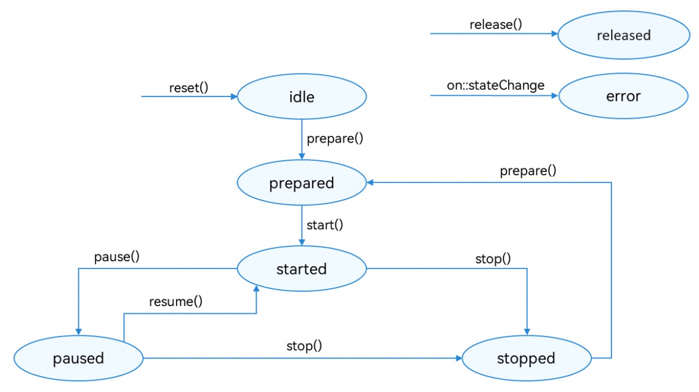

# 基于AVRecorder录制格式化音频（ArkTS）

更新时间：2026-05-18 00:55:31

来源：https://developer.huawei.com/consumer/cn/doc/best-practices/bpta-audio-record-base-on-avrecorder-arkts

**   


#### 概述

AVRecorder集成了音频输入录制、音频编码和媒体封装的功能，可以快速实现音频录制，输出文件格式支持m4a、mp3等格式。本文适用于音频录制类应用的开发，针对市场上主流音频录制类应用的常见场景，介绍了在ArkTS侧基于AVRecorder如何录制格式化音频，指导开发者实现基础录制。
 
基于AVRecorder录制格式化音频（ArkTS）实现的功能效果如下：
 


 
本文的主要内容如下：
 
[基础录制](#section20569101215108)：介绍了在ArkTS侧基于AVRecorder录制格式化音频，包括开始录制、暂停录制、结束录制。
 
 

#### 基础录制

 

#### 实现原理

为了方便开发者录制并输出格式化音频文件，HarmonyOS提供了AVRecorder录制器，用于音频数据采集、音频编码以及音频文件封装等端到端一体化音频录制。AVRecorder输出文件格式支持m4a、mp3等格式，支持设置静音打断和回声消除，便于快速实现音频录制的功能。例如，开发者可以直接调用设备硬件（如麦克风）进行录音，并生成m4a音频文件。
 
AVRecorder提供了开始录制、暂停录制、恢复录制、停止录制、释放资源等功能。其整个开发流程可以概括为：AVRecorder实例创建、采集回调注册（各类事件监听）、音频采集参数配置、采集的开始与停止以及资源的释放等。其中，事件监听主要包括音频焦点中断事件监听和音频录制流状态监听。在创建完实例后，开发者可以调用相关方法使得音频录制流进入对应的状态。如果在某个状态下调用不合适的方法，则可能导致不可预期的错误，所以开发过程中应该严格遵循状态机要求，如只能在paused状态下调用resume()接口。
 
图1 **录制状态变化示意图



 
 
 

#### 开发步骤

1.创建AVRecorder对象。
 
```ArkTS
private avRecorder: media.AVRecorder | undefined = undefined;

// Create an avRecorder instance
public async initAVRecorder() {
  try {
    this.avRecorder = await media.createAVRecorder();
    // Set if recorder want to be muted
    this.avRecorder.setWillMuteWhenInterrupted(true).catch((error: BusinessError) => {
      Logger.error(`Failed to setWillMuteWhenInterrupted, error code: ${error.code}, message: ${error.message}`);
    });
  } catch (err) {
    let error: BusinessError = err as BusinessError;
    Logger.error(`Failed to create avRecorder, error code: ${error.code}, message: ${error.message}`);
  }
}
```
 
2.设置AVRecorder的相关参数，在进入prepare状态后，开启音频录制。
 
- 设置音频录制AVRecorderProfile的参数配置，包括采样率、采样通道、音频格式等。
- 设置音频录制AVRecorderConfig的参数配置，包括音频源类型、录制输出的URL等。
- 调用prepare()接口，进入prepare状态。在进入prepare状态后，调用startRecorder()接口。

 
```ArkTS
// Configure audio recording parameters
public prepareAVRecorder(uiContext: Context | undefined) {
  if (!uiContext) {
    return;
  }
  // Audio recording configuration file
  let avProfile: media.AVRecorderProfile = {
    audioBitrate: 112000, // Audio Bit Rate
    audioChannels: 2, // Number of audio channels
    audioCodec: media.CodecMimeType.AUDIO_MP3, // Audio encoding format
    audioSampleRate: 48000, // Audio sampling rate
    fileFormat: media.ContainerFormatType.CFT_MP3, // Container format
  };

  let filePath: string = uiContext.filesDir + '/example.mp3';
  try {
    let audioFile: fileIo.File = fileIo.openSync(filePath, fileIo.OpenMode.READ_WRITE | fileIo.OpenMode.CREATE | fileIo.OpenMode.TRUNC);
    let fileFd: number = audioFile?.fd as number;
    // Parameter settings for audio recording
    let avConfig: media.AVRecorderConfig = {
      audioSourceType: media.AudioSourceType.AUDIO_SOURCE_TYPE_VOICE_COMMUNICATION, // Audio input source, set as microphone here
      profile: avProfile,
      url: 'fd://' + fileFd.toString(),
    };
    if (this.avRecorder?.state === 'idle' || this.avRecorder?.state === 'stopped') {
      this.avRecorder?.prepare(avConfig, (err: BusinessError) => {
        if (!err) {
          this.startRecorder();
        }
      });
    }
  } catch (error) {
    let err: BusinessError = error as BusinessError;
    Logger.error(`Failed to open file, error code: ${err.code}, message: ${err.message}`);
  }
}
```
 
3.调用start()接口，开始音频录制。
 
```ArkTS
// Start recording
public startRecorder() {
  this.avRecorder?.start((err: BusinessError) => {
    if (!err) {
      Logger.info('Succeeded in start avRecorder');
    }
  });
}
```
 
4.暂停音频录制。
 
```ArkTS
// Pause recording
public pauseRecorder() {
  this.avRecorder?.pause((err: BusinessError) => {
    if (!err) {
      Logger.info('Succeeded in pause avRecorder');
    }
  });
}
```
 
5.恢复音频录制。
 
```ArkTS
// Resume recording
public resumeRecorder() {
  this.avRecorder?.resume((err: BusinessError) => {
    if (!err) {
      Logger.info('Succeeded in resume avRecorder');
    }
  });
}
```
 
6.停止音频录制。
 
```ArkTS
// Stop recording
public stopRecorder() {
  this.avRecorder?.stop((err: BusinessError) => {
    if (!err) {
      Logger.info('Succeeded in stop avRecorder');
    }
  });
}
```
 
7.释放音频录制资源。
 
```ArkTS
// Release audio recording resources
public releaseRecorder() {
  this.avRecorder?.release((err: BusinessError) => {
    if (!err) {
      Logger.info('Succeeded in release avRecorder');
    }
  });
}
```
 
 

#### 常见问题

 

#### 设置静音打断模式

通过调用[setWillMuteWhenInterrupted()](https://developer.huawei.com/consumer/cn/doc/harmonyos-references/arkts-apis-media-avrecorder#setwillmutewheninterrupted20)接口设置是否开启静音打断模式。
 
 

#### 设置回声消除

通过将AudioSourceType值指定为AUDIO_SOURCE_TYPE_VOICE_COMMUNICATION即可。
 
 

#### 示例代码

- [基于AVRecorder录制音频（ArkTS）](https://gitcode.com/HarmonyOS_Samples/avrecorder-record-formatted-audio-arkts)
